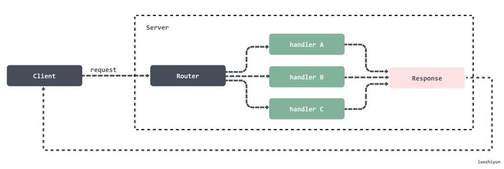
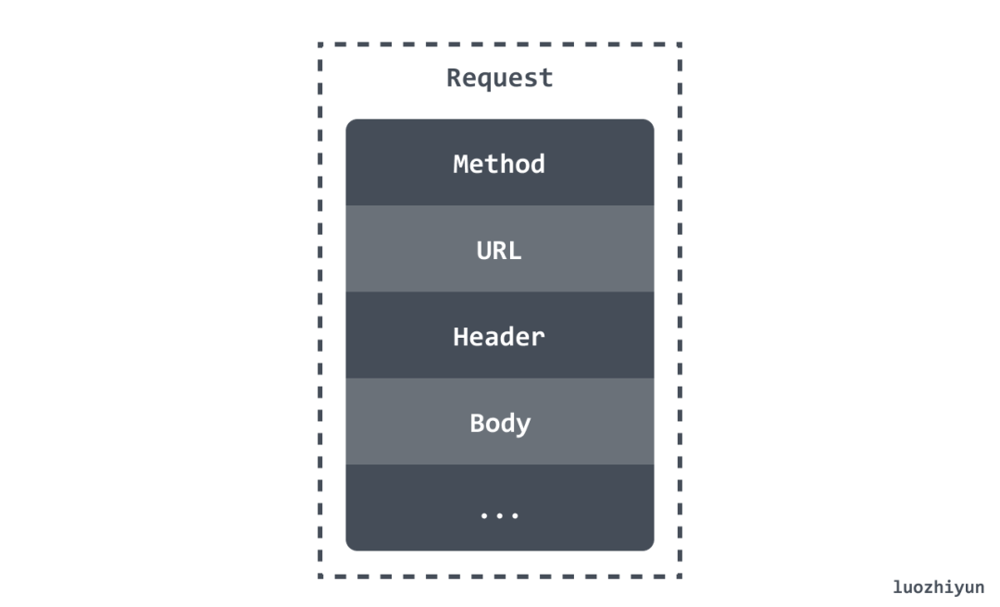
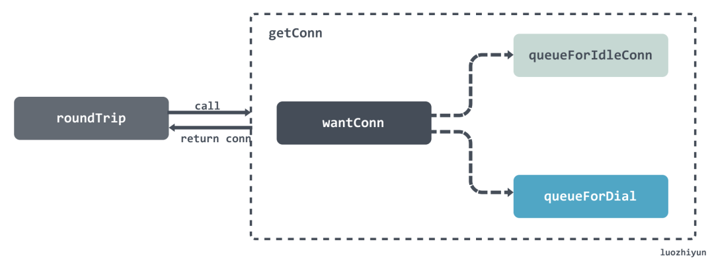
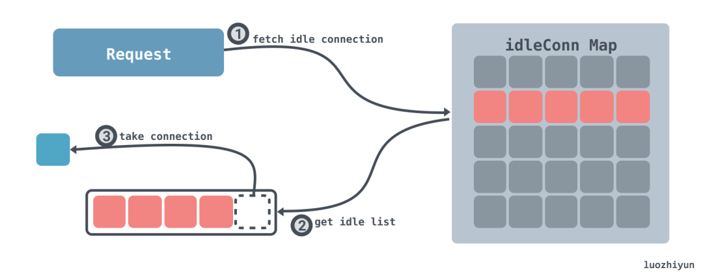
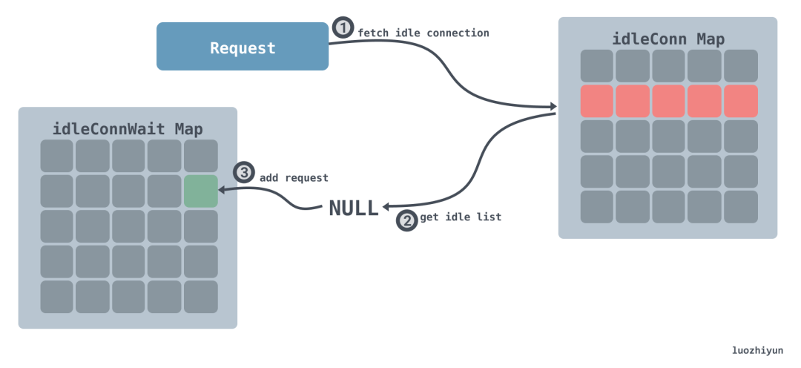
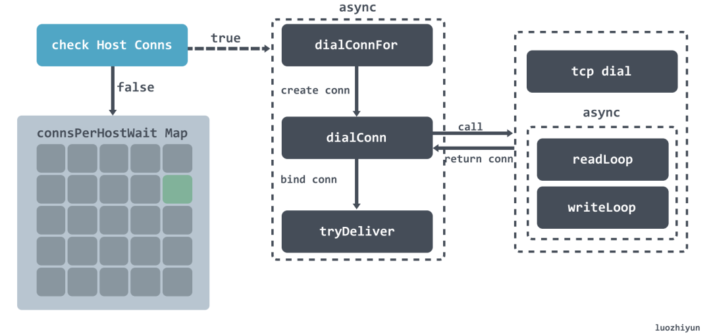
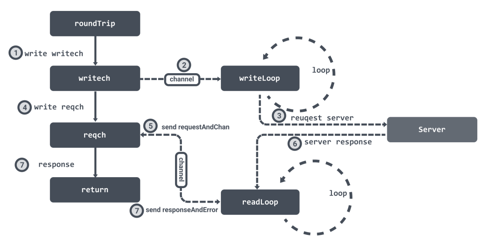
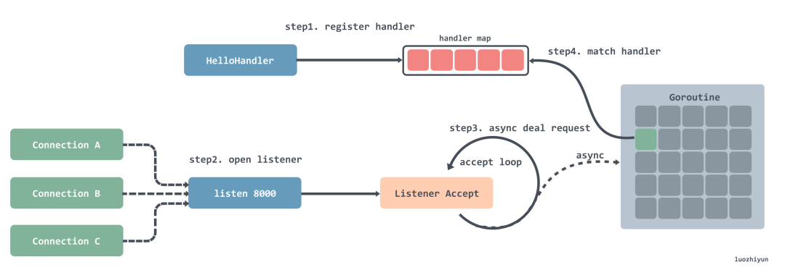

本篇文章来分析一下 Go 语言 HTTP 标准库是如何实现的

> 本文使用的go的源码1.15.7

基于HTTP构建的服务标准模型包括两个端，客户端(`Client`)和服务端(`Server`)。HTTP 请求从客户端发出，服务端接受到请求后进行处理然后将响应返回给客户端。所以http服务器的工作就在于如何接受来自客户端的请求，并向客户端返回响应。

一个典型的 HTTP 服务应该如图所示：



##  HTTP client

在 Go 中可以直接通过 HTTP 包的 Get 方法来发起相关请求数据，一个简单例子：

```
func main() {
 resp, err := http.Get("http://httpbin.org/get?name=luozhiyun&age=27")
 if err != nil {
  fmt.Println(err)
  return
 }
 defer resp.Body.Close()
 body, _ := ioutil.ReadAll(resp.Body)
 fmt.Println(string(body))
}
```

我们下面通过这个例子来进行分析。

HTTP 的 Get 方法会调用到 DefaultClient 的 Get 方法，DefaultClient 是 Client 的一个空实例，所以最后会调用到 Client 的 Get 方法：


### Client 结构体

```
type Client struct { 
 Transport RoundTripper 
 CheckRedirect func(req *Request, via []*Request) error 
 Jar CookieJar 
 Timeout time.Duration
}
```

Client 结构体总共由四个字段组成：

**Transport**：表示 HTTP 事务，用于处理客户端的请求连接并等待服务端的响应；

**CheckRedirect**：用于指定处理重定向的策略；

**Jar**：用于管理和存储请求中的 cookie；

**Timeout**：指定客户端请求的最大超时时间，该超时时间包括连接、任何的重定向以及读取相应的时间；

### 初始化请求

```
func (c *Client) Get(url string) (resp *Response, err error) {
    // 根据方法名、URL 和请求体构建请求
 req, err := NewRequest("GET", url, nil)
 if err != nil {
  return nil, err
 }
    // 执行请求
 return c.Do(req)
}
```

我们要发起一个请求首先需要根据请求类型构建一个完整的请求头、请求体、请求参数。然后才是根据请求的完整结构来执行请求。

#### NewRequest 初始化请求

NewRequest 会调用到 NewRequestWithContext 函数上。这个函数会根据请求返回一个 Request 结构体，它里面包含了一个 HTTP 请求所有信息。

**Request**

Request 结构体有很多字段，我这里列举几个大家比较熟悉的字段：



**NewRequestWithContext**

```
func NewRequestWithContext(ctx context.Context, method, url string, body io.Reader) (*Request, error) {
 ...
 // parse url
 u, err := urlpkg.Parse(url)
 if err != nil {
  return nil, err
 }
 rc, ok := body.(io.ReadCloser)
 if !ok && body != nil {
  rc = ioutil.NopCloser(body)
 } 
 u.Host = removeEmptyPort(u.Host)
 req := &Request{
  ctx:        ctx,
  Method:     method,
  URL:        u,
  Proto:      "HTTP/1.1",
  ProtoMajor: 1,
  ProtoMinor: 1,
  Header:     make(Header),
  Body:       rc,
  Host:       u.Host,
 } 
 ...
 return req, nil
}
```

NewRequestWithContext 函数会将请求封装成一个 Request 结构体并返回。

### 准备 http 发送请求


如上图所示，Client 调用 Do 方法处理发送请求最后会调用到 send 函数中。

```
func (c *Client) send(req *Request, deadline time.Time) (resp *Response, didTimeout func() bool, err error) {
 resp, didTimeout, err = send(req, c.transport(), deadline)
 if err != nil {
  return nil, didTimeout, err
 }
 ...
 return resp, nil, nil
}
```

#### Transport

Client 的 send 方法在调用 send 函数进行下一步的处理前会先调用 transport 方法获取 DefaultTransport 实例，该实例如下：

```
var DefaultTransport RoundTripper = &Transport{
    // 定义 HTTP 代理策略
 Proxy: ProxyFromEnvironment,
 DialContext: (&net.Dialer{
  Timeout:   30 * time.Second,
  KeepAlive: 30 * time.Second,
  DualStack: true,
 }).DialContext,
 ForceAttemptHTTP2:     true,
    // 最大空闲连接数
 MaxIdleConns:          100,
    // 空闲连接超时时间
 IdleConnTimeout:       90 * time.Second,
    // TLS 握手超时时间
 TLSHandshakeTimeout:   10 * time.Second,
 ExpectContinueTimeout: 1 * time.Second,
}
```


Transport 实现 RoundTripper 接口，该结构体会发送 http 请求并等待响应。

```
type RoundTripper interface { 
 RoundTrip(*Request) (*Response, error)
}
```

从 RoundTripper 接口我们也可以看出，该接口定义的 RoundTrip 方法会具体的处理请求，处理完毕之后会响应 Response。

回到我们上面的 Client 的 send 方法中，它会调用 send 函数，这个函数主要逻辑都交给 Transport  的 RoundTrip 方法来执行。


RoundTrip 会调用到 roundTrip 方法中：

```
func (t *Transport) roundTrip(req *Request) (*Response, error) {
 t.nextProtoOnce.Do(t.onceSetNextProtoDefaults)
 ctx := req.Context()
 trace := httptrace.ContextClientTrace(ctx) 
 ...  
 for {
  select {
  case <-ctx.Done():
   req.closeBody()
   return nil, ctx.Err()
  default:
  }

  // 封装请求
  treq := &transportRequest{Request: req, trace: trace, cancelKey: cancelKey} 
  cm, err := t.connectMethodForRequest(treq)
  if err != nil {
   req.closeBody()
   return nil, err
  } 
  // 获取连接
  pconn, err := t.getConn(treq, cm)
  if err != nil {
   t.setReqCanceler(cancelKey, nil)
   req.closeBody()
   return nil, err
  }
  
  // 等待响应结果
  var resp *Response
  if pconn.alt != nil {
   // HTTP/2 path.
   t.setReqCanceler(cancelKey, nil) // not cancelable with CancelRequest
   resp, err = pconn.alt.RoundTrip(req)
  } else {
   resp, err = pconn.roundTrip(treq)
  }
  if err == nil {
   resp.Request = origReq
   return resp, nil
  } 
  ...
 }
}
```

roundTrip 方法会做两件事情：

1. 调用 Transport 的 getConn 方法获取连接；
2. 在获取到连接后，调用 persistConn 的 roundTrip 方法等待请求响应结果；

### 获取连接 getConn

getConn 有两个阶段：

1. 调用 queueForIdleConn 获取空闲 connection；
2. 调用 queueForDial 等待创建新的 connection；



```
func (t *Transport) getConn(treq *transportRequest, cm connectMethod) (pc *persistConn, err error) {
 req := treq.Request
 trace := treq.trace
 ctx := req.Context()
 if trace != nil && trace.GetConn != nil {
  trace.GetConn(cm.addr())
 } 
 // 将请求封装成 wantConn 结构体
 w := &wantConn{
  cm:         cm,
  key:        cm.key(),
  ctx:        ctx,
  ready:      make(chan struct{}, 1),
  beforeDial: testHookPrePendingDial,
  afterDial:  testHookPostPendingDial,
 }
 defer func() {
  if err != nil {
   w.cancel(t, err)
  }
 }()
 
 // 获取空闲连接
 if delivered := t.queueForIdleConn(w); delivered {
  pc := w.pc
  ...
  t.setReqCanceler(treq.cancelKey, func(error) {})
  return pc, nil
 }
 
 // 创建连接
 t.queueForDial(w)
 
 select {
 // 获取到连接后进入该分支
 case <-w.ready:
  ...
  return w.pc, w.err
 ...
}
```

#### 获取空闲连接 queueForIdleConn

成功获取到空闲 connection：



成功获取 connection 分为如下几步：

1. 根据当前的请求的地址去**空闲 connection 字典**中查看存不存在空闲的 connection 列表；
2. 如果能获取到空闲的 connection 列表，那么获取到列表的最后一个 connection；
3. 返回；

获取不到空闲 connection：



当获取不到空闲 connection 时：

1. 根据当前的请求的地址去**空闲 connection 字典**中查看存不存在空闲的 connection 列表；
2. 不存在该请求的 connection 列表，那么将该 wantConn 加入到 **等待获取空闲 connection 字典**中；

从上面的图解应该就很能看出这一步会怎么操作了，这里简要的分析一下代码，让大家更清楚里面的逻辑：

```
func (t *Transport) queueForIdleConn(w *wantConn) (delivered bool) {
 if t.DisableKeepAlives {
  return false
 }

 t.idleMu.Lock()
 defer t.idleMu.Unlock() 
 t.closeIdle = false

 if w == nil { 
  return false
 }
 
 // 计算空闲连接超时时间
 var oldTime time.Time
 if t.IdleConnTimeout > 0 {
  oldTime = time.Now().Add(-t.IdleConnTimeout)
 }
 // Look for most recently-used idle connection.
 // 找到key相同的 connection 列表
 if list, ok := t.idleConn[w.key]; ok {
  stop := false
  delivered := false
  for len(list) > 0 && !stop {
   // 找到connection列表最后一个
   pconn := list[len(list)-1] 
   // 检查这个 connection 是不是等待太久了
   tooOld := !oldTime.IsZero() && pconn.idleAt.Round(0).Before(oldTime)
   if tooOld { 
    go pconn.closeConnIfStillIdle()
   }
   // 该 connection 被标记为 broken 或 闲置太久 continue
   if pconn.isBroken() || tooOld { 
    list = list[:len(list)-1]
    continue
   }
   // 尝试将该 connection 写入到 w 中
   delivered = w.tryDeliver(pconn, nil)
   if delivered {
    // 操作成功，需要将 connection 从空闲列表中移除
    if pconn.alt != nil { 
    } else { 
     t.idleLRU.remove(pconn)
     list = list[:len(list)-1]
    }
   }
   stop = true
  }
  if len(list) > 0 {
   t.idleConn[w.key] = list
  } else {
   // 如果该 key 对应的空闲列表不存在，那么将该key从字典中移除
   delete(t.idleConn, w.key)
  }
  if stop {
   return delivered
  }
 } 
 // 如果找不到空闲的 connection
 if t.idleConnWait == nil {
  t.idleConnWait = make(map[connectMethodKey]wantConnQueue)
 }
  // 将该 wantConn 加入到 等待获取空闲 connection 字典中
 q := t.idleConnWait[w.key] 
 q.cleanFront()
 q.pushBack(w)
 t.idleConnWait[w.key] = q
 return false
}
```

上面的注释已经很清楚了，我这里就不再解释了。

#### 建立连接  queueForDial



在获取不到空闲连接之后，会尝试去建立连接，从上面的图大致可以看到，总共分为以下几个步骤：

1. 在调用 queueForDial 方法的时候会校验 MaxConnsPerHost 是否未设置或已达上限；

2. 1. 检验不通过则将当前的请求放入到 connsPerHostWait 等待字典中；

3. 如果校验通过那么会异步的调用 dialConnFor 方法创建连接；

4. dialConnFor 方法首先会调用 dialConn 方法创建 TCP 连接，然后启动两个异步线程来处理读写数据，然后调用 tryDeliver 将连接绑定到  wantConn 上面。

下面进行代码分析：

```
func (t *Transport) queueForDial(w *wantConn) {
 w.beforeDial()
 // 小于零说明无限制，异步建立连接
 if t.MaxConnsPerHost <= 0 {
  go t.dialConnFor(w)
  return
 }

 t.connsPerHostMu.Lock()
 defer t.connsPerHostMu.Unlock()
 // 每个 host 建立的连接数没达到上限，异步建立连接
 if n := t.connsPerHost[w.key]; n < t.MaxConnsPerHost {
  if t.connsPerHost == nil {
   t.connsPerHost = make(map[connectMethodKey]int)
  }
  t.connsPerHost[w.key] = n + 1
  go t.dialConnFor(w)
  return
 }
 //每个 host 建立的连接数已达到上限，需要进入等待队列
 if t.connsPerHostWait == nil {
  t.connsPerHostWait = make(map[connectMethodKey]wantConnQueue)
 }
 q := t.connsPerHostWait[w.key]
 q.cleanFront()
 q.pushBack(w)
 t.connsPerHostWait[w.key] = q
}
```

这里主要进行参数校验，如果最大连接数限制为零，亦或是每个 host 建立的连接数没达到上限，那么直接异步建立连接。

**dialConnFor**

```
func (t *Transport) dialConnFor(w *wantConn) {
 defer w.afterDial()
 // 建立连接
 pc, err := t.dialConn(w.ctx, w.cm)
 // 连接绑定 wantConn
 delivered := w.tryDeliver(pc, err)
 // 建立连接成功，但是绑定 wantConn 失败
 // 那么将该连接放置到空闲连接字典或调用 等待获取空闲 connection 字典 中的元素执行
 if err == nil && (!delivered || pc.alt != nil) { 
  t.putOrCloseIdleConn(pc)
 }
 if err != nil {
  t.decConnsPerHost(w.key)
 }
}
```

dialConnFor 会调用 dialConn 进行 TCP 连接创建，创建完毕之后调用 tryDeliver 方法和 wantConn 进行绑定。

**dialConn**

```
func (t *Transport) dialConn(ctx context.Context, cm connectMethod) (pconn *persistConn, err error) {
 // 创建连接结构体
 pconn = &persistConn{
  t:             t,
  cacheKey:      cm.key(),
  reqch:         make(chan requestAndChan, 1),
  writech:       make(chan writeRequest, 1),
  closech:       make(chan struct{}),
  writeErrCh:    make(chan error, 1),
  writeLoopDone: make(chan struct{}),
 }
 ...
 if cm.scheme() == "https" && t.hasCustomTLSDialer() {
  ...
 } else {
  // 建立 tcp 连接
  conn, err := t.dial(ctx, "tcp", cm.addr())
  if err != nil {
   return nil, wrapErr(err)
  }
  pconn.conn = conn 
 } 
 ...

 if s := pconn.tlsState; s != nil && s.NegotiatedProtocolIsMutual && s.NegotiatedProtocol != "" {
  if next, ok := t.TLSNextProto[s.NegotiatedProtocol]; ok {
   alt := next(cm.targetAddr, pconn.conn.(*tls.Conn))
   if e, ok := alt.(http2erringRoundTripper); ok {
    // pconn.conn was closed by next (http2configureTransport.upgradeFn).
    return nil, e.err
   }
   return &persistConn{t: t, cacheKey: pconn.cacheKey, alt: alt}, nil
  }
 }

 pconn.br = bufio.NewReaderSize(pconn, t.readBufferSize())
 pconn.bw = bufio.NewWriterSize(persistConnWriter{pconn}, t.writeBufferSize())
 //为每个连接异步处理读写数据
 go pconn.readLoop()
 go pconn.writeLoop()
 return pconn, nil
}
```

这里会根据 schema 的不同设置不同的连接配置，我上面显示的是我们常用的 HTTP 连接的创建过程。对于 HTTP 来说会建立 tcp 连接，然后为连接异步处理读写数据，最后将创建好的连接返回。

### 等待响应

这一部分的内容会稍微复杂一些，但确实非常的有趣。



在创建连接的时候会初始化两个 channel ：writech 负责写入请求数据，reqch负责读取响应数据。我们在上面创建连接的时候，也提到了会为连接创建两个异步循环 readLoop 和 writeLoop 来负责处理读写数据。

在获取到连接之后，会调用连接的 roundTrip 方法，它首先会将请求数据写入到 writech 管道中，writeLoop 接收到数据之后就会处理请求。

然后 roundTrip 会将 requestAndChan 结构体写入到 reqch 管道中，然后 roundTrip 会循环等待。readLoop 读取到响应数据之后就会通过  requestAndChan 结构体中保存的管道将数据封装成 responseAndError 结构体回写，这样 roundTrip 就可以接受到响应数据结束循环等待并返回。

**roundTrip**

```
func (pc *persistConn) roundTrip(req *transportRequest) (resp *Response, err error) {
 ...
 writeErrCh := make(chan error, 1)
 // 将请求数据写入到 writech 管道中
 pc.writech <- writeRequest{req, writeErrCh, continueCh}

 // 用于接收响应的管道
 resc := make(chan responseAndError)
 // 将用于接收响应的管道封装成 requestAndChan 写入到 reqch 管道中
 pc.reqch <- requestAndChan{
  req:        req.Request,
  cancelKey:  req.cancelKey,
  ch:         resc,
  ...
 }
 ...
 for {
  testHookWaitResLoop()
  select { 
  // 接收到响应数据
  case re := <-resc:
   if (re.res == nil) == (re.err == nil) {
    panic(fmt.Sprintf("internal error: exactly one of res or err should be set; nil=%v", re.res == nil))
   }
   if debugRoundTrip {
    req.logf("resc recv: %p, %T/%#v", re.res, re.err, re.err)
   }
   if re.err != nil {
    return nil, pc.mapRoundTripError(req, startBytesWritten, re.err)
   }
   // 返回响应数据
   return re.res, nil
  ...
 }
}
```

这里会封装好 writeRequest 作为发送请求的数据，并将用于接收响应的管道封装成 requestAndChan 写入到 reqch 管道中，然后循环等待接受响应。

然后 writeLoop 会进行请求数据 writeRequest ：

```
func (pc *persistConn) writeLoop() {
 defer close(pc.writeLoopDone)
 for {
  select {
  case wr := <-pc.writech:
   startBytesWritten := pc.nwrite
   // 向 TCP 连接中写入数据，并发送至目标服务器
   err := wr.req.Request.write(pc.bw, pc.isProxy, wr.req.extra, pc.waitForContinue(wr.continueCh))
   ...
  case <-pc.closech:
   return
  }
 }
}
```

这里会将从 writech 管道中获取到的数据写入到 TCP 连接中，并发送至目标服务器。

**readLoop**

```
func (pc *persistConn) readLoop() {
 closeErr := errReadLoopExiting // default value, if not changed below
 defer func() {
  pc.close(closeErr)
  pc.t.removeIdleConn(pc)
 }()
 ... 
 alive := true
 for alive {
  pc.readLimit = pc.maxHeaderResponseSize()
  // 获取 roundTrip 发送的结构体
  rc := <-pc.reqch
  trace := httptrace.ContextClientTrace(rc.req.Context())

  var resp *Response
  if err == nil {
   // 读取数据
   resp, err = pc.readResponse(rc, trace)
  } else {
   err = transportReadFromServerError{err}
   closeErr = err
  }

  ...  
  // 将响应数据写回到管道中
  select {
  case rc.ch <- responseAndError{res: resp}:
  case <-rc.callerGone:
   return
  }
  ...
 }
}
```

这里是从 TCP 连接中读取到对应的请求响应数据，通过 roundTrip 传入的管道再回写，然后 roundTrip 就会接受到数据并获取的响应数据返回。

## http server

我这里继续以一个简单的例子作为开头：

```
func HelloHandler(w http.ResponseWriter, r *http.Request) {
 fmt.Fprintf(w, "Hello World")
}

func main () {
 http.HandleFunc("/", HelloHandler)
 http.ListenAndServe(":8000", nil)
}
```

在实现上面我先用一张图进行简要的介绍一下：



其实我们从上面例子的方法名就可以知道一些大致的步骤：

1. 注册处理器到一个 hash 表中，可以通过键值路由匹配；
2. 注册完之后就是开启循环监听，每监听到一个连接就会创建一个 Goroutine；
3. 在创建好的 Goroutine 里面会循环的等待接收请求数据，然后根据请求的地址去处理器路由表中匹配对应的处理器，然后将请求交给处理器处理；

### 注册处理器

处理器的注册如上面的例子所示，是通过调用 HandleFunc 函数来实现的。


HandleFunc 函数会一直调用到 ServeMux 的 Handle 方法中。

```
func (mux *ServeMux) Handle(pattern string, handler Handler) {
 mux.mu.Lock()
 defer mux.mu.Unlock()
 ...
 e := muxEntry{h: handler, pattern: pattern}
 mux.m[pattern] = e
 if pattern[len(pattern)-1] == '/' {
  mux.es = appendSorted(mux.es, e)
 }

 if pattern[0] != '/' {
  mux.hosts = true
 }
}
```

Handle 会根据路由作为 hash 表的键来保存 `muxEntry` 对象，`muxEntry`封装了 pattern 和 handler。如果路由表达式以`'/'`结尾，则将对应的`muxEntry`对象加入到`[]muxEntry`中。

hash 表是用于路由精确匹配，`[]muxEntry`用于部分匹配。

### 监听

监听是通过调用 ListenAndServe 函数，里面会调用 server 的 ListenAndServe 方法：

```
func (srv *Server) ListenAndServe() error {
 if srv.shuttingDown() {
  return ErrServerClosed
 }
 addr := srv.Addr
 if addr == "" {
  addr = ":http"
 }
    // 监听端口
 ln, err := net.Listen("tcp", addr)
 if err != nil {
  return err
 }
    // 循环接收监听到的网络请求
 return srv.Serve(ln)
}
```

**Serve**

```
func (srv *Server) Serve(l net.Listener) error { 
 ...
 baseCtx := context.Background()  
 ctx := context.WithValue(baseCtx, ServerContextKey, srv)
 for {
  // 接收 listener 过来的网络连接
  rw, err := l.Accept()
  ... 
  tempDelay = 0
  c := srv.newConn(rw)
  c.setState(c.rwc, StateNew) 
  // 创建协程处理连接
  go c.serve(connCtx)
 }
}
```

Serve 这个方法里面会用一个循环去接收监听到的网络连接，然后创建协程处理连接。所以难免就会有一个问题，如果并发很高的话，可能会一次性创建太多协程，导致处理不过来的情况。

### 处理请求

处理请求是通过为每个连接创建 goroutine 来处理对应的请求：

```
func (c *conn) serve(ctx context.Context) {
 c.remoteAddr = c.rwc.RemoteAddr().String()
 ctx = context.WithValue(ctx, LocalAddrContextKey, c.rwc.LocalAddr()) 
 ... 
 ctx, cancelCtx := context.WithCancel(ctx)
 c.cancelCtx = cancelCtx
 defer cancelCtx() 
 c.r = &connReader{conn: c}
 c.bufr = newBufioReader(c.r)
 c.bufw = newBufioWriterSize(checkConnErrorWriter{c}, 4<<10)  
 for {
  // 读取请求
  w, err := c.readRequest(ctx) 
  ... 
  // 根据请求路由调用处理器处理请求
  serverHandler{c.server}.ServeHTTP(w, w.req)
  w.cancelCtx()
  if c.hijacked() {
   return
  }
  w.finishRequest() 
  ...
 }
}
```

当一个连接建立之后，该连接中所有的请求都将在这个协程中进行处理，直到连接被关闭。在 for 循环里面会循环调用 readRequest 读取请求进行处理。

请求处理是通过调用 ServeHTTP 进行的：

```
type serverHandler struct {
   srv *Server
}

func (sh serverHandler) ServeHTTP(rw ResponseWriter, req *Request) {
 handler := sh.srv.Handler
 if handler == nil {
  handler = DefaultServeMux
 }
 if req.RequestURI == "*" && req.Method == "OPTIONS" {
  handler = globalOptionsHandler{}
 }
 handler.ServeHTTP(rw, req)
}
```

serverHandler 其实就是 Server 包装了一层。这里的 `sh.srv.Handler`参数实际上是传入的 ServeMux 实例，所以这里最后会调用到 ServeMux 的 ServeHTTP 方法。


最终会通过 handler 调用到 match 方法进行路由匹配：

```
func (mux *ServeMux) match(path string) (h Handler, pattern string) {
 v, ok := mux.m[path]
 if ok {
  return v.h, v.pattern
 }
 
 for _, e := range mux.es {
  if strings.HasPrefix(path, e.pattern) {
   return e.h, e.pattern
  }
 }
 return nil, ""
}
```

这个方法里首先会利用进行精确匹配，如果匹配成功那么直接返回；匹配不成功，那么会根据 `[]muxEntry`中保存的和当前路由最接近的已注册的父节点路由进行匹配，否则继续匹配下一个父节点路由，直到根路由`/`。最后会调用对应的处理器进行处理。

## Reference

https://cloud.tencent.com/developer/article/1515297

https://duyanghao.github.io/http-transport/

https://draveness.me/golang/docs/part4-advanced/ch09-stdlib/golang-net-http

https://laravelacademy.org/post/21003

https://segmentfault.com/a/1190000021653550
