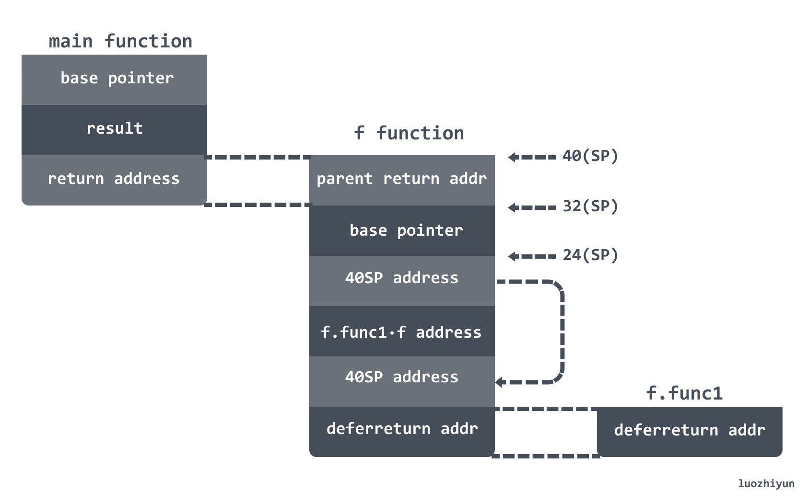
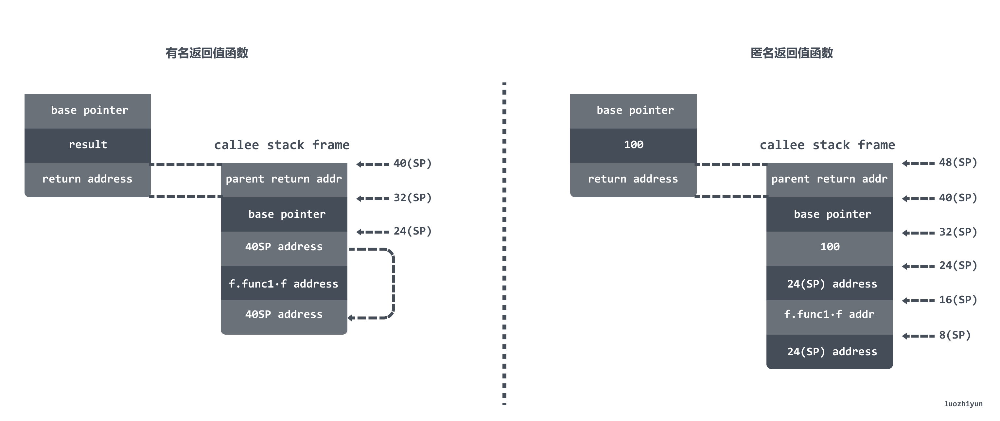

> 本文主要讲解了 `defer`的执行规则，以及对 `defer` 类型做了介绍。主要通过堆上分配来讲解 `defer` 函数调用是如何做的。
>
> 转载请声明出处哦~，本篇文章发布于luozhiyun的博客： https://www.luozhiyun.com/archives/523
>
> 本文使用的go的源码 1.15.7

## 介绍

### defer 执行规则

#### 多个defer的执行顺序为"后进先出LIFO "

```go
package main

import (  
    "fmt"
)

func main() {  
    name := "Naveen"
    fmt.Printf("Original String: %s\n", string(name))
    fmt.Printf("Reversed String: ")
    for _, v := range []rune(name) {
        defer fmt.Printf("%c", v)
    }
} 
```

在上面的例子中，使用 for 循环将字符串 `Naveen`进行遍历后调用 `defer`，这些 `defer`调用仿佛就像被压栈一样，最后被推入堆栈的`defer`调用将被拉出并首先执行。

输出结果如下：

```go
$ go run main.go 
Original String: Naveen
Reversed String: neevaN
```

#### defer 声明时会先计算确定参数的值

```go
func a() {
    i := 0
    defer fmt.Println(i) // 0
    i++
    return
}
```

在这个例子中，变量 i 在 `defer`被调用的时候就已经确定了，而不是在 `defer`执行的时候，所以上面的语句输出的是 0。

#### defer 可以修改有名返回值函数的返回值

如同官方所说：

> For instance, if the deferred function is a function literal and the surrounding function has named result parameters that are in scope within the literal, the deferred function may access and modify the result parameters before they are returned.

上面所说的是，如果一个被`defer`调用的函数是一个 function literal，也就是说是闭包或者匿名函数，并且调用 `defer`的函数时一个有名返回值(named result parameters)的函数，那么 defer 可以直接访问有名返回值并进行修改的。

例子如下：

```go
// f returns 42
func f() (result int) {
    defer func() {
        result *= 7
    }()
    return 6
}
```

但是需要注意的是，只能修改有名返回值(named result parameters)函数，匿名返回值函数是无法修改的，如下：

```go
// f returns 100
func f() int {
    i := 100
    defer func() {
        i++
    }()
    return i
}
```

因为匿名返回值函数是在`return`执行时被声明，因此在`defer`语句中只能访问有名返回值函数，而不能直接访问匿名返回值函数。

### defer 的类型

Go 在 1.13 版本 与 1.14 版本对 `defer` 进行了两次优化，使得 `defer` 的性能开销在大部分场景下都得到大幅降低。

#### 堆上分配

在 Go 1.13 之前所有 `defer` 都是在堆上分配，该机制在编译时：

1. 在 `defer` 语句的位置插入 `runtime.deferproc`，被执行时，`defer` 调用会保存为一个 `runtime._defer `结构体，存入 Goroutine 的`_defer` 链表的最前面；
2. 在函数返回之前的位置插入`runtime.deferreturn`，被执行时，会从 Goroutine 的 `_defer` 链表中取出最前面的`runtime._defer` 并依次执行。

#### 栈上分配

Go 1.13 版本新加入 `deferprocStack` 实现了在栈上分配 `defer`，相比堆上分配，栈上分配在函数返回后 `_defer` 便得到释放，省去了内存分配时产生的性能开销，只需适当维护 `_defer` 的链表即可。按官方文档的说法，这样做提升了约 30% 左右的性能。

除了分配位置的不同，栈上分配和堆上分配并没有本质的不同。

值得注意的是，1.13 版本中并不是所有`defer`都能够在栈上分配。循环中的`defer`，无论是显示的`for`循环，还是`goto`形成的隐式循环，都只能使用堆上分配，即使循环一次也是只能使用堆上分配：

```go
func A1() {
    for i := 0; i < 1; i++ {
        defer println(i)
    }
}

$ GOOS=linux GOARCH=amd64 go tool compile -S main.go
        ...
        0x004e 00078 (main.go:5)        CALL    runtime.deferproc(SB)
        ...
        0x005a 00090 (main.go:5)        CALL    runtime.deferreturn(SB)
        0x005f 00095 (main.go:5)        MOVQ    32(SP), BP
        0x0064 00100 (main.go:5)        ADDQ    $40, SP
        0x0068 00104 (main.go:5)        RET
```

#### 开放编码

Go 1.14 版本加入了开发编码（open coded），该机制会`defer`调用直接插入函数返回之前，省去了运行时的 `deferproc` 或 `deferprocStack` 操作。，该优化可以将 `defer` 的调用开销从 1.13 版本的 ~35ns 降低至 ~6ns 左右。

不过需要满足一定的条件才能触发：

1. 没有禁用编译器优化，即没有设置 `-gcflags "-N"`；
2. 函数内 `defer` 的数量不超过 8 个，且`return`语句与`defer`语句个数的乘积不超过 15；
3. 函数的 `defer` 关键字不能在循环中执行；

### defer 结构体

```go
type _defer struct {
    siz     int32       //参数和结果的内存大小
    started bool
    heap    bool        //是否是堆上分配
    openDefer bool      // 是否经过开放编码的优化
    sp        uintptr   //栈指针
    pc        uintptr   // 调用方的程序计数器
    fn        *funcval  // 传入的函数
    _panic    *_panic   
    link      *_defer   //defer链表
    fd   unsafe.Pointer  
    varp uintptr        
    framepc uintptr
}
```

上面需要注意的几个参数是 `siz`、`heap`、`fn`、`link`、`openDefer`这些参数会在下面的分析中讲到。

## 分析

本文分析时，先从堆上分配讲起，会顺带讲一下 defer 的执行规则为啥是开头所说的那样，然后再讲讲 defer 的栈上分配以及开发编码相关内容。

分析一开始还是基于函数调用来作为入口进行分析，对函数调用还不懂的同学可以看看：《从栈上理解 Go语言函数调用 https://www.luozhiyun.com/archives/518 》。

### 堆上分配

#### 有名函数返回值调用

这里我们还是以上面提到的例子作为开端，从函数调用开始研究一下堆上分配的情况。需要注意的是我在`1.15 版本`上面运行下面的例子并不会直接分配到堆上，需要自己去重新编译一下 Go 源码让 defer 强行分配在堆上：

文件位置：src/cmd/compile/internal/gc/ssa.go

```go
func (s *state) stmt(n *Node) {
    ...
    case ODEFER: 
        if s.hasOpenDefers {
            s.openDeferRecord(n.Left)
        } else {
            d := callDefer
            // 这里需要注释掉
            // if n.Esc == EscNever {
            //  d = callDeferStack
            // }
            s.call(n.Left, d)
        }
    ...
}
```

如果不知道怎么编译的同学，可以看一下这篇：《如何编译调试 Go runtime 源码 https://www.luozhiyun.com/archives/506 》

```go
func main() {
    f()
}

func f() (result int) {
    defer func() {
        result *= 7
    }() 
    return 6
}
```

使用命令打印一下汇编：

```sh
$ GOOS=linux GOARCH=amd64 go tool compile -S -N -l main.go
```

首先看一下 main 函数，其实没什么讲的，非常简单的调用了一下 f 函数：

```assembly
"".main STEXT size=54 args=0x0 locals=0x10
        0x0000 00000 (main.go:3)        TEXT    "".main(SB), ABIInternal, $16-0
        ...
        0x0020 00032 (main.go:4)        CALL    "".f(SB)
        ...
```

下面分段看一下 f 函数的调用情况：

```assembly
"".f STEXT size=126 args=0x8 locals=0x20
        0x0000 00000 (main.go:7)        TEXT    "".f(SB), ABIInternal, $32-8 
        ...
        0x001d 00029 (main.go:7)        MOVQ    $0, "".result+40(SP)        ;; 将常量0 写入40(SP)  
        0x0026 00038 (main.go:8)        MOVL    $8, (SP)                    ;; 将常量8 放入栈顶
        0x002d 00045 (main.go:8)        LEAQ    "".f.func1·f(SB), AX        ;; 将函数f.func1·f地址写入AX
        0x0034 00052 (main.go:8)        MOVQ    AX, 8(SP)                   ;; 将函数f.func1·f地址写入8(SP)
        0x0039 00057 (main.go:8)        LEAQ    "".result+40(SP), AX        ;; 将40(SP)地址值写入AX
        0x003e 00062 (main.go:8)        MOVQ    AX, 16(SP)                  ;; 将AX 保存的地址写入16(SP)
        0x0043 00067 (main.go:8)        PCDATA  $1, $0
        0x0043 00067 (main.go:8)        CALL    runtime.deferproc(SB)       ;; 调用 runtime.deferproc 函数
```

由于`defer`堆上分配会调用 `runtime.deferproc`函数，所以在这段汇编中展示的是 `runtime.deferproc`函数调用前的一段汇编，如果看过《从栈上理解 Go语言函数调用 https://www.luozhiyun.com/archives/518 》，那么上面这段是理解起来很简单的。

因为 `runtime.deferproc`函数的参数就是两个参数，如下：

```go
func deferproc(siz int32, fn *funcval)
```

在函数调用过程中，参数的传递是**从参数列表的右至左压栈**，所以在栈顶压入的是常量8，在 8(SP) 位置压入的是第二参数 `f.func1·f`函数地址。

看到这里可能会有个疑问，在压入常量8的时候大小是 int32 占 4 字节大小，为啥第二参数不从 4(SP) 开始，而是要从 8(SP) 开始，这是因为需要做内存对齐导致的。

除了参数，还需要注意的是 16(SP) 位置压入的是 40(SP) 的地址值。所以整个调用前的栈结构应该如下图：


下面我们看一下`runtime.deferproc`:

文件位置：src/runtime/panic.go

```go
func deferproc(siz int32, fn *funcval) {  
    if getg().m.curg != getg() { 
        throw("defer on system stack")
    }
    // 获取sp指针
    sp := getcallersp()
    // 获取fn函数后指针作为参数
    argp := uintptr(unsafe.Pointer(&fn)) + unsafe.Sizeof(fn)
    callerpc := getcallerpc()
    // 获取一个新的defer
    d := newdefer(siz)
    if d._panic != nil {
        throw("deferproc: d.panic != nil after newdefer")
    }
    // 将 defer 加入到链表中
    d.link = gp._defer
    gp._defer = d
    d.fn = fn
    d.pc = callerpc
    d.sp = sp
    // 进行参数拷贝
    switch siz {
    case 0: 
        //如果defered函数的参数只有指针大小则直接通过赋值来拷贝参数
    case sys.PtrSize:
        // 将 argp 所对应的值 写入到 deferArgs 返回的地址中
        *(*uintptr)(deferArgs(d)) = *(*uintptr)(unsafe.Pointer(argp))
    default:
        // 如果参数大小不是指针大小，那么进行数据拷贝
        memmove(deferArgs(d), unsafe.Pointer(argp), uintptr(siz))
    }

    return0() 
}
```

在调用`deferproc`函数的时候，我们知道，参数`siz`传入的是栈顶的值代表参数大小是 8 ，参数fn传入的 `8(SP)`所对应的地址。

```go
argp := uintptr(unsafe.Pointer(&fn)) + unsafe.Sizeof(fn)
...
*(*uintptr)(deferArgs(d)) = *(*uintptr)(unsafe.Pointer(argp))
```

所以上面这两句的配合实际上是将我们在上图的 16(SP) 中保存的地址值存入到了 `defer`紧挨着的下一个8bytes的内存块中作为 `defer` 的参数。简单的画一个示意图应该是下面这样，`defer`紧挨着的 `argp`里面实际上存的是16(SP) 中保存的地址值：


需要注意的是，这里会通过拷贝的操作来拷贝 argp 值，**所以在 `defer` 被调用的时候，参数已经确定了**，而不是等执行的时候才确定，不过这里拷贝的一个地址值。

并且我们知道，在堆上分配时，`defer`会以链表的形式存放在当前的 Goroutine 中，如果有 3个 `defer`分别被调用，那么最后调用的会在链表最前面：


对于 `newdefer`这个函数来总的来说就是从 P 的本地缓存池里获取，获取不到则从 sched 的全局缓存池里获取一半 `defer` 来填充 P 的本地资源池， 如果还是没有可用的缓存，直接从堆上分配新的 `defer` 和 `args` 。这里的内存分配和内存分配器分配的思路大致雷同，不再分析，感兴趣的可以自己看一下。

下面我们继续回到 f 函数的汇编中：

```assembly
"".f STEXT size=126 args=0x8 locals=0x20 
        ...
        0x004e 00078 (main.go:11)       MOVQ    $6, "".result+40(SP)        ;; 将常量6写入40(SP)，作为返回值
        0x0057 00087 (main.go:11)       XCHGL   AX, AX
        0x0058 00088 (main.go:11)       CALL    runtime.deferreturn(SB)     ;; 调用 runtime.deferreturn 函数
        0x005d 00093 (main.go:11)       MOVQ    24(SP), BP
        0x0062 00098 (main.go:11)       ADDQ    $32, SP
        0x0066 00102 (main.go:11)       RET
```

这里非常简单，直接将常量6写入到 40(SP) 中作为返回值，然后调用 `runtime.deferreturn`执行 `defer`。

下面我们看一下`runtime.deferreturn`:

文件位置：src/runtime/panic.go

```go
func deferreturn(arg0 uintptr) {
    gp := getg()
    d := gp._defer
    if d == nil {
        return
    }
    // 确定 defer 的调用方是不是当前 deferreturn 的调用方
    sp := getcallersp()
    if d.sp != sp {
        return
    }

    switch d.siz {
    case 0:
        // Do nothing.
    case sys.PtrSize:
        // 将 defer 保存的参数复制出来
        // arg0 实际上是 caller SP 栈顶地址值，所以这里实际上是将参数复制到 caller SP 栈顶地址值
        *(*uintptr)(unsafe.Pointer(&arg0)) = *(*uintptr)(deferArgs(d))
    default:
        // 如果参数大小不是 sys.PtrSize，那么进行数据拷贝
        memmove(unsafe.Pointer(&arg0), deferArgs(d), uintptr(d.siz))
    }
    fn := d.fn
    d.fn = nil
    gp._defer = d.link
    //将 defer 对象放入到 defer 池中，后面可以复用
    freedefer(d)

    _ = fn.fn
    // 传入需要执行的函数和参数
    jmpdefer(fn, uintptr(unsafe.Pointer(&arg0)))
}
```

首先要注意的是，这里传入的参数 `arg0`实际上是 caller 调用方的栈顶的值，所以下面这个赋值实际上是将 defer 的参数复制到 caller 调用方栈顶：

```go
*(*uintptr)(unsafe.Pointer(&arg0)) = *(*uintptr)(deferArgs(d))
```

`*(*uintptr)(deferArgs(d))`这里保存的实际上是 caller 调用方 16(SP) 保存的地址值。那么 caller 调用方的栈帧如下图所示：


下面进入到 `runtime.jmpdefer`中看一下如何实现：

位置：src/runtime/asm_amd64.s

```assembly
TEXT runtime·jmpdefer(SB), NOSPLIT, $0-16
    MOVQ    fv+0(FP), DX    // fn 函数地址
    MOVQ    argp+8(FP), BX  // caller sp 调用方 SP
    LEAQ    -8(BX), SP  //  caller 后的调用方 SP
    MOVQ    -8(SP), BP  //  caller 后的调用方 BP
    SUBQ    $5, (SP)    //  获取 runtime.deferreturn 地址值写入栈顶
    MOVQ    0(DX), BX   // BX = DX
    JMP BX  // 执行被 defer 的函数
```

这段汇编非常有意思，`jmpdefer`函数由于是 `runtime.deferreturn`调用的，所以现在的调用栈帧是：


传入到 `jmpdefer`函数的参数是 0(FP) 表示 fn 函数地址，以及 8(FP) 表示的是 f 函数的调用栈的 SP。


所以下面这句代表的是 `runtime.deferreturn`调用栈的 `return address`写入到 SP：

```assembly
LEAQ    -8(BX), SP
```

那么 `-8(SP)` 代表的是 `runtime.deferreturn`调用栈的 `Base Pointer`：

```assembly
MOVQ    -8(SP), BP
```

下面我们重点解释一下为什么要将 SP 指针指向的值减5可以获取到 `runtime.deferreturn`的地址值：

```assembly
SUBQ    $5, (SP)
```

我们回到 f 函数调用的汇编中：

```assembly
(dlv) disass
TEXT main.f(SB) /data/gotest/main.go
        ...
        main.go:11      0x45def8        e8a3e2fcff              call $runtime.deferreturn
        main.go:11      0x45defd        488b6c2418              mov rbp, qword ptr [rsp+0x18]
        ...
```

由于调用完 `runtime.deferreturn` 函数后需要继续返回到 0x45defd 地址值处继续执行，所以在调用 `runtime.deferreturn` 函数时对应的栈帧中 `return address`其实就是 0x45defd。

而在 `jmpdefer`函数中，`(SP)` 对应的值就是 `runtime.deferreturn`调用栈的 `return address`，所以将 0x45defd 减去5 刚好就可以获取到 0x45def8 ，而这个值就是 `runtime.deferreturn`函数的地址值。

那么在最后跳转到 `f.func1` 函数执行的时候，调用栈如下：



调用栈 `(SP)` 的位置实际上存放的是指向 `deferreturn` 函数的指针，所以在`f.func1`函数调用完毕之后会再回到 `deferreturn` 函数,直到 `_defer`链中没有数据为止：

```go
func deferreturn(arg0 uintptr) {
    gp := getg()
    d := gp._defer
    if d == nil {
        return
    }
    ...
}
```

下面再简短的看一下`f.func1`函数调用：

```assembly
"".f.func1 STEXT nosplit size=25 args=0x8 locals=0x0
        0x0000 00000 (main.go:8)        TEXT    "".f.func1(SB), NOSPLIT|ABIInternal, $0-8
        0x0000 00000 (main.go:8)        FUNCDATA        $0, gclocals·1a65e721a2ccc325b382662e7ffee780(SB)
        0x0000 00000 (main.go:8)        FUNCDATA        $1, gclocals·69c1753bd5f81501d95132d08af04464(SB)
        0x0000 00000 (main.go:9)        MOVQ    "".&result+8(SP), AX        ;; 将指向6的地址值写入 AX
        0x0005 00005 (main.go:9)        MOVQ    (AX), AX                    ;; 将 6 写入到 AX
        0x0008 00008 (main.go:9)        LEAQ    (AX)(AX*2), CX              ;; CX = 6*2 +6 =18
        0x000c 00012 (main.go:9)        LEAQ    (AX)(CX*2), AX              ;; AX = 18*2 + 6 =42
        0x0010 00016 (main.go:9)        MOVQ    "".&result+8(SP), CX        ;; 将指向6的地址值写入 CX
        0x0015 00021 (main.go:9)        MOVQ    AX, (CX)                    ;; 将CX地址值指向的值改为42
        0x0018 00024 (main.go:10)       RET
```

这里调用就非常的简单了，获取到 8(SP) 地址值指向的数据然后做运算，然后再将结果写入栈中，返回。

到这里我们基本上把 `defer`的函数的调用整个过程通过堆上分配展示给大家看了。从上面的分析中基本也回答了`defer` 可以修改有名返回值函数的返回值是如何做到的，答案其实就是在`defer`调用过程中传递的 `defer` 参数是一个返回值的指针，所以最后在 `defer`执行的时候会修改返回值。

#### 匿名函数返回值调用

那么如果匿名返回值函数是如何传递的呢？例如下面这种：

```go
// f returns 100
func f() int {
    i := 100
    defer func() {
        i++
    }()
    return i
}
```

下面打印一下汇编：

```go
"".f STEXT size=139 args=0x8 locals=0x28
        0x0000 00000 (main.go:7)        TEXT    "".f(SB), ABIInternal, $40-8
        ...
        0x001d 00029 (main.go:7)        MOVQ    $0, "".~r0+48(SP)       ;;初始化返回值
        0x0026 00038 (main.go:8)        MOVQ    $100, "".i+24(SP)       ;;初始化参数i
        0x002f 00047 (main.go:9)        MOVL    $8, (SP)
        0x0036 00054 (main.go:9)        LEAQ    "".f.func1·f(SB), AX
        0x003d 00061 (main.go:9)        MOVQ    AX, 8(SP)               ;; 将f.func1·f地址值写入8(SP)
        0x0042 00066 (main.go:9)        LEAQ    "".i+24(SP), AX
        0x0047 00071 (main.go:9)        MOVQ    AX, 16(SP)              ;; 将 24(SP) 地址值写入到 16(SP) 
        0x004c 00076 (main.go:9)        PCDATA  $1, $0
        0x004c 00076 (main.go:9)        CALL    runtime.deferproc(SB)
        0x0051 00081 (main.go:9)        TESTL   AX, AX
        0x0053 00083 (main.go:9)        JNE     113
        0x0055 00085 (main.go:9)        JMP     87
        0x0057 00087 (main.go:12)       MOVQ    "".i+24(SP), AX         ;; 将24(SP)的值100写入到AX
        0x005c 00092 (main.go:12)       MOVQ    AX, "".~r0+48(SP)       ;; 将值100写入到48(SP)
        0x0061 00097 (main.go:12)       XCHGL   AX, AX
        0x0062 00098 (main.go:12)       CALL    runtime.deferreturn(SB)
        0x0067 00103 (main.go:12)       MOVQ    32(SP), BP
        0x006c 00108 (main.go:12)       ADDQ    $40, SP
        0x0070 00112 (main.go:12)       RET
```

在上面的输出中我们可以看得出匿名返回值函数的调用中首先会将常量 100 写入到 24(SP) 中，然后将 24(SP) 的地址值写入到 16(SP) ，然后在写返回值的时候是通过 `MOVQ` 指令将 24(SP) 的值写入到 48(SP) 中，也就是说这里完全是值复制，并没有复制指针，所以也就没有修改返回值。

#### 小结

下面通过一个图对比一下两者的在调用完 `runtime.deferreturn`栈帧的情况：



很明显可以看出有名返回值函数会在 16(SP) 的地方保存返回值的地址，而匿名返回值函数会在 16(SP) 的地方保存24(SP) 的地址。

通过上面的一连串的分析也顺带回答了几个问题：

1. defer 是如何传递参数的？

   我们在上面分析的时候会发现，在执行 `deferproc` 函数的时候会先将参数值进行复制到 `defer`内存地址值紧挨着的位置作为参数，如果是指针的传递会直接复制指针，值传递会直接复制值到`defer`参数的位置。

   

   然后在执行`deferreturn`函数的时候会复制参数值到栈中，然后调用`jmpdefer`进行执行 。

   ```go
   func deferreturn(arg0 uintptr) {
   ...
   switch d.siz {
   case 0:
       // Do nothing.
   case sys.PtrSize:
       // 将 defer 保存的参数复制出来
       // arg0 实际上是 caller SP 栈顶地址值，所以这里实际上是将参数复制到 caller SP 栈顶地址值
       *(*uintptr)(unsafe.Pointer(&arg0)) = *(*uintptr)(deferArgs(d))
   default:
          // 如果参数大小不是 sys.PtrSize，那么进行数据拷贝
       memmove(unsafe.Pointer(&arg0), deferArgs(d), uintptr(d.siz))
   }
   ...
   }
   ```

2. 多个 defer 语句是如何执行？

   在调用 `deferproc`函数注册 `defer`的时候会将新元素插在表头，执行的时候也是获取链表头依次执行。

   

3. defer、return、返回值的执行顺序是怎样的？

   对于这个问题，我们将上面例子中的输出的汇编拿过来研究一下就明白了：

   ```assembly
   "".f STEXT size=126 args=0x8 locals=0x20 
          ...
          0x004e 00078 (main.go:11)       MOVQ    $6, "".result+40(SP)        ;; 将常量6写入40(SP)，作为返回值
          0x0057 00087 (main.go:11)       XCHGL   AX, AX
          0x0058 00088 (main.go:11)       CALL    runtime.deferreturn(SB)     ;; 调用 runtime.deferreturn 函数
          0x005d 00093 (main.go:11)       MOVQ    24(SP), BP
          0x0062 00098 (main.go:11)       ADDQ    $32, SP
          0x0066 00102 (main.go:11)       RET
   ```

   从这段汇编中可以知道，对于

   1. 首先是最先设置返回值为常量6；
   2. 然后会调用 `runtime.deferreturn`执行 `defer`链表；
   3. 执行 RET 指令跳转到 caller 函数；

### 栈上分配

在开始的时候也讲到了，在 Go 的 1.13 版本之后加入了 `defer` 的栈上分配，所以和堆上分配有一个区别是在栈上创建 `defer` 的时候是通过 `deferprocStack`进行创建的。

Go 在编译的时候在 SSA 阶段会经过判断，如果是栈上分配，那么会需要直接在函数调用帧上使用编译器来初始化 `_defer` 记录，并作为参数传递给 `deferprocStack`。其他的执行过程和堆上分配并没有什么区别。

对于`deferprocStack`函数我们简单看一下：

文件位置：src/cmd/compile/internal/gc/ssa.go

```go
func deferprocStack(d *_defer) {
    gp := getg()
    if gp.m.curg != gp { 
        throw("defer on system stack")
    } 
    d.started = false
    d.heap = false  // 栈上分配的 _defer
    d.openDefer = false
    d.sp = getcallersp()
    d.pc = getcallerpc()
    d.framepc = 0
    d.varp = 0 
    *(*uintptr)(unsafe.Pointer(&d._panic)) = 0
    *(*uintptr)(unsafe.Pointer(&d.fd)) = 0
    // 将多个 _defer 记录通过链表进行串联
    *(*uintptr)(unsafe.Pointer(&d.link)) = uintptr(unsafe.Pointer(gp._defer))
    *(*uintptr)(unsafe.Pointer(&gp._defer)) = uintptr(unsafe.Pointer(d))

    return0() 
}
```

函数主要功能就是给 `_defer`结构体赋值，并返回。

### 开放编码

Go 语言在 1.14 中通过代码内联优化，使得函数末尾直接对`defer`函数进行调用， 做到几乎不需要额外的开销。在 SSA 的构建阶段 `buildssa`会根据检查是否满足条件，满足条件才会插入开放编码式，由于 SSA 的构建阶段的代码不太好理解，所以下面只给出基本原理，不涉及代码分析。

我们可以对堆上分配的例子进行汇编打印：

```sh
$ GOOS=linux GOARCH=amd64 go tool compile -S  main.go
"".f STEXT size=155 args=0x8 locals=0x30
        0x0000 00000 (main.go:7)        TEXT    "".f(SB), ABIInternal, $48-8
        ...
        0x002e 00046 (main.go:7)        MOVQ    $0, "".~r0+56(SP)
        0x0037 00055 (main.go:8)        MOVQ    $100, "".i+16(SP)
        0x0040 00064 (main.go:9)        LEAQ    "".f.func1·f(SB), AX
        0x0047 00071 (main.go:9)        MOVQ    AX, ""..autotmp_4+32(SP)
        0x004c 00076 (main.go:9)        LEAQ    "".i+16(SP), AX
        0x0051 00081 (main.go:9)        MOVQ    AX, ""..autotmp_5+24(SP)
        0x0056 00086 (main.go:9)        MOVB    $1, ""..autotmp_3+15(SP)
        0x005b 00091 (main.go:12)       MOVQ    "".i+16(SP), AX
        0x0060 00096 (main.go:12)       MOVQ    AX, "".~r0+56(SP)
        0x0065 00101 (main.go:12)       MOVB    $0, ""..autotmp_3+15(SP)
        0x006a 00106 (main.go:12)       MOVQ    ""..autotmp_5+24(SP), AX
        0x006f 00111 (main.go:12)       MOVQ    AX, (SP)
        0x0073 00115 (main.go:12)       PCDATA  $1, $1
        0x0073 00115 (main.go:12)       CALL    "".f.func1(SB)    ;; 直接调用 defer 函数
        0x0078 00120 (main.go:12)       MOVQ    40(SP), BP
        0x007d 00125 (main.go:12)       ADDQ    $48, SP
        0x0081 00129 (main.go:12)       RET
```

我们可以看到上面的的汇编输出中直接将 defer 函数插入到函数末尾进行调用。

在上面的这个例子是很容易优化的，但是如果一个 `defer` 在一个条件语句中，这个条件必须要到运行时才能确定，那么这又该如何优化呢？

在开放编码中还使用了 `defer bit` 延迟比特来判断条件分支是否该执行。这个 延迟比特长度是一个 8 位的二进制码，所以在这项优化中最多只能使用 8 个`defer`，包括条件判断里面的`defer`。每一位是否被设置为 1，来判断延迟语句是否在运行时被设置，如果设置，则发生调用。 否则则不调用。

比如说在下面这篇文章里面讲解了一个例子：

https://go.googlesource.com/proposal/+/refs/heads/master/design/34481-opencoded-defers.md

```go
defer f1(a)
if cond {
 defer f2(b)
}
body...
```

在创建延迟调用的阶段，首先通过延迟比特的特定位置记录哪些带条件的 defer 被触发。

```go
deferBits := 0           // 初始值 00000000
deferBits |= 1 << 0     // 遇到第一个 defer，设置为 00000001
_f1 = f1
_a1 = a1
if cond {
    // 如果第二个 defer 被设置，则设置为 00000011，否则依然为 00000001
    deferBits |= 1 << 1
    _f2 = f2
    _a2 = a2
}
```

在函数返回退出前， `exit` 函数会依次倒序创建对延迟比特的检查代码:

```go
exit:
// 判断 deferBits & 00000010 == 00000010是否成立
if deferBits & 1<<1 != 0 {
 deferBits &^= 1<<1
 tmpF2(tmpB)
}
// 判断 deferBits & 00000001  == 00000001 是否成立
if deferBits & 1<<0 != 0 {
 deferBits &^= 1<<0
 tmpF1(tmpA)
}
```

在函数退出前会判断延迟比特与相应位置的数值进行取与来判断该位置是否为 1，如果为 1，那么表示可以执行该 `defer` 函数。

## 总结

本文主要讲解了 `defer`的执行规则，以及对 `defer` 类型做了介绍。主要通过堆上分配来讲解 `defer` 函数调用是如何做的，如：函数调用来理解" `defer` 的参数传递"、"多个 defer 语句是如何执行"、"以及 defer、return、返回值的执行顺序是怎样"的等这几个问题。通过这样的分析希望大家对 defer 能有更深入的了解。

## Reference

延迟语句 https://golang.design/under-the-hood/zh-cn/part1basic/ch03lang/defer/

defer https://draveness.me/golang/docs/part2-foundation/ch05-keyword/golang-defer/#53-defer

Defer statements https://golang.org/ref/spec#Defer_statements

Proposal: Low-cost defers through inline code, and extra funcdata to manage the panic case https://go.googlesource.com/proposal/+/refs/heads/master/design/34481-opencoded-defers.md

Defer in Practice [https://exlskills.com/learn-en/courses/aap-learn-go-golang–learn_golang_asap/aap-learn–asapgo/beyond-the-basics-YvUaZMowIAIo/defer-aqcApCogZxuV](https://exlskills.com/learn-en/courses/aap-learn-go-golang--learn_golang_asap/aap-learn--asapgo/beyond-the-basics-YvUaZMowIAIo/defer-aqcApCogZxuV)

脱胎换骨的defer https://mp.weixin.qq.com/s/gaC2gmFhJezH-9-uxpz07w

Go defer 深度剖析篇（3）—— 源码分析，深度原理剖析 https://zhuanlan.zhihu.com/p/351177696

Inlined defers in Go https://rakyll.org/inlined-defers/

Go 程序是如何编译成目标机器码的 https://segmentfault.com/a/1190000016523685
