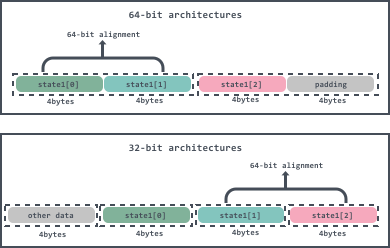

> 转载请声明出处哦~，本篇文章发布于luozhiyun的博客：[https://www.luozhiyun.com](https://www.luozhiyun.com/)
>
> 本文使用的go的源码是14.4

WaitGroup使用大家都会，但是其中是怎么实现的我们也需要知道，这样才能在项目中尽可能的避免由于不正确的使用引发的panic。并且本文也将写一下内存对齐方面做一个解析，喜欢大家喜欢。

## WaitGroup介绍

WaitGroup 提供了三个方法：

```go
    func (wg *WaitGroup) Add(delta int)
    func (wg *WaitGroup) Done()
    func (wg *WaitGroup) Wait()
```

- Add，用来设置 WaitGroup 的计数值；
- Done，用来将 WaitGroup 的计数值减 1，其实就是调用了 Add(-1)；
- Wait，调用这个方法的 goroutine 会一直阻塞，直到 WaitGroup 的计数值变为 0。

例子我就不举了，网上是很多的，下面我们直接进入正题。

## 解析

```go
type noCopy struct{}

type WaitGroup struct {
    // 避免复制使用的一个技巧，可以告诉vet工具违反了复制使用的规则
    noCopy noCopy
    // 一个复合值，用来表示waiter数、计数值、信号量
    state1 [3]uint32
}
// 获取state的地址和信号量的地址
func (wg *WaitGroup) state() (statep *uint64, semap *uint32) {
    if uintptr(unsafe.Pointer(&wg.state1))%8 == 0 {
        // 如果地址是64bit对齐的，数组前两个元素做state，后一个元素做信号量
        return (*uint64)(unsafe.Pointer(&wg.state1)), &wg.state1[2]
    } else {
        // 如果地址是32bit对齐的，数组后两个元素用来做state，它可以用来做64bit的原子操作，第一个元素32bit用来做信号量
        return (*uint64)(unsafe.Pointer(&wg.state1[1])), &wg.state1[0]
    }
}
```

这里刚开始，WaitGroup就秀了一把肌肉，让我们看看大牛是怎么写代码的，思考一个原子操作在不同架构平台上是怎么操作的，在看state方法里面为什么要这么做之前，我们先来看看内存对齐。

### 内存对齐

在维基百科https://en.wikipedia.org/wiki/Data_structure_alignment上我们可以看到对于内存对齐的定义：

> A memory address *a* is said to be *n-byte aligned* when *a* is a multiple of *n* [bytes](https://en.wikipedia.org/wiki/Byte) (where *n* is a power of 2).

简而言之，现在的CPU访问内存的时候是一次性访问多个bytes，比如32位架构一次访问4bytes，该处理器只能从地址为4的倍数的内存开始读取数据，所以要求数据在存放的时候首地址的值是4的倍数存放，者就是所谓的内存对齐。

由于找不到Go语言的对齐规则，我对照了一下C语言的内存对齐的规则，可以和Go语言匹配的上，所以先参照下面的规则。

内存对齐遵循下面三个原则：

1. 结构体变量的**起始地址**能够被其最宽的成员大小整除；
2. 结构体每个成员相对于**起始地址的偏移**能够被其**自身大小整除**，如果不能则在**前一个成员后面**补充字节；
3. 结构体总体大小能够**被最宽的成员的大小**整除，如不能则在**后面**补充字节；

通过下面的例子来实操一下内存对齐：

在32位架构中，int8占1byte，int32占4bytes，int16占2bytes。

```go
type A struct {
    a int8
    b int32
    c int16
}

type B struct {
    a int8
    c int16
    b int32
}

func main() {

    fmt.Printf("arrange fields to reduce size:\n"+
        "A align: %d, size: %d\n" ,
        unsafe.Alignof(A{}), unsafe.Sizeof(A{}) )

    fmt.Printf("arrange fields to reduce size:\n"+
        "B align: %d, size: %d\n" ,
        unsafe.Alignof(B{}), unsafe.Sizeof(B{}) )
}

//output:
//arrange fields to reduce size:
//A align: 4, size: 12
//arrange fields to reduce size:
//B align: 4, size: 8
```

下面以在32位的架构中运行为例子：

在32位架构的系统中默认的对齐大小是4bytes。

假设结构体A中a的起始地址为0x0000，能够被最宽的数据成员大小4bytes（int32）整除，所以从0x0000开始存放占用一个字节即0x0000~0x0001；b是int32，占4bytes，所以要满足条件2，需要在a后面padding3个byte，从0x0004开始；c是int16，占2bytes故从0x0008开始占用两个字节，即0x0008~0x0009；此时整个结构体占用的空间是0x0000~0x0009占用10个字节，10%4 ！= 0, 不满足第三个原则，所以需要在后面补充两个字节，即最后内存对齐后占用的空间是0x0000~0x000B，一共12个字节。


同理，相比结构体B则要紧凑些：


### WaitGroup中state方法的内存对齐

在讲之前需要注意的是noCopy是一个空的结构体，大小为0，不需要做内存对齐，所以大家在看的时候可以忽略这个字段。

在WaitGroup里面，使用了uint32的数组来构造state1字段，然后根据系统的位数的不同构造不同的返回值，下面我面先来说说怎么通过sate1这个字段构建waiter数、计数值、信号量的。

首先`unsafe.Pointer`来获取state1的地址值然后转换成uintptr类型的，然后判断一下这个地址值是否能被8整除，这里通过地址 mod 8的方式来判断地址是否是64位对齐。

因为有内存对齐的存在，在64位架构里面WaitGroup结构体state1起始的位置肯定是64位对齐的，所以在64位架构上用state1前两个元素并成uint64来表示statep，state1最后一个元素表示semap；

那么64位架构上面获取state1的时候能不能第一个元素表示semap，后两个元素拼成64位返回呢？

答案自然是不可以，因为uint32的对齐保证是4bytes，64位架构中一次性处理事务的一个固定长度是8bytes，如果用state1的后两个元素表示一个64位字的字段的话CPU需要读取内存两次，不能保证原子性。

但是在32位架构里面，一个字长是4bytes，要操作64位的数据分布在**两个数据块**中，需要两次操作才能完成访问。如果两次操作中间有可能别其他操作修改，不能保证原子性。

同理32位架构想要原子性的操作8bytes，需要由调用方保证其数据地址是64位对齐的，否则原子访问会有异常，我们在这里https://golang.org/pkg/sync/atomic/#pkg-note-BUG可以看到描述：

> On ARM, x86-32, and 32-bit MIPS, it is the caller’s responsibility to arrange for 64-bit alignment of 64-bit words accessed atomically. The first word in a variable or in an allocated struct, array, or slice can be relied upon to be 64-bit aligned.

所以为了保证64位字对齐，只能让变量或开辟的结构体、数组和切片值中的第一个64位字可以被认为是64位字对齐。但是在使用WaitGroup的时候会有嵌套的情况，不能保证总是让WaitGroup存在于结构体的第一个字段上，所以我们需要增加填充使它能对齐64位字。

在32位架构中，WaitGroup在初始化的时候，分配内存地址的时候是随机的，所以WaitGroup结构体state1起始的位置不一定是64位对齐，可能会是：`uintptr(unsafe.Pointer(&wg.state1))%8 = 4`，如果出现这样的情况，那么就需要用state1的第一个元素做padding，用state1的后两个元素合并成uint64来表示statep。

#### 小结

这里小结一下，因为为了完成上面的这篇内容实在是查阅了很多资料，才得出这样的结果。所以这里小结一下，在64位架构中，CPU每次操作的字长都是8bytes，编译器会自动帮我们把结构体的第一个字段的地址初始化成64位对齐的，所以64位架构上用state1前两个元素并成uint64来表示statep，state1最后一个元素表示semap；

然后在32位架构中，在初始化WaitGroup的时候，编译器只能保证32位对齐，不能保证64位对齐，所以通过`uintptr(unsafe.Pointer(&wg.state1))%8`判断是否等于0来看state1内存地址是否是64位对齐，如果是，那么也和64位架构一样，用state1前两个元素并成uint64来表示statep，state1最后一个元素表示semap，否则用state1的第一个元素做padding，用state1的后两个元素合并成uint64来表示statep。

如果我说错了，欢迎来diss我，我觉得我需要学习的地方还有很多。



### Add 方法

```go
func (wg *WaitGroup) Add(delta int) {
    // 获取状态值
    statep, semap := wg.state()
    ...
    // 高32bit是计数值v，所以把delta左移32，增加到计数上
    state := atomic.AddUint64(statep, uint64(delta)<<32)
    // 获取计数器的值
    v := int32(state >> 32)
    // 获取waiter的值
    w := uint32(state)
    ...
    // 任务计数器不能为负数
    if v < 0 {
        panic("sync: negative WaitGroup counter")
    }
    // wait不等于0说明已经执行了Wait，此时不容许Add
    if w != 0 && delta > 0 && v == int32(delta) {
        panic("sync: WaitGroup misuse: Add called concurrently with Wait")
    }
    // 计数器的值大于或者没有waiter在等待,直接返回
    if v > 0 || w == 0 {
        return
    } 
    if *statep != state {
        panic("sync: WaitGroup misuse: Add called concurrently with Wait")
    }
    // 此时，counter一定等于0，而waiter一定大于0
    // 先把counter置为0，再释放waiter个数的信号量
    *statep = 0
    for ; w != 0; w-- {
        //释放信号量，执行一次释放一个，唤醒一个等待者
        runtime_Semrelease(semap, false, 0)
    }
}
```

1. add方法首先会调用state方法获取statep、semap的值。statep是一个uint64类型的值，高32位用来记录add方法传入的delta值之和；低32位用来表示调用wait方法等待的goroutine的数量，也就是waiter的数量。如下：


1. add方法会调用`atomic.AddUint64`方法将传入的delta左移32位，也就是将counter加上delta的值；
2. 因为计数器counter可能为负数，所以int32来获取计数器的值，waiter不可能为负数，所以使用uint32来获取；
3. 接下来就是一系列的校验，v不能小于零表示任务计数器不能为负数，否则会panic；w不等于，并且v的值等于delta表示wait方法先于add方法执行，此时也会panic，因为waitgroup不允许调用了Wait方法后还调用add方法；
4. v大于零或者w等于零直接返回，说明这个时候不需要释放waiter，所以直接返回；
5. `*statep != state`到了这个校验这里，状态只能是waiter大于零并且counter为零。当waiter大于零的时候是不允许再调用add方法，counter为零的时候也不能调用wait方法，所以这里使用state的值和内存的地址值进行比较，查看是否调用了add或者wait导致state变动，如果有就是非法调用会引起panic；
6. 最后将statep值重置为零，然后释放所有的waiter；

### Wait方法

```go
func (wg *WaitGroup) Wait() {
    statep, semap := wg.state()
    ...
    for {
        state := atomic.LoadUint64(statep)
        // 获取counter
        v := int32(state >> 32)
        // 获取waiter
        w := uint32(state)
        // counter为零,不需要等待直接返回
        if v == 0 {
            ...
            return
        }
        // 使用CAS将waiter加1
        if atomic.CompareAndSwapUint64(statep, state, state+1) {
            ...
            // 挂起等待唤醒
            runtime_Semacquire(semap)
            // 唤醒之后statep不为零,表示WaitGroup又被重复使用,这回panic
            if *statep != 0 {
                panic("sync: WaitGroup is reused before previous Wait has returned")
            }
            ...
            // 直接返回   
            return
        }
    }
}
```

1. Wait方法首先也是调用state方法获取状态值；
2. 进入for循环之后Load statep的值，然后分别获取counter和counter；
3. 如果counter已经为零了，那么直接返回不需要等待；
4. counter不为零，那么使用CAS将waiter加1，由于CAS可能失败，所以for循环会再次的回到这里进行CAS，直到成功；
5. 调用runtime_Semacquire挂起等待唤醒；
6. `*statep != 0`唤醒之后statep不为零,表示WaitGroup又被重复使用,这会panic。需要注意的是waitgroup并不是不让重用，而是不能在wait方法还没运行完就开始重用。

### waitgroup使用小结

看完了waitgroup的add方法与wait方法，我们发现里面有很多校验，使用不当会导致panic，所以我们需要总结一下如何正确使用：

- 不能将计数器设置为负数，否则会发生panic；注意有两种方式会导致计数器为负数，一是调用 Add 的时候传递一个负数，第二是调用 Done 方法的次数过多，超过了 WaitGroup 的计数值；
- 在使用 WaitGroup 的时候，一定要等所有的 Add 方法调用之后再调用 Wait，否则就可能导致 panic；
- wait还没结束就重用 WaitGroup。WaitGroup是可以重用的，但是需要等上一批的goroutine 都调用wait完毕后才能继续重用WaitGroup；

## 总结

waitgroup里面的代码实际上是非常的简单的，这篇文章主要是由waitgroup引入了内存对齐这个概念。由waitgroup带我们看了在实际的代码中是如何利用内存对齐这个概念的，以及如何在32为操作系统中原子性的操作64位长的字段。

除了内存对齐的概念以外通过源码我们也了解到了使用waitgroup的时候需要怎么做才是符合规范的，不会引发panic。

## Reference

http://blog.newbmiao.com/2020/02/10/dig101-golang-struct-memory-align.html

https://gfw.go101.org/article/memory-layout.html

https://golang.org/pkg/sync/atomic/#pkg-note-BUG

https://en.wikipedia.org/wiki/Data_structure_alignment

https://www.zhihu.com/question/27862634
