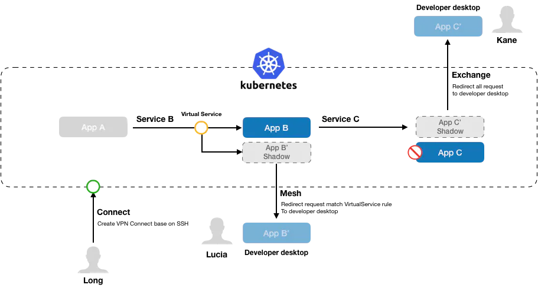
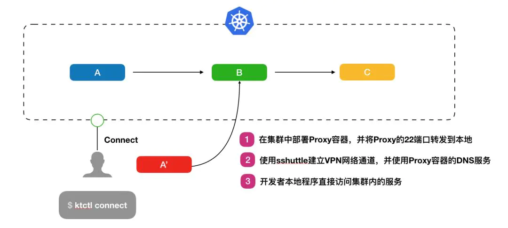
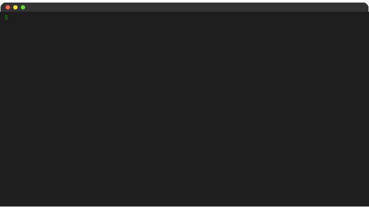
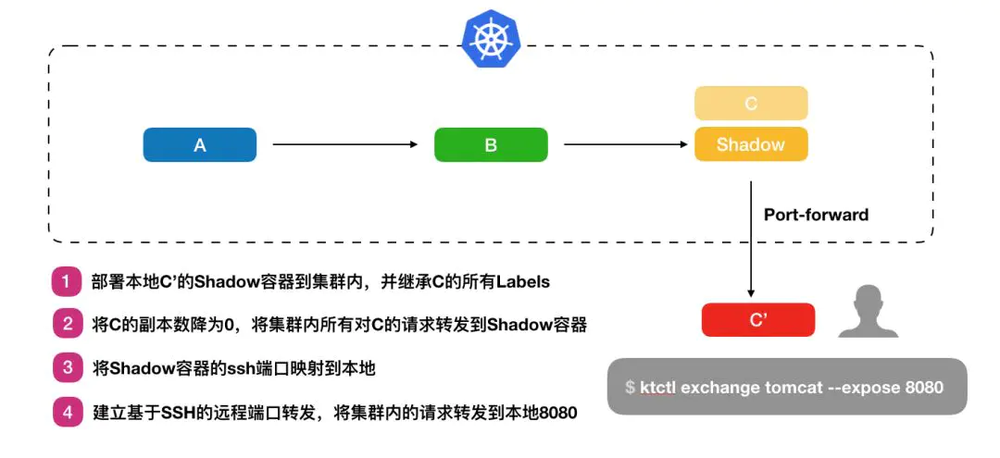
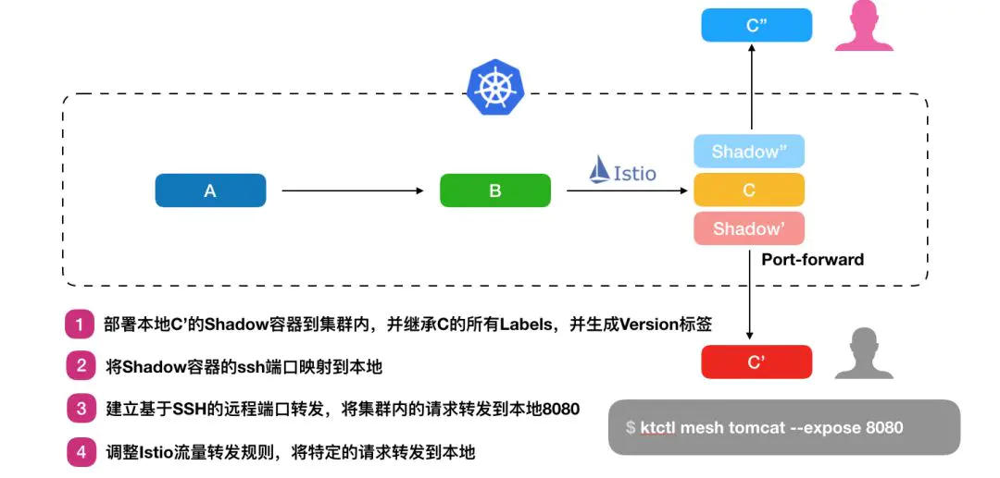
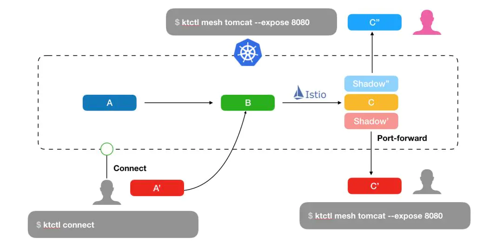
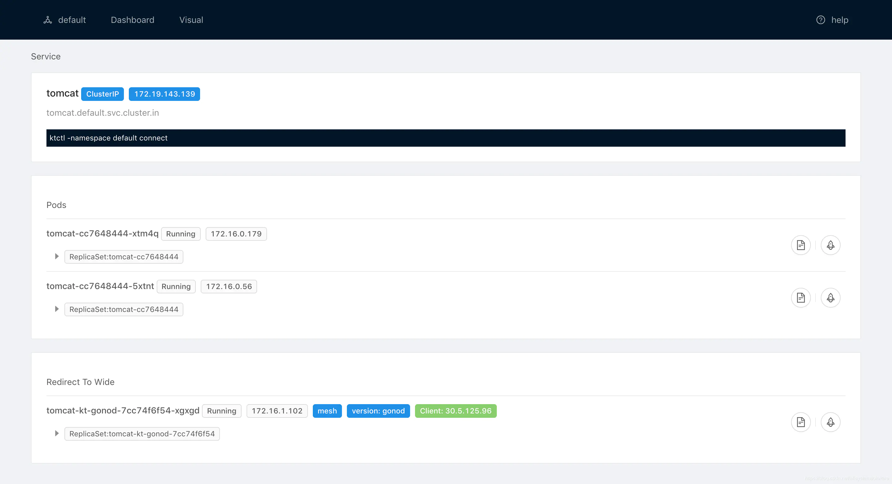

https://ld246-com.translate.goog/article/1573205665774?_x_tr_sl=zh-TW&_x_tr_tl=zh-CN&_x_tr_hl=zh-CN&_x_tr_pto=sc


### 简介

KT Connect （ Kubernetes Developer Tool ） 是轻量级的面向Kubernetes 用户的开发测试环境治理辅助工具。其核心是通过建立本地到集群以及集群到本地的双向通道，从而提升在持续交付生命周期中开发环节的效率问题以及开发测试环境的复用问题：
 

733 x 393 911 x 489


### 使用场景

#### 场景一：本地与远端服务联调

在这种场景下，开发者只要直接使用ktctl connect 打通本地到集群的网络即可，就可以直接在本地通过PodIP/ClusterIP/DNS 地址访问集群中的服务。
 

733 x 331 1080 x 487


 720 x 405


#### 场景二：集群内服务于联调本地

在这个场景下，我们希望集群中所有对服务C 的访问能够请求到本地正在开发的C'。因此开发者可以通过ktctl exhcnage 命令，在集群内部署一个Shadow 容器已接管所有原本对C 实例的请求，再通过Shadow 容器将请求转发到本地。并在退出命令式恢复集群中C 的实例状态。
 

733 x 336 1080 x 495


 720 x 405


#### 场景三：集群内服务于联调本地（共享模式）

mesh 与exchange 的最大区别在于，exchange 会完全替换原有的应用实例。mesh 命令创建代理容器，但是会保留原应用容器，代理容器会动态生成version 标签，以便用于可以通过Istio 流量规则将特定的流量转发到本地，同时保证环境正常链路始终可用。在这种场景下，在确保开发测试环境稳定的同时，基于Istio 的流量规则，我们可以把部分流量转到本地，从而实现在共享的开发测试环境中的联调能力。
 

733 x 351 1080 x 517


 720 x 405


#### 场景四：更复杂的联调场景

在微服务模式下，服务将往往会存在大量的相互依赖。通过connect/exchange/mesh 的组合，可以方便的实现在团队协作下的开发与联调。通过这种方式，开发人员可以极大的提升本地的开发效率，并且可以快速的实现服务与服务之间的集成与测试。
 

733 x 355 1080 x 523


#### Dashboard 可视化

Cli 工具从客户端的角度为研发人员提供了相对便捷的方式能够让研发能够在本地快速完成联调测试，而站在测试环境管理的维度上，我们需要了解测试环境的状态，例如，当前有多少服务是被Exchange 到了开发人员本地，服务一共Mesh 了多少个本地版本？这部分内容在KT Connect 中通过一个集中式的Dashboard 提供相关的能力支撑，我们可以清楚的了解当前服务下运行了容器实例，同时是否有本地环境接入，从而可以更好的支撑多人协作的场景。
 

733 x 398 2880 x 1564


### 安装dashboard

设置RBAC 权限，以使Dashboard 组件能够获取和监听Kubernetes 集群的资源变化
 `rbac-setup.yaml`

```
apiVersion: rbac.authorization.k8s.io/v1beta1
kind: ClusterRole
metadata:
  name: ktadmin
rules:
- apiGroups: [""]
  resources:
  - namespaces
  - nodes
  - nodes/proxy
  - services
  - endpoints
  - pods
  verbs: ["get", "list", "watch"]
- apiGroups:
  - extensions
  resources:
  - ingresses
  verbs: ["get", "list", "watch"]
- nonResourceURLs: ["/metrics"]
  verbs: ["get"]
---
apiVersion: v1
kind: ServiceAccount
metadata:
  name: ktadmin
  namespace: default
---
apiVersion: rbac.authorization.k8s.io/v1beta1
kind: ClusterRoleBinding
metadata:
  name: ktadmin
roleRef:
  apiGroup: rbac.authorization.k8s.io
  kind: ClusterRole
  name: ktadmin
subjects:
- kind: ServiceAccount
  name: ktadmin
  namespace: default
```

创建服务和Deployment 实例
 `dashboard.yaml`

```
apiVersion: v1
kind: Service
metadata:
  name: kt-dashboard
spec:
  ports:
  - port: 80
    targetPort: 80
  selector:
    app: kt-dashboard
  type: NodePort
---
apiVersion: extensions/v1beta1
kind: Deployment
metadata:
  labels:
    app: kt-dashboard
  name: kt-dashboard
spec:
  replicas: 1
  selector:
    matchLabels:
      app: kt-dashboard
  template:
    metadata:
      labels:
        app: kt-dashboard
    spec:
      serviceAccount: ktadmin
      containers:
      - image: registry.cn-shanghai.aliyuncs.com/kube-helm/kt-dashboard:stable
        imagePullPolicy: Always
        name: dashboard
        ports:
        - containerPort: 80
      - image: registry.cn-shanghai.aliyuncs.com/kube-helm/kt-controller:stable
        imagePullPolicy: Always
        name: controller
        ports:
        - containerPort: 8000
```

通过kubectl 部署

```
kubectl apply -f rbac-setup.yaml
kubectl apply -f dashboard.yaml
```

可以通过NodePort 进行访问，或者通过port-forward 在本地访问：

```
$ kubectl port-forward deployments/kt-dashboard 8000:80   
Forwarding from 127.0.0.1:8000 -> 80
Forwarding from [::1]:8000 -> 80
```

创建guest 权限，开发本地配置kubeConfig

```yaml
apiVersion: v1
kind: ServiceAccount
metadata:
  name: guest
  namespace: spt-dev
---
apiVersion: rbac.authorization.k8s.io/v1
kind: ClusterRoleBinding
metadata:
  name: guest:guest
roleRef:
  apiGroup: rbac.authorization.k8s.io
  kind: ClusterRole
  name: guest
subjects:
- kind: ServiceAccount
  name: guest
  namespace: spt-dev
---
apiVersion: rbac.authorization.k8s.io/v1
kind: ClusterRole
metadata:
  annotations:
    rbac.authorization.kubernetes.io/autoupdate: "true"
  name: guest
rules:
- apiGroups:
  - ""
  resources:
  - pods/portforward
  verbs:
  - create
- apiGroups:
  - ""
  resources:
  - configmaps
  - endpoints
  - persistentvolumeclaims
  - pods
  - replicationcontrollers
  - replicationcontrollers/scale
  - serviceaccounts
  - services
  verbs:
  - get
  - list
  - watch
- apiGroups:
  - ""
  resources:
  - bindings
  - events
  - limitranges
  - namespaces/status
  - pods/log
  - pods/exec
  - pods/status
  - replicationcontrollers/status
  - resourcequotas
  - resourcequotas/status
  verbs:
  - get
  - list
  - watch
- apiGroups:
  - ""
  resources:
  - namespaces
  verbs:
  - get
  - list
  - watch
- apiGroups:
  - ""
  resources:
  - pods/exec
  verbs:
  - create
- apiGroups:
  - apps
  resources:
  - daemonsets
  - deployments
  - deployments/scale
  - replicasets
  - replicasets/scale
  - statefulsets
  - statefulsets/scale
  verbs:
  - get
  - list
  - watch
- apiGroups:
  - autoscaling
  resources:
  - horizontalpodautoscalers
  verbs:
  - get
  - list
  - watch
- apiGroups:
  - batch
  resources:
  - cronjobs
  - jobs
  verbs:
  - get
  - list
  - watch
- apiGroups:
  - extensions
  resources:
  - daemonsets
  - deployments
  - deployments/scale
  - ingresses
  - networkpolicies
  - replicasets
  - replicasets/scale
  - replicationcontrollers/scale
  verbs:
  - get
  - list
  - watch
- apiGroups:
  - policy
  resources:
  - poddisruptionbudgets
  verbs:
  - get
  - list
  - watch
- apiGroups:
  - networking.k8s.io
  resources:
  - networkpolicies
  verbs:
  - get
  - list
  - watch
```

### 下载和安装客户端

#### 二进制包

Mac:

- [Darwin amd64](https://ld246-com.translate.goog/forward?goto=https://rdc-incubators.oss-cn-beijing.aliyuncs.com/stable/ktctl_darwin_amd64.tar.gz&_x_tr_sl=zh-TW&_x_tr_tl=zh-CN&_x_tr_hl=zh-CN&_x_tr_pto=sc)
- [Darwin 386](https://ld246-com.translate.goog/forward?goto=https://rdc-incubators.oss-cn-beijing.aliyuncs.com/stable/ktctl_darwin_386.tar.gz&_x_tr_sl=zh-TW&_x_tr_tl=zh-CN&_x_tr_hl=zh-CN&_x_tr_pto=sc)

Linux:

- [Linux Amd64](https://ld246-com.translate.goog/forward?goto=https://rdc-incubators.oss-cn-beijing.aliyuncs.com/stable/ktctl_linux_amd64.tar.gz&_x_tr_sl=zh-TW&_x_tr_tl=zh-CN&_x_tr_hl=zh-CN&_x_tr_pto=sc)
- [Linux 386](https://ld246-com.translate.goog/forward?goto=https://rdc-incubators.oss-cn-beijing.aliyuncs.com/stable/ktctl_linux_386.tar.gz&_x_tr_sl=zh-TW&_x_tr_tl=zh-CN&_x_tr_hl=zh-CN&_x_tr_pto=sc)

#### Mac 用户

安装sshuttle

```
brew install sshuttle
```

下载并安装KT

```
$ curl -OL https://rdc-incubators.oss-cn-beijing.aliyuncs.com/stable/ktctl_darwin_amd64.tar.gz
$ tar -xzvf ktctl_darwin_amd64.tar.gz
$ mv ktctl_darwin_amd64 /usr/local/bin/ktctl
$ ktctl -h
```

#### Linux 用户

安装sshuttle

```
pip install sshuttle
```

下载并安装KT

```
$ curl -OL https://rdc-incubators.oss-cn-beijing.aliyuncs.com/stable/ktctl_linux_amd64.tar.gz
$ tar -xzvf ktctl_linux_amd64.tar.gz
$ mv ktctl_linux_amd64 /usr/local/bin/ktctl
$ ktctl -h
```

#### windows 用户

Windows10 上使用Linux 子系统(WSL) 
 [https://www.cnblogs.com/xiaoliangge/p/9124089.html](https://ld246-com.translate.goog/forward?goto=https://www.cnblogs.com/xiaoliangge/p/9124089.html&_x_tr_sl=zh-TW&_x_tr_tl=zh-CN&_x_tr_hl=zh-CN&_x_tr_pto=sc)

[KT: A simple kubernetes development tools](https://ld246-com.translate.goog/forward?goto=https://alibaba.github.io/kt-connect/%23/guide/windows-support&_x_tr_sl=zh-TW&_x_tr_tl=zh-CN&_x_tr_hl=zh-CN&_x_tr_pto=sc)

### 参考链接

项目地址
 [https://github.com/alibaba/kt-connect](https://ld246-com.translate.goog/forward?goto=https://github.com/alibaba/kt-connect&_x_tr_sl=zh-TW&_x_tr_tl=zh-CN&_x_tr_hl=zh-CN&_x_tr_pto=sc)

帮助和使用文档
 [https://rdc-incubator.github.io/kt-docs/#/zh-cn/](https://ld246-com.translate.goog/forward?goto=https://rdc-incubator.github.io/kt-docs/%23/zh-cn/&_x_tr_sl=zh-TW&_x_tr_tl=zh-CN&_x_tr_hl=zh-CN&_x_tr_pto=sc)

- 


作者：fish2018
链接：https://ld246.com/article/1573205665774
来源：链滴
协议：CC BY-SA 4.0 https://creativecommons.org/licenses/by-sa/4.0/
