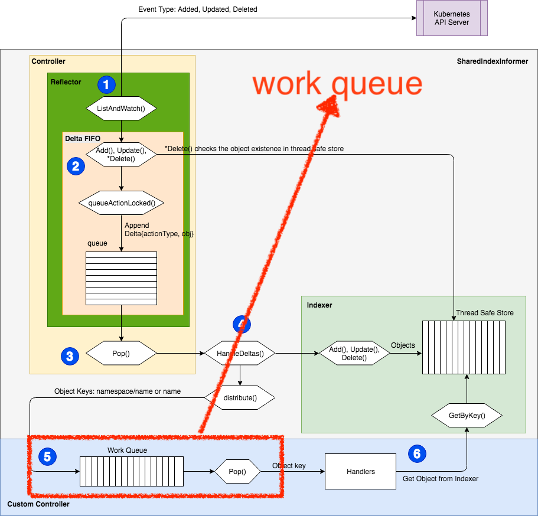
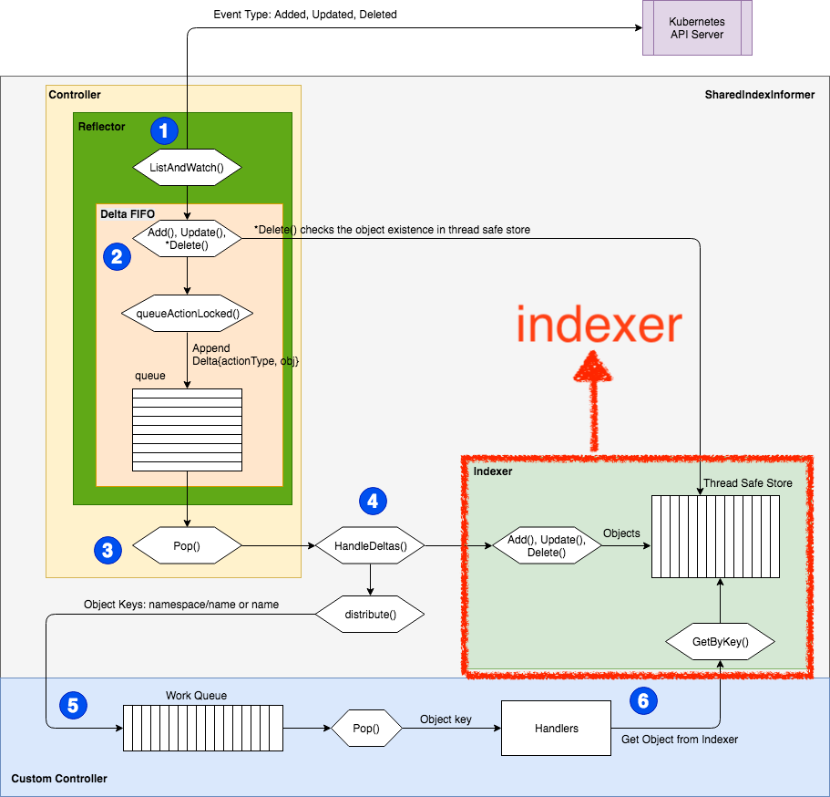
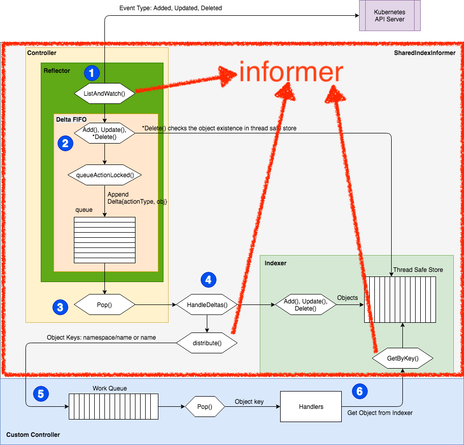

前几章节，我针对Kubernetes work queue 进行了大部分解，回头看看这几篇文之后我发现一个问题，读者可能没办法体会为什么我们要了解kubernetes work queue 的原理与机制以及要work queue 怎么使用，不是按照example controller 抄一抄改一改就好了吗？或是采用某一种框架与架构例如非常有名的operator framework 或是metacontroller 还有很多不同的框架族繁不及备载。

本篇文章将会提出为什么需要了解kubernetes work queue，以及其他在撰写controller 时候需要了解的元件。

如果有见解错误的地方，还麻烦观看本文的大大们提出，感谢！

## controller example

这是透过client go 撰写kubernetes controller 官方所提供的范例，从中我们可以了解搭建一个最基本的controller 需要什么元件。
[source code](https://github.com/kubernetes/client-go/blob/master/examples/workqueue/main.go)

```
// Controller demonstrates how to implement a controller with client-go.
type Controller struct {
	indexer  cache.Indexer                        //帮忙储放资料的元件
	queue    workqueue.RateLimitingInterface      //帮忙资料排队的元件
	informer cache.Controller                     //帮忙向api server 拿资料的元件
}


//上述三个组合于 Controller 资料结构都是 interface ， 只要传入有实作的物件就好


// NewController creates a new Controller.
//传入实作 Rate Limiting queue interface 的物件
//传入实作 interface 的物件
//传入实作 Controller interface 的物件
//那么就得到了一个堪用的 kubernetes controller 了
func NewController(queue workqueue.RateLimitingInterface, indexer cache.Indexer, informer cache.Controller) *Controller {
	return &Controller{
		informer: informer,
		indexer:  indexer,
		queue:    queue,
	}
}

```


### 架构图

看到官方提供的范例，再回头看前些日子我针对kubernetes controller 其中的queue 的分析，我们可以对应着架构图来看，会方便我们理解！
大致可以拆成三块来看

1. work queue
   
2. indexer
   
3. informer
   

上述三个拆分的方式是我个人的理解，如果有误希望有大大可以指点QQ

- informer
  - Reflector
    从api server 拉到kubernetes 的资料（Pod, Deployment etc）进行反序列化丢给Delta queue处理
  - Handle Deltas
    拿到Queue 吐出的资料（Object Key）进行处理，分派给其他work 等
  - Get By Key
    Worker 透过Obejct Key 像Indexer 取得资料（Pod, Deployment etc）
- work queue
  - Reflector为生产者
    - 产出object key 放入work queue按照特定规则排序（如delaying等）
  - Controller为消费者
    - 从work queue 中拿出object key
- Indexer
  - key / value形态的local cache
    - 存放object key跟反序列化后的obejct value（Pod, Deployment etc）

### 小结

从架构图上我们可以看到有几好几个部分需要了解例如Work queue 、 Indexer 、 Informer 。

先前的章节我们了解了Work queue 的各种变化，例如最基础的Common work queue 、 Delaying work queue 、 Ratelimite work queue 等。

后续会逐步介绍Indexer 其中的奥妙与设计理念， Kubernetes 如何在本地端进行cache 以及提供其他元件透过Object key 进行查询。

个人认为复杂与难以理解的informer 放到最后一个章节，这边牵扯的东西非常多也很杂论需要前面几张的铺成，可能會比较好理解吧xD

最后检视官方的的deployment controller 是如何撰写得，把整篇文章的思路与脉络打通。

文章中若有错误或是有疑问的地方欢迎提出，让我们互相学习成长，谢谢！
