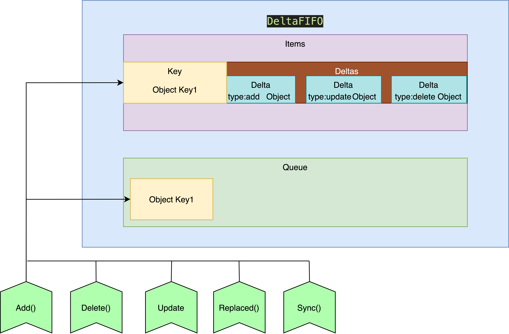
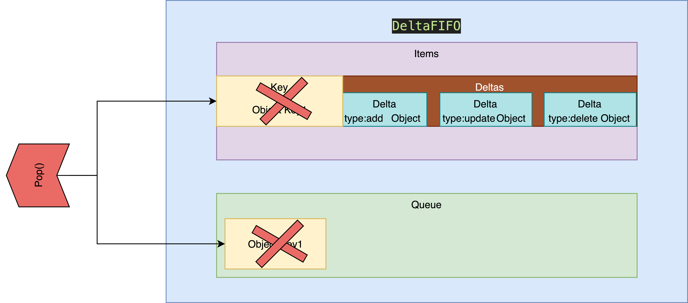

首先本文所有的source code 基于kubernetes 1.19 版本，所有source code 为了版面的整洁会精简掉部分log 相关的程式码，仅保留核心逻辑，如果有见解错误的地方，还麻烦观看本文的大大们提出，感谢！

前面讲了很多Indexer 的实作细节，不知道各位还不记不记得kubernetes controller/operator 的架构，我们再来复习一下整个架构图以及目前我们已经了解的元件～


图片来源： [How to Create a Kubernetes Custom Controller Using client-go](https://itnext.io/how-to-create-a-kubernetes-custom-controller-using-client-go-f36a7a7536cc)


目前我们已经了解

1. Work Queue
   - Reflector ,Delta Queue 为生产者
     产出object key 放入work queue 按照特定规则排序（如delaying等）
   - Controller/Handler 为消费者
     从work queue 中拿出object key
2. Indexer
   - key / value 形态的local cache
     存放object key 跟反序列化后的obejct value（Pod, Deployment etc）

还有许多元件是我们不了解的，例如 `Reflector` 中的list watch 元件、Delta FIFO 元件以及最后 `Handler` 如何从work queue 中取出object Key 到indexer 查找资料。

本章节先从 `Reflector` 中的Delta FIFO 元件进行剖析，用以了解当 `Reflector` 中的list watch 观察到物件变化后如何存到indexer 以及把Object key 传递给work queue，做到承上启下的作用。

## DeltaFIFO

kubernetes source code 设计得非常精美，我们可以先从interface 定义了哪些方法来推敲实作这个interface 的物件可能有什么功能。

### interface

由于GO 语言判断struct 有没有实作(**实现接口**)interface 采用隐式的判断，我先将DeltaFIFO 有实作的Interface 列出，接再着一一剖析。

DeltaFIFO 首先实作了Queue interface
[source code](https://github.com/kubernetes/client-go/blob/master/tools/cache/fifo.go)

```
type Queue interface {
	Store         //上一篇 indexer 文章中有提过这里不再赘述， DeltaFIFO 也实作了储存。

	Pop(PopProcessFunc) (interface{}, error)     //用來把DeltaFIFO Object 弹出

	
	AddIfNotPresent(interface{}) error           //如果 Object 不在FIFO queue 就透过这个function 添加

	
	HasSynced() bool                             //todo

	
	Close()                                      //关闭 queue
}


```


DeltaFIFO 还实作了KeyListerGetter interface ，对 `ListKeys()` 以及 `GetByKey()` 这两个function 还有印象的地方应该是在Store interface 里面，如果忘记了可以回去复习一下。
[source code](https://github.com/kubernetes/client-go/blob/master/tools/cache/delta_fifo.go)

```
// A KeyListerGetter is anything that knows how to list its keys and look up by key.
type KeyListerGetter interface {
	KeyLister                            //继承 KeyLister
	KeyGetter                            //继承 KeyGetter
}

// A KeyLister is anything that knows how to list its keys.
type KeyLister interface {
	ListKeys() []string                    //返回所有的 object key
}

// A KeyGetter is anything that knows how to get the value stored under a given key.
type KeyGetter interface {
	// GetByKey returns the value associated with the key, or sets exists=false.
	GetByKey(key string) (value interface{}, exists bool, err error)                                    //通过object key 取的 object
}

```


看完了DeltaFIFO 相关的Interface 后我们来看一下DeltaFIFO 的资料结构吧！

### struct

[source code](https://github.com/kubernetes/client-go/blob/master/tools/cache/delta_fifo.go)

```
type DeltaFIFO struct {
	// lock/cond protects access to 'items' and 'queue'.
	lock sync.RWMutex    //当物件被加入、更新、删除操作时，需要保证所有对 queue 的操作都是 atomic，因此需要锁

	cond sync.Cond      //当 queue 中没有资料 thread 会卡住，需要透过cond发送通知唤醒 thread

	items map[string]Deltas    // object key对应object 的变化（等等会看到Deltas 是什么）


  queue []string             //储存 Object key (fifo queue)

	
	populated bool             //如果透过 Replace function 将第一批 object 放入 queue
                             //或是第一次使用Delete/Add/Update/AddIfNotPresent标记这个数值为true
	
	initialPopulationCount int //第一次使用 Replace function 放入的 object 数量

	
	keyFunc KeyFunc            //前一章有提过，计算Object key的方法

	
  knownObjects KeyListerGetter //列出已知的 object key 或是列出已知的 object ，这里应该是 Indexer 

	
	closed bool                //判断queue是否关闭

	// emitDeltaTypeReplaced is whether to emit the Replaced or Sync
	// DeltaType when Replace() is called (to preserve backwards compat).
	emitDeltaTypeReplaced bool //決定使用替換或是同步
}

```


看完了资料结构接着来看看如何把一个DeltaFIFO 建立起来吧

### new function

目前有两种方式把DeltaFIFO 的物件建立起来，第一种已经被 `Deprecated` 要使用的朋友需要注意一下。
[source code](https://github.com/kubernetes/client-go/blob/master/tools/cache/delta_fifo.go)

```
// Deprecated: Equivalent to NewDeltaFIFOWithOptions(DeltaFIFOOptions{KeyFunction: keyFunc, KnownObjects: knownObjects})
//该方法已经被弃用了，需要特别注意！
func NewDeltaFIFO(keyFunc KeyFunc, knownObjects KeyListerGetter) *DeltaFIFO {
	return NewDeltaFIFOWithOptions(DeltaFIFOOptions{ //透过Options 封装建构请求，接下来会看到
		KeyFunction:  keyFunc,            //传入计算 object key 的function 
		KnownObjects: knownObjects,       //传入已知的有实作 KeyListerGetter 的物件，一般来说会传入 indexer
	})
}


//封装 DeltaFIFO 的建构物件
type DeltaFIFOOptions struct {
	KeyFunction KeyFunc     //计算 object key 的方法预设采用MetaNamespaceKeyFunc

	KnownObjects KeyListerGetter    // 实作 KeyListerGetter  的物件

	EmitDeltaTypeReplaced bool      //支援 delta fifo 是否支援replace 方法
}

// NewDeltaFIFOWithOptions returns a Queue which can be used to process changes to
// items. See also the comment on DeltaFIFO.
//目前都是使用 NewDeltaFIFOWithOptions 作為delta fifo 的初始化方法
func NewDeltaFIFOWithOptions(opts DeltaFIFOOptions) *DeltaFIFO {
  //如果 object key 计算方法没有指定就用预设的 MetaNamespaceKeyFunc
	if opts.KeyFunction == nil {
		opts.KeyFunction = MetaNamespaceKeyFunc
	}
  // 建立 DeltaFIFO
	f := &DeltaFIFO{
		items:        map[string]Deltas{},    
		queue:        []string{},
		keyFunc:      opts.KeyFunction,
		knownObjects: opts.KnownObjects,

		emitDeltaTypeReplaced: opts.EmitDeltaTypeReplaced,
	}
  // cond 復用 DeltaFIFO 的 sync lock ，提升效能？
	f.cond.L = &f.lock
	return f
}

var (
	_ = Queue(&DeltaFIFO{}) //在编译期间或是在写code的时候就能确认 DeltaFIFO 有没有实作 Queue 了
)


```

会看到DeltaFIFO 的资料结构中有一个items 的栏位资料型态为Deltas ，我们先来看看Deltas 是什么

##### Deltas

[source code](https://github.com/kubernetes/client-go/blob/master/tools/cache/delta_fifo.go)

```

//Deltas 是一个 slice 的资料结构，再往下看 slice 里面存了什么
type Deltas []Delta

// slice 里面存了 DeltaType 以及 Object 
type Delta struct {
	Type   DeltaType
	Object interface{}
}

// DeltaType 表示 Object 的变化型态为 string
type DeltaType string

//事件总共会有五种，分別是 Add 事件，updated 事件， Deleted 事件 ， Replaced 事件 以及 Sync事件。
const (
	Added   DeltaType = "Added"
	Updated DeltaType = "Updated"
	Deleted DeltaType = "Deleted"
	// Replaced is emitted when we encountered watch errors and had to do a
	// relist. We don't know if the replaced object has changed.
	//
	// NOTE: Previous versions of DeltaFIFO would use Sync for Replace events
	// as well. Hence, Replaced is only emitted when the option
	// EmitDeltaTypeReplaced is true.
	Replaced DeltaType = "Replaced"
	// Sync is for synthetic events during a periodic resync.
	Sync DeltaType = "Sync"
)

//取出最旧一笔资料
func (d Deltas) Oldest() *Delta {
	if len(d) > 0 {        
		return &d[0]
	}
	return nil
}

//取出最新一笔资料
func (d Deltas) Newest() *Delta {
	if n := len(d); n > 0 {
		return &d[n-1]
	}
	return nil
}

//复制一组 deltas 的资料（因为是复制的所以就算更改了复制的资料也跟原先那组 deltas 没有关系）
func copyDeltas(d Deltas) Deltas {
	d2 := make(Deltas, len(d))
	copy(d2, d)
	return d2
}

```


default 的DeltaFIFO 是以MetaNamespaceKeyFunc 作为Object Key 的计算方式，因此我们需要来看看Object key 是如何计算的

##### MetaNamespaceKeyFunc

这里source code 的注解写得很棒，我直接引用原文，简单来说Object key 就是namespace/name 如果没有namespace 的话Object key 就只保留name。

```
// MetaNamespaceKeyFunc is a convenient default KeyFunc which knows how to make
// keys for API objects which implement meta.Interface.
// The key uses the format <namespace>/<name> unless <namespace> is empty, then
// it's just <name>.
func MetaNamespaceKeyFunc(obj interface{}) (string, error) {
	if key, ok := obj.(ExplicitKey); ok {
		return string(key), nil
	}
	meta, err := meta.Accessor(obj)
	if err != nil {
		return "", fmt.Errorf("object has no meta: %v", err)
	}
	if len(meta.GetNamespace()) > 0 {
		return meta.GetNamespace() + "/" + meta.GetName(), nil
	}
	return meta.GetName(), nil
}

```


### impliment

#### Close

```
// Close the queue.
func (f *DeltaFIFO) Close() {
	f.lock.Lock()                        //锁不解释
	defer f.lock.Unlock()                //退出解锁不解释
	f.closed = true                      //设置关闭标记 
	f.cond.Broadcast()                   //通知所有等待的工人
}

```


#### KeyOf

```
// KeyOf exposes f's keyFunc, but also detects the key of a Deltas object or
// DeletedFinalStateUnknown objects.
// Keyof 就是把 DeltaFIFO 的私有变数 keyfunc 变形一个暴露，并且检测 Object 转换成Deltas 型态与DeletedFinalStateUnknown 是否会出现问题
func (f *DeltaFIFO) KeyOf(obj interface{}) (string, error) {
  //尝试转换类型
	if d, ok := obj.(Deltas); ok {
		if len(d) == 0 {
			return "", KeyError{obj, ErrZeroLengthDeltasObject}
		}
    //取得 Deltas 中最新一笔资料
		obj = d.Newest().Object
	}
  //尝试转换型态，如果是 DeletedFinalStateUnknown 型态的话，就直接回传Object key，关于 DeletedFinalStateUnknown 是什么后面会提到。
	if d, ok := obj.(DeletedFinalStateUnknown); ok {
		return d.Key, nil
	}
	return f.keyFunc(obj)
}

```


以下几个function 是对store 的实作，因为DeltaFIFO 同时也是一个储存～

#### Add

```

// 把物件放入 FIFO queue 中
func (f *DeltaFIFO) Add(obj interface{}) error {
	f.lock.Lock()
	defer f.lock.Unlock()
	f.populated = true                        //标记有 object inqueue
	return f.queueActionLocked(Added, obj)    //这个是重点，后面会看到
}

```


#### Update

```
// 更新物件
func (f *DeltaFIFO) Update(obj interface{}) error {
	f.lock.Lock()
	defer f.lock.Unlock()
	f.populated = true                        //标记有 object inqueue
	return f.queueActionLocked(Updated, obj)  //这个是重点，后面会看到   
}

```


#### Delete

```
//刪除物件
func (f *DeltaFIFO) Delete(obj interface{}) error {
	id, err := f.KeyOf(obj)                        //透過 keyfunc 取得 object key
	if err != nil {
		return KeyError{obj, err}
	}
	f.lock.Lock()
	defer f.lock.Unlock()
	f.populated = true                             //标记有 object inqueue   
	if f.knownObjects == nil {                     //如果没有 indexer 的话就只要检查该 object 在本地（detlas item map）有没有资料
		if _, exists := f.items[id]; !exists {
			return nil
		}
	} else {                                       //有 indexer 的话就要确认 indexer 内有没有资料
		_, exists, err := f.knownObjects.GetByKey(id)
		_, itemsExist := f.items[id]
		if err == nil && !exists && !itemsExist {
			return nil
		}
	}

	return f.queueActionLocked(Deleted, obj)      //这个是重点，后面会看到     
}

```


#### List

```
//列出所有 queue 的 object 
func (f *DeltaFIFO) List() []interface{} {
	f.lock.RLock()
	defer f.lock.RUnlock()
	return f.listLocked()                            //呼叫私有方法处理
}

func (f *DeltaFIFO) listLocked() []interface{} {
	list := make([]interface{}, 0, len(f.items))    //建立slice
	for _, item := range f.items {                  //遍历 delta item maps   
		list = append(list, item.Newest().Object)   //取出 delta 最新的资料，組合成slice 
	}
	return list
}

```


#### ListKeys

```
//列出所有 queue 的 object key
func (f *DeltaFIFO) ListKeys() []string {
	f.lock.RLock()
	defer f.lock.RUnlock()
	list := make([]string, 0, len(f.items))    //建立slice
	for key := range f.items {                 //遍历 delta item maps  
		list = append(list, key)                //取出 delta item maps   每一個 key ，組合成slice 
	}
	return list
}

```


#### Get

```
// 传入 object ，透过 keyfunc 计算出 object key 再利用该 key 取的相对应 delta 的复制 slice 
func (f *DeltaFIFO) Get(obj interface{}) (item interface{}, exists bool, err error) {
	key, err := f.KeyOf(obj)                    //计算 object key 
	if err != nil {
		return nil, false, KeyError{obj, err}
	}
	return f.GetByKey(key)                      //获取对应的 delta slice 
}

```


#### GetByKey

```
//以 object key 从 delta 纪录中拿到相对的资料，取出的资料是 delta 的复制 slice 
func (f *DeltaFIFO) GetByKey(key string) (item interface{}, exists bool, err error) {
	f.lock.RLock()
	defer f.lock.RUnlock()
	d, exists := f.items[key]  //从 deltas items map 中透过 object key 取的 deltas slice
	if exists {
		// Copy item's slice so operations on this slice
		// won't interfere with the object we return.
		d = copyDeltas(d)
	}
	return d, exists, nil
}

```


#### queueActionLocked

来到store 最常出现的，我认为是比较重要的queueActionLocked function ，可以看到上面许多function 如Add Delete Update 都有用到这个function ，我们就来好好看看他做了什么事情吧！

```

func (f *DeltaFIFO) queueActionLocked(actionType DeltaType, obj interface{}) error {
  //计算 object key 
	id, err := f.KeyOf(obj)
	if err != nil {
		return KeyError{obj, err}
	}
  //從 deltas item map 中取出旧的 deltas 资料
	oldDeltas := f.items[id]
  //把目标物件转换成 delta 型态并且加入到既有的 deltas 资料后面
	newDeltas := append(oldDeltas, Delta{actionType, obj})
  //去除冗余的 deltas 资料
	newDeltas = dedupDeltas(newDeltas)

  //去除冗余的 deltass 资料后，还要判断 deltas 资料是不是被清空了（不过soure code 的注解写不会发生这种情况XD）
	if len(newDeltas) > 0 {
    //判断 deltas item map 有没有资料，如果没有资料的话，就要加到 fifo queue 中
		if _, exists := f.items[id]; !exists {
			f.queue = append(f.queue, id)
		}
    // 如果 deltas item map 有资料表示 queue 里面已经有了(还没取走)，只要更新 delta item map就好
		f.items[id] = newDeltas
    //发出广播告知卡在pop的人可以醒来取货啰！
		f.cond.Broadcast()
	} else {
    
		// This never happens, because dedupDeltas never returns an empty list
		// when given a non-empty list (as it is here).
		// If somehow it happens anyway, deal with it but complain.
    //上面原先的注解我就不拿掉，表示去除冗余资料后不会把 deltas slice 清空～如果真的发生的清空的话旧回报给社群然后还是要做处理xD
		if oldDeltas == nil {
			klog.Errorf("Impossible dedupDeltas for id=%q: oldDeltas=%#+v, obj=%#+v; ignoring", id, oldDeltas, obj)
			return nil
		}
		klog.Errorf("Impossible dedupDeltas for id=%q: oldDeltas=%#+v, obj=%#+v; breaking invariant by storing empty Deltas", id, oldDeltas, obj)
		f.items[id] = newDeltas
		return fmt.Errorf("Impossible dedupDeltas for id=%q: oldDeltas=%#+v, obj=%#+v; broke DeltaFIFO invariant by storing empty Deltas", id, oldDeltas, obj)
	}
	return nil
}

//去除 delta 冗余资料
func dedupDeltas(deltas Deltas) Deltas {
  //判断 deltas slice 长度 ，若是小 2 没什么好去除的啊
	n := len(deltas)
	if n < 2 {
		return deltas
	}
    
  //拿出倒数两个来处理
	a := &deltas[n-1]
	b := &deltas[n-2]
  //进行冗余比较
	if out := isDup(a, b); out != nil {
		// `a` and `b` are duplicates. Only keep the one returned from isDup().
		// TODO: This extra array allocation and copy seems unnecessary if all we do to dedup is compare the new delta with the last element in `items`, which could be done by mutating `items` directly.
		// Might be worth profiling and investigating if it is safe to optimize.
		d := append(Deltas{}, deltas[:n-2]...)
		return append(d, *out)
	}
	return deltas
}

//确认 a b delta 事件是否一样，目前只能判断 delete delta 事件
func isDup(a, b *Delta) *Delta {
  // 判断 deletea delta 事件
	if out := isDeletionDup(a, b); out != nil {
		return out
	}
	// TODO: Detect other duplicate situations? Are there any?
	return nil
}

// 判断 delete delta 事件
func isDeletionDup(a, b *Delta) *Delta {
  //只要两个其中一个不是 delete delta 事件，那就不是一样的事件
	if b.Type != Deleted || a.Type != Deleted {
		return nil
	}
	// 如果最后一个状态是 DeletedFinalStateUnknown ，就回传在奥数第二个状态 a
	if _, ok := b.Object.(DeletedFinalStateUnknown); ok {
		return a
	}
	return b
}


```


这里有几个部分直得我们思考

1. 为什么deltas 要做冗余合并？
2. 什么样的deltas 资料可以进行冗余合并？

我自己认为上述两个问题得答案分别是

1. 由于加入delta fifo 的速度与拿出delta fifo 的速度是不一致的

   - **watch kubernetes api （eg pod , deployment , service etc）视为放入delta fifo**
   - **处理这些资源变动的controller 视为从delta fifo 取出**

   如果某一个资源频繁的更动controller 还没处理到，就会发生object key 还在queue 中，就要加入同一个object key ，那这两个动作就可以合并成一个。

2. 什么样的动作可以合并，就刚刚追踪source code 来看**只有删除的事件可以合并成一个**，但为什么是删除事件呢？

   - 时间轴(time)—————A—————B———-(time)
   - 在`Ａ`时间点删除物件，跟在`B`时间点删除物件，可以将两个事件聚合成如下图所示
   - 时间轴(time)———————————-AB——-(time)
   - 就结论来看是一样的

   那为什么只删除可以，更新不行吗？

   - 我是这样认为的，我知道正不正确
   - 时间轴(time)—————A—————B———-(time)
   - 在`A`时间点使用者改了replicas的数量，在`B`时间点使用者改了port number
   - 要把两个事件的内容聚合再一起，一定要有两个事件更新的内容才可以聚合，不是不能做是不好做xD

   你可能会问那新增呢，新增不香吗，为什么新增不能聚合？

   - 我认为可以，但就从source code 来看kubernetes 没实作
   - 时间轴(time)—————A—————B———-(time)
   - 在`Ａ`时间点新增物件，跟在`B`时间点新增物件，可以将两个事件聚合成如下图所示
   - 时间轴(time)———————————-AB——-(time)
   - 就结论来看是一样的，我不知道为什么kubernetes 没做，`如果有知道的大大希望能說明一下原因`

#### Replace

```
// Replace atomically does two things: (1) it adds the given objects using the Sync or Replace DeltaType and then (2) it does some deletions.
// In particular: for every pre-existing key K that is not the key of
// an object in `list` there is the effect of
// `Delete(DeletedFinalStateUnknown{K, O})` where O is current object
// of K.  If `f.knownObjects == nil` then the pre-existing keys are
// those in `f.items` and the current object of K is the `.Newest()`
// of the Deltas associated with K.  Otherwise the pre-existing keys
// are those listed by `f.knownObjects` and the current object of K is
// what `f.knownObjects.GetByKey(K)` returns.
// replace做的有兩件事：（1）使用 Sync 或 Replace DeltaType 事件（2）刪除一些旧的物件。
func (f *DeltaFIFO) Replace(list []interface{}, resourceVersion string) error {
	f.lock.Lock()
	defer f.lock.Unlock()
  //建立key set 
	keys := make(sets.String, len(list))

  // 使用 sync 标记    
	action := Sync
  //若是设定为可以用replace，那标记成replace
	if f.emitDeltaTypeReplaced {
		action = Replaced
	}

	// 为每个Object 转换成 replace/sync delta 型态
	for _, item := range list {
    //计算 object key
		key, err := f.KeyOf(item)
		if err != nil {
			return KeyError{item, err}
		}
    //插入object key 
		keys.Insert(key)
    //处理 object key enqueue 以及设定 object key map 的 delta object 对应
		if err := f.queueActionLocked(action, item); err != nil {
			return fmt.Errorf("couldn't enqueue object: %v", err)
		}
	}
  //如果没有设定indexer的话，就要对自己储存的进行检查
	if f.knownObjects == nil {
		// Do deletion detection against our own list.
		queuedDeletions := 0
    //遍历所有的 deltas items map 
		for k, oldItem := range f.items {
       //如果新的 key set 里面有 deltas map 所包含的 key 的話，就忽略。(deltas items map 有 新的 key set 的 key 下次只要更新就好)
			if keys.Has(k) {
				continue
			}
			// Delete pre-existing items not in the new list.
			// This could happen if watch deletion event was missed while
			// disconnected from apiserver.
      //刪除不再新的 object key sey 內的 object ，并将其标记成 DeletedFinalStateUnknown。
			var deletedObj interface{}
			if n := oldItem.Newest(); n != nil {
				deletedObj = n.Object
			}
      //累加不在新的 object key sey 內的 object，总共有多少个
			queuedDeletions++
      //处理 object key enqueue 以及设定 object ket map 的 delta object 对应(设定成DeletedFinalStateUnknown)
			if err := f.queueActionLocked(Deleted, DeletedFinalStateUnknown{k, deletedObj}); err != nil {
				return err
			}
		}
    //如果populated 为 false 表示还没有人操作（add delete update）过 delta fifo，这是第一次replace。
		if !f.populated {
      //标记inqueue
			f.populated = true
			// While there shouldn't be any queued deletions in the initial population of the queue, it's better to be on the safe side.
      //initialPopulationCount 表示初始化要pop多少數量是由queue的長度決定
      //这边比较吊诡的是如果没有 delete 操作过（）也就是 populated=false 那应该不会有 queuedDeletions（也就是queuedDeletions＝0） ，注解是写为了保险~
			f.initialPopulationCount = len(list) + queuedDeletions
		}

		return nil
	}

	//从 indexer 中取得所有的 object key 
	knownKeys := f.knownObjects.ListKeys()
	queuedDeletions := 0
  // 遍历indexer 中所有的 object key 
	for _, k := range knownKeys {
    //如果新的object key set 有indexer object key 的话就忽略不处理(表示已经有delta item maps 已经有资料了)
		if keys.Has(k) {
			continue
		}
    // 新的 object key set 沒有 indexer object key 的話
    // 从 indexer 透过 object key 取的 object
		deletedObj, exists, err := f.knownObjects.GetByKey(k)
		if err != nil {
			deletedObj = nil
			klog.Errorf("Unexpected error %v during lookup of key %v, placing DeleteFinalStateUnknown marker without object", err, k)
		} else if !exists {
			deletedObj = nil
			klog.Infof("Key %v does not exist in known objects store, placing DeleteFinalStateUnknown marker without object", k)
		}
    // 计数 indexer 有的 key ，但新的 object key set 没有的 
		queuedDeletions++
    //处理 object key enqueue 以及设定 object ket map 的 delta object 对应(设定成DeletedFinalStateUnknown)
		if err := f.queueActionLocked(Deleted, DeletedFinalStateUnknown{k, deletedObj}); err != nil {
			return err
		}
	}
  //如果populated 為 false 表示还沒有人操作（add delete update）过 delta fifo，这是第一次 replace。
	if !f.populated {
		f.populated = true
    //这边比较吊诡的是如果没有 delete 操作过（）也就是 populated=false 那应该不会有 queuedDeletions（也就是queuedDeletions＝0） ，注解是写为了保险~
		f.initialPopulationCount = len(list) + queuedDeletions
	}

	return nil
}

```


以上就是store 的实作，说简单不简单说困难倒也还好。就是要花点时间整理思路了解到底储存了什么，怎么存的已经批次取代要标记成`DeletedFinalStateUnknown`的状态。

接下来要来说说要怎么把物件弹出fifo queue～

#### Pop

```
func (f *DeltaFIFO) Pop(process PopProcessFunc) (interface{}, error) {
	f.lock.Lock()
	defer f.lock.Unlock()
  //死循环
	for {
    //如果 fifo queue 沒有資料了
		for len(f.queue) == 0 {
      //需要先判断 fifo queue 是不是已经关闭了
			if f.closed {
				return nil, ErrFIFOClosed
			}
      //工人需要在这里等有资料，在加入资料时工人会被唤醒
			f.cond.Wait()
		}
    //把第一筆資料pop出來
		id := f.queue[0]
		f.queue = f.queue[1:]
    //todo
		if f.initialPopulationCount > 0 {
			f.initialPopulationCount--
		}
    //从 deltas item map 找到对应的 delta slice        
		item, ok := f.items[id]
    //注解也写了这不会发生xD，deltas items map一定找得到资料的意思（但也不处理错误让他跳过去）
		if !ok {
			// This should never happen
			klog.Errorf("Inconceivable! %q was in f.queue but not f.items; ignoring.", id)
			continue
		}
    //pop出一个 delta 资料后 需要把 delta 从 deltas items map删除
		delete(f.items, id)
    //外部处理 delta 资料的 function
		err := process(item)
    //如果有错就需要从新加入 queue 中
		if e, ok := err.(ErrRequeue); ok {
			f.addIfNotPresent(id, item)
			err = e.Err
		}
		// Don't need to copyDeltas here, because we're transferring ownership to the caller.
		return item, err
	}
}

```


在process delta 资料的时候若是发生错误，需要再把资料加入fifo queue 中，我们来看一下怎么再把资料重新加到fifo queue 中。

#### AddIfNotPresent

```
// AddIfNotPresent inserts an item, and puts it in the queue. If the item is already
// present in the set, it is neither enqueued nor added to the set.
//
// This is useful in a single producer/consumer scenario so that the consumer can
// safely retry items without contending with the producer and potentially enqueueing
// stale items.
//
// Important: obj must be a Deltas (the output of the Pop() function). Yes, this is
// different from the Add/Update/Delete functions.
func (f *DeltaFIFO) AddIfNotPresent(obj interface{}) error {
  //把物件转换成 deltas 型态
	deltas, ok := obj.(Deltas)
	if !ok {
		return fmt.Errorf("object must be of type deltas, but got: %#v", obj)
	}
  //取得 deltas 物件最新的 object key 
	id, err := f.KeyOf(deltas.Newest().Object)
	if err != nil {
		return KeyError{obj, err}
	}
    
	f.lock.Lock()
	defer f.lock.Unlock()
  //私有方法重新enque物件
	f.addIfNotPresent(id, deltas)
	return nil
}

// addIfNotPresent inserts deltas under id if it does not exist, and assumes the caller
// already holds the fifo lock.
func (f *DeltaFIFO) addIfNotPresent(id string, deltas Deltas) {
	f.populated = true                        //标记有 object inqueue 
	if _, exists := f.items[id]; exists {     //需要先确认 object 使否存在于 deltas map 中，如果存在表示  fifo queue 里面还有资料
		return
	}
  //重新加入 fifo queue
	f.queue = append(f.queue, id)
  //对应deltas 与 deltas map 关系
	f.items[id] = deltas
  //通知pop工人可以來取資料
	f.cond.Broadcast()
}

```


#### Resync

不是很确定用途，不过从source code 分析结果来看是同步indexer 里面的资料？

```
func (f *DeltaFIFO) Resync() error {
	f.lock.Lock()
	defer f.lock.Unlock()
  //如果沒有 indexer 就不需要處理
	if f.knownObjects == nil {
		return nil
	}
  //從 indexer 中取出每一個 object key set 
	keys := f.knownObjects.ListKeys()
  //遍历 indexer object key set 
	for _, k := range keys {
    //取出 object key 通过 syncKeyLocked ，下面會看到～
		if err := f.syncKeyLocked(k); err != nil {
			return err
		}
	}
	return nil
}

// object sync 的方法～
func (f *DeltaFIFO) syncKeyLocked(key string) error {
  //透过 indexer 使用 object key 取得对应的 object 
	obj, exists, err := f.knownObjects.GetByKey(key)
	if err != nil {
		klog.Errorf("Unexpected error %v during lookup of key %v, unable to queue object for sync", err, key)
		return nil
	} else if !exists {
		klog.Infof("Key %v does not exist in known objects store, unable to queue object for sync", key)
		return nil
	}

	// If we are doing Resync() and there is already an event queued for that object,
	// we ignore the Resync for it. This is to avoid the race, in which the resync
	// comes with the previous value of object (since queueing an event for the object
	// doesn't trigger changing the underlying store <knownObjects>.
  //透过key func 计算object key
	id, err := f.KeyOf(obj)
	if err != nil {
		return KeyError{obj, err}
	}
  //如果 deltas item map 已经有资料了就不处理
	if len(f.items[id]) > 0 {
		return nil
	}
  //标记已sync的方式加入fifo queue中
	if err := f.queueActionLocked(Sync, obj); err != nil {
		return fmt.Errorf("couldn't queue object: %v", err)
	}
	return nil
}

```


#### HasSynced

```
//主要是 object 放入 DeltaFIFO 后，並且全部的 object 都被 Pop() ， HasSynced fucntion 才會返回 true 
func (f *DeltaFIFO) HasSynced() bool {
	f.lock.Lock()
	defer f.lock.Unlock()
	return f.populated && f.initialPopulationCount == 0
}

```


### 小整理

可以把使用者在呼叫Delta FIFO 的Add() 、 Delete() 、 Update() 、 Replaced() 、 Sync() 简化成下图的结构，应该会比较方便理解。


而使用者呼叫Delta FIFO 的Pop()则可以简化成下图的结构


### 怎么使用

真正的Operator / Controller 使用DeltaFIFO 还需要知道其他背景知识，我先以几个简单的DeltaFIFO 的unit test code 来做范例，让大家了解delta fifo 使用起来大概是怎么一回事！

#### pop

简单的物件弹出，但是弹出之前deltas fifo 内必须要有物件才行，接下来看看test 是怎么做的吧！

```
func TestDeltaFIFO_requeueOnPop(t *testing.T) {
  //建立一个delta FIFO queue ，怎么产生 object key 的不是很重要～
	f := NewDeltaFIFO(testFifoObjectKeyFunc, nil)
  //加入了一個 object ，可以想像成 key = foo , value =10 
	f.Add(mkFifoObj("foo", 10))
  //加入之後，就直接pop出來用～
	_, err := f.Pop(func(obj interface{}) error {
    //只是简单看一下物件是不是正常而已
		if obj.(Deltas)[0].Object.(testFifoObject).name != "foo" {
			t.Fatalf("unexpected object: %#v", obj)
		}
    //这里在处理过程故意让他产生错误，再次重新放入 delta fifo （注意这里的error一定回传ErrRequeue，才有办法requeued）
		return ErrRequeue{Err: nil}
	})
  //检查一下pop有没有出现问题
	if err != nil {
		t.Fatalf("unexpected error: %v", err)
	}
  //透过 KeyGetter interface 的 GetByKey 透过 foo key  拿物件
  //这时候应该要拿的到，因为物件刚刚处理错误又重新 requeued 了（一般来说只要被pop出来 deltas item map 对应的 key 理论上要被清空）
	if _, ok, err := f.GetByKey("foo"); !ok || err != nil {
		t.Fatalf("object should have been requeued: %t %v", ok, err)
	}
    
    //再次pop出來
	_, err = f.Pop(func(obj interface{}) error {
		if obj.(Deltas)[0].Object.(testFifoObject).name != "foo" {
			t.Fatalf("unexpected object: %#v", obj)
		}
    //这里在处理过程故意让他产生错误，再次重新放入 delta fifo （注意这里的error一定回传ErrRequeue，才有办法requeued）
		return ErrRequeue{Err: fmt.Errorf("test error")}
	})
  // 检查 pop 出来的错误讯息
	if err == nil || err.Error() != "test error" {
		t.Fatalf("unexpected error: %v", err)
	}
    
  //透过 KeyGetter interface 的 GetByKey 透过 foo key  拿物件
  //这时候应该要拿的到，因为物件刚刚处理错误又重新 requeued 了（一般来说只要被pop出来 deltas item map 对应的 key 理论上要被清空）
	if _, ok, err := f.GetByKey("foo"); !ok || err != nil {
		t.Fatalf("object should have been requeued: %t %v", ok, err)
	}

  //再次pop出來
	_, err = f.Pop(func(obj interface{}) error {
		if obj.(Deltas)[0].Object.(testFifoObject).name != "foo" {
			t.Fatalf("unexpected object: %#v", obj)
		}
    // 這次順利地處理完成～就不觸發 requeue
		return nil
	})
  // 检查 pop 出来的错误讯息
	if err != nil {
		t.Fatalf("unexpected error: %v", err)
	}
  //这时候应该要拿不到，一般来说只要被pop出来 deltas item map 对应的 key 理论上要被清空。
	if _, ok, err := f.GetByKey("foo"); ok || err != nil {
		t.Fatalf("object should have been removed: %t %v", ok, err)
	}
}


```


#### resync

```
func TestDeltaFIFO_ResyncNonExisting(t *testing.T) {
 //先建立一个 delta fifo queue，怎么计算 object key 的不重要，另外还放入了类似 indexer 的物件（实作 KeyListerGetter interface），这里可以来看一下 literalListerGetter 这是什么东西（帮我滚轮滚到下面一点看xD）
	f := NewDeltaFIFO(
		testFifoObjectKeyFunc,
		literalListerGetter(func() []testFifoObject {
			return []testFifoObject{mkFifoObj("foo", 5)}
		}),
	)
  //这里加入一个删除的事件
	f.Delete(mkFifoObj("foo", 10))
  //触发sync
	f.Resync()
  //看看 deltas item map foo 目前所代表的数值是什么，这时候因为出发过resync
  //deltas 资料应该会是 event Sync ,key foo ,value 5
	deltas := f.items["foo"]
	if len(deltas) != 1 {
		t.Fatalf("unexpected deltas length: %v", deltas)
	}
	if deltas[0].Type != Deleted {
		t.Errorf("unexpected delta: %v", deltas[0])
	}
}

//定义了一个 function type ，并且指名要回传一个 testFifoObject 型态的slice，testFifoObject前面有提到他就是一个 key value。
type literalListerGetter func() []testFifoObject
//在coding 阶段就可以确认 literalListerGetter 有没有实作 KeyListerGetter
var _ KeyListerGetter = literalListerGetter(nil)

//实作 literalListerGetter 就简单的列出key
func (kl literalListerGetter) ListKeys() []string {
	result := []string{}
	for _, fifoObj := range kl() {
		result = append(result, fifoObj.name)
	}
	return result
}

//实作 literalListerGetter 就透过 key简单的列出value 
func (kl literalListerGetter) GetByKey(key string) (interface{}, bool, error) {
	for _, v := range kl() {
		if v.name == key {
			return v, true, nil
		}
	}
	return nil, false, nil
}


```


#### replace

```
func TestDeltaFIFO_ReplaceMakesDeletionsReplaced(t *testing.T) {
  //先建立一个 delta fifo queue，怎么计算 object key 的不重要，另外还放入了类似 indexer 的物件（实作 KeyListerGetter interface）
  //上面有提过可以再回去看一下
  //另外这边打开了 EmitDeltaTypeReplaced 
	f := NewDeltaFIFOWithOptions(DeltaFIFOOptions{
		KeyFunction: testFifoObjectKeyFunc,
		KnownObjects: literalListerGetter(func() []testFifoObject {
			return []testFifoObject{mkFifoObj("foo", 5), mkFifoObj("bar", 6), mkFifoObj("baz", 7)}
		}),
		EmitDeltaTypeReplaced: true,
	})
  //加入一个删除的事件
	f.Delete(mkFifoObj("baz", 10))
  //触发replace事件，带入要replace的物件
	f.Replace([]interface{}{mkFifoObj("foo", 6)}, "0")
  //预期replace后的结果，基本上就是把指定要replace的物件 inqueue
  //indexer 内 replace 有的就标记成replaced
  //indexer 内 replace 沒有的就标记成deleted 
  //中间如有 add 或是 update 过就会有两笔资料，一笔是 add/update 一笔是 deleted～
	expectedList := []Deltas{
		{{Deleted, mkFifoObj("baz", 10)}},
		{{Replaced, mkFifoObj("foo", 6)}},
		// Since "bar" didn't have a delete event and wasn't in the Replace list
		// it should get a tombstone key with the right Obj.
		{{Deleted, DeletedFinalStateUnknown{Key: "bar", Obj: mkFifoObj("bar", 6)}}},
	}
    
	for _, expected := range expectedList {
		cur := Pop(f).(Deltas)
		if e, a := expected, cur; !reflect.DeepEqual(e, a) {
			t.Errorf("Expected %#v, got %#v", e, a)
		}
	}
}

```


从上述几个test case ，可以看到DeltaFIFO 基本上怎么使用，需要承上启下了解DeltaFIFO 在controler/operator 的作用还需要了解其他元件如`Reflector怎麼把資料送進來的`，所以这里怎么使用Delta FIFO 使用test case 来呈现。

## 小结

在本章节我们快速的了解了Delta FIFO 的作用，除了可以作为一个FIFO 的Queue 之外，还有本地储存的功能（储存了物件的变化事件，如Add、Delete、Update等），一般来说还会把资料抛给indexer 做储存，大致上就是这些特性。
了解了Delta FIFO的这些特性后我们要继续往上看`Reflector怎麼把資料送進來`，我认为这边有点复杂牵扯到反序列化的过程，中间可能会有错误的见解希望各位在观看文章的大大们可以指出哪里有问题，让我学习改进，谢谢。
