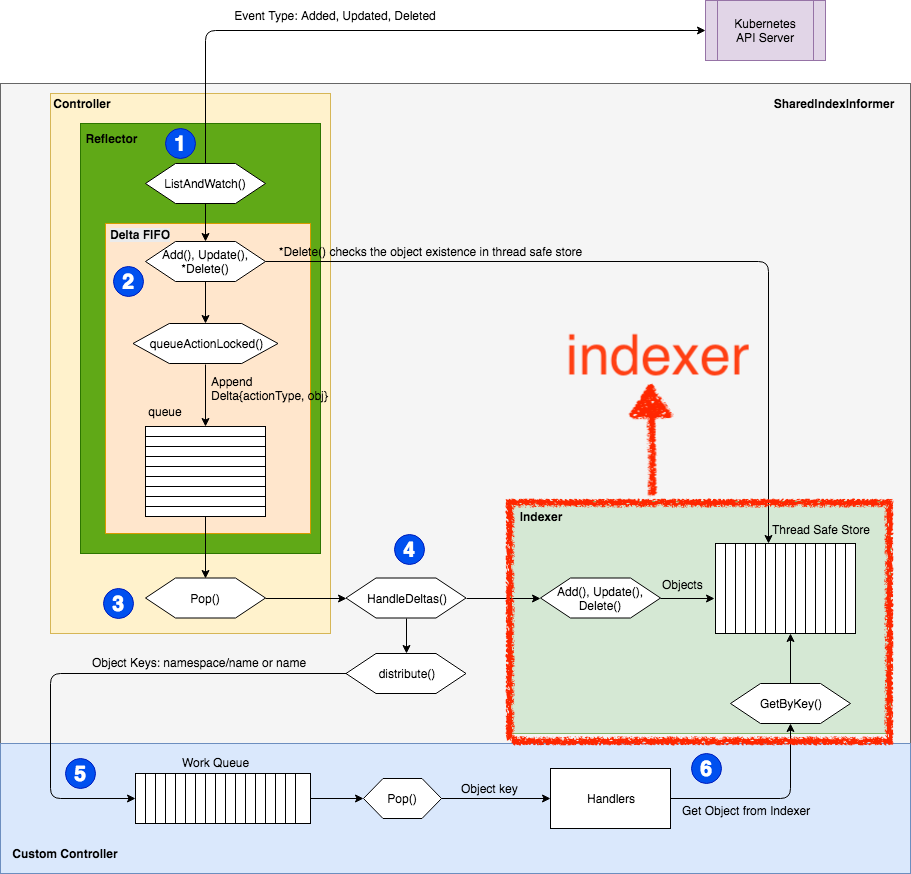
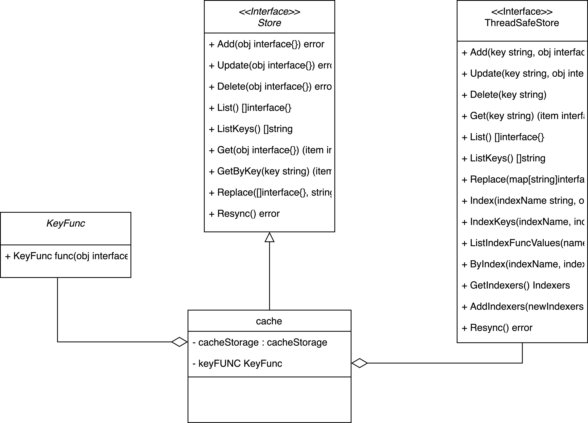

首先本文所有的source code 基于kubernetes 1.19 版本，所有source code 为了版面的整洁会精简掉部分log 相关的程式码，仅保留核心逻辑，如果有见解错误的地方，还麻烦观看本文的大大们提出，感谢！

上一篇`Kubernetes Controller 設計挖掘之路` 提到为什么我们要了解kubernetes 内部其他元件的运作方式，例如`work queue`,`indexer`或是`informer`，`indexer`作为controller 内保存物件资料的地方值得我们去了解它的设计思维与架构。

## Indexer

Indexer 位于client-go 的cache package，从字面上来看他就是一个索引器，位于infromer 之中作为informer 的local cache，至于为什么会是使用indexer 作为命名的方法，我猜是透过某些条件查询储存的物件加快整体的速度吧？（如果有错麻烦大大纠正）



### interface

kubernetes source code 设计得非常精美，我们可以先从interface 定义了哪些方法来推敲实作这个interface 的物件可能有什么功能。
[source-code](https://github.com/kubernetes/client-go/blob/master/tools/cache/index.go)

```
// Indexer extends Store with multiple indices and restricts each
// accumulator to simply hold the current object (and be empty after
// Delete).
//
// There are three kinds of strings here:
// 1. a storage key, as defined in the Store interface,
// 2. a name of an index, and
// 3. an "indexed value", which is produced by an IndexFunc and
//    can be a field value or any other string computed from the object.
type Indexer interface {
  //嵌入了stroe，擁有stroe全部的方法
	Store
	
  // 回传在indexName內与給定的Object有交集的所有object
	Index(indexName string, obj interface{}) ([]interface{}, error)
	
  // 回传在indexname与透过indexed取的所有关联的Object  Key
	IndexKeys(indexName, indexedValue string) ([]string, error)
    
  // 回传在indexName所有的indexed
	ListIndexFuncValues(indexName string) []string
    
  // 回传在indexName与透过indexed取的所有关联的object
	ByIndex(indexName, indexedValue string) ([]interface{}, error)
    
  // 回传indexer
	GetIndexers() Indexers

  // 新增indexer
	AddIndexers(newIndexers Indexers) error
}

```


研究到这里我真的很痛苦一下Index 一下Indexer 一下Obejct 一下Obejct key 一下Indexed！！！神烦xD

好AnyWay总之有五种东西分别是

1. Indexer
2. Indexed
3. Obejct
4. Obejct key
5. Index

本系列会帮这些名称进行一个分类与说明，希望能够帮助到正在痛苦研究的伙伴….

回归正题可以看到Indexer 嵌入了Store Interface ，就名称来看Indexer 有基础的储存能力，至于实际上有什么储存能力我们继续看Store Interface 定义了什么方法。

[source-code](https://github.com/kubernetes/client-go/blob/master/tools/cache/store.go)
可以从Store interface 中简单的看到有新增、删除、修改等动作，由于操作的事Key Value store所以会有，列出Key 列出物件等动作。

```
type Store interface {

  //新增物件
	Add(obj interface{}) error

  //更新物件
	Update(obj interface{}) error

  //刪除物件
	Delete(obj interface{}) error

  //列出所有物件
	List() []interface{}

  //列出所有物件的key
	ListKeys() []string

  // 透過物件取得object key
	Get(obj interface{}) (item interface{}, exists bool, err error)

  //透過object key取得object
	GetByKey(key string) (item interface{}, exists bool, err error)

  //一次性替換Object key 所代表的所有Object
	Replace([]interface{}, string) error

  //重新同步
	Resync() error
}

```


看完了抽象的定义之后，必须要回过来看cache 实际物件定义了哪些属性

### struct

只有cache 这个物件实作了Indexer Interface，我们先来分析这家伙！

#### cache

[source-code](https://github.com/kubernetes/client-go/blob/master/tools/cache/index.go)

```
type cache struct {
	// cacheStorage bears the burden of thread safety for the cache
	cacheStorage ThreadSafeStore    //一个 thread safe 的 interface ，稍后会解释。
	// keyFunc is used to make the key for objects stored in and retrieved from items, and
	// should be deterministic.
	keyFunc KeyFunc        //计算object key的方法，稍后会解释
}

```


cache 组合ThreadSafeStore 以及KeyFunc ，我们继续展开来看这两个是什么东西！

##### ThreadSafeStore

先来看ThreadSafeStore interface 定义了什么东西，从中来了解实作他的物件可能有什么行为。

###### interface

```
type ThreadSafeStore interface {
	Add(key string, obj interface{})
	Update(key string, obj interface{})
	Delete(key string)
	Get(key string) (item interface{}, exists bool)
	List() []interface{}
	ListKeys() []string
	Replace(map[string]interface{}, string)
	Index(indexName string, obj interface{}) ([]interface{}, error)
	IndexKeys(indexName, indexKey string) ([]string, error)
	ListIndexFuncValues(name string) []string
	ByIndex(indexName, indexKey string) ([]interface{}, error)
	GetIndexers() Indexers

	// AddIndexers adds more indexers to this store.  If you call this after you already have data
	// in the store, the results are undefined.
	AddIndexers(newIndexers Indexers) error
	// Resync is a no-op and is deprecated
	Resync() error
}

```


快速地看过一次应该会觉得跟上面提到的`Store`Interface 非常相似，我认为大致上的差异在于 `ThreadSafeStroe` 主要针对Index 做处理，我们看一下UML会更加清楚。



在使用者面向的应该是Store 这个Interface ， cache 把功能委任（委托）给cacheStorage Interface 有Thread safe 特性且有索引的storage 。

看完了抽象的定义之后，必须要回过来看threadSafeMap 实际物件定义了哪些属性

###### struct

只有threadSafeMap 这个物件实作了cacheStorage Interface，我们接着来分析threadSafeMap！

[source-code](https://github.com/kubernetes/client-go/blob/master//tools/cache/thread_safe_store.go)

```
// threadSafeMap implements ThreadSafeStore
type threadSafeMap struct {
	lock  sync.RWMutex                          //读写锁（可能读多写少？）
  items map[string]interface{}               //储存Object Key:Object

	// indexers maps a name to an IndexFunc
	indexers Indexers                           //用以计算indexed的function
	// indices maps a name to an Index
	indices Indices                             //indexed map透过这个表获取Onject Key
}

```


我知道头很痛，又出现Index ， indexed 这一坨东西，我会尽力讲解些东西的关联，先看看在Indexers Indices 这些东西在client go 里面的定义吧，从中我们可以获取一些灵感。

[source-code](https://github.com/kubernetes/client-go/blob/master/tools/cache/index.go%23L98:6)

```
// IndexFunc knows how to compute the set of indexed values for an object.
type IndexFunc func(obj interface{}) ([]string, error)        //传入Obaject会帮你算出多种[]indexed-name

// Index maps the indexed value to a set of keys in the store that match on that value
type Index map[string]sets.String                             //每个indexed-name会对应到一个[set]object key set
                                                              //inedxed->object key set

// Indexers maps a name to a IndexFunc
type Indexers map[string]IndexFunc                            //计算 indexed 的 function 们（透过 name 去分类）
                                                              //index name->index function->index

// Indices maps a name to an Index
type Indices map[string]Index                                 //index name(function name)->index[indexed-name]->[set]object key

```


把上面的source code转换成图形应该会变成这样子，


从最上面的部分往下看

- Indexer 里面有许多index-name 分别对应着不同的index function
  - index function 算出多个indexed-name
- 从Indices 内透过index-name 可以拿到一个Index-name 所对应的index
- 从Index 内透过inexed-name 可以获得一组Object key set

好了解到这里后，应该会有一点概念吧?XD
这一边我读了很久才看懂一点，如果分析有错希望各位大大可以指出！感谢

接着我们来看New Function 要怎么把ThreadSafeStore 建立出来

##### new Function

可以看到ThreadSafeStore 要求传入一个indexer 以及indeices，这边可以对照着client go 中有使用到 `NewThreadSafeStore` 的人传入什么进去做为参考。
[source-code](https://github.com/kubernetes/client-go/blob/master//tools/cache/thread_safe_store.go)

```
func NewThreadSafeStore(indexers Indexers, indices Indices) ThreadSafeStore {
	return &threadSafeMap{
		items:    map[string]interface{}{},
		indexers: indexers,
		indices:  indices,
	}
}

```


可以看到 `NewStore` 这个function 有使用到 `NewThreadSafeStore` 方法，并且传入 `Indexers{}` 以及`Indices{}`。
[source-code](https://github.com/kubernetes/client-go/blob/master//tools/cache/thread_safe_store.go)

```
// NewStore returns a Store implemented simply with a map and a lock.
func NewStore(keyFunc KeyFunc) Store {
	return &cache{
		cacheStorage: NewThreadSafeStore(Indexers{}, Indices{}),
		keyFunc:      keyFunc,
	}
}

```


看完了如何建立ThreadSafeStore 的物件之后，我们接着来分析该物件每个function 实作了什么事情吧！

#### implement function

单纯的把Object 放入map，以Object key 作为map 的索引，重点在于updateIndices 的动作。

##### Add

[source-code](https://github.com/kubernetes/client-go/blob/master//tools/cache/thread_safe_store.go)

```
func (c *threadSafeMap) Add(key string, obj interface{}) {
	c.lock.Lock()                                //锁不解释
	defer c.lock.Unlock()                        //退出解锁
	oldObject := c.items[key]                    //取出旧的物件
	c.items[key] = obj                           //写入新的物件
	c.updateIndices(oldObject, obj, key)         //更新indexed索引 ，稍后会解释更新 indexed 索引的动作
}

```


##### Update

单纯的更新物件，透过object key 作为索引找到物件并且更新，重点在于updateIndices 的动作。
[source-code](https://github.com/kubernetes/client-go/blob/master//tools/cache/thread_safe_store.go)

```
//跟Add不是一模一樣...為什麼不重用add不明白
func (c *threadSafeMap) Update(key string, obj interface{}) {
	c.lock.Lock()                                //锁不解释
	defer c.lock.Unlock()                        //退出解锁
	oldObject := c.items[key]                    //透过Object key 取出旧的物件     
	c.items[key] = obj                           //透过Object key写入新的物件
	c.updateIndices(oldObject, obj, key)         //更新indexed索引
}

```


##### Delete

删除物件，透过Object key作为索引找到物件并且删除，重点在于deleteFromIndices 的动作。
[source-code](https://github.com/kubernetes/client-go/blob/master//tools/cache/thread_safe_store.go)

```
func (c *threadSafeMap) Delete(key string) {
	c.lock.Lock()                                    //锁不解释
	defer c.lock.Unlock()                            //退出解锁
	if obj, exists := c.items[key]; exists {         //如果物件存在
		c.deleteFromIndices(obj, key)               //刪除indexed索引
		delete(c.items, key)                        //刪除物件
	}
}

```


##### Get

取得物件，透过Object key 作为索引取的物件
[source-code](https://github.com/kubernetes/client-go/blob/master//tools/cache/thread_safe_store.go)

```

func (c *threadSafeMap) Get(key string) (item interface{}, exists bool) {
	c.lock.RLock()                //读操作，用读锁
	defer c.lock.RUnlock()        //解锁
	item, exists = c.items[key]    //透过Object key拿取物件
	return item, exists            //回传
}

```


##### List

列出所有物件
[source-code](https://github.com/kubernetes/client-go/blob/master//tools/cache/thread_safe_store.go)

```

func (c *threadSafeMap) List() []interface{} {
	c.lock.RLock()                //读操作，用读锁
	defer c.lock.RUnlock()        //解锁
  //for跑一次map全部加入到slice就好
	list := make([]interface{}, 0, len(c.items))
	for _, item := range c.items {
		list = append(list, item)
	}
	return list                    //回传slice
}


```


##### ListKeys

列出所有物件的Object key
[source-code](https://github.com/kubernetes/client-go/blob/master//tools/cache/thread_safe_store.go)

```
// ListKeys returns a list of all the keys of the objects currently
// in the threadSafeMap.
func (c *threadSafeMap) ListKeys() []string {
	c.lock.RLock()                //读操作，用读锁
	defer c.lock.RUnlock()        //解锁
  //for跑一次map全部加入到slice就好
	list := make([]string, 0, len(c.items))
	for key := range c.items {
		list = append(list, key)
	}
	return list                    //回传slice
}

```


##### Replace

一次替换整个储存库，重点在于会重建整个indices以及更新index。
[source-code](https://github.com/kubernetes/client-go/blob/master//tools/cache/thread_safe_store.go)

```

func (c *threadSafeMap) Replace(items map[string]interface{}, resourceVersion string) {
	c.lock.Lock()                                    //锁不解释
	defer c.lock.Unlock()                            //退出解锁
	c.items = items                                  //覆盖整个纪录

	// rebuild any index
	c.indices = Indices{}                            //indexed 索引重建
	for key, item := range c.items {                 //更新indexed索引列表
		c.updateIndices(nil, item, key)
	}
}

```


接下来的部分会着重在indexed 的计算

##### Index

透过index-name 取得indexer中的object key 计算function 算出对应的indexed value ， 透过对应的indices-name 向indices 取的对应的index 。
使用对应的index 以及计算出来的indexed value取得object key set ，递回跑一是key set 从map 中一一取得对应的物件。
[source-code](https://github.com/kubernetes/client-go/blob/master//tools/cache/thread_safe_store.go)

```
// Index returns a list of items that match the given object on the index function.
// Index is thread-safe so long as you treat all items as immutable.
//透过index name取得indexed后
func (c *threadSafeMap) Index(indexName string, obj interface{}) ([]interface{}, error) {
	c.lock.Lock()                                    //锁不解释
	defer c.lock.Unlock()                            //退出解锁
    
	indexFunc := c.indexers[indexName]               //透过index name从indexer中取得对应的infexed function
	if indexFunc == nil {
		return nil, fmt.Errorf("Index with name %s does not exist", indexName)
	}

	indexedValues, err := indexFunc(obj)            //透过indexed function 计算indexed
	if err != nil {
		return nil, err
	}
	index := c.indices[indexName]                  //透过index name 从 indices 拿对应的 index

	var storeKeySet sets.String                    //object key的集合
	if len(indexedValues) == 1 {                   //大多树情况indexed 只会有一个
		// In majority of cases, there is exactly one value matching.
		// Optimize the most common path - deduping is not needed here.
		storeKeySet = index[indexedValues[0]]      //透过indexed从index拿到对应的 object key set
	} else {                                     //不知道什么情况会跑进去这里，我用dlv跑测试没有跑进这里过...以下是看注解猜测的
		// Need to de-dupe the return list.
		// Since multiple keys are allowed, this can happen.
		storeKeySet = sets.String{}
		for _, indexedValue := range indexedValues {    //递回index所有的indexed,并且将数值插入set中
			for key := range index[indexedValue] {
				storeKeySet.Insert(key)
			}
		}
	}

	list := make([]interface{}, 0, storeKeySet.Len())    //Objest set 取出所有的 Object key 
  //将map有对应到的 Object 放入list 回传
	for storeKey := range storeKeySet {
		list = append(list, c.items[storeKey])
	}
	return list, nil
}


```


看完了Index的实作，我是这样猜的透过一个物件算出Indexed-name，在Indices 中index name 对应到一组Index，最后再从这个Index 中透过Indexed name拿到关联的Object。

> dlv 实际拿到的数值… todo

##### IndexKeys

透过index name 从indexer 中拿到计算indexe value 的function ，接着从indices 使用index name 拿到到对应的index 。
使用算出来的index value 从index 拿到所有的object key set 。
[source-code](https://github.com/kubernetes/client-go/blob/master//tools/cache/thread_safe_store.go)

```
// IndexKeys returns a list of the Store keys of the objects whose indexed values in the given index include the given indexed value.
// IndexKeys is thread-safe so long as you treat all items as immutable.
func (c *threadSafeMap) IndexKeys(indexName, indexedValue string) ([]string, error) {
	c.lock.RLock()                //读操作，用读锁
	defer c.lock.RUnlock()        //解锁

	indexFunc := c.indexers[indexName]        //透过 index name从indexer中取得对应的indexed function
	if indexFunc == nil {
		return nil, fmt.Errorf("Index with name %s does not exist", indexName)
	}

	index := c.indices[indexName]            //透过 index name 从 indices 拿对应的 index

	set := index[indexedValue]                //透过indexed 从 index 拿到所有的 Object key
	return set.List(), nil
}

```


##### ListIndexFuncValues

透过index name 从indices 取得对应的index，递回跑过index 取得所有的index key。
[source-code](https://github.com/kubernetes/client-go/blob/master//tools/cache/thread_safe_store.go)

```
func (c *threadSafeMap) ListIndexFuncValues(indexName string) []string {
	c.lock.RLock()                //读操作，用读锁
	defer c.lock.RUnlock()        //解锁

	index := c.indices[indexName]            //透过 index name 从 indices 拿对应的 index
	names := make([]string, 0, len(index))
    //拿出 index 中所有的 indexed key
	for key := range index {
		names = append(names, key)
	}
	return names
}

```


##### ByIndex

透过index name 从indexer 取得计算indexed value 的function ，以及使用index name 从indices 中拿到对应的index 。
使用对应的index 以及计算出来的indexed value 取得对应的object key set 。
递回object key set 把object key set 对应到的object 回传出来。
[source-code](https://github.com/kubernetes/client-go/blob/master//tools/cache/thread_safe_store.go)

```
// ByIndex returns a list of the items whose indexed values in the given index include the given indexed value
func (c *threadSafeMap) ByIndex(indexName, indexedValue string) ([]interface{}, error) {
	c.lock.RLock()                //读操作，用读锁
	defer c.lock.RUnlock()        //解锁

	indexFunc := c.indexers[indexName]        //透过index name从indexer 中取的 indexed function
	if indexFunc == nil {
		return nil, fmt.Errorf("Index with name %s does not exist", indexName)
	}

	index := c.indices[indexName]            //透过 index name 从 indices 拿对应的  index

	set := index[indexedValue]               //透过 index name 从index取的 Object key set
	list := make([]interface{}, 0, set.Len())   
  //递回储存的object key set 对应的object倒出
	for key := range set {
		list = append(list, c.items[key])
	}

	return list, nil
}

```


##### GetIndexers

回传indexer
[source-code](https://github.com/kubernetes/client-go/blob/master//tools/cache/thread_safe_store.go)

```
func (c *threadSafeMap) GetIndexers() Indexers {
	return c.indexers                //沒啥好說的回傳一個indexer 
}

```


##### AddIndexers

加入新的indexer ，前提是不能有资料才可以加入indexer 。

[source-code](https://github.com/kubernetes/client-go/blob/master//tools/cache/thread_safe_store.go)

```
func (c *threadSafeMap) AddIndexers(newIndexers Indexers) error {
	c.lock.Lock()                                    //锁不解释
	defer c.lock.Unlock()                            //退出解鎖

	if len(c.items) > 0 {                            //現在有存資料了，不能加入indexer 
		return fmt.Errorf("cannot add indexers to running index")
	}

	oldKeys := sets.StringKeySet(c.indexers)        //把旧的indexer转乘一个可以比对的资料
	newKeys := sets.StringKeySet(newIndexers)        //把新的indexer转乘一个可以比对的资料

	if oldKeys.HasAny(newKeys.List()...) {           //比对两个indexer 是否有重复
		return fmt.Errorf("indexer conflict: %v", oldKeys.Intersection(newKeys))
	}
    //不影响核心逻辑,不展开解析
    

  //把新的indexer加入indexer中
	for k, v := range newIndexers {
		c.indexers[k] = v
	}
	return nil
}

```


##### Resync

没干啥事
[source-code](https://github.com/kubernetes/client-go/blob/master//tools/cache/thread_safe_store.go)

```
func (c *threadSafeMap) Resync() error {
	// Nothing to do
	return nil            //没干啥
}

```


最后几个function 加油！

#### updateIndices

更新indices ，如果有就的物件就需要删除旧的index

递回所有indexer 拿到计算indexed value 的function ，透过indexed function 计算出indexed value。
使用index name 从indices 拿到index。

如果index 不存在建立新的index，并且建立index name 与indices 的连结

透过indexed function 计算出indexed value
递回所有indexed value ，从index 中到对应的Object key set ，若是找不到Set ，则建立一个Object ket set 并且让indexed value 与Object key set 建立连结。

[source-code](https://github.com/kubernetes/client-go/blob/master//tools/cache/thread_safe_store.go)

```
// updateIndices modifies the objects location in the managed indexes, if this is an update, you must provide an oldObj
// updateIndices must be called from a function that already has a lock on the cache
//传入旧的 object 为了确认有没有这个 index （更新用）
//传入新的 object 
//私有方法只能从add 或是 update呼叫，add/update 有上锁，保证thread safe
func (c *threadSafeMap) updateIndices(oldObj interface{}, newObj interface{}, key string) {
	// if we got an old object, we need to remove it before we add it again
  //如果有代旧的object的话需要先删除旧的index，下一个段落会说到如何删除
	if oldObj != nil {
		c.deleteFromIndices(oldObj, key)
	}
  //将所有的indexer跑過一次，拿到所有的index name以及indexed function
	for name, indexFunc := range c.indexers {
    //透过indexed function 算出indexed
		indexValues, err := indexFunc(newObj)
		if err != nil {
			panic(fmt.Errorf("unable to calculate an index entry for key %q on index %q: %v", key, name, err))
		}
    //透过 index name 从 indices 拿到对应的 index
		index := c.indices[name]
    //确认 index 是否存在，不存在表示这个 indices 还没有这个 index
    //建立 index 并且对应到 indecies 上
		if index == nil {
			index = Index{}
			c.indices[name] = index
		}
            
		for _, indexValue := range indexValues {
      //透过 indexed 检查 index 对应的 Object key set
			set := index[indexValue]
      //若是set 为空表示 index 还没建立object key set
      //建立 set 并且对应到 index 上
			if set == nil {
				set = sets.String{}
				index[indexValue] = set
			}
      //object set set 插入 object key
			set.Insert(key)
		}
	}
}

```


#### deleteFromIndices

当更新物件或是删除物件的时候会被呼叫为了更新Indices

递回indexer 取出所有的indexed value function ，并且从indices 确认index 是否存在

若是不存在，表示物件已经被清理且indices 已更新

若是存在，需要进一步确认indexed value function 算出来的所有indexed value 在index 中Object key set 的情况
若是Object key set 存在就删除Object 内对应的Object key，另外Obeset set 若是为空需要回收Object 减少记忆体使用。
[source-code](https://github.com/kubernetes/client-go/blob/master//tools/cache/thread_safe_store.go)

```
// deleteFromIndices removes the object from each of the managed indexes
// it is intended to be called from a function that already has a lock on the cache
func (c *threadSafeMap) deleteFromIndices(obj interface{}, key string) {
  //将indexer 中全部 indexed function 取出
	for name, indexFunc := range c.indexers {
    //透过indexed function 算出 indexed 
		indexValues, err := indexFunc(obj)
		if err != nil {
			panic(fmt.Errorf("unable to calculate an index entry for key %q on index %q: %v", key, name, err))
		}
    //透过index name 从indices拿到对应的index
		index := c.indices[name]
    //有可能 index name 在indeces中找不到（不太可能...） 
		if index == nil {
			continue
		}
    //將indexed 全部跑一次
		for _, indexValue := range indexValues {
      //从index拿到对应的object key set 
			set := index[indexValue]
      //如果set 存在的话就删除对应的 Object key
			if set != nil {
				set.Delete(key)
                        
				//刪除 object key 為零的 set ，為了避免佔用空間（kubernetes 上有相關的issuekubernetes/kubernetes/issues/84959）
				if len(set) == 0 {
					delete(index, indexValue)
				}
			}
		}
	}
}

```


## 小结

我想先介绍到这边把 `threadSafeMap` 的部分介绍完，让大家先了解cache 底层是怎么做的，以及`indexer`、`indexed-name`、`Indices`、`index`以及 `Object set` 之间的关联。
因为cahce 是基于threadSafeMap 往上盖的，所以先建立最底层的概念是非常重要，下一篇我将会继续介绍cache 的部分。
