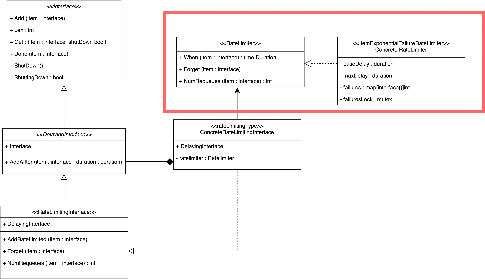

先本文所以source code 基于kubernetes 1.19 版本，所有source code 的为了版面的整洁会精简掉部分log 相关的程式码，仅保留核心逻辑，如果有见解错误的地方，还麻烦观看本文的大大们提出，感谢！

## kubernetes work queue

Kubernetes controller/operator 是一个非常精彩的设计模式，在了解Kubernetes controller/operator 怎么撰写之前，了解kubernetes work queue的实作模式是非常重要的，下面引用了How to Create a Kubernetes Custom Controller Using client-go的controller 架构图可以看到在sharedindexinformer 内有引用到这个元件，这个元件实际被定义在kubernetes 的client-go library 中。


图片来源：[How to Create a Kubernetes Custom Controller Using client-go](https://itnext.io/how-to-create-a-kubernetes-custom-controller-using-client-go-f36a7a7536cc)

Kubernetes 为什么要实践一个work queue 呢？就我们所知kubernetes 是用go 撰写应该可以使用channel 的机制直接将物件送给要用的元件(thread)啊，原因其实非常简单，go channel 的设计功能非常单一无法满足kubernetes 所要的场景，例如带有延迟时间物件需要根据延迟时间排序的queue，例如限制物件取出速度的queue。

之先前的章节有提到common work queue 、 delaying work queue 、 ratelimiting queue，但ratelimiting queue 有组合ratelimiter ，本章节将有实作ratelimiter 同时也满常被用到的ItemExponentialFailureRateLimiter 展开解说。

## ItemExponentialFailureRateLimiter



### interface

kubernetes source code 设计得非常精美，我们可以先从interface 定义了哪些方法来推敲实作这个interface 的物件可能有什么功能。

[source code](https://github.com/kubernetes/client-go/blob/master/util/workqueue/default_rate_limiters.go)

```
type RateLimiter interface {
	// When gets an item and gets to decide how long that item should wait
  //当一个物件放入的时候，需要回传延迟多久（可自定义规则，等等会看到）
	When(item interface{}) time.Duration
    
    
	// Forget indicates that an item is finished being retried.  Doesn't matter whether its for perm failing	    
  // or for success, we'll stop tracking it
  //当一个物件完成的时候可以，要忘记曾经延迟过（重新计算）
  Forget(item interface{})
    
    
	// NumRequeues returns back how many failures the item has had
  // 回传物件已经放入几次（重试了几次，白话一点呼叫NumRequeues几次）
	NumRequeues(item interface{}) int
}

```


看完了抽象的定义之后，必须要回过来看Item Exponential Failure RateLimiter queue 实际物件定义了哪些属性

### struct

[source code](https://github.com/kubernetes/client-go/blob/master/util/workqueue/default_rate_limiters.go)

```
// ItemExponentialFailureRateLimiter does a simple baseDelay*2^<num-failures> limit
// dealing with max failures and expiration are up to the caller
type ItemExponentialFailureRateLimiter struct {
	failuresLock sync.Mutex            //锁，防止资源竞争
	failures     map[interface{}]int   //计算某个物件呼叫了延迟的次数

	baseDelay time.Duration            //基础延迟的时间
	maxDelay  time.Duration            //最多要延迟多久
}

```


看完了资料结构我们接着来看ItemExponentialFailureRateLimiter 实作的方法，与初始化方法。

### new function

[source code](https://github.com/kubernetes/client-go/blob/master/util/workqueue/rate_limiting_queue.go)

```
//不知道为什么要设定一个空的变数
var _ RateLimiter = &ItemExponentialFailureRateLimiter{}

//传入基础要等待的时间，最大等待时间，以及初始化failures map资料集
func NewItemExponentialFailureRateLimiter(baseDelay time.Duration, maxDelay time.Duration) RateLimiter {
	return &ItemExponentialFailureRateLimiter{
		failures:  map[interface{}]int{},
		baseDelay: baseDelay,
		maxDelay:  maxDelay,
	}
}

//预设等待时间为 1 Millisecond，最大等待时间为1000秒
func DefaultItemBasedRateLimiter() RateLimiter {
	return NewItemExponentialFailureRateLimiter(time.Millisecond, 1000*time.Second)
}

```


### implement function

看完了初始化ItemExponentialFailureRateLimiter 后接下来看看核心的功能。

#### When

[source code](https://github.com/kubernetes/client-go/blob/master/util/workqueue/rate_limiting_queue.go)

```
func (r *ItemExponentialFailureRateLimiter) When(item interface{}) time.Duration {
	r.failuresLock.Lock()                    //锁不做解释
	defer r.failuresLock.Unlock()            //解锁不做解释

	exp := r.failures[item]                  //查看map里面物件放入的次数
	r.failures[item] = r.failures[item] + 1  //放入次数＋1

	// The backoff is capped such that 'calculated' value never overflows.
  // backoff=base * 2^（物件放入的次数），代表延迟时间为指数型成长。
	backoff := float64(r.baseDelay.Nanoseconds()) * math.Pow(2, float64(exp))  
  //如果backoff 大于int64（溢位）就回传最大延迟时间
	if backoff > math.MaxInt64 {
		return r.maxDelay
	}
  //封装为延迟时间
	calculated := time.Duration(backoff)
  //延迟时间超过最大延迟时间就回传最大延迟时间
	if calculated > r.maxDelay {
		return r.maxDelay
	}

	return calculated
}

```


#### NumRequeues

当我们需要知道物件已经重试了几次可以透过NumRequeues function 得知物件重是的次数。
[source code](https://github.com/kubernetes/client-go/blob/master/util/workqueue/rate_limiting_queue.go)

```
func (r *ItemExponentialFailureRateLimiter) NumRequeues(item interface{}) int {
	r.failuresLock.Lock()                    //锁不做解释
	defer r.failuresLock.Unlock()            //解锁不做解释

	return r.failures[item]                  //回传重试次数
}

```


#### Forget

当物件做完时需要重新计算放延迟时间与放入次数，需要透过Forget function完成。
[source code](https://github.com/kubernetes/client-go/blob/master/util/workqueue/rate_limiting_queue.go)

```
func (r *ItemExponentialFailureRateLimiter) Forget(item interface{}) {
	r.failuresLock.Lock()                    //锁不做解释
	defer r.failuresLock.Unlock()            //解锁不做解释

	delete(r.failures, item)                 //删除map里的物件（重新计算）
}

```


## 怎么使用

对于 `ItemExponentialFailureRateLimiter` 物件而言，他只是实作了`RateLimiter`interface，使用者要怎么用这个Rate Limiter queue 呢？

上一篇有提到 `RateLimiter` 的初始化方法

```
func NewRateLimitingQueue(rateLimiter RateLimiter) RateLimitingInterface {
	return &rateLimitingType{
		DelayingInterface: NewDelayingQueue(),        //前一小节有提到过delating work queue的newfunction
		rateLimiter:       rateLimiter,               //自行实作的rateLimiter
	}
}

```


使用者可以在传入参数带入实作`RateLimiter`interface的 `ItemExponentialFailureRateLimiter` 物件

```
NewRateLimitingQueue(NewItemExponentialFailureRateLimiter(time.Millisecond, 1000*time.Second)
```


表示使用者要求的Rate Limiter queue 用了 `DelayingQueue` 与`ItemExponentialFailureRateLimiter`。

1. 物件延迟时间由`ItemExponentialFailureRateLimiter`决定
2. 物件延迟的排序方式由 `DelayingQueue` 决定（之前有提过用heap加上clock来触发）
3. 存放物件的queue 由 `common queue` 决定（之前有提过用processing set 加上dirty set 合力完成）

大致上流程是这样，不清楚的地方可以回去复习之前提到过的元件

## 小结

下一章节将介绍另外一个实作`rateLimiter`interface的物件`ItemFastSlowRateLimiter`，文章有错的部分希望大大们指出，谢谢！
