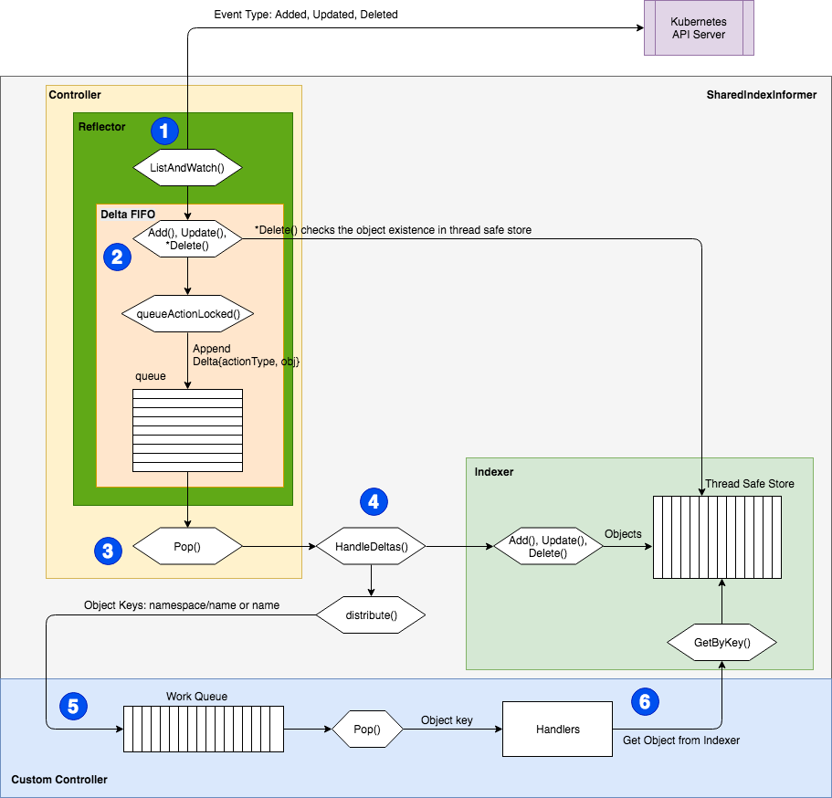

首先本文所以source code 基于kubernetes 1.19 版本，所有source code 的为了版面的整洁会精简掉部分log 相关的程式码，仅保留核心逻辑，如果有见解错误的地方，还麻烦观看本文的大大们提出，感谢！

## kubernetes work queue

在前一篇kubernetes delaying work queue 设计真d不错一文中分享kubernetes work queue最基础的实作方式，再复习一次！Kubernetes 为什么要实践一个work queue 呢？

就我们所知kubernetes 是用go 撰写应该可以使用channel 的机制直接将物件送给要用的元件(thread)啊，原因其实非常简单，go channel 的设计功能非常单一无法满足kubernetes 所要的场景，例如带有延迟时间物件需要根据延迟时间排序的queue，例如限制物件取出速度的queue。



图片来源：[How to Create a Kubernetes Custom Controller Using client-go](https://itnext.io/how-to-create-a-kubernetes-custom-controller-using-client-go-f36a7a7536cc)

上图引用了[How to Create a Kubernetes Custom Controller Using client-go](https://itnext.io/how-to-create-a-kubernetes-custom-controller-using-client-go-f36a7a7536cc)的controller 架构图可以看到在sharedindexinformer 内有引用到这个元件，这个元件实际被定义在kubernetes 的client-go library 中。

在第二步骤与第三步骤之间透过queue 不只解偶了上下层的耦合关系同时Queue 有达到了消峰填谷的作用，当观察的物件一直送资料进来不会因为我们业务逻辑处理得太慢而卡住，资料会保留在queue 中直到被取出。

之前有提到了两种queue ，分别是rate limiters queue 以及delaying queue ，上一章节介绍完Kubernetes delaying queue ，本篇文章将介绍最后一个rate limiters queue ！

## RateLimiter queue

kubernetes source code 设计得非常精美，我们可以先从interface 定义了哪些方法来推敲实作这个interface 的物件可能有什么功能。

### interface

[source code](https://github.com/kubernetes/client-go/blob/master/util/workqueue/rate_limiting_queue.go)

```
// RateLimitingInterface is an interface that rate limits items being added to the queue.
//RateLimiting interface 结合了 delaying work queue ，透过一些方法计算 物件的延迟速率
// 再交由 delaying work queue 丟入Heap 最后放入 common queue中。
type RateLimitingInterface interface {
	DelayingInterface        // delaying work queue 前一篇有介紹过

	// AddRateLimited adds an item to the workqueue after the rate limiter says it's ok
	AddRateLimited(item interface{})    // 对某个物件加入延迟

	// Forget indicates that an item is finished being retried.  Doesn't matter whether it's for perm failing
	// or for success, we'll stop the rate limiter from tracking it.  This only clears the `rateLimiter`, you
	// still have to call `Done` on the queue.
	Forget(item interface{})    //  表示某个物件已经做了

	// NumRequeues returns back how many times the item was requeued
	NumRequeues(item interface{}) int //计算某个物件调用queueAddRateLimited的次数
}

```


看完了抽象的定义之后，必须要回过来看delaying queue 实际物件定义了哪些属性

### struct

[source code](https://github.com/kubernetes/client-go/blob/master/util/workqueue/rate_limiting_queue.go)

```
// rateLimitingType wraps an Interface and provides rateLimited re-enquing
type rateLimitingType struct {
	DelayingInterface      // 嵌入 delaying work queue 表示 rateLimitingType 也有 delay work queue的能力
                              //（不一定需要传入实作的物件，本身就是DelayingInterface的一种）
                             
	rateLimiter RateLimiter     //组合了一个 RateLimiter interface，需要明确传入实作的物件。
}

```


刚刚上面有一个疑点那就type RateLimiter 到底是什么，我们先来看看type RateLimiter 的结构

#### RateLimiter

由于rateLimiting Type 组合了一个RateLimiter 我们来看看RateLimiter 是什么吧！
[source code](https://github.com/kubernetes/client-go/blob/master/util/workqueue/default_rate_limiters.go)

```
type RateLimiter interface {
	// When gets an item and gets to decide how long that item should wait
  //当一个物件放入的时候，需要回传延迟多久（可自定义规则，等等会看到）
	When(item interface{}) time.Duration
    
    
	// Forget indicates that an item is finished being retried.  Doesn't matter whether its for perm failing	    
  // or for success, we'll stop tracking it
  //当一个物件完成的时候可以，要忘记曾经延迟过（重新计算)
  Forget(item interface{})
    
    
	// NumRequeues returns back how many failures the item has had
  // 回传物件已经放入几次（重试了几次，白话一点呼叫when几次）
	NumRequeues(item interface{}) int
}

```


看到这里想必大家一定乱了，我帮大家整理一下个类别之间的关系。


看图说故事的时间到了
Interface 继承关系

```
1. Interface 为 common work queue 的介面（先用介面表示抽象方法，这里就不用Interface会搞混....）

2. DelayingInterface 为 delaying work queue 的介面，这个介面继承了Interface

3. RateLimitingInterface 继承了 delaying work queue 的介面
```


rateLimitingType 有什么能力

```
- rateLimitingType 嵌入(embedding)了 DelayingInterface ，表示 `rateLimitingType` 有 DelayingInterface 的能力（用嵌入委託給其他人）

- rateLimitingType 实作了 RateLimitingInterface ，表示 `rateLimitingType` 有 RateLimitingInterface 的能力（这个能力要自己实作）
```


rateLimitingType 依赖

```
- 由于 rateLimitingType 组合了(Composite) rateLimiter ，所以在 UML 上呈現的是依賴 rateLimiter 
- rateLimiter 被 ItemExponentialFailureRateLimiter 实作（还由其他物件实作，我这里没画出来）
```


#### struct function

rateLimitingType 实作了RateLimitingInterface 我们来看一下他实作了什么

[source code](https://github.com/kubernetes/client-go/blob/master/util/workqueue/rate_limiting_queue.go)

```

// AddRateLimited AddAfter's the item based on the time when the rate limiter says it's ok
// rateLimitingType 本身实作了 RateLimitingInterface 
func (q *rateLimitingType) AddRateLimited(item interface{}) {
  // 由于嵌入了 DelayingInterface 可以直接使用 delay work queue的抽象方法
  // 这里就是说放入的物件要延迟多久，延迟多久就由组合的 rateLimiter 抽象方法实作。
	q.DelayingInterface.AddAfter(item, q.rateLimiter.When(item))
}

//  rateLimitingType 本身实作了 RateLimitingInterface
func (q *rateLimitingType) NumRequeues(item interface{}) int {
  // 这里就是说放入的物件已经被重复放入多少次了，放入多少次就由组合的 rateLimiter 抽象方法实作。
	return q.rateLimiter.NumRequeues(item)
}

//  rateLimitingType 本身实作了 RateLimitingInterface
func (q *rateLimitingType) Forget(item interface{}) {
  // 这里就是说放入的物件已经被做完了，可以重新计算了，从新计算的方法就交给组合的 rateLimiter 抽象方法实作。
	q.rateLimiter.Forget(item)
}

```


其实看到这里，**我觉得rateLimitingType 有点像是proxy 设计模式**，只要有人实作了RateLimiter 就可以放进来给上层做使，反正上层只会呼叫AddRateLimited 、NumRequeues 、Forget。

Kubernetes 这边做的松偶做得很不错， 有新的计算延迟的方法rateLimitingType 根本不用动，透过rateLimitingType 代理呼叫RateLimiter 就好，更上层的使用者也只会使用RateLimitingInterface 而已。

### new function

[source code](https://github.com/kubernetes/client-go/blob/master/util/workqueue/rate_limiting_queue.go)

```
// NewRateLimitingQueue constructs a new workqueue with rateLimited queuing ability
// Remember to call Forget!  If you don't, you may end up tracking failures forever.
//使用者在使用RateLimiting的时候可以传入自己实作的RateLimiter，此时使用预设的delay work queue。
func NewRateLimitingQueue(rateLimiter RateLimiter) RateLimitingInterface {
	return &rateLimitingType{
		DelayingInterface: NewDelayingQueue(),        //前一小节有提到过delating work queue的newfunction
		rateLimiter:       rateLimiter,               //自行实作的rateLimiter
	}
}


//使用者在使用RateLimiting的时候可以传入自己实作的RateLimiter，此时使用预设的delaying  work queue并且可以设定delaying work queue的metric name。
func NewNamedRateLimitingQueue(rateLimiter RateLimiter, name string) RateLimitingInterface {
	return &rateLimitingType{
		DelayingInterface: NewNamedDelayingQueue(name),    //前一小节有提到过delating work queue的newfunction（可以設定metric name）
		rateLimiter:       rateLimiter,                    //自行实作的rateLimiter
	}
}

```


下一章节会讲解实作`rateLimiter`介面的物件`Item Exponential Failure RateLimiter`，我们来看看kubernetes 怎么限制物件进入queue 的速度！
