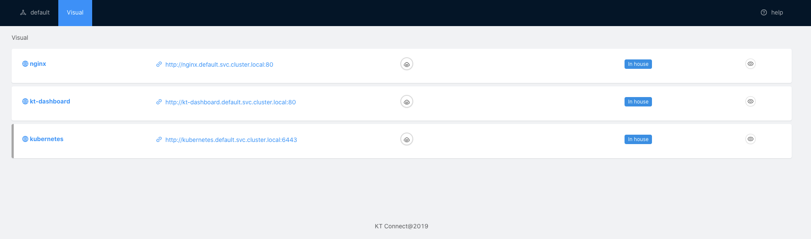

本篇文章的流程图取自于[KT Connnect 轻量级云原生测试环境治理工具](https://translate.google.com/website?sl=zh-TW&tl=zh-CN&hl=zh-CN&prev=search&u=https://ld246.com/article/1573205665774)并加以整理与新增实验过程。

越来越多的开发团队基于Kubernetes 部署公司的产品，一但服务上了Kubernetes 当然会牵扯到基础设计( Infra )、持续交付（ CD ）的过程，在如此庞大且复杂的架构与前提之下，我们有没有什么现有的专案可以帮助开发团队快速的在Kubernetes 上进行除错。

比如把线上（Remote）的流量导入本地(Local)，又会是反过说把本地测试的测试请求打到线上环境。

## 痛点

在Kubernetes 原生提供了一种方法（`port-forward`） ， 透过 `port-forward` 让local 端可以透过 : 存取线上的服务。

我们应该知道Kubernetes 原生提提供的 `port-forward` 能力不足，在微服务开发架构下，服务的调用除了调用方（ client ）依赖别人( service-A ) 以外，还有别人( service-B )依赖调用方( client )。就目前Kubernetes 原生提供的方法为基础的话，势必要将服务部署到一个测试环境中，但部署到测试环境又相当的麻烦，也有可能遇到各式不同的问题，例如：

- 单向调用：只能是从local 向kubernetes 发起请求，kubernetes 上的其他服务无法将请求转发到local。
- 多个服务之间部署复杂：当微服务架构一大起来，部署与设定就会是一个问题需要SRE 或是DevOps 人员设置一个测试环境。
- 程式码修改问题：一但采用 `port-forward` 去导流loacl 端进入到kubernetes 的流量，那我们的程式码本来透过 存取的方式必定要修改成 : 一但导流的东西多了，也意味着程式码修改的地方多了更容易发生人为设定上的错误。

## 解决方案

阿里巴巴（ alibaba ）这时脑洞大开开发了一个专案 [`kt-connect`](https://translate.google.com/website?sl=zh-TW&tl=zh-CN&hl=zh-CN&prev=search&u=https://github.com/alibaba/kt-connect) 我们先看看他们怎么介绍自己的。

> Manage and Integration with your Kubernetes dev environment more efficient.

好吧看不是很懂xD，简单来说阿里巴巴为了解决开发人员上述遇到的三个问题。

1. 开发人员可以将kubernetes 上的流量转到local 进行测试。
2. 开发人员可以将local 的测试请求发送到kubernetes 进行测试。
3. 开发人员不需要更动过多的程式码，可以沿用 的方式对服务发起请求。

大概看完了 `kt-connect` 带来的好处接着就来安装玩玩看！

- 需要有kubernetes 环境（开发环境具有kubeconfig 部分权限eg create list delete deploy 等）
- ssh
- 一颗热爱的debug 心

## install kt-connect dependency package

使用kc connection 之前我们需要安装一些依赖套件。

### install sshuttle

```bash=
#mac
brew install sshuttle
#linux
pip install sshuttle
#windows
https://rdc-incubators.oss-cn-beijing.aliyuncs.com/stable/ktctl_windows_amd64.tar.gz
```

### install kt-connect

紧接着安装 `kt-connect` 本体。

```
#mac
curl -OL https://rdc-incubators.oss-cn-beijing.aliyuncs.com/stable/ktctl_darwin_amd64.tar.gz
tar -xzvf ktctl_darwin_amd64.tar.gz
mv ktctl_darwin_amd64 /usr/local/bin/ktctl

#linux
curl -OL https://rdc-incubators.oss-cn-beijing.aliyuncs.com/stable/ktctl_linux_amd64.tar.gz
tar -xzvf ktctl_linux_amd64.tar.gz
mv ktctl_linux_amd64 /usr/local/bin/ktctl
```


安装完后可以下 `check` 指令确认一下依赖包是否都安装完成

```bash=
ktctl check

1:01PM INF system info darwin-amd64
1:01PM INF checking ssh version
OpenSSH_8.1p1, LibreSSL 2.7.3
1:01PM INF checking ssh version start at pid: 16888
1:01PM INF checking kubectl version
Client Version: v1.18.2
Server Version: v1.17.1+6af3663
1:01PM INF checking kubectl version start at pid: 16890
1:01PM INF checking sshuttle version
1.0.4
1:01PM INF checking sshuttle version start at pid: 16891
1:01PM INF KT Connect is ready, enjoy it!
```

## connect kubernetes in localhost

先来测试看看从localhost 与remote 建立tunnel ，记得一定要用sudo 不然kt connection 无法操作系统的网路。

```
sudo ktctl --namespace=default connect

Password:
2:21PM INF Connect Start At 28422
2:21PM INF Client address 192.168.51.191
2:21PM INF deploy shadow deployment kt-connect-daemon-ojbky in namespace default

2:21PM INF pod label: kt=kt-connect-daemon-ojbky
2:21PM INF pod: kt-connect-daemon-ojbky-6484749d95-2zqnl is running,but not ready
2:21PM INF pod: kt-connect-daemon-ojbky-6484749d95-2zqnl is running,but not ready
2:21PM INF pod: kt-connect-daemon-ojbky-6484749d95-2zqnl is running,but not ready
2:21PM INF Shadow pod: kt-connect-daemon-ojbky-6484749d95-2zqnl is ready.
2:21PM INF Fail to get pod cidr from node.Spec.PODCIDR, try to get with pod sample
Forwarding from 127.0.0.1:2222 -> 22
Forwarding from [::1]:2222 -> 22
2:21PM INF port-forward start at pid: 28424
Handling connection for 2222
Warning: Permanently added '[127.0.0.1]:2222' (ECDSA) to the list of known hosts.
client: Connected.
2:21PM INF vpn(sshuttle) start at pid: 28428
2:21PM INF KT proxy start successful
client: warning: closed channel 1 got cmd=TCP_STOP_SENDING len=0
server: warning: closed channel 1 got cmd=TCP_EOF len=0

```


当connection 建立好后可以在remote 到建立了一个tunnel 的pod ，这个pod 专门用来跟local端进行vpn/socks5 的连接方式(预设vpn)

```
kubectl get pod -A                                                                           
NAMESPACE     NAME                                       READY   STATUS    RESTARTS   AGE
default       kt-connect-daemon-ojbky-6484749d95-2zqnl   1/1     Running   0          60s
...

```


在remote 环境准备一个nginx deployment 进行测试

```
kubectl create deploy nginx --image nginx
deployment.apps/nginx created
kubectl expose deploy nginx --port 80
service/nginx exposed

```


安装完nginx 之后可以透过下列指令检视安装成果

```
kubectl get svc,deploy
NAME                 TYPE        CLUSTER-IP     EXTERNAL-IP   PORT(S)   AGE
service/kubernetes   ClusterIP   10.96.0.1      <none>        443/TCP   24m
service/nginx        ClusterIP   10.99.58.138   <none>        80/TCP    4m25s

NAME                                      READY   UP-TO-DATE   AVAILABLE   AGE
deployment.apps/kt-connect-daemon-ojbky   1/1     1            1           2m48s
deployment.apps/nginx                     1/1     1            1           4m34s

```


### curl with nginx pod ip in localhost

我们先在本地透过pod ip 存取nginx 服务看看服务是否正常

```
curl 10.32.0.5:80
<!DOCTYPE html>
<html>
<head>
<title>Welcome to nginx!</title>
...

```


### curl with nginx service ip

接着在本地透过nginx service virtual ip 存取nginx 服务看看服务是否正常

```
curl 10.99.58.138:80
<!DOCTYPE html>
<html>
<head>
<title>Welcome to nginx!</title>
...


```


### curl with nginx service DNS name

最后在本地透过nginx cluster DNS 存取nginx 服务测试服务是否正常。

```
curl nginx.default.svc.cluster.local
<!DOCTYPE html>
<html>
<head>
<title>Welcome to nginx!</title>
<style>
    body {
...


```


上述三个测试表示舞们可以在 `localhost` 存取远端kubernetes 上的nginx 。

## exchange remote deployment traffic to local

如果我们想要把remote 流量导到localhost 来该怎么做？

可以透过`ktctl exchang <deployment> --expose <remote port :local port>`指令，将remote 的deployment 流量转移到localhost 来。

> 以下范例我现在本地启动一个apache 服务，把原本进入kubernetes nginx 流量导流到localhost 的apache 上。

在localhost开一个简单的服务！

```bash
  docker run -dit --name test-apache -p 80:80 httpd                                                                                                                                   
Unable to find image 'httpd:latest' locally
latest: Pulling from library/httpd
bb79b6b2107f: Pull complete
26694ef5449a: Pull complete
7b85101950dd: Pull complete
da919f2696f2: Pull complete
3ae86ea9f1b9: Pull complete
Digest: sha256:b82fb56847fcbcca9f8f162a3232acb4a302af96b1b2af1c4c3ac45ef0c9b968
Status: Downloaded newer image for httpd:latest
bbe6575b59c5a11d430da4c158894b7740fae8e520c72ac8a71de227fcb59e3d

docker ps                                                                                                                                                                             
CONTAINER ID        IMAGE               COMMAND              CREATED             STATUS              PORTS                NAMES
bbe6575b59c5        httpd               "httpd-foreground"   28 seconds ago      Up 27 seconds       0.0.0.0:80->80/tcp   test-apache

##在本地測試一下！
curl 127.0.0.1:80
<html><body><h1>It works!</h1></body></html>
```

> 原本架构user==========>(remote) nginx
> 导流后架构user==========>(remote) nginx==(导流)==>(localhost)apache

透过以下指令告诉远端要透过80 port 进入nginx 的流量，需要导流到本地的80 port。

```
sudo ktctl exchange nginx --expose 80:80
2:37PM INF 'KT Connect' not runing, you can only access local app from cluster
2:37PM INF Client address 192.168.51.191
2:37PM INF deploy shadow deployment nginx-kt-rjulr in namespace default

2:37PM INF pod label: kt=nginx-kt-rjulr
2:37PM INF pod: nginx-kt-rjulr-7b478cd45d-c2xw5 is running,but not ready
2:37PM INF pod: nginx-kt-rjulr-7b478cd45d-c2xw5 is running,but not ready
2:37PM INF pod: nginx-kt-rjulr-7b478cd45d-c2xw5 is running,but not ready
2:37PM INF Shadow pod: nginx-kt-rjulr-7b478cd45d-c2xw5 is ready.
2:37PM INF create exchange shadow nginx-kt-rjulr in namespace default
2:37PM INF scale deployment nginx to 0

2:37PM INF  * nginx (0 replicas) success
2:37PM INF remote 10.32.0.4 forward to local 80:80
Forwarding from 127.0.0.1:2204 -> 22
Forwarding from [::1]:2204 -> 22
2:37PM INF exchange port forward to local start at pid: 30915
2:37PM INF redirect request from pod 10.32.0.4 22 to 127.0.0.1:2204 starting

Handling connection for 2204
Warning: Permanently added '[127.0.0.1]:2204' (ECDSA) to the list of known hosts.
2:37PM INF ssh remote port-forward start at pid: 30917

```


### curl with nginx service in remote

在remote 环境测试请求nginx service 能不能将traffic 导流到localhost 上。

```
curl 10.99.58.138
<html><body><h1>It works!</h1></body></html>

```


### curl with nginx DNS in remote

测试能不能在远端透过nginx dns name 把请求导流到localhost 上。

```
curl nginx.default.svc.cluster.local
<html><body><h1>It works!</h1></body></html>

```


## Dashboard

Kt connect 有提供一个dashboard可以使用，但目前不是很清楚这个dashboard可以提供怎么样的功能，就加减看一下啰！

基本上按照官方的教学，先安装RBAC 让dashboard可以存取kubernetes上的资源。

```
cat <<EOF | k apply -f -
apiVersion: rbac.authorization.k8s.io/v1beta1
kind: ClusterRole
metadata:
  name: ktadmin
rules:
- apiGroups: [""]
  resources:
  - namespaces
  - nodes
  - nodes/proxy
  - services
  - endpoints
  - pods
  verbs: ["get", "list", "watch"]
- apiGroups:
  - extensions
  resources:
  - ingresses
  verbs: ["get", "list", "watch"]
- nonResourceURLs: ["/metrics"]
  verbs: ["get"]
---
apiVersion: v1
kind: ServiceAccount
metadata:
  name: ktadmin
  namespace: default
---
apiVersion: rbac.authorization.k8s.io/v1beta1
kind: ClusterRoleBinding
metadata:
  name: ktadmin
roleRef:
  apiGroup: rbac.authorization.k8s.io
  kind: ClusterRole
  name: ktadmin
subjects:
- kind: ServiceAccount
  name: ktadmin
  namespace: default
EOF  
clusterrole.rbac.authorization.k8s.io/ktadmin created
serviceaccount/ktadmin created
clusterrolebinding.rbac.authorization.k8s.io/ktadmin created

```


接着继续按照官方文件安装dashboard 所需要的deployment 与service 即可。

```
cat <<EOF | kubectl apply -f -
apiVersion: v1
kind: Service
metadata:
  name: kt-dashboard
spec:
  ports:
  - port: 80
    targetPort: 80
  selector:
    app: kt-dashboard
  type: NodePort
---
apiVersion: apps/v1
kind: Deployment
metadata:
  labels:
    app: kt-dashboard
  name: kt-dashboard
spec:
  replicas: 1
  selector:
    matchLabels:
      app: kt-dashboard
  template:
    metadata:
      labels:
        app: kt-dashboard
    spec:
      serviceAccount: ktadmin
      containers:
      - image: registry.cn-shanghai.aliyuncs.com/kube-helm/kt-dashboard:stable
        imagePullPolicy: Always
        name: dashboard
        ports:
        - containerPort: 80
      - image: registry.cn-shanghai.aliyuncs.com/kube-helm/kt-controller:stable
        imagePullPolicy: Always
        name: controller
        ports:
        - containerPort: 8000
EOF
service/kt-dashboard created
deployment.apps/kt-dashboard created

```


RBAC 、 Service 与Deployment 安装好之后可以透过kubectl 指令确认状态与kt connect dashboard 暴露出的port 是哪个。

```
 kubectl get pod,svc
NAME                                           READY   STATUS    RESTARTS   AGE
pod/kt-connect-daemon-lucia-7b97887df4-d6lqx   1/1     Running   0          3m21s
pod/kt-dashboard-68bbc66bc6-skcsp              2/2     Running   0          12m
pod/nginx-f89759699-zjb6b                      1/1     Running   0          9m39s

NAME                   TYPE        CLUSTER-IP     EXTERNAL-IP   PORT(S)        AGE
service/kt-dashboard   NodePort    10.100.1.170   <none>        80:30080/TCP   13m
service/kubernetes     ClusterIP   10.96.0.1      <none>        443/TCP        90m
service/nginx          ClusterIP   10.99.58.138   <none>        80/TCP         69m

```


我们可以透过service 所告诉我们的port 去存取这个服务，存取的图是如下所示。

