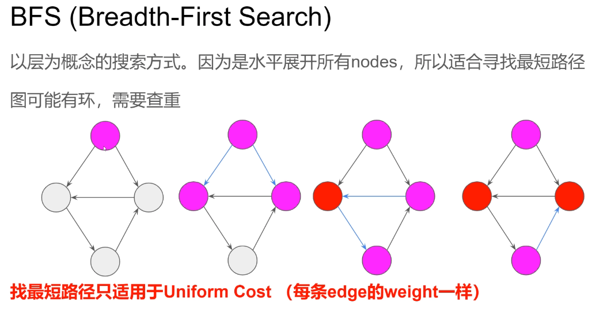

### Graph


类似LinkedList的概念，内存中不一定连续的数据，由各个节点的Reference串起来组成

- 可能有环
- 分为无向图和有向图
- 没有固定入口
- 可能有多个入口


### Graph Representation 


图该以什么形式存储?最常用的两大类 

- Adjacency Matrix  邻接矩阵
- Adjacency List  邻接表


### Adjacency List


最常用的2种实现方式(List可用Set代替)

- List<T>[n]

  - adjList[i]: All neighbors of node i

  - Need to know number of nodes (n) beforehand 
- Map<T, List<T>>
    - adjList.get(i): All neighbors of node i

### Tree


### BFS(Breadth-First Search)

BFS (Breadth-First Search)

以层为概念的搜索方式。因为是水平展开所有nodes，所以适合寻找最短路径图可能有环，需要查重

**找最短路径只适用于Uniform Cost  (每条edge的weight一样)**


### BFS模板


1. Initialize a Queue with all starting points, a HashSet to record visited nodes
2. While queue is not empty
   a. Retrieve current queue size as number of nodes in the current level 
   b. for each node in current level
           i.  Poll out one node
           ii. If this is the node we want, return it
           iii. Offer all its neighbor to the queue if not visited and valid
   C. Increase level 
   

小技巧:对于2D Matrix的图，`matrix[i][j]`的neighbors一般都是上下左右4个，

所以预先存一个4 direction array可以帮助访问neighbors → directions= {{0,1}, {1,0}, {0,-1}, {-1,0}} (右 下 左 上)

**Time Complexity O(V+E)**


### 542. 01 Matrix


直接思维: 对于每一个1，利用BFS找他最近的0 → O(mn * mn)
逆向思维: 对于所有的0，利用BFS填充到每一个1的距离 → O(mn)


1. Initialize a Queue with all O nodes. 
a `boolean[][]` to record visited nodes
1. While queue is not empty
a. Retrieve current queue size as 
number of nodes in the current level 
b. for each node in current level
      i. Poll out one node
      ii. If this is the node we want, return it
      iii. Offer all its neighbor to the queue if not visited and valid visited
c. Increase level cost

T**ime: O(mn)    Space O(mn)**

```
int[][] dirs = {{0, 1}, {1, 0}, {-1, 0}, {0, -1}};

public int[][] updateMatrix(int[][] matrix) {
    int m = matrix.length, n = matrix[0].length;
    int[][] res = new int[m][n];

    boolean[][] visited = new boolean[][];
    Queue<int[]> queue = new LinkedList<>();
    for (int i = 0; i < m; i++) {
        for (int j = 0; j < n; j++) {
            if (matrix[i][j] == 0) {
                queue.offer(new int[]{i, j});
                visited[i][j] = true;
            }
        }
    }

    int cost = 0;
    while (!queue.isEmpty()) {
        int size = queue.size();
        for (int s = 0; s < size; s++) {
            int[] cur = queue.poll();
            int i = cur[0], j = cur[1];
            if (matrix[i][j] == 1) {
                res[i][j] = cost;
            }

            for (int[] dir : dirs) {
                int x = i + dir[0], y = j + dir[1];
                if (x >= 0 && x < m && y >= 0 && y < n && !visited[x][y]) {
                    queue.offer(new int[]{x, y});
                    visited[x][y] = true;
                }
            }
        }
        cost++;
    }
    return res;
}
```


### 127. Word Ladder


首先要构建Graph 

1. For each (word1, word2) pair
a.  if word1 and word2 are one character change away, then word1 and word2
are connected by an edge 


这是个无向图
Time: O(n²)    Space O(n²) 

```
private Map<String, List<String>> constructGraph(List<String> wordList) {
    Map<String, List<String>> graph = new HashMap<>();
    int n = wordList.size();
    for (int i = 0; i < n - 1; i++) {
        for (int j = i + 1; j < n; j++) {
            String w1 = wordList.get(i), w2 = wordList.get(j);
            if (oneChangeAway(w1, w2)) {
                graph.computeIfAbsent(w1, k -> new ArrayList<>()).add(w2);
                graph.computeIfAbsent(w2, k -> new ArrayList<>()).add(w1);
            }
        }
    }
    return graph;
}

// w1 w2 长度相等
private boolean oneChangeAway(String w1, String w2) {
    int diff = 0;
    for (int i = 0; i < w1.length(); i++) {
        char c1 = w1.charAt(i), c2 = w2.charAt(i);
        if (c1 != c2) {
            diff++;
        }
    }
    return diff == 1;
}
```


构建完图之后，就变成一个利用BFS从起点找到终点的最短路径的基本问题

1. Initialize a Queue with beginWord a HashSet to record visited words 
2. While queue is not empty 
   a. Retrieve current queue size as
       number of words in the current level 
   b. for each word in current level 
           i. Poll out one word
           ii. If this is the endWord, return the cost
           iii. Offer all its neighbor to the queue if not visited and valid
   c. Increase cost 

**Time: O(n²)   Space O(n²)** 

```
public int ladderLength(String beginWord, String endWord, List<String> wordList) {
    if (!wordList.contains(endWord)) {
        return 0;
    }
    if (!wordList.contains(beginWord)) {
        wordList.add(beginWord);
    }

    Map<String, List<String>> graph = constructGraph(wordList);

    Set<String> visited = new HashSet<>();
    Queue<String> queue = new LinkedList<>();
    visited.add(beginWord);
    queue.add(beginWord);

    int cost = 1;
    while (!queue.isEmpty()) {
        int size = queue.size();
        for (int i = 0; i < size; i++) {
            String cur = queue.poll();
            if (cur.equals(endWord)) {
                return cost;
            }

            for (String neighbor : graph.getOrDefault(cur, new ArrayList<>())) {
                if (!visited.contains(neighbor)) {
                    visited.add(neighbor);
                    queue.offer(neighbor);
                }
            }
        }
        cost++;
    }

    return 0;
}
```


### 更多相关题目
Shortest Bridge(934)
Minimum Height Trees(310)
Shortest Path in Binary Matrix(1091)
Rotting Oranges(994)
All Nodes Distance Kin Binary Tree(863)
Shortest Distance from All Buildings(317)
