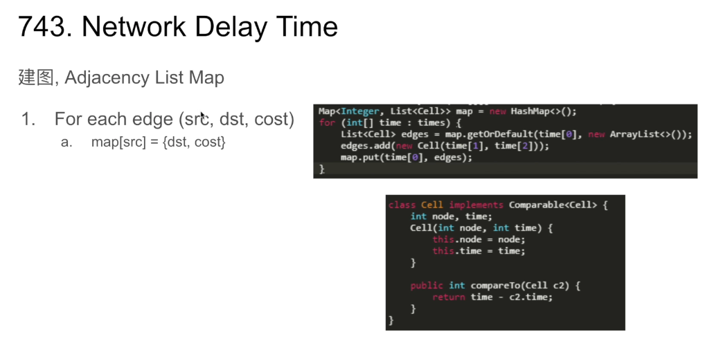

### Graph


类似LinkedList的概念，内存中不一定连续的数据，由各个节点的Reference串起来组成

- 可能有环
- 分为无向图和有向图
- 没有固定入口
- 可能有多个入口

### BFS(Best-First Search)


BFS(Best-First Search)
针对Non-uniform cost graph的一种算法，核心思想是优先展开最“优”的节点
如何每次快速计算最“优” → Heap
最有名的graph中找最短路径的算法又称 Dijsktra's Algorithm


### BFS 模板


BFS模板
General Steps:
1. Initialize a Heap with all starting points marked with some initial costs,a HashSet to record visited nodes
1. While heap is not empty
a. Poll out one node
b. If it has already been expanded(visited), skip it
c. Otherwise mark the node as visited, update its cost 
d. If this is the destination node, return 
e. For all of its neighbors, offer them in to the heap with current node's cost + edge cost

**Time: O((E + V) logV)    Space: O(V)** 


### 743. Network Delay Time


计算从初始节点到离初始节点最“远”节点的最短路径



建图, Adjacency List Map
1. For each edge(src, dst, cost)
a. map[src] = {dst, cost} 

```
public class Cell implements Comparable<Cell> {
    private int node;
    private int time;

    public Cell(int node, int time) {
        this.node = node;
        this.time = time;
    }

    @Override
    public int compareTo(Cell c2) {
        return time - c2.time;
    }
}

```


743.Network Delay Time

1. Initialize Heap with all starting points marked with cost=0,a HashMap to record
    visited nodes and their costs 
2. While heap is not empty 
    a. Poll out one node 
    b. If it has already been expanded(visited), skip it
    c. Otherwise mark the node as visited. update its cost
    d. If this is the destination node, return 
    e. For all of its neighbors, offer them in to the heap with current node's cost edge cost (delay time) 

```
public int networkDelayTime(int[][] times, int N, int k) {
    Map<Integer, List<Cell>> map = new HashMap<>();
    for (int[] time : times) {
        List<Cell> edges = map.getOrDefault(time[0], new ArrayList<>());
        edges.add(new Cell(time[1], time[2]));
        map.put(time[0], edges);
    }

    Map<Integer, Integer> costs = new HashMap<>();
    PriorityQueue<Cell> heap = new PriorityQueue<>();
    heap.offer(new Cell(k, 0));
    while (!heap.isEmpty()) {
        Cell cur = heap.poll();
        if (costs.containsKey(cur.node)) {
            continue;
        }
        costs.put(cur.node, cur.time);
        if (map.containsKey(cur.node)) {
            for (Cell nei : map.get(cur.node)) {
                if (!costs.containsKey(nei.node)) {
                    heap.offer(new Cell(nei.node, cur.time + nei.time));
                }
            }
        }
    }
    if (costs.size() != N) {
        return -1;
    }
    int res = 0;
    for (int x : costs.values()) {
        res = Math.max(res, x);
    }
    return res;
}

```


### 787. Cheapest Flights Within K Stops


787.Cheapest Flights Within KStops
以往我们Heap中存的节点信息有{node, cost}，这次要多存一个stop的信息
记录我们来到当前节点已经经过了多少次转机 → {node, cost,  stop},
如果一个node的stop数超出K，那就不能展开此node (termination state)


建图，Adjacency List Map
1. For each edge(src, dst, cost)
a. map[src] = {dst, cost}


```
public class Cell implements Comparable<Cell> {
    int dst, stop, price;

    public Cell(int dst, int stop, int price) {
        this.dst = dst;
        this.stop = stop;
        this.price = price;
    }

    @Override
    public int compareTo(Cell o) {
        return price - o.price;
    }
}


public int findCheapestPrice(int n, int[][] flights, int src, int dst, int K) {
    Map<Integer, List<int[]>> map = new HashMap<>();
    for (int[] flight : flights) {
        List<int[]> to = map.getOrDefault(flight[0], new ArrayList<>());
        to.add(new int[]{flight[1], flight[2]});
        map.put(flight[0], to);
    }

    PriorityQueue<Cell> heap = new PriorityQueue<>();
    heap.offer(new Cell(src, K, 0));

    while (!heap.isEmpty()) {
        Cell cur = heap.poll();
        if (cur.dst == dst) {
            return cur.price;
        }

        if (cur.stop > 0 && map.containsKey(cur.dst)) {
            for (int[] next : map.get(cur.dst)) {
                heap.offer(new Cell(next[0], cur.stop - 1, cur.price + next[1]));
            }
        }
    }
    return -1;
}

```

### 更多相关题目
Ugly NumberII(264)
Find K Pairs with Smallest Sums(373)
Swim in Rising Water(778)
Kth Smallest Element in a Sorted Matrix(378)

