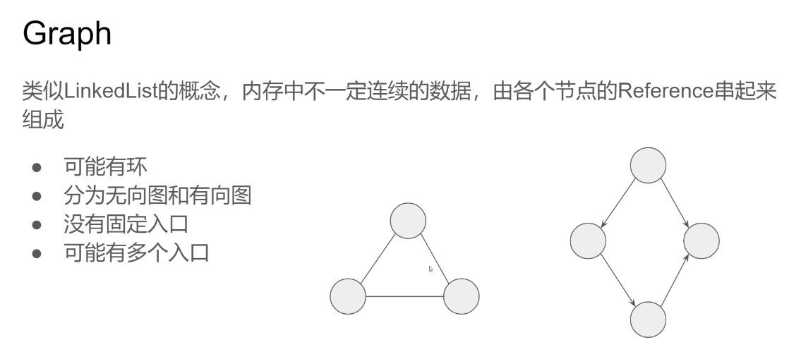
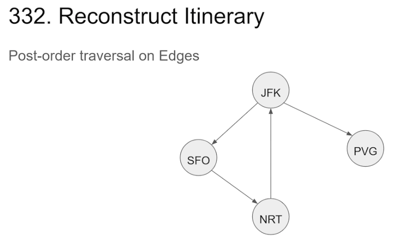
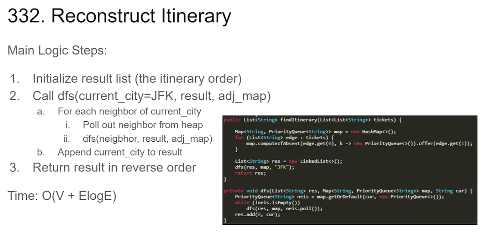

### Graph



类似LinkedList的概念，内存中不一定连续的数据，由各个节点的Reference串起来组成

- 可能有环
- 分为无向图和有向图
- 没有固定入口
- 可能有多个入口


### DFS (Depth-First Search)


DFS(Depth-First Search)
DFS是类似“垂直”概念的搜索，不同于BFS一层一层往外扩展，DFS会一口气扎到最深层再递归回到原点，然后再次一口气扎到另一条路的最深层，如此往复


### 


DFS模板
General Steps:
1. Initialize HashSet to record visited nodes

2. For all entry nodescall dfs():
    a. Validate current node, if visited or invalid or answer node, return 
    b. Do Something(Pre-order) 

  c. For each neighbor node:
         i. Validate neighbor node, if visited or invalid or answer node, 

  ​          don’t recurse on it or return answer
  ​       ii. Recurse down on neighbor node → dfs(neighbor)

  d. Do Something (Post-order)
  DFS traverse graph一般不允许访问同一节点非常数次，所以

  **Time ComplexityO(N * k)，k = max(time(b), time(d))**


### 200. Number of Islands


200.Number oflslands
把所有的1连起来的面积看做一个独立的graph
每次碰到一个1，以此为起点做一次graph traversal (mark all 1s connected to it as the same island)，result++


1. Initialize result = 0
2. For i, j in the 2D matrix 
    a. `If matrix[i][j] == 1`
       i. call dfs(matrix, i, j)

dfs(matrix, i, j)

1. `matrix[i][j] = 0`
2. For each neighbor
       a. If neighbor is not valid (out of bound or equal to 0), skip it 
       b. dfs(matrix, neighbor.i, neighbor.j)
   

**Time: O(m*n)**

```
int[][] dirs = {{0, 1}, {1, 0}, {0, -1}, {-1, 0}};
public int numIsLands(char[][] grid) {
    int count = 0;
    for (int i = 0; i < grid.length; i++) {
        for (int j = 0; j < grid[i].length; j++) {
            if (grid[i][j] == '1') {
                count++;
                dfs(grid, i, j);
            }
        }
    }
    return count;
}

private void dfs(char[][] grid, int i, int j) {
    grid[i][j] = '0';
    for (int[] dir : dirs) {
        int x = i + dir[0], y = j + dir[1];
        if (x < 0 || x >= grid.length || y < 0 || 
        y >= grid[0].length || grid[x][y] == '0') {
            continue;
        }
        dfs(grid, x, y);
    }
}
```


### 332. Reconstruct Ltinerary




Post-order traversal on Edges


332.Reconstruct Itinerary
     建图，Adjacency Heap Map

​     **Map{k,  v} : v is a heap containing all cities connected by a flight from city k**

1. For each Flight (src, dst):
    a. heap = map.contains(src) ? src : new Heap() 
    b. heap.add(dst) 
    c. map[src] = dst 


 

Main Logic Steps:
1. Initialize result list(the itinerary order)
2. Call dfs(current_city = JFK, result, adj_map)
  a.  For each neighbor of current_city
            i. Poll out neighbor from heap 
            ii. dfs(neigbhor, result, adj_map)
3. Return result in reverse order

**Time: O(V + ElogE)** 

```
public List<String> findItinerary(List<List<String>> tickets) {
    Map<String, PriorityQueue<String>> map = new HashMap<>();
    for (List<String> edge : tickets) {
        map.computeIfAbsent(edge.get(0), k -> new PriorityQueue<>()).offer(edge.get(1));
    }

    List<String> res = new LinkedList<>();
    dfs(res, map, "JFK");
    return res;
}

private void dfs(List<String> res, Map<String, PriorityQueue<String>> map, String cur) {
    PriorityQueue<String> neis = map.getOrDefault(cur, new PriorityQueue<>());
    while (!neis.isEmpty()) {
        dfs(res, map, neis.poll());
    }
    // 头插入
    res.add(0, cur);
}

```


### 更多相关题目
Clone Graph(133)
Evaluate Division(399)
Is Graph Bipartite(785) Keys and Rooms (841)
