### Search

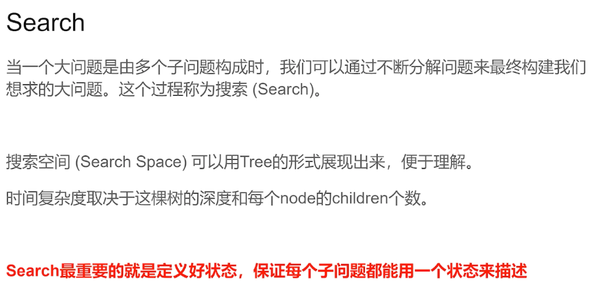

当一个大问题是由多个子问题构成时，我们可以通过不断分解问题来最终构建我们想求的大问题。这个过程称为搜索(Search)。

搜**索空间(Search Space)可以用Tree的形式展现出来**，便于理解。
时间复杂度取决于这棵树的深度和每个node的children个数。

Search最重要的就是定义好状态，保证每个子问题都能用一个状态来描述

### 78. Subsets

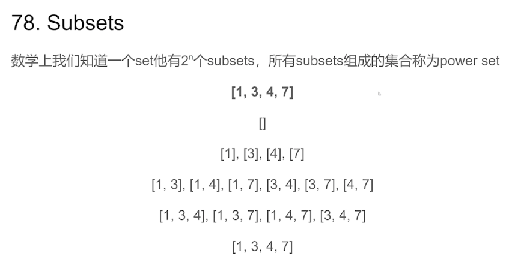

数学上我们知道一个set他有2^n个subsets，所有subsets组成的集合称为power set

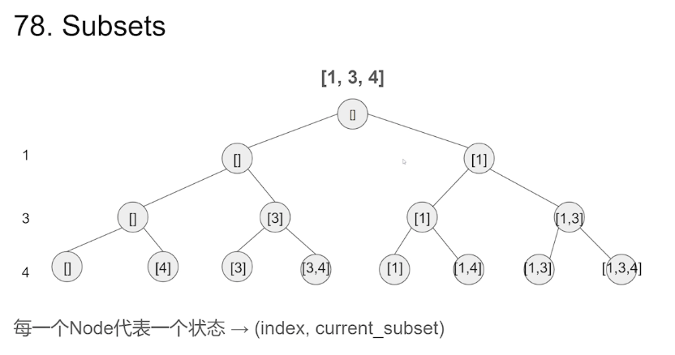

每一个Node代表一个状态 → (index, current_subset)

每个元素，两种选择，添加到Subsets中、不添加


### Top Down DFS模版


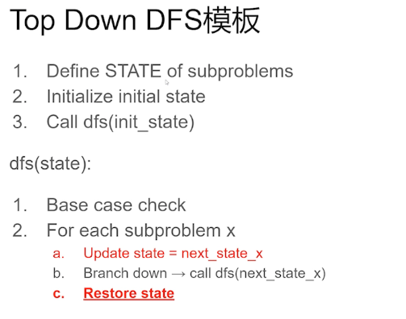

Top Down DFS模板

1. Define STATE of subproblems
2. Initialize initial state
3. Call dfs(init state)

dfs(state):

1. Base case check
2. Foreach subproblem X
     a. Update state = next_state_x 
     b. Branch down→call dfs(next_state_x)
     c. Restore state

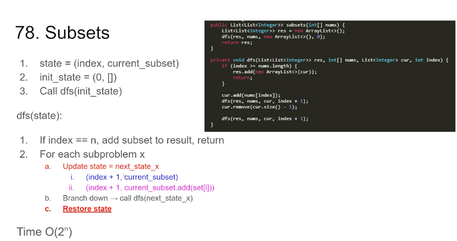


1. state = (index, current_subset)
2. init_state=(0,[])
3. Call dfs(init_state) 

dfs(state): 
1. if index == n, add subset to result, return
2. For each subproblem X
    a. Update state = next_state_x
     i.  (index + 1, current_subset)--------------------不要set[i]
   ii. (index + 1, current_subset.add(set[i]))-----要set[i] 
    b. Branch down → call dfs(next_state x) 
    c. Restore state
    Time O(2^n)

```
public List<List<Integer>> subsets(int[] nums) {
    List<List<Integer>> res = new ArrayList<>();
    dfs(res, nums, new ArrayList<>(), 0);
    return res;
}

private void dfs(List<List<Integer>> res, int[] nums, ArrayList<Integer> cur, int index) {
    if (index >= nums.length) {
        res.add(new ArrayList<>(cur));
        return;
    }

		// 要nums[i]
    cur.add(nums[index]);
    dfs(res, nums, cur, index + 1);
    cur.remove(cur.size() - 1);

    dfs(res, nums, cur, index + 1);
}
```


### DP(Dynamic Programming)

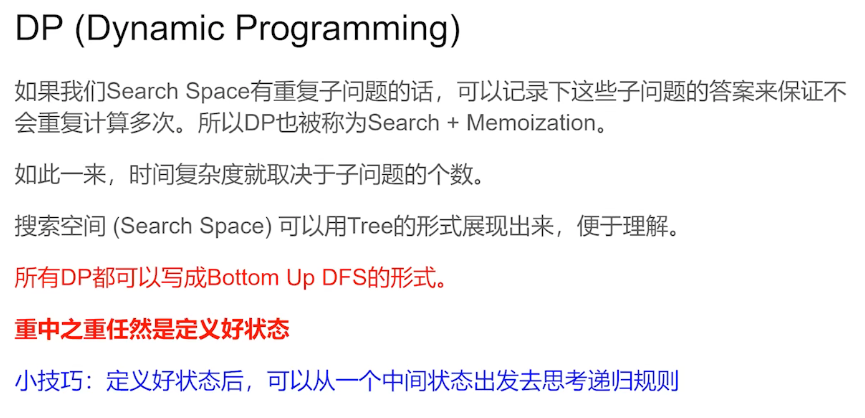

DP(Dynamic Programming)
如果我们Search Space有重复子问题的话，可以记录下这些子问题的答案来保证不会重复计算多次。所以DP也被称为Search + Memoization。

如此一来，时间复杂度就取决于子问题的个数。

搜索空间(Search Space)可以用Tree的形式展现出来，便于理解。
所有DP都可以写成Bottom Up DFS的形式。

**重中之重任然是定义好状态**

**小技巧:定义好状态后，可以从一个中间状态出发去思考递归规则**

### Bottom Up DFS

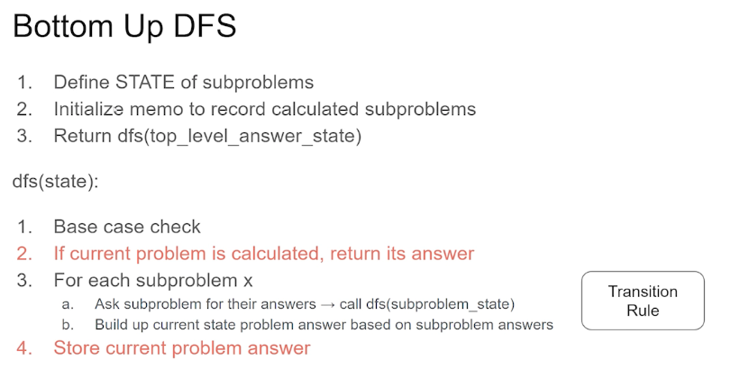

Bottom Up DFS

1. Define STATE of subproblems

2. Initialize memo to record calculated subproblems
3. Return dfs(top level answer state)

dfs(state):
1. Base case check
2. If current problem is calculated, return its answer
3. For each subproblem x 
     a. Ask subproblem for their answers → call dfs(subproblem_state) Rule 
     b. Build up current state problem answer based on subproblem answers

5. Store current problem answer

Transition 状态转移方程

### 139. Word Break

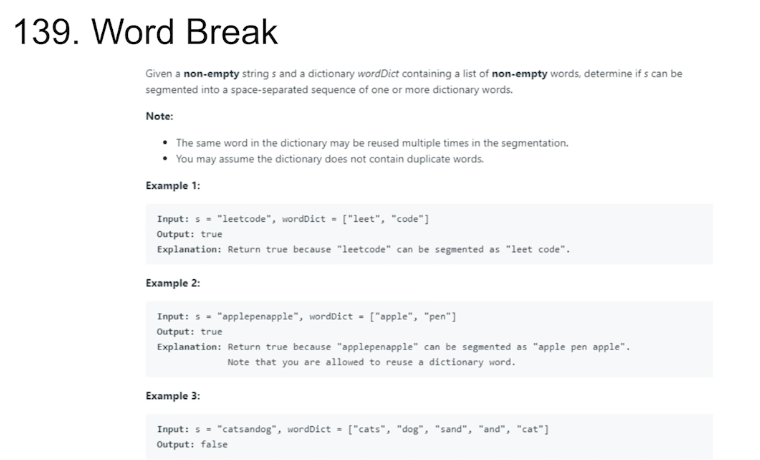


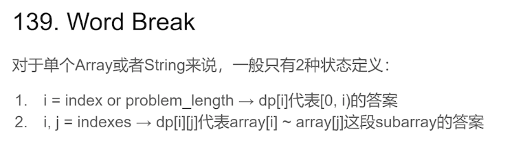
对于单个Array或者String来说，一般只有2种状态定义:

1. i = index or problem_length → dp[] 代表 [0, i) 的答案
2. i , j = indexes → dp[i][j]代表array[i]~array[j]这段subarray的答案


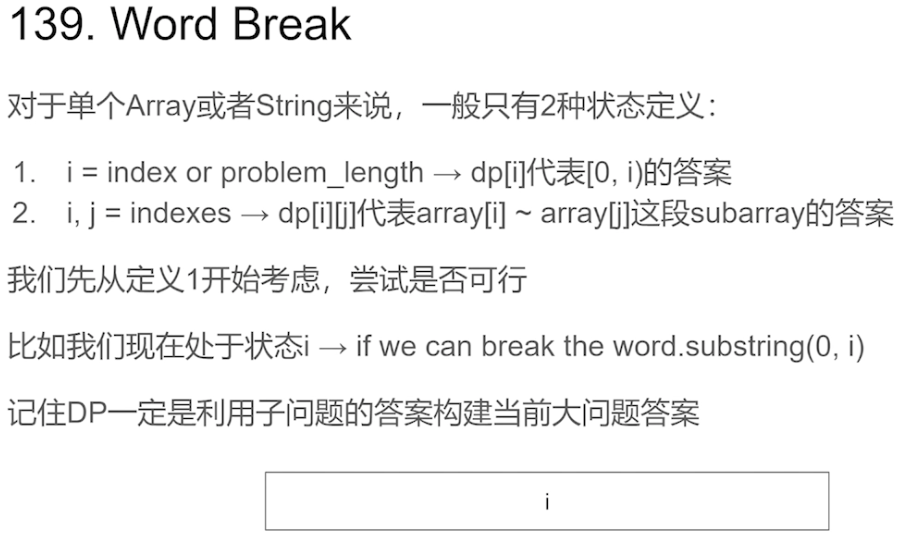

对于单个Array或者String来说，一般只有2种状态定义:

1. i = index or problem_length → dp[] 代表 [0, i) 的答案
2. i , j = indexes → dp[i][j]代表array[i]~array[j]这段subarray的答案

我们先从定义1开始考虑，尝试是否可行
比如我们现在处于状态 i → if we can breakthe word.substring(0, i)
记住DP一定是利用子问题的答案构建当前大问题答案

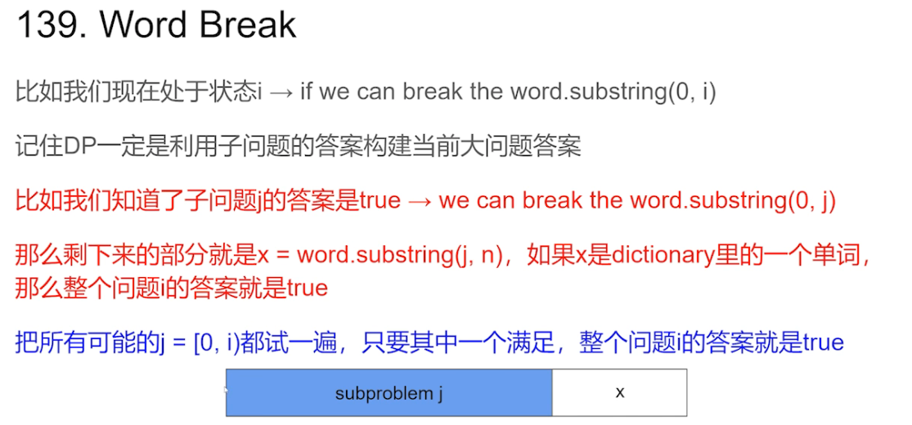

比如我们现在处于状态 i→if we can break the word.substring(0, i)
记住DP一定是利用子问题的答案构建当前大问题答案
比如我们知道了子问题j的答案是true → we can break the word.substring(0, j)
那么剩下来的部分就是x=word.substring(j,n)，如果x是dictionary里的一个单词，那么整个问题i的答案就是true

把所有可能的j = [0,i)都试一遍，只要其中一个满足，整个问题i的答案就是true


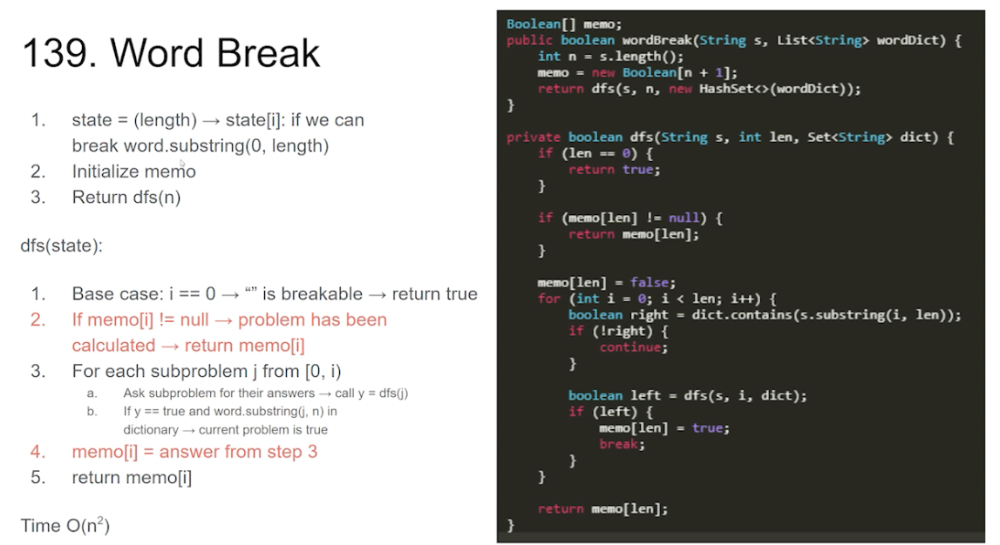

1. state = (length) → state[i]: if we can break word.substring(0,length) 
2. Initialize memo 
3. Return dfs(n)

dfs(state):

1. Base case: i==0→“" is breakable → return true 
2. If memo[i] != null → problem has been calculated → return memo[i]
3. For each subproblem j from [0.i) 
      a.  Ask subproblem for their answers → call y=dfs(i)
      b.  If y==true and word.substring(j, n) in dictionary→ current problem is true
4. memo[i] = answer from 
5. return memo[i]

Time O(n^2) 

```
Boolean[] memo;

public boolean wordBreak(String s, List<String> wordDict) {
    int n = s.length();
    memo = new Boolean[n + 1];
    return dfs(s, n, new HashSet<>(wordDict));
}

private boolean dfs(String s, int len, Set<String> dict) {
    if (len == 0) {
        return true;
    }
    if (memo[len] != null) {
        return memo[len];
    }

    memo[len] = false;
    for (int i = 0; i < len; i++) {
        boolean right = dict.contains(s.substring(i, len));
        if (!right) {
            continue;
        }
        boolean left = dfs(s, i, dict);
        if (left) {
            memo[len] = true;
            break;
        }
    }
    return memo[len];
}

```


###更多相关题目
SubsetsII(90)
Generate Parentheses(22)

Min Cost Climbing Stairs(746)
Climbing Stairs(70)
Maximum Subarray(35)


