### Search


当一个大问题是由多个子问题构成时，我们可以通过不断分解问题来最终构建我们想求的大问题。这个过程称为搜索(Search)。

搜索空间(Search Space)可以用Tree的形式展现出来，便于理解。
时间复杂度取决于这棵树的深度和每个node的children个数。

**Search最重要的就是定义好状态，保证每个子问题都能用一个状态来描述**


### DP(Dynamic Programming)


DP(Dynamic Programming)
如果我们Search Space有重复子问题的话，可以记录下这些子问题的答案来保证不会重复计算多次。
所以DP也被称为Search + Memoization。

如此一来，时间复杂度就取决于子问题的个数。
搜索空间(Search Space)可以用Tree的形式展现出来，便于理解。

**所有DP都可以写成Bottom Up DFS的形式。**

**重中之重任然是定义好状态**

**小技巧:定义好状态后，可以从一个中间状态出发去思考递归规则**


### 96.Unique Binary Search Trees

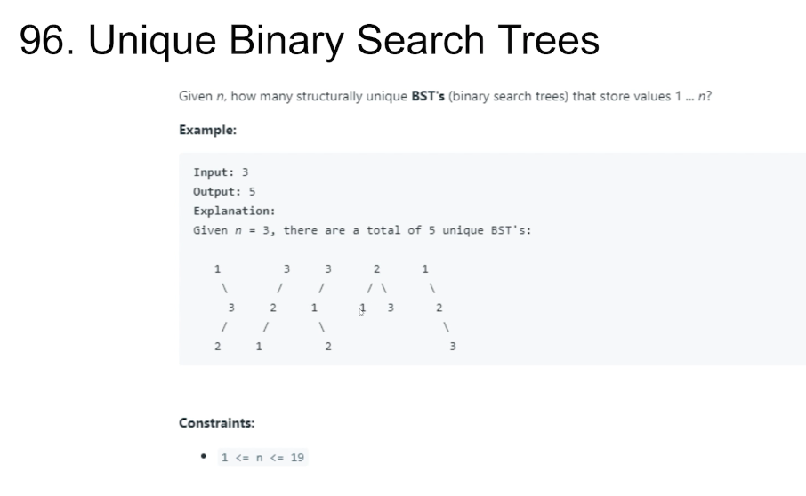

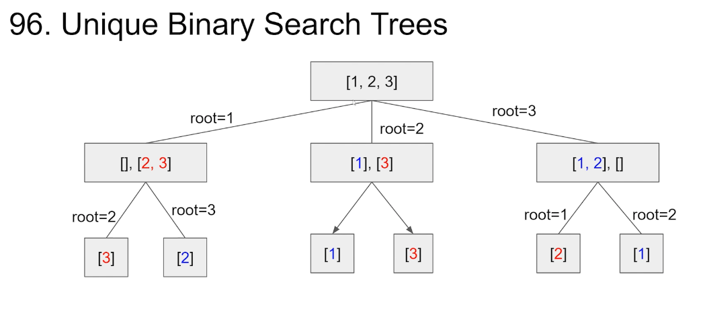

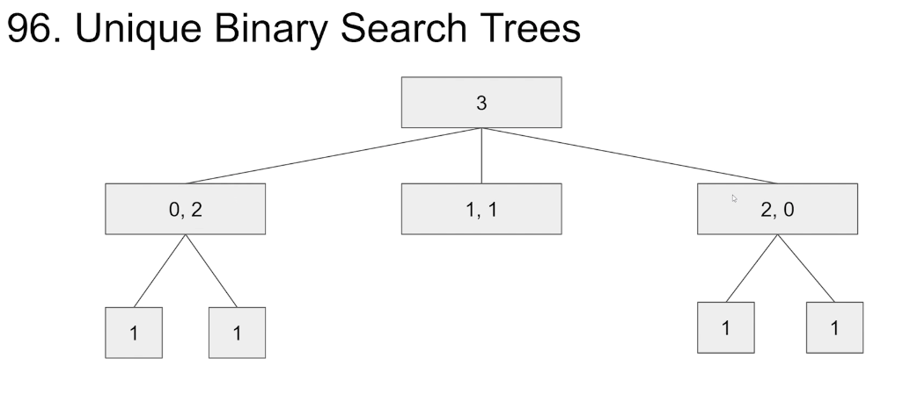

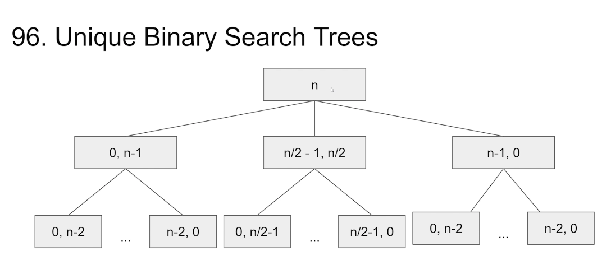

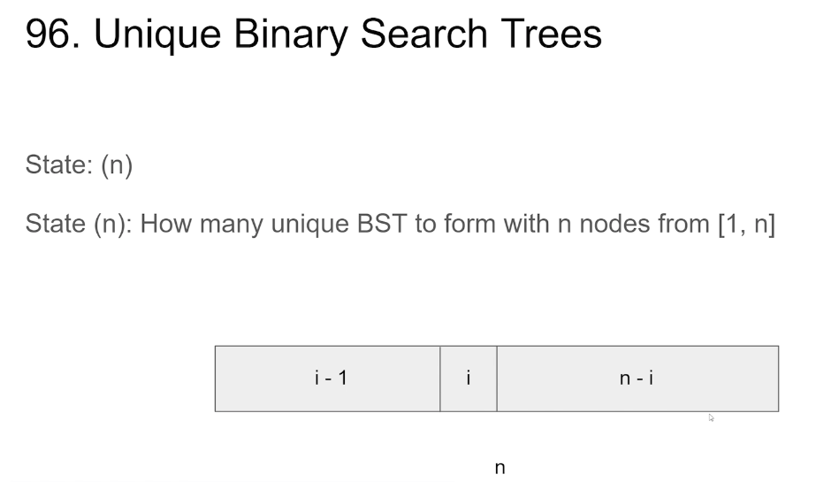

State: (n)
State(n): How many unique BST to form with n nodes from [1, n]

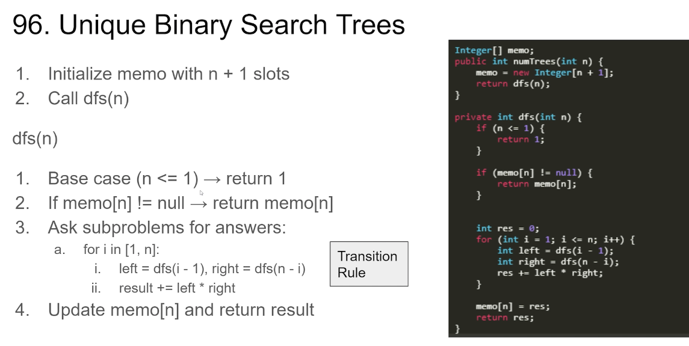

96.Unique Binary Search Trees

1. Initialize memo with n+1 slots
2. Call dfs(n) 

dfs(n) 
1. Base case(n <= 1) → return 1
2. If memo[n] != null → return memo[n] 
3. Ask subproblems for answers:
    a.  for i in [1, n]: 
      i.  left = dfs(i - 1), right = dfs(n - i)
      ii.  result += left * right

4. Update memo[n] and return result

Transition Rule : 状态转移方程

```
Integer[] memo;
public int numTrees(int n) {
    memo = new Integer[n + 1];
    return dfs(n);
}

private int dfs(int n) {
    if (n <= 1) {
        return 1;
    }

    if (memo[n] != null) {
        return memo[n];
    }

    int res = 0;
    for (int i = 1; i <= n; i++) {
        int left = dfs(i - 1);
        int right = dfs(n - i);
        res += left * right;
    }
    memo[n] = res;
    return res;
}
```


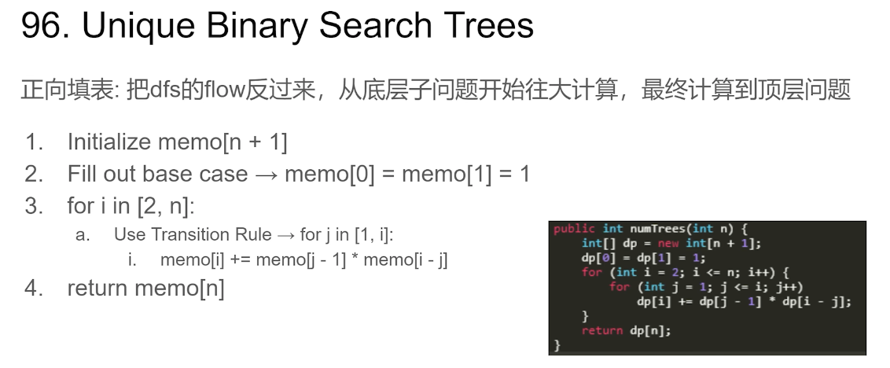

96.Unique Binary Search Trees
正向填表:把dfs的flow反过来，从底层子问题开始往大计算，最终计算到顶层问题
1. Initialize memo[n + 1]
2. Fill out base case → memo[0] = memo[1] = 1
3. for i in [2, n]:
   a. Use Transition Rule  → for j in [1, i]: 
          i.  memo[i] += memo[j - 1] * memo[i - j] 
4. return memo[n] 

```
public int numTrees(int n) {
    int[] dp = new int[n + 1];
    dp[0] = dp[1] = 1;
    for (int i = 2; i <= n; i++) {
        for (int j = 1; j < i; j++) {
            dp[i] += dp[j - 1] * dp[i - j];
        }
    }

    return dp[n];
}
```


### 91. Decode Ways

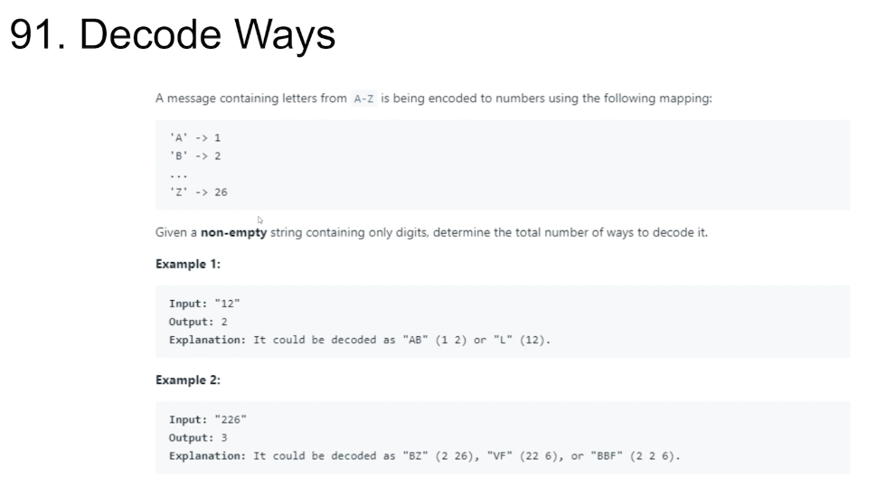

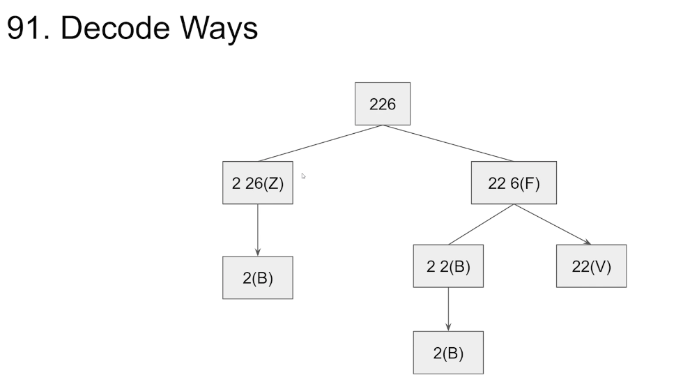

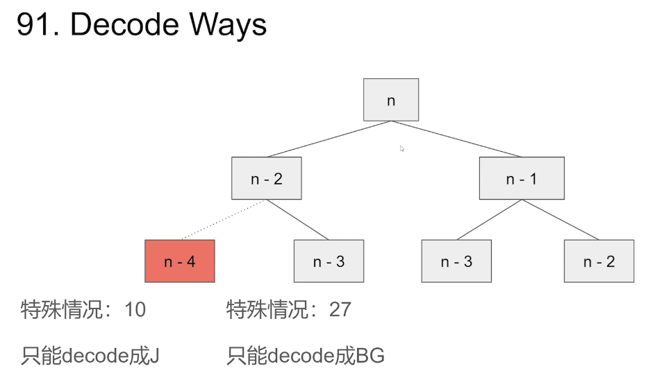

特殊情况: 10          特殊情况: 27 
只能decode成 J      只能decode成 BG

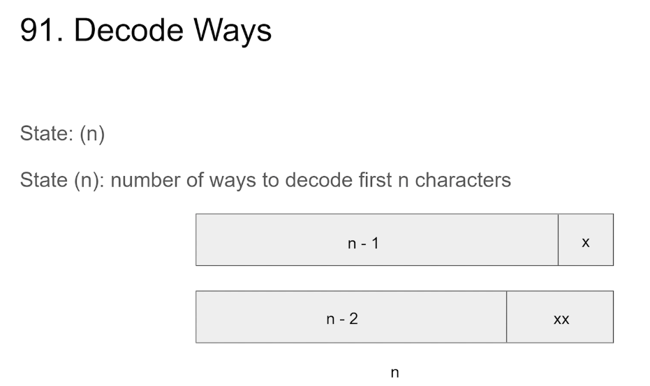

State: (n)
State(n):  number of ways to decode first n characters

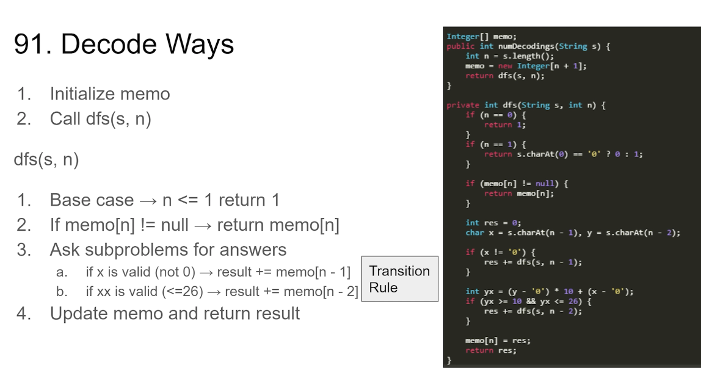

91.Decode Ways 

1. Initialize memo
2. Call dfs(s, n) 

dfs(s, n) 


1. Base case → n <= 1 return 1
2. If memo[n]  != null → return memo[n] 
3. Ask subproblems for answers
       a.  if x isvalid(not 0) → result += memo[n - 1]
       b. if xx is valid(<=26) → result += memo[n-2] 
4. Update memo and return result 

```
Integer[] memo;

public int numDecodings(String s) {
    int n = s.length();
    memo = new Integer[n + 1];
    return dfs(s, n);
}

private int dfs(String s, int n) {
    if (n == 0) {
        return 1;
    }
    if (n == 1) {
        return s.charAt(0) == '0' ? 0 : 1;
    }
    if (memo[n] != null) {
        return memo[n];
    }

    int res = 0;
    char x = s.charAt(n - 1), y = s.charAt(n - 2);
    if (x != '0') {
        res += dfs(s, n - 1);
    }
    int yx = (y - '0') * 10 + (x - '0');
    if (yx >= 10 && yx <= 26) {
        res += dfs(s, n - 2);
    }

    memo[n] = res;
    return res;
}
```


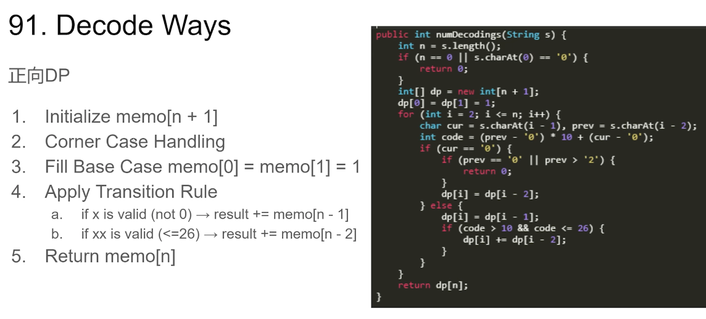

91.Decode Ways 
正向DP

1. Initialize memo[n + 1]
2. Corner Case Handling
3. Fill Base Case memo[0] = memo[1] = 1
4. Apply Transition Rule
  a. if x is valid(not 0) → result += memo[n-1]
  b. if xx is valid(<=26) → result += memo[n-2]
5. Return memo[n]

```
public int numDecodings(String s) {
    int n = s.length();
    if (n == 0 || s.charAt(0) == '0') {
        return 0;
    }

    int[] dp = new int[n + 1];
    dp[0] = dp[1] = 1;
    for (int i = 1; i <= n; i++) {
        char cur = s.charAt(i - 1), prev = s.charAt(i - 2);
        int code = (prev - '0') * 10 + (cur - '0');
        if (cur == '0') {
            if (prev == '0' || prev > '2') {
                return 0;
            }
            dp[i] = dp[i - 2];
        } else {
            dp[i] = dp[i - 1];
            if (code > 10 && code <= 26) {
                dp[i] += dp[i - 2];
            }
        }
    }
    return dp[n];
}

```


### 更多相关题目

Maximum Subarray(53)
Integer Break(343)
Perfect Squares(279)
Counting Bits(338)
Range Sum Query-Immutable(303)
Word BreakII(140)
