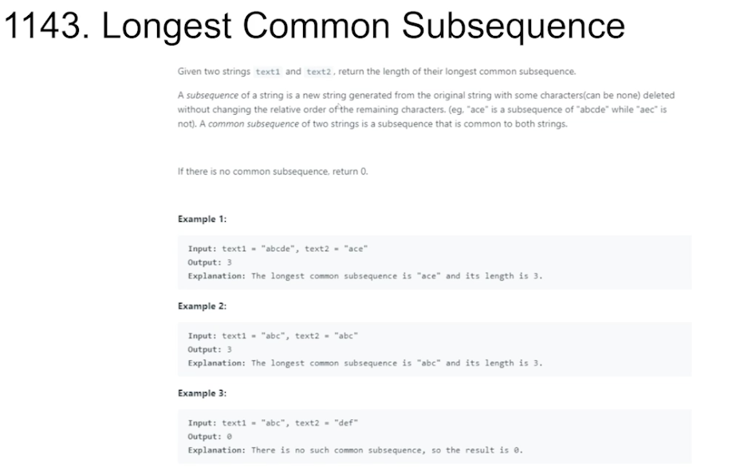

### Search


当一个大问题是由多个子问题构成时，我们可以通过不断分解问题来最终构建我们想求的大问题。这个过程称为搜索(Search)。

搜索空间(Search Space)可以用Tree的形式展现出来，便于理解。
时间复杂度取决于这棵树的深度和每个node的children个数。

**Search最重要的就是定义好状态，保证每个子问题都能用一个状态来描述**


### DP(Dynamic Programming)


DP(Dynamic Programming)
如果我们Search Space有重复子问题的话，可以记录下这些子问题的答案来保证不会重复计算多次。
所以DP也被称为Search + Memoization。

如此一来，时间复杂度就取决于子问题的个数。
搜索空间(Search Space)可以用Tree的形式展现出来，便于理解。

**所有DP都可以写成Bottom Up DFS的形式。**

**重中之重任然是定义好状态**

**小技巧:定义好状态后，可以从一个中间状态出发去思考递归规则**


### 2D Dynamic Programming


2D Dynamic Programming

- 2D Array → state=(row, col)
- 2 1D Arrays→ Each 1D state
- 1DArray + K→state=(i，k)
- 1D Array→2D state(subarray)

### 63. Unique Paths II


State: (i,  j) → Number of unique paths from (0, 0) to (i, j)


1. Initialize memo
2. Call dfs(matrix, m-1, n-1) 

dfs(matrix,  i, j)

1. Base case 
a. (i, j) = (0, 0) → return 1
b. (i, j) out of bound → return 0
c. (i, j) is obstacle → return 0
2. If `memo[i][j] != null`→ return` memo[i][j]`
3. Ask subproblems for answers
   a. result += dfs(matrix, i-1, j)
   b. result += dfs(matrix, i, j-1)
4. Update memo and return result

```
Integer[][] memo;
int m, n;

public int uniquePathsWithObstacles(int[][] obstacleGrid) {
    m = obstacleGrid.length;
    n = obstacleGrid[0].length;
    memo = new Integer[m][n];

    return dfs(obstacleGrid, m - 1, n - 1);
}

private int dfs(int[][] matrix, int i, int j) {
    if (i < 0 || i >= m || j < 0 || j >= n || matrix[i][j] == 1) {
        return 0;
    }
    if (i == 0 && j == 0) {
        return 1;
    }
    if (memo[i][j] != null) {
        return memo[i][j];
    }

    int res = 0;
    res += dfs(matrix, i - 1, j);
    res += dfs(matrix, i, j - 1);
    return memo[i][j] = res;
}
```


正向DP 

1. Initialize `memo[m][n]` 
2. Fill Base Case `memo[0][0]=1`
3. Apply Transition Rule
    a. `matrix[i][j]` = 1→ `mem[i][j]`=0 
    b. (i, j) out of bound → skip
    c. `memo[i][j] = memo[i-1][j] + memo[i][j-1]`
4. Return `memo[m - 1][n - 1]`

**小技巧:memo做个padding，把out of bound的位置全预先填充**
**注意memo和原input的index会错位**

```
public int uniquePathsWithObstacles(int[][] obstaceGrid) {
    int m = obstaceGrid.length, n = obstaceGrid[0].length;
    int[][] memo = new int[m + 1][n + 1];
    memo[1][1] = 1;

    for (int i = 1; i <= m; i++) {
        for (int j = 1; j <= n; j++) {
            if (obstaceGrid[i - 1][j - 1] == 1) {
                memo[i][j] = 0;
            } else {
                memo[i][j] += memo[i - 1][j] + memo[i][j - 1];
            }
        }
    }

    return memo[m][n];
}
```


### 1143.Longest Common Subsequence




1143.Longest Common Subsequence
State:(i, j) → Longest Common Subsequence of [0, i] for string1and [0, j] for string2


1. Initialize memo

2. Call dfs(t1, t2, m-1, n-1)

dfs(t1, t2, i, j)  

1. Base case: (i, j) out of bound → return 0

2. lf `memo[i][j] != null` → `return memo[i][j]` 

3. Ask subproblems for answers
    a.  t1[i] == t2[i] → result = dfs(t1 ,t2, i-1, j-1) + 1
    b.  t1[i] != t2[j] → result = max(dfs(t1, t2, i-1,  j), dfs(t1, t2,  i,  j - 1))

4. Update memo and return result Rule

```
Integer[][] memo;

public int longestCommonSubsequence(String text1, String text2) {
    int m = text1.length(), n = text2.length();
    memo = new Integer[m][n];
    return dfs(text1, text2, m - 1, n - 1);
}

private int dfs(String t1, String t2, int i, int j) {
    if (i < 0 || j < 0) {
        return 0;
    }
    if (memo[i][j] != null) {
        return memo[i][j];
    }

    int res = 0;
    if (t1.charAt(i) == t2.charAt(j)) {
        res = dfs(t1, t2, i - 1, j - 1) + 1;
    } else {
        res = Math.max(dfs(t1, t2, i - 1, j), dfs(t1, t2, i, j - 1));
    }

    return memo[i][j] = res;
}
```


正向DP 

1. Initialize `memo[m][n]`
2. Fill Base Case `memo[0][0]=0` 
3. Apply Transition Rule
     a.  (i, j) out of bound → 0
     b.  t1[i] == t2[j] → `memo[i][j] = memo[i-1][j-1]+1`
     c.  t1[i] != t2[i] → `memo[i][j] = max(memo[i-1][j], memo[i][j-1])`
5. Return `memo[m][n]`

```
public int longestCommonSubsequence(String text1, String text2) {
    int m = text1.length(), n = text2.length();
    int[][] memo = new int[m + 1][n + 1];

    for (int i = 1; i <= m; i++) {
        for (int j = 1; j <= n; j++) {
            if (text1.charAt(i - 1) == text2.charAt(j - 1)) {
                memo[i][j] = memo[i - 1][j - 1] + 1;
            } else {
                memo[i][j] = Math.max(memo[i - 1][j], memo[i][j - 1]);
            }
        }
    }

    return memo[m][n];
}
```


### 更多相关题目
Longest Common Subarray
Minimum Falling Path Sum(931)
Unique Paths(62)
Triangle(120)
Range Sum Query 2D-Immutable(304)
Distinct Subsequences(115)
