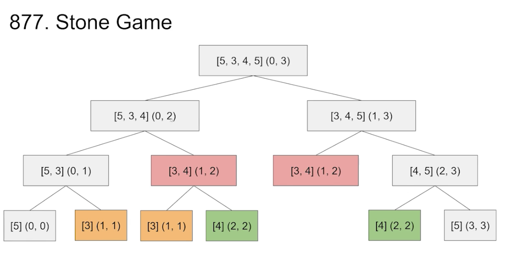

### Search


当一个大问题是由多个子问题构成时，我们可以通过不断分解问题来最终构建我们想求的大问题。这个过程称为搜索(Search)。

搜索空间(Search Space)可以用Tree的形式展现出来，便于理解。
时间复杂度取决于这棵树的深度和每个node的children个数。

**Search最重要的就是定义好状态，保证每个子问题都能用一个状态来描述**


### DP(Dynamic Programming)


DP(Dynamic Programming)
如果我们Search Space有重复子问题的话，可以记录下这些子问题的答案来保证不会重复计算多次。
所以DP也被称为Search + Memoization。

如此一来，时间复杂度就取决于子问题的个数。
搜索空间(Search Space)可以用Tree的形式展现出来，便于理解。

**所有DP都可以写成Bottom Up DFS的形式。**

**重中之重任然是定义好状态**

**小技巧:定义好状态后，可以从一个中间状态出发去思考递归规则

### 2D Dynamic Programming


### 877.Stone Game


State:(i, j) → maximum relative score we can earn with subarray of stones [i...j]




1. Initialize memo

2. Call dfs(piles, 0, n-1)

3. return result > 0


dfs(piles, i, j)

1. Base case i==j → return piles[i]
   i > j → return 0 (empty piles no value)
2. If `memo[i][j]` != null → `return memo[i][j]` 
3. Ask subproblems for answers
     a.  result = max(piles[i] - dfs(i+1, j), piles[j] - dfs(i, j-1))

4. Update memo and return result

```
Integer[][] memo;

public boolean stoneGame(int[] piles) {
    int n = piles.length;
    memo = new Integer[n][n];
    dfs(piles, 0, n - 1);
    return memo[0][n - 1] > 0;
}

private int dfs(int[] piles, int i, int j) {
    if (i > j) {
        return 0;
    }
    if (i == j) {
        return piles[i];
    }
    if (memo[i][j] != null) {
        return memo[i][j];
    }

    int res = Math.max(piles[i] - dfs(piles, i + 1, j),
            piles[j] - dfs(piles, i, j - 1));
    return memo[i][j] = res;
}
```


正向DP 

1. Initialize `memo[n][n]`
2. Fill Base Case `memo[i][i] = piles[i]`
3. Apply Transition Rule

   ```
       a. for each subproblem length I from[2, n]
                 for each left bound i from [0, n -1]
     						j = i + l-1
     						`memo[i]i] = max(piles[i] - memo[i+1][j], piles[j] - memo[i][j-1])`
   ```
4. Return `memo[0][n-1]>0`

```
public boolean stoneGame(int[] piles) {
    int n = piles.length;
    int[][] memo = new int[n][n];
    for (int i = 0; i < n; i++) {
        memo[i][i] = piles[i];
    }

    for (int l = 2; l <= n; l++) {
        for (int i = 0; i <= n - 1; i++) {
            int j = i + 1 - 1;
            memo[i][j] = Math.max(piles[i] - memo[i + 1][j],
                    piles[j] - memo[i][j - 1]);
        }
    }
    return memo[0][n - 1] > 0;
}
```


### 5. Longest Palindromic Substring


Brute Force
For each substring, if it’s a palindrome, update global max → O(n^3)

题目明说是跟substring有关，所以1D的dp无法实现，需要用2D(i, j)来表示 substring的状态


State:(i, j) → if substring(i, j+ 1) is palindrome or not
Base case: j - i + 1 <= 1 → true (empty or single char is palindrome)
Recursion rule: if s[i] == s[j] and s[i+1…j-1] is palindrome, then s[i….j] is palindrome. otherwise not


对于 length = n 的每一个substring，都要作为子问题计算一次
利用 length=2 的所有子问题的答案，可以构建所有 length=4 的问题答案


**Recursive ldea: 每一个长度为n的string拥有2个长度为n-1的substrings**


1. Initialize memo 
2. Call dfs(s, 0, n-1) 

dfs(s, i, j) 
1. Base case i >= j → return true 
        a. Update global_result
2. If `memo[i][j]` != null → return `memo[i][j]`
3. Ask subproblems for answers
       a.  if s[i] == s[j] and dfs(s, i+1, j-1) → `memo[i][j] = true` 
                i. Update global_result if true
       b.  else dfs(s, i+1, j), dfs(s, i, j-1)
4. Update memo and return result

```
Boolean[][] memo;
String lps = "";

public String longestPalindrome(String s) {
    int n = s.length();
    memo = new Boolean[n][n];
    dfs(s, 0, n - 1);
    return lps;
}

private boolean dfs(String s, int i, int j) {
    if (i >= j) {
        if (lps.length() < j - i + 1) {
            lps = s.substring(i, j + 1);
        }
        return true;
    }
    if (memo[i][j] != null) {
        return memo[i][j];
    }

    boolean res = false;
    if (s.charAt(i) == s.charAt(j) && dfs(s, i + 1, j - 1)) {
        res = true;
        if (lps.length() < j - i + 1) {
            lps = s.substring(i, j + 1);
        } else {
            dfs(s, i + 1, j);
            dfs(s, i, j - 1);
        }
    }

    return memo[i][j] = res;
}
```


正向DP

1. Initialize `memo[n][n]` 

2. Fill Base Case `memo[i][i]=true memo[i][i-1]=true`

3. Apply Transition Rule 
      a.  for each subproblem length from [2, n] 
                   for each left bound i from [0, n - l]
                            j = i + l - 1 
                            `memo[i][j]=memo[i+1][j-1] && s[i] == s[j]`
                            Update global_result if `memo[i][j]=true`
    4.Return global result

```
public String longestPalindrome(String s) {
    int n = s.length();
    if (n == 0) {
        return "";
    }

    String lps = s.substring(0, 1);
    boolean[][] memo = new boolean[n][n];
    for (int i = 0; i < n; i++) {
        memo[i][i] = true;
    }
    for (int i = 1; i < n; i++) {
        memo[i][i - 1] = true;
    }

    for (int l = 2; l <= n; l++) {
        for (int i = 0; i <= n - l; i++) {
            int j = i + l - 1;
            memo[i][j] = s.charAt(i) == s.charAt(j) && memo[i + 1][j - 1];
            if (memo[i][j] && lps.length() < 1) {
                lps = s.substring(i, j + 1);
            }
        }
    }
    return lps;
}

```

### 更多相关题目

Longest Palindromic Subsequence(516)
Length of Longest Fibonacci Subsequence(873)
Minimum Insertion Steps to Make a String Palindrome(1312)
Burst Balloons(312)
Minimum Cost to Merge Stones(1000)
