### Search


当一个大问题是由多个子问题构成时，我们可以通过不断分解问题来最终构建我们想求的大问题。这个过程称为搜索(Search)。

搜索空间(Search Space)可以用Tree的形式展现出来，便于理解。
时间复杂度取决于这棵树的深度和每个node的children个数。

**Search最重要的就是定义好状态，保证每个子问题都能用一个状态来描述**


### DP(Dynamic Programming)


DP(Dynamic Programming)
如果我们Search Space有重复子问题的话，可以记录下这些子问题的答案来保证不会重复计算多次。
所以DP也被称为Search + Memoization。

如此一来，时间复杂度就取决于子问题的个数。
搜索空间(Search Space)可以用Tree的形式展现出来，便于理解。

**所有DP都可以写成Bottom Up DFS的形式。**

**重中之重任然是定义好状态**

**小技巧:定义好状态后，可以从一个中间状态出发去思考递归规则

### 2D Dynamic Programming

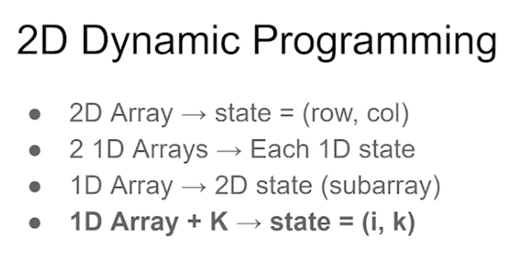

### 

### 410.Split Array Largest Sum

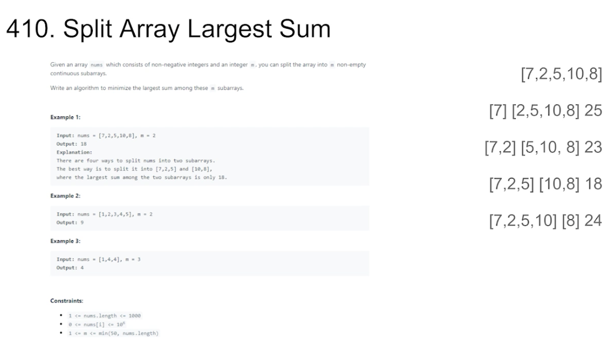

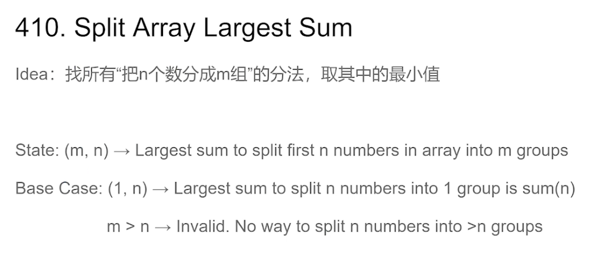

410.Split Array Largest Sum
Idea: 找所有 "把n个数分成m组" 的分法，取其中的最小值

State:(m, n) → Largest sum to split first n numbers in array into m groups
Base Case:(1, n) → Largest sum to split n numbers into 1 group is sum(n)
                   m>n → Invalid. No way to split n numbers into >n groups

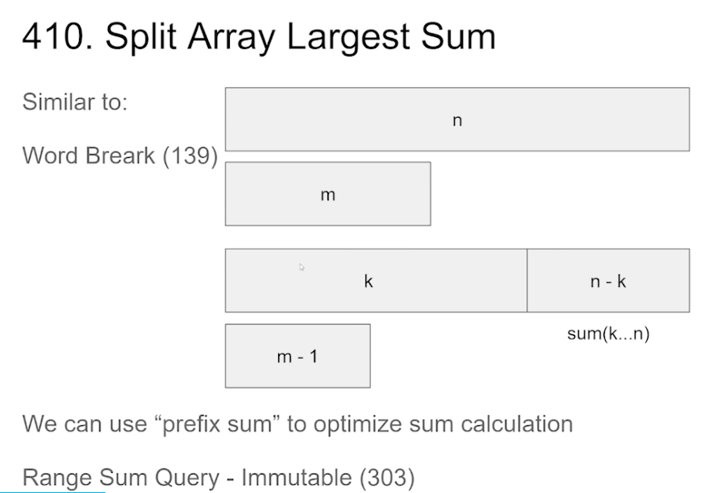

We can use "prefix sum" to optimize sum calculation
Range Sum Query - Immutable(303)

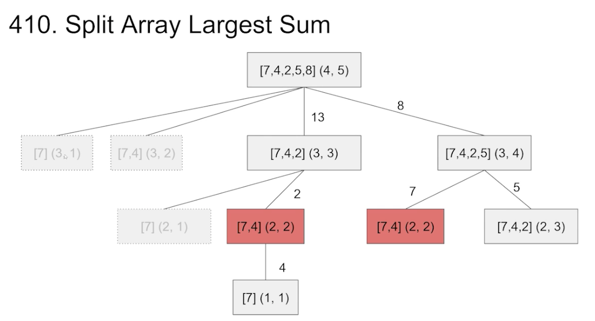

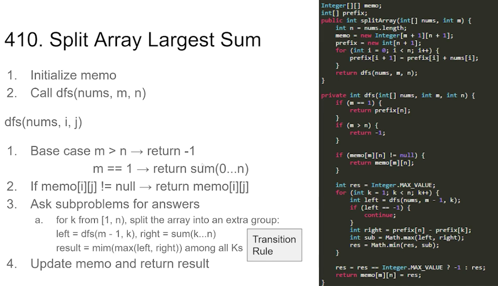

1. Initialize memo
2. Call dfs(nums,  m, n)

dfs(nums, i, j)

1. Base case m > n → return  -1
          m==1 → return sum(0...n)
2. If memo[i][j] != null → return memo[i][j]
3. Ask subproblems for answers
     a.  for k from (1, n), split the array into an extra group:
           left = dfs(m-1, k), right = sum(k….n) 
          result = min(max(left, right)) among all Ks 
4. Update memo and return result 

```
Integer[][] memo;
int[] prefix;

public int splitArray(int[] nums, int m) {
    int n = nums.length;
    memo = new Integer[m + 1][n + 1];
    prefix = new int[n + 1];
    for (int i = 0; i < n; i++) {
        prefix[i + 1] = prefix[i] + nums[i];
    }

    return dfs(nums, m, n);
}

private int dfs(int[] nums, int m, int n) {
    if (m == 1) {
        return prefix[n];
    }
    if (m > n) {
        return -1;
    }
    if (memo[m][n] != null) {
        return memo[m][n];
    }

    int res = Integer.MAX_VALUE;
    for (int k = 1; k < n; k++) {
        int left = dfs(nums, m - 1, k);
        if (left == -1) {
            continue;
        }
        int right = prefix[n] - prefix[k];
        int sub = Math.max(left, right);
        res = Math.min(res, sub);
    }

    res = res == Integer.MAX_VALUE ? -1 : res;
    return memo[m][n] = res;
}
```

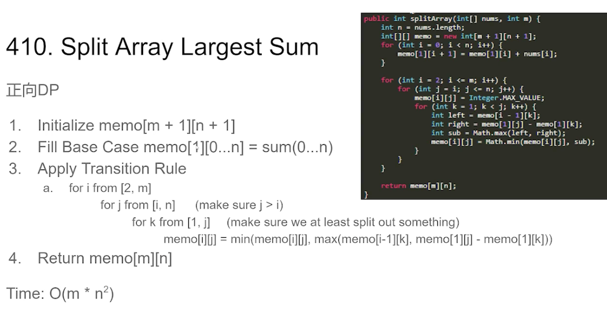

正向DP
1. Initialize `memo[m + 1][n + 1]` 
2. Fill Base Case `memo[1][0…n] = sum(0…n)` 
3. Apply Transition Rule
   a. for i from [2, m]
            for j from[i,  n]   (make sure j>i)
                   for k from [1, j]    (make sure we at least split out something)
                           `memo[i][i] = min(memo[i][j], max(memo[i-1][k] memo[1][j] - memo[1][k]))`
4. Return `memo[m][n]`

**Time: O(m * n²)**

```
public int splitArray(int[] nums, int m) {
    int n = nums.length;
    int[][] memo = new int[m + 1][n + 1];
    for (int i = 0; i < n; i++) {
        memo[1][i + 1] = memo[1][i] + nums[i];
    }

    for (int i = 2; i <= m; i++) {
        for (int j = i; j <= n; j++) {
            memo[i][j] = Integer.MAX_VALUE;
            for (int k = 1; k < j; k++) {
                int left = memo[i - 1][k];
                int right = memo[1][j] - memo[1][j];
                int sub = Math.max(left, right);
                memo[i][j] = Math.min(memo[i][j], sub);
            }
        }
    }

    return memo[m][n];
}
```


### 188.Best Time to Buy and Sell StockIV

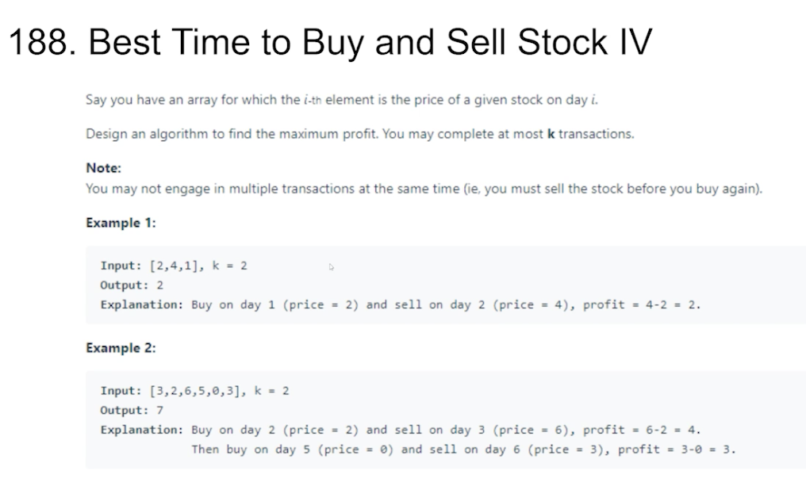

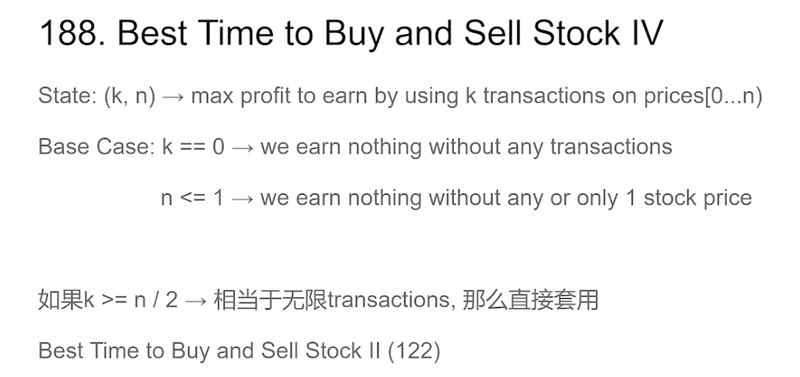

State:(k, n) → max profit to earn by using k transactions on prices[0...n)
Base Case: k == 0 → we earn nothing without any transactions
                    n <= 1 → we earn nothing without any or only 1 stock price

如果k >= n/2 → 相当于无限transactions，那么直接套用
Best Time to Buy and Sell StockII(122)

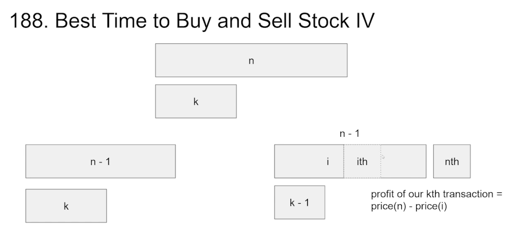

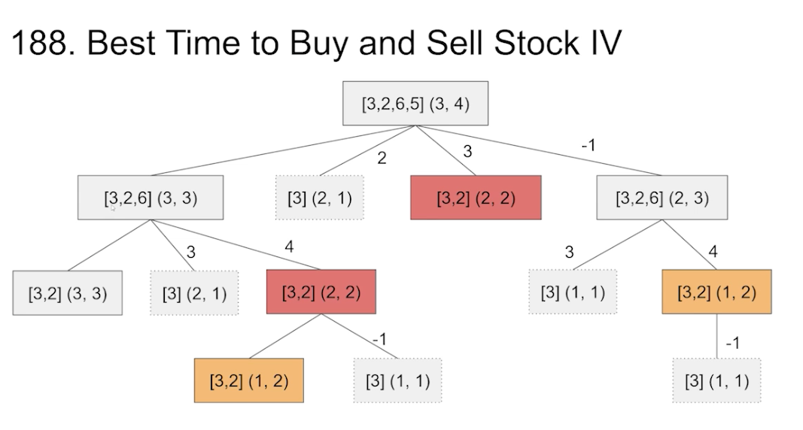


1. Initialize memo
2. Call dfs(nums, k, n) 
   

dfs(nums, k, n)

1. Base case k == 0 || n <= 1 → return 0 
2. lf `memo[i][j] != null → return memo[i][j]`
3. Ask subproblems for answers
      a.  Do not make transaction with this nth stock → result = dfs(k, n-1) 
      b.  Try make all possible transactions take the maximum: 
                   for i from [1,n):         (cannot make transaction with nth itself)
                           res = max(res, dfs(k-1, i) + prices[n-1] - prices[i-1])
4. Update memo and return result

```
Integer[][] memo;

public int maxProfit(int k, int[] prices) {
    int n = prices.length;
    if (n == 0) {
        return 0;
    }
    if (k >= n / 2) {
        int max = 0;
        for (int i = 0; i < n - 1; i++) {
            if (prices[i] < prices[i + 1]) {
                max += prices[i + 1] - prices[i];
            }
            return max;
        }
    }

    memo = new Integer[k + 1][n + 1];
    return dfs(prices, k, n);
}

private int dfs(int[] prices, int k, int n) {
    if (k == 0 || n <= 1) {
        return 0;
    }

    if (memo[k][n] != null) {
        return memo[k][n];
    }

    int res = dfs(prices, k, n - 1);
    for (int i = 1; i < n; i++) {
        res = Math.max(res, dfs(prices, k - 1, i) + prices[n - 1] - prices[i - 1]);
    }

    return memo[k][n] = res;
}

```

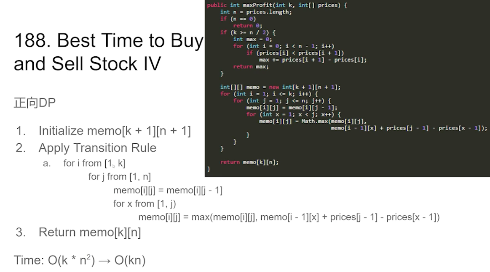

正向DP 
1. Initialize `memo[k + 1][n + 1]`
2. Apply Transition Rule
     a.  for i from [1,k]
              for j from [1, n]
                    `memo[i][j] = memo[i][j-1]`
                    for x from [1, j)
                          `memo[i][j] = max(memo[i][j], memo[i-1][x] + prices[j-1] - prices[X-1])`
3. Return `memo[k][n]`

Time: O(k * n^2)  → O(kn)

```
public int maxProfit(int k, int[] prices) {
    int n = prices.length;
    if (n == 0) {
        return 0;
    }
    if (k >= n / 2) {
        int max = 0;
        for (int i = 0; i < n - 1; i++) {
            if (prices[i] < prices[i + 1]) {
                max += prices[i + 1] - prices[i];
            }
            return max;
        }
    }

    int[][] memo = new int[k + 1][n + 1];
    for (int i = 1; i <= k; i++) {
        for (int j = 1; j <= n; j++) {
            memo[i][j] = memo[i][j - 1];
            for (int x = 1; x < j; x++) {
                memo[i][j] = Math.max(memo[i][j],
                        memo[i - 1][x] + prices[j - 1] - prices[x - 1]);
            }
        }
    }

    return memo[k][n];
}
```

### 更多相关题目
Coin Change(322)
Best Time to Buy and SellStockIII(123)
Super Egg Drop(887)
Minimum Difficulty of a Job Schedule(1335)
Valid PalindromeIIl(1216)
