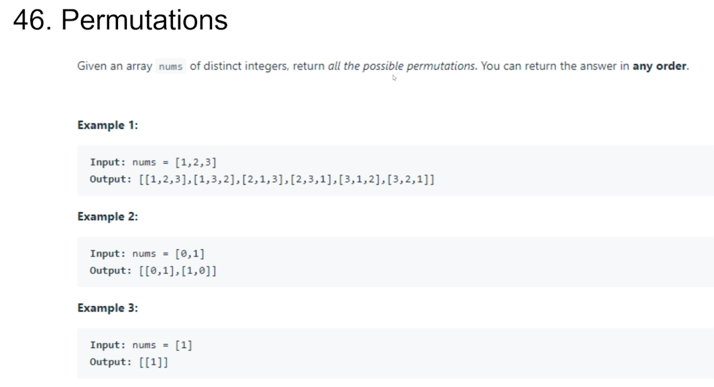

### Backtrack


Backtrack是DFS的一种形式，基本写法类似于TopDown DFS，但是引入了状态回溯。

每次搜索一个分支，会首先记录当前节点的状态，尝试完某一个分支后，把状态回溯到记录的状态，再去尝试另外的分支

为什么要回溯状态?如果不回溯，A分支的状态可能会被代入B分支，但他们又是独立的，所以会影响结果。


### Why Backtrack


假如我们想要得到每条根到叶路径上的数字:

[1, 2, 3] → 123
[1, 2, 4] → 124 
[1,2,5] → 125


状态: [1, 2, 3]

下一步我们要尝试4这个分支，但我们状态是[1, 2, 3]
如果不回溯那么下一个状态就会变成[1, 2, 3, 4]


### Backtrack模板


Backtrack模板
Backtrack()

1. Base Case
2. For each possibility p
a. Memorize current state 
b. backtrack(next_state) 
c. Restore current state


### 46. Permutations



### Thoughts


houghts

- 从数学上来想，n个元素的permutation一共有n!种排序 o n*(n-1)*(n-2)…*3*2*1

- 对于第一个位置有n种选择
- 第二个位置有(n-1)种选择
  - 因为第一个位置用掉一个元素

那么我们要做的就是模拟这个过程，不断地搜索所有的可能性


### Recursion (Search) Tree


### Summary


- Base Case → 处理完最后一个元素
  - 把当前Array做一份copy添加到答案里
    - 为什么? Java里object存的是地址，如果不做copy，每次添加到答案内的地址都是
      同一个array，那么最后答案里会存n!个
      同样的array，所以要做copy让每个答案独立开 
- backtrack(array, index) 
- 从 i = [index, n) 之间依次选取所有元素进行搜索
  - 每次将i和index的元素交换 → next_state
  - dfs(array, index+1)
  - 将i和index元素交换回来→restore state
    - 为什么?因为要回溯状态，不能
      让其他分支的状态干扰接下来的搜索分支(独立)

```
public List<List<Integer>> permute(int[] nums) {
    List<List<Integer>> res = new ArrayList<>();
    dfs(res, nums, 0);
    return res;
}

private void dfs(List<List<Integer>> res, int[] nums, int index) {
    if (index >= nums.length) {
        List<Integer> ans = new ArrayList<>();
        for (int i = 0; i < nums.length; i++) {
            ans.add(nums[i]);
        }
        res.add(ans);
        return;
    }

    for (int i = index; i < nums.length; i++) {
        swap(nums, index, i);
        dfs(res, nums, index + 1);
        swap(nums, index, i);
    }
}

private void swap(int[] nums, int i1, int i2) {
    int tmp = nums[i1];
    nums[i1] = nums[i2];
    nums[i2] = tmp;
}
```


### 47. Permutations II


### Thoughts


Thoughts

- 这次会有重复元素怎么办?
  - 需要引入查重机制
- 什么时候查重?
    - 在从i=[index, n)中尝试所有可能性时，利用hashset来查重同一个元素是否被使用了多次，如果多次见到同一个元素，那么就直接跳过


### Summary


- Base Case→处理完最后一个元素
  - 把当前Array做一份copy添加到答案里
    - 为什么?Java里object存的是地址，如果
      不做copy，每次添加到答案内的地址都是
      同一个array，那么最后答案里会存n!个
      同样的array，所以要做copy让每个答案独立开
- backtrack(array, index)
- 从i=[index, n)之间依次选取所有元素进行搜索
  - 每次将i和index的元素交换 → next_state
  - 如果array[index]还没有被搜素过，才进行搜索
  - dfs(array, index+1) → restore state
  - 将i和index元素交换回来
    - 为什么?因为要回溯状态，不能
          让其他分支的状态干扰接下来的搜索分支(独立)

```
public List<List<Integer>> permuteUnique(int[] nums) {
    List<List<Integer>> res = new ArrayList<>();
    dfs(res, nums, 0);
    return res;
}

private void dfs(List<List<Integer>> res, int[] nums, int index) {
    if (index >= nums.length) {
        List<Integer> ans = new ArrayList<>();
        for (int x : nums) {
            ans.add(x);
        }
        res.add(ans);
        return;
    }

    Set<Integer> visited = new HashSet<>();
    for (int i = index; i < nums.length; i++) {
        swap(nums, index, i);
        if (visited.add(nums[index])) {
            dfs(res, nums, index + 1);
        }
        swap(nums, index, i);
    }
}

private void swap(int[] nums, int i1, int i2) {
    int tmp = nums[i1];
    nums[i1] = nums[i2];
    nums[i2] = tmp;
}
```


