# 二分查找Binary Search套路和解题模板【LeetCode刷题套路教程3】


### What is Binary Search
一种针对有序区间内的O(logN)搜索方式，最常见用于已经排好序的Array

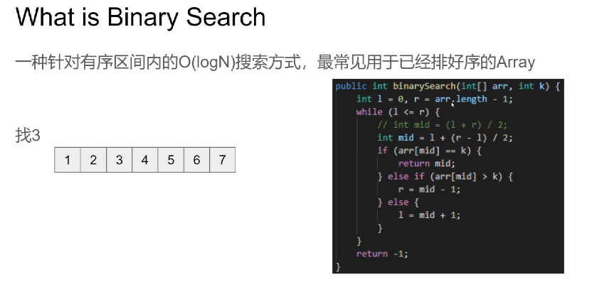


```
public int binarySearch(int[] arr, int k) {
    int l = 0, r = arr.length - 1;
    while (l <= r) {
        // int mid = (l + r) / 2; 会溢出，负数
        int mid = l + (r - l) / 2;
        if (arr[mid] == k) {
            return mid;
        } else if (arr[mid] > k) {
            r = mid - 1;
        } else {
            l = mid + 1;
        }
    }
    return -1;
}
```


### 变换场景

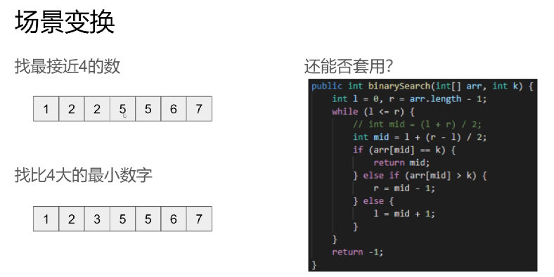


### Binary Search两大基本原则

1. 缩减索区域
   Shrink the search space every iteration(or recursion)
2. 每次缩减不能排除潜在答案
   Cannot exclude potential answers during each shrinking

### 三大模版

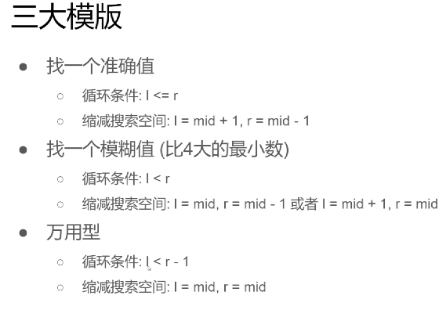

1. 找一个准确值
循环条件: l <= r
缩减搜索空间: l = mid + 1, r = mid - 1
1. 找一个模糊值(比4大的最小数)
循环条件: l < r
缩减搜索空间: l = mid, r = mid - 1 或者 l = mid + 1, r = mid
1. 万用型
循环条件: l < r-1
缩减搜索空间: l = mid, r = mid


###  2第一次出现的位置

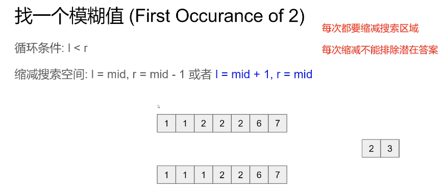


mid < 2; mid不可能是答案，l = mid + 1；

mid = 2；左边可能有答案，mid 也可能是潜在答案，所以 r = mid；

l < r;   最后一组，r在2的位置，r=mid 违背了每次都要缩减搜索区域；


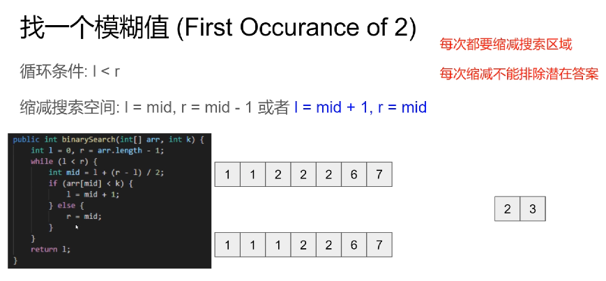

 ```
 public int binarySearch(int[] arr, int k) {
     int l = 0, r = arr.length - 1;
     while (l < r) {
         int mid = l + (r - l) / 2;
         if (arr[mid] < k) {
             r = mid + 1;
         } else {
             l = mid;
         }
     }
     return l;
 }
 ```


### 2最后出现的位置

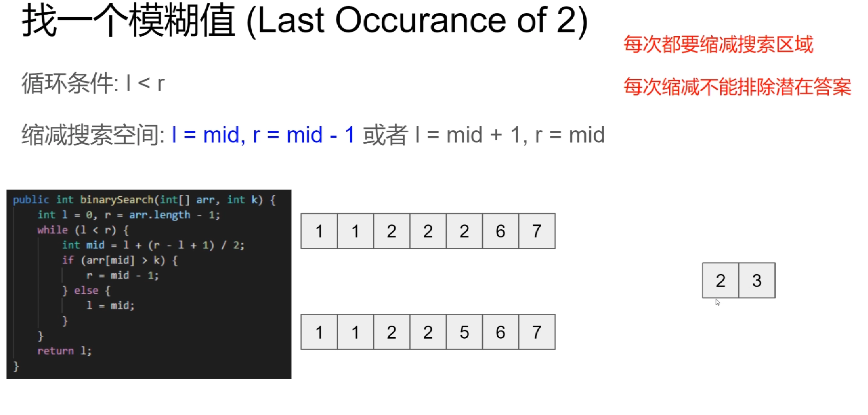

偶数情况下，需要mid停在右侧；如2、3；mid=2，l=mid 导致每次不能缩减搜索区域，死循环

```
public int binarySearch(int[] arr, int k) {
    int l = 0, r = arr.length - 1;
    while (l < r) {
        int mid = l + (r - l + 1) / 2;
        if (arr[mid] > k) {
            r = mid - 1;
        } else {
            l = mid;
        }
    }
    return l;
}
```


### 接近2

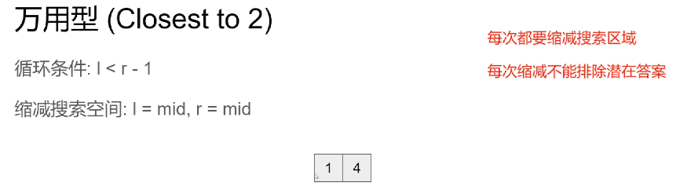

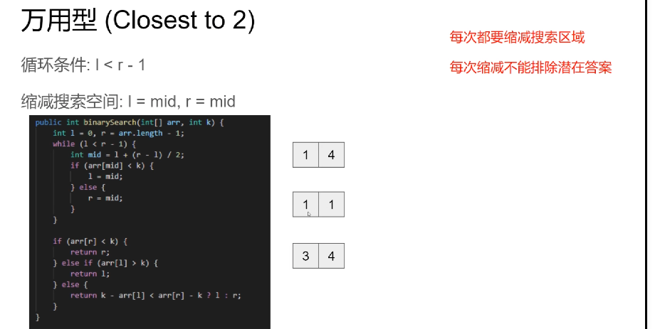

```
public int binarySearch(int[] arr, int k) {
    int l = 0, r = arr.length - 1;
    while (l < r) {
        int mid = l + (r - l) / 2;
        if (arr[mid] < k) {
            r = mid;
        } else {
            l = mid;
        }
    }

    if (arr[r] < k) {
        return r;
    } else if (arr[l] > k) {
        return l;
    } else {
        return k - arr[l] < arr[r] - k ? l : r;
    }
}
```


### 最长重复子串

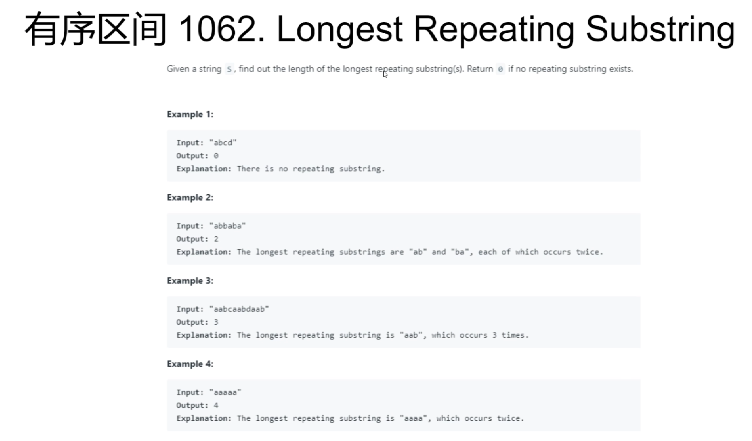

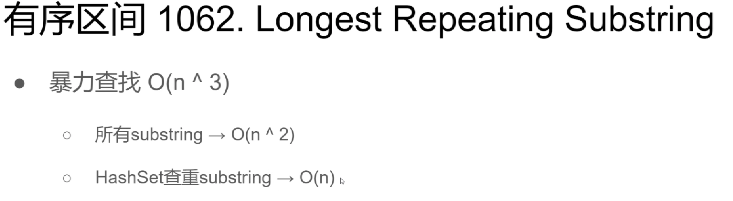

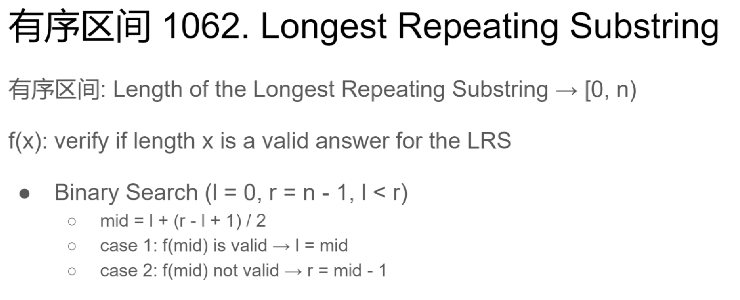

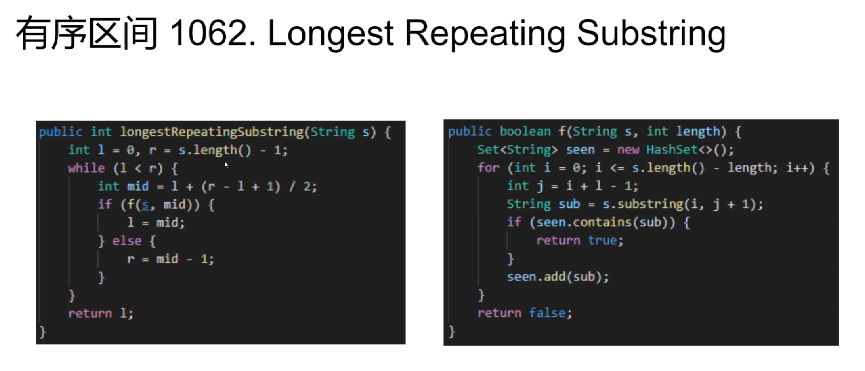

```
public int longestRepeatingSubString(String s) {
    int l = 0, r = s.length() - 1;
    while (l < r) {
        int mid = l + (r - l + 1) / 2;
        if (f(s, mid)) {
            l = mid;
        } else {
            r = mid - 1;
        }
    }

    return l;
}

public boolean f(String s, int length) {
    Set<String> seen = new HashSet<>();
    for (int i = 0; i <= s.length() - length; i++) {
        int j = i + length - 1;
        String sub = s.substring(i, j + 1);
        if (seen.contains(sub)) {
            return true;
        }
        seen.add(sub);
    }
    return false;
}
```


### 总结

- BinarySearch是一个在O(logN)时间在有序区间实现搜索的算法
- 两大原则
  - 每次都要缩减搜索区域
    Shrink the search space every iteration(or recursion)
  - 每次缩减不能排除潜在答案
    Cannot exclude potential answers during each shrinking
- 三种变种

### 更多类似题目

- Split Array Largest Sum(410)
- Divide Chocolate(1231)
- Peak Index in a Mountain Array(852)
- Capacity To Ship Packages Within D Days(1011)
- Maximum Side Length of a Square with Sum Less than or Equal to Threshold(1292)
