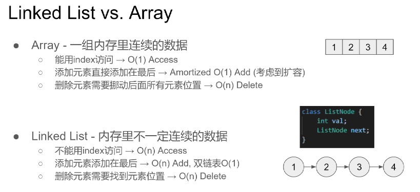
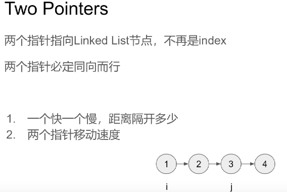
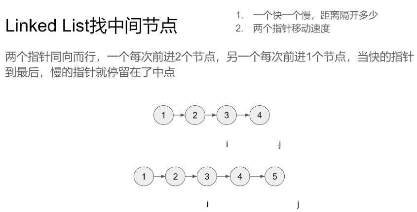
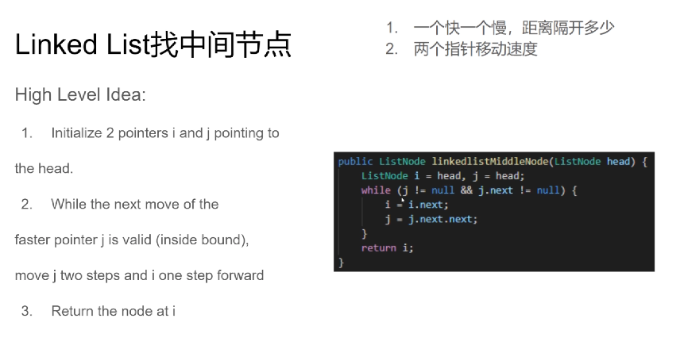
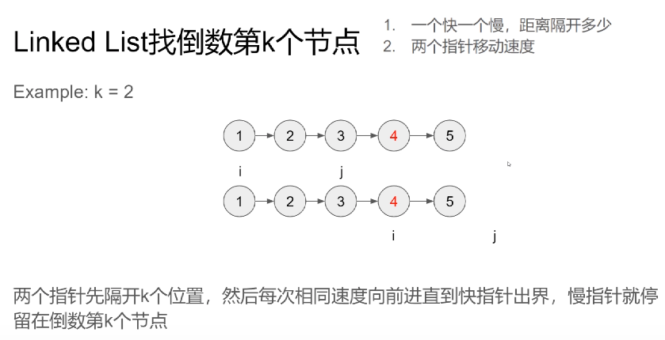
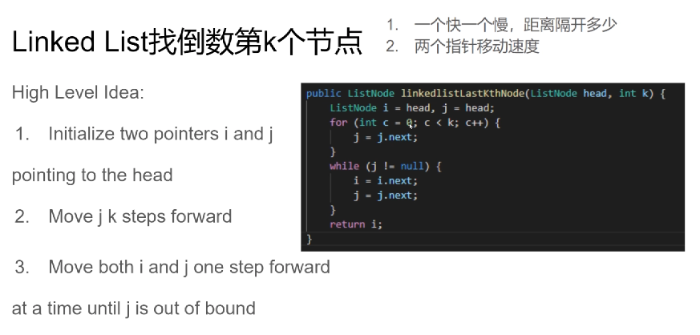
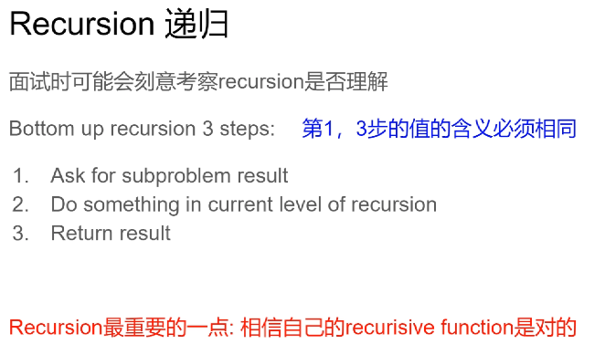
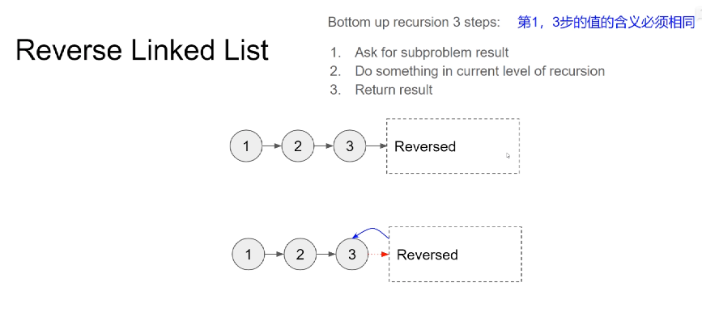
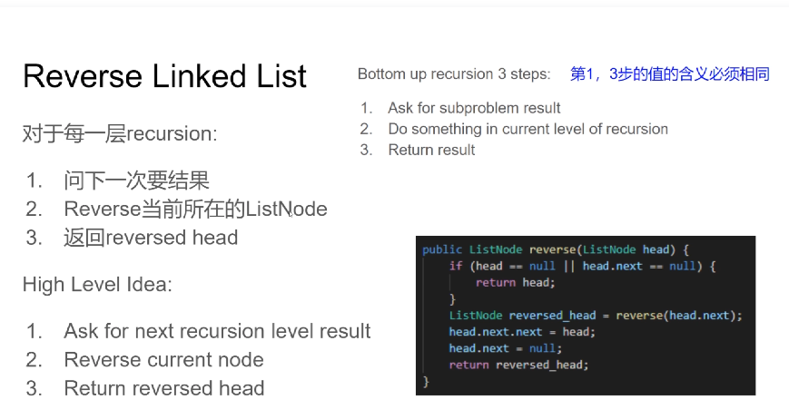

## Two Pointers


### Linked List vs. Array

- Array-一组内存里连续的数据 
  - 能用index访问 → O(1)Access
  - 添加元素直接添加在最后→AmortizedO(1)Add(考虑到扩容)
  - 删除元素需要挪动后面所有元素位置→O(n)Delete

- LinkedList-内存里不一定连续的数据 
  - 不能用index访问→O(n)Access 
  - 添加元素添加在最后→O(n)Add，双链表O(1) 
  - 删除元素需要找到元素位置→O(n)Delete



### Two Pointers
两个指针指向LinkedList节点，不再是index
两个指针必定同向而行

1. 一个快一个慢，距离隔开多少
2. 两个指针移动速度



### Linked List找中间节点 

1. 一个快一个慢，距离隔开多少 

2. 两个指针移动速度 
3. 两个指针同向而行，一个每次前进2个节点，另一个每次前进1个节点，当快的指针到最后，慢的指针就停留在了中点



### Linked List找中间节点 



**High Level ldea:**

1. Initialize 2 pointers i and j pointing tothe head. 
2. While the next move of the faster pointer j is valid (inside bound),
   move j two steps and i one step forward
3. Return the node at i.

```
public class ListNode {
    int val;
    ListNode next;
}

public ListNode linkedlistMiddleNode(ListNode head) {
    ListNode i = head, j = head;
    while (j != null && j.next != null) {
        i = i.next;
        j = j.next.next;
    }
    return i;
}
```


### Linked List找倒数第k个节点




**两个指针先隔开k个位置，然后每次相同速度向前进直到快指针出界，慢指针就停留在倒数第k个节点**


### Linked List找倒数第k个节点




High Level Idea:  

1. Initialize two pointers i and j pointing to the head;
2. Move j k steps forward
3. Move both i and jone step forward, at a time until j is out of bound

```
public class ListNode {
    int val;
    ListNode next;
}

public ListNode linkedlistLastKthNode(ListNode head, int k) {
    ListNode i = head, j = head;
    for (int c = 0; c < k; c++) {
        j = j.next;
    }
    while (j != null) {
        i = i.next;
        j = j.next;
    }
    return i;
}
```

### Two Pointers总结
两个指针指向LinkedList节点，不再是index
两个指针必定同向而行

1. 一个快一个慢，距离隔开多少
2. 两个指针移动速度


## Recursion递归


面试时可能会刻意考察recursion是否理解 
Bottom up recursion 3 steps:    **第1，3步的值的含义必须相同**

1. Ask for subproblem result
2. Do something in current level of recursion

3. Return result

**Recursion最重要的一点:相信自己的recurisive function是对的**

从后往前Bottom up；


### Reverse Linked List 链表反转





**对于每一层recursion:** 

1. 问下一次要结果

2. Reverse当前所在的ListNode

3. 返回reversed head

**High Level ldea:** 

1. Askfor next recursion level result
2. Reverse current node 
3. Return reversed head

```
public ListNode reverse(ListNode head) {
    if (head == null || head.next == null) {
        return head;
    }
    ListNode reversed_head = reverse(head.next);
    head.next.next = head;
    head.next = null;
    return reversed_head;
}
```


### Recursion总结
Bottom up recursion 3steps:         **第1，3步的值的含义必须相同**

1. Askfor subproblem result
2. Do something in current level of recursion
3. Return result

Recursion最重要的一点: 相信自己的recurisive function是对的

### 更多例题
Delete Node In a Linked List(237)
Linked List Cycle(141)
Reverse Linked ListII(92)
Reverse Nodes In k-Group(25)
