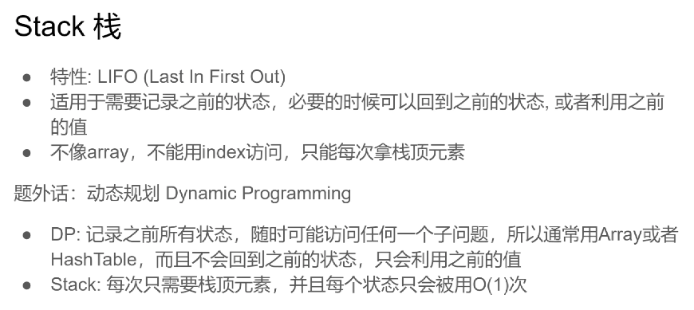
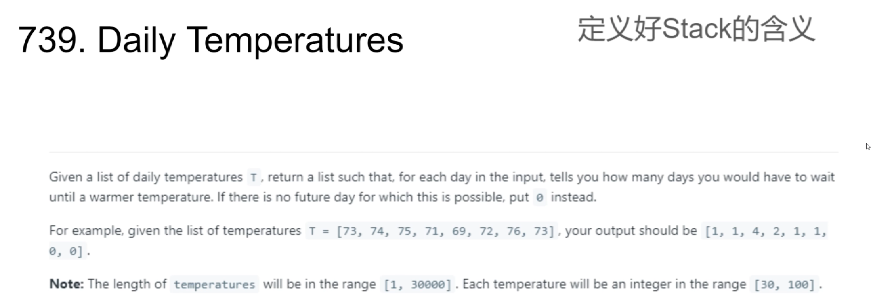
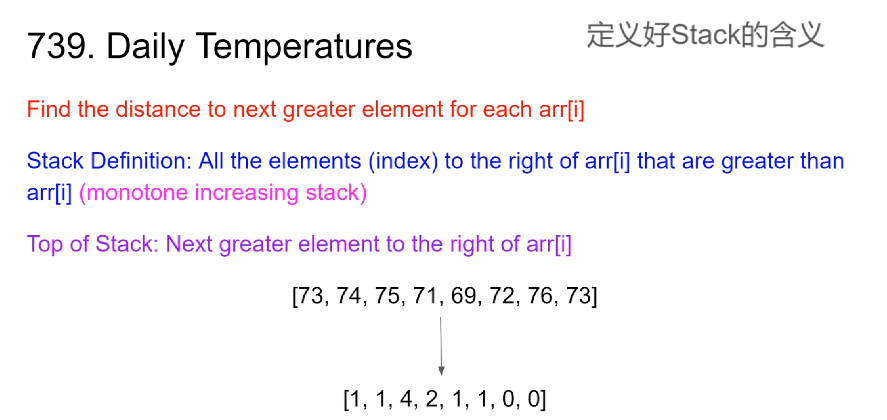
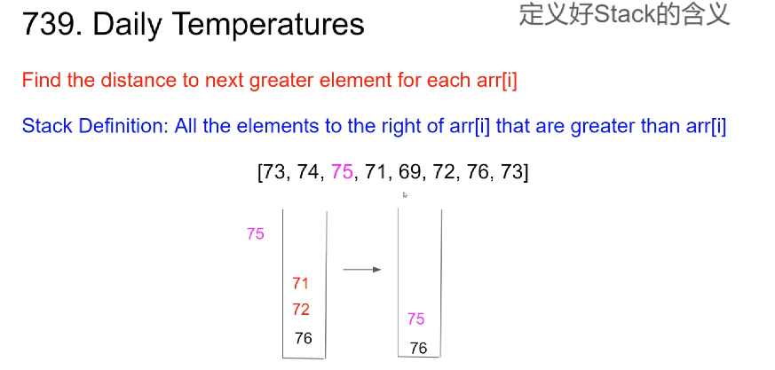
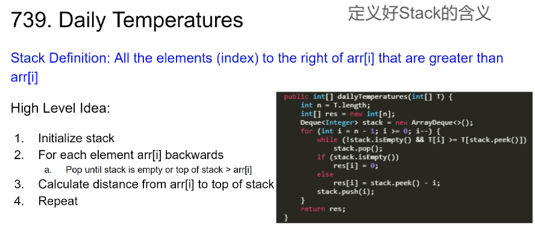
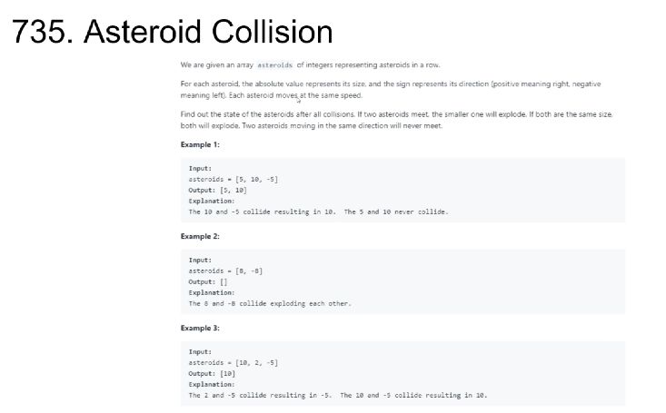
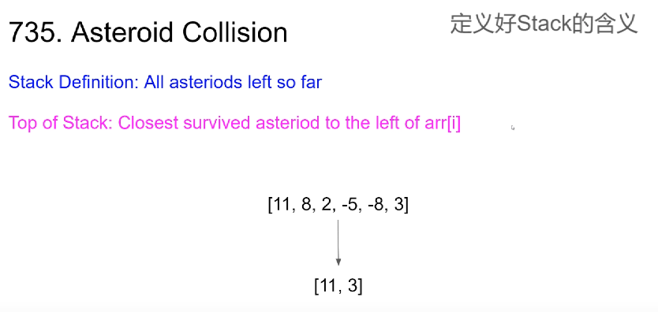
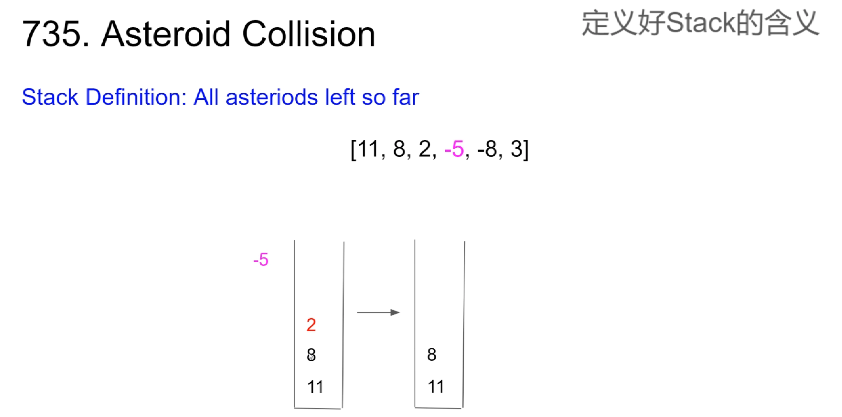
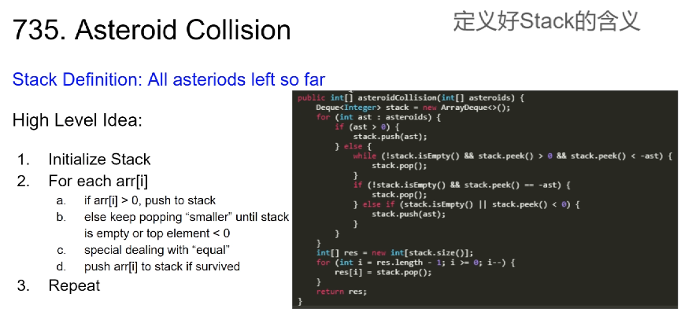

### Stack 栈



- 特性:LIFO(Last In First Out)

- 适用于需要记录之前的状态，必要的时候可以回到之前的状态，或者利用之前的值

- 不像array，不能用index访问，只能每次拿栈顶元素

**题外话:动态规划Dynamic Programming**

- DP:记录之前所有状态，随时可能访问任何一个子问题，所以通常用Array或者 HashTable，而且不会回到之前的状态，只会利用之前的值 
- Stack:每次只需要栈顶元素，并且每个状态只会被用O(1)次

### Stack Principle
定义好Stack的含义

- 在arr[]左侧所有比arr[]大的数
- 递归之前的函数状态(Call Stack)


### 示例递增栈





**739.Daily Temperatures**     定义好Stack的含义 
Find the distance to next greater element for each arr[i]

Stack Definition: All the elements to the right of arr[i] that are greater than arr[i] 

(monoton increasing stack)

Top of Stack: Next greater element to the right of arr[i];





Stack Definition: All the elements (index) to the right of arr[i] that are greater than arr[i]

High Level ldea: 

1. Initialize stack
2. For each element arr[i] backwards 
  a. Pop until stack is empty or top of stack > arr[i] 
3. Calculate distance from arr[i] to top of stack
4. Repeat 

```
public int[] dailyTemperatures(int[] T) {
    int n = T.length;
    int[] res = new int[n];
    Deque<Integer> stack = new ArrayDeque<>();
    for (int i = n - 1; i >= 0; i--) {
        while (!stack.isEmpty() && T[i] >= T[stack.peek()]) {
            stack.pop();
        }
        if (stack.isEmpty()) {
            res[i] = 0;
        } else {
            res[i] = stack.peek() - i;
        }

        stack.push(i);
    }

    return res;
}
```


### Asteriod Collision 小行星撞击





Stack Definition: All asteriods left so far (目前活下来的小行星)
Top of Stack: Closest survived asteriod to the left of arr[i]





Stack Definition: All asteriods left so far


High Level Idea:

1. Initialize Stack 
2. For each arr[i] 
   a.  if arr[i]>0,push to stack 
   b.  else keep popping “smaller" until stack is empty or top element<0
   c. special dealing with "equal"
   d. push arri] to stack if survived
3. Repeat

```
public int[] asteroidCollision(int[] asteroid) {
    Deque<Integer> statck = new ArrayDeque<>();
    for (int ast : asteroid) {
        if (ast > 0) {
            statck.push(ast);
        } else {
            // ast 负数，-ast绝对值
            while (!statck.isEmpty() && statck.peek() > 0 && statck.peek() < -ast) {
                statck.pop();
            }
            if (!statck.isEmpty() && statck.peek() == -ast) {
                // 8 -8 正负相等
                statck.pop();
            } else if (statck.isEmpty() || statck.peek() < 0) {
                statck.push(ast);
            }
        }
    }

    int[] res = new int[statck.size()];
    for (int i = res.length - 1; i >= 0; i--) {
        res[i] = statck.pop();
    }
    return res;
}

```


### 更多类似题目
Valid Parentheses(20)
Next Greater Element(496)
Next Greater ElementII(503)
Decode String(394)
Exclusive Time of Functions(636)
Largest Rectangle in Histogram(84)


