### Heap 堆

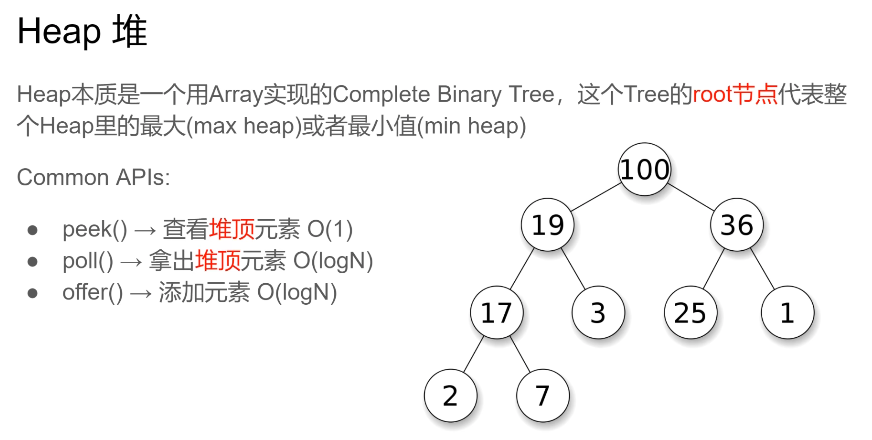

Heap本质是一个用Array实现的Complete Binary Tree，这个Tree的**root节点**代表整个Heap里的最大(maxheap)或者最小值(min heap)

Common APls: 

- peek()→查看**堆顶**元素O(1)
- poll()→拿出**堆顶**元素O(logN)
- offer()→添加元素O(logN) 


### Online vs Offline Algorithm

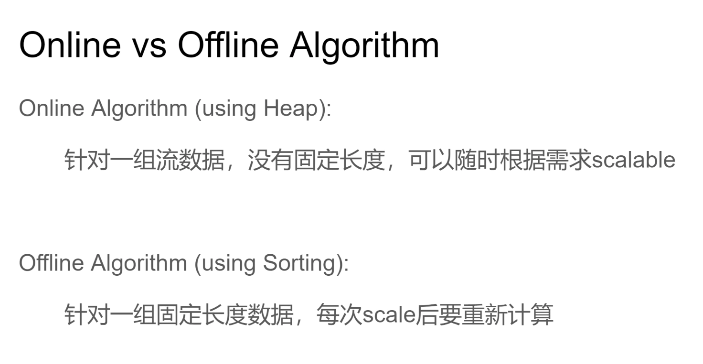


Online Algorithm(using Heap):
针对一组流数据，没有固定长度，可以随时根据需求scalable

Offline Algorithm(using Sorting):
针对一组固定长度数据，每次scale后要重新计算

### 215.Kth Largest Element in an Array  (Top K 问题)

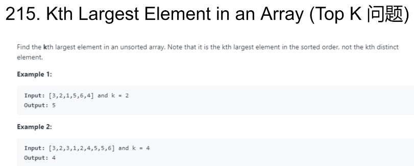


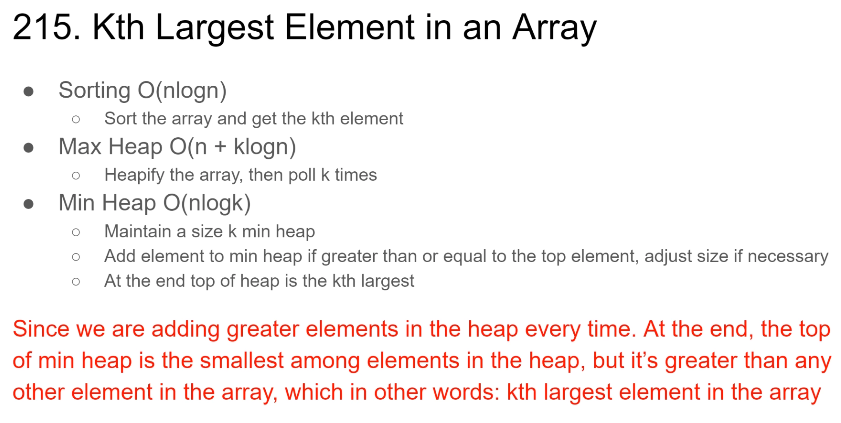

- Sorting O(nlogn)

  - Sort the array and get the kth element 

- Max Heap O(n+klogn)

  - Heapify the array, then poll k times

- Min Heap O(nlogk)
  - Maintain a size k min heap
  - Add element to min heap if greater than or equal to the top elementadjust size if necessary 
  - At the end top of heap is the kth largest

**Since we are adding greater elements in the heap every time. At the end, the top of min heap is the smallest among elements in the heap, but it’s greater than any other element in the array, which in other words: kth largest element in the array**

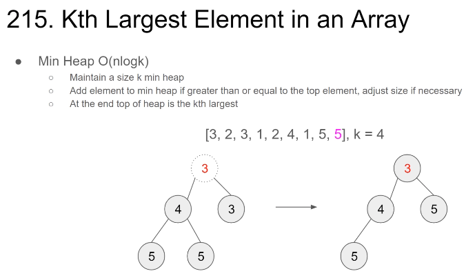


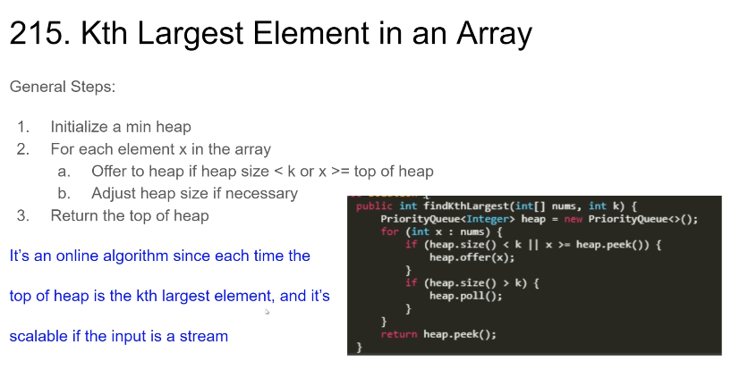

General Steps:

1. Initialize a min heap (最小堆)

2. For each element x in the array
   a. Offer to heap if heap **size < k or x >= top** of heap 

   b. Adjust heap size if necessary

1. Return the top of heap 

**It's an online algorithm since each time the top of heap is the kth largest element, and it's scalable if the input is a stream**

```
public int findKthLargest(int[] nums, int k) {
    PriorityQueue<Integer> heap = new PriorityQueue<>();
    for (int x : nums) {
        if (heap.size() < k || x >= heap.peek()) {
            heap.offer(x);
        }
        if (heap.size() > k) {
            heap.poll();
        }
    }

    return heap.peek();
}
```


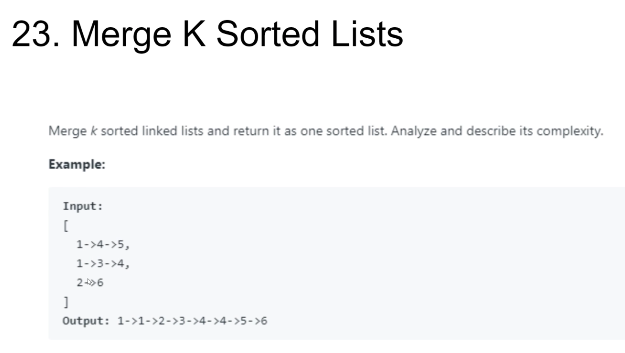

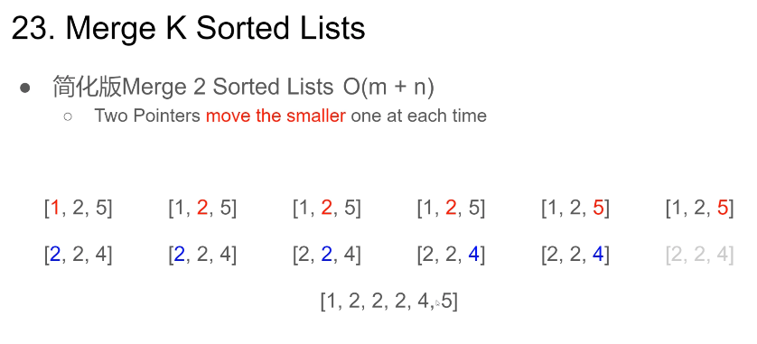

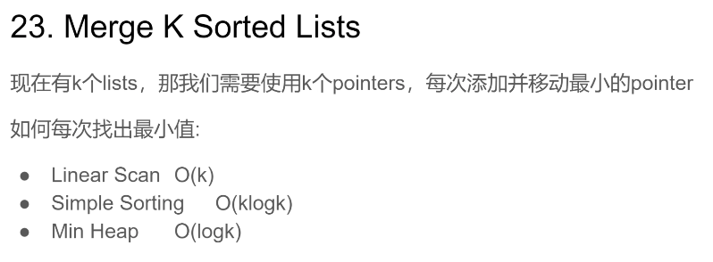

现在有k个lists，那我们需要使用k个pointers，每次添加并移动最小的pointer
如何每次找出最小值:

- Linear Scan O(k)
- Simple Sorting O(klogk)
- Min Heap O(logk)

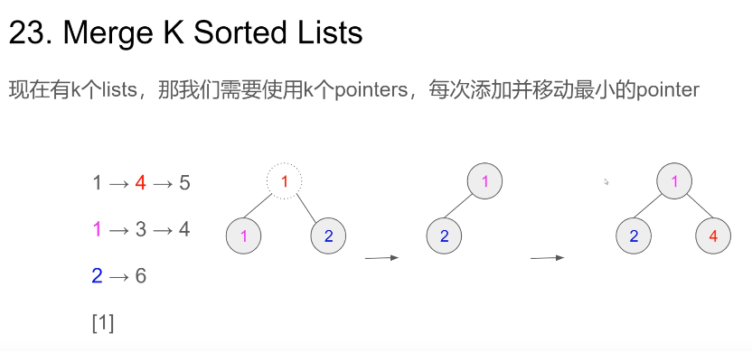

现在有k个lists，那我们需要使用k个pointers，每次添加并移动最小的pointer

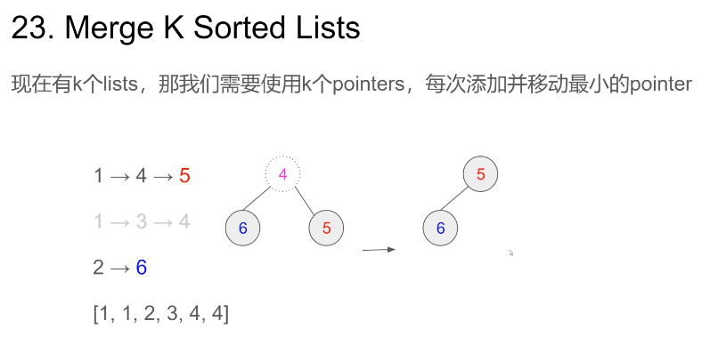

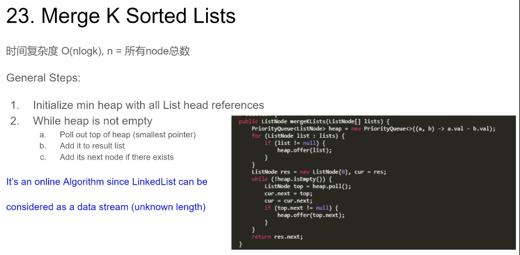

时间复杂度O(nlogk)，n=所有node总数
General Steps:
1. Initialize min heap with all List head references

1. While heap is not empty ListNode 
a.  Poll out top of heap (smallest pointer) 
b. Add it to result list
c.  Add its next node if there exists 

It's an online Algorithm since LinkedList can be 
considered as a data stream(unknown length) 

```
public ListNode mergeKLists(ListNode[] lists) {
    PriorityQueue<ListNode> heap = new PriorityQueue<>((a, b) -> a.val - b.val);
    for (ListNode list : lists) {
        if (list != null) {
            heap.offer(list);
        }
    }

    // list dummyHead
    ListNode res = new ListNode(0), cur = res;
    while (!heap.isEmpty()) {
    		// top 最小的加入res中，top.next有数据加入堆中；
        ListNode top = heap.poll();
        cur.next = top;
        if (top.next != null) {
            heap.offer(top.next);
        }
    }
    return res.next;
}
```


### 更多类似题目

Top K Frequent Elements(347)
Meeting RoomsI(253)
Find Median From Data Stream(295)
Reorganize String(767)
Kth Largest Element in a Stream(703)


