### HashMap 哈希表

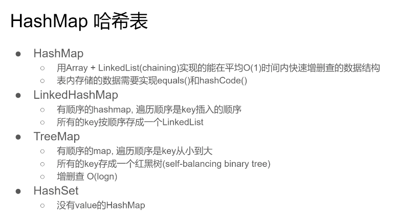

- HashMap

  - 用Array+LinkedList(chaining)实现的能在平均O(1)时间内快速增删查的数据结构 

  - 表内存储的数据需要实现equals()和hashCode() 
- LinkedHashMap
- 有顺序的hashmap，遍历顺序是key插入的顺序
- 所有的key按顺序存成一个LinkedList 
- TreeMap
  - 有顺序的map，遍历顺序是key从小到大
  - 所有的key存成一个红黑树(self-balancing binary tree)
  - 增删查O(logn)

- HashSet
  - 没有value的HashMap

### When to use HashMap

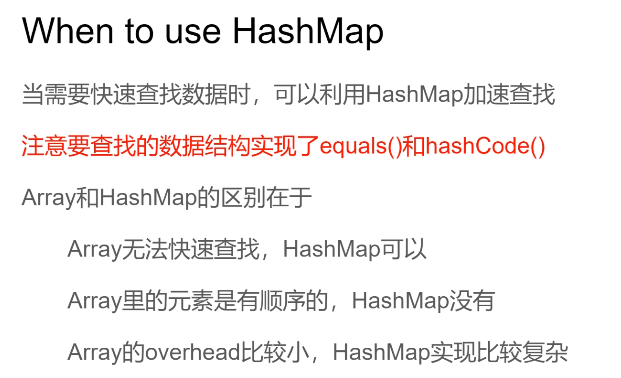

当需要快速查找数据时，可以利用HashMap加速查找
**注意要查找的数据结构实现了equals()和hashCode()**

- Array和HashMap的区别在于
  - Array无法快速查找，HashMap可以
  - Array里的元素是有顺序的，HashMap没有
  - Array的overhead比较小，HashMap实现比较复杂

### Two Sum

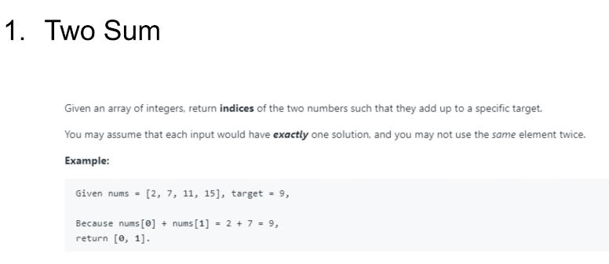

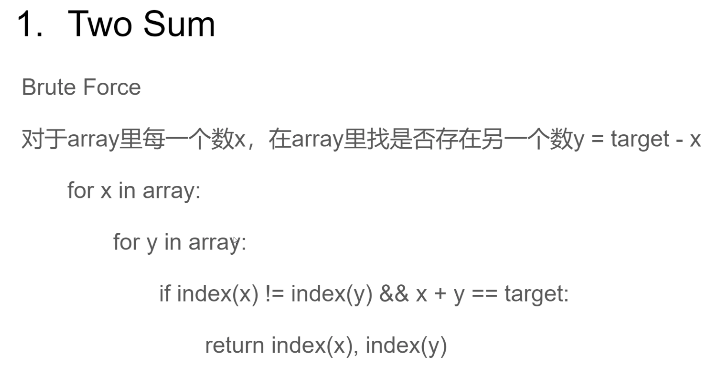


Brute Force
对于array里每一个数x，在array里找是否存在另一个数y=target-x
for x in array:
		for y in array:
				if index(x)!=index(y)&&x+y==target:
						return index(x),index(y)

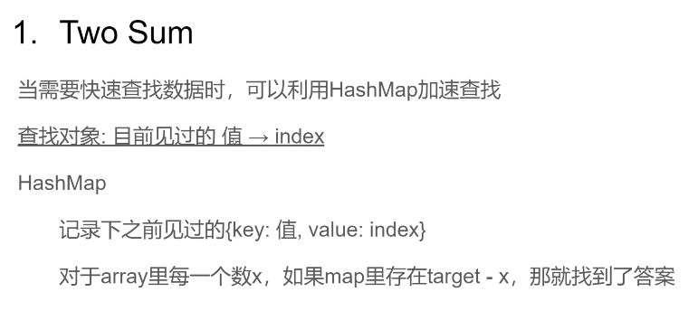
当需要快速查找数据时，可以利用HashMap加速查找
**查找对象：目前见过的值→index**

- HashMap
  - 记录下之前见过的 {key:值value:index}
  - 对于array里每一个数x，如果map里存在target-x，那就找到了答案

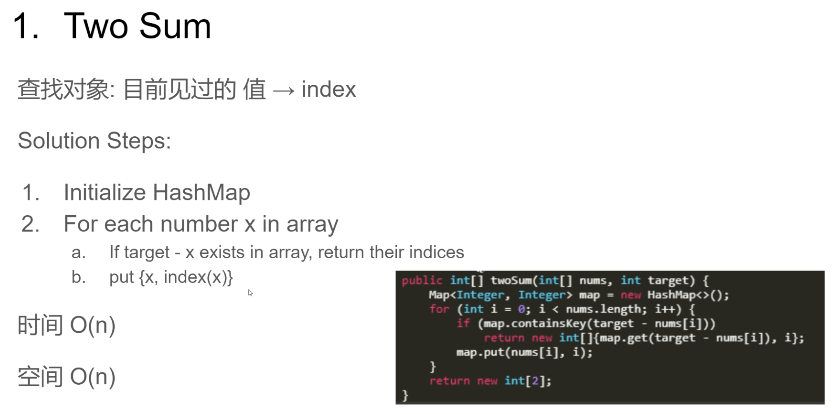
查找对象: 目前见过的值→index
Solution Steps:

1. Initialize HashMap
2. For each number x in array
    a.  If target -x exists in arrayreturn their indices
    b.  put{x,index(x)} 
    时间O(n) 
    空间O(n)

```
public int[] twoSum(int[] nums, int target) {
    Map<Integer, Integer> map = new HashMap<>();
    for (int i = 0; i < nums.length; i++) {
        if (map.containsKey(target - nums[i])) {
            return new int[]{map.get(target - nums[i]), i};
        }
        map.put(nums[i], i);
    }

    return new int[2];
}
```


### Two Sum 返回值而不是索引index

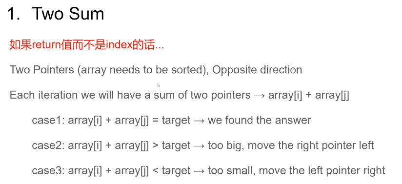

**如果return值而不是index的话...**
Two Pointers(array needs to be sorted),Opposite direction

Each iteration we will have a sum of two pointers → array[i] + array[j]

- case1:array[i] + array[j] = target→we found the answer
- case2: array[i] + array[j] > target→too big, move the right pointer left
- case3: array[i] + array[j] < target→too small,  move the left pointer right

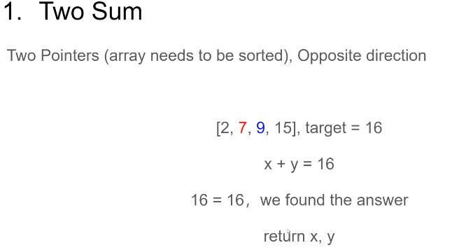

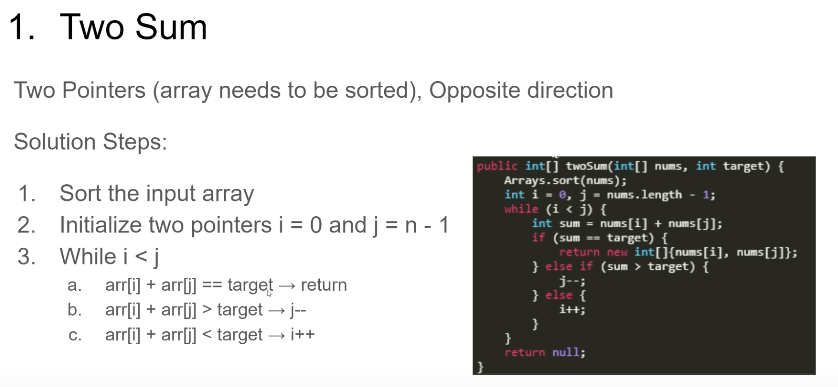


Two Pointers (array needs to be sorted),Opposite direction

Solution Steps:

1. Sort the input array 
2. Initialize two pointers i=0 and j=n-1 
3. Whilei<j } 
    a.  arr[i]+arr[i]==target→return
    b.  arr[i]+arr[]>target → j-- 
    c.  arri]+arri]<target→i++

```

// 双指针，获取两数之和的值，不是索引   
public int[] twoSum(int[] nums, int target) {
    Arrays.sort(nums);
    int i = 0, j = nums.length - 1;
    while (i < j) {
        int sum = nums[i] + nums[j];
        if (sum == target) {
            return new int[]{nums[i], nums[j]};
        } else if (sum > target) {
            j--;
        } else {
            i++;
        }
    }
    return null;
}
```

### Subarray Sum Equals K （子数组和为K）

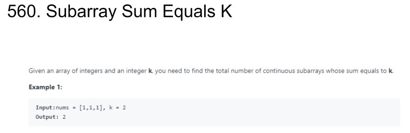

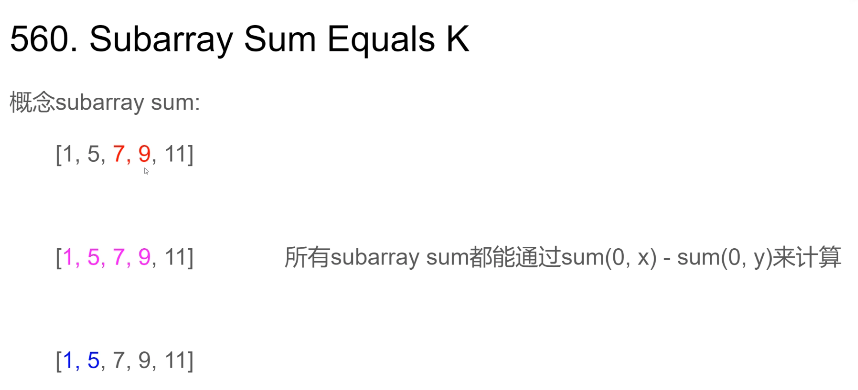

所有subarraysum都能通过sum(x)-sum(y)来计算：

例如：sum[1,5,7,9] - sum[1,5]

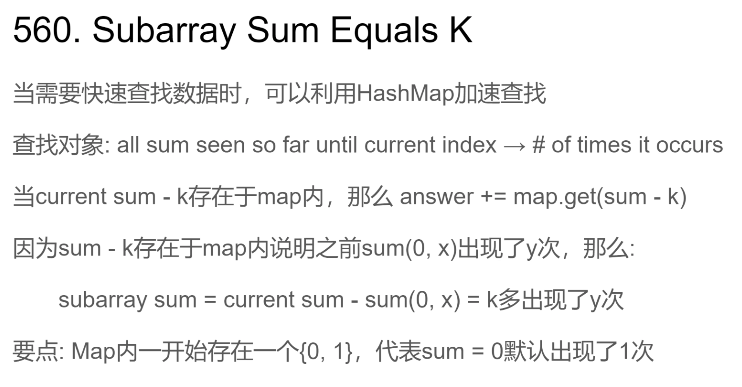

当需要快速查找数据时，可以利用HashMap加速查找
查找对象: all sum seen so far until current index → #of times it occurs
当current sum - k 存在于map内，那么 answer += map.get(sum - k)
因为sum - k存在于map内说明之前sum(0，x)出现了y次，那么:
subarray sum = current sum - sum(0, x) = k多出现了y次
要点:Map内一开始存在一个{1}，代表sum=0默认出现了1次

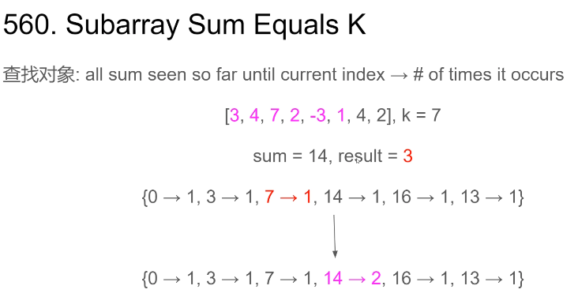

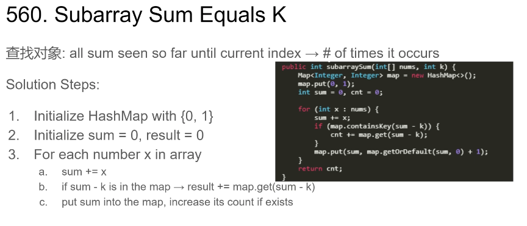

查找对象: all sum seen so far until current index → #of times it occurs

Solution Steps:

1. Initialize HashMap with {0，1} 
2. Initialize sum = 0, result = 0
3. For each number x in array 
    a. sum += x 
    b. if (sum - k) is in the map → result += map.get(sum - k)
    c. put sum into the map, increase its count if exists

```
public int subarraySum(int[] nums, int k) {
    // k - 子数组对应的和，v - 索引index
    Map<Integer, Integer> map = new HashMap<>();
    map.put(0, 1);
    int sum = 0, cnt = 0;
    for (int x : nums) {
        if (map.containsKey(sum - k)) {
            cnt += map.get(sum - k);
        }
        map.put(sum, map.getOrDefault(sum, 0) + 1);
    }
    return cnt;
}
```


### 更多类似题目
Longest Substring Without Repeating Characters(3)
Group Anagrams(49)
Copy List with Random Pointer(138)
Longest Substring with At Most KDistinct Characters(340)
Brick Wall (554)
Encode and Decode TinyURL(535)
