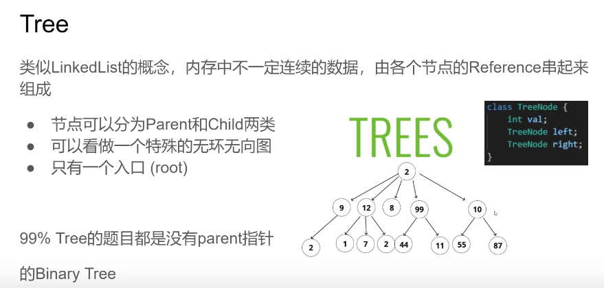
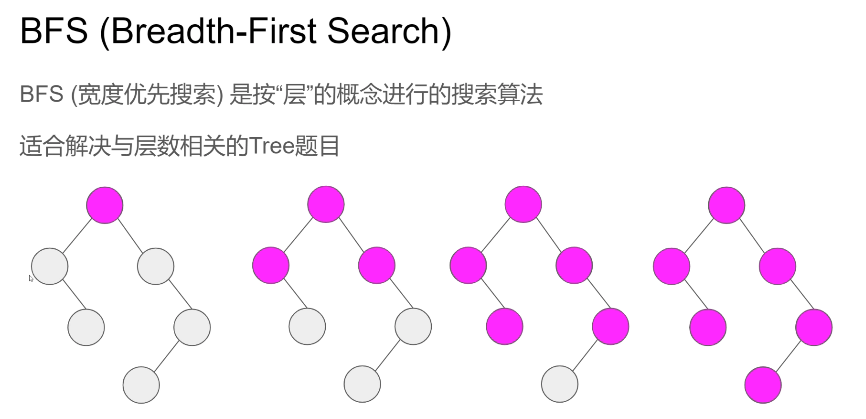
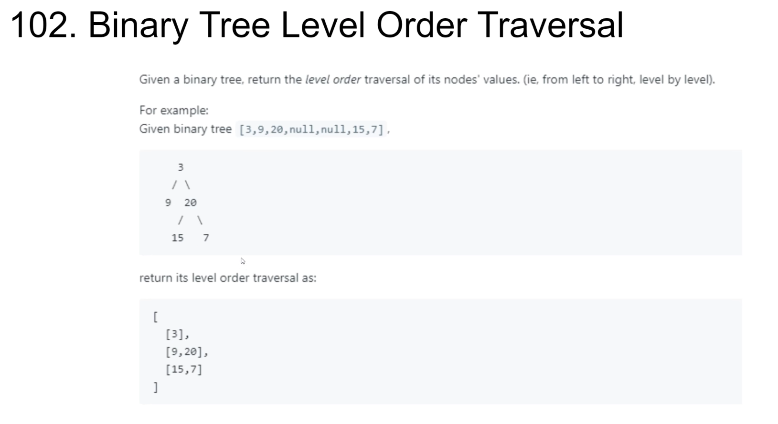
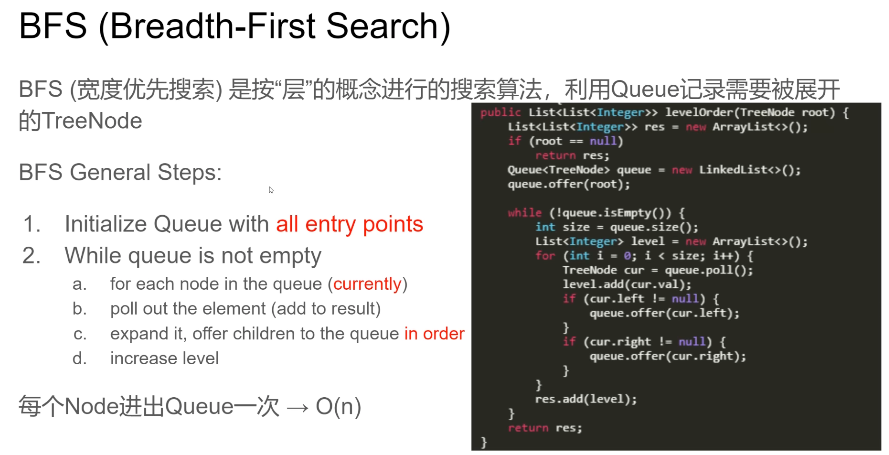
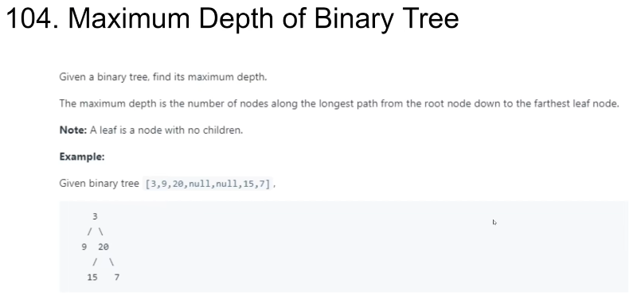
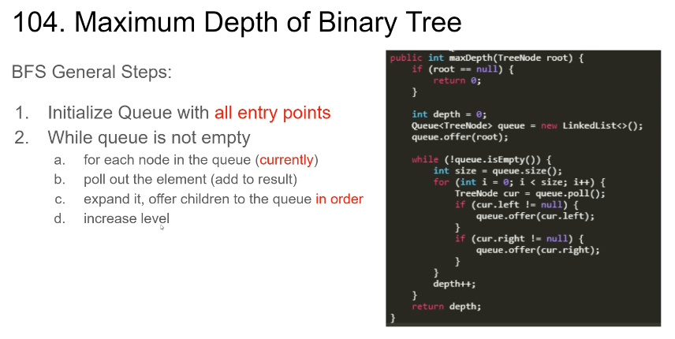
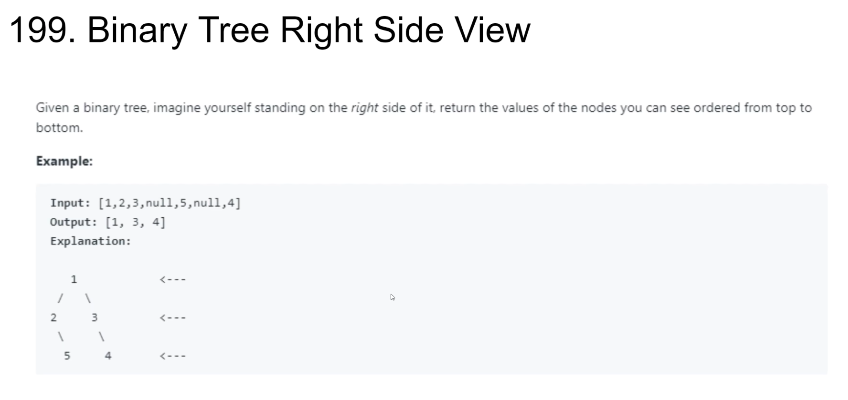
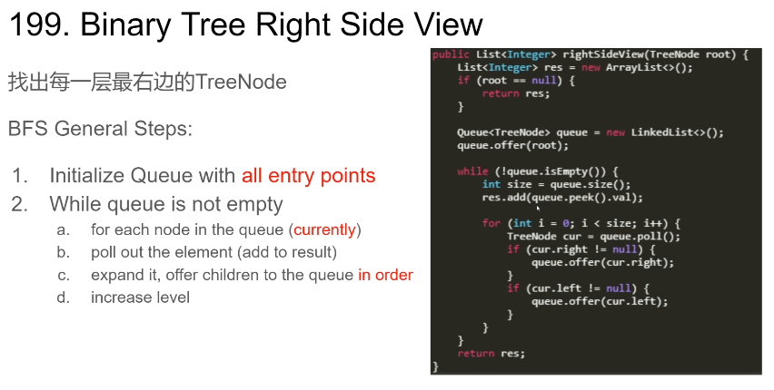

### Tree



类似LinkedList的概念，内存中不一定连续的数据，由各个节点的Reference串起来组成

- 节点可以分为Parent和Child两类
- 可以看做一个特殊的无环无向图
- 只有一个入口(root)

99% Tree的题目都是没有parent指针的 Binary Tree


### BFS(Breadth-First Search)



BFS(Breadth-First Search)
BFS(宽度优先搜索)是按“层”的概念进行的搜索算法
适合解决与层数相关的Tree题目

### 102. Binary Tree Level Order Traversal





BFS(宽度优先搜索)是按“层”的概念进行的搜索算法，利用Queue记录需要被展开的TreeNode 

BFS General Steps: 

1. Initialize Queue with all entry points 
2. While queue is not empty 
a. for each node in the queue(currently)
b. poll out the element (add to result)
c. expand it, offer children to the queue in order 
d. increase level 

每个Node进出Queue一次 → O(n) 

```
public class TreeNode {
    int val;
    TreeNode left;
    TreeNode right;
}

public List<List<Integer>> levelOrder(TreeNode root) {
    List<List<Integer>> res = new ArrayList<>();
    if (root == null)
        return res;
    Queue<TreeNode> queue = new LinkedList<>();
    queue.offer(root);
    while (!queue.isEmpty()) {
        // 当前层
        int size = queue.size();
        List<Integer> level = new ArrayList<>();
        for (int i = 0; i < size; i++) {
            TreeNode cur = queue.poll();
            level.add(cur.val);
            if (cur.left != null) {
                queue.offer(cur.left);
            }
            if (cur.right != null) {
                queue.offer(cur.right);
            }
        }
        res.add(level);
    }
    return res;
}
```


### 04.Maximum Depth of Binary Tree




BFS General Steps: 

1. Initialize Queue with all entry points 
2. While queue is not empty
   a.  for each node in the queue(currently) 
   b.  poll out the element (add to result) 
   c. expand it,offer children to the queue in order
   d. increase level 

```
public class TreeNode {
    int val;
    TreeNode left;
    TreeNode right;
}

public int maxDepth(TreeNode root) {
    if (root == null) {
        return 0;
    }
    int depth = 0;
    Queue<TreeNode> queue = new LinkedList<>();
    queue.offer(root);

    while (!queue.isEmpty()) {
        // 当前层大小
        int size = queue.size();
        for (int i = 0; i < size; i++) {
            TreeNode cur = queue.poll();
            if (cur.left != null) {
                queue.offer(cur.left);
            }
            if (cur.right != null) {
                queue.offer(cur.right);
            }
        }
        depth++;
    }
    return depth;
}

```

### 199.Binary Tree Right Side View





找出每一层最右边的TreeNode 
BFS General Steps: 

1. Initialize Queue with all entry points 
2. While queue is not empty
  a.  for each node in the queue(currently)
  b.  poll out the element (add to result) 
  c.  expand it, offer children to the queue in order 
  d.  increase level 

```
public List<Integer> rightSideView(TreeNode root) {
    List<Integer> res = new ArrayList<>();
    if (root == null) {
        return res;
    }
    Queue<TreeNode> queue = new LinkedList<>();
    queue.offer(root);
    while (!queue.isEmpty()) {
        int size = queue.size();
        res.add(queue.peek().val);

        for (int i = 0; i < size; i++) {
            TreeNode cur = queue.poll();
            // 为了方便，先入队右子树
            if (cur.right != null) {
                queue.offer(cur.right);
            }
            if (cur.left != null) {
                queue.offer(cur.left);
            }
        }
    }
    return res;
}
```


### 更多相关题目
Symmetric Tree(101)
Binary Tree Zigzag Level Order Traversal(103)
Minimum Depth of Binary Tree(111)
Find Largest Value in Each Tree Row(515)
N-ary Tree Level Order Traversal(429)
