### Tree

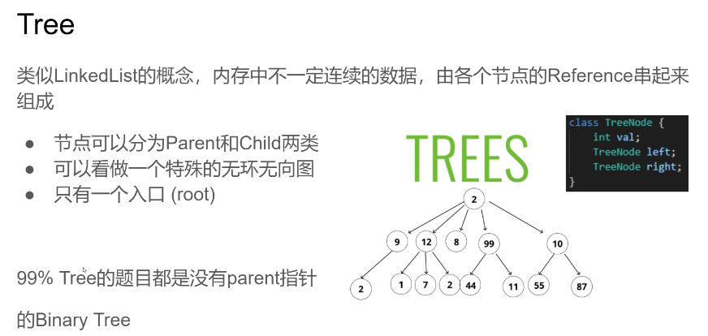

### DFS(Depth-First Search)

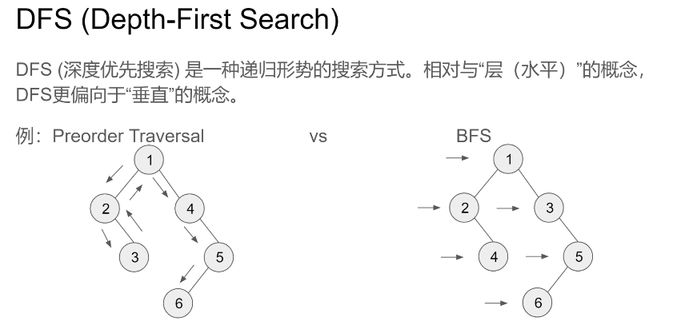

DFS(Depth-First Search)
DFS(深度优先搜索)是一种递归形势的搜索方式。相对与“层(水平)”的概念， DFS更偏向于“垂直”的概念。
例:Preorder Traversal VS BFS 

### DFS模版

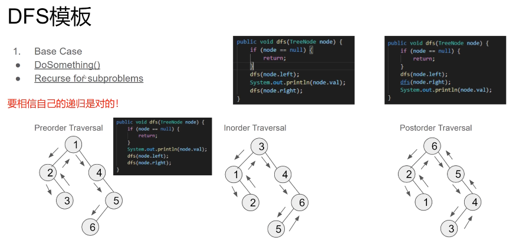

DFS模板

1. Base Case
   - DoSomething() 
   - Recurse for subproblems 

要相信自己的递归是对的!

```
// 前序遍历 Preorder Traversal
public void dfs(TreeNode node) {
    if (node == null) {
        return;
    }
    System.out.println(node.val);
    dfs(node.left);
    dfs(node.right);
}

// 中序遍历 Inorder Traversal
public void dfs(TreeNode node) {
    if (node == null) {
        return;
    }
    dfs(node.left);
    System.out.println(node.val);
    dfs(node.right);
}

// 后序遍历 Postorder Traversal
public void dfs(TreeNode node) {
    if (node == null) {
        return;
    }
    dfs(node.left);
    dfs(node.right);
    System.out.println(node.val);
}
```


### Top Down vs.Bottom Up

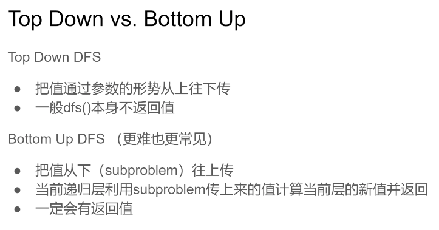
Top Down DFS

- 把值通过参数的形势从上往下传
- 一般dfs()本身不返回值

Bottom Up DFS(更难也更常见)
- 把值从下(subproblem)往上传
- 当前递归层利用subproblem传上来的值计算当前层的新值并返回
- 一定会有返回值

### Bottom Up DFS

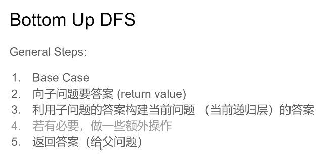

General Steps:

1. Base Case 
2. 向子问题要答案(return value) 
3. 利用子问题的答案构建当前问题 (当前递归层) 的答案
4. 若有必要，做一些额外操作
5. 返回答案(给父问题)

**递归问题，找中间状态，构建思维**


### 104.Maximum Depth of BinaryTree

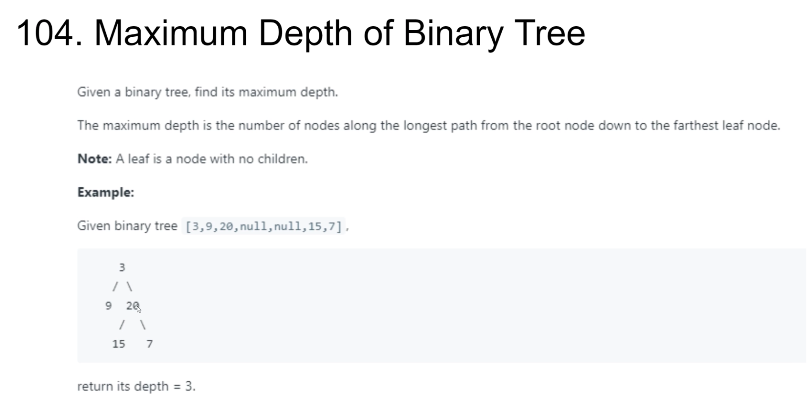

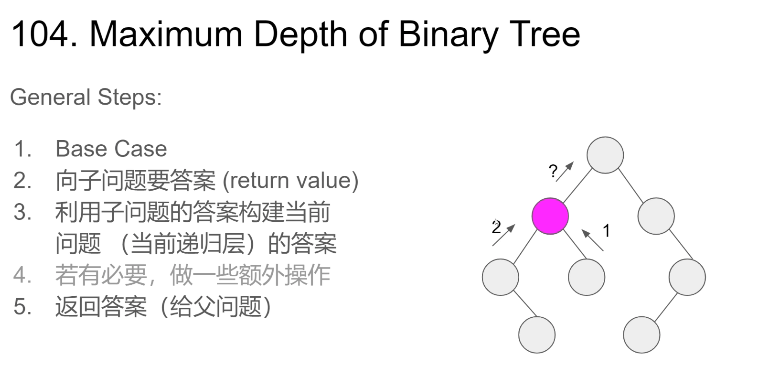

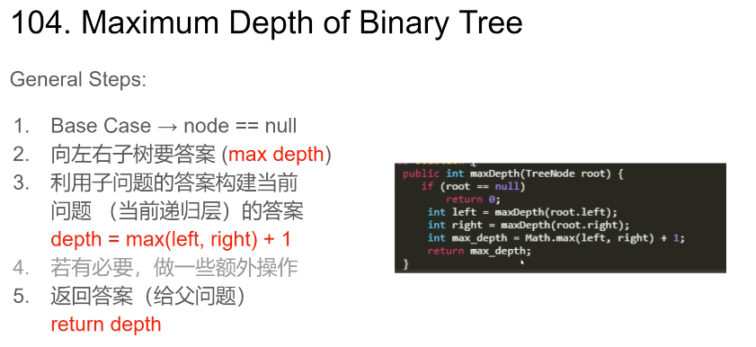
General Steps:

1. Base Case

2. 向左右子树要答案(max depth) 

3. 利用子问题的答案构建当前问题 (当前递归层) 的答案 

  Max(left_ans, right_ans) + 1 

4. 若有必要，做一些额外操作 

5. 返回答案(给父问题)

```
public int maxDepth(TreeNode root) {
    if (root == null) {
        return 0;
    }
    int left = maxDepth(root.left);
    int right = maxDepth(root.right);
    int max_depth = Math.max(left, right) + 1;
    return max_depth;
}
```


###124.Binary Tree Maximum Path Sum

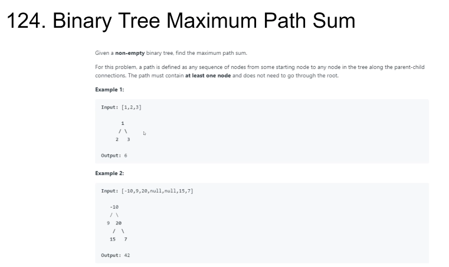

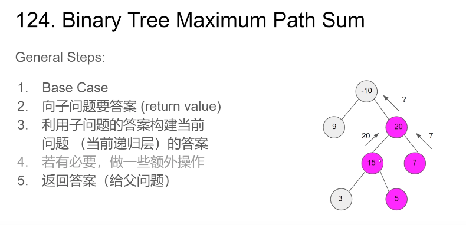
General Steps:

1. Base Case -10 
2. 向子问题要答案(return value) 
3. 利用子问题的答案构建当前问题 (当前递归层) 的答案
4. 若有必要，做一些额外操作 
5. 返回答案(给父问题)

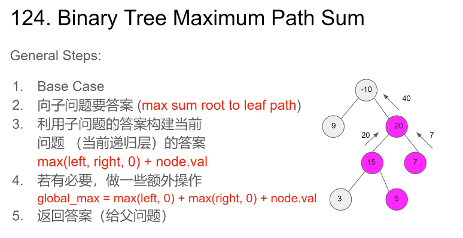


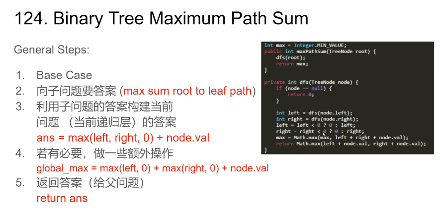

General Steps:

1. Base Case

2. 向子问题要答案(max sum root to leaf path) 

3. 利用子问题的答案构建当前问题 (当前递归层)的答案
   ans = max(left, right, 0) + node.val

4. 若有必要，做一些额外操作
   global_max = max(left, 0) + max(right, 0) + node.val

5. 返回答案(给父问题)

   Return ans

**要不左边直上直下，要不右边直上直下**

```
int max = Integer.MIN_VALUE;
public int maxPathSum(TreeNode root) {
    dfs(root);
    return max;
}

private int dfs(TreeNode node) {
    if (node == null) {
        return 0;
    }
    int left = dfs(node.left);
    int right = dfs(node.right);
    left = left < 0 ? 0 : left;
    right = right < 0 ? 0 : right;
    max = Math.max(max, left + right + node.val);
    return Math.max(left + node.val, right + node.val);
}
```


### Top Down DFS


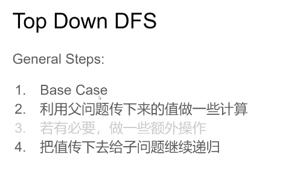
General Steps:

1. Base Case 
2. 利用父问题传下来的值做一些计算 
3. 若有必要，做一些额外操作
4. 把值传下去给子问题继续递归


### 129.Sum Root to Leaf Numbers

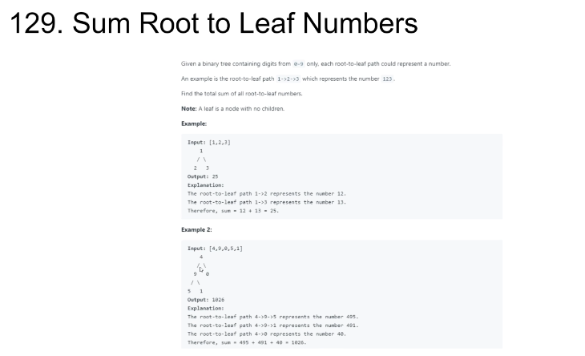

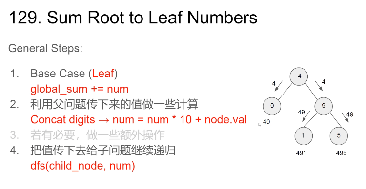

General Steps:
1. Base Case (Leaf)
global_sum += num
2. 利用父问题传下来的值做一些计算
Concat digits → num = num * 10 + node.val
3. 若有必要，做一些额外操作 
4. 把值传下去给子问题继续递归
dfs(child node, num)

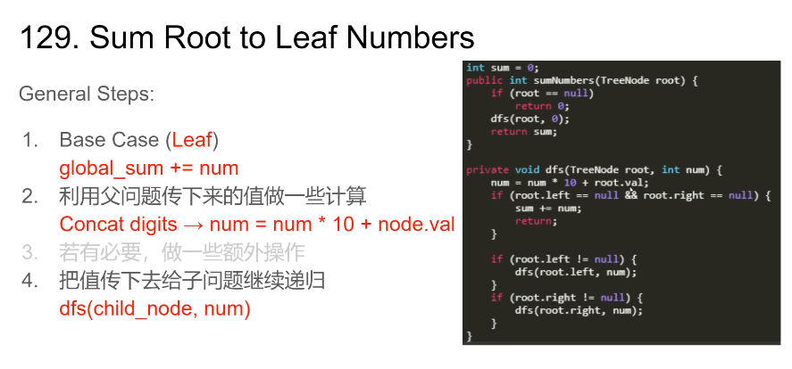

```
int sum = 0;

public int sumNumbrers(TreeNode root) {
    if (root == null) {
        return 0;
    }
    dfs(root, 0);
    return sum;
}

public void dfs(TreeNode root, int num) {
    num = num * 10 + root.val;
    if (root.left == null && root.right == null) {
        sum += num;
        return;
    }

    if (root.left != null) {
        dfs(root.left, num);
    }
    if (root.right != null) {
        dfs(root.right, num);
    }
}
```


### 更多相关题目
Validate Binary Search Tree(98)
Balanced Binary Tree(110)
Path Sum II (113)
Lowest Common Ancestor of a Binary Tree(236)
Delete Node in a BST(450)
Most Frequent Subtree Sum(508)
