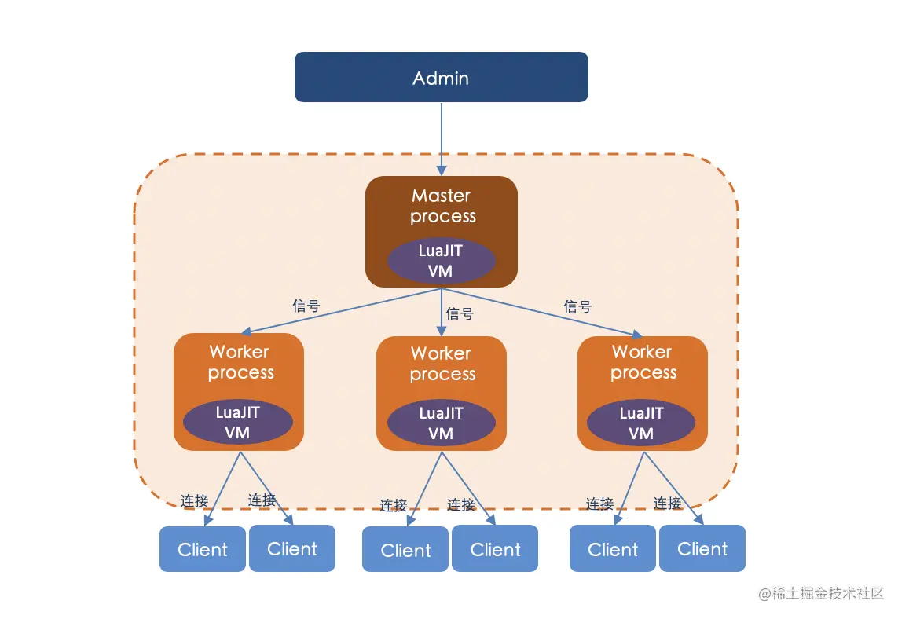
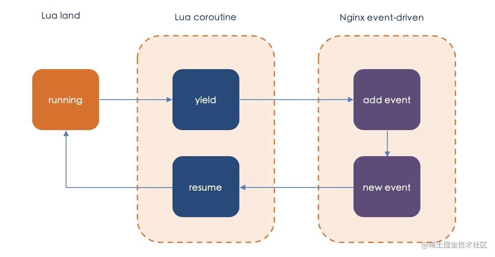
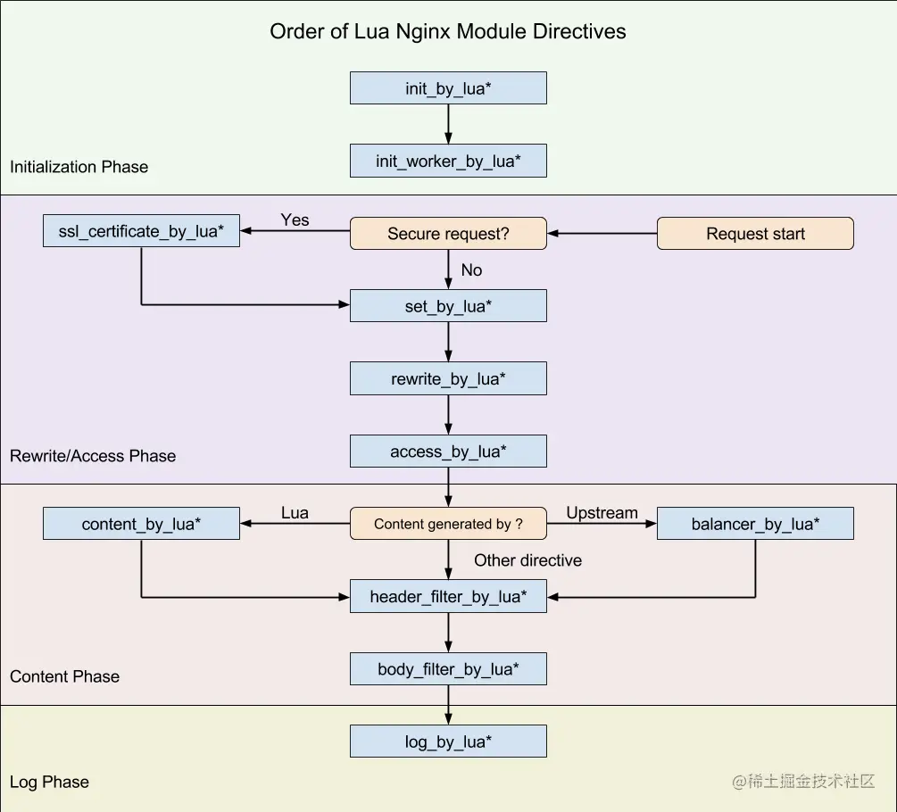

# 简介

OpenResty® 是一个基于 Nginx 与 Lua 的高性能 Web 平台，其内部集成了大量精良的 Lua 库、第三方模块以及大多数的依赖项。用于方便地搭建能够处理超高并发、扩展性极高的动态 Web 应用、Web 服务和动态网关。OpenResty 官网地址：[openresty.org/cn/。](https://link.juejin.cn?target=https%3A%2F%2Fopenresty.org%2Fcn%2F%E3%80%82)

OpenResty 主要包含两方面的技术：

- Nginx: 一个免费的、开源的、高性能的 HTTP 服务器和反向代理，也是一个电子邮件（IMAP/POP3/SMTP）代理服务器。
- Lua: 一种轻量、小巧、可移植、快速的脚本语言；LuaJIT 即时编译器会将频繁执行的 Lua 代码编译成本地机器码交给 CPU 直接执行，执行效率更高，OpenResty 会默认启用 LuaJIT。

# 历史

OpenResty 最早是雅虎中国的一个公司项目，起步于 2007 年 10 月。当时兴起了 OpenAPI 的热潮，用于满足各种 Web Service 的需求，就诞生了 OpenResty。在公司领导的支持下，最早的 OpenResty 实现从一开始就开源了。

最初的定位是服务于公司外的开发者，像其他的 OpenAPI 那样，但后来越来越多地是为雅虎中国的搜索产品提供内部服务。这是第一代的 OpenResty，当时的想法是，提供一套抽象的 Web Service，能够让用户利用这些 Web Service 构造出新的符合他们具体业务需求的 Web Service 出来，所以有些“meta web service”的意味，包括数据模型、查询、安全策略都可以通过这种 meta web service 来表达和配置。同时这种 Web Service 也有意保持 REST 风格。与这种概念相对应的是纯 AJAX 的 Web 应用，即 Web 应用几乎都使用客户端 JavaScript 来编写，然后完全由 Web Service 让 web 应用“活”起来。用户把 .html/ .js/ .css/ .jpg 等静态文件下载到 web browser 中，然后 js 开始运行，跨域请求雅虎提供的经过站长定制过的 Web Service ，然后应用就可以运行起来。不过随着后来的发展，公司外的用户毕竟还是少数，于是应用的重点是为公司内部的其他团队提供 Web Service，比如雅虎中国的全能搜索产品，及其外围的一些产品。从那以后，开发的重点便放在了性能优化上面。

章亦春在加入淘宝数据部门的量子团队之后，决定对 OpenResty 进行重新设计和彻底重写，并把应用重点放在支持像量子统计这样的 web 产品上面，所以量子统计 3.0 开始也几乎完全是 Web Service 驱动的纯 AJAX 应用。这是第二代的 OpenResty，一般称之为 ngx_openresty，以便和第一代基于 Perl 和 Haskell 实现的 OpenResty 加以区别。章亦春和他的同事王晓哲一起设计了第二代的 OpenResty。在王晓哲的提议下，选择基于 Nginx 和 Lua 进行开发。

为什么要取 OpenResty 这个名字呢？OpenResty 最早是顺应 OpenAPI 的潮流做的，所以 Open 取自“开放”之意，而 Resty 便是 REST 风格的意思。虽然后来也可以基于 ngx_openresty 实现任何形式的 Web Service 或者传统的 Web 应用。也就是说 Nginx 不再是一个简单的静态网页服务器，也不再是一个简单的反向代理了。第二代的 OpenResty 致力于通过一系列 Nginx 模块，把 Nginx 扩展为全功能的 Web 应用服务器。（摘自：《OpenResty作者章亦春访谈实录》[5])

# Lua 与 LuaJIT

要了解 OpenResty，那么 Lua 语言是必须先要了解的，它是 OpenResty 中使用的编程语言。Lua 是一个小巧的脚本语言。是巴西里约热内卢天主教大学（Pontifical Catholic University of Rio de Janeiro）里的一个研究小组，由 Roberto Ierusalimschy、Waldemar Celes 和 Luiz Henrique de Figueiredo 所组成并于 1993 年开发。Lua 在葡萄牙语里代表美丽的月亮。

Lua 在设计之初，就把自己定位为一个简单、轻量、可嵌入的胶水语言，没有走大而全的路线。虽然你平常工作中可能没有直接编写 Lua 代码，但 Lua 的使用其实非常广泛。很多的网游，比如魔兽世界，都会采用 Lua 来编写插件；而键值数据库 Redis 则是内置了 Lua 来控制逻辑。另一方面，虽然 Lua 自身的库比较简单，但它可以方便地调用 C 库，大量成熟的 C 代码都可以为其所用。比如在 OpenResty 中，很多时候都需要你调用 Nginx 和 OpenSSL 的 C 函数，而这都得益于 Lua 和 LuaJIT 这种方便调用 C 库的能力。

Lua 非常高效，它运行得比许多其它脚本（如 Perl、Python、Ruby）都快，这点在第三方的独立测评中得到了证实。尽管如此，仍然会有人不满足，他们总觉得“嗯，还不够快!”。LuaJIT 就是一个为了再榨出一些速度的尝试，它利用即时编译（Just-in Time）技术把 Lua 代码编译成本地机器码后交由 CPU 直接执行。LuaJIT 2 的测评报告表明，在数值运算、循环与函数调用、协程切换、字符串操作等许多方面它的加速效果都很显著。凭借着 FFI 特性，LuaJIT 2 在那些需要频繁地调用外部 C/C++ 代码的场景，也要比标准 Lua 解释器快很多。目前 LuaJIT 2 已经支持包括 i386、x86_64、ARM、PowerPC 以及 MIPS 等多种不同的体系结构。

LuaJIT 是采用 C 和汇编语言编写的 Lua 解释器与即时编译器。LuaJIT 被设计成全兼容标准的 Lua 5.1 语言，同时可选地支持 Lua 5.2 和 Lua 5.3 中的一些不破坏向后兼容性的有用特性。因此，标准 Lua 语言的代码可以不加修改地运行在 LuaJIT 之上。LuaJIT 和标准 Lua 解释器的一大区别是，LuaJIT 的执行速度，即使是其汇编编写的 Lua 解释器，也要比标准 Lua 5.1 解释器快很多，可以说是一个高效的 Lua 实现。另一个区别是，LuaJIT 支持比标准 Lua 5.1 语言更多的基本原语和特性，因此功能上也要更加强大。

对于 Lua 语法的学习和使用可以参考《Lua 入门》[6]。

# 使用示例

为了能够让大家对 OpenResty 有个大致的使用印象，这里引用一个官网的示例[7]来做讲解。在安装完OpenResty之后（安装过程略过），创建工作目录：

```bash
mkdir ~/work

cd ~/work

mkdir logs/ conf/
复制代码
```

在新创建的 conf/ 目录下创建一个 nginx.conf 配置文件，其内容如下：

```markdown
pid logs/nginx.pid;

events{

        worker_connections 1024;

}


http{

        server {

                listen 8080;

                location / {

                        content_by_lua '

                                ngx.say("hello, world")

                        ';

                }

        }

}
复制代码
```

启动 OpenResty 服务：

```bash
openresty -p `pwd` -c conf/nginx.conf
复制代码
```

如果没有报错的话，OpenResty 服务已经启动成功了。你可以打开浏览器，或者使用 curl 命令来查看返回的结果：

```makefile
hidden:~ hidden$ curl -i localhost:8080

HTTP/1.1 200 OK

Server: openresty/1.15.8.3

Date: Wed, 22 Apr 2020 03:57:56 GMT

Content-Type: text/plain

Transfer-Encoding: chunked

Connection: keep-alive


hello, world
复制代码
```

这里只是简单的打印一个“hello, world”，真实使用场景下，肯定会包含大堆的代码，如果这些代码全部包含在 nginx.conf 配置文章中，那么可阅读性和可维护性是会大大降低的。所以，我们要进一步地将Lua 代码抽离出来。

我们在 ~/work 目录下再创建一个 lua/ 的目录，然后再在 lua/ 目录下创建一个 hello.lua 文件，文件内的内容为:`ngx.say("hello, world")`。对应的目录结构如下：

```makefile
hidden:work hidden$ tree

.

├── conf

│   ├── nginx.conf

├── logs

│   └── nginx.pid

├── lua

    └── hello.lua
复制代码
```

之后修改 nginx.conf 的配置，把其中的 content_by_lua 改为 content_by_lua_file：

```markdown
pid logs/nginx.pid;

events{

        worker_connections 1024;

}


http{

        server {

                listen 8080;

                location / {

                        content_by_lua_file lua/hello.lua;

                }

        }

}
复制代码
```

最后，重启 OpenResty 的服务就可以了。

> 做 OpenResty 开发，lua-nginx-module 的文档[8]是你的首选，Lua 语言的库都是同步阻塞的，用的时候要三思。也就是说，尽量使用 ngx_lua提供的api，而不是使用 Lua 本身的。例如 ngx.sleep() 与 lua提供的 sleep，前者不会造成阻塞，后者是会阻塞的

# 原理剖析

OpenResty 的工作原理如下图所示。



Nginx 服务器启动后，产生一个 Master 进程（Master Process），Master 进程执行一系列工作后产生一个或者多个 Worker 进程（Worker Processes)。其中，Master 进程用于接收来自外界的信号，并向各 Worker 进程发送信号，同时监控 Worker 进程的工作状态。当 Worker 进程退出后(异常情况下)，Master 进程也会自动重新启动新的 Worker 进程。Worker 进程则是外部请求真正的处理者。

多个 Worker 进程之间是对等的，他们同等竞争来自客户端的请求，各进程互相之间是独立的。一个请求，只可能在一个 Worker 进程中处理，一个 Worker 进程不可能处理其它进程的请求。Worker 进程的个数是可以设置的，一般我们会设置与机器 CPU 核数一致。同时，Nginx 为了更好的利用多核特性，具有 CPU 绑定选项，我们可以将某一个进程绑定在某一个核上，这样就不会因为进程的切换带来cache的失效（CPU affinity）。所有的进程的都是单线程（即只有一个主线程）的，进程之间通信主要是通过共享内存机制实现的。

OpenResty本质上是将 LuaJIT 的虚拟机嵌入到 Nginx 的管理进程和工作进程中，同一个进程内的所有协程都会共享这个虚拟机，并在虚拟机中执行Lua代码。在性能上，OpenResty 接近或超过 Nginx 的 C 模块，而且开发效率更高。下面深入介绍一下 OpenResty 的原理。

## Lua 协程

协程是不被操作系统内核所管理的，而完全由程序控制（也就是用户态执行），这样带来的好处就是性能得到了极大地提升。进程和线程切换要经过用户态到内核态再到用户态的过程，而协程的切换可以直接在用户态完成，不需要陷入内核态，切换效率高，降低资源消耗。Lua 协程与线程类似，拥有独立的堆栈、独立的局部变量、独立的指令指针，同时又与其他协同程序共享全局变量和其他大部分东西。

## cosocoket

OpenResty 中的核心技术 cosocket 将 Lua 协程和 Nginx 的事件机制结合在一起，最终实现了非阻塞网络 IO。不仅和 HTTP 客户端之间的网络通信是非阻塞的，与 MySQL、Memcached 以及 Redis 等众多后端之间的网络通信也是非阻塞的。在 OpenResty 中调用一个 cosocket 相关的网络函数，内部关键实现如图所示：



从图中可以看出，用户的 Lua 脚本每触发一个网络操作，都会有协程的 yield 和 resume。当遇到网络 I/O 时，Lua 协程会交出控制权（yield），把网络事件注册到 Nginx 监听列表中，并把运行权限交给Nginx。当有 Nginx 注册网络事件到达触发条件时，便唤醒（resume）对应的协程继续处理。这样就可以实现全异步的 Nginx 机制，不会影响 Nginx 的高并发处理性能。

## 多阶段处理

基于 Nginx 使用的多模块设计思想，Nginx 将 HTTP 请求的处理过程划分为多个阶段。这样可以使一个HTTP 请求的处理过程由很多模块参与处理，每个模块只专注于一个独立而简单的功能处理，可以使性能更好、更稳定，同时拥有更好的扩展性。

OpenResty 在 HTTP 处理阶段基础上分别在 Rewrite/Access 阶段、Content 阶段、Log 阶段注册了自己的 handler，加上系统初始阶段 master 的两个阶段，共 11 个阶段为 Lua 脚本提供处理介入的能力。下图描述了 OpenResty 可以使用的主要阶段：



（图片来源于 lua-nginx-module 文档）

OpenResty 将我们编写的 Lua 代码挂载到不同阶段进行处理，每个阶段分工明确，代码独立。

- init_by_lua*：Master 进程加载 Nginx 配置文件时运行，一般用来注册全局变量或者预加载 Lua 模块。
- init_worker_by_lua*：每个 worker 进程启动时执行，通常用于定时拉取配置/数据或者进行后端服务的健康检查。
- set_by_lua*：变量初始化。
- rewrite_by_lua*：可以实现复杂的转发、重定向逻辑。
- access_by_lua*：IP 准入、接口权限等情况集中处理。
- content_by_lua*：内容处理器，接收请求处理并输出响应。
- header_filter_by_lua*：响应头部或者 cookie 处理。
- body_filter_by_lua*：对响应数据进行过滤，如截断或者替换。
- log_by_lua*：会话完成后，本地异步完成日志记录。

# 参考资料

1. OpenResty最佳实践[legacy.gitbook.com/book/moonbi…](https://link.juejin.cn?target=https%3A%2F%2Flegacy.gitbook.com%2Fbook%2Fmoonbingbing%2Fopenresty-best-practices%2Fdetails)
2. OpenResty官网：[openresty.org/cn/](https://link.juejin.cn?target=https%3A%2F%2Fopenresty.org%2Fcn%2F)
3. lua-nginx-module文档: [github.com/openresty/l…](https://link.juejin.cn?target=https%3A%2F%2Fgithub.com%2Fopenresty%2Flua-nginx-module%23version)
4. 极客时间- OpenResty从入门到实践
5. [OpenResty 作者章亦春访谈实录](https://link.juejin.cn?target=https%3A%2F%2Fwww.oschina.net%2Fquestion%2F28_60461)
6. [Lua 入门](https://link.juejin.cn?target=https%3A%2F%2Fmoonbingbing.gitbooks.io%2Fopenresty-best-practices%2Fcontent%2Flua%2Fmain.html)
7. [openresty.org/cn/getting-…](https://link.juejin.cn?target=https%3A%2F%2Fopenresty.org%2Fcn%2Fgetting-started.html)
8. [github.com/openresty/l…](https://link.juejin.cn?target=https%3A%2F%2Fgithub.com%2Fopenresty%2Flua-nginx-module%23version)


作者：飞书技术
链接：https://juejin.cn/post/7124986588462841893
来源：稀土掘金
著作权归作者所有。商业转载请联系作者获得授权，非商业转载请注明出处。
