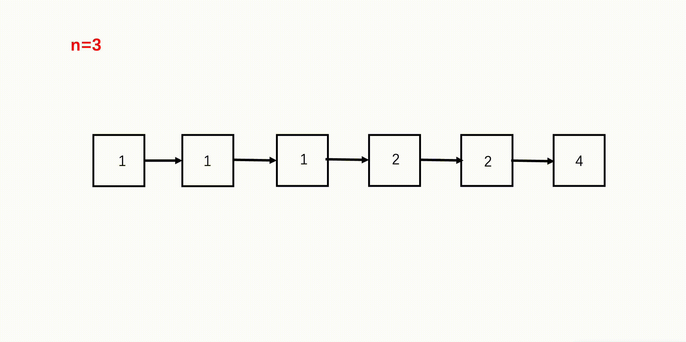
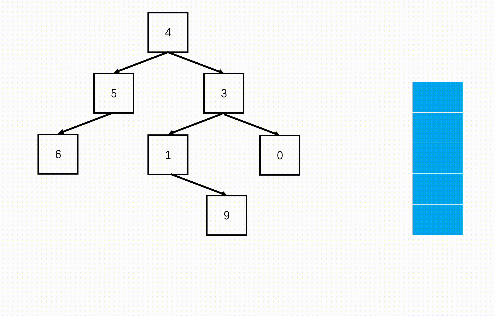
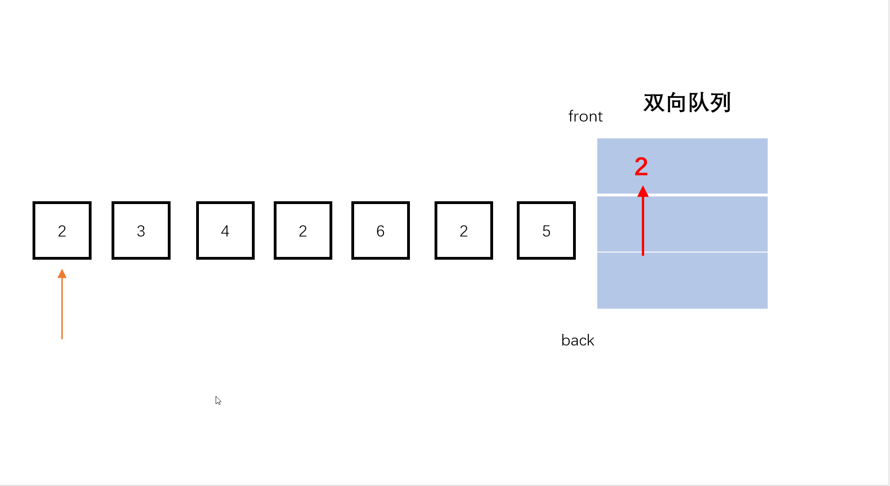
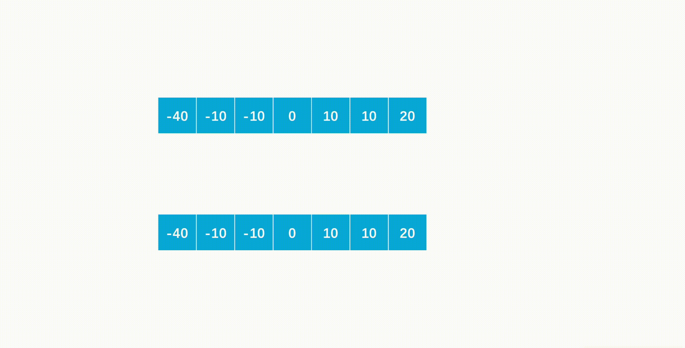
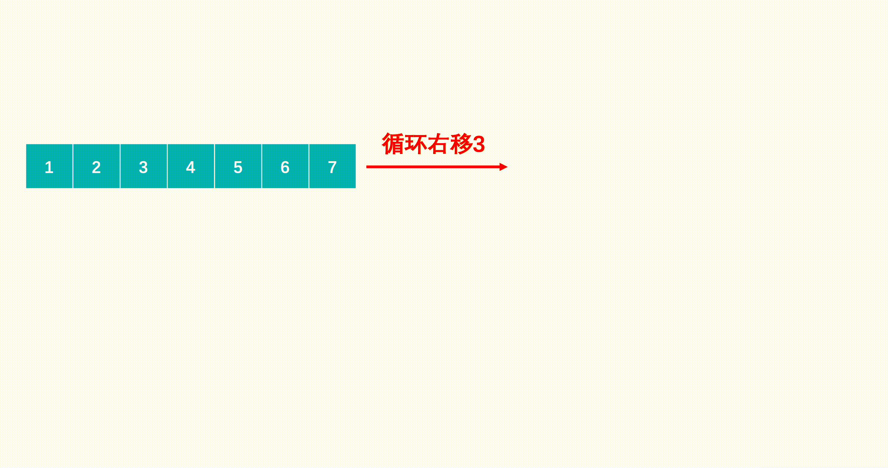
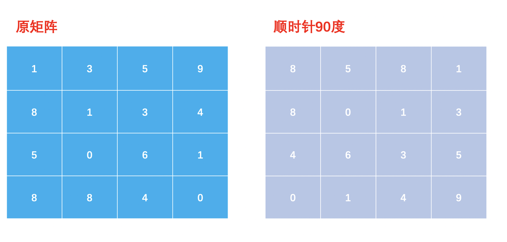

## 模板速刷TOP101题解

pdf版本 https://uploadfiles.nowcoder.com/bm/top101.pdf 

hmtl版本   https://uploadfiles.nowcoder.com/bm/top101.html

[https://www.nowcoder.com/exam/oj?tab=%E7%AE%97%E6%B3%95%E7%AF%87&topicId=295](https://www.nowcoder.com/exam/oj?tab=算法篇&topicId=295)


## 序言

到底要掌握多少题目才能拿到offer？要不要持续刷题？我相信这是任何一个程序员同学都会发出的疑问。甚至你还会发出这样的想法？刷题真的对工作有帮助吗？ 也许你并不想刷题，当你不得不刷题的时候，你会想尽量少刷题！

带着大家的痛楚和疑问，在全网分析了10000+多篇面经（用了两年），面试过的200人，以及过往被面试100次。发现一个普通码农这辈子能掌握101题目就足够了，并不需要动辄大几百道才能怎么样！你就认认真真刷101道题目已经足够你拿到一个非常好的offer了。 但是刷101道题目对于一个普通人来说真的容易吗？

首先题目的挑选，有多少同学根本不知道要刷哪些题目？所以第一步我们就是挑选高频面试题目，但是高频并不等于经典，常考并不等于困难。

经过上面复杂的分析，我们的得到了第一版题单大概120道左右，然后由多位资深面试者和面试官反复确认，磨炼出来这101道题目。从第一个版本到最后一个版本，总共迭代了70多次。最终确定了这101道题目。

其次的问题就是刷完这些题目需要多久，经过亲身试验，刷完这101道题目比你想象的时间要长，尤其是没有任何系统的指导手册的情况下。分散刷题可能三个月都刷不完。 所以选题很困难，有节奏的刷完就更困难了。

当然了在确定完成是这101道题目之后，我们还不足够自信。又找了多位大厂的offer收割机同学调研，对于这101道题目的挑选进行评测，出乎意料得到了一直好评。熟练刷完这101道题目，国内面试基本上是稳妥的。得到这个结论的时候也印证了，真正能坚持熟练刷完101道题目的同学肯定是有极大收获的。 大部分吐槽算法题目的同学，可能连20题目都没有认真刷完过！也有一部分同学觉得自己刷题很多，但是到面试时候照样无法刷出来。 刷完并不等于会了！这也是为什么大厂同学告诉我们熟练掌握这101道题目就真的够用的关键。

清楚洞察大家的问题之后，我们拿出这101道题目，按照知识点划分，从难到易编排，每一道题目都配备了详细的题解，循序渐进。制作了模板速刷top101 https://www.nowcoder.com/exam/oj ，我们希望大家能够举一反三，一通百通。用模板的思维快速掌握到每一个题目。让大家都能爱上这种拿下题目的快感。

这次，你与offer之间仅差一个模板速刷top101

当然开刷之后你可能也会遇到刷不下去，但是我希望你坚持。在你求职工作的道路上，耐心刷101道题目真的是一件再简单不过的事情了。

模板速刷top101给你一个新的起点

## 1.链表系列

#### BM1.[反转链表](https://www.nowcoder.com/practice/75e878df47f24fdc9dc3e400ec6058ca?tpId=295&sfm=html&channel=nowcoder)

https://www.nowcoder.com/practice/75e878df47f24fdc9dc3e400ec6058ca?tpId=295&sfm=html&channel=nowcoder

##### 题目的主要信息：

- 给定一个长度为的链表，反转该链表，输出表头

##### 方法一：迭代（推荐使用）

**具体做法：**

- step 1：优先处理空链表，空链表不需要反转。
- step 2：我们可以设置两个指针，一个当前节点的指针，一个上一个节点的指针（初始为空）。
- step 3：遍历整个链表，每到一个节点，断开当前节点与后面节点的指针，并用临时变量记录后一个节点，然后当前节点指向上一个节点。
- step 4：再轮换当前指针与上一个指针，让它们进入下一个节点及下一个节点的前序节点。

具体图示如下图所示： 

**Java实现代码：**

```
public class Solution {
    public ListNode ReverseList(ListNode head) {
        if(head == null) //处理空链表
            return null;
        ListNode cur = head;
        ListNode pre = null;
        while(cur != null){
            ListNode temp = cur.next; //断开链表，要记录后续一个
            cur.next = pre; //当前的next指向前一个
            pre = cur; //前一个更新为当前
            cur = temp; //当前更新为刚刚记录的后一个
        }
        return pre;
    }
}
```

**C++实现代码：**

```
class Solution {
public:
    ListNode* ReverseList(ListNode* pHead) {
        if(pHead == NULL)
            return NULL;
        ListNode* cur = pHead;
        ListNode* pre = NULL;
        while(cur != NULL){
            ListNode* temp = cur->next; //断开链表，要记录后续一个
            cur->next = pre; //当前的next指向前一个
            pre = cur; //前一个更新为当前
            cur = temp; //当前更新为刚刚记录的后一个
        }
        return pre;
    }
};
```

**复杂度分析：**

- 时间复杂度：，遍历链表一次
- 空间复杂度：，无额外空间使用

##### 方法二：递归（扩展思路）

**具体做法：**

从上述方法一，我们可以看到每当我们反转链表的一个节点以后，要遍历进入下一个节点进入反转，相当于对后续的子链表进行反转，这就是一个子问题，因此我们也可以使用递归。

- **终止条件：** 当到达链表尾，要么当前指针是空，要么下一个指针是空，就返回。
- **返回值：** 每一级返回反转后的子问题的头节点。
- **本级任务：** 先进入后一个节点作为子问题，继续反转，然后记录返回来的头节点，连接在本级节点在子问题的后面。

具体步骤：

- step 1：对于每个节点我们递归向下遍历到最后。
- step 2：然后往上依次逆转两个结点。
- step 3：将逆转后的尾连接这一级的节点。

**Java实现代码：**

```
public class Solution {
    public ListNode ReverseList(ListNode head) {
        if(head == null || head.next == null)
            return head;
        ListNode newHead = ReverseList(head.next); //反转下一个
        head.next.next = head; //逆转
        head.next = null; //尾部设置空结点
        return newHead;
    }
}
```

**C++实现代码：**

```
class Solution {
public:
    ListNode* ReverseList(ListNode* pHead) {
        if(pHead == NULL || pHead->next == NULL)
            return pHead;
        ListNode* newHead = ReverseList(pHead->next); //反转下一个
        pHead->next->next = pHead; //逆转
        pHead->next = NULL; //尾部设置空结点
        return newHead;
    }
};
```

**复杂度分析：**

- 时间复杂度：，相当于递归遍历链表
- 空间复杂度：，递归栈深度为链表长度

#### BM2.[链表内指定区间反转](https://www.nowcoder.com/practice/b58434e200a648c589ca2063f1faf58c?tpId=295&sfm=html&channel=nowcoder)

https://www.nowcoder.com/practice/b58434e200a648c589ca2063f1faf58c?tpId=295&sfm=html&channel=nowcoder

##### 题目的主要信息：

- 将一个节点数为 size 链表 m 位置到 n 位置之间的区间反转
- 链表其他部分不变，返回头节点

##### 方法一：头插法迭代（推荐使用）

**具体做法：**

肯定是要先找到了第m个位置才能开始反转链表，而反转的部分就是从第m个位置到第n个位置。

- step 1：我们可以在链表前加一个表头，后续返回时去掉就好了，因为如果要从链表头的位置反转，也很方便。
- step 2：使用两个指针，一个指向当前节点，一个指向前序节点。
- step 3：依次遍历链表，到第m个的位置。
- step 4：对于从m到n这些个位置的节点，依次断掉指向后续的指针，反转指针方向。
- step 5：返回时去掉我们添加的表头。

具体过程如下图所示：


**Java实现代码：**

```
import java.util.*;
public class Solution {
    public ListNode reverseBetween (ListNode head, int m, int n) {
        ListNode res = new ListNode(-1); //加个表头
        res.next = head;
        ListNode pre = res; //前序节点
        ListNode cur = head; //当前节点
        for(int i = 1; i < m; i++){ //找到m
            pre = cur;
            cur = cur.next;
        }
        for(int i = m; i < n; i++){ //从m反转到n
            ListNode temp = cur.next;
            cur.next = temp.next;
            temp.next = pre.next;
            pre.next = temp;
        }
        return res.next; //返回去掉表头
    }
}
```

**C++实现代码：**

```
class Solution {
public:
    ListNode* reverseBetween(ListNode* head, int m, int n) {
        ListNode* res = new ListNode(-1); //加个表头
        res->next = head;
        ListNode* pre = res; //前序节点
        ListNode* cur = head; //当前节点
        for(int i = 1; i < m; i++){ //找到m
            pre = cur;
            cur = cur->next;
        }
        for(int i = m; i < n; i++){ //从m反转到n
            ListNode* temp = cur->next;
            cur->next = temp->next;
            temp->next = pre->next;
            pre->next = temp;
        }
        return res->next; //返回去掉表头
    }
};
```

**复杂度分析：**

- 时间复杂度：，最坏情况下遍历全部链表
- 空间复杂度：，无额外空间使用

##### 方法二：递归（扩展思路）

**具体做法：**

我们来看看另一种分析：如果`m == 1`，就相当于反转链表的前元素；如果 `m != 1`我们把 head 的索引视为 1，那么我们是想从第  个元素开始反转，如果把 head.next 的索引视为1，那相对于 head.next的反转的区间应该是从第  个元素开始的，以此类推，反转区间的起点往后就是子问题，我们可以使用递归处理：

- **终止条件：** 当`m == 1`，就可以直接反转前n个元素。
- **返回值：** 将已经反转后的子问题头节点返回给上一级。
- **本级任务：** 递归地缩短区间，进入子问题反转。

而每次反转，如果`n == 1`，相当于只颠倒第一个节点，如果不是，则进入后续节点（子问题），因此反转过程也可以使用递归：

- **终止条件：** 当`n == 1`时，只反转当前头节点即可。
- **返回值：** 将子问题反转后的节点头返回。
- **本级任务：** 缩短进入子问题反转，并将当前节点接在反转后子问题的后面。

具体步骤如下：

- step 1：按照第一个递归的思路缩短子问题找到反转区间的起点。
- step 2：按照第二个递归的思路缩短终点的子问题，从第个位置开始反转，往上拼接。

**Java实现代码：**

```
import java.util.*;
public class Solution {
    ListNode temp = null;
    public ListNode reverse(ListNode head, int n){
        if(n == 1){ //只颠倒第一个节点，后续不管
            temp = head.next;
            return head;
        }
        ListNode node = reverse(head.next, n - 1); //进入子问题
        head.next.next = head; //反转
        head.next = temp; //拼接
        return node;
    }
    public ListNode reverseBetween (ListNode head, int m, int n) {
        if(m == 1) //从第一个节点开始
            return reverse(head, n);
        ListNode node = reverseBetween(head.next, m - 1, n - 1); //缩减子问题
        head.next = node; //拼接已翻转
        return head;
    }
}
```

**C++实现代码：**

```
class Solution {
public:
    ListNode* temp = NULL;
    ListNode* reverse(ListNode* head, int n){
        if(n == 1){ //只颠倒第一个节点，后续不管
            temp = head->next;
            return head;
        }
        ListNode* node = reverse(head->next, n - 1); //进入子问题
        head->next->next = head; //反转
        head->next = temp; //拼接
        return node;
    }
    ListNode* reverseBetween(ListNode* head, int m, int n) {
        if(m == 1) //从第一个节点开始
            return reverse(head, n);
        ListNode* node = reverseBetween(head->next, m - 1, n - 1); //缩减子问题
        head->next = node; //拼接已翻转
        return head;
    }
};
```

**复杂度分析：**

- 时间复杂度：，最坏情况下遍历全部链表
- 空间复杂度：，递归栈深度最坏为

 

#### BM3.[链表中的节点每k个一组翻转](https://www.nowcoder.com/practice/b49c3dc907814e9bbfa8437c251b028e?tpId=295&sfm=html&channel=nowcoder)

https://www.nowcoder.com/practice/b49c3dc907814e9bbfa8437c251b028e?tpId=295&sfm=html&channel=nowcoder

##### 题目主要信息:

- 给定一个链表，从头开始每k个作为一组，将每组的链表结点翻转
- 组与组之间的位置不变
- 如果最后链表末尾剩余不足k个元素，则不翻转，直接放在最后

##### 方法：递归（推荐使用）

**具体做法：**

- step 1：现在我们想一想，如果拿到一个链表，想要像上述一样分组翻转应该做些什么？首先肯定是分段吧，至少我们要先分成一组一组，才能够在组内翻转。分组很容易，只要每次遍历k个元素，就是一组。
- step 2：然后是组内翻转，翻转完了再连接起来。翻转即指定区间内的翻转，也很容易，可以参考[链表指定区间内的翻转](https://blog.nowcoder.net/n/e6f0f72195884689b6b237b46509ad8d)。
- step 3：最后是将反转后的分组连接，但是连接的时候遇到问题了：首先如果能够翻转，链表第一个元素一定是第一组，它翻转之后就跑到后面去了，而第一组的末尾元素才是新的链表首，我们要返回的也是这个元素，而原本的链表首要连接下一组翻转后的头部，即翻转前的尾部，如果不建立新的链表，看起来就会非常难。
- step 4：如果我们从最后的一个组开始翻转，得到了最后一个组的链表首，是不是可以直接连在倒数第二个组翻转后的尾（即翻转前的头）后面，是不是看起来就容易多了。

怎样从后往前呢？我们这时候可以用到自上而下再自下而上的递归或者说栈。接下来我们说说为什么能用递归？如果这个链表有个分组可以翻转，我们首先对第一个分组翻转，那么是不是接下来将剩余个分组翻转后的结果接在第一组后面就行了，那这剩余的组就是一个子问题。我们来看看递归的三段式模版：

- **终止条件：** 当进行到最后一个分组，即不足k次遍历到链表尾（0次也算），就将剩余的部分直接返回。
- **返回值：** 每一级要返回的就是翻转后的这一分组的头，以及连接好它后面所有翻转好的分组链表。
- **本级任务：** 对于每个子问题，先遍历k次，找到该组结尾在哪里，然后从这一组开头遍历到结尾，依次翻转，结尾就可以作为下一个分组的开头，而先前指向开头的元素已经跑到了这一分组的最后，可以用它来连接它后面的子问题，即后面分组的头。

具体过程可以参考如下：


**Java实现代码：**

```
import java.util.*;
public class Solution {
    public ListNode reverseKGroup (ListNode head, int k) {
        ListNode tail = head; //找到每次翻转的尾部
        for(int i = 0; i < k; i++){ //遍历k次到尾部
            if(tail == null) //如果不足k到了链表尾，直接返回，不翻转
                return head;
            tail = tail.next; 
        }
        ListNode pre = null; //翻转时需要的前序和当前节点
        ListNode cur = head;
        while(cur != tail){ //在到达当前段尾节点前
            ListNode temp = cur.next; //翻转
            cur.next = pre;
            pre = cur;
            cur = temp;
        }
        head.next = reverseKGroup(tail, k); //当前尾指向下一段要翻转的链表
        return pre;
    }
}
```

**C++实现代码：**

```
class Solution {
public:
    ListNode* reverseKGroup(ListNode* head, int k) {
        ListNode* tail = head; //找到每次翻转的尾部
        for(int i = 0; i < k; i++){ //遍历k次到尾部
            if(tail == NULL) //如果不足k到了链表尾，直接返回，不翻转
                return head;
            tail = tail->next; 
        }
        ListNode* pre = NULL; //翻转时需要的前序和当前节点
        ListNode* cur = head;
        while(cur != tail){ //在到达当前段尾节点前
            ListNode* temp = cur->next; //翻转
            cur->next = pre;
            pre = cur;
            cur = temp;
        }
        head->next = reverseKGroup(tail, k); //当前尾指向下一段要翻转的链表
        return pre;
    }
};
```

**复杂度分析：**

- 时间复杂度：，一共遍历链表个结点
- 空间复杂度：，递归栈最大深度为

 

#### BM4. [合并有序链表](https://www.nowcoder.com/practice/a479a3f0c4554867b35356e0d57cf03d?tpId=295&sfm=html&channel=nowcoder)

https://www.nowcoder.com/practice/a479a3f0c4554867b35356e0d57cf03d?tpId=295&sfm=html&channel=nowcoder

##### 题目的主要信息：

- 两个元素值递增的链表，单个链表的长度为
- 合并这两个链表并使新链表中的节点仍然是递增排序的

##### 方法一：迭代（推荐使用）

**具体做法：**

既然两个链表已经是排好序的，都是从小到大的顺序，那我们要将其组合，可以使用归并排序的思想：每次比较两个头部，从中取出最小的元素，然后依次往后。这样就能最快速地将最小的元素依次取出来排好序。

- step 1：判断空链表的情况，只要有一个链表为空，那答案必定就是另一个链表了，就算另一个链表也为空。
- step 2：新建一个空的表头后面连接两个链表排序后的结点。
- step 3：遍历两个链表都不为空的情况，取较小值添加在新的链表后面，每次只把被添加的链表的指针后移。
- step 4：遍历到最后肯定有一个链表还有剩余的结点，它们的值将大于前面所有的，直接连在新的链表后面即可。

具体过程可以参考如下图示：


**Java实现代码：**

```
public class Solution {
    public ListNode Merge(ListNode list1,ListNode list2) {
        if(list1 == null) //一个已经为空了，直接返回另一个
            return list2;
        if(list2 == null)
            return list1;
        ListNode head = new ListNode(0); //加一个表头
        ListNode cur = head;
        while(list1 != null && list2 != null){ //两个链表都要不为空
            if(list1.val <= list2.val){ //取较小值的结点
                cur.next = list1;
                list1 = list1.next; //只移动取值的指针
            }else{
                cur.next = list2;
                list2 = list2.next; //只移动取值的指针
            }
            cur = cur.next; //指针后移
        }
        if(list1 != null) //哪个链表还有剩，直接连在后面
            cur.next = list1;
        else
            cur.next = list2;
        return head.next; //返回值去掉表头
    }
}
```

**C++实现代码：**

```
class Solution {
public:
    ListNode* Merge(ListNode* pHead1, ListNode* pHead2) {
        if(pHead1 == NULL) //一个已经为空了，直接返回另一个
            return pHead2;
        if(pHead2 == NULL)
            return pHead1;
        ListNode* head = new ListNode(0); //加一个表头
        ListNode* cur = head;
        while(pHead1 && pHead2){ //两个链表都要不为空
            if(pHead1->val <= pHead2->val){ //取较小值的结点
                cur->next = pHead1;
                pHead1 = pHead1->next; //只移动取值的指针
            }else{
                cur->next = pHead2;
                pHead2 = pHead2->next; //只移动取值的指针
            }
            cur = cur->next; //指针后移
        }
        if(pHead1) //哪个链表还有剩，直接连在后面
            cur->next = pHead1;
        else
            cur->next = pHead2;
        return head->next; //返回值去掉表头
    } 
};
```

**复杂度分析：**

- 时间复杂度：，最坏情况遍历个结点
- 空间复杂度：，无额外空间使用，新建的链表属于返回必要空间

##### 方法二：递归（扩展思路）

**具体做法：**

上述方法一中，我们利用归并思想不断合并两个链表，每当我们添加完一个节点后，该节点指针后移，相当于这个链表剩余部分与另一个链表剩余部分合并，两个链表剩余部分合并就是原问题两个有序链表合并的子问题，因此也可以使用递归。

- step 1：每次比较两个链表当前结点的值，然后取较小值的链表指针往后，另一个不变送入递归中。
- step 2：递归回来的结果我们要加在当前较小值的结点后面，相当于不断在较小值后面添加结点。
- step 3：递归的终止是两个链表为空。

**Java实现代码：**

```
public class Solution {
    public ListNode Merge(ListNode list1,ListNode list2) {
        if(list1 == null) //一个已经为空了，返回另一个
            return list2;
        if(list2 == null)
            return list1;
        if(list1.val <= list2.val){ //先用较小的值的结点
            list1.next = Merge(list1.next, list2); //递归往下
            return list1; 
        }else{
            list2.next = Merge(list1, list2.next); //递归往下
            return list2;
        }
    }
}
```

**C++实现代码：**

```
class Solution {
public:
    ListNode* Merge(ListNode* pHead1, ListNode* pHead2) {
        if(pHead1 == NULL) //一个已经为空了，返回另一个
            return pHead2;
        if(pHead2 == NULL)
            return pHead1;
        if(pHead1->val <= pHead2->val){ //先用较小的值的结点
            pHead1->next = Merge(pHead1->next, pHead2); //递归往下
            return pHead1; 
        }else{
            pHead2->next = Merge(pHead1, pHead2->next); //递归往下
            return pHead2;
        }
    }
};
```

**复杂度分析：**

- 时间复杂度：，最坏相当于遍历两个链表每个结点一次
- 空间复杂度：，递归栈长度最大为

#### BM5. [合并k个已排序的链表](https://www.nowcoder.com/practice/65cfde9e5b9b4cf2b6bafa5f3ef33fa6?tpId=295&sfm=html&channel=nowcoder)

https://www.nowcoder.com/practice/65cfde9e5b9b4cf2b6bafa5f3ef33fa6?tpId=295&sfm=html&channel=nowcoder

##### 题目的主要信息：

- 给定k个排好序的升序链表
- 将这k个链表合并成一个大的升序链表，并返回这个升序链表的头

##### 方法一：归并排序思想（推荐使用）

**具体做法：**

如果是[两个有序链表合并](https://blog.nowcoder.net/n/b53360d426484a49b0b1962950776dbb)，我们可能会利用归并排序合并阶段的思想：准备双指针分别放在两个链表头，每次取出较小的一个元素加入新的大链表，将其指针后移，继续比较，这样我们出去的都是最小的元素，自然就完成了排序。

其实这道题我们也可以两两比较啊，只要遍历链表数组，取出开头的两个链表，按照上述思路合并，然后新链表再与后一个继续合并，如此循环，知道全部合并完成。但是，这样太浪费时间了。

既然都是归并排序的思想了，那我们可不可以直接归并的分治来做，而不是顺序遍历合并链表呢？答案是可以的！

归并排序是什么？简单来说就是将一个数组每次划分成等长的两部分，对两部分进行排序即是子问题。对子问题继续划分，直到子问题只有1个元素。还原的时候呢，将每个子问题和它相邻的另一个子问题利用上述双指针的方式，1个与1个合并成2个，2个与2个合并成4个，因为这每个单独的子问题合并好的都是有序的，直到合并成原本长度的数组。

- step 1：对于这k个链表，就相当于上述合并阶段的k个子问题，需要两个合并，不断往上，最终合并成完整的一个链表。
- step 2：从链表数组的首和尾开始，每次划分从中间开始划分，划分成两半。
- step 3：将这两半子问题合并好了就成了两个有序链表，最后将这[两个有序链表合并](https://blog.nowcoder.net/n/b53360d426484a49b0b1962950776dbb)就成了，依据子问题递归处理。
- **终止条件：** 划分的时候直到左右区间相等或事左边大于右边。
- **返回值：** 每级返回已经合并好的子问题链表。
- **本级任务：** 对半划分，将划分后的子问题合并成新的链表。

合并过程如下所示：


**Java实现代码：**

```
import java.util.ArrayList;
public class Solution {
    public ListNode Merge(ListNode list1, ListNode list2) { //两个链表合并
        if(list1 == null) //一个已经为空了，直接返回另一个
            return list2;
        if(list2 == null)
            return list1;
        ListNode head = new ListNode(0); //加一个表头
        ListNode cur = head;
        while(list1 != null && list2 != null){ //两个链表都要不为空
            if(list1.val <= list2.val){ //取较小值的结点
                cur.next = list1;
                list1 = list1.next; //只移动取值的指针
            }else{
                cur.next = list2;
                list2 = list2.next; //只移动取值的指针
            }
            cur = cur.next; //指针后移
        }
        if(list1 != null) //哪个链表还有剩，直接连在后面
            cur.next = list1;
        else
            cur.next = list2;
        return head.next; //返回值去掉表头
    }
    
    ListNode divideMerge(ArrayList<ListNode> lists, int left, int right){ //划分合并区间
        if(left > right) 
            return null;
        else if(left == right) //中间一个的情况
            return lists.get(left);
        int mid = (left + right) / 2; //从中间分成两段，再将合并好的两段合并
        return Merge(divideMerge(lists, left, mid), divideMerge(lists, mid + 1, right));
    }
    
    public ListNode mergeKLists(ArrayList<ListNode> lists) {
        return divideMerge(lists, 0, lists.size() - 1);
    }
}
```

**C++实现代码：**

```
class Solution {
public:
    ListNode* Merge2(ListNode* pHead1, ListNode* pHead2) { //两个有序链表合并
        if(pHead1 == NULL) //一个已经为空了，直接返回另一个
            return pHead2;
        if(pHead2 == NULL)
            return pHead1;
        ListNode* head = new ListNode(0); //加一个表头
        ListNode* cur = head;
        while(pHead1 && pHead2){ //两个链表都要不为空
            if(pHead1->val <= pHead2->val){ //取较小值的结点
                cur->next = pHead1;
                pHead1 = pHead1->next; //只移动取值的指针
            }else{
                cur->next = pHead2;
                pHead2 = pHead2->next; //只移动取值的指针
            }
            cur = cur->next; //指针后移
        }
        if(pHead1) //哪个链表还有剩，直接连在后面
            cur->next = pHead1;
        else
            cur->next = pHead2;
        return head->next; //返回值去掉表头
    }
    
    ListNode* divideMerge(vector<ListNode *> &lists, int left, int right){ //划分合并区间
        if(left > right) 
            return NULL;
        else if(left == right) //中间一个的情况
            return lists[left];
        int mid = (left + right) / 2; //从中间分成两段，再将合并好的两段合并
        return Merge2(divideMerge(lists, left, mid), divideMerge(lists, mid + 1, right));
    }
    
    ListNode *mergeKLists(vector<ListNode *> &lists) {
        return divideMerge(lists, 0, lists.size() - 1); //k个链表归并排序
    }
};
```

**复杂度分析：**

- 时间复杂度：，其中为所有链表的总节点数，最坏情况下每次合并都是，分治为二叉树型递归，每个节点都要使用一次合并，需要合并次
- 空间复杂度：，最坏情况下递归层，需要的递归栈

##### 方法二：优先队列（扩展思路）

**具体做法：**

我们也可以准备k个指针，每次比较得出k个数字中的最小值。利用Java提供的PriorityQueue或者C++ssSLT提供的优先队列，它是一种参照堆排序的容器，容器中的元素是有序的，如果是小顶堆，顶部元素就是最小的，每次可以直接取出最小的元素，而每次插入的成本根据堆排序，就是。也就是每次该容器中有k个元素，我们可以直接拿出最小的元素，再插入下一个元素，相当于每次都是链表的k个指针在比较大小。

- step 1：不管是Java还是C++都需要重载比较方法，构造一个比较链表节点大小的小顶堆。
- step 2：先遍历k个链表头，将不是空节点的节点加入优先队列。
- step 3：每次依次弹出优先队列中的最小元素，将其连接在合并后的链表后面，然后将这个节点在原本链表中的后一个节点（如果不为空的话）加入队列，类似上述双指针的过程。

**Java实现代码：**

```
import java.util.*;
public class Solution {
    public ListNode mergeKLists(ArrayList<ListNode> lists) {
        Queue<ListNode> pq = new PriorityQueue<>((v1, v2) -> v1.val - v2.val); //小顶堆
        for(int i = 0; i < lists.size(); i++){ //遍历所有链表第一个元素
            if(lists.get(i) != null) //不为空则加入小顶堆
                pq.add(lists.get(i));
        }
        ListNode res = new ListNode(-1); //加一个表头
        ListNode head = res;
        while(!pq.isEmpty()){ //直到小顶堆为空
            ListNode temp = pq.poll(); //取出最小的元素
            head.next = temp; //连接
            head = head.next;
            if(temp.next != null) //每次取出链表的后一个元素加入小顶堆
                pq.add(temp.next);
        }
        return res.next; //去掉表头
    }
}
```

**C++实现代码：**

```
class Solution {
public:
    struct cmp {
    bool operator()(ListNode* a, ListNode* b) { //重载小顶堆比较方式
        return  a->val > b->val;  
    }
};
    ListNode *mergeKLists(vector<ListNode *> &lists) {
        priority_queue<ListNode*, vector<ListNode*>, cmp> pq; //小顶堆
        for(int i = 0; i < lists.size(); i++){ //遍历所有链表第一个元素
            if(lists[i] != NULL) //不为空则加入小顶堆
                pq.push(lists[i]);
        }
        ListNode* res = new ListNode(-1); //加一个表头
        ListNode* head = res;
        while(!pq.empty()){ //直到小顶堆为空
            ListNode* temp = pq.top(); //取出最小的元素
            pq.pop();
            head->next = temp; //连接
            head = head->next;
            if(temp->next != NULL) //每次取出链表的后一个元素加入小顶堆
                pq.push(temp->next);
        }
        return res->next;
    }
};
```

**复杂度分析：**

- 时间复杂度：，其中为所有链表的总节点数，最坏需要遍历所有的节点，每次加入优先队列排序需要
- 空间复杂度：，优先队列的大小不会超过

#### BM6. [判断链表中是否有环](https://www.nowcoder.com/practice/650474f313294468a4ded3ce0f7898b9?tpId=295&sfm=html&channel=nowcoder)

https://www.nowcoder.com/practice/650474f313294468a4ded3ce0f7898b9?tpId=295&sfm=html&channel=nowcoder

##### 题目主要信息:

- 给定一个链表的头节点，判断这个链表是否有环
- 环形链表如下所示： 

 

##### 方法：双指针（推荐使用）

**具体做法：**

我们都知道链表不像二叉树，每个节点只有一个val值和一个next指针，也就是说一个节点只能有一个指针指向下一个节点，不能有两个指针，那这时我们就可以说一个性质：**环形链表的环一定在末尾，末尾没有NULL了**。为什么这样说呢？仔细看上图，在环2，0，-4中，没有任何一个节点可以指针指出环，它们只能在环内不断循环，因此环后面不可能还有一条尾巴。如果是普通线形链表末尾一定有NULL，那我们可以根据链表中是否有NULL判断是不是有环。

但是，环形链表遍历过程中会不断循环，线形链表遍历到NULL结束了，但是环形链表何时能结束呢？我们可以用一种双指针技巧，这也是处理环形链表常用的技巧：

- step 1：设置快慢两个指针，初始都指向链表头。
- step 2：遍历链表，快指针每次走两步，慢指针每次走一步。
- step 3：如果快指针到了链表末尾，说明没有环，因为它每次走两步，所以要验证连续两步是否为NULL。
- step 4：如果链表有环，那快慢双指针会在环内循环，因为快指针每次走两步，因此快指针会在环内追到慢指针，二者相遇就代表有环。

双指针过程可以参考如下图示：


**Java实现代码：**

```
public class Solution {
    public boolean hasCycle(ListNode head) {
        if(head == null) //先判断链表为空的情况
            return false;
        ListNode fast = head; //快慢双指针
        ListNode slow = head;
        while(fast != null && fast.next != null){ //如果没环快指针会先到链表尾
            fast = fast.next.next; //快指针移动两步
            slow = slow.next; //慢指针移动一步
            if(fast == slow) //相遇则有环
                return true;
        }
        return false; //到末尾则没有环
    }
}
```

**C++实现代码：**

```
class Solution {
public:
    bool hasCycle(ListNode *head) {
        if(head == NULL) //先判断链表为空的情况
            return false;
        ListNode* fast = head; //快慢双指针
        ListNode* slow = head;
        while(fast != NULL && fast->next != NULL){ //如果没环快指针会先到链表尾
            fast = fast->next->next; //快指针移动两步
            slow = slow->next; //慢指针移动一步
            if(fast == slow) //相遇则有环
                return true;
        }
        return false; //到末尾则没有环
    }
};
```

**复杂度分析：**

- 时间复杂度：，最坏情况下遍历链表个节点

- 空间复杂度：，仅使用了两个指针，没有额外辅助空间

   

#### BM7. [链表中环的入口节点](https://www.nowcoder.com/practice/6e630519bf86480296d0f1c868d425ad?tpId=295&sfm=html&channel=nowcoder)

https://www.nowcoder.com/practice/6e630519bf86480296d0f1c868d425ad?tpId=295&sfm=html&channel=nowcoder

##### 题目主要信息:

- 给定一个链表，首先判断其是否有环，然后找到环的入口

##### 方法：双指针（推荐使用）

**具体做法：**

根据题干，不说别的，我们能发现这道题需要完成两个任务：

1. 判断链表是否有环。
2. 在有环的链表中找到环的入口。

对于第一个任务，可以参考判断链表中是否有环，主要思想是利用环没有末尾NULL，后半部分一定是环，然后快慢双指针相遇就代表有环。（具体分析可以参考BM6）


那我们现在假定已经是一个有环的链表了，那么这个链表中怎么找到环的入口呢？在慢指针进入链表环之前，快指针已经进入了环，且在里面循环，这才能在慢指针进入环之后，快指针追到了慢指针，不妨假设快指针在环中走了圈，慢指针在环中走了圈，它们才相遇，而进入环之前的距离为，环入口到相遇点的距离为，相遇点到环入口的距离为。快指针一共走了步，慢指针一共走了，这个时候快指针走的倍数是慢指针的两倍，则，这时候，因为环的大小是，说明从链表头经过环入口到达相遇地方经过的距离等于整数倍环的大小：那我们从头开始遍历到相遇位置，和从相遇位置开始在环中遍历，会使用相同的步数，而双方最后都会经过入口到相遇位置这个节点，那说明这个节点它们就是重叠遍历的，那它们从入口位置就相遇了，这我们不就找到了吗？

- step 1：使用[判断链表中是否有环](https://blog.nowcoder.net/n/7478651e88f744128f6562e97396e04c)中的方法判断链表是否有环，并找到相遇的节点。
- step 2：慢指针继续在相遇节点，快指针回到链表头，两个指针同步逐个元素逐个元素开始遍历链表。
- step 3：再次相遇的地方就是环的入口。

具体过程如下图所示：


**Java实现代码：**

```
public class Solution {
    public ListNode hasCycle(ListNode head) {
        if(head == null) //先判断链表为空的情况
            return null;
        ListNode fast = head; //快慢双指针
        ListNode slow = head;
        while(fast != null && fast.next != null){ //如果没环快指针会先到链表尾
            fast = fast.next.next; //快指针移动两步
            slow = slow.next; //慢指针移动一步
            if(fast == slow) //相遇则有环，返回相遇的位置
                return slow;
        }
        return null; //到末尾说明没有环，返回null
    }
    
    public ListNode EntryNodeOfLoop(ListNode pHead) {
        ListNode slow = hasCycle(pHead);
        if(slow == null) //没有环
            return null;
        ListNode fast = pHead; //快指针回到表头
        while(fast != slow){ //再次相遇即是环入口
            fast = fast.next;
            slow = slow.next;
        }
        return slow;
    }
}
```

**C++实现代码：**

```
class Solution {
public:
    ListNode* hasCycle(ListNode *head) { //判断有没有环，返回相遇的地方
        if(head == NULL) //先判断链表为空的情况
            return NULL;
        ListNode* fast = head; //快慢双指针
        ListNode* slow = head;
        while(fast != NULL && fast->next != NULL){ //如果没环快指针会先到链表尾
            fast = fast->next->next; //快指针移动两步
            slow = slow->next; //慢指针移动一步
            if(fast == slow) //相遇则有环
                return slow; //返回相遇的地方
        }
        return NULL; //到末尾则没有环
    }
    
    ListNode* EntryNodeOfLoop(ListNode* pHead) {
        ListNode* slow = hasCycle(pHead);
        if(slow == NULL) //没有环
            return NULL;
        ListNode* fast = pHead; //快指针回到表头
        while(fast != slow){ //再次相遇即是环入口
            fast = fast->next;
            slow = slow->next;
        }
        return slow;
    }
};
```

复杂度分析：

- 时间复杂度：，最坏情况下遍历链表两次
- 空间复杂度：，使用了常数个指针，没有额外辅助空间

 

 

#### BM8. [链表中倒数最后k个结点](https://www.nowcoder.com/practice/886370fe658f41b498d40fb34ae76ff9?tpId=295&sfm=html&channel=nowcoder)

https://www.nowcoder.com/practice/886370fe658f41b498d40fb34ae76ff9?tpId=295&sfm=html&channel=nowcoder

##### 题目的主要信息：

- 一个长度为的链表，返回原链表中从倒数第k个结点至尾节点的全部节点
- 如果该链表长度小于k，请返回一个长度为 0 的链表

##### 方法一：快慢双指针（推荐使用）

**具体做法：**

我们无法逆序遍历链表，就很难得到链表的倒数第个元素，那我们可以试试反过来考虑，如果当前我们处于倒数第的位置上，即距离链表尾的距离是，那我们假设双指针指向这两个位置，二者同步向前移动，当前面个指针到了链表头的时候，两个指针之间的距离还是。虽然我们没有办法让指针逆向移动，但是我们刚刚这个思路却可以正向实施：

- step 1：准备一个快指针，从链表头开始，在链表上先走步。
- step 2：准备慢指针指向原始链表头，代表当前元素，则慢指针与快指针之间的距离一直都是。
- step 3：快慢指针同步移动，当快指针到达链表尾部的时候，慢指针正好到了倒数个元素的位置。

具体过程可以参考如下图示： 

**Java实现代码：**

```
import java.util.*;
public class Solution {
    public ListNode FindKthToTail (ListNode pHead, int k) {
        int n = 0;
        ListNode fast = pHead; 
        ListNode slow = pHead;
        for(int i = 0; i < k; i++){  //快指针先行k步
            if(fast != null)
                fast = fast.next;
            else //达不到k步说明链表过短，没有倒数k
                return slow = null;
        }
        //快慢指针同步，快指针先到底，慢指针指向倒数第k个
        while(fast != null){ 
            fast = fast.next;
            slow = slow.next;
        }
        return slow;
    }
}
```

**C++实现代码：**

```
class Solution {
public:
    ListNode* FindKthToTail(ListNode* pHead, int k) {
        ListNode* fast = pHead; 
        ListNode* slow = pHead;
        for(int i = 0; i < k; i++){  //快指针先行k步
            if(fast != NULL)
                fast = fast->next;
            else //达不到k步说明链表过短，没有倒数k
                return slow = NULL;
        }
        //快慢指针同步，快指针先到底，慢指针指向倒数第k个
        while(fast != NULL){ 
            fast = fast->next;
            slow = slow->next;
        }
        return slow;
    }
};
```

**复杂度分析：**

- 时间复杂度：，总共遍历个链表元素
- 空间复杂度：，无额外空间使用

##### 方法二：先找长度再找最后k（扩展思路）

**具体做法：**

链表不能逆向遍历，但是倒数第个位置，我们只需要知道是正数多少还是可以直接遍历得到的。

- step 1：可以先遍历一次链表找到链表的长度。
- step 2：然后比较链表长度是否比小，如果比k小返回一个空节点。
- step 3：如果链表足够长，则我们从头节点往后遍历次即可找到所求。

**Java实现代码：**

```
import java.util.*;
public class Solution {
    public ListNode FindKthToTail (ListNode pHead, int k) {
        int n = 0;
        ListNode p = pHead;
        while(p != null){ //遍历链表，统计链表长度
            n++;
            p = p.next;
        }
        if(n < k) //长度过小，返回空链表
            return null;
        p = pHead;
        for(int i = 0; i < n - k; i++) //遍历n-k次
            p = p.next;
        return p;
    }
}
```

**C++实现代码：**

```
class Solution {
public:
    ListNode* FindKthToTail(ListNode* pHead, int k) {
        int n = 0;
        ListNode* p = pHead;
        while(p != NULL){ //统计链表长度
            n++;
            p = p->next;
        }
        if(n < k) //长度过小，返回空链表
            return NULL;
        p = pHead;
        for(int i = 0; i < n - k; i++) //遍历n-k次
            p = p->next;
        return p;
    }
};
```

**复杂度分析：**

- 时间复杂度：，最坏情况下两次遍历个元素
- 空间复杂度：，无额外空间

#### BM9. [删除链表的倒数第n个节点](https://www.nowcoder.com/practice/f95dcdafbde44b22a6d741baf71653f6?tpId=295&sfm=html&channel=nowcoder)

https://www.nowcoder.com/practice/f95dcdafbde44b22a6d741baf71653f6?tpId=295&sfm=html&channel=nowcoder

##### 题目的主要信息：

- 给定一个链表，要删除链表倒数第n个节点，并返回链表的头
- 题目保证链表长度一定大于等于

##### 方法一：双指针（推荐使用）

**具体做法：**

我们无法逆序遍历链表，就很难得到链表的倒数第个元素，那我们可以试试反过来考虑，如果当前我们处于倒数第的位置上，即距离链表尾的距离是，那我们假设双指针指向这两个位置，二者同步向前移动，当前面个指针到了链表头的时候，两个指针之间的距离还是。虽然我们没有办法让指针逆向移动，但是我们刚刚这个思路却可以正向实施：

- step 1：给链表添加一个表头，处理删掉第一个元素时比较方便。
- step 2：准备一个快指针，在链表上先走步。
- step 3：准备慢指针指向原始链表头，代表当前元素，前序节点指向添加的表头，这样两个指针之间相距就是一直都是。
- step 4：快慢指针同步移动，当快指针到达链表尾部的时候，慢指针正好到了倒数个元素的位置。

具体过程可以参考下列图示：

 **Java实现代码：**

```
import java.util.*;
public class Solution {
    public ListNode removeNthFromEnd (ListNode head, int n) {
        ListNode res = new ListNode(-1); //添加表头
        res.next = head;
        ListNode cur = head; //当前节点
        ListNode pre = res; //前序节点
        ListNode fast = head;
        while(n != 0){ //快指针先行n步
            fast = fast.next;
            n--;
        }
        //快慢指针同步，快指针到达末尾，慢指针就到了倒数第n个位置
        while(fast != null){
            fast = fast.next;
            pre = cur;
            cur = cur.next;
        }
        pre.next = cur.next; //删除该位置的节点
        return res.next; //返回去掉头
    }
}
```

**C++实现代码：**

```
class Solution {
public:
    ListNode* removeNthFromEnd(ListNode* head, int n) {
        ListNode* res = new ListNode(-1); //添加表头
        res->next = head;
        ListNode* cur = head; //当前节点
        ListNode* pre = res; //前序节点
        ListNode* fast = head;
        while(n--) //快指针先行n步
            fast = fast->next;
        //快慢指针同步，快指针到达末尾，慢指针就到了倒数第n个位置
        while(fast != NULL){ 
            fast = fast->next;
            pre = cur;
            cur = cur->next;
        }
        pre->next = cur->next; //删除该位置的节点
        return res->next; //返回去掉头
    }
};
```

**复杂度分析：**

- 时间复杂度：，其中为链表长度，最坏情况遍历整个链表1次
- 空间复杂度：，常数级指针，无额外辅助空间使用

##### 方法二：长度统计法（思路扩展）

**具体做法：**

既然要删掉倒数第n个元素，那肯定得先找到这个元素，试想一下，如果是数组我们怎么找这个元素的？肯定是先统计数组长度，然后根据得到下标，再根据下标访问。但是很可惜，链表无法直接统计长度，也无法根据下标，我们能做的就是遍历链表。既然如此，那就两次遍历，第一次统计长度，第二次找到倒数第n个位置。

- step 1：给链表添加一个表头，处理删掉第一个元素时比较方便。
- step 2：遍历整个链表，统计链表长度。
- step 3：准备两个指针，一个指向原始链表头，表示当前节点，一个指向我们添加的表头，表示前序节点。两个指针同步遍历次找到倒数第个位置。
- step 4：前序指针的next指向当前节点的next，代表越过当前节点连接，即删去该节点。
- step 5：返回去掉添加的表头。

**Java实现代码：**

```
import java.util.*;
public class Solution {
    public ListNode removeNthFromEnd (ListNode head, int n) {
        int length = 0; //记录链表长度
        ListNode res = new ListNode(-1); //添加表头
        res.next = head;
        ListNode cur = head; //当前节点
        ListNode pre = res; //前序节点
        while(cur != null){ //找到链表长度
            length++;
            cur = cur.next;
        }
        cur = head; //回到头部
        for(int i = 0; i < length - n; i++){ //从头遍历找到倒数第n个位置
            pre = cur;
            cur = cur.next;
        }
        pre.next = cur.next; //删去倒数第n个节点
        return res.next; //返回去掉头节点
    }
}
```

**C++实现代码：**

```
class Solution {
public:
    ListNode* removeNthFromEnd(ListNode* head, int n) {
        int length = 0; //记录链表长度
        ListNode* res = new ListNode(-1); //添加表头
        res->next = head;
        ListNode* cur = head; //当前节点
        ListNode* pre = res; //前序节点
        while(cur != NULL){ //找到链表长度
            length++;
            cur = cur->next;
        }
        cur = head; //回到头部
        for(int i = 0; i < length - n; i++){ //从头遍历找到倒数第n个位置
            pre = cur;
            cur = cur->next;
        }
        pre->next = cur->next; //删去倒数第n个节点
        return res->next; //返回去掉头节点
    }
};
```

**复杂度分析：**

- 时间复杂度：，其中为链表长度，最坏情况遍历整个链表2次
- 空间复杂度：，常数级指针，无额外辅助空间使用

#### BM10. [两个链表的第一个公共结点](https://www.nowcoder.com/practice/6ab1d9a29e88450685099d45c9e31e46?tpId=295&sfm=html&channel=nowcoder)

https://www.nowcoder.com/practice/6ab1d9a29e88450685099d45c9e31e46?tpId=295&sfm=html&channel=nowcoder

##### 题目中的信息：

- 两个链表含有公共结点或没有，有公共结点则返回第一公共结点指针
- 单链表，无循环
- 没有公共节点返回空

##### 方法一：双指针长度比较法（推荐使用）

**具体做法：**

如果两个链表有公共节点，那么它们后半部分都是相同的，我们要找的也就是后半部分的第一个节点，只要遍历两个指针同时抵达第一个相同的节点，我们就找到了它。

- step 1：单独的遍历两个链表，得到各自的长度。
- step 2：求得两链表的长度差，其中较长的链表的指针从头先走步。
- step 3：两链表指针同步向后遍历，遇到第一个相同的节点就是第一个公共结点。

具体过程可以参考如下图示：  

**Java实现代码：**

```
public class Solution {
    public int ListLenth(ListNode pHead){  //计算链表长度的函数
        ListNode p = pHead;
        int n = 0;
        while(p != null){
            n++;
            p = p.next;
        }
        return n;
    }
    public ListNode FindFirstCommonNode(ListNode pHead1, ListNode pHead2) {
        int p1 = ListLenth(pHead1);  
        int p2 = ListLenth(pHead2);
        if(p1 >= p2){  //当链表1更长时，链表1指针先走p1-p2步
            int n = p1 - p2;
            for(int i = 0; i < n; i++){
                pHead1 = pHead1.next;
            }
            //两个链表同时移动，直到有公共结点时停下
            while((pHead1 != null) && (pHead2 != null) && (pHead1 != pHead2)){ 
                pHead1 = pHead1.next;
                pHead2 = pHead2.next;
            }
        }
        else{  //反之，则链表2先行p2-p1步
            int n = p2 - p1;
            for(int i = 0; i < n; i++){
                pHead2 = pHead2.next;
            }
            //两个链表同时移动，直到有公共结点时停下
            while((pHead1 != null) && (pHead2 != null) && (pHead1 != pHead2)){
                pHead1 = pHead1.next;
                pHead2 = pHead2.next;
            }
        }
        return pHead1;
    }
}
```

**C++实现代码：**

```
class Solution {
public:
    int ListLenth( ListNode* pHead){  //计算链表长度的函数
        ListNode* p = pHead;
        int n = 0;
        while(p != NULL){
            n++;
            p = p->next;
        }
        return n;
    }
    ListNode* FindFirstCommonNode( ListNode* pHead1, ListNode* pHead2) {
        int p1 = ListLenth(pHead1);  
        int p2 = ListLenth(pHead2);
        if(p1 >= p2){ //当链表1更长时，链表1指针先走p1-p2步
            int n = p1 - p2;
            for(int i = 0; i < n; i++){
                pHead1 = pHead1->next;
            }
            //两个链表同时移动，直到有公共结点时停下
            while((pHead1 != NULL) && (pHead2 != NULL) && (pHead1 != pHead2)){ 
                pHead1 = pHead1->next;
                pHead2 = pHead2->next;
            }
        }
        else{ //反之，则链表2先行p2-p1步
            int n = p2 - p1;
            for(int i = 0; i < n; i++){
                pHead2 = pHead2->next;
            }
            //两个链表同时移动，直到有公共结点时停下
            while((pHead1 != NULL) && (pHead2 != NULL) && (pHead1 != pHead2)){
                pHead1 = pHead1->next;
                pHead2 = pHead2->next;
            }
        }
        return pHead1;
    }
};
```

复杂度分析：

- 时间复杂度：，其中n为两链表较长者的长度，虽是多次循环，但都为单循环，取最大值即为
- 空间复杂度：，没有其他空间申请

##### 方法二：双指针连接法（扩展思路）

**具体做法：**

由上种方法长度差的思路，不同上述一个指针先走另一个指针后走，仅需将两个链表连在一起，两个指针同步走。易知将两个链表连在一起长度都相等，对于遍历两个链表的两个指针，公共部分走的步数是一样的，非公共部分因都走了两个链表，因此也是相同的，所以绕了一圈，第一个相同的结点便是第一个公共结点。

- step 1：判断链表情况，其中有一个为空，则不能有公共结点，返回null。
- step 2：两个链表都从表头开始同步依次遍历。
- step 3：不需要物理上将两个链表连在一起，仅需指针在一个链表的尾部时直接跳到另一个链表的头部。
- step 4：根据上述说法，第一个相同的结点便是第一个公共结点。

具体过程可参考图解：  

**Java实现代码：**

```
public class Solution {
    public ListNode FindFirstCommonNode(ListNode pHead1, ListNode pHead2) {
        //其中有一个为空，则不能有公共结点，返回null
        if(pHead1 == null || pHead2 == null) 
            return null;
        ListNode p1 = pHead1;
        ListNode p2 = pHead2;
        while(p1 != p2){ //相当于遍历两次两个链表所有值
            p1 = p1 == null ? pHead2 : p1.next;   
            p2 = p2 == null ? pHead1 : p2.next;
        }
        return p1;
    }
}
```

**C++实现代码：**

```
class Solution {
public:
    ListNode* FindFirstCommonNode( ListNode* pHead1, ListNode* pHead2) {
        //其中有一个为空，则不能有公共结点，返回NULL
        if(!pHead1 || !pHead2) 
            return NULL;
        ListNode* p1 = pHead1;
        ListNode* p2 = pHead2;
        while(p1 != p2)  //相当于遍历两次两个链表所有值
        {
            p1 = p1 == NULL ? pHead2 : p1->next;   
            p2 = p2 == NULL ? pHead1 : p2->next;
        }
        return p1;
    }
};
```

**复杂度分析：**

- 时间复杂度：，其中与分别为两链表的长度，因一次遍历两链表，所以为，也可以看成是级别的
- 空间复杂度：，没有其他空间申请

#### BM11. [两个链表生成相加链表](https://www.nowcoder.com/practice/c56f6c70fb3f4849bc56e33ff2a50b6b?tpId=295&sfm=html&channel=nowcoder)

https://www.nowcoder.com/practice/c56f6c70fb3f4849bc56e33ff2a50b6b?tpId=295&sfm=html&channel=nowcoder

##### 题目主要信息:

- 给定两个链表，每个链表中节点值都是0-9，每个链表就可以表示一个数字
- 将两个链表表示的数字相加，结果也存在链表中

##### 方法：反转链表法（推荐使用）

**具体做法：**

既然链表每个节点表示数字的每一位，那相加的时候自然可以按照加法法则，从后往前依次相加。但是，链表是没有办法逆序访问的，这是我们要面对第一只拦路虎。解决它也很简单，既然从后往前不行，那从前往后总是可行的吧，将两个链表反转一下，即可得到个十百千……各个数字从前往后的排列，相加结果也是个位在前，怎么办？再次反转，结果不就正常了。

- step 1：任意一个链表为空，返回另一个链表就行了，因为链表为空相当于0，0加任何数为0，包括另一个加数为0的情况。
- step 2：相继反转两个待相加的链表，反转过程可以参考[反转链表](https://blog.nowcoder.net/n/fef5d5398ea346df9ee014d19e238c2b)。
- step 3：设置返回链表的链表头，设置进位carry=0.
- step 4：从头开始遍历两个链表，直到两个链表节点都为空且carry也不为1. 每次取出不为空的链表节点值，为空就设置为0，将两个数字与carry相加，然后查看是否进位，将进位后的结果（对10取模）加入新的链表节点，连接在返回链表后面，并继续往后遍历。
- step 5：返回前将结果链表再反转回来。


**Java实现代码：**

```
import java.util.*;
public class Solution {
    public ListNode ReverseList(ListNode pHead) { //反转链表
        if(pHead == null)
            return null;
        ListNode cur = pHead;
        ListNode pre = null;
        while(cur != null){
            ListNode temp = cur.next; //断开链表，要记录后续一个
            cur.next = pre; //当前的next指向前一个
            pre = cur; //前一个更新为当前
            cur = temp; //当前更新为刚刚记录的后一个
        }
        return pre;
    }
    
    public ListNode addInList (ListNode head1, ListNode head2) {
        if(head1 == null) //任意一个链表为空，返回另一个
            return head2;
        if(head2 == null)
            return head1;
        head1 = ReverseList(head1); //反转两个链表
        head2 = ReverseList(head2);
        ListNode res = new ListNode(-1); //添加表头
        ListNode head = res;
        int carry = 0; //进位符号
        while(head1 != null || head2 != null || carry != 0){ //只要某个链表还有或者进位还有
            int val1 = head1 == null ? 0 : head1.val; //链表不为空则取其值
            int val2 = head2 == null ? 0 : head2.val;
            int temp = val1 + val2 + carry; //相加
            carry = temp / 10; //获取进位
            temp %= 10; 
            head.next = new ListNode(temp); //添加元素
            head = head.next;
            if(head1 != null) //移动下一个
                head1 = head1.next;
            if(head2 != null)
                head2 = head2.next;
        }
        return ReverseList(res.next); //结果反转回来
    }
}
```

**C++实现代码：**

```
class Solution {
public:
    ListNode* ReverseList(ListNode* pHead) { //反转链表
        if(pHead == NULL)
            return NULL;
        ListNode* cur = pHead;
        ListNode* pre = NULL;
        while(cur != NULL){
            ListNode* temp = cur->next; //断开链表，要记录后续一个
            cur->next = pre; //当前的next指向前一个
            pre = cur; //前一个更新为当前
            cur = temp; //当前更新为刚刚记录的后一个
        }
        return pre;
    }
    
    ListNode* addInList(ListNode* head1, ListNode* head2) {
        if(head1 == NULL) //任意一个链表为空，返回另一个
            return head2;
        if(head2 == NULL)
            return head1;
        head1 = ReverseList(head1); //反转两个链表
        head2 = ReverseList(head2);
        ListNode* res = new ListNode(-1); //添加表头
        ListNode* head = res;
        int carry = 0; //进位符号
        while(head1 != NULL || head2 != NULL || carry != 0){ //只要某个链表还有或者进位还有
            int val1 = head1 == NULL ? 0 : head1->val; //链表不为空则取其值
            int val2 = head2 == NULL ? 0 : head2->val;
            int temp = val1 + val2 + carry; //相加
            carry = temp / 10; //获取进位
            temp %= 10; 
            head->next = new ListNode(temp); //添加元素
            head = head->next;
            if(head1 != NULL) //移动下一个
                head1 = head1->next;
            if(head2 != NULL)
                head2 = head2->next;
        }
        return ReverseList(res->next); //结果反转回来
    }
};
```

**复杂度分析：**

- 时间复杂度：，其中与分别为两个链表的长度，翻转链表三次，复杂度分别是、、，相加过程也是遍历较长的链表
- 空间复杂度：，常数级指针，没有额外辅助空间，返回的新链表属于必要空间

#### BM12. [单链表的排序](https://www.nowcoder.com/practice/f23604257af94d939848729b1a5cda08?tpId=295&sfm=html&channel=nowcoder)

https://www.nowcoder.com/practice/f23604257af94d939848729b1a5cda08?tpId=295&sfm=html&channel=nowcoder

##### 题目的主要信息：

- 给定一个无序链表，要将其排序为升序链表

##### 方法一：归并排序（推荐使用）

**具体做法：**

前面我们做[合并两个有序链表](https://blog.nowcoder.net/n/b53360d426484a49b0b1962950776dbb)不是使用归并思想吗？说明在链表中归并排序也不是不可能使用，合并阶段可以参照前面这道题，两个链表逐渐取最小的元素就可以了，但是划分阶段呢？

常规数组的归并排序，是将数组从中间个元素开始划分，然后将划分后的子数组作为一个要排序的数组，再将排好序的两个子数组合并成一个完整的有序数组，因此采用的是递归。而链表中我们也可以用同样的方式，只需要找到中间个元素的前一个节点，将其断开，就可以将链表分成两个子链表，然后继续划分，直到最小，然后往上依次合并。

- step 1：首先判断链表为空或者只有一个元素，直接就是有序的。
- step 2：准备三个指针，快指针right每次走两步，慢指针mid每次走一步，前序指针left每次跟在mid前一个位置。三个指针遍历链表，当快指针到达链表尾部的时候，慢指针mid刚好走了链表的一半，正好是中间位置。
- step 3：从left位置将链表断开，刚好分成两个子问题开始递归。
  - **终止条件：** 当子链表划分到为空或者只剩一个节点时，不再继续划分，往上合并。
  - **返回值：** 每次返回两个排好序且合并好的子链表。
  - **本级任务：** 找到这个链表的中间节点，从前面断开，分为左右两个子链表，进入子问题排序。
- step 4：将子问题得到的链表合并，参考[合并两个有序链表](https://blog.nowcoder.net/n/b53360d426484a49b0b1962950776dbb)。

归并具体过程可以参考如下图示：


**Java实现代码：**

```
import java.util.*;
public class Solution {
    ListNode merge(ListNode pHead1, ListNode pHead2) { //合并两段有序链表
        if(pHead1 == null) //一个已经为空了，直接返回另一个
            return pHead2;
        if(pHead2 == null)
            return pHead1;
        ListNode head = new ListNode(0); //加一个表头
        ListNode cur = head;
        while(pHead1 != null && pHead2 != null){ //两个链表都要不为空
            if(pHead1.val <= pHead2.val){ //取较小值的结点
                cur.next = pHead1;
                pHead1 = pHead1.next; //只移动取值的指针
            }else{
                cur.next = pHead2;
                pHead2 = pHead2.next; //只移动取值的指针
            }
            cur = cur.next; //指针后移
        }
        if(pHead1 != null) //哪个链表还有剩，直接连在后面
            cur.next = pHead1;
        else
            cur.next = pHead2;
        return head.next; //返回值去掉表头
    }
    
    public ListNode sortInList (ListNode head) {
        if(head == null || head.next == null) //链表为空或者只有一个元素，直接就是有序的
            return head;
        ListNode left = head; 
        ListNode mid = head.next;
        ListNode right = head.next.next;
        //右边的指针到达末尾时，中间的指针指向该段链表的中间
        while(right != null && right.next != null){ 
            left = left.next;
            mid = mid.next;
            right = right.next.next;
        }
        left.next = null; //左边指针指向左段的左右一个节点，从这里断开
        //分成两段排序，合并排好序的两段
        return merge(sortInList(head), sortInList(mid)); 
    }
}
```

**C++实现代码：**

```
class Solution {
public:
    ListNode* merge(ListNode* pHead1, ListNode* pHead2) { //合并两段有序链表
        if(pHead1 == NULL) //一个已经为空了，直接返回另一个
            return pHead2;
        if(pHead2 == NULL)
            return pHead1;
        ListNode* head = new ListNode(0); //加一个表头
        ListNode* cur = head;
        while(pHead1 && pHead2){ //两个链表都要不为空
            if(pHead1->val <= pHead2->val){ //取较小值的结点
                cur->next = pHead1;
                pHead1 = pHead1->next; //只移动取值的指针
            }else{
                cur->next = pHead2;
                pHead2 = pHead2->next; //只移动取值的指针
            }
            cur = cur->next; //指针后移
        }
        if(pHead1) //哪个链表还有剩，直接连在后面
            cur->next = pHead1;
        else
            cur->next = pHead2;
        return head->next; //返回值去掉表头
    }
    
    ListNode* sortInList(ListNode* head) {
        if(head == NULL || head->next == NULL) //链表为空或者只有一个元素，直接就是有序的
            return head;
        ListNode* left = head; 
        ListNode* mid = head->next;
        ListNode* right = head->next->next;
        //右边的指针到达末尾时，中间的指针指向该段链表的中间
        while(right != NULL && right->next != NULL){ 
            left = left->next;
            mid = mid->next;
            right = right->next->next;
        }
        left->next = NULL; //左边指针指向左段的左右一个节点，从这里断开
        //分成两段排序，合并排好序的两段
        return merge(sortInList(head), sortInList(mid)); 
    }
};
```

**复杂度分析：**

- 时间复杂度：，归并排序的复杂度
- 空间复杂度：，递归栈的深度最坏为层

##### 方法二：转化为数组排序（扩展思路）

**具体做法：**

链表最难受的就是不能按照下标访问，只能逐个遍历，那像排序中常规的快速排序、堆排序都不能用了，只能用依次遍历的冒泡排序、选择排序这些。但是这些复杂度的排序方法太费时间了，我们可以将其转化成数组后再排序。

- step 1：遍历链表，将节点值加入数组。
- step 2：Java或者C++内置的排序函数对数组进行排序。
- step 3：依次遍历数组和链表，按照位置将链表中的节点值修改为排序后的数组值。

**Java实现代码：**

```
import java.util.*;
public class Solution {
    public ListNode sortInList (ListNode head) {
        ArrayList<Integer> nums = new ArrayList(); 
        ListNode p = head;
        while(p != null){ //遍历链表，将节点值加入数组
            nums.add(p.val);
            p = p.next;
        }
        p = head;
        Collections.sort(nums); //对数组元素排序
        for(int i = 0; i < nums.size(); i++){ //遍历数组
            p.val = nums.get(i); //将数组元素依次加入链表
            p = p.next;
        }
        return head;
    }
}
```

**C++实现代码：**

```
class Solution {
public:
    ListNode* sortInList(ListNode* head) {
        vector<int> nums; 
        ListNode* p = head;
        while(p != NULL){ //遍历链表，将节点值加入数组
            nums.push_back(p->val);
            p = p->next;
        }
        p = head;
        sort(nums.begin(), nums.end()); //对数组元素排序
        for(int i = 0; i < nums.size(); i++){ //遍历数组
            p->val = nums[i]; //将数组元素依次加入链表
            p = p->next;
        }
        return head;
    }
};
```

**复杂度分析：**

- 时间复杂度：，sort函数的复杂度
- 空间复杂度：，存储链表元素值的辅助数组长度

 

#### BM13. [判断一个链表是否为回文结构](https://www.nowcoder.com/practice/3fed228444e740c8be66232ce8b87c2f?tpId=295&sfm=html&channel=nowcoder)

https://www.nowcoder.com/practice/3fed228444e740c8be66232ce8b87c2f?tpId=295&sfm=html&channel=nowcoder

##### 题目的主要信息：

- 给定一个链表的头节点，判读该链表是否为回文结构
- 回文结构即正序遍历与逆序遍历结果都是一样的，类似123321
- 空链表默认为回文结构

##### 方法一：数组复制反转法（前置知识）

**具体做法：**

即然回文结构正序遍历和逆序遍历结果都是一样的，我们是不是可以尝试将正序遍历的结果与逆序遍历的结果一一比较，如果都是对应的，那很巧了！它就是回文结构！

这道题看起来解决得如此之快，但是别高兴太早，链表可没有办法逆序遍历啊。链表由前一个节点的指针指向后一个节点，指针是单向的，只能从前面到后面，我们不能任意访问，也不能从后往前。但是，另一个容器数组，可以任意访问，我们把链表中的元素值取出来放入数组中，然后判断数组是不是回文结构，这不是一样的吗？

- step 1：遍历一次链表，将元素取出放入辅助数组中。
- step 2：准备另一个辅助数组，录入第一个数组的全部元素，再将其反转。
- step 3：依次遍历原数组与反转后的数组，若是元素都相等则是回文结构，只要遇到一个不同的就不是回文结构。

**Java实现代码：**

```
import java.util.*;
public class Solution {
    public boolean isPail (ListNode head) {
        ArrayList<Integer> nums = new ArrayList();
        while(head != null){ //将链表元素取出一次放入数组
            nums.add(head.val);
            head = head.next;
        }
        ArrayList<Integer> temp = new ArrayList();
        temp = (ArrayList<Integer>) nums.clone();
        Collections.reverse(temp); //准备一个数组承接翻转之后的数组
        for(int i = 0; i < nums.size(); i++){
            int x = nums.get(i);
            int y = temp.get(i);
            if(x != y) //正向遍历与反向遍历相同
                return false;
        }
        return true;
    }
}
```

**C++实现代码：**

```
class Solution {
public:
    bool isPail(ListNode* head) {
        vector<int> nums;
        while(head != NULL){ //将链表元素取出一次放入数组
            nums.push_back(head->val);
            head = head->next;
        }
        vector<int> temp = nums; 
        reverse(temp.begin(), temp.end()); //准备一个数组承接翻转之后的数组
        for(int i = 0; i < nums.size(); i++){
            if(nums[i] != temp[i]) //正向遍历与反向遍历相同
                return false;
        }
        return true;
    }
};
```

**复杂度分析：**

- 时间复杂度：，其中为链表的长度，遍历链表转化数组为，反转数组为，后续遍历两个数组为
- 空间复杂度：，记录链表元素的辅助数组

##### 方法二：数组复制双指针（前置知识）

**具体做法：**

既然方法一我们已经将链表的值放入了数组中，数组是可以按照下标直接访问的，那干啥还要傻乎乎地用另一个数组来表示反转后的数组呢？我们直接从后往前遍历与从前往后遍历一同比较，不就少了很多额外的时间了吗？

- step 1：遍历一次链表，将元素取出放入辅助数组中。
- step 2：使用下标访问，两个下标代表两个指针，两个指针分别从数组首尾开始遍历，左指针指向开头，从左到右，右指针指向数组末尾，从右到左，依次比较元素是否相同。
- step 3：如果有不一样，则不是回文结构。否则遍历到两个指针相遇就好了，因为左指针到了右半部分都是右指针走过的路，比较的值也是与之前相同的。

具体比较过程可以参考下图： 

**Java实现代码：**

```
import java.util.*;
public class Solution {
    public boolean isPail (ListNode head) {
        ArrayList<Integer> nums = new ArrayList();
        while(head != null){ //将链表元素取出一次放入数组
            nums.add(head.val);
            head = head.next;
        }
        int left = 0; //双指针指向首尾
        int right = nums.size() - 1;
        while(left <= right){ //分别从首尾遍历，代表正序和逆序
            int x = nums.get(left);
            int y = nums.get(right);
            if(x != y) //如果不一致就是不为回文
                return false;
            left++;
            right--;
        }
        return true;
    }
}
```

**C++实现代码：**

```
class Solution {
public:
    bool isPail(ListNode* head) {
        vector<int> nums;
        while(head != NULL){ //将链表元素取出一次放入数组
            nums.push_back(head->val);
            head = head->next;
        }
        int left = 0; //双指针指向首尾
        int right = nums.size() - 1;
        while(left <= right){ //分别从首尾遍历，代表正序和逆序
            if(nums[left] != nums[right]) //如果不一致就是不为回文
                return false;
            left++;
            right--;
        }
        return true;
    }
};
```

**复杂度分析：**

- 时间复杂度：，其中为链表的长度，遍历链表转化数组为，双指针遍历半个数组为
- 空间复杂度：，记录链表元素的辅助数组

##### 方法三：长度法找中点（推荐使用）

**具体做法：**

在数组中，我们可以借助双指针，一个从前往遍历前一半数组，另一个从后往前遍历后一半数组，依次比较值。链表中如果我们要用这样的思想，左指针从前往后很容易，直接的链表的遍历就可以了。但是右指针是真的没有办法从尾巴往前走，要是链表后半段的指针是逆序的就好了。

怎么样能让链表后半段的指针反过来，将后半段链表整体反转不就行了吗？如果我们将后半段链表整体反转，那么相当于后半段就是从末尾指向中间，就可以实现后半段的逆序遍历——按照指针直接走就可以了。

- step 1：遍历链表，统计链表的长度。
- step 2：将长度除2，遍历这么多位置，找到链表的中点。
- step 3：从中点位置开始，对链表后半段进行反转。
- step 4：与方法二类似，双指针左指针指向链表开头，右指针指向链表尾，此时链表前半段是正常的，我们也可以正常遍历，但是链表后半段所有指针都被我们反转逆序，因此我们可以从尾节点往前遍历。
- step 5：依次比较对应位置的元素值是否相等。

具体过程可以参考如下图： 

**Java实现代码：**

```
import java.util.*;
public class Solution {
    ListNode reverse(ListNode head) { //反转链表指针
        ListNode prev = null; //前序节点
        while (head != null) {
            ListNode next = head.next; //断开后序
            head.next = prev; //指向前序
            prev = head;
            head = next;
        }
        return prev;
    }
    
    public boolean isPail (ListNode head) {
        ListNode p = head;
        int n = 0;
        while(p != null){ //找到链表长度
            n++;
            p = p.next; 
        }
        n = n / 2; //中点
        p = head;
        while(n > 0){ //遍历到中点位置
            p = p.next;
            n--;
        }
        p = reverse(p);  //中点处反转
        ListNode q = head;
        while (p != null) {
            if (p.val != q.val) //比较判断节点值是否相等
                return false;
            p = p.next;
            q = q.next;
        }
        return true;
    }
}
```

**C++实现代码：**

```
class Solution {
public:
    ListNode* reverse(ListNode* head) { //反转链表指针
        ListNode* prev = NULL; //前序节点
        while (head != NULL) {
            ListNode* next = head->next; //断开后序
            head->next = prev; //指向前序
            prev = head;
            head = next;
        }
        return prev;
    }
    bool isPail(ListNode* head) {
        ListNode* p = head;
        int n = 0;
        while(p != NULL){ //找到链表长度
            n++;
            p = p->next; 
        }
        n = n / 2; //中点
        p = head;
        while(n > 0){
            p = p->next;
            n--;
        }
        p = reverse(p);  //中点处反转
        ListNode* q = head;
        while (p != NULL) {
            if (p->val != q->val) //比较判断节点值是否相等
                return false;
            p = p->next;
            q = q->next;
        }
        return true;
    }
};

```

**复杂度分析：**

- 时间复杂度：，其中为链表的长度，遍历链表找到长度为，后续反转链表为，然后再遍历两份半个链表
- 空间复杂度：，常数级变量，没有额外辅助空间

##### 方法四：双指针找中点（推荐使用）

**具体做法：**

上述方法四找中点，我们遍历整个链表找到长度，又遍历长度一半找中点位置。过程过于繁琐，我们想想能不能优化一下，一次性找到中点。

我们首先来看看中点的特征，一个链表的中点，距离链表开头是一半的长度，距离链表结尾也是一半的长度，那如果从链表首遍历到链表中点位置，另一个每次遍历两个节点的指针是不是就到了链表尾，那这时候我们的快慢双指针就登场了：

- step 1：慢指针每次走一个节点，快指针每次走两个节点，快指针到达链表尾的时候，慢指针刚好到了链表中点。
- step 2：从中点的位置，开始往后将后半段链表反转。
- step 3：按照方法四的思路，左右双指针，左指针从链表头往后遍历，右指针从链表尾往反转后的前遍历，依次比较遇到的值。

找中点的过程可以参考如下图示：（比较过程参考方法四的图）

 **Java实现代码：**

```
import java.util.*;
public class Solution {
    ListNode reverse(ListNode head) { //反转链表指针
        ListNode prev = null; //前序节点
        while (head != null) {
            ListNode next = head.next; //断开后序
            head.next = prev; //指向前序
            prev = head;
            head = next;
        }
        return prev;
    }
    
    public boolean isPail (ListNode head) {
        if(head == null) //空链表直接为回文
            return true;
        ListNode slow = head; //准备快慢双指针
        ListNode fast = head;
        while(fast != null && fast.next != null){ //双指针找中点
            slow = slow.next;
            fast = fast.next.next;
        }
        slow = reverse(slow);  //中点处反转
        fast = head;
        while (slow != null) { 
            if (slow.val != fast.val) //比较判断节点值是否相等
                return false;
            fast = fast.next;
            slow = slow.next;
        }
        return true;
    }
}
```

**C++实现代码：**

```
class Solution {
public:
    ListNode* reverse(ListNode* head) { //反转链表指针
        ListNode* prev = NULL; //前序节点
        while (head != NULL) {
            ListNode* next = head->next; //断开后序
            head->next = prev; //指向前序
            prev = head;
            head = next;
        }
        return prev;
    }
    bool isPail(ListNode* head) {
        if(head == NULL) //空链表直接为回文
            return true;
        ListNode* slow = head;
        ListNode* fast = head;
        while(fast != NULL && fast->next != NULL){ //双指针找中点
            slow = slow->next;
            fast = fast->next->next;
        }
        slow = reverse(slow);  //中点处反转
        fast = head;
        while (slow != NULL) { 
            if (slow->val != fast->val) //比较判断节点值是否相等
                return false;
            fast = fast->next;
            slow = slow->next;
        }
        return true;
    }
};
```

**复杂度分析：**

- 时间复杂度：，其中为链表的长度，双指针找到中点遍历半个链表，后续反转链表为，然后再遍历两份半个链表
- 空间复杂度：，常数级变量，没有额外辅助空间

##### 方法五：栈逆序（扩展思路）

**具体做法：**

同样的，逆序访问我们不一定需要借助可以随机访问的数组，或者反转链表，我们还可以借助先进先出的栈：根据链表顺序入栈的元素，越在前面的就越在栈底，越在后面的就越在栈顶，因此后续从栈中弹出的元素，依次就是链表的逆序。

- step 1：遍历链表，将链表元素依次加入栈中。
- step 2：依次从栈中弹出元素值，和链表的顺序遍历比较，如果都是一一比较相同的值，那正好就是回文，否则就不是。

**Java实现代码：**

```
import java.util.*;
public class Solution {
    public boolean isPail (ListNode head) {
        ListNode p = head;
        Stack<Integer> s = new Stack();
        while(p != null){ //辅助栈记录元素
            s.push(p.val);
            p = p.next;
        }
        p = head;
        while(!s.isEmpty()){ //正序遍历链表，从栈中弹出的内容是逆序的
            if(p.val != s.pop()) //比较是否相同
                return false;
            p = p.next;
        }
        return true;
    }
}
```

**C++实现代码：**

```
class Solution {
public:
    bool isPail(ListNode* head) {
        ListNode* p = head;
        stack<int> s;
        while(p != NULL){ //辅助栈记录元素
            s.push(p->val);
            p = p->next;
        }
        p = head;
        while(!s.empty()){ //正序遍历链表，从栈中弹出的内容是逆序的
            if(p->val != s.top()) //比较是否相同
                return false;
            s.pop();
            p = p->next;
        }
        return true;
    }
};

```

**复杂度分析：**

- 时间复杂度：，其中为链表的长度，遍历链表入栈为，后续再次遍历链表和栈
- 空间复杂度：，记录链表元素的辅助栈

 

#### BM14. [链表的奇偶重排](https://www.nowcoder.com/practice/02bf49ea45cd486daa031614f9bd6fc3?tpId=295&sfm=html&channel=nowcoder)

https://www.nowcoder.com/practice/02bf49ea45cd486daa031614f9bd6fc3?tpId=295&sfm=html&channel=nowcoder

##### 题目主要信息:

- 给定一个链表，将奇数位的节点依次连在前半部分，偶数位的节点依次连在后半部分
- 返回连接后的链表头

##### 方法：双指针（推荐使用）

**具体做法：**

如下图所示，第一个节点是奇数位，第二个节点是偶数，第二个节点后又是奇数位，因此可以断掉节点1和节点2之间的连接，指向节点2的后面即节点3，如红色箭头。如果此时我们将第一个节点指向第三个节点，就可以得到那么第三个节点后为偶数节点，因此我们又可以断掉节点2到节点3之间的连接，指向节点3后一个节点即节点4，如蓝色箭头。那么我们再将第二个节点指向第四个节点，又回到刚刚到情况了。 

- step 1：判断空链表的情况，如果链表为空，不用重排。
- step 2：使用双指针odd和even分别遍历奇数节点和偶数节点，并给偶数节点链表一个头。
- step 3：上述过程，每次遍历两个节点，且even在后面，因此每轮循环用even检查后两个元素是否为NULL，如果不为再进入循环进行上述连接过程。
- step 4：将偶数节点头接在奇数最后一个节点后，再返回头部。

具体过程可以参考如下图示：


**Java实现代码：**

```
import java.util.*;
public class Solution {
    public ListNode oddEvenList (ListNode head) {
        if(head == null) //如果链表为空，不用重排
            return head;
        ListNode even = head.next; //even开头指向第二个节点，可能为空
        ListNode odd = head; //odd开头指向第一个节点
        ListNode evenhead = even; //指向even开头
        while(even != null && even.next != null){
            odd.next = even.next; //odd连接even的后一个，即奇数位
            odd = odd.next; //odd进入后一个奇数位
            even.next = odd.next; //even连接后一个奇数的后一位，即偶数位
            even = even.next; //even进入后一个偶数位
        } 
        odd.next = evenhead; //even整体接在odd后面
        return head;
    }
}
```

**C++实现代码：**

```
class Solution {
public:
    ListNode* oddEvenList(ListNode* head) {
        if(head == NULL) //如果链表为空，不用重排
            return head;
        ListNode* even = head->next; //even开头指向第二个节点，可能为空
        ListNode* odd = head; //odd开头指向第一个节点
        ListNode* evenhead = even; //指向even开头
        while(even != NULL && even->next != NULL){ 
            odd->next = even->next; //odd连接even的后一个，即奇数位
            odd = odd->next; //odd进入后一个奇数位
            even->next = odd->next; //even连接后一个奇数的后一位，即偶数位
            even = even->next; //even进入后一个偶数位
        } 
        odd->next = evenhead; //even整体接在odd后面
        return head;
    }
};
```

**复杂度分析：**

- 时间复杂度：，遍历一次链表
- 空间复杂度：，常数个指针，无额外辅助空间

#### BM15. [删除有序链表中重复的元素-I](https://www.nowcoder.com/practice/c087914fae584da886a0091e877f2c79?tpId=295&sfm=html&channel=nowcoder)

https://www.nowcoder.com/practice/c087914fae584da886a0091e877f2c79?tpId=295&sfm=html&channel=nowcoder

##### 题目主要信息:

- 给定一个从小到大排好序的链表
- 删去链表中重复的元素，每个值只留下一个节点

##### 方法：遍历删除（推荐使用）

**具体做法：**

既然相同的元素只留下一个，我们留下哪一个最好呢？当然是遇到的第一个元素了！因为第一个元素直接就与前面的链表节点连接好了，前面就不用管了，只需要跳过后面重复的元素，连接第一个不重复的元素就可以了，在链表中连接后面的元素总比连接前面的元素更方便嘛，因为不能逆序访问。

- step 1：判断链表是否为空链表，空链表不处理直接返回。
- step 2：使用一个指针遍历链表，如果指针当前节点与下一个节点的值相同，我们就跳过下一个节点，当前节点直接连接下个节点的后一位。
- step 3：如果当前节点与下一个节点值不同，继续往后遍历。
- step 4：循环过程中每次用到了两个节点值，要检查连续两个节点是否为空。

具体过程如下图所示： 

**Java实现代码：**

```
import java.util.*;
public class Solution {
    public ListNode deleteDuplicates (ListNode head) {
        if(head == null) //空链表
            return null;
        ListNode cur = head; //遍历指针
        while(cur != null && cur.next != null){ //指针当前和下一位不为空
            if(cur.val == cur.next.val) //如果当前与下一位相等则忽略下一位
                cur.next = cur.next.next;
            else //否则指针正常遍历
                cur = cur.next;
        }
        return head;
    }
}
```

**C++实现代码：**

```
class Solution {
public:
    ListNode* deleteDuplicates(ListNode* head) {
        if(head == NULL) //空链表
            return NULL;
        ListNode* cur = head; //遍历指针
        while(cur != NULL && cur->next != NULL){ //指针当前和下一位不为空
            if(cur->val == cur->next->val) //如果当前与下一位相等则忽略下一位
                cur->next = cur->next->next;
            else //否则指针正常遍历
                cur = cur->next;
        }
        return head;
    }
};
```

**复杂度分析：**

- 时间复杂度：，其中为链表长度，遍历一次链表

- 空间复杂度：，没有使用额外的辅助空间

   

#### BM16. [删除有序链表中重复的元素-II](https://www.nowcoder.com/practice/71cef9f8b5564579bf7ed93fbe0b2024?tpId=295&sfm=html&channel=nowcoder)

https://www.nowcoder.com/practice/71cef9f8b5564579bf7ed93fbe0b2024?tpId=295&sfm=html&channel=nowcoder

##### 题目的主要信息：

- 在一个非降序的链表中，存在重复的节点，删除该链表中重复的节点
- 重复的节点一个元素也不保留

##### 方法一：直接比较删除（推荐使用）

**具体做法：**

这是一个升序链表，重复的节点都连在一起，我们就可以很轻易地比较到重复的节点，然后去删除。

- step 1：给链表前加上表头，方便可能的话删除第一个节点。
- step 2：遍历链表，每次比较相邻两个节点，如果遇到了两个相邻结点相同，则新开内循环将这一段所有的相同都遍历过去。
- step 3：在step 2中这一连串相同的节点前的节点直接连上后续第一个不相同值的节点。
- step 4：返回时去掉添加的表头。

具体过程可以参考如下图示：


**Java实现代码：**

```
import java.util.*;
public class Solution {
    public ListNode deleteDuplicates (ListNode head) {
        if(head == null) //空链表
            return null;
        ListNode res = new ListNode(0);
        res.next = head; //在链表前加一个表头
        ListNode cur = res;
        while(cur.next != null && cur.next.next != null){ 
            if(cur.next.val == cur.next.next.val){ //遇到相邻两个结点值相同
                int temp = cur.next.val;
                while (cur.next != null && cur.next.val == temp) //将所有相同的都跳过
                    cur.next = cur.next.next;
            }
            else 
                cur = cur.next;
        }
        return res.next; //返回时去掉表头
    }
}
```

**C++实现代码：**

```
class Solution {
public:
    ListNode* deleteDuplicates(ListNode* head) {
        if(head == NULL) //空链表
            return NULL;
        ListNode* res = new ListNode(0);
        res->next = head; //在链表前加一个表头
        ListNode* cur = res;
        while(cur->next != NULL && cur->next->next != NULL){ 
            if(cur->next->val == cur->next->next->val){ //遇到相邻两个结点值相同
                int temp = cur->next->val;
                while (cur->next != NULL && cur->next->val == temp) //将所有相同的都跳过
                    cur->next = cur->next->next;
            }
            else 
                cur = cur->next;
        }
        return res->next; //返回时去掉表头
    }
};
```

**复杂度分析：**

- 时间复杂度：，其中为链表结点数，只有一次遍历
- 空间复杂度：，只开辟了临时指针，没有额外空间

##### 方法二：哈希表（扩展思路）

**具体做法：**

这道题幸运的是链表有序，我们可以直接与旁边的元素比较，然后删除重复。那我们扩展一点，万一遇到的链表无序呢？我们这里给出一种通用的解法，有序无序都可以使用，即使用哈希表来统计是否重复。

- step 1：遍历一次链表用哈希表记录每个结点值出现的次数。
- step 2：在链表前加一个结点值为0的表头，方便可能的话删除表头元素。
- step 3：再次遍历该链表，对于每个结点值检查哈希表中的计数，只留下计数为1的，其他情况都删除。
- step 4：返回时去掉增加的表头。

**Java实现代码：**

```
import java.util.*;
public class Solution {
    public ListNode deleteDuplicates (ListNode head) {
        if(head == null) //空链表
            return null;
        Map<Integer,Integer> mp = new HashMap<>();
        ListNode cur = head;
        while(cur != null){ //遍历链表统计每个结点值出现的次数
            if(mp.containsKey(cur.val))
                mp.put(cur.val, (int)mp.get(cur.val) + 1);
            else
                mp.put(cur.val,1);
            cur = cur.next;
        }
        ListNode res = new ListNode(0);
        res.next = head; //在链表前加一个表头
        cur = res;
        while(cur.next != null){ //再次遍历链表
            if(mp.get(cur.next.val) != 1) //如果结点值计数不为1
                cur.next = cur.next.next; //删去该结点
            else
                cur = cur.next; 
        }
        return res.next; //去掉表头
    }
}
```

**C++实现代码：**

```
class Solution {
public:
    ListNode* deleteDuplicates(ListNode* head) {
        if(head == NULL) //空链表
            return NULL;
        unordered_map<int, int> mp;
        ListNode* cur = head;
        while(cur != NULL){ //遍历链表统计每个结点值出现的次数
            mp[cur->val]++;
            cur = cur->next;
        }
        ListNode* res = new ListNode(0);
        res->next = head; //在链表前加一个表头
        cur = res;
        while(cur->next != NULL){ //再次遍历链表
            if(mp[cur->next->val] != 1) //如果结点值计数不为1
                cur->next = cur->next->next; //删去该结点
            else
                cur = cur->next; 
        }
        return res->next; //去掉表头
    }
};
```

**复杂度分析：**

- 时间复杂度：，其中为链表结点数，一共两次遍历，unordered_map每次计数、每次查询都是
- 空间复杂度：，最坏情况下个结点都不相同，哈希表长度为

## 2.二分查找/排序系列

#### BM17. [二分查找-I](https://www.nowcoder.com/practice/d3df40bd23594118b57554129cadf47b?tpId=295&sfm=html&channel=nowcoder)

https://www.nowcoder.com/practice/d3df40bd23594118b57554129cadf47b?tpId=295&sfm=html&channel=nowcoder

##### 题目的主要信息：

- 给定一个元素升序的、无重复数字的整型数组 nums 和一个目标值 target 
- 找到目标值的下标
- 如果找不到返回-1

##### 方法一：二分法（推荐使用）

**具体做法：**

既然数组是升序且无重复的，可以使用二分法。

- step 1：从数组首尾开始，每次取中点值。
- step 2：如果中间值等于目标即找到了，可返回下标，如果中点值大于目标，说明中点以后的都大于目标，因此目标在中点左半区间，如果中点值小于目标，则相反。
- step 3：根据比较进入对应的区间，直到区间左右端相遇，意味着没有找到。

具体过程可以参考下图：


**Java实现代码：**

```
import java.util.*;
public class Solution {
    public int search (int[] nums, int target) {
        int l = 0;
        int r = nums.length - 1;
        while(l <= r){ //从数组首尾开始，直到二者相遇
            int m = (l + r) / 2; //每次检查中点的值
            if(nums[m] == target)
                return m;
            if(nums[m] > target) //进入左的区间
                r = m - 1;
            else //进入右区间
                l = m + 1;
        }
        return -1; //未找到
    }
}
```

**C++实现代码：**

```
class Solution {
public:
    int search(vector<int>& nums, int target) {
        int l = 0;
        int r = nums.size() - 1;
        while(l <= r){ //从数组首尾开始，直到二者相遇
            int m = (l + r) / 2; //每次检查中点的值
            if(nums[m] == target)
                return m;
            if(nums[m] > target) //进入左的区间
                r = m - 1;
            else //进入右区间
                l = m + 1;
        }
        return -1; //未找到
    }
};
```

**复杂度分析：**

- 时间复杂度：，对长度为的数组进行二分，最坏情况就是取2的对数
- 空间复杂度：，无额外空间

##### 方法二：遍历查找（扩展思路）

**具体做法：**

这道题方便之处在于数组是有序的，因此可以采用二分法。在此扩展一种通用的查找方法，即遍历查找。

- step 1：从左到右遍历一次数组。
- step 2：检查每个遇到的元素是否等于目标值，如果等于则返回下标。
- step 3：遍历结束也没有找到，意味着数组中没有目标值，返回-1.

**Java实现代码：**

```
import java.util.*;
public class Solution {
    public int search (int[] nums, int target) {
        for(int i = 0; i < nums.length; i++) //遍历数组
        if(nums[i] == target) //比较找到目标值
            return i;
        return -1; //没找到
    }
}
```

**C++实现代码：**

```
class Solution {
public:
    int search(vector<int>& nums, int target) {
        for(int i = 0; i < nums.size(); i++) //遍历数组
            if(nums[i] == target) //比较找到目标值
                return i;
        return -1; //没找到
    }
};
```

**复杂度分析：**

- 时间复杂度：，遍历一次数组
- 空间复杂度：，无额外空间

 

#### BM18. [二维数组中的查找](https://www.nowcoder.com/practice/abc3fe2ce8e146608e868a70efebf62e?tpId=295&sfm=html&channel=nowcoder)

https://www.nowcoder.com/practice/abc3fe2ce8e146608e868a70efebf62e?tpId=295&sfm=html&channel=nowcoder

##### 题目的主要信息：

- 矩阵的行元素和列元素都是有序的，从左到右递增，从上到下递增，完全递增元素不会有重复
- 找到矩阵中有没有给定元素即可

##### 方法一：二分查找（推荐使用）

**具体做法：**

既然矩阵里面的元素是有序且无重复的，我们可以好好利用一下。

首先看四个角，左上与右下必定为最小值与最大值，而左下与右上就有规律了：**左下元素大于它上方的元素，小于它右方的元素，右上元素与之相反**。我们可以在查找时使用**二分法**：

- step 1：首先获取矩阵的两个边长，判断特殊情况。
- step 2：首先以左下角为起点，若是它小于目标元素，则往右移动去找大的，若是他大于目标元素，则往上移动去找小的。
- step 3：若是移动到了矩阵边界也没找到，说明矩阵中不存在目标值。

具体过程可以参考如下图示：  

**Java实现代码：**

```
public class Solution {
    public boolean Find(int target, int [][] array) {
        if(array.length == 0)  //优先判断特殊
            return false;
        int n = array.length;
        if(array[0].length == 0)  
            return false;
        int m = array[0].length;
        for(int i = n - 1, j = 0; i >= 0 && j < m; ){ //从最左下角的元素开始往左或往上
            if(array[i][j] > target)   //元素较大，往上走
                i--;
            else if(array[i][j] < target) //元素较小，往右走
                j++;
            else
                return true;
        }
        return false;
    }
}
```

**C++实现代码：**

```
class Solution {
public:
    bool Find(int target, vector<vector<int> > array) {
        if(array.size() == 0)  //优先判断特殊
            return false;
        int n = array.size();
        if(array[0].size() == 0)  
            return false;
        int m = array[0].size();
        for(int i = n - 1, j = 0; i >= 0 && j < m; ){ //从最左下角的元素开始往左或往上
            if(array[i][j] > target)   //元素较大，往上走
                i--;
            else if(array[i][j] < target) //元素较小，往右走
                j++;
            else
                return true;
        }
        return false;
    }
};
```

**复杂度分析：**

- 时间复杂度：，最多经过一行一列
- 空间复杂度：，没有使用额外空间

##### 方法二：暴力遍历（扩展思路）

**具体做法：**

这道题所幸的是矩阵中的元素排列有规律，因此可以采用二分的思路，更通用的解法是直接遍历矩阵，比对每一个元素。

- step 1：首先获取矩阵的两个边长，判断特殊情况。
- step 2：从上到下、从左到右依次遍历矩阵每个元素，如果与目标值相同，则意味着找到了。
- step 3：矩阵遍历结束也没找到，代表矩阵中没有这个值。

**Java实现代码：**

```
public class Solution {
    public boolean Find(int target, int [][] array) {
        if(array.length == 0)  //优先判断特殊
            return false;
        int n = array.length;
        if(array[0].length == 0)  
            return false;
        int m = array[0].length;
        for(int i = 0; i < n; i++)  //两层循环，遍历二维数组
            for(int j = 0; j < m; j++)
                if(array[i][j] == target)  //找到target
                    return true;
        return false;
    }
}
```

**C++实现代码：**

```
class Solution {
public:
    bool Find(int target, vector<vector<int> > array) {
        if(array.size() == 0)  //优先判断特殊
            return false;
        int n = array.size();
        if(array[0].size() == 0)  
            return false;
        int m = array[0].size();
        for(int i = 0; i < n; i++)  //两层循环，遍历二维数组
            for(int j = 0; j < m; j++)
                if(array[i][j] == target)  //找到target
                    return true;
        return false;
    }
};
```

**复杂度分析：**

- 时间复杂度：，二维数组的遍历
- 空间复杂度：，没有使用额外空间

#### BM19. [寻找峰值](https://www.nowcoder.com/practice/fcf87540c4f347bcb4cf720b5b350c76?tpId=295&sfm=html&channel=nowcoder)

https://www.nowcoder.com/practice/fcf87540c4f347bcb4cf720b5b350c76?tpId=295&sfm=html&channel=nowcoder

##### 题目主要信息:

- 给定一个长度为n的数组，返回其中任何一个峰值的索引
- 峰值元素是指其值严格大于左右相邻值的元素
- 数组两个边界可以看成是最小，
- 峰值不存在平的情况，即相邻元素不会相等

##### 方法：二分查找（推荐使用）

**具体做法：**

因为数组边界看成最小值，因此只要不断地往高处走，一定会有波峰，最大值两边一定比它小。那可以考虑**二分查找**。

- step 1：二分查找首先从数组首尾开始，每次取中间值，直到首尾相遇。
- step 2：如果中间值的元素大于它右边的元素，说明往右是向下，我们不一定会遇到波峰，但是那就往左收缩区间。
- step 3：如果中间值大于右边的元素，说明此时往右是向上，向上一定能有波峰，那我们往右收缩区间。
- step 4：最后区间收尾相遇的点一定就是波峰。

具体过程可以参考下列图示： 

**Java实现代码：**

```
import java.util.*;
public class Solution {
    public int findPeakElement (int[] nums) {
        int left = 0;
        int right = nums.length - 1;
        while(left < right){ //二分法
            int mid = (left + right) / 2;
            if(nums[mid] > nums[mid + 1])//右边是往下，不一定有坡峰
                right = mid;
            else//右边是往上，一定能找到波峰
                left = mid + 1;
        }
        return right; //其中一个波峰
    }
}
```

**C++实现代码：**

```
class Solution {
public:
    int findPeakElement(vector<int>& nums) {
        int left = 0;
        int right = nums.size() - 1;
        while(left < right){ //二分法
            int mid = (left + right) / 2;
            if(nums[mid] > nums[mid + 1])//右边是往下，不一定有坡峰
                right = mid;
            else//右边是往上，一定能找到波峰
                left = mid + 1;
        }
        return right; //其中一个波峰
    }
};
```

**复杂度分析：**

- 时间复杂度：，二分法最坏情况为
- 空间复杂度：，无额外空间使用

#### BM20. [数组中的逆序对](https://www.nowcoder.com/practice/96bd6684e04a44eb80e6a68efc0ec6c5?tpId=295&sfm=html&channel=nowcoder)

https://www.nowcoder.com/practice/96bd6684e04a44eb80e6a68efc0ec6c5?tpId=295&sfm=html&channel=nowcoder

##### 题目的主要信息：

- 在数组中的两个数字，如果前面一个数字大于后面的数字，则这两个数字组成一个逆序对。
- 输入一个数组，求一个数组的全部逆序对，答案对1000000007取模
- 保证输入的数组中没有的相同的数字

##### 方法一：归并排序(推荐使用)

**具体做法：**

因为我们在归并排序过程中会将数组划分成最小为2个元素的子数组，然后依次比较子数组的长度，这里我们也可以用相同的方法统计逆序对。我们主要有三个阶段：

- step 1： 划分阶段：将待划分区间从中点划分成两部分；
- step 2： 排序阶段：使用归并排序递归地处理子序列，同时统计逆序对；
- step 3： 合并阶段：将排好序的子序列合并，同时累加逆序对。

因为在归并排序中，右边大于左边时，它大于了左边的所有子序列，基于这个性质我们可以不用每次加1来统计，减少运算次数。

具体过程可以参考如下图示：


**Java实现代码：**

```
public class Solution {
    public int mod = 1000000007;
    public int mergeSort(int left, int right, int [] data, int [] temp){
        if (left >= right)    // 停止划分
            return 0;
        int mid = (left + right) / 2; //取中间
        int res = mergeSort(left, mid, data, temp) + mergeSort(mid + 1, right, data, temp); //左右划分
        res %= mod;  //防止溢出
        int i = left, j = mid + 1;
        for (int k = left; k <= right; k++)
            temp[k] = data[k];
        for (int k = left; k <= right; k++) {
            if (i == mid + 1)
                data[k] = temp[j++];
            else if (j == right + 1 || temp[i] <= temp[j])
                data[k] = temp[i++];
            else { //左边比右边大，答案增加
                data[k] = temp[j++];
                res += mid - i + 1; // 统计逆序对
            }
        }
        return res % mod;
    }
    public int InversePairs(int [] array) {
        int n = array.length;
        int[] res = new int[n];
        return mergeSort(0, n - 1, array, res);
    }
}
```

**C++实现代码：**

```
class Solution {
public:
    int mod = 1000000007;
    int mergeSort(int left, int right, vector<int>& data, vector<int>& temp){
        if (left >= right)    // 停止划分
            return 0;
        int mid = (left + right) / 2; //取中间
        int res = mergeSort(left, mid, data, temp) + mergeSort(mid + 1, right, data, temp); //左右划分
        res %= mod;  //防止溢出
        int i = left, j = mid + 1;
        for (int k = left; k <= right; k++)
            temp[k] = data[k];
        for (int k = left; k <= right; k++) {
            if (i == mid + 1)
                data[k] = temp[j++];
            else if (j == right + 1 || temp[i] <= temp[j])
                data[k] = temp[i++];
            else { //左边比右边大，答案增加
                data[k] = temp[j++];
                res += mid - i + 1; // 统计逆序对
            }
        }
        return res % mod;
    }
    int InversePairs(vector<int> data) {
        int n = data.size();
        vector<int> res(n);
        return mergeSort(0, n - 1, data, res);
    }
};
```

**复杂度分析：**

- 时间复杂度：，归并排序利用分治思想，复杂度为这个
- 空间复杂度：，辅助数组temp长度为及递归栈最大深度不会超过

##### 方法二：树状数组（扩展思路）

**具体做法：**

我们在统计逆序的时候，使用方法一的归并思想，就是利用排序好的部分直接获取逆序个数，而不是一个一个地比较，这样就像是把前面逆序对的个数累加起来，与前缀和类似。

而树状数组是如图所示的数组，它正好可以累加前缀和。 

比如4统计123的前缀和，8统计1234567的前缀，而且因为是树状的，因此操作都是。

- step 1：我们首先对原数组进行离散化操作，经过排序后的操作加上后续二分查找映射，将 数组[1 5000 2 400 30] 映射为 ——> [1 5 2 4 3]，即使他们相连，减少空间需求。因为题目所给没有重复元素，因此也不用去重，还是个数字。
- step 2：然后从前往后遍历每个元素，查找在树状数组中的前缀和，表示这个元素在树状数组中出现过多少，前缀和做差，表示值在中出现的次数，也就是逆序数个数。

**Java实现代码：**

```
import java.util.*;
class BIT {
    private int[] tree;
    private int n;

    public BIT(int m) { //初始化
        this.n = m;
        this.tree = new int[m + 1];
    }

    public int lowbit(int x) { //使数组呈现2、4、8、16这种树状
        return x & (-x);
    }

    public int query(int x) { //查询序列1到x的前缀和
        int res = 0;
        while(x != 0){
            res += tree[x];
            x -= lowbit(x);
        }
        return res;
    }

    public void update(int x) { //序列x位置的数加1
        while(x <= n){
            tree[x]++;
            x += lowbit(x);
        }
    }
}

public class Solution {
    public int mod = 1000000007;
    public int InversePairs(int [] array) {
        int n = array.length;
        int[] temp = new int[n];
        System.arraycopy(array, 0, temp, 0, n);
        //离散化
        Arrays.sort(temp); //排序
        for (int i = 0; i < n; ++i) //二分法重新映射
            array[i] = Arrays.binarySearch(temp, array[i]) + 1;
        BIT bit = new BIT(n); //建立树状数组
        int res = 0;
        for (int i = n - 1; i >= 0; i--) { //统计逆序对
            res = (res + bit.query(array[i] - 1)) % mod;
            bit.update(array[i]);
        }
        return res;
    }
}
```

**C++实现代码：**

```
class BIT {
private:
    vector<int> tree;
    int n;
    
public:
    BIT(int m) : n(m), tree(m + 1) {} //初始化
    
    int lowbit(int x){ //使数组呈现2、4、8、16这种树状
        return x & (-x);
    }
    
    int query(int x){ //查询序列1到x的前缀和
        int res = 0;
        while(x){
            res += tree[x];
            x -= lowbit(x);
        }
        return res;
    }
    
    void update(int x){ //序列x位置的数加1
        while(x <= n){
            tree[x]++;
            x += lowbit(x);
        }
    }
};
class Solution {
public:
    int mod = 1000000007;
    int InversePairs(vector<int> data) {
        int n = data.size();
        int res = 0;
        vector<int> temp = data;
        //离散化
        sort(temp.begin(), temp.end()); //排序
        for(int i = 0; i < n; i++) //二分法重新映射
            data[i] = lower_bound(temp.begin(), temp.end(), data[i]) - temp.begin() + 1;
        BIT bit(n); //建立树状数组
        for(int i = 0; i < n; i++){ //统计逆序对
            res = (res + bit.query(n) - bit.query(data[i])) % mod;
            bit.update(data[i]);
        }
        return res;
    }
};
```

**复杂度分析：**

- 时间复杂度：，sort函数排序为，离散化过程中二分法时间复杂度为，一共次，统计逆序对过程中，查询更新都是，一共次
- 空间复杂度：，辅助数组temp的长度和树状数组的长度都是

#### BM21. [旋转数组的最小数字](https://www.nowcoder.com/practice/9f3231a991af4f55b95579b44b7a01ba?tpId=295&sfm=html&channel=nowcoder)

https://www.nowcoder.com/practice/9f3231a991af4f55b95579b44b7a01ba?tpId=295&sfm=html&channel=nowcoder

##### 题目的主要信息：

- 有一个长度为 n 的非降序数组，把一个数组最开始的若干个元素“平移”到数组的末尾，变成一个旋转数组
- 找到这个旋转数组的最小值

##### 方法一：二分法（推荐使用）

**具体做法：**

因为旋转数组将原本有序的数组分成了两部分有序的数组，因为在原始有序数组中，最小的元素一定是在首位，旋转后无序的点就是最小的数字。我们可以将旋转前的前半段命名为A，旋转后的前半段命名为B，旋转数组即将AB变成了BA。

可以依旧利用二分的思想，分情况讨论：

- step 1：双指针指向旋转后数组的首尾，作为区间端点。
- step 2：若是区间中点值大于区间右界值，则最小的数字一定在中点右边。
- step 3：若是区间中点值等于区间右界值，则是不容易分辨最小数字在哪半个区间，比如[1,1,1,0,1]，应该逐个缩减右界；
- step 4：若是区间中点值小于区间右界值，则最小的数字一定在中点左边。
- step 5：通过调整区间最后即可锁定最小值所在。

具体过程可以参考如下图示：


**Java实现代码：**

```
import java.util.ArrayList;
public class Solution {
    public int minNumberInRotateArray(int [] array) {
        int left = 0;
        int right = array.length - 1;
        while(left < right){
            int mid = (left + right) / 2;
            if(array[mid] > array[right]) //最小的数字在mid右边
                left = mid + 1;
            else if(array[mid] == array[right]) //无法判断，一个一个试
                right--;
            else //最小数字要么是mid要么在mid左边
                right = mid;
        }
        return array[left];
    }
}
```

**C++实现代码：**

```
class Solution {
public:
    int minNumberInRotateArray(vector<int> rotateArray) {
        int left = 0;
        int right = rotateArray.size() - 1;
        while(left < right){
            int mid = (left + right) / 2;
            if(rotateArray[mid] > rotateArray[right]) //最小的数字在mid右边
                left = mid + 1;
            else if(rotateArray[mid] == rotateArray[right]) //无法判断，一个一个试
                right--;
            else //最小数字要么是mid要么在mid左边
                right = mid;
        }
        return rotateArray[left];
    }
};
```

**复杂度分析：**

- 时间复杂度：，二分法最坏情况对取2的对数
- 空间复杂度：，无额外空间

##### 方法二：遍历查找（扩展思路）

**具体做法：**

更通用的解法莫过于遍历数组，维护最小值。

- step 1：因为数组长度不小于1，因此最初的最小值可以设置为数组首元素或者int型最大值。
- step 2：从左到右遍历整个数组，依次检查当前元素与记录元素的大小，若是当前元素更小，则记录最小的元素更新。
- step 3：遍历结束，最终记录的最小值即是所求。

**Java实现代码：**

```
import java.util.*;
public class Solution {
    public int minNumberInRotateArray(int [] array) {
        int res = array[0]; //数组一定有元素
        for(int i = 1; i < array.length; i++) //遍历数组
            res = Math.min(res, array[i]); //每次维护最小值
        return res;
    }
}
```

**C++实现代码：**

```
class Solution {
public:
    int minNumberInRotateArray(vector<int> rotateArray) {
        int res = INT_MAX;
        for(int i = 0; i < rotateArray.size(); i++) //遍历数组
            res = min(res, rotateArray[i]); //每次维护最小值
        return res;
    }
};
```

**复杂度分析：**

- 时间复杂度：，其中为数组大小，遍历一次数组
- 空间复杂度：，常数级变量，无额外空间

#### BM22. [比较版本号](https://www.nowcoder.com/practice/2b317e02f14247a49ffdbdba315459e7?tpId=295&sfm=html&channel=nowcoder)

https://www.nowcoder.com/practice/2b317e02f14247a49ffdbdba315459e7?tpId=295&sfm=html&channel=nowcoder

题目的主要信息：

- 给出2个版本号version1和version2，比较它们的大小
- 版本号是由修订号组成，修订号与修订号之间由一个"."连接
- 修订号可能有前导0，按从左到右的顺序依次比较它们的修订号，比较修订号时，只需比较忽略任何前导零后的整数值
- 如果版本号没有指定某个下标处的修订号，则该修订号视为0
- 版本号中每一节可能超过int的表达范围

##### 方法一：遍历直接截取（推荐使用）

**具体做法：**

既然是比较两个字符串每个点之间的数字是否相同，就直接遍历字符串比较，但是数字前导零不便于我们比较，因为我们不知道后面会出现多少前导零，因此应该将点之间的部分转化为数字再比较才方便。

- step 1：利用两个指针表示字符串的下标，分别遍历两个字符串。
- step 2：每次截取点之前的数字字符组成数字，即在遇到一个点之前，直接取数字，加在前面数字乘10的后面。（因为int会溢出，这里采用long记录数字）
- step 3：然后比较两个数字大小，根据大小关系返回1或者-1，如果全部比较完都无法比较出大小关系，则返回0.

具体过程可以参考如下图示：


**Java实现代码：**

```
import java.util.*;
public class Solution {
    public int compare (String version1, String version2) {
        int n1 = version1.length();
        int n2 = version2.length();
        int i = 0, j = 0;
        while(i < n1 || j < n2){//直到某个字符串结束
            long num1 = 0;
            while(i < n1 && version1.charAt(i) != '.'){ //从下一个点前截取数字
                num1 = num1 * 10 + (version1.charAt(i) - '0');
                i++;
            }
            i++; //跳过点
            long num2 = 0;
            while(j < n2 && version2.charAt(j) != '.'){ //从下一个点前截取数字
                num2 = num2 * 10 + (version2.charAt(j) - '0');
                j++;
            }
            j++; //跳过点
            if(num1 > num2) //比较数字大小
                return 1;
            if(num1 < num2)
                return -1;
        }
        return 0; //版本号相同
    }
}
```

**C++实现代码：**

```
class Solution {
public:
    int compare(string version1, string version2) {
        int n1 = version1.size();
        int n2 = version2.size();
        int i = 0, j = 0;
        while(i < n1 || j < n2){//直到某个字符串结束
            long long num1 = 0;
            while(i < n1 && version1[i] != '.'){ //从下一个点前截取数字
                num1 = num1 * 10 + (version1[i] - '0');
                i++;
            }
            i++; //跳过点
            long long num2 = 0;
            while(j < n2 && version2[j] != '.'){ //从下一个点前截取数字
                num2 = num2 * 10 + (version2[j] - '0');
                j++;
            }
            j++; //跳过点
            if(num1 > num2) //比较数字大小
                return 1;
            if(num1 < num2)
                return -1;
        }
        return 0; //版本号相同
    }
};
```

**复杂度分析：**

- 时间复杂度：，其中和分别为两个字符串的长度，遍历两个字符串，复杂度选取较高值
- 空间复杂度：，无额外空间

##### 方法二：分割截取（思路扩展）

**具体做法：**

既然方法一都是每次以点为界限，将字符转换为数字，那我们是不是可以尝试提前就把它们分割好呢？分割也不难，可以借助Java的split函数直接按照点为间隔划分开。C++没有这么方便的split函数了，但是我们还有流输入istringstream，只需要用一个字符型变量承接点，其他部分就是逐渐输入数组中。

- step 1：使用split函数或者字符串流输入，按照点将两个原始字符串分割，使每个修订号的数字单独呈现在数组中。
- step 2：遍历数组，每次各自取出一个数字比较，较短的版本号没有可取的数字了，就直接取0。
- step 3：遍历取出的数字字符串，将其转换成数字，然后比较数字大小。根据大小关系返回1或者-1，如果全部比较完都无法比较出大小关系，则返回0.

**Java实现代码：**

```
import java.util.*;
public class Solution {
    public int compare (String version1, String version2) {
        String[] nums1 = version1.split("\\."); //按照.划分
        String[] nums2 = version2.split("\\.");
        for(int i = 0; i < nums1.length || i < nums2.length; i++){
            String str1 = i < nums1.length ? nums1[i] : "0"; //较短的版本号后续都取0
            String str2 = i < nums2.length ? nums2[i] : "0";
            long num1 = 0;
            for(int j = 0; j < str1.length(); j++) //字符串转数字
                num1 = num1 * 10 + (str1.charAt(j) - '0');
            long num2 = 0;
            for(int j = 0; j < str2.length(); j++)
                num2 = num2 * 10 + (str2.charAt(j) - '0');
            if(num1 > num2) //比较数字大小
                return 1;
            if(num1 < num2)
                return -1;
        }
        return 0;
    }
}
```

**C++实现代码：**

```
class Solution {
public:
    int compare(string version1, string version2) {
        vector<string> nums1;
        vector<string> nums2;
        istringstream sin1(version1);
        istringstream sin2(version2);
        string temp;
        while(getline(sin1, temp, '.')) //流输入分割
            nums1.push_back(temp);
        while(getline(sin2, temp, '.'))
            nums2.push_back(temp);
        for(int i = 0; i < nums1.size() || i < nums2.size(); i++){
            string s1 = i < nums1.size() ? nums1[i] : "0"; //较短的版本号取0
            string s2 = i < nums2.size() ? nums2[i] : "0";
            long long num1 = 0;
            for(int j = 0; j < s1.length(); j++) //字符串转数字
                num1 = num1 * 10 + (s1[j] - '0');
            long long num2 = 0;
            for(int j = 0; j < s2.length(); j++)
                num2 = num2 * 10 + (s2[j] - '0');
            if(num1 > num2) //比较数字大小
                return 1;
            if(num1 < num2)
                return -1;
        }
        return 0;
    }
};
```

**复杂度分析：**

- 时间复杂度：，其中和分别为两个字符串的长度，流输入和split相当于遍历字符串，复杂度选取较高值
- 空间复杂度：，使用了记录分割后修订号的数组，最坏长度为二者原本字符串长度最大值

 

## 3.二叉树系列

#### BM23. [二叉树的前序遍历](https://www.nowcoder.com/practice/5e2135f4d2b14eb8a5b06fab4c938635?tpId=295&sfm=html&channel=nowcoder)

https://www.nowcoder.com/practice/5e2135f4d2b14eb8a5b06fab4c938635?tpId=295&sfm=html&channel=nowcoder

##### 题目的主要信息：

- 给定一颗二叉树的根节点，输出其前序遍历的结果

##### 方法一：递归（推荐使用）

**具体做法：**

什么是二叉树的前序遍历？简单来说就是“根左右”，展开来说就是对于一颗二叉树优先访问其根节点，然后访问它的左子树，等左子树全部访问完了再访问其右子树，而对于子树也按照之前的访问方式，直到到达叶子节点。

从上述前序遍历的解释中我们不难发现，它存在递归的子问题：每次访问一个节点之后，它的左子树是一个要前序遍历的子问题，它的右子树同样是一个要前序遍历的子问题。那我们可以用递归处理：

- **终止条件：** 当子问题到达叶子节点后，后一个不管左右都是空，因此遇到空节点就返回。
- **返回值：** 每次处理完子问题后，就是将子问题访问过的元素返回，依次存入了数组中。
- **本级任务：** 每个子问题优先访问这棵子树的根节点，然后递归进入左子树和右子树。

因此处理的时候，过程就是：

- step 1：准备数组用来记录遍历到的节点值，Java可以用List，C++可以直接用vector。
- step 2：从根节点开始进入递归，遇到空节点就返回，否则将该节点值加入数组。
- step 3：依次进入左右子树进行递归。

**Java实现代码：**

```
import java.util.*;
public class Solution {
    public void preorder(List<Integer> list, TreeNode root){
        if(root == null) //遇到空节点则返回
            return;
        list.add(root.val); //先遍历根节点
        preorder(list, root.left); //再去左子树
        preorder(list, root.right); //最后去右子树
    }
    
    public int[] preorderTraversal (TreeNode root) {
        List<Integer> list = new ArrayList(); //添加遍历结果的数组
        preorder(list, root); //递归前序遍历
        int[] res = new int[list.size()]; //返回的结果
        for(int i = 0; i < list.size(); i++)
            res[i] = list.get(i);
        return res;
    }
}
```

**C++实现代码：**

```
class Solution {
public:
    void preorder(vector<int> &res, TreeNode* root){
        if(root == NULL) //遇到空节点则返回
            return;
        res.push_back(root->val); //先遍历根节点
        preorder(res, root->left); //再去左子树
        preorder(res, root->right); //最后去右子树
    }
    vector<int> preorderTraversal(TreeNode* root) {
        vector<int> res; 
        preorder(res, root); //递归前序遍历
        return res;
    }
};
```

**复杂度分析：**

- 时间复杂度：，其中为二叉树的节点数，遍历二叉树所有节点
- 空间复杂度：，最坏情况下二叉树化为链表，递归栈深度为

##### 方法二：非递归（扩展思路）

**具体做法：**

我们都知道递归，是不断调用自己，计算内部实现递归的时候，是将之前的父问题存储在栈中，先去计算子问题，等到子问题返回给父问题后再从栈中将父问题弹出，继续运算父问题。因此能够递归解决的问题，我们似乎也可以用栈来试一试。

根据前序遍历“根左右”的顺序，首先要遍历肯定是根节点，然后先遍历左子树，再遍历右子树。递归中我们是先进入左子节点作为子问题，等左子树结束，再进入右子节点作为子问题，这里我们同样可以这样做，它无非相当于把父问题挂进了栈中，等子问题结束再从栈中弹出父问题，从父问题进入右子树，我们这里已经访问过了父问题，不妨直接将右子节点挂入栈中，然后下一轮先访问左子节点。要怎么优先访问左子节点呢？同样将它挂入栈中，依据栈的后进先出原则，下一轮循环必然它要先出来，如此循环，原先父问题的右子节点被不断推入栈深处，只有左子树全部访问完毕，才会弹出继续访问。

- step 1：优先判断树是否为空，空树不遍历。
- step 2：准备辅助栈，首先记录根节点。
- step 3：每次从栈中弹出一个元素，进行访问，然后验证该节点的左右子节点是否存在，存的话的加入栈中，优先加入右节点。

具体过程可以参考如下：


**Java实现代码：**

```
import java.util.*;
public class Solution {
    public int[] preorderTraversal (TreeNode root) {
        List<Integer> list = new ArrayList(); //添加遍历结果的数组
        Stack<TreeNode> s = new Stack<TreeNode>();
        if(root == null) //空树返回空数组
            return new int[0];
        s.push(root); //根节点先进栈
        while(!s.isEmpty()){
            TreeNode node = s.pop(); //每次栈顶就是访问的元素
            list.add(node.val);
            if(node.right != null) //如果右边还有右子节点进栈
                s.push(node.right);
            if(node.left != null) //如果左边还有左子节点进栈
                s.push(node.left);
        }
        int[] res = new int[list.size()]; //返回的结果
        for(int i = 0; i < list.size(); i++)
            res[i] = list.get(i);
        return res;
    }
}
```

**C++实现代码：**

```
class Solution {
public:
    vector<int> preorderTraversal(TreeNode* root) {
        vector<int> res; 
        if(root == NULL)
            return res;
        stack<TreeNode*> s; //辅助栈
        s.push(root); //根节点先进栈
        while(!s.empty()){ //直到栈中没有节点
            TreeNode* node = s.top(); //每次栈顶就是访问的元素
            s.pop();
            res.push_back(node->val);
            if(node->right) //如果右边还有右子节点进栈
                s.push(node->right);
            if(node->left) //如果左边还有左子节点进栈
                s.push(node->left);
        }
        return res;
    }
};
```

**复杂度分析：**

- 时间复杂度：，其中为二叉树的节点数，遍历二叉树所有节点
- 空间复杂度：，辅助栈空间最大为链表所有节点数

#### BM24. [二叉树的中序遍历](https://www.nowcoder.com/practice/0bf071c135e64ee2a027783b80bf781d?tpId=295&sfm=html&channel=nowcoder)

https://www.nowcoder.com/practice/0bf071c135e64ee2a027783b80bf781d?tpId=295&sfm=html&channel=nowcoder

##### 题目的主要信息：

- 给定一颗二叉树的根节点，输出其前序遍历的结果

##### 方法一：递归（推荐使用）

**具体做法：**

什么是二叉树的中序遍历，简单来说就是“左根右”，展开来说就是对于一棵二叉树，我们优先访问它的左子树，等到左子树全部节点都访问完毕，再访问根节点，最后访问右子树。同时访问子树的时候，顺序也与访问整棵树相同。

从上述对于中序遍历的解释中，我们不难发现它存在递归的子问题，根节点的左右子树访问方式与原本的树相同，可以看成一颗树进行中序遍历，因此可以用递归处理：

- **终止条件：** 当子问题到达叶子节点后，后一个不管左右都是空，因此遇到空节点就返回。
- **返回值：** 每次处理完子问题后，就是将子问题访问过的元素返回，依次存入了数组中。
- **本级任务：** 每个子问题优先访问左子树的子问题，等到左子树的结果返回后，再访问自己的根节点，然后进入右子树。

因此处理的时候，过程就是：

- step 1：准备数组用来记录遍历到的节点值，Java可以用List，C++可以直接用vector。
- step 2：从根节点开始进入递归，遇到空节点就返回，否则优先进入左子树进行递归访问。
- step 3：左子树访问完毕再回到根节点访问。
- step 4：最后进入根节点的右子树进行递归。

**Java实现代码：**

```
import java.util.*;
public class Solution {
    public void inorder(List<Integer> list, TreeNode root){
        if(root == null) //遇到空节点则返回
            return;
        inorder(list, root.left); //先去左子树
        list.add(root.val); //再访问根节点
        inorder(list, root.right); //最后去右子树
    }
    
    public int[] inorderTraversal (TreeNode root) {
        List<Integer> list = new ArrayList(); //添加遍历结果的数组
        inorder(list, root); //递归中序遍历
        int[] res = new int[list.size()]; //返回的结果
        for(int i = 0; i < list.size(); i++)
            res[i] = list.get(i);
        return res;
    }
}
```

**C++实现代码：**

```
class Solution {
public:
    void inorder(vector<int> &res, TreeNode* root){
        if(root == NULL) //遇到空节点则返回
            return;
        inorder(res, root->left); //先遍历左子树
        res.push_back(root->val); //再遍历根节点
        inorder(res, root->right); //最后遍历右子树
    }
    vector<int> inorderTraversal(TreeNode* root) {
        vector<int> res;
        inorder(res, root);  //递归中序遍历
        return res;
    }
};
```

**复杂度分析：**

- 时间复杂度：，其中为二叉树的节点数，遍历二叉树所有节点
- 空间复杂度：，最坏情况下二叉树化为链表，递归栈深度为

##### 方法二：非递归（扩展思路）

**具体做法：**

与[前序遍历](https://blog.nowcoder.net/n/67a1c0bef9e14abd9b53dfabae4671ae)类似，我们利用栈来代替递归。如果一棵二叉树，对于每个根节点都优先访问左子树，那结果是什么？从根节点开始不断往左，第一个被访问的肯定是最左边的节点，然后访问该节点的右子树，最后向上回到父问题。因为每次访问最左的元素不止对一整棵二叉树成立，而是对所有子问题都成立，因此循环的时候自然最开始都是遍历到最左，然后访问，然后再进入右子树，我们可以用栈来实现回归父问题。

- step 1：优先判断树是否为空，空树不遍历。
- step 2：准备辅助栈，当二叉树节点为空了且栈中没有节点了，我们就停止访问。
- step 3：从根节点开始，每次优先进入每棵的子树的最左边一个节点，我们将其不断加入栈中，用来保存父问题。
- step 4：到达最左后，可以开始访问，如果它还有右节点，则将右边也加入栈中，之后右子树的访问也是优先到最左。

具体过程如下图所示： 

**Java实现代码：**

```
import java.util.*;
public class Solution {
    public int[] inorderTraversal (TreeNode root) {
        List<Integer> list = new ArrayList(); //添加遍历结果的数组
        Stack<TreeNode> s = new Stack<TreeNode>();
        if(root == null) //空树返回空数组
            return new int[0];
        while(root != null || !s.isEmpty()){ //当树节点不为空或栈中有节点时
            while(root != null){ //每次找到最左节点
                s.push(root);
                root = root.left;
            }
            TreeNode node = s.pop(); //访问该节点
            list.add(node.val); 
            root = node.right; //进入右节点
        }
        int[] res = new int[list.size()]; //返回的结果
        for(int i = 0; i < list.size(); i++)
            res[i] = list.get(i);
        return res;
    }
}
```

**C++实现代码：**

```
class Solution {
public:
    vector<int> inorderTraversal(TreeNode* root) {
        vector<int> res;
        stack<TreeNode*> s; //辅助栈
        while(root != NULL || !s.empty()){ //当树节点不为空或栈中有节点时
            while(root != NULL){ //每次找到最左节点
                s.push(root);
                root = root->left;
            }
            TreeNode* node = s.top(); //访问该节点
            s.pop();
            res.push_back(node->val); 
            root = node->right; //进入右节点
        }
        return res;
    }
};
```

**复杂度分析：**

- 时间复杂度：，其中为二叉树的节点数，遍历二叉树所有节点
- 空间复杂度：，辅助栈空间最大为链表所有节点数

#### BM25. [二叉树的后序遍历](https://www.nowcoder.com/practice/1291064f4d5d4bdeaefbf0dd47d78541?tpId=295&sfm=html&channel=nowcoder)

https://www.nowcoder.com/practice/1291064f4d5d4bdeaefbf0dd47d78541?tpId=295&sfm=html&channel=nowcoder

##### 题目的主要信息：

- 给定一颗二叉树的根节点，输出其后序遍历的结果

##### 方法一：递归（推荐使用）

**具体做法：**

什么是二叉树的后续遍历，简单来说就是“左右根”，展开来说就是优先访问根节点的左子树的全部节点，然后再访问根节点的右子树的全部节点，最后再访问根节点。对于每棵子树的访问也按照这个逻辑，因此叫做“左右根”的顺序。

从上述后序遍历的解释中我们不难发现，它存在递归的子问题：对每个子树的访问，可以看成对于上一级树的子问题。那我们可以用递归处理：

- **终止条件：** 当子问题到达叶子节点后，后一个不管左右都是空，因此遇到空节点就返回。
- **返回值：** 每次处理完子问题后，就是将子问题访问过的元素返回，依次存入了数组中。
- **本级任务：** 对于每个子问题，优先进入左子树的子问题，访问完了再进入右子树的子问题，最后回到父问题访问根节点。

因此处理的时候，过程就是：

- step 1：准备数组用来记录遍历到的节点值，Java可以用List，C++可以直接用vector。
- step 2：从根节点开始进入递归，遇到空节点就返回，否则优先进入左子树进行递归访问。
- step 3：左子树访问完毕再进入根节点的右子树递归访问。
- step 4：最后回到根节点，访问该节点。

**Java实现代码：**

```
import java.util.*;
public class Solution {
    public void postorder(List<Integer> list, TreeNode root){
        if(root == null) //遇到空节点则返回
            return;
        postorder(list, root.left); //先去左子树
        postorder(list, root.right); //再去右子树
        list.add(root.val); //最后访问根节点
    }
    
    public int[] postorderTraversal (TreeNode root) {
        List<Integer> list = new ArrayList(); //添加遍历结果的数组
        postorder(list, root); //递归后序遍历
        int[] res = new int[list.size()]; //返回的结果
        for(int i = 0; i < list.size(); i++)
            res[i] = list.get(i);
        return res;
    }
}
```

**C++实现代码：**

```
class Solution {
public:
    void postorder(vector<int> &res, TreeNode* root){
        if(root == NULL) //遇到空节点则返回
            return;
        postorder(res, root->left); //先遍历左子树
        postorder(res, root->right); //再遍历右子树
        res.push_back(root->val); //最后遍历根节点
    }
    vector<int> postorderTraversal(TreeNode* root) {
        vector<int> res;
        postorder(res, root);  //递归后序遍历
        return res;
    }
};
```

**复杂度分析：**

- 时间复杂度：，其中为二叉树的节点数，遍历二叉树所有节点
- 空间复杂度：，最坏情况下二叉树化为链表，递归栈深度为

##### 方法二：非递归（扩展思路）

**具体做法：**

既然二叉树的前序遍历和中序遍历都可以使用栈来代替递归，那后序遍历是否也可以呢？答案是可以的，但是会比前二者复杂一点点。

根据后序遍历“左右中”的顺序，那么后序遍历也与[中序遍历](https://blog.nowcoder.net/n/87532f1cc7824296b1635f1e13a02a88)类似，要先找到每棵子树的最左端节点，然后我们就要访问该节点了嘛？不不不，如果它还有一个右节点呢？根据“左右根”的原则，我还要先访问右子树。我们只能说它是最左端的节点，它左边为空，但是右边不一定，因此这个节点必须被看成是这棵最小的子树的根。要怎么访问根节点呢？

我们都知道从栈中弹出根节点，一定是左节点已经被访问过了，因为左节点是子问题，访问完了才回到父问题，那么我们还必须要确保右边也已经被访问过了。如果右边为空，那肯定不用去了，如果右边不为空，那我们肯定优先进入右边，此时再将根节点加入栈中，等待右边的子树结束。不过，当右边被访问了，又回到了根，我们的根怎么知道右边被访问了呢？用一个前序指针pre标记一下，每个根节点只对它的右节点需要标记，而每个右节点自己本身就是一个根节点，因此每次访问根节点的时候，我们可以用pre标记为该节点，回到上一个根节点时，检查一下，如果pre确实是它的右子节点，哦那正好，刚刚已经访问过了，我现在可以安心访问这个根了。

- step 1：开辟一个辅助栈，用于记录要访问的子节点，开辟一个前序指针pre。
- step 2：从根节点开始，每次优先进入每棵的子树的最左边一个节点，我们将其不断加入栈中，用来保存父问题。
- step 3：弹出一个栈元素，看成该子树的根，判断这个根的右边有没有节点或是有没有被访问过，如果没有右节点或是被访问过了，可以访问这个根，并将前序节点标记为这个根。
- step 4：如果没有被访问，那这个根必须入栈，进入右子树继续访问，只有右子树结束了回到这里才能继续访问根。

具体过程如下图所示：


**Java实现代码：**

```
import java.util.*;
public class Solution {
    public int[] postorderTraversal (TreeNode root) {
        List<Integer> list = new ArrayList(); //添加遍历结果的数组
        Stack<TreeNode> s = new Stack<TreeNode>();
        TreeNode pre = null;
        while(root != null || !s.isEmpty()){ 
            while(root != null){ //每次先找到最左边的节点
                s.push(root);
                root = root.left;
            }
            TreeNode node = s.pop(); //弹出栈顶
            if(node.right == null || node.right == pre){ //如果该元素的右边没有或是已经访问过
                list.add(node.val); //访问中间的节点
                pre = node; //且记录为访问过了
            }else{
                s.push(node); //该节点入栈
                root = node.right; //先访问右边
            }
        }
        int[] res = new int[list.size()]; //返回的结果
        for(int i = 0; i < list.size(); i++)
            res[i] = list.get(i);
        return res;
    }
}
```

**C++实现代码：**

```
class Solution {
public:
    vector<int> postorderTraversal(TreeNode* root) {
        vector<int> res;
        stack<TreeNode*> s; //辅助栈
        TreeNode* pre = NULL; 
        while(root != NULL || !s.empty()){ 
            while(root != NULL){ //每次先找到最左边的节点
                s.push(root);
                root = root->left;
            }
            TreeNode* node = s.top(); //弹出栈顶
            s.pop();
            if(node->right == NULL || node->right == pre){ //如果该元素的右边没有或是已经访问过
                res.push_back(node->val); //访问中间的节点
                pre = node; //且记录为访问过了
            }else{
                s.push(node); //该节点入栈
                root = node->right; //先访问右边
            }
        }
        return res;
    }
};
```

**复杂度分析：**

- 时间复杂度：，其中为二叉树的节点数，遍历二叉树所有节点
- 空间复杂度：，辅助栈空间最大为链表所有节点数

#### BM26. [求二叉树的层序遍历](https://www.nowcoder.com/practice/04a5560e43e24e9db4595865dc9c63a3?tpId=295&sfm=html&channel=nowcoder)

https://www.nowcoder.com/practice/04a5560e43e24e9db4595865dc9c63a3?tpId=295&sfm=html&channel=nowcoder

##### 题目的主要信息：

- 将给定二叉树按行从上到下、从左到右的顺序输出
- 输出到一个二维数组中，数组中每行就是二叉树的一层

##### 方法一：非递归（推荐使用）

**具体做法：**

二叉树的层次遍历就是按照从上到下每行，然后每行中从左到右依次遍历，得到的二叉树的元素值。对于层次遍历，我们通常会使用队列来辅助：  因为队列是一种先进先出的数据结构，我们依照它的性质，如果从左到右访问完一行节点，并在访问的时候依次把它们的子节点加入队列，那么它们的子节点也是从左到右的次序，且排在本行节点的后面，因此队列中出现的顺序正好是层次遍历。

那我们解决这道题目的思路就有了：

- step 1：首先判断二叉树是否为空，空树没有遍历结果。
- step 2：建立辅助队列，根节点首先进入队列。不管层次怎么访问，根节点一定是第一个，那它肯定排在队伍的最前面。
- step 3：每次进入一层，统计队列中元素的个数。因为每当访问完一层，下一层作为这一层的子节点，一定都加入队列，而再下一层还没有加入，因此此时队列中的元素个数就是这一层的元素个数。
- step 4：每次遍历这一层这么多的节点数，将其依次从队列中弹出，然后加入这一行的一维数组中，如果它们有子节点，依次加入队列排队等待访问。
- step 5：访问完这一层的元素后，将这个一维数组加入二维数组中，再访问下一层。

具体图示如下：


**Java实现代码：**

```
import java.util.*;
public class Solution {
    public ArrayList<ArrayList<Integer>> levelOrder (TreeNode root) {
        ArrayList<ArrayList<Integer> > res = new ArrayList();
        if(root == null)
            return res; //如果是空，则直接返回空vector
        Queue<TreeNode> q = new ArrayDeque<TreeNode>(); //队列存储，进行层次遍历
        q.add(root);
        while(!q.isEmpty()){
            ArrayList<Integer> row = new ArrayList();  //记录二叉树的某一行
            int n = q.size();
            //因先进入的是根节点，故每层结点多少，队列大小就是多少
            for(int i = 0; i < n; i++){
                TreeNode cur = q.poll();
                row.add(cur.val);
                //若是左右孩子存在，则存入左右孩子作为下一个层次
                if(cur.left != null)
                    q.add(cur.left);
                if(cur.right != null)
                    q.add(cur.right);
            }
            res.add(row); //每一层加入输出
        }
        return res;
    }
}
```

**C++实现代码：**

```
class Solution {
public:
    vector<vector<int> > levelOrder(TreeNode* root) {
        vector<vector<int> > res;
        if(root == NULL)
            return res; //如果是空，则直接返回空vector
        queue<TreeNode*> q; //队列存储，进行层次遍历
        q.push(root);
        TreeNode* cur;
        while(!q.empty()){
            vector<int> row;  //记录二叉树的某一行
            int n = q.size();
            //因先进入的是根节点，故每层结点多少，队列大小就是多少
            for(int i = 0; i < n; i++){
                cur = q.front();
                q.pop();
                row.push_back(cur->val);
                //若是左右孩子存在，则存入左右孩子作为下一个层次
                if(cur->left)
                    q.push(cur->left);
                if(cur->right)
                    q.push(cur->right);
            }
            res.push_back(row); //每一层加入输出
        }
        return res;
    }
};
```

**复杂度分析：**

- 时间复杂度：，其中为二叉树的节点数，每个节点访问一次
- 空间复杂度：，队列的空间为二叉树的一层的节点数，最坏情况二叉树的一层为级

##### 方法二：递归（扩展思路）

**具体做法：**

既然二叉树的前序、中序、后序遍历都可以轻松用递归实现，树型结构本来就是递归喜欢的形式，那我们的层次遍历是不是也可以尝试用递归来试试呢？按行遍历的关键是每一行的深度对应了它输出在二维数组中的深度，即深度可以与二维数组的下标对应，那我们递归的时候记录深度就可以了啊。

- step 1：首先判断二叉树是否为空，空树没有遍历结果。
- step 2：使用递归进行层次遍历输出，每次递归记录当前二叉树的深度，每当遍历到一个节点，如果为空直接返回。
- step 3：如果遍历的节点不为空，输出二维数组中一维数组的个数（即代表了输出的行数）小于深度，说明这个节点应该是新的一层，我们在二维数组中增加一个一维数组，然后再加入二叉树元素。
- step 4：如果不是step 3的情况说明这个深度我们已经有了数组，直接根据深度作为下标取出数组，将元素加在最后就可以了。
- step 5：处理完这个节点，再依次递归进入左右节点，同时深度增加。因为我们进入递归的时候是先左后右，那么遍历的时候也是先左后右，正好是层次遍历的顺序。

再来看看这个递归过程中三段式：

- **终止条件：** 遍历到了空节点，就不再继续，返回。
- **返回值：** 将加入的输出数组中的结果往上返回。
- **本级任务：** 处理按照上述思路处理非空节点，并进入该节点的子节点作为子问题。

**Java实现代码：**

```
import java.util.*;
public class Solution {
    ArrayList<ArrayList<Integer> > res = new ArrayList(); //记录输出
    
    void traverse(TreeNode root, int depth) {
        if(root != null){
            if(res.size() < depth){  //新的一层
                ArrayList<Integer> row = new ArrayList(); 
                res.add(row);
                row.add(root.val);
            }else{ //读取该层的一维数组，将元素加入末尾
                ArrayList<Integer> row = res.get(depth - 1);
                row.add(root.val);
            }
        }
        else
            return;
        traverse(root.left, depth + 1); //递归左右时深度记得加1
        traverse(root.right, depth + 1);
    }
    public ArrayList<ArrayList<Integer>> levelOrder (TreeNode root) {
        if(root == null)
            return res; //如果是空，则直接返回
        traverse(root, 1); //递归层次遍历 
        return res;
    }
}
```

**C++实现代码：**

```
class Solution {
public:
    void traverse(TreeNode* root, vector<vector<int>>& res, int depth) {
        if(root){
            if(res.size() < depth)  //新的一层
                res.push_back(vector<int>{}); 
            //vector从0开始计数因此减1，在节点当前层的vector中插入节点
            res[depth - 1].push_back(root->val);
        }
        else
            return;
        traverse(root->left, res, depth + 1); //递归左右时进入下一层
        traverse(root->right, res, depth + 1);
    }
    
    vector<vector<int> > levelOrder(TreeNode* root) {
        vector<vector<int> > res;
        if(root == NULL)
            return res; //如果是空，则直接返回空vector
        traverse(root, res, 1);
        return res;
    }
};
```

**复杂度分析：**

- 时间复杂度：，其中为二叉树的节点数，每个节点访问一次
- 空间复杂度：，最坏二叉树退化为链表，递归栈的最大深度为

#### BM27. [按之字形顺序打印二叉树](https://www.nowcoder.com/practice/91b69814117f4e8097390d107d2efbe0?tpId=295&sfm=html&channel=nowcoder)

https://www.nowcoder.com/practice/91b69814117f4e8097390d107d2efbe0?tpId=295&sfm=html&channel=nowcoder

##### 题目的主要信息：

- 给定一个二叉树，返回该二叉树的之字形层序遍
- 第一层从左向右，下一层从右向左，一直这样交替

##### 方法一：非递归层次遍历（推荐使用）

**具体做法：**

按照层次遍历按层打印二叉树的方式，每层分开打印，然后对于每一层利用flag标记，第一层为false，之后每到一层取反一次，如果该层的flag为true，则记录的数组整个反转即可。

但是难点在于如何每层分开存储，从哪里知晓分开的时机？在层次遍历的时候，我们通常会借助队列（queue）,事实上，队列中的值大有玄机，让我们一起来看看：当根节点进入队列时，队列长度为1，第一层结点数也为1；若是根节点有两个子节点，push进队列后，队列长度为2，第二层结点数也为2；若是根节点一个子节点，push进队列后，队列长度为为1，第二层结点数也为1.由此，我们可知，每层的结点数等于进入该层时队列长度，因为刚进入该层时，这一层每个结点都会push进队列，而上一层的结点都出去了。

- step 1：首先判断二叉树是否为空，空树没有打印结果。
- step 2：建立辅助队列，根节点首先进入队列。不管层次怎么访问，根节点一定是第一个，那它肯定排在队伍的最前面，初始化flag变量。
- step 3：每次进入一层，统计队列中元素的个数，更改flag变量的值。因为每当访问完一层，下一层作为这一层的子节点，一定都加入队列，而再下一层还没有加入，因此此时队列中的元素个数就是这一层的元素个数。
- step 4：每次遍历这一层这么多的节点数，将其依次从队列中弹出，然后加入这一行的一维数组中，如果它们有子节点，依次加入队列排队等待访问。
- step 5：访问完这一层的元素后，根据flag变量决定将这个一维数组直接加入二维数组中还是反转后再加入，然后再访问下一层。

具体如图所示，下图展示了如何按层打印二叉树： 

**Java实现代码：**

```
import java.util.*;
public class Solution {
    public ArrayList<ArrayList<Integer> > Print(TreeNode pRoot) {
        TreeNode head = pRoot;
        ArrayList<ArrayList<Integer> > res = new ArrayList<ArrayList<Integer>>();
        if(head == null)
            return res; //如果是空，则直接返回空list
        Queue<TreeNode> temp = new LinkedList<TreeNode>(); //队列存储，进行层次遍历
        temp.offer(head);
        TreeNode p;
        boolean flag = true;
        while(!temp.isEmpty()){
            ArrayList<Integer> row = new ArrayList<Integer>();  //记录二叉树的某一行
            int n = temp.size();
            flag = !flag; //奇数行反转，偶数行不反转
            //因先进入的是根节点，故每层结点多少，队列大小就是多少
            for(int i = 0; i < n; i++){
                p = temp.poll();
                row.add(p.val);
                //若是左右孩子存在，则存入左右孩子作为下一个层次
                if(p.left != null)
                    temp.offer(p.left);
                if(p.right != null)
                    temp.offer(p.right);
            }
            if(flag)  //奇数行反转，偶数行不反转
                Collections.reverse(row);
            res.add(row);
        }
        return res;
    }

}
```

**C++实现代码：**

```
class Solution {
public:
    vector<vector<int> > Print(TreeNode* pRoot) {
        TreeNode* head = pRoot;
        vector<vector<int> > res;
        if(head == NULL)
            return res; //如果是空，则直接返回空vector
        queue<TreeNode*> temp; //队列存储，进行层次遍历
        temp.push(head);
        TreeNode* p;
        bool flag = true;
        while(!temp.empty()){
            vector<int> row;  //记录二叉树的某一行
            int n = temp.size();
            flag = !flag; //奇数行反转，偶数行不反转
            for(int i = 0; i < n; i++){//因先进入的是根节点，故每层结点多少，队列大小就是多少
                p = temp.front();
                temp.pop();
                row.push_back(p->val);
                    //若是左右孩子存在，则存入左右孩子作为下一个层次
                if(p->left)
                    temp.push(p->left);
                if(p->right)
                    temp.push(p->right);
            }
            if(flag)  //奇数行反转，偶数行不反转
                reverse(row.begin(), row.end());
            res.push_back(row);
        }
        return res;
    }
    
};
```

**复杂度分析：**

- 时间复杂度：，每个结点访问一次，因为reverse的时间复杂度为，按每层元素reverse也相当于
- 空间复杂度：，队列的空间

##### 方法二：双栈法（扩展思路）

**具体做法：**

方法一用到了反转函数，反转我们能想到什么？肯定是先进后出的栈！我们可以利用两个栈遍历这棵二叉树，第一个栈s1从根结点开始记录第一层，然后依次遍历两个栈，遍历第一个栈时遇到的子节点依次加入第二个栈s2中，即是第二层，而遍历第二个栈s2的时候因为是先进后出，因此就是逆序的，再将第二个栈s2的子节点依次加入第一个栈s1中，于是原本的逆序在第一个栈s1中又变回了正序，如果反复交替直到两个栈都空为止。

- step 1：首先判断二叉树是否为空，空树没有打印结果。
- step 2：建立两个辅助栈，每次依次访问第一个栈s1与第二个栈s2，根节点先进入s1.
- step 3：依据依次访问的次序，s1必定记录的是奇数层，访问节点后，将它的子节点（如果有）依据先左后右的顺序加入s2，这样s2在访问的时候根据栈的先进后出原理就是右节点先访问，正好是偶数层需要的从右到左访问次序。偶数层则正好相反，要将子节点（如果有）依据先右后左的顺序加入s1，这样在s1访问的时候根据栈的先进后出原理就是左节点先访问，正好是奇数层需要的从左到右访问次序。
- step 4：每次访问完一层，即一个栈为空，则将一维数组加入二维数组中，并清空以便下一层用来记录。

**Java实现代码：**

```
import java.util.*;
public class Solution {
    public ArrayList<ArrayList<Integer> > Print(TreeNode pRoot) {
        TreeNode head = pRoot;
        ArrayList<ArrayList<Integer> > res = new ArrayList<ArrayList<Integer>>();
        if(head == null)
            return res; //如果是空，则直接返回空list
        Stack<TreeNode> s1 = new Stack<TreeNode>();
        Stack<TreeNode> s2 = new Stack<TreeNode>();
        s1.push(head); //放入第一次
        while(!s1.isEmpty() || !s2.isEmpty()){ 
            ArrayList<Integer> temp = new ArrayList<Integer>();
            while(!s1.isEmpty()){ //遍历奇数层
                TreeNode node = s1.pop();
                temp.add(node.val); //记录奇数层
                if(node.left != null)  //奇数层的子结点加入偶数层
                    s2.push(node.left);
                if(node.right != null) 
                    s2.push(node.right);
            }
            if(temp.size() != 0)  //数组不为空才添加
                res.add(new ArrayList<Integer>(temp));
            temp.clear(); //清空本层数据
            while(!s2.isEmpty()){ //遍历偶数层
                TreeNode node = s2.pop();
                temp.add(node.val);  //记录偶数层
                if(node.right != null)  //偶数层的子结点加入奇数层
                    s1.push(node.right);
                if(node.left != null) 
                    s1.push(node.left);
            }
            if(temp.size() != 0) //数组不为空才添加
                res.add(new ArrayList<Integer>(temp));
            temp.clear(); //清空本层数据
        }
        return res;
    }

}
```

**C++实现代码：**

```
class Solution {
public:
    vector<vector<int> > Print(TreeNode* pRoot) {
        TreeNode* head = pRoot;
        vector<vector<int> > res;
        if(head == NULL)
            return res; //如果是空，则直接返回空vector
        stack<TreeNode*> s1;
        stack<TreeNode*> s2;
        s1.push(head); //放入第一次
        while(!s1.empty() || !s2.empty()){ 
            vector<int> temp;
            while(!s1.empty()){ //遍历奇数层
                TreeNode* node = s1.top();
                temp.push_back(node->val); //记录奇数层
                if(node->left)  //奇数层的子结点加入偶数层
                    s2.push(node->left);
                if(node->right) 
                    s2.push(node->right);
                s1.pop();
            }
            if(temp.size()) 
                res.push_back(temp);
            temp.clear();
            while(!s2.empty()){ //遍历偶数层
                TreeNode* node = s2.top();
                temp.push_back(node->val);  //记录偶数层
                if(node->right)  //偶数层的子结点加入奇数层
                    s1.push(node->right);
                if(node->left) 
                    s1.push(node->left);
                s2.pop();
            }
            if(temp.size()) 
                res.push_back(temp);
        }
        return res;
    }
};
```

**复杂度分析：**

- 时间复杂度：，遍历二叉树的每个结点
- 空间复杂度：，两个栈的空间最坏情况为

#### BM28. [二叉树的最大深度](https://www.nowcoder.com/practice/8a2b2bf6c19b4f23a9bdb9b233eefa73?tpId=295&sfm=html&channel=nowcoder)

https://www.nowcoder.com/practice/8a2b2bf6c19b4f23a9bdb9b233eefa73?tpId=295&sfm=html&channel=nowcoder

 

##### 题目的主要信息：

- 给定一棵二叉树的根节点，求这棵树的最大深度
- 深度是指树的根节点到任一叶子节点路径上节点的数量
- 最大深度是所有叶子节点的深度的最大值
- 叶子节点是指没有子节点的节点

##### 方法一：递归（推荐使用）

**具体做法：**

最大深度是所有叶子节点的深度的最大值，深度是指树的根节点到任一叶子节点路径上节点的数量，因此从根节点每次往下一层深度就会加1。因此二叉树的深度就等于根结点这个1层加上左子树和右子树深度的最大值，即。而每个子树我们都可以看成一个根节点，继续用上述方法求的深度，于是我们可以对这个问题划为子问题，利用递归来解决：

- step 1： **终止条件：** 当进入叶子节点后，再进入子节点，即为空，没有深度可言，返回0.
- step 2： **返回值：** 每一级按照上述公式，返回两边子树深度的最大值加上本级的深度，即加1.
- step 3：**本级任务：** 每一级的任务就是进入左右子树，求左右子树的深度。

**Java实现代码：**

```
import java.util.*;
public class Solution {
    public int maxDepth (TreeNode root) {
        if(root == null) //空结点没有深度
            return 0;
        //返回子树深度+1
        return Math.max(maxDepth(root.left), maxDepth(root.right)) + 1; 
    }
}
```

**C++实现代码：**

```
class Solution {
public:
    int maxDepth(TreeNode* root) {
        if(root == NULL) //空结点没有深度
            return 0;
        //返回子树深度+1
        return max(maxDepth(root->left), maxDepth(root->right)) + 1; 
    }
};
```

**复杂度分析：**

- 时间复杂度：，其中为二叉树的节点数，遍历整棵二叉树
- 空间复杂度：，最坏情况下，二叉树化为链表，递归栈深度最大为

##### 方法二：层次遍历（扩展思路）

**具体做法：**

既然是统计二叉树的最大深度，除了根据路径到达从根节点到达最远的叶子节点以外，我们还可以分层统计。对于一棵二叉树而言，必然是一层一层的，那一层就是一个深度，有的层可能会很多节点，有的层如根节点或者最远的叶子节点，只有一个节点，但是不管多少个节点，它们都是一层。因此我们可以使用层次遍历，二叉树的层次遍历就是从上到下按层遍历，每层从左到右，我们只要每层统计层数即是深度。

- step 1：既然是层次遍历，我们遍历完一层要怎么进入下一层，可以用队列记录这一层中节点的子节点。队列类似栈，是一个先进先出的数据结构，可以理解为我们平时的食堂打饭的排队。因为每层都是按照从左到右开始访问的，那自然记录的子节点也是从左到右，那我们从队列出来的时候也是从左到右，完美契合。
- step 2：在刚刚进入某一层的时候，队列中的元素个数就是当前层的节点数。比如第一层，根节点先入队，队列中只有一个节点，对应第一层只有一个节点，第一层访问结束后，它的子节点刚好都加入了队列，此时队列中的元素个数就是下一层的节点数。因此遍历的时候，每层开始统计该层个数，然后遍历相应节点数，精准进入下一层。
- step 3：遍历完一层就可以节点深度就可以加1，

具体过程可以参考如下图示： 

**Java实现代码：**

```
import java.util.*;
public class Solution {
    public int maxDepth (TreeNode root) {
        if(root == null) //空结点没有深度
            return 0;
        Queue<TreeNode> q = new LinkedList<TreeNode>(); //队列维护层次后续结点
        q.offer(root); //根入队
        int res = 0; //记录深度
        while(!q.isEmpty()){ //bfs
            int n = q.size(); //记录当前层有多少结点
            for(int i = 0; i < n; i++){ //遍历完这一层，再进入下一层
                TreeNode node = q.poll();
                if(node.left != null) //添加下一层的左右结点
                    q.offer(node.left);
                if(node.right != null)
                    q.offer(node.right);
            }
            res++; //深度加1
        }
        return res; 
    }
}
```

**C++实现代码：**

```
class Solution {
public:
    int maxDepth(TreeNode* root) {
        if(root == NULL) //空结点没有深度
            return 0;
        queue<TreeNode*> q; //队列维护层次后续结点
        q.push(root); //根入队
        int res = 0; //记录深度
        while(!q.empty()){ //bfs
            int n = q.size(); //记录当前层有多少结点
            for(int i = 0; i < n; i++){ //遍历完这一层，再进入下一层
                TreeNode* node = q.front();
                q.pop();
                if(node->left) //添加下一层的左右结点
                    q.push(node->left);
                if(node->right)
                    q.push(node->right);
            }
            res++; //深度加1
        }
        return res;
    }
};
```

**复杂度分析：**

- 时间复杂度：，其中为二叉树的节点数，遍历整棵二叉树
- 空间复杂度：，辅助队列的空间最坏为

 

#### BM29. [二叉树中和为某一值的路径(一)](https://www.nowcoder.com/practice/508378c0823c423baa723ce448cbfd0c?tpId=295&sfm=html&channel=nowcoder)

https://www.nowcoder.com/practice/508378c0823c423baa723ce448cbfd0c?tpId=295&sfm=html&channel=nowcoder

##### 题目的主要信息：

- 给定一个二叉树root和一个值 sum ，判断是否有从根节点到叶子节点的节点值之和等于 sum 的路径
- 路径定义为从树的根结点开始往下一直到叶子结点所经过的结点
- 路径只能从父节点到子节点，不能从子节点到父节点

##### 方法一：递归（推荐使用）

**具体做法：**

既然是检查从根到叶子有没有一条等于目标值的路径，那肯定需要从根节点遍历到叶子，我们可以在根节点每次往下一层的时候，将sum减去节点值，最后检查是否完整等于0. 而遍历的方法我们可以选取二叉树常用的递归先序遍历，因为每次进入一个子节点，更新sum值以后，相当于对子树查找有没有等于新目标值的路径，因此这就是子问题，递归的三段式为：

- **终止条件：** 每当遇到节点为空，意味着过了叶子节点，返回。每当检查到某个节点没有子节点，它就是叶子节点，此时sum减去叶子节点值刚好为0，说明找到了路径。
- **返回值：** 将子问题中是否有符合新目标值的路径层层往上返回。
- **本级任务：** 每一级需要检查是否到了叶子节点，如果没有则递归地进入子节点，同时更新sum值减掉本层的节点值。

整个过程如下：

- step 1：每次检查遍历到的节点是否为空节点，空节点就没有路径。
- step 2：再检查遍历到是否为叶子节点，且当前sum值等于节点值，说明可以刚好找到。
- step 3：检查左右子节点是否可以有完成路径的，如果任意一条路径可以都返回true，因此这里选用两个子节点递归的或。

**Java实现代码：**

```
import java.util.*;
public class Solution {
    public boolean hasPathSum (TreeNode root, int sum) {
        if(root == null) //空结点找不到路径
            return false;
        //叶子结点，且路径和为sum
        if(root.left == null && root.right == null && sum - root.val == 0) 
            return true;
        //递归进入子结点
        return hasPathSum(root.left, sum - root.val) || hasPathSum(root.right, sum - root.val); 
    }
}
```

**C++实现代码：**

```
class Solution {
public:
    bool hasPathSum(TreeNode* root, int sum) {
        if(root == NULL) //空结点找不到路径
            return false;
        //叶子结点，且路径和为sum
        if(root->left == NULL && root->right == NULL && sum - root->val == 0) 
            return true;
        //递归进入子结点
        return hasPathSum(root->left, sum - root->val) || hasPathSum(root->right, sum - root->val);
    }
};
```

**复杂度分析：**

- 时间复杂度：，先序遍历二叉树所有结点
- 空间复杂度：，最坏情况二叉树化为链表，递归栈空间最大为

##### 方法二：非递归（扩展思路）

**具体做法：**

在二叉树中能够用递归解决的问题，很多时候我们也可以用非递归来解决。这里遍历过程也可以使用栈辅助，进行dfs遍历，检查往下的路径中是否有等于sum的路径和。

注意，这里仅是dfs，而不是先序遍历，左右节点的顺序没有关系，因为每次往下都是单独添加某个节点的值相加然后继续往下，因此左右节点谁先遍历不管用。

- step 1：首先检查空节点，空树没有路径。
- step 2：使用两个栈同步遍历，一个栈记录节点，辅助深度优先搜索，另一个栈跟随记录到该节点为止的路径和（C++中可以在一个栈中嵌套pair实现）。根节点及根节点值先进栈。
- step 3：遍历的时候每次弹出两个栈中的内容，判断是否是叶子节点且路径和是否等于目标值。
- step 4：没有到叶子节点就将左右子节点（如果有）加入栈中，并跟随加入路径和。
- step 5：如果遍历结束也没有找到路径和，则该二叉树中没有。

具体过程可以参考下图：


**Java实现代码：**

```
import java.util.*;
public class Solution {
    public boolean hasPathSum (TreeNode root, int sum) {
        if(root == null) //空节点找不到路径
            return false;
        Stack<TreeNode> s1 = new Stack<TreeNode>(); //栈辅助深度优先遍历
        Stack<Integer> s2 = new Stack<Integer>(); //跟随s1记录到相应节点为止的路径和
        s1.push(root);
        s2.push(root.val);
        while(!s1.isEmpty()){
            TreeNode temp = s1.pop(); //弹出相应节点
            int cur_sum = s2.pop(); //弹出到该点为止的当前路径和
            //叶子节点且当前路径和等于sum
            if(temp.left == null && temp.right == null && cur_sum == sum)
                return true;
            if(temp.left != null){ //左节点及路径和入栈
                s1.push(temp.left);
                s2.push(cur_sum + temp.left.val);
            }
            if(temp.right != null){ //右节点及路径和入栈
                s1.push(temp.right);
                s2.push(cur_sum + temp.right.val);
            }
        }
        return false;
    }
}
```

**C++实现代码：**

```
class Solution {
public:
    bool hasPathSum(TreeNode* root, int sum) {
        if(root == NULL) //空节点找不到路径
            return false;
        stack<pair<TreeNode*, int> > s; //栈辅助深度优先遍历，并记录到相应节点的路径和
        s.push({root, root->val}); //根结点入栈
        while(!s.empty()){
            auto temp = s.top();
            s.pop();
            //叶子节点且路径和等于sum
            if(temp.first->left == NULL && temp.first->right == NULL && temp.second == sum)
                return true;
            if(temp.first->left != NULL) //左节点入栈
                s.push({temp.first->left, temp.second + temp.first->left->val});
            if(temp.first->right != NULL) //右节点入栈
                s.push({temp.first->right, temp.second + temp.first->right->val});
        }
        return false;
    }
};
```

**复杂度分析：**

- 时间复杂度：，dfs遍历二叉树所有结点
- 空间复杂度：，最坏情况二叉树化为链表，递归栈空间最大为

#### BM30. [二叉搜索树与双向链表](https://www.nowcoder.com/practice/947f6eb80d944a84850b0538bf0ec3a5?tpId=295&sfm=html&channel=nowcoder)

https://www.nowcoder.com/practice/947f6eb80d944a84850b0538bf0ec3a5?tpId=295&sfm=html&channel=nowcoder

##### 题目的主要信息：

- 将二叉搜索树转化成递增序的双向链表
- 不能添加新的结点，要在原结点基础上添加链表链接
- 返回链表中的第一个节点的指针
- 二叉树节点的左右指针看成双向链表的前后指针

##### 方法一：递归中序遍历（推荐使用）

**具体做法：**

二叉搜索树的每个节点值大于它的左子节点，且大于全部左子树的节点值，小于它右子节点，且小于全部右子树的节点值。因此最左端的元素一定最小，最右端的元素一定最大，符合“左中右”的特性，因此二叉搜索树的中序遍历就是一个递增序列，我们只要对它中序遍历就可以组装称为递增双向链表。

- step 1：创建两个指针，一个指向题目中要求的链表头（head），一个指向当前遍历的前一结点（pre)。
- step 2：首先递归到最左，初始化head与pre。
- step 3：然后处理中间根节点，依次连接pre与当前结点，连接后更新pre为当前节点。
- step 4：最后递归进入右子树，继续处理。
- step 5：递归出口即是节点为空则返回。

具体过程可以参考下图：  

**Java实现代码：**

```
public class Solution {
    public TreeNode head = null;  //返回的第一个指针，即为最小值，先定为null
    public TreeNode pre = null;   //中序遍历当前值的上一位，初值为最小值，先定为null
    public TreeNode Convert(TreeNode pRootOfTree) {
        if(pRootOfTree == null)
            return null;        //中序递归，叶子为空则返回
        Convert(pRootOfTree.left); //首先递归到最左最小值
        if(pre == null){       //找到最小值，初始化head与pre
            head = pRootOfTree;
            pre = pRootOfTree;
        }
        else{       //当前结点与上一结点建立连接，将pre设置为当前值
            pre.right = pRootOfTree;
            pRootOfTree.left = pre;
            pre = pRootOfTree;
        }
        Convert(pRootOfTree.right);
        return head;
    }
}
```

**C++实现代码：**

```
class Solution {
public:
    TreeNode* head = NULL;  //返回的第一个指针，即为最小值，先定为null
    TreeNode* pre = NULL;   //中序遍历当前值的上一位，初值为最小值，先定为null
    TreeNode* Convert(TreeNode* pRootOfTree) {
        if(pRootOfTree == NULL)
            return NULL;        //中序递归，叶子为空则返回
        Convert(pRootOfTree->left); //首先递归到最左最小值
        if(pre == NULL){       //找到最小值，初始化head与pre
            head = pRootOfTree;
            pre = pRootOfTree;
        }
        else{       //当前结点与上一结点建立连接，将pre设置为当前值
            pre->right = pRootOfTree;
            pRootOfTree->left = pre;
            pre = pRootOfTree;
        }
        Convert(pRootOfTree->right);
        return head;
    }
};
```

**复杂度分析**

- 时间复杂度：，二叉树递归中序遍历的时间复杂度
- 空间复杂度：，递归栈所需要的最大空间

##### 方法二：非递归中序遍历（扩展思路）

**具体做法：**

二叉树中序遍历除了递归方法，我们还可以尝试非递归解法，与常规的非递归中序遍历几乎相同，只是增加了连接节点。

- step 1：创建两个指针，一个指向题目中要求的链表头（head），一个指向当前遍历的前一结点（pre)，创建一个布尔型变量，标记是否是第一次到最左，因为第一次到最左就是链表头。
- step 2：判断空树不能连接。
- step 3：初始化一个栈辅助中序遍历。
- step 4：依次将父节点加入栈中，直接进入二叉树最左端。
- step 5：第一次进入最左，初始化head与pre，然后进入它的根节点开始连接。
- step 6：最后将右子树加入栈中，栈中依次就弹出“左中右”的节点顺序，直到栈为空。

**Java实现代码：**

```
import java.util.*;
public class Solution {
    public TreeNode Convert(TreeNode pRootOfTree) {
        if (pRootOfTree == null)
            return null;
        Stack<TreeNode> s = new Stack<TreeNode>(); //设置栈用于遍历
        TreeNode head = null;
        TreeNode pre = null;
        boolean isFirst = true; //确认第一个遍历到最左，即为首位
        while(pRootOfTree != null || !s.isEmpty()){
            while(pRootOfTree != null){  //直到没有左节点
                s.push(pRootOfTree);
                pRootOfTree = pRootOfTree.left;
            }
            pRootOfTree = s.pop();
            if(isFirst){  //最左元素即表头
                head = pRootOfTree;
                pre = head;
                isFirst = false;
            }else{   //当前结点与上一结点建立连接，将pre设置为当前值
                pre.right = pRootOfTree;
                pRootOfTree.left = pre;
                pre = pRootOfTree;
            }
            pRootOfTree = pRootOfTree.right;
        }
        return head;
    }
}
```

**C++实现代码：**

```
class Solution {
public:
    TreeNode* Convert(TreeNode* pRootOfTree) {
        if (pRootOfTree == NULL) {
            return NULL;
        }
        stack<TreeNode*> s; //设置栈用于遍历
        TreeNode* head = NULL;
        TreeNode* pre = NULL;
        bool isFirst = true; //确认第一个遍历到最左，即为首位
        while (pRootOfTree != NULL || !s.empty()) {
            while (pRootOfTree != NULL) {   //直到没有左节点
                s.push(pRootOfTree);
                pRootOfTree = pRootOfTree->left;
            }
            pRootOfTree = s.top();
            s.pop();
            if (isFirst) {  //首位
                head = pRootOfTree;
                pre = head;
                isFirst = false;
            } else {          //当前结点与上一结点建立连接，将pre设置为当前值
                pre->right = pRootOfTree;
                pRootOfTree->left = pre;
                pre = pRootOfTree;
            }
            pRootOfTree = pRootOfTree->right;
        }
        return head;
    }
};
```

**复杂度分析：**

- 时间复杂度：，遍历栈与二叉树
- 空间复杂度：，栈s最大为

 

#### BM31. [对称的二叉树](https://www.nowcoder.com/practice/ff05d44dfdb04e1d83bdbdab320efbcb?tpId=295&sfm=html&channel=nowcoder)

https://www.nowcoder.com/practice/ff05d44dfdb04e1d83bdbdab320efbcb?tpId=295&sfm=html&channel=nowcoder

##### 题目的主要信息：

- 判断一棵二叉树是否是镜像，即判断二叉树是否是轴对称图形

轴对称：  非轴对称： 

##### 方法一：递归（推荐使用）

**具体做法：**

前序遍历的时候我们采用的是“根左右”的遍历次序，如果这棵二叉树是对称的，即相应的左右节点交换位置完全没有问题，那我们是不是可以尝试“根右左”遍历，按照轴对称图像的性质，这两种次序的遍历结果应该是一样的。不同的方式遍历两次，将结果拿出来比较看起来是一种可行的方法，但也仅仅可行，太过于麻烦。我们不如在遍历的过程就结果比较了。依据[前序递归](https://blog.nowcoder.net/n/67a1c0bef9e14abd9b53dfabae4671ae)的次序，我们先访问根节点，然后递归地进入左子节点和右子节点，如果要采用“根右左”的顺序，那就应该是递归地进入右子节点，然后进入左子节点。我们可以准备两个指针啊，遍历的时候“根左右”走左边的时候“根右左”走右边，“根左右”走右边的时候“根右左”走左边，这样刚好可以同步遍历比较。

- step 1： **终止条件：** 当进入子问题的两个节点都为空，说明都到了叶子节点，且是同步的，因此结束本次子问题，返回true；当进入子问题的两个节点只有一个为空，或是元素值不相等，说明这里的对称不匹配，同样结束本次子问题，返回false。
- step 2：**返回值：** 每一级将子问题是否匹配的结果往上传递。
- step 3：**本级任务：** 每个子问题，需要按照上述思路，“根左右”走左边的时候“根右左”走右边，“根左右”走右边的时候“根右左”走左边，一起进入子问题，需要两边都是匹配才能对称。

**Java实现代码：**

```
public class Solution {
    boolean recursion(TreeNode root1, TreeNode root2){
        if(root1 == null && root2 == null) //可以两个都为空
            return true;
        //只有一个为空或者节点值不同，必定不对称
        if(root1 == null || root2 == null || root1.val != root2.val) 
            return false;
        //每层对应的节点进入递归比较
        return recursion(root1.left, root2.right) && recursion(root1.right, root2.left);
    }
    boolean isSymmetrical(TreeNode pRoot) {
        return recursion(pRoot, pRoot);
    }
}
```

**C++实现代码：**

```
class Solution {
public:
    bool recursion(TreeNode* root1, TreeNode* root2){
        if(root1 == NULL && root2 == NULL) //可以两个都为空
            return true;
        //只有一个为空或者节点值不同，必定不对称
        if(root1 == NULL || root2 == NULL || root1->val != root2->val)
            return false;
        //每层对应的节点进入递归
        return recursion(root1->left, root2->right) && recursion(root1->right, root2->left);
    }
    bool isSymmetrical(TreeNode* pRoot) {
        return recursion(pRoot, pRoot);
    }

};

```

**复杂度分析：**

- 时间复杂度：，其中为二叉树的节点数，相当于遍历整个二叉树两次
- 空间复杂度：，最坏情况二叉树退化为链表，递归栈深度为

##### 方法二：层次遍历（扩展思路）

**具体做法：**

除了递归以外，我们还可以观察，对称的二叉树每一层都是回文的情况，即两边相互对应相等，有节点值的对应节点值，没有节点的连空节点都是对应着的呢。那我们从左往右遍历一层（包括空节点），和从右往左遍历一层（包括空节点），是不是就是得到一样的结果了。（注：必须包含空节点，因为空节点乱插入会导致不同，如题干第二个图所示）。

这时候二叉树每一层的遍历，我就需要用到了层次遍历。层次遍历从左往右经过第一层后，怎么进入第二层？我们可以借助队列——一个先进先出的容器，在遍历第一层的时候，将第一层节点的左右节点都加入到队列中，因为加入队列的顺序是遍历的顺序且先左后右，也就导致了我从队列出来的时候也是下一层的先左后右，正好一一对应。更巧的是，如果我们要从右到左遍历一层，加入队列后也是先右后左，简直完美对应！

而且我们不需要两个层次遍历都完整地遍历二叉树，只需要一半就行了，从左往右遍历左子树，从右往左遍历右子树，各自遍历一半相互比对，因为遍历到另一半都已经检查过了。

- step 1：首先判断链表是否为空，空链表直接就是对称。
- step 2：准备两个队列，分别作为从左往右层次遍历和从右往左层次遍历的辅助容器，初始第一个队列加入左节点，第二个队列加入右节点。
- step 3：循环中每次从队列分别取出一个节点，如果都为空，暂时可以说是对称的，进入下一轮检查；如果某一个为空或是两个节点值不同，那必定不对称。其他情况暂时对称，可以依次从左往右加入子节点到第一个队列，从右往左加入子节点到第二个队列。（这里包括空节点）
- step 4：遍历结束也没有检查到不匹配，说明就是对称的。

具体图示可以参考如下：


**Java实现代码：**

```
import java.util.*;
public class Solution {
    boolean isSymmetrical(TreeNode pRoot) {
        if(pRoot == null) //空链表为对称的
            return true;
        //辅助队列用于从两边层次遍历
        Queue<TreeNode> q1 = new LinkedList<TreeNode>(); 
        Queue<TreeNode> q2 = new LinkedList<TreeNode>();
        q1.offer(pRoot.left);
        q2.offer(pRoot.right);
        while(!q1.isEmpty() && !q2.isEmpty()){ 
            TreeNode left = q1.poll(); //分别从左边和右边弹出节点
            TreeNode right = q2.poll();
            //都为空暂时对称
            if(left == null && right == null)
                continue;
            //某一个为空或者数字不相等则不对称
            if(left == null || right == null || left.val != right.val)
                return false;
            q1.offer(left.left); //从左往右加入队列
            q1.offer(left.right);
            q2.offer(right.right); //从右往左加入队列
            q2.offer(right.left);
        }
        return true; //都检验完都是对称的
    }
}
```

**C++实现代码：**

```
class Solution {
public:
    bool isSymmetrical(TreeNode* pRoot) {
        if(pRoot == NULL) //空链表为对称的
            return true;
        queue<TreeNode*> q1; //辅助队列用于从两边层次遍历
        queue<TreeNode*> q2;
        q1.push(pRoot->left);
        q2.push(pRoot->right);
        while(!q1.empty() && !q2.empty()){ 
            TreeNode* left = q1.front(); //分别从左边和右边弹出节点
            q1.pop();
            TreeNode* right = q2.front();
            q2.pop();
            //都为空暂时对称
            if(left == NULL && right == NULL)
                continue;
            //某一个为空或者数字不相等则不对称
            if(left == NULL || right == NULL || left->val != right->val)
                return false;
            q1.push(left->left); //从左往右加入队列
            q1.push(left->right);
            q2.push(right->right); //从右往左加入队列
            q2.push(right->left);
        }
        return true; //都检验完都是对称的
    }

};
```

**复杂度分析：**

- 时间复杂度：，其中为二叉树的节点个数，相当于遍历二叉树全部节点
- 空间复杂度：，两个辅助队列的最大空间为

#### BM32. [合并二叉树](https://www.nowcoder.com/practice/7298353c24cc42e3bd5f0e0bd3d1d759?tpId=295&sfm=html&channel=nowcoder)

https://www.nowcoder.com/practice/7298353c24cc42e3bd5f0e0bd3d1d759?tpId=295&sfm=html&channel=nowcoder

##### 题目的主要信息：

- 合并（相加）二叉树位置相同的结点
- 缺少的节点用另一棵树来补，若都缺则返回NULL

##### 方法一：递归前序遍历（推荐使用）

**具体做法：**

要将一棵二叉树的节点与另一棵二叉树相加合并，肯定需要遍历两棵二叉树，那我们可以考虑同步遍历两棵二叉树，这样就可以将每次遍历到的值相加在一起。遍历的方式有多种，这里推荐前序递归遍历。

- step 1：首先判断t1与t2是否为空，若为则用另一个代替，若都为空，返回的值也是空。
- step 2：然后依据前序遍历的特点，优先访问根节点，将两个根点的值相加创建到新树中。
- step 3：两棵树再依次同步进入左子树和右子树。

**Java实现代码：**

```
import java.util.*;
public class Solution {
    public TreeNode mergeTrees (TreeNode t1, TreeNode t2) {
        //若只有一个节点返回另一个，两个都为null自然返回null
        if (t1 == null) 
            return t2;
        if (t2 == null)
            return t1;
        //根左右的方式递归
        TreeNode head = new TreeNode(t1.val + t2.val);
        head.left = mergeTrees(t1.left, t2.left);
        head.right = mergeTrees(t1.right, t2.right);
        return head;
    }
}
```

**C++实现代码：**

```
class Solution {
public:
    TreeNode* mergeTrees(TreeNode* t1, TreeNode* t2) {
        //若只有一个节点返回另一个，两个都为NULL自然返回NULL
        if (t1 == NULL) 
            return t2;
        if (t2 == NULL)
            return t1;
        //根左右的方式递归
        TreeNode* head = new TreeNode(t1->val + t2->val);
        head->left = mergeTrees(t1->left, t2->left);
        head->right = mergeTrees(t1->right, t2->right);
        return head;
    }
};
```

**复杂度分析：**

- 时间复杂度：，m和n分别为两棵树的结点树，当一个树访问完时，自然就连接上另一个树的结点，故只访问了小树的结点数。
- 空间复杂度：，递归栈深度也同时间，只访问了小树的结点数。

##### 方法二：非递归层次遍历（扩展思路）

**具体做法：**

除了递归的遍历以外，非递归的层次遍历，也可以实现两棵树同步遍历节点相加，重点是两棵树从根节点开始每个节点是同步走的。

- step 1：首先判断t1与t2是否为空，若为则用另一个代替，若都为空，返回的值也是空。
- step 2：使用三个辅助队列，第一个队列q用于暂存合并后的二叉树的层次遍历结点，第二个队列q1用于暂存t1的层次遍历结点，第三个队列q2用于暂存t2的层次遍历结点。
- step 3：两棵树同步层次遍历，先将根节点加入队列中，同时根节点优先合并。
- step 4：每次从队列分别弹出一个元素，判断分别二者的左右子结点是否存在，若是都存在，则相加合并，若是只存在一个则连接该存在的结点，若是都不存在则连接null。

具体过程可以参考下图：

 

**Java实现代码：**

```
import java.util.*;
public class Solution {
    public TreeNode mergeTrees (TreeNode t1, TreeNode t2) {
        //若只有一个节点返回另一个，两个都为null自然返回null
        if (t1 == null)
            return t2;
        if (t2 == null)
            return t1;
        TreeNode head = new TreeNode(t1.val + t2.val); //合并根节点
        Queue<TreeNode> q = new LinkedList<TreeNode>(); //连接后的树的层次遍历节点
        Queue<TreeNode> q1 = new LinkedList<TreeNode>(); //分别存两棵树的层次遍历节点
        Queue<TreeNode> q2 = new LinkedList<TreeNode>();
        q.offer(head);
        q1.offer(t1);  
        q2.offer(t2);
        while (!q1.isEmpty() && !q2.isEmpty()) {
            TreeNode node = q.poll();
            TreeNode node1 = q1.poll(); 
            TreeNode node2 = q2.poll();
            TreeNode left1 = node1.left;
            TreeNode left2 = node2.left;
            TreeNode right1 = node1.right;
            TreeNode right2 = node2.right;
            if(left1 != null || left2 != null){ 
                if(left1 != null && left2 != null){ //两个左节点都存在
                    TreeNode left = new TreeNode(left1.val + left2.val);
                    node.left = left; 
                    q.offer(left);  //新节点入队列
                    q1.offer(left1);
                    q2.offer(left2);
                }else if(left1 != null) //只连接一个节点
                    node.left = left1;
                 else
                    node.left = left2;
            }
            if(right1 != null || right2 != null){
                if(right1 != null && right2 != null) { //两个右节点都存在
                    TreeNode right = new TreeNode(right1.val + right2.val);
                    node.right = right;
                    q.offer(right); //新节点入队列
                    q1.offer(right1);
                    q2.offer(right2);
                }else if(right1 != null)  //只连接一个节点
                    node.right = right1;
                 else 
                    node.right = right2;
            }
        }
        return head;
    }
}
```

**C++实现代码：**

```
class Solution {
public:
    TreeNode* mergeTrees(TreeNode* t1, TreeNode* t2) {
        //若只有一个节点返回另一个，两个都为NULL自然返回NULL
        if (t1 == NULL)
            return t2;
        if (t2 == NULL)
            return t1;
        TreeNode* head = new TreeNode(t1->val + t2->val); //合并根节点
        queue<TreeNode*> q; //连接后的树的层次遍历节点
        queue<TreeNode*> q1; //分别存两棵树的层次遍历节点
        queue<TreeNode*> q2;
        q.push(head);
        q1.push(t1);  
        q2.push(t2);
        while (!q1.empty() && !q2.empty()) {
            TreeNode *node = q.front(), *node1 = q1.front(), *node2 = q2.front();
            q.pop();
            q1.pop();
            q2.pop();
            TreeNode *left1 = node1->left, *left2 = node2->left, *right1 = node1->right, *right2 = node2->right;
            if (left1 || left2) { //两个左节点都存在
                if (left1 && left2) {
                    TreeNode* left = new TreeNode(left1->val + left2->val);
                    node->left = left; 
                    q.push(left);  //新节点入队列
                    q1.push(left1);
                    q2.push(left2);
                } else if (left1) //只连接一个节点
                    node->left = left1;
                  else if (left2) 
                    node->left = left2;
            }
            if (right1 || right2) {
                if (right1 && right2) { //两个右节点都存在
                    TreeNode* right = new TreeNode(right1->val + right2->val);
                    node->right = right;
                    q.push(right); //新结点入队列
                    q1.push(right1);
                    q2.push(right2);
                } else if (right1)  //只连接一个结点
                    node->right = right1;
                  else 
                    node->right = right2;
            }
        }
        return head;
    }
};
```

**复杂度分析：**

- 时间复杂度：，m和n分别为两棵树的结点树，当一个树访问完时，自然就连接上另一个树的结点，故只访问了小树的结点数。
- 空间复杂度：，辅助队列同时间，只访问了小树的结点数。

#### BM33. [二叉树的镜像](https://www.nowcoder.com/practice/a9d0ecbacef9410ca97463e4a5c83be7?tpId=295&sfm=html&channel=nowcoder)

##### 题目的主要信息：

- 将二叉树镜像，即将其所有左右子树交换

我们可以考虑自底向上依次交换二叉树的左右结点。

##### 方法一：递归（推荐使用）

**具体做法：**

因为我们需要将二叉树镜像，意味着每个左右子树都会交换位置，如果我们从上到下对遍历到的节点交换位置，但是它们后面的节点无法跟着他们一起被交换，因此我们可以考虑自底向上对每两个相对位置的节点交换位置，这样往上各个子树也会被交换位置。

自底向上的遍历方式，我们可以采用后序递归的方法：

- step 1：先深度最左端的节点，遇到空树返回。
- step 2：然后进入子树的最右端。
- step 3：再返回到父问题，交换父问题两个节点的值。

**Java实现代码：**

```
import java.util.*;
public class Solution {
    public TreeNode Mirror (TreeNode pRoot) {
        if (pRoot == null) //空树返回
            return null;
        TreeNode left = Mirror(pRoot.left);  //先递归子树
        TreeNode right = Mirror(pRoot.right);
        pRoot.left = right; //交换
        pRoot.right = left;
        return pRoot;
    }
}
```

**C++实现代码：**

```
class Solution {
public:
    TreeNode* Mirror(TreeNode* pRoot) {
        if (pRoot == NULL) //空树返回
            return NULL;
        TreeNode* left = Mirror(pRoot->left);  //先递归子树
        TreeNode* right = Mirror(pRoot->right);
        pRoot->left = right; //交换
        pRoot->right = left;
        return pRoot;
    }
};
```

**复杂度分析：**

- 时间复杂度：，访问二叉树所有结点各一次
- 空间复杂度：，递归栈最大值

##### 方法二：栈（扩展思路）

**具体做法：**

二叉树中能够用递归的，我们大多也可以用栈来实现。栈的访问是一种自顶向下的访问，因此我们需要在左右子结点入栈后直接交换，然后再访问后续栈中内容。

- step 1：优先检查空树的情况。
- step 2：使用栈辅助遍历二叉树，根节点先进栈。
- step 3：遍历过程中每次弹出栈中一个元素，然后该节点左右节点分别入栈，同时我们交换二者的值，因为子节点已经入栈了再交换，就不怕后续不能交换。

具体过程可以参考下图：

 

**Java实现代码：**

```
import java.util.*;
public class Solution {
    public TreeNode Mirror (TreeNode pRoot) {
        if(pRoot == null)  //空树
            return null;
        Stack<TreeNode> s = new Stack<TreeNode>(); //辅助栈
        s.push(pRoot); //根节点先进栈
        while (!s.isEmpty()){ 
            TreeNode node = s.pop();
            if(node.left != null) //左右节点入栈
                s.push(node.left);
            if(node.right != null) 
                s.push(node.right);
            TreeNode temp = node.left; //交换左右
            node.left = node.right;
            node.right = temp;
        }
        return pRoot;
    }
}
```

**C++实现代码：**

```
class Solution {
public:
    TreeNode* Mirror(TreeNode* pRoot) {
        if(pRoot == NULL)  //空树
            return NULL;
        stack<TreeNode*> s; //辅助栈
        s.push(pRoot); //根节点先进栈
        while (!s.empty()){
            TreeNode* node = s.top();
            s.pop();
            if (node->left != NULL) s.push(node->left); //左右结点入栈
            if (node->right != NULL) s.push(node->right); 
            TreeNode* temp = node->left;  //交换左右
            node->left = node->right;
            node->right = temp;
        }
        return pRoot;
    }
};
```

**复杂度分析：**

- 时间复杂度：，每个结点遍历一次
- 空间复杂度：，最坏情况下，栈的大小

#### BM34. [判断是不是二叉搜索树](https://www.nowcoder.com/practice/a69242b39baf45dea217815c7dedb52b?tpId=295&sfm=html&channel=nowcoder)

https://www.nowcoder.com/practice/a69242b39baf45dea217815c7dedb52b?tpId=295&sfm=html&channel=nowcoder

##### 题目主要信息：

- 判断给定的一棵二叉树是否是二叉搜索树
- 二叉搜索树每个左子树元素小于根节点，每个右子树元素大于根节点，中序遍历为递增序

 

##### 方法一：递归（推荐使用）

**具体做法：**

还记得[二叉搜索树与双向链表](https://www.nowcoder.com/practice/947f6eb80d944a84850b0538bf0ec3a5)这个里面使用的中序遍历吗？既然是判断是否是二叉搜索树，那我们可以继续使用中序遍历。只要之前的节点是二叉树搜索树，那么如果当前的节点小于上一个节点值那么就可以向下判断。**只不过在过程中我们要求反退出*。比如一个链表1->2->3->4  只要for循环遍历如果中间有不是递增的直接返回false即可。

- step 1：首先递归到最左，初始化maxLeft与pre。
- step 2：然后往后遍历整棵树，依次连接pre与当前结点，并更新pre。
- step 3：左子树如果不是二叉搜索树返回false。
- step 4：判断当前节点是不是小于前置节点，更新前置节点。
- step 5：最后由右子树的后面节点决定。

**Java实现代码：**

```
import java.util.*;
public class Solution {
    int pre = Integer.MIN_VALUE;
    public boolean isValidBST (TreeNode root) { //中序遍历
        if (root == null)
          return true;
        if(!isValidBST(root.left)) //先进入左子树
            return false;
        if(root.val < pre)
            return false;
        //更新最值
        pre = root.val;
        return isValidBST(root.right); //再进入右子树
    }
}
```

**C++实现代码：**

```
class Solution {
public:
    long pre = INT_MIN;
    bool isValidBST(TreeNode* root) {//中序遍历
        if(root == NULL)
            return true;
        if(!isValidBST(root->left)) //先进入左子树
            return false;
        if(root->val <= pre)
            return false;
        pre = root->val;  //更新最值
        if(!isValidBST(root->right))  //再进入右子树
            return false;
        return true;
    }
};
```

**复杂度分析：**

- 时间复杂度：，其中为二叉树的节点数，遍历整个二叉树
- 空间复杂度：，最坏情况二叉树退化为链表，递归栈深度为

##### 方法二：非递归（扩展思路）

**具体做法：**

我们也可以利用栈来代替递归。如果一棵二叉树，对于每个根节点都优先访问左子树，那结果是什么？从根节点开始不断往左，第一个被访问的肯定是最左边的节点，然后访问该节点的右子树，最后向上回到父问题。因为每次访问最左的元素不止对一整棵二叉树成立，而是对所有子问题都成立，因此循环的时候自然最开始都是遍历到最左，然后访问，然后再进入右子树，我们可以用栈来实现回归父问题。

- step 1：优先判断树是否为空，空树不遍历。
- step 2：准备一个数组记录中序遍历的结果。
- step 3：准备辅助栈，当二叉树节点为空了且栈中没有节点了，我们就停止访问。
- step 4：从根节点开始，每次优先进入每棵的子树的最左边一个节点，我们将其不断加入栈中，用来保存父问题。
- step 5：到达最左后，可以开始访问，如果它还有右节点，则将右边也加入栈中，之后右子树的访问也是优先到最左。
- step 6：遍历数组，依次比较相邻两个元素是否为递增序。

中序遍历的具体过程如下图所示： 

**Java实现代码：**

```
import java.util.*;
public class Solution {
    public boolean isValidBST(TreeNode root){
        Stack<TreeNode> s = new Stack<TreeNode>(); //设置栈用于遍历
        TreeNode head = root;
        ArrayList<Integer> sort = new ArrayList<Integer>(); //记录中序遍历的数组
        while(head != null || !s.isEmpty()){
            while(head != null){   //直到没有左节点
                s.push(head);
                head = head.left;
            }
            head = s.pop();
            sort.add(head.val); //访问节点
            head = head.right; //进入右边
        }
        for(int i = 1; i < sort.size(); i++){ //遍历中序结果
            if(sort.get(i - 1) > sort.get(i)) //一旦有降序，则不是搜索树
                return false;
        }
        return true;
    }
}
```

**C++实现代码：**

```
class Solution {
public:
    bool isValidBST(TreeNode* root) {
        stack<TreeNode*> s; //设置栈用于遍历
        TreeNode* head = root;
        vector<int> sort; //记录中序遍历的数组
        while (head != NULL || !s.empty()) {
            while (head != NULL) {   //直到没有左节点
                s.push(head);
                head = head->left;
            }
            head = s.top();
            s.pop();
            sort.push_back(head->val);//访问节点
            head = head->right;
        }
        for(int i = 1; i < sort.size(); i++){ //遍历中序结果
            if(sort[i - 1] > sort[i]) //一旦有降序，则不是搜索树
                return false;
        }
        return true;
    }
};
```

**复杂度分析：**

- 时间复杂度：，其中为二叉树的节点数，遍历整个二叉树后又遍历数组
- 空间复杂度：，辅助栈及辅助数组的空间

 

#### BM35. [判断是不是完全二叉树](https://www.nowcoder.com/practice/8daa4dff9e36409abba2adbe413d6fae?tpId=295&sfm=html&channel=nowcoder)

https://www.nowcoder.com/practice/8daa4dff9e36409abba2adbe413d6fae?tpId=295&sfm=html&channel=nowcoder

##### 题目主要信息：

- 判断给定二叉树是否为完全二叉树
- 首先我们需要知道什么是完全二叉树：叶子结点只能出现在最下层和次下层，且最下层的叶子结点集中在树的左部。
- 需要注意的是，满二叉树肯定是完全二叉树，而完全二叉树不一定是满二叉树。

##### 方法：层次遍历（推荐使用）

**具体做法：**

对完全二叉树最重要的定义就是叶子结点只能出现在最下层和次下层，所以我们想到可以使用层序遍历，只有次下层和最下层才有叶子节点，其他层出现叶子节点就意味着不是完全二叉树。

- step 1：先判断空树一定是完全二叉树。
- step 2：初始化一个队列辅助层次遍历，将根节点加入。
- step 3：逐渐从队列中弹出元素访问节点，如果遇到某个节点为空，进行标记，若是后续还有访问，则说明提前出线了叶子节点。
- step 4：否则，继续加入左右子节点进入队列排队，等待访问。

具体过程可以参考下图：


**Java代码实现：**

```
import java.util.*;
public class Solution {
    public boolean isCompleteTree (TreeNode root) {
        if(root == null) //空树一定是完全二叉树
            return true;
        Queue<TreeNode> queue = new LinkedList<>(); //辅助队列
        queue.offer(root);
        TreeNode cur;
        //定义一个首次出现的标记位
        boolean notComplete = false;
        while(!queue.isEmpty()){
            cur = queue.poll();
            if(cur == null){ //标记第一次遇到空节点
                notComplete = true;
                continue;
            }
            //后续访问已经遇到空节点了，说明经过了叶子
            if(notComplete) 
                return false;
            queue.offer(cur.left);
            queue.offer(cur.right);
        }
        return true;
    }
}
```

**C++代码实现：**

```
class Solution {
  public:
    bool isCompleteTree(TreeNode* root) {
        if(root == NULL) //空树一定是完全二叉树
            return true;
        queue<TreeNode*> q;
        q.push(root); //根节点先访问
        bool flag = false; //定义一个首次出现的标记位
        while(!q.empty()){ //层次遍历
            int sz = q.size();
            for (int i = 0; i < sz; i++) {
                TreeNode* cur = q.front();
                q.pop();
                if (cur == NULL) //标记第一次遇到空节点
                    flag = true; 
                else{
                    //后续访问已经遇到空节点了，说明经过了叶子
                    if (flag) return false;
                    q.push(cur->left);
                    q.push(cur->right);
                }
            }
        }
        return true;
    }
};
```

**复杂度分析：**

- 时间复杂度：，无论中序遍历、层次遍历还是检查排序都是
- 空间复杂度：，中序递归最大栈空间和层次队列的最大空间都为

 

#### BM36. [判断是不是平衡二叉树](https://www.nowcoder.com/practice/8b3b95850edb4115918ecebdf1b4d222?tpId=295&sfm=html&channel=nowcoder)

https://www.nowcoder.com/practice/8b3b95850edb4115918ecebdf1b4d222?tpId=295&sfm=html&channel=nowcoder

##### 题目主要信息：

- 判断给出的二叉树是否是平衡二叉树
- 需要判断任意一节点两边子树深度相差是否绝对值大于1，同时它的子树也符合平衡二叉树的规则

##### 方法一：自顶向下（推荐使用）

**具体做法：**

上述提到了，平衡二叉树任意节点两边的子树深度相差绝对值不会超过1，且每个子树都满足这个条件，那我们可以对每个节点找到两边的深度以后，判断是否两边相差绝对值超过1，然后因为每个子树都满足这个条件，我们还需要遍历二叉树每个节点当成一棵子树进行判断，而对于每个每个节点判断后，其子节点就是子问题，因此可以用递归。

- step 1：第一个函数递归遍历二叉树所有结点。
- step 2：对于每个节点判断，调用第二个函数获取子树深度。
- step 3：第二个函数递归获取子树深度，只需要不断往子节点深度遍历，累加左右深度的较大值。
- step 4：根据深度判断该节点下的子树是否为平衡二叉树。

图中为判断函数的递归图：

 

**Java实现代码：**

```
public class Solution {
    int deep(TreeNode root){//计算该子树深度
        if(root == null) //空结点深度为0
            return 0;
        int left = deep(root.left); //递归算左右子树的深度
        int right = deep(root.right);
        //子树最大深度加上自己
        return (left > right) ? left + 1 : right + 1; 
    }
    
    public boolean IsBalanced_Solution(TreeNode root) {
        if (root == null) //空树为平衡二叉树
            return true;
        int left = deep(root.left);
        int right = deep(root.right);
        //左子树深度减去右子树相差绝对值大于1
        if(left - right > 1 || left - right < -1) 
            return false;
        //同时，左右子树还必须是平衡的
        return IsBalanced_Solution(root.left) && IsBalanced_Solution(root.right);
    }
}
```

**C++实现代码：**

```
class Solution {
public:
    int deep(TreeNode* root){//计算该子树深度
        if(root == NULL) //空结点深度为0
            return 0;
        int left = deep(root->left); //递归算左右子树的深度
        int right = deep(root->right);
        //子树最大深度加上自己
        return (left > right) ? left + 1 : right + 1; 
    }
    bool IsBalanced_Solution(TreeNode* pRoot) {
        if (pRoot == NULL) //空树为平衡二叉树
            return true;
        int left = deep(pRoot->left);
        int right = deep(pRoot->right);
        //左子树深度减去右子树相差绝对值大于1
        if(left - right > 1 || left - right < -1){ 
            return false;
        }
        //同时，左右子树还必须是平衡的
        return IsBalanced_Solution(pRoot->left) && IsBalanced_Solution(pRoot->right);
    }
};
```

**复杂度分析：**

- 时间复杂度：，其中为树的节点数，两个递归最深都为
- 空间复杂度：，递归栈最大深度

##### 方法二：自底向上（扩展思路）

上述一个函数算深度，一个函数遍历所有结点的方法，用了两个递归，做了很多不必要的运，这就是自顶向下的弊端。那我们可以考虑自底向上，在底部计算深度的同时，判断该子树是否为平衡二叉树，将是或否与深度信息往上传就行。

- step 1：先判断空树，直接为平衡二叉树。
- step 2：递归进行变计算深度边判断是否平衡二叉树。
- step 3：递归计算当前节点左右子树的高度差，然后比较深度。
- step 4：每次递归都将深度结果往上传，就能做到边判断边计算深度了。

具体过程可以参考下图：

 

**Java实现代码：**

```
public class Solution {
    public boolean IsBalanced_Solution(TreeNode root) {
        if(root == null)// 空树也是平衡二叉树
            return true;
        return getdepth(root) != -1;
    }

    public int getdepth(TreeNode root) {
        if(root == null)
            return 0;
         // 递归计算当前root左右子树的高度差
        int left = getdepth(root.left);
        if(left < 0) // 当前节点左子树不平衡,则该树不平衡
            return -1;
        int right = getdepth(root.right);
        if(right < 0) // 当前节点右子树不平衡,则该树不平衡
            return -1;
        //计算高度差
        return Math.abs(left - right) > 1 ? -1 : 1 + Math.max(left, right);
    }
}
```

**C++实现代码：**

```
class Solution {
public:
    bool judge(TreeNode* root, int& depth){//计算该子树深度
        if(root == NULL){ //空结点深度为0
            depth = 0;
            return true;
        }
        int left = 0; //准备计算左右子树的深度
        int right = 0;
        if(judge(root->left, left) == false || judge(root->right, right) == false)
            return false;
        if(left - right > 1 || left - right < -1){ //左子树深度减去右子树相差绝对值大于1
            return false;
        }
        depth = (left > right) ? left + 1 : right + 1; //子树最大深度加上自己
        return true; //该结点满足要求
    }
    bool IsBalanced_Solution(TreeNode* pRoot) {
        int depth = 0;
        return judge(pRoot, depth);
    }
};
```

**复杂度分析：**

- 时间复杂度：，其中为树的节点数，一次递归
- 空间复杂度：，递归栈的深度

 

#### BM37. [二叉搜索树的最近公共祖先](https://www.nowcoder.com/practice/d9820119321945f588ed6a26f0a6991f?tpId=295&sfm=html&channel=nowcoder)

https://www.nowcoder.com/practice/d9820119321945f588ed6a26f0a6991f?tpId=295&sfm=html&channel=nowcoder

##### 题目的主要信息：

给定一个**二叉搜索树**, 找到该树中两个指定节点的最近公共祖先：

- 对于该题的最近的公共祖先定义：对于有根树T的两个结点p、q，最近公共祖先LCA(T,p,q)表示一个结点x，满足x是p和q的祖先且x的深度尽可能大
- 一个节点也可以是它自己的祖先
- 二叉搜索树是若它的左子树不空，则左子树上所有结点的值均小于它的根结点的值；若它的右子树不空，则右子树上所有结点的值均大于它的根结点的值
- **所有节点的值都是唯一的，可以通过节点值直接比较**
- p、q 为不同节点且均存在于给定的二叉搜索树中

##### 方法一：两次遍历（推荐使用）

**具体做法：**

二叉搜索树没有相同值的节点，因此分别从根节点往下利用二叉搜索树可以轻松找到p、q，这样我们利用路径就可以找到最近公共祖先。

- step 1：根据二叉搜索树的性质，从根节点开始查找目标节点，当前节点比目标小则进入右子树，当前节点比目标大则进入左子树，直到找到目标节点。这个过程成用数组记录遇到的元素。
- step 2：分别在搜索二叉树中找到p和q两个点，并记录各自的路径为数组。
- step 3：同时遍历两个数组，比较元素值，最后一个相等的元素就是最近的公共祖先。

具体过程可以参考下图：


**Java实现代码：**

```
import java.util.*;
public class Solution {
    //求得根节点到目标节点的路径
    public ArrayList<Integer> getPath(TreeNode root, int target) {
        ArrayList<Integer> path = new ArrayList<Integer>();
        TreeNode node = root;
        while (node.val != target) { //节点值都不同，可以直接用值比较
            path.add(node.val);
            if (target < node.val) //小的在左子树
                node = node.left;
            else //大的在右子树
                node = node.right;
        }
        path.add(node.val);
        return path;
    }
    public int lowestCommonAncestor (TreeNode root, int p, int q) {
        //求根节点到两个节点的路径
        ArrayList<Integer> path_p = getPath(root, p); 
        ArrayList<Integer> path_q = getPath(root, q);
        int res = 0;
        //比较两个路径，找到第一个不同的点
        for(int i = 0; i < path_p.size() && i < path_q.size(); i++){ 
            int x = path_p.get(i);
            int y = path_q.get(i);
            if(x == y) //最后一个相同的节点就是最近公共祖先
                res = path_p.get(i);
            else
                break;
        }
        return res;
    }
}
```

**C++实现代码：**

```
class Solution {
public:
    //求得根节点到目标节点的路径
    vector<int> getPath(TreeNode* root, int target) {
        vector<int> path;
        TreeNode* node = root;
        while (node->val != target) { //节点值都不同，可以直接用值比较
            path.push_back(node->val);
            if (target < node->val) //小的在左子树
                node = node->left;
            else //大的在右子树
                node = node->right;
        }
        path.push_back(node->val);
        return path;
    }
    
    int lowestCommonAncestor(TreeNode* root, int p, int q) {
        vector<int> path_p = getPath(root, p); //求根节点到两个节点的路径
        vector<int> path_q = getPath(root, q);
        int res;
        //比较两个路径，找到第一个不同的点
        for(int i = 0; i < path_p.size() && i < path_q.size(); i++){ 
            if(path_p[i] == path_q[i])
                res = path_p[i]; //最后一个相同的节点就是最近公共祖先
            else
                break;
        }
        return res;
    }
};
```

**复杂度分析：**

- 时间复杂度：，设共有个节点，因此最坏情况二叉搜索树变成链表，搜索到目标节点需要，比较路径前半段的相同也需要
- 空间复杂度：，记录路径的数组最长为

##### 方法二：一次遍历（扩展思路）

**具体做法：**

我们也可以利用二叉搜索树的性质：对于某一个节点若是p与q都小于等于这个这个节点值，说明p、q都在这个节点的左子树，而最近的公共祖先也一定在这个节点的左子树；若是p与q都大于等于这个节点，说明p、q都在这个节点的右子树，而最近的公共祖先也一定在这个节点的右子树。而若是对于某个节点，p与q的值一个大于等于节点值，一个小于等于节点值，说明它们分布在该节点的两边，而这个节点就是最近的公共祖先，因此从上到下的其他祖先都将这个两个节点放到同一子树，只有最近公共祖先会将它们放入不同的子树，每次进入一个子树又回到刚刚的问题，因此可以使用递归。

- step 1：首先检查空节点，空树没有公共祖先。
- step 2：对于某个节点，比较与p、q的大小，若p、q在该节点两边说明这就是最近公共祖先。
- step 3：如果p、q都在该节点的左边，则递归进入左子树。
- step 4：如果p、q都在该节点的右边，则递归进入右子树。

**Java实现代码：**

```
import java.util.*;
public class Solution {
    public int lowestCommonAncestor (TreeNode root, int p, int q) {
        if(root == null) //空树找不到公共祖先
            return -1;
        //pq在该节点两边说明这就是最近公共祖先
        if((p >= root.val && q <= root.val) || (p <= root.val && q >= root.val)) 
            return root.val;
        else if(p <= root.val && q <= root.val) //pq都在该节点的左边
            return lowestCommonAncestor(root.left, p, q); //进入左子树
        else //pq都在该节点的右边
            return lowestCommonAncestor(root.right, p, q); //进入右子树
    }
}
```

**C++实现代码：**

```
class Solution {
public:
    int lowestCommonAncestor(TreeNode* root, int p, int q) {
        if(root == NULL) //空树找不到公共祖先
            return -1;
        //pq在该节点两边说明这就是最近公共祖先
        if((p >= root->val && q <= root->val) || (p <= root->val && q >= root->val)) 
            return root->val;
        else if(p <= root->val && q <= root->val) //pq都在该节点的左边
            return lowestCommonAncestor(root->left, p, q); //进入左子树
        else //pq都在该节点的右边
            return lowestCommonAncestor(root->right, p, q); //进入右子树
    }
};
```

**复杂度分析：**

- 时间复杂度：，设共有个节点，最坏情况递归遍历所有节点
- 空间复杂度：，递归栈深度最坏为

#### BM38. [在二叉树中找到两个节点的最近公共祖先](https://www.nowcoder.com/practice/e0cc33a83afe4530bcec46eba3325116?tpId=295&sfm=html&channel=nowcoder)

https://www.nowcoder.com/practice/e0cc33a83afe4530bcec46eba3325116?tpId=295&sfm=html&channel=nowcoder

##### 题目的主要信息：

- 给定一棵二叉树以及这棵树上的两个节点对应的val值 o1 和 o2，请找到 o1 和 o2 的最近公共祖先节点
- 二叉树非空，且每个节点值均不同

##### 方法一：路径比较法(推荐使用)

**具体做法：**

既然要找到二叉树中两个节点的最近公共祖先，那我们可以考虑先找到两个节点全部祖先，然后依次比较的出谁是最近的祖先。

- step 1：利用dfs求得根节点到两个目标节点的路径：每次选择二叉树的一棵子树往下找，同时路径数组增加这个遍历的节点值，一旦遍历到了叶子节点也没有，则回溯到父节点，寻找其他路径，回溯时要去掉数组中刚刚加入的元素。
- step 2：然后遍历两条路径数组，依次比较元素值。
- step 3：找到两条路径第一个不相同的节点即是最近公共祖先。

具体过程可以参考下图：


**Java实现代码：**

```
import java.util.*;
public class Solution {
    public boolean flag = false; //记录是否找到到o的路径
    public void dfs(TreeNode root, ArrayList<Integer> path, int o){ //求得根节点到目标节点的路径
        if(flag || root == null)
            return;
        path.add(root.val);
        if(root.val == o){ //节点值都不同，可以直接用值比较
            flag = true;
            return;
        }
        dfs(root.left, path, o); //dfs遍历查找
        dfs(root.right, path, o);
        if(flag)
            return;
        path.remove(path.size() - 1);
    }
    public int lowestCommonAncestor (TreeNode root, int o1, int o2) {
        ArrayList<Integer> path1 = new ArrayList<Integer>(); 
        ArrayList<Integer> path2 = new ArrayList<Integer>(); 
        dfs(root, path1, o1); //求根节点到两个节点的路径
        flag = false; //重置flag
        dfs(root, path2, o2);
        int res = 0; 
        for(int i = 0; i < path1.size() && i < path2.size(); i++){ //比较两个路径，找到第一个不同的点
            int x = path1.get(i);
            int y = path2.get(i);
            if(x == y) 
                res = x; //最后一个相同的节点就是最近公共祖先
            else
                break;
        }
        return res;
    }
}
```

**C++实现代码：**

```
class Solution {
public:
    bool flag = false; //记录是否找到到o的路径
    void dfs(TreeNode* root, vector<int>& path, int o){ //求得根节点到目标节点的路径
        if(flag || root == NULL)
            return;
        path.push_back(root->val);
        if(root->val == o){ //节点值都不同，可以直接用值比较
            flag = true;
            return;
        }
        dfs(root->left, path, o); //dfs遍历查找
        dfs(root->right, path, o);
        if(flag)
            return;
        path.pop_back(); //该子树没有，回溯
    }
    int lowestCommonAncestor(TreeNode* root, int o1, int o2) {
        vector<int> path1, path2; 
        dfs(root, path1, o1); //求根节点到两个节点的路径
        flag = false; //重置flag
        dfs(root, path2, o2);
        int res ; 
        for(int i = 0; i < path1.size() && i < path2.size(); i++){ //比较两个路径，找到第一个不同的点
            if(path1[i] == path2[i]) 
                res = path1[i]; //最后一个相同的节点就是最近公共祖先
            else
                break;
        }
        return res;
    }
};
```

**复杂度分析：**

- 时间复杂度：，其中为节点数，递归遍历二叉树每一个节点求路径，后续又遍历路径
- 空间复杂度：，最坏情况二叉树化为链表，深度为，递归栈深度和路径数组为

##### 方法二：递归（扩展思路）

**具体做法：**

我们可以从根节点开始思想几种情况：

- step 1：如果o1和o2中的任一个和root匹配，那么root就是最近公共祖先。 
- step 2：如果都不匹配，则分别递归左、右子树。
- step 3：如果有一个节点出现在左子树，并且另一个节点出现在右子树，则root就是最近公共祖先.
- step 4：如果两个节点都出现在左子树，则说明最低公共祖先在左子树中，否则在右子树。

因此可以使用递归直接解决。

**Java实现代码：**

```
import java.util.*;
public class Solution {
    public int lowestCommonAncestor (TreeNode root, int o1, int o2) {
        if(root == null) //该子树没找到，返回-1
            return -1;
        if(root.val == o1 || root.val == o2) //该节点是其中某一个节点
            return root.val;
        int left = lowestCommonAncestor(root.left, o1, o2); //左子树寻找公共祖先
        int right = lowestCommonAncestor(root.right, o1, o2); //右子树寻找公共祖先
        if(left == -1) //左子树为没找到，则在右子树中
            return right;
        if(right == -1) //右子树没找到，则在左子树中
            return left;
        return root.val; //否则是当前节点
    }
}
```

**C++实现代码：**

```
class Solution {
public:
    int lowestCommonAncestor(TreeNode* root, int o1, int o2) {
        if(root == NULL) //该子树没找到，返回-1
            return -1;
        if(root->val == o1 || root->val == o2) //该节点是其中某一个节点
            return root->val;
        int left = lowestCommonAncestor(root->left, o1, o2); //左子树寻找公共祖先
        int right = lowestCommonAncestor(root->right, o1, o2); //右子树寻找公共祖先
        if(left == -1) //左子树为没找到，则在右子树中
            return right;
        if(right == -1) //右子树没找到，则在左子树中
            return left;
        return root->val; //否则是当前节点
    }
};
```

**复杂度分析：**

- 时间复杂度：，其中为节点数，递归遍历二叉树每一个节点
- 空间复杂度：，最坏情况二叉树化为链表，深度为，递归栈深度为

 

#### BM39. [序列化二叉树](https://www.nowcoder.com/practice/cf7e25aa97c04cc1a68c8f040e71fb84?tpId=295&sfm=html&channel=nowcoder)

https://www.nowcoder.com/practice/cf7e25aa97c04cc1a68c8f040e71fb84?tpId=295&sfm=html&channel=nowcoder

##### 题目主要信息：

- 序列化二叉树即找一种顺序存储二叉树的节点，并以相同的方式能够读取序列重新构建。
- 换种说法，就是遍历二叉树，记录每个结点，再以同样的方式遍历就可以还原二叉树。
- 遍历的方法有四种：前序遍历、中序遍历、后序遍历、层次遍历，理论上只要以相同的方式序列化或者反序列化，都可以解题。

##### 方法：前序遍历（推荐使用）

**具体做法：**

反序列化即按照前序遍历的思路，遍历二叉树每个节点，并将节点值存储在字符串中，我们用‘#’表示空节点，用‘!'表示节点与节点之间的分割。 序列化即根据给定的字符串，将二叉树重建，因为字符串中的顺序是前序遍历，因此我们重建的时候也是前序遍历。

- step 1：优先处理序列化，SerializeFunction函数负责先序递归，遇到空节点在字符串中添加‘#’，遇到非空节点，添加相应节点数字和‘!’，然后依次进入左子树，右子树。
- step 2：创建全局变量index表示序列中的下标（C++中直接指针完成）。
- step 3：DeserializeFunction函数负责先序递归构建树，遇到‘#’则是空节点，遇到数字则根据感叹号分割，将字符串转换为数字后加入创建的节点中。然后依次创建左子树、右子树。

具体过程可以参考下图：  

**Java实现代码：**

```
import java.util.*;
public class Solution {
    //处理序列化的功能函数（递归）
    public int index = 0; //序列的下标
    private void SerializeFunction(TreeNode root, StringBuilder str){
        if(root == null){// 如果指针为空，表示左子节点或右子节点为空，用#表示
            str.append('#');
            return;
        }
        str.append(root.val).append('!');// 根节点
        SerializeFunction(root.left, str); //左
        SerializeFunction(root.right, str);//右
    }
    
    public String Serialize(TreeNode root) {
        if(root == null) //处理空树
            return "#";
        StringBuilder res = new StringBuilder();
        SerializeFunction(root, res);
        // 把str转换成char
        return res.toString();
    }
    //处理反序列化的功能函数（递归）
    private TreeNode DeserializeFunction(String str){
        // 到达叶节点时，构建完毕，返回继续构建父节点
        if(str.charAt(index) == '#'){ //空节点
            index++;
            return null;
        }
        // 数字转换
        int val = 0;
        //遇到分隔符或者结尾
        while(str.charAt(index) != '!' && index != str.length()){ 
            val = val * 10 + ((str.charAt(index)) - '0');
            index++;
        }
        TreeNode root = new TreeNode(val);
        if(index == str.length()) //序列到底了，构建完成
            return root;
        else
            index++;
        root.left = DeserializeFunction(str);  //反序列化与序列化一致，都是先序
        root.right = DeserializeFunction(str);
        return root;
    }
    
    public TreeNode Deserialize(String str) {
        if(str == "#") //空序列对应空树
            return null;
        TreeNode res = DeserializeFunction(str);
        return res;
    }
}
```

**C++实现代码：**

```
class Solution {
public:
    //处理序列化的功能函数（递归）
    void SerializeFunction(TreeNode* root, string& str){
        if(root == NULL){// 如果指针为空，表示左子节点或右子节点为空，用#表示
            str += '#';
            return;
        }
        string temp = to_string(root->val); //根
        str += temp + '!';// 加!，区分结点 
        SerializeFunction(root->left, str); //左
        SerializeFunction(root->right, str);//右
    }
    char* Serialize(TreeNode *root) {    
        if(root == NULL) //处理空树
            return "#";
        string res;
        SerializeFunction(root, res);
        // 把str转换成char
        char* charRes = new char[res.length() + 1];
        strcpy(charRes, res.c_str());
        charRes[res.length()] = '\0';
        return charRes;
    }
    //处理反序列化的功能函数（递归）
    TreeNode* DeserializeFunction(char** str){
        // 到达叶节点时，构建完毕，返回继续构建父节点
        if(**str == '#'){ //双**表示取值
            (*str)++;
            return NULL;
        }
        // 数字转换
        int val = 0;
        while(**str != '!' && **str != '\0'){
            val = val * 10 + ((**str) - '0');
            (*str)++;
        }
        TreeNode* root = new TreeNode(val);
        if(**str == '\0') //序列到底了，构建完成
            return root;
        else
            (*str)++;
        root->left = DeserializeFunction(str);  //反序列化与序列化一致，都是先序
        root->right = DeserializeFunction(str);
        return root;
    }
    TreeNode* Deserialize(char *str) {
        if(str == "#"){ //空序列对应空树
            return NULL;
        }
        TreeNode* res = DeserializeFunction(&str);
        return res;
    }
};
```

**复杂度分析：**

- 时间复杂度：，先序遍历，每个节点遍历一遍
- 空间复杂度：，递归栈最大深度

 

#### BM40. [重建二叉树](https://www.nowcoder.com/practice/8a19cbe657394eeaac2f6ea9b0f6fcf6?tpId=295&sfm=html&channel=nowcoder)

https://www.nowcoder.com/practice/8a19cbe657394eeaac2f6ea9b0f6fcf6?tpId=295&sfm=html&channel=nowcoder

##### 题目的主要信息：

- 根据二叉树的前序遍历序列和中序遍历序列，重建该二叉树，并返回根节点
- 两个遍历都没有重复的元素

##### 方法一：递归（推荐使用）

**具体做法：**

对于二叉树的前序遍历，我们知道序列的第一个元素必定是根节点的值，因为序列没有重复的元素，因此中序遍历中可以找到相同的这个元素，而我们又知道中序遍历中根节点将二叉树分成了左右子树两个部分，如下图所示：  

我们可以发现，数字1是根节点，并将二叉树分成了(247)和(3568)两棵子树，而子树的的根也是相应前序序列的首位，比如左子树的根是数字2，右子树的根是数字3，这样我们就可以利用前序遍历序列找子树的根节点，利用中序遍历序列区分每个子树的节点数。

- step 1：先根据前序遍历第一个点建立根节点。
- step 2：然后遍历中序遍历找到根节点在数组中的位置。‘
- step 2：再按照子树的节点数将两个遍历的序列分割成子数组，将子数组送入函数建立子树。
- step 4：知道子树的序列长度为0，结束递归。

**Java实现代码：**

```
import java.util.*;
public class Solution {
    public TreeNode reConstructBinaryTree(int [] pre,int [] vin) {
        int n = pre.length;
        int m = vin.length;
        if(n == 0 || m == 0) //每个遍历都不能为0
            return null;
        TreeNode root = new TreeNode(pre[0]);//构建根节点
        for(int i = 0; i < vin.length; i++){
            if(pre[0] == vin[i]){ //找到中序遍历中的前序第一个元素
                //构建左子树
                root.left = reConstructBinaryTree(Arrays.copyOfRange(pre, 1, i + 1), Arrays.copyOfRange(vin, 0, i)); 
                //构建右子树
                root.right = reConstructBinaryTree(Arrays.copyOfRange(pre, i + 1, pre.length), Arrays.copyOfRange(vin, i + 1, vin.length));
                break;
            }
        }
        return root;
    }
}
```

**C++实现代码：**

```
class Solution {
public:
    TreeNode* reConstructBinaryTree(vector<int> pre,vector<int> vin) {
        int n = pre.size();
        int m = vin.size();
        if(n == 0 || m == 0) //每个遍历都不能为0
            return NULL;
        TreeNode *root = new TreeNode(pre[0]); //构建根节点
        for(int i = 0; i < vin.size(); i++){
            if(pre[0] == vin[i]){ //找到中序遍历中的前序第一个元素
                vector<int> leftpre(pre.begin() + 1, pre.begin() + i + 1);  //左子树的前序遍历
                vector<int> leftvin(vin.begin(), vin.begin() + i); //左子树的中序遍历
                root->left = reConstructBinaryTree(leftpre, leftvin); //构建左子树
                vector<int> rightpre(pre.begin() + i + 1, pre.end()); //右子树的前序遍历
                vector<int> rightvin(vin.begin() + i + 1, vin.end()); //右子树的中序遍历
                root->right = reConstructBinaryTree(rightpre, rightvin); //构建右子树
                break;
            }
        }
        return root;
    }
};
```

**复杂度分析：**

- 时间复杂度：，构建每个节点进一次递归，递归中所有的循环加起来一共次
- 空间复杂度：，递归栈最大深度不超过，辅助数组长度也不超过

##### 方法二：栈（思路扩展）

**具体做法：**

除了递归，我们也可以用**类似非递归前序遍历**的方式建立二叉树。

- step 1：首先前序遍历第一个数字依然是根节点，并建立栈辅助遍历。
- step 2：然后我们就开始判断，在前序遍历中相邻的两个数字必定是只有两种情况：要么前序后一个是前一个的左节点；要么前序后一个是前一个的右节点或者其祖先的右节点。
- step 3：我们可以同时顺序遍历pre和vin两个序列，判断是否是左节点，如果是左节点则不断向左深入，用栈记录祖先，如果不是需要弹出栈回到相应的祖先，然后进入右子树，整个过程类似非递归前序遍历。

具体过程可以参考下图：  

**Java实现代码：**

```
import java.util.*;
public class Solution {
    public TreeNode reConstructBinaryTree(int [] pre,int [] vin) {
        int n = pre.length;
        int m = vin.length;
        if(n == 0 || m == 0) //每个遍历都不能为0
            return null;
        Stack<TreeNode> s = new Stack<TreeNode>();
        TreeNode root = new TreeNode(pre[0]); //首先建立前序第一个即根节点
        TreeNode cur = root;
        for(int i = 1, j = 0; i < n; i++){
            if(cur.val != vin[j]){ //要么旁边这个是它的左节点
                cur.left = new TreeNode(pre[i]);
                s.push(cur);
                cur = cur.left; //要么旁边这个是它的右节点，或者祖先的右节点
            }else{
                j++;
                while(!s.isEmpty() && s.peek().val == vin[j]){ //弹出到符合的祖先
                    cur = s.pop();
                    j++;
                }
                cur.right = new TreeNode(pre[i]); //添加右节点
                cur = cur.right;
            }
        }
        return root;
    }
}
```

**C++实现代码：**

```
class Solution {
public:
    TreeNode* reConstructBinaryTree(vector<int> pre,vector<int> vin) {
        int n = pre.size();
        int m = vin.size();
        if(n == 0 || m == 0) //每个遍历都不能为0
            return NULL;
        stack<TreeNode*> s;
        TreeNode *root = new TreeNode(pre[0]); //首先建立前序第一个即根节点
        TreeNode *cur = root;
        for(int i = 1, j = 0; i < n; i++){
            if(cur->val != vin[j]){ //要么旁边这个是它的左节点
                cur->left = new TreeNode(pre[i]);
                s.push(cur);
                cur = cur->left; //要么旁边这个是它的右节点，或者祖先的右节点
            }else{
                j++;
                while(!s.empty() && s.top()->val == vin[j]){ //弹出到符合的祖先
                    cur = s.top();
                    s.pop();
                    j++;
                }
                cur->right = new TreeNode(pre[i]); //添加右节点
                cur = cur->right;
            }
        }
        return root;
    }
};
```

**复杂度分析：**

- 时间复杂度：，遍历一次数组，弹出栈的循环最多进行次
- 空间复杂度：，栈空间最大深度为

 

#### BM41. [输出二叉树的右视图](https://www.nowcoder.com/practice/c9480213597e45f4807880c763ddd5f0?tpId=295&sfm=html&channel=nowcoder)

https://www.nowcoder.com/practice/c9480213597e45f4807880c763ddd5f0?tpId=295&sfm=html&channel=nowcoder

 

##### 题目的主要信息：

- 利用二叉树中序遍历结果及前序遍历结果构建一棵二叉树
- 打印二叉树的右视图，即二叉树每层最右边的结点元素
- 节点值互不相同

##### 方法一：递归建树+深度优先搜索（推荐使用）

**具体做法：**

可以发现解这道题，我们有两个步骤：

1. 建树
2. 打印右视图

首先建树方面，前序遍历是根左右的顺序，中序遍历是左根右的顺序，因为节点值互不相同，我们可以根据在前序遍历中找到根节点（每个子树部分第一个就是），再在中序遍历中找到对应的值，从其左右分割开，左边就是该树的左子树，右边就是该树的右子树，于是将问题划分为了子问题。

具体过程可以参考下图：  

而打印右视图即找到二叉树每层最右边的节点元素，我们可以采取dfs（深度优先搜索）遍历树，根据记录的深度找到最右值。

- step 1：首先检查两个遍历序列的大小，若是为0，则空树不用打印。
- step 2：建树函数根据上述说，每次利用前序遍历第一个元素就是根节点，在中序遍历中找到它将二叉树划分为左右子树，利用l1 r1 l2 r2分别记录子树部分在数组中分别对应的下标，并将子树的数组部分送入函数进行递归。
- step 3：dfs打印右视图时，使用哈希表存储每个深度对应的最右边节点，初始化两个栈辅助遍历，第一个栈记录dfs时的节点，第二个栈记录遍历到的深度，根节点先入栈。
- step 4：对于每个访问的节点，每次左子节点先进栈，右子节点再进栈，这样访问完一层后，因为栈的先进后出原理，每次都是右边被优先访问，因此我们在哈希表该层没有元素时，添加第一个该层遇到的元素就是最右边的节点。
- step 5：使用一个变量逐层维护深度最大值，最后遍历每个深度，从哈希表中读出每个深度的最右边节点加入数组中。

**Java实现代码：**

```
import java.util.*;
public class Solution {
    //建树函数
    //四个int参数分别是先序最左节点下标，先序最右节点下标
    //中序最左节点下标，中序最右节点坐标
    public TreeNode buildTree(int[] xianxu, int l1, int r1, int[] zhongxu, int l2, int r2){
        if(l1 > r1 || l2 > r2)
            return null;
        TreeNode root = new TreeNode(xianxu[l1]);    //构建节点
        int rootIndex = 0;    //用来保存根节点在中序遍历列表的下标
        //寻找根节点
        for(int i = l2; i <= r2; i++){
            if(zhongxu[i] == xianxu[l1]){
                rootIndex = i;
                break;
            }
        }
        int leftsize = rootIndex - l2;    //左子树大小
        int rightsize = r2 - rootIndex;    //右子树大小
        //递归构建左子树和右子树
        root.left = buildTree(xianxu, l1 + 1, l1 + leftsize, zhongxu, l2 , l2 + leftsize - 1);
        root.right = buildTree(xianxu, r1 - rightsize + 1, r1, zhongxu, rootIndex + 1, r2);
        return root;
    }
    
    //深度优先搜索函数
    public ArrayList<Integer> rightSideView(TreeNode root) {
        Map<Integer, Integer> mp = new HashMap<Integer, Integer>();//右边最深处的值
        int max_depth = -1; //记录最大深度
        Stack<TreeNode> nodes = new Stack<TreeNode>(); //维护深度访问节点
        Stack<Integer> depths = new Stack<Integer>();  //维护dfs时的深度
        nodes.push(root); 
        depths.push(0);
        while(!nodes.isEmpty()){
            TreeNode node = nodes.pop();
            int depth = depths.pop();
            if(node != null){
              // 维护二叉树的最大深度
                max_depth = Math.max(max_depth, depth);
                // 如果不存在对应深度的节点我们才插入
                if(mp.get(depth) == null)
                    mp.put(depth, node.val);
                nodes.push(node.left);
                nodes.push(node.right);
                depths.push(depth + 1);
                depths.push(depth + 1);
            }
        }
        ArrayList<Integer> res = new ArrayList<Integer>();
        for(int i = 0; i <= max_depth; i++) //结果加入链表
            res.add(mp.get(i));
        return res;
    }
    
    public int[] solve (int[] xianxu, int[] zhongxu) {
        if(xianxu.length == 0) //空节点
            return new int[0];
        //建树
        TreeNode root = buildTree(xianxu, 0, xianxu.length - 1, zhongxu, 0, zhongxu.length - 1);
        //找每一层最右边的节点
        ArrayList<Integer> temp = rightSideView(root); //获取右视图输出
        int[] res = new int[temp.size()]; //转化为数组
        for(int i = 0; i < temp.size(); i++)
            res[i] = temp.get(i);
        return res;
    }
}
```

**C++实现代码：**

```
class Solution {
public:
    //建树函数
    //四个int参数分别是先序最左节点下标，先序最右节点下标
    //中序最左节点下标，中序最右节点坐标
    TreeNode* buildTree(vector<int>& xianxu, int l1, int r1, vector<int>& zhongxu, int l2, int r2) {
        if(l1 > r1 || l2 > r2)
            return NULL;
        TreeNode* root = new TreeNode(xianxu[l1]);    //构建节点
        int rootIndex = 0;    //用来保存根节点在中序遍历列表的下标
        //寻找根节点
        for(int i = l2; i <= r2; i++){
            if(zhongxu[i] == xianxu[l1]){
                rootIndex = i;
                break;
            }
        }
        int leftsize = rootIndex - l2;    //左子树大小
        int rightsize = r2 - rootIndex;    //右子树大小
        //递归构建左子树和右子树
        root->left = buildTree(xianxu, l1 + 1, l1 + leftsize, zhongxu, l2 , l2 + leftsize - 1);
        root->right = buildTree(xianxu, r1 - rightsize + 1, r1, zhongxu, rootIndex + 1, r2);
        return root;
    }
    //深度优先搜索函数
    vector<int> rightSideView(TreeNode* root) {
        unordered_map<int, int> mp;//右边最深处的值
        int max_depth = -1; //记录最大深度
        stack<TreeNode*> nodes; //维护深度访问节点
        stack<int> depths;  //维护dfs时的深度
        nodes.push(root); 
        depths.push(0);
        while (!nodes.empty()){
            TreeNode* node = nodes.top();
            nodes.pop();
            int depth = depths.top();
            depths.pop();
            if (node != NULL) {
              // 维护二叉树的最大深度
                max_depth = max(max_depth, depth);
                // 如果不存在对应深度的节点我们才插入
                if (mp.find(depth) == mp.end())
                    mp[depth] =  node->val;
                nodes.push(node->left);
                nodes.push(node->right);
                depths.push(depth + 1);
                depths.push(depth + 1);
            }
        }
        vector<int> res;
        for (int i = 0; i <= max_depth; i++)
            res.push_back(mp[i]);
        return res;
    }
    vector<int> solve(vector<int>& xianxu, vector<int>& zhongxu) {
        vector<int> res;
        if(xianxu.size() == 0) //空节点
            return res;
        //建树
        TreeNode* root = buildTree(xianxu, 0, xianxu.size() - 1, zhongxu, 0, zhongxu.size() - 1);
        //找每一层最右边的节点
        return rightSideView(root);
    }
};
```

**复杂度分析：**

- 时间复杂度：，建树部分递归为，中序遍历中寻找根节点最坏，dfs每个结点访问一遍，故为
- 空间复杂度：，递归栈、哈希表、栈的空间都为

##### 方法二：哈希表优化的递归建树+层次遍历(扩展思路)

**具体做法：**

对于方法一中每次要寻找中序遍历中的根节点很浪费时间，我们可以利用一个哈希表直接将中序遍历的元素与前序遍历中的下标做一个映射，后续查找中序根结点便可以直接访问了。 同时除了深度优先搜索可以找最右节点，我们也可以利用层次遍历，借助队列，找到每一层的最右。值得注意的是：**每进入一层，队列中的元素个数就是该层的节点数。**因为在上一层他们的父节点将它们加入队列中的，父节点访问完之后，刚好就是这一层的所有节点。

- step 1：首先检查两个遍历序列的大小，若是为0，则空树不用打印。
- step 2：遍历前序遍历序列，用哈希表将中序遍历中的数值与前序遍历的下标建立映射。
- step 3：按照方法一递归划分子树，只是可以利用哈希表直接在中序遍历中定位根节点的位置。
- step 4：建立队列辅助层次遍历，根节点先进队。
- step 5：用一个size变量，每次进入一层的时候记录当前队列大小，等到size为0时，便到了最右边，记录下该节点元素。

**Java实现代码：**

```
import java.util.*;
public class Solution {
    public Map<Integer, Integer> index;
    //建树函数
    //四个int参数分别是先序最左节点下标，先序最右节点下标
    //中序最左节点下标，中序最右节点坐标
    public TreeNode buildTree(int[] xianxu, int l1, int r1, int[] zhongxu, int l2, int r2){
        if(l1 > r1 || l2 > r2)
            return null;
        int xianxu_root = l1;// 前序遍历中的第一个节点就是根节点
        int zhongxu_root = index.get(xianxu[xianxu_root]);// 在中序遍历中定位根节点
        TreeNode root = new TreeNode(xianxu[xianxu_root]);
        int leftsize = zhongxu_root - l2;// 得到左子树中的节点数目
        root.left = buildTree(xianxu, l1 + 1, l1 + leftsize, zhongxu, l2, zhongxu_root - 1);
        root.right = buildTree(xianxu, l1 + leftsize + 1, r1, zhongxu, zhongxu_root + 1, r2);
        return root;
    }
    //深度优先搜索函数
    public ArrayList<Integer> rightSideView(TreeNode root) {
        ArrayList<Integer> res = new ArrayList<Integer>();
        Queue<TreeNode> q = new LinkedList<TreeNode>();
        q.offer(root);
        while(!q.isEmpty()){
            int size = q.size(); //队列中的大小即是这一层的节点树
            while(size-- != 0){
                TreeNode temp = q.poll();             
                if(temp.left != null) 
                    q.offer(temp.left);
                if(temp.right != null) 
                    q.offer(temp.right);
                if(size == 0) //最右元素
                    res.add(temp.val);
            }
        }
        return res;
    }
    
    public int[] solve (int[] xianxu, int[] zhongxu) {
        index = new HashMap<Integer, Integer>();
        if(xianxu.length == 0) //空结点
            return new int[0];
        for(int i = 0; i < xianxu.length; i++) //用哈希表标记中序节点在前序中的位置
            index.put(zhongxu[i], i);
        //建树
        TreeNode root = buildTree(xianxu, 0, xianxu.length - 1, zhongxu, 0, zhongxu.length - 1);
        //找每一层最右边的节点
        ArrayList<Integer> temp = rightSideView(root); //获取右视图输出
        int[] res = new int[temp.size()]; //转化为数组
        for(int i = 0; i < temp.size(); i++)
            res[i] = temp.get(i);
        return res;
    }
}
```

**C++实现代码：**

```
class Solution {
public:
    unordered_map<int, int> index;
    //建树函数
    //四个int参数分别是先序最左节点下标，先序最右节点下标
    //中序最左节点下标，中序最右节点坐标
    TreeNode* buildTree(vector<int>& xianxu, int l1, int r1, vector<int>& zhongxu, int l2, int r2) 
    {
        if(l1 > r1 || l2 > r2)
            return NULL;
        int xianxu_root = l1;// 前序遍历中的第一个节点就是根节点
        int zhongxu_root = index[xianxu[xianxu_root]];// 在中序遍历中定位根节点
        TreeNode* root = new TreeNode(xianxu[xianxu_root]);
        int leftsize = zhongxu_root - l2;// 得到左子树中的节点数目
        root->left = buildTree(xianxu, l1 + 1, l1 + leftsize, zhongxu, l2, zhongxu_root - 1);
        root->right = buildTree(xianxu, l1 + leftsize + 1, r1, zhongxu, zhongxu_root + 1, r2);
        return root;
    }
    //深度优先搜索函数
    vector<int> rightSideView(TreeNode* root) {
        vector<int> res;
        queue<TreeNode*> q;
        q.push(root);
        while(!q.empty())
        {
            int size = q.size(); //队列中的大小即是这一层的节点树
            while(size--)
            {
                TreeNode* temp = q.front();
                q.pop();              
                if(temp->left) 
                    q.push(temp->left);
                if(temp->right) 
                    q.push(temp->right);
                if(size == 0) //最右元素
                    res.push_back(temp->val);
            }
        }
        return res;
    }
    vector<int> solve(vector<int>& xianxu, vector<int>& zhongxu) {
        vector<int> res;
        if(xianxu.size() == 0) //空节点
            return res;
        for(int i = 0; i < xianxu.size(); i++)
            index[zhongxu[i]] = i;
        //建树
        TreeNode* root = buildTree(xianxu, 0, xianxu.size() - 1, zhongxu, 0, zhongxu.size() - 1);
        //找每一层最右边的节点
        return rightSideView(root);
    }
};
```

**复杂度分析：**

- 时间复杂度：，每个结点访问一次，哈希表直接访问
- 空间复杂度：，递归栈深度、哈希表、队列的空间都为

## 4.堆/栈/队列系列

 

#### BM42. [用两个栈实现队列](https://www.nowcoder.com/practice/54275ddae22f475981afa2244dd448c6?tpId=295&sfm=html&channel=nowcoder)

https://www.nowcoder.com/practice/54275ddae22f475981afa2244dd448c6?tpId=295&sfm=html&channel=nowcoder

##### 题目主要信息:

- 队列：元素不可直接下标访问，先进先出
- 栈：元素不可直接访问，先进后出
- 使用两个栈模拟在队列中插入n个元素和弹出n个元素，顺序不定，但是保证操作都是合法的

##### 方法：双栈法（推荐使用）

**具体做法：**

元素进栈以后，只能优先弹出末尾元素，但是队列每次弹出的却是最先进去的元素，如果能够将栈中元素全部取出来，才能访问到最前面的元素，此时，另一个栈就起作用了。

- step 1：push操作就正常push到第一个栈末尾。
- step 2：pop操作时，优先将第一个栈的元素弹出，并依次进入第二个栈中。
- step 3：第一个栈中最后取出的元素也就是最后进入第二个栈的元素就是队列首部元素，要弹出，此时在第二个栈中可以直接弹出。
- step 4：再将第二个中保存的内容，依次弹出，依次进入第一个栈中，这样第一个栈中虽然取出了最里面的元素，但是顺序并没有变。

具体过程可以参考如下图：


**Java实现代码：**

```
import java.util.Stack;
public class Solution {
    Stack<Integer> stack1 = new Stack<Integer>();
    Stack<Integer> stack2 = new Stack<Integer>();
    
    public void push(int node) {
        stack1.push(node);
    }
    
    public int pop() {
        while(!stack1.isEmpty()) //将第一个栈中内容弹出放入第二个栈中
            stack2.push(stack1.pop()); 
        int res = stack2.pop(); //第二个栈栈顶就是最先进来的元素，即队首
        while(!stack2.isEmpty()) //再将第二个栈的元素放回第一个栈
            stack1.push(stack2.pop());
        return res;
    }
}
```

**C++实现代码：**

```
class Solution
{
public:
    void push(int node) { //入队列就正常入栈
        stack1.push(node);
    }

    int pop() {
        while(!stack1.empty()){ //将第一个栈中内容弹出放入第二个栈中
            stack2.push(stack1.top()); 
            stack1.pop();
        }
        int res = stack2.top(); //第二个栈栈顶就是最先进来的元素，即队首
        stack2.pop(); 
        while(!stack2.empty()){ //再将第二个栈的元素放回第一个栈
            stack1.push(stack2.top());
            stack2.pop();
        }
        return res;
    }

private:
    stack<int> stack1;
    stack<int> stack2;
};
```

**复杂度分析：**

- 时间复杂度：push的时间复杂度为，pop的时间复杂度为，push是直接加到栈尾，相当于遍历了两次栈
- 空间复杂度：，借助了辅助栈空间

 

#### BM43. [包含min函数的栈](https://www.nowcoder.com/practice/4c776177d2c04c2494f2555c9fcc1e49?tpId=295&sfm=html&channel=nowcoder)

https://www.nowcoder.com/practice/4c776177d2c04c2494f2555c9fcc1e49?tpId=295&sfm=html&channel=nowcoder

##### 题目主要信息：

- 实现栈的push、pop、top、min函数
- **访问每个函数的时间复杂度为**

 

##### 方法：双栈法（推荐使用）

**具体做法：**

我们都知道栈结构的push、pop、top操作都是，但是min函数做不到，于是想到在push的时候就将最小值记录下来，由于栈先进后出的特殊性，只能同样用栈来记录最小值。

- step 1：使用一个栈记录进入栈的元素，正常进行push、pop、top操作。
- step 2：使用另一个栈记录每次push进入的最小值。
- step 3：每次push元素的时候与第二个栈的栈顶元素比较，若是较小，则进入第二个栈，若是较大，则第二个栈的栈顶元素再次入栈，因为即便加了一个元素，它依然是最小值。于是，每次访问最小值即访问第二个栈的栈顶。

具体过程可以参考如下图：

 

**Java实现代码：**

```
import java.util.Stack;

public class Solution {
    Stack<Integer> s1 = new Stack<Integer>(); //用于栈的push 与 pop
    Stack<Integer> s2 = new Stack<Integer>(); //用于存储最小min
    public void push(int node) {
        s1.push(node);  
        if(s2.isEmpty() || s2.peek() > node)  //空或者新元素较小，则入栈
            s2.push(node);
        else
            s2.push(s2.peek());  //重复加入栈顶
    }
    
    public void pop() {
        s1.pop();
        s2.pop();
    }
    
    public int top() {
        return s1.peek();
    }
    
    public int min() {
        return s2.peek();
    }
}
```

**C++实现代码：**

```
class Solution {
public:
    stack<int> s1;  //用于栈的push 与 pop
    stack<int> s2;  //用于存储最小min
    void push(int value) {
        s1.push(value);  
        if(s2.empty() || s2.top() > value)  //空或者新元素较小，则入栈
            s2.push(value);
        else
            s2.push(s2.top());  //重复加入栈顶
    }
    void pop() {
        s1.pop();
        s2.pop();
    }
    int top() {
        return s1.top();
    }
    int min() {
        return s2.top();
    }
};
```

**复杂度分析：**

- 时间复杂度：，每个函数访问都是直接访问，无循环
- 空间复杂度：，s1为必要空间，s2为辅助空间

#### BM44. [有效括号序列](https://www.nowcoder.com/practice/37548e94a270412c8b9fb85643c8ccc2?tpId=295&sfm=html&channel=nowcoder)

https://www.nowcoder.com/practice/37548e94a270412c8b9fb85643c8ccc2?tpId=295&sfm=html&channel=nowcoder

##### 题目主要信息:

- 给定一个只包含大中小左右括号的字符串，判断其中括号是否合法
- 大中小括号的数学顺序与合法无关，只需要每种左括号在右边有相应匹配的右括号即可，不可交叉匹配，应该是括号嵌套

##### 方法：栈（推荐使用）

**具体做法：**

括号的匹配规则应该符合先进后出原理：最外层的括号即最早出现的左括号，也对应最晚出现的右括号，即先进后出，因此使用同样先进后出的栈。

- step 1：创建辅助栈，遍历字符串。
- step 2：每次遇到小括号的左括号、中括号的左括号、大括号的左括号，就将其对应的呦括号加入栈中，期待在后续遇到。
- step 3：如果没有遇到左括号但是栈为空，说明直接遇到了右括号，不合法。
- step 4：其他情况下，如果遇到右括号，刚好会与栈顶元素相同，弹出栈顶元素继续遍历。
- step 5：理论上，只要括号是匹配的，栈中元素最后是为空的，因此检查栈是否为空即可最后判断是否合法。

具体过程可以参考如下图示：


**Java实现代码：**

```
import java.util.*;
public class Solution {
    public boolean isValid (String s) {
        Stack<Character> st = new Stack<Character>(); //辅助栈
        for(int i = 0; i < s.length(); i++){ //遍历字符串
            if(s.charAt(i) == '(') //遇到左小括号
                st.push(')'); //期待遇到右小括号
            else if(s.charAt(i) == '[') //遇到左中括号
                st.push(']'); //期待遇到右中括号
            else if(s.charAt(i) == '{') //遇到左打括号
                st.push('}'); //期待遇到右打括号
            //必须有左括号的情况下才能遇到右括号
            else if(st.isEmpty() || st.pop() != s.charAt(i)) 
                return false;
        }
        return st.isEmpty(); //栈中是否还有元素
    }
}
```

**C++实现代码：**

```
class Solution {
public:
    bool isValid(string s) {
        stack<char> st; //辅助栈
        for(int i = 0; i < s.length(); i++){ //遍历字符串
            if(s[i] == '(') //遇到左小括号
                st.push(')'); //期待遇到右小括号
            else if(s[i] == '[') //遇到左中括号
                st.push(']'); //期待遇到右中括号
            else if(s[i] == '{') //遇到左打括号
                st.push('}'); //期待遇到右打括号
            else if(st.empty()) //必须有左括号的情况下才能遇到右括号
                return false;
            else if(st.top() == s[i]) //右括号匹配则弹出
                st.pop();
        }
        return st.empty(); //栈中是否还有元素
    }
};
```

**复杂度分析：**

- 时间复杂度：，其中为字符串长度，遍历整个字符串
- 空间复杂度：，最坏情况下栈空间中记录整个字符串长度的右括号

 

#### BM45. [滑动窗口的最大值](https://www.nowcoder.com/practice/1624bc35a45c42c0bc17d17fa0cba788?tpId=295&sfm=html&channel=nowcoder)

https://www.nowcoder.com/practice/1624bc35a45c42c0bc17d17fa0cba788?tpId=295&sfm=html&channel=nowcoder

##### 题目主要信息：

- 要寻找每个滑动窗口的最大值，每次只滑一位
- size等于0或者大于数组长度，都返回空值

##### 方法一：双向队列（推荐使用）

**具体做法：**

我们都知道，若是一个数字A进入窗口后，若是比窗口内其他数字都大，那么这个数字之前的数字都没用了，因为它们必定会比A早离开窗口，在A离开之前都争不过A，所以A在进入时要依次从后排除掉前面的小值。而因为窗口符合先进先出的原理，因此可以考虑双向队列。

- step 1：维护一个双向队列，用来存储数列的下标。
- step 2：首先检查窗口大小与数组大小。
- step 3：先遍历第一个窗口，如果即将进入队列的下标的值大于队列后方的值，依次将小于的值拿出来去掉，再加入，保证队列是递增序。
- step 4：遍历后续窗口，每次取出队首就是最大值，如果某个下标已经过了窗口，则从队列前方将其弹出。
- step 5：对于之后的窗口，重复step 3，直到数组结束。

具体过程参考下图：

  ，

**Java实现代码：**

```
import java.util.*;
public class Solution {
    public ArrayList<Integer> maxInWindows(int [] num, int size) {
        ArrayList<Integer> res = new ArrayList<Integer>();
        if(size <= num.length && size != 0){//窗口大于数组长度的时候，返回空
            ArrayDeque <Integer> dq = new ArrayDeque<Integer>();  //双向队列
            for(int i = 0; i < size; i++){
                //去掉比自己先进队列的小于自己的值
                while(!dq.isEmpty() && num[dq.peekLast()] < num[i])
                     dq.pollLast();
                dq.add(i);
            }
            for(int i = size; i < num.length; i++){
                res.add(num[dq.peekFirst()]);
                while(!dq.isEmpty() && dq.peekFirst() < (i - size + 1))
                    dq.pollFirst();  //弹出窗口移走后的值
                while(!dq.isEmpty() && num[dq.peekLast()] < num[i])
                    dq.pollLast();
                dq.add(i);
            }
            res.add(num[dq.pollFirst()]);
        }     
        return res;
    }
}
```

**C++实现代码：**

```
class Solution {
public:
    vector<int> maxInWindows(const vector<int>& num, unsigned int size) {
        vector<int> res;
        if(size <= num.size() && size != 0){//窗口大于数组长度的时候，返回空
            deque <int> dq;  //双向队列
            for(int i = 0; i < size; i++){
                //去掉比自己先进队列的小于自己的值
                while(!dq.empty() && num[dq.back()] < num[i]) 
                     dq.pop_back();
                dq.push_back(i);
            }
            for(int i = size; i < num.size(); i++){
                res.push_back(num[dq.front()]);
                while(!dq.empty() && dq.front() < (i - size + 1))
                    dq.pop_front();  //弹出窗口移走后的值
                while(!dq.empty() && num[dq.back()] < num[i])
                    dq.pop_back();
                dq.push_back(i);
            }
            res.push_back(num[dq.front()]);
        }     
        return res;
    }
};
```

**复杂度分析：**

- 时间复杂度：，数组长度为，只遍历一遍数组
- 空间复杂度：，窗口长度，双向队列最长时，将窗口填满

##### 方法二：暴力法（扩展思路）

更简单直观的方式，莫过于遍历两次：

- step 1：第一次遍历数组每个位置作为窗口的起点。
- step 2：从每个起点开始遍历窗口长度，查找其中的最大值。

**Java实现代码：**

```
import java.util.*;
public class Solution {
    public ArrayList<Integer> maxInWindows(int [] num, int size) {
        ArrayList<Integer> res = new ArrayList<Integer>();
        if(size <= num.length && size != 0) //窗口大于数组长度的时候，返回空
            //数组后面要空出窗口大小，避免越界
            for(int i = 0; i <= num.length - size; i++){
                int max = 0; //寻找每个窗口最大值
                for(int j = i; j < i + size; j++){
                    if(num[j] > max)
                        max = num[j];
                }
                res.add(max);
            }
        return res;
    }
}
```

**C++实现代码：**

```
class Solution {
public:
    vector<int> maxInWindows(const vector<int>& num, unsigned int size) {
        vector<int> res;
        if(size <= num.size() && size != 0) //窗口大于数组长度的时候，返回空
            //数组后面要空出窗口大小，避免越界
            for(int i = 0; i <= num.size() - size; i++){
                int max = 0; //寻找每个窗口最大值
                for(int j = i; j < i + size; j++){
                    if(num[j] > max)
                        max = num[j];
                }
                res.push_back(max);
            }
        return res;
    }
};
```

**复杂度分析**

- 时间复杂度：，其中为数组长度，为窗口长度，双层for循环
- 空间复杂度：，没有使用额外的空间，暂存的结果res不算入空间开销

#### BM46. [最小的K个数](https://www.nowcoder.com/practice/6a296eb82cf844ca8539b57c23e6e9bf?tpId=295&sfm=html&channel=nowcoder)

https://www.nowcoder.com/practice/6a296eb82cf844ca8539b57c23e6e9bf?tpId=295&sfm=html&channel=nowcoder

##### 题目主要信息：

- 对于一个给定无序数组，返回最小的k个元素，顺序任意
- k和数组有特殊情况需要单独讨论

##### 方法一：堆排序（推荐使用）

**具体做法：**

我们只需要用一个数据结构一直维持k个最小的元素就可以了，而优先队列（大根堆）正好可以满足这个条件。

- step 1：利用input数组中前k个元素，构建一个大小为k的大顶堆，堆顶为这k个元素的最大值。
- step 2：对于后续的元素，依次比较其与堆顶的大小，若是比堆顶小，则堆顶弹出，再将新数加入堆中，直至数组结束，保证堆顶中的k个最小。
- step 3：最后将堆顶依次弹出即是最小的k个数。

具体过程可以参考下图：  

**Java实现代码：**

```
import java.util.*;
public class Solution {
    public ArrayList<Integer> GetLeastNumbers_Solution(int [] input, int k) {
        ArrayList<Integer> res = new ArrayList<Integer>();
        if(k == 0 || input.length == 0) //排除特殊情况
            return res;
        PriorityQueue<Integer> q = new PriorityQueue<>((o1, o2)->o2.compareTo(o1));  //大根堆 
        for(int i = 0; i < k; i++)//构建一个k个大小的堆
            q.offer(input[i]);
        for(int i = k; i < input.length; i++){
            if(q.peek() > input[i]){  //较小元素入堆
                q.poll();
                q.offer(input[i]);
            }
        }
        for(int i = 0; i < k; i++) //堆中元素取出入vector
            res.add(q.poll());
        return res;
    }
}
```

**C++实现代码：**

```
class Solution {
public:
    vector<int> GetLeastNumbers_Solution(vector<int> input, int k) {
        vector<int> res;
        if(k == 0 || input.size() == 0) //排除特殊情况
            return res;
        priority_queue<int> q;  
        for(int i = 0; i < k; i++)//构建一个k个大小的堆
            q.push(input[i]);
        for(int i = k; i < input.size(); i++){
            if(q.top() > input[i]){  //较小元素入堆
                q.pop();
                q.push(input[i]);
            }
        }
        for(int i = 0; i < k; i++){ //堆中元素取出入vector
            res.push_back(q.top());
            q.pop();
        }
        return res;
    }
};
```

**复杂度分析：**

- 时间复杂度：，构建和维护大小为的堆，需要，加上遍历整个数组
- 空间复杂度：，堆空间为个元素

##### 方法二：sort排序法（扩展思路）

**具体做法：**

其实还有一种更简单的思路，只要对整个数组进行了一次排序，那最小的k个元素不就手到擒来了嘛。

- step 1：优先判断k为0或者输入数组长度为0的特殊情况。
- step 2：使用sort函数对整个数组排序。
- step 3：遍历排序后的数组前k个元素即可获取最小的k个。

**Java实现代码：**

```
import java.util.*;
public class Solution {
    public ArrayList<Integer> GetLeastNumbers_Solution(int [] input, int k) {
        ArrayList<Integer> res = new ArrayList<Integer>();
        if(k == 0 || input.length == 0) //排除特殊情况
            return res;
        Arrays.sort(input); //排序
        for(int i = 0; i < k; i++){ //因为k<=input.length,取前k小
            res.add(input[i]);
        }
        return res;
    }
}
```

**C++实现代码：**

```
class Solution {
public:
    vector<int> GetLeastNumbers_Solution(vector<int> input, int k) {
        vector<int> res;
        if(k == 0 || input.size() == 0) //排除特殊情况
            return res;
        sort(input.begin(), input.end()); //排序
        for(int i = 0; i < k; i++){ //因为k<=input.size(7),取前k小
            res.push_back(input[i]);
        }
        return res;
    }
};
```

**复杂度分析：**

- 时间复杂度：，sort函数属于快排
- 空间复杂度：，无额外空间使用

 

#### BM47. [寻找第K大](https://www.nowcoder.com/practice/e016ad9b7f0b45048c58a9f27ba618bf?tpId=295&sfm=html&channel=nowcoder)

https://www.nowcoder.com/practice/e016ad9b7f0b45048c58a9f27ba618bf?tpId=295&sfm=html&channel=nowcoder

##### 题目主要信息：

- 利用快速排序的思想寻找数组中的第k大元素
- 有重复数字，不用去重，也不用管稳定性与否

##### 方法：快排+二分法（推荐使用）

**具体做法：**

快速排序：每次移动，可以找到一个标杆元素，然后将大于它的移到左边，小于它的移到右边。然后分别对左边和右边进行排序，不断划分左右子段，直到整个数组有序。放到这道题中，如果标杆元素左边刚好有K-1个比它大的，那么该元素就是第K大，如果它左边的元素比K - 1多，说明第K大在其左边，直接二分，不用管标杆元素右边，同理如果它左边的元素比K-1少，那第K大在其右边，左边不用管。

- step 1：进行一次快排，大元素在左，小元素在右，得到的中轴p点。
- step 2：如果 p - low + 1 = k ，那么p点就是第K大。
- step 3：如果 p - low + 1 > k，则第k大的元素在左半段，更新high = p - 1，执行step 1。
- step 4：如果 p - low + 1 < k，则第k大的元素在右半段，更新low = p + 1, 且 k = k - (p - low + 1)，排除掉前面部分更大的元素，再执行step 1.

具体过程可以参考下图：  

**Java实现代码：**

```
import java.util.*;
public class Solution {
    //常规的快排划分，但这次是大数在左
    public int partion(int[] a, int low, int high){ 
        int temp = a[low];
        while(low < high){ 
            while(low < high && a[high] <= temp)
                high--;
            if(low == high)
                break;
            else
                a[low] = a[high];
            while(low < high && a[low] >= temp)
                low++;
            if(low == high)
                break;
            else
                a[high] = a[low];
        }
        a[low] = temp;
        return low;
    }
    public int quickSort(int[] a, int low, int high, int K){
        int p = partion(a, low, high); //先进行一轮划分，p下标左边的都比它大，下标右边都比它小
        if(K == p - low + 1)  //若p刚好是第K个点，则找到
            return a[p];
        else if(p - low + 1 > K)  //从头到p超过k个数组，则目标在左边
            return quickSort(a, low, p - 1, K);  //递归左边
        else  
            return quickSort(a, p + 1, high, K - (p - low + 1));  //否则，在右边,递归右边,但是需要减去左边更大的数字的数量
    }
    public int findKth(int[] a, int n, int K) {
        return quickSort(a, 0, n - 1, K);
    }
}
```

**C++实现代码：**

```
class Solution {
public:
    //常规的快排划分，但这次是大数在左
    int partion(vector<int>& a, int low, int high){ 
        int temp = a[low];
        while(low < high){
            while(low < high && a[high] <= temp)
                high--;
            if(low == high)
                break;
            else
                a[low] = a[high];
            while(low < high && a[low] >= temp)
                low++;
            if(low == high)
                break;
            else
                a[high] = a[low];
        }
        a[low] = temp;
        return low;
    }
    int quickSort(vector<int>& a, int low, int high, int K){
        int p = partion(a, low, high); //先进行一轮划分，p下标左边的都比它大，下标右边都比它小
        if(K == p - low + 1)  //若p刚好是第K个点，则找到
            return a[p];
        else if(p - low + 1 > K)  //从头到p超过k个数组，则目标在左边
            return quickSort(a, low, p - 1, K);  //递归左边
        else  
            return quickSort(a, p + 1, high, K - (p - low + 1));  
    }
    int findKth(vector<int> a, int n, int K) {
        return quickSort(a, 0, n - 1, K);
    }
};
```

**复杂度分析：**

- 时间复杂度：，利用二分法缩短了时间——
- 空间复杂度：，递归栈最大深度

#### BM48. [数据流中的中位数](https://www.nowcoder.com/practice/9be0172896bd43948f8a32fb954e1be1?tpId=295&sfm=html&channel=nowcoder)

https://www.nowcoder.com/practice/9be0172896bd43948f8a32fb954e1be1?tpId=295&sfm=html&channel=nowcoder

##### 题目主要信息：

- 寻找数据的中位数
- 数据量在不断输入增长

##### 方法一：插入排序法（推荐使用）

**具体做法：**

传统的寻找中位数的方法便是排序之后，取中间值或者中间两位的平均即可，但是因为数组在不断增长， 每增长一位便排一次，很浪费时间，于是可以考虑在增加数据的同时将其有序化，这个过程就让我们想到了插入排序：遍历后续数组每个元素时将它插入前面排好序的部分的相应位置。

- step 1：用一数组存储输入的数据流。
- step 2：Insert函数在插入的同时，遍历之前存储在数组中的数据，按照递增顺序依次插入，如此一来，加入的数据流便是有序的。
- step 3：GetMedian函数可以根据下标直接访问中位数，分为数组为奇数个元素和偶数个元素两种情况。记得需要类型转换为double。

**Java实现代码：**

```
import java.util.*;
public class Solution {
    private ArrayList<Integer> val = new ArrayList<Integer>();
    public void Insert(Integer num) {
        if(val.isEmpty())
            val.add(num); //val中没有数据，直接加入
        else{ //val中有数据，需要插入排序
            int i = 0;
            for(; i < val.size(); i++){//遍历找到插入点
                if(num <= val.get(i))
                   break;
            }
            val.add(i, num); //插入相应位置
        }
    }

    public Double GetMedian() {
        int n = val.size();
        if(n % 2 == 1) //奇数个数字
            return (double)val.get(n / 2); //类型转换
        else{ //偶数个数字
            double a = val.get(n / 2);
            double b = val.get(n / 2 - 1);
            return (a + b) / 2;
        }
    }


}
```

**C++实现代码：**

```
class Solution {
public:
    vector<int> val;//记录输入流
    void Insert(int num) {
        if(val.empty())
            val.push_back(num); //val中没有数据，直接加入
        else{//val中有数据，需要插入排序
            int i = 0;
            for(; i < val.size(); i++){//遍历找到插入点
                if(num <= val[i]){
                   break;
                }
            }
            val.insert(val.begin() + i, num);
        }
    }
    double GetMedian() {
        int n = val.size();
        if(n % 2 == 1){ //奇数个数字
            return double(val[n / 2]); //类型转换
        }
        else{ //偶数个数字
            double a = val[n / 2];
            double b = val[n / 2 - 1];
            return (a + b) / 2;
        }
    }
};
```

**复杂度分析：**

- 时间复杂度：Insert函数，不管遍历还是插入都是，GetMedian函数，直接访问
- 空间复杂度：， 记录输入流的数组

##### 方法二：堆排序（扩展思路）

**具体做法：**

除了插入排序，我们换种思路，因为插入排序每次要遍历整个已经有的数组，很浪费时间，有没有什么可以找到插入位置时能够更方便。这是我们想到了堆排序，因此可以使用优先队列。

- step 1：中位数为一个数列的中间两个或一个，也即中位数将数列分成了较小的部分和较大的部分。
- step 2：因此我们可以维护两个堆，分别是大顶堆min，用于存储较小的值，其中顶部最大；小顶堆max，用于存储较小的值，其中顶部最小，则中位数只会在两个堆的堆顶出现。
- step 3：我们可以约定奇数个元素时取大顶堆的顶部值，偶数个元素时取两堆顶的平均值，则可以发现两个堆的数据长度要么是相等的，要么奇数时大顶堆会多一个。
- step 4：每次输入的数据流先进入大顶堆排序，然后将小顶堆的最大值弹入大顶堆中，完成整个的排序。
- step 5：但是因为大顶堆的数据不可能会比小顶堆少一个，因此需要再比较二者的长度，若是小顶堆长度小于大顶堆，需要从大顶堆中弹出最小值到大顶堆中进行平衡。

具体过程如下图所示：

 

**Java实现代码：**

```
import java.util.*;
public class Solution {
    //小顶堆，元素数值都比大顶堆大
    private PriorityQueue<Integer> max = new PriorityQueue<>();
    //大顶堆，元素数值较小 
    private PriorityQueue<Integer> min = new PriorityQueue<>((o1, o2)->o2.compareTo(o1)); 
    //维护两个堆，取两个堆顶部即与中位数相关
    public void Insert(Integer num) {
        min.offer(num);//先加入较小部分
        max.offer(min.poll());  //将较小部分的最大值取出，送入到较大部分
        if(min.size() < max.size())  //平衡两个堆的数量
            min.offer(max.poll());
    }

    public Double GetMedian() {
        if(min.size() > max.size()) //奇数个
            return (double)min.peek();
        else
            return (double)(min.peek() + max.peek()) / 2; //偶数个
    }


}
```

**C++实现代码：**

```
class Solution {
public:
    priority_queue<int> min; //大顶堆，元素数值较小
    priority_queue<int, vector<int>, greater<int>> max;//小顶堆，元素数值都比大顶堆大
    //维护两个堆，取两个堆顶部即可
    void Insert(int num) {        
        min.push(num);//先加入较小部分
        max.push(min.top());  //将较小部分的最大值取出，送入到较大部分
        min.pop();
        if(min.size() < max.size()){  //平衡两个堆的数量
            min.push(max.top());
            max.pop();
        }        
    }
    double GetMedian() {
        if(min.size() > max.size())  //奇数个
            return (double)min.top();
        else
            return (double)(min.top() + max.top()) / 2; //偶数个
    }
};
```

**复杂度分析**

- 时间复杂度：Insert函数，维护堆的复杂度，GetMedian函数，直接访问
- 空间复杂度：，两个堆的空间，虽是两个，但是一个堆最多

#### BM49. [表达式求值](https://www.nowcoder.com/practice/c215ba61c8b1443b996351df929dc4d4?tpId=295&sfm=html&channel=nowcoder)

https://www.nowcoder.com/practice/c215ba61c8b1443b996351df929dc4d4?tpId=295&sfm=html&channel=nowcoder

##### 题目的主要信息：

- 写一个支持+ - *三种符号的运算器，其中优先级+ - 是一级，*更高一级
- 支持括号运算

###### 方法：栈 + 递归（推荐使用）

**具体做法：**

对于上述两个要求，我们要考虑的是两点，一是处理运算优先级的问题，二是处理括号的问题。

- 优先级处理我们可以借助栈，当遇到符号的时候如果是+，正常入栈，如果是-，则将其相反数入栈，如果是*，则将栈中内容弹出与后一个元素相乘再入栈，最后将栈中所有元素相加即可。
- 括号的处理我们可以借助递归，将括号内的运算视为一个子问题，由此来简化。  

**Java实现代码：**

```
import java.util.*;
public class Solution {
    public ArrayList<Integer> function(String s, int index){
        Stack<Integer> stack = new Stack<Integer>(); 
        int num = 0;
        char op = '+';
        int i;
        for(i = index; i < s.length(); i++){
            //数字转换成int数字
            if(s.charAt(i) >= '0' && s.charAt(i) <= '9'){ //判断是否为数字
                num = num * 10 + s.charAt(i) - '0';
                if(i != s.length() - 1)
                    continue;
            }
            //碰到'('时，把整个括号内的当成一个数字处理
            if(s.charAt(i) == '('){
                ArrayList<Integer> res = function(s, i + 1); //递归处理括号
                num = res.get(0);
                i = res.get(1);
                if(i != s.length() - 1)
                    continue;
            }            
            switch(op){
            case '+': //加减号先入栈
                stack.push(num);
                break;
            case '-':
                stack.push(-num);
                break;
            case '*':  //优先计算乘号
                int temp = stack.pop();
                stack.push(temp * num);
                break;
            }
            num = 0;
            if(s.charAt(i) == ')') //右括号结束递归
                break; 
            else 
                op = s.charAt(i);
        }
        int sum = 0;
        while(!stack.isEmpty())  //栈中元素相加
            sum += stack.pop();
        ArrayList<Integer> temp = new ArrayList<Integer>();
        temp.add(sum);
        temp.add(i);
        return temp; 
    }
    public int solve (String s) {
        ArrayList<Integer> res = function(s, 0);
        return res.get(0);
    }
}
```

**C++实现代码：**

```
class Solution {
public:
    vector<int> function(string s, int index){
        stack<int> stack; 
        int num = 0;
        char op = '+';
        int i;
        for(i = index; i < s.length(); i++){
            //数字转换成int数字
            if(isdigit(s[i])){
                num = num * 10 + s[i] - '0';
                if(i != s.length() - 1)
                    continue;
            }
            //碰到'('时，把整个括号内的当成一个数字处理
            if(s[i] == '('){
                vector<int> res = function(s, i + 1);
                num = res[0];
                i = res[1];
                if(i != s.length() - 1)
                    continue;
            }            
            switch(op){
            case '+': //加减号先入栈
                stack.push(num);
                break;
            case '-':
                stack.push(-num);
                break;
            case '*':  //优先计算乘号
                int temp = stack.top();
                stack.pop();
                stack.push(temp * num);
                break;
            }
            num = 0;
            if(s[i] == ')')
                break; 
            else 
                op = s[i];
        }
        int sum = 0;
        while(!stack.empty()){  //栈中元素相加
            sum += stack.top();
            stack.pop();
        }
        return vector<int> {sum, i}; 
    }
    
    int solve(string s) {
        return function(s, 0)[0];
    }
};
```

**复杂度分析：**

- 时间复杂度：，为字符串长度，相当于遍历一遍

- 空间复杂度：，辅助栈和递归栈的空间

  ​    

## 5.哈希系列

#### BM50. [两数之和](https://www.nowcoder.com/practice/20ef0972485e41019e39543e8e895b7f?tpId=295&sfm=html&channel=nowcoder)

https://www.nowcoder.com/practice/20ef0972485e41019e39543e8e895b7f?tpId=295&sfm=html&channel=nowcoder

##### 题目主要信息:

- 题目给出的是一个数组和一个目标值，需要我们在数组中找到两个加起来等于目标值的数组元素的下标
- 下标按升序排列，从1开始

##### 方法：哈希表（推荐使用）

**具体做法：**

我们能想到最直观的解法，可能就是两层遍历，将数组所有的二元组合枚举一遍，看看是否是和为目标值，但是这样太费时间了，既然加法这么复杂，我们是不是可以尝试一下减法：对于数组中出现的一个数a，如果目标值减去a的值已经出现过了，那这不就是我们要找的一对元组吗？这种时候，快速找到已经出现过的某个值，可以考虑使用哈希表，即STL提供的unordered_map。

- step 1：使用unordered_map构建一个哈希表，其中key值为遍历数组过程中出现过的值，value值为其相应的下标，因为我们最终要返回的是下标。
- step 2：遍历数组每个元素，如果目标值减去该元素的结果在哈希表中存在，说明我们先前遍历的时候它出现过，根据记录的下标，就可以得到结果。
- step 3：如果相减后的结果没有在哈希表中，说明先前遍历的元素中没有它对应的另一个值，那我们将它加入哈希表，等待后续它匹配的那个值出现即可。
- step 4：需要注意最后的结果是下标值加1.

具体可由下图所展示： 

**Java实现代码：**

```
import java.util.*;
public class Solution {
    public int[] twoSum (int[] numbers, int target) {
        int[] res = new int[0];
        HashMap<Integer, Integer> hash = new HashMap<Integer, Integer>(); //创建哈希表,两元组分别表示值、下标
        //在哈希表中查找target-numbers[i]
        for(int i = 0; i < numbers.length; i++){
            int temp = target - numbers[i];
            if(!hash.containsKey(temp)){ //若是没找到，将此信息计入哈希表
                hash.put(numbers[i], i);
            }
            else //否则返回两个下标+1
                return new int[] {hash.get(temp) + 1, i + 1}; 
        }
        return res;
    }
}
```

**C++实现代码：**

```
class Solution {
public:
    vector<int> twoSum(vector<int>& numbers, int target) {
        vector<int> res;
        unordered_map<int, int> hash; //创建哈希表,两元组分别表示值、下标
        //在哈希表中查找target-numbers[i]
        for(int i = 0; i < numbers.size(); i++){
            int temp = target - numbers[i];
            if(hash.find(temp) == hash.end()){ //若是没找到，将此信息计入哈希表
               hash[numbers[i]] = i;
            }
            else{
               res.push_back(hash[temp] + 1);   //哈希表中记录的是之前的数字，所以该索引比当前小
               res.push_back(i + 1);
               break;
            }
        }
        return res;
    }
};
```

**复杂度分析：**

- 时间复杂度：，仅仅遍历数组一次，每次查询哈希表都是
- 空间复杂度：，最坏情况下找到数组结尾才找到，其他都加入哈希表，因此哈希表最长为的长度

 

#### BM51. [数组中出现次数超过一半的数字](https://www.nowcoder.com/practice/e8a1b01a2df14cb2b228b30ee6a92163?tpId=295&sfm=html&channel=nowcoder)

https://www.nowcoder.com/practice/e8a1b01a2df14cb2b228b30ee6a92163?tpId=295&sfm=html&channel=nowcoder

##### 题目主要信息:

- 题目给出一个长度为n的数组，其中有一个数字出现次数超过了数组长度的一半，需要我们找出这个数字
- 输入数组非空，保证有解，这样就不用考虑特殊情况

##### 方法：哈希表（推荐使用）

**具体做法：**

首先我们分析一下，**数组某个元素出现次数超过了数组长度的一半，那它肯定出现最多，而且只要超过了一半，其他数字不可能超过一半了，必定是它**。

如果给定的数组是有序的，那我们在连续的相同数字中找到出现次数最多即可，但是题目没有要求有序，一种方法是对数组排序后解决，但是时间复杂度就上去了。那我们可以考虑遍历一次数组统计各个元素出现的次数，找到出现次数大于数组长度一半的那个数字。

- step 1：用unordered_map构建一个哈希表，统计数组元素各自出现了多少次，即key值为数组元素，value值为其出现次数。
- step 2：遍历数组，每遇到一个元素就把哈希表中相应key值的value值加1，用来统计出现次数。
- step 3：本来可以统计完了之后统一遍历哈希表找到频次大于数组长度一半的key值，但是根据我们上面加粗的点，只要它出现超过了一半，不管后面还有没有，必定就是这个元素了，因此每次统计后，我们都可以检查value值是否大于数组长度的一半，如果大于则找到了。

具体过程可以参考下列图示： 

**Java实现代码：**

```
import java.util.*;
public class Solution {
    public int MoreThanHalfNum_Solution(int [] array) {
        HashMap<Integer, Integer> mp = new HashMap<Integer, Integer>(); //哈希表统计每个数字出现的次数
        for(int i = 0; i < array.length; i++){ //遍历数组
            if(!mp.containsKey(array[i]))
                mp.put(array[i], 1);
            else
                mp.put(array[i], mp.get(array[i]) + 1);
            if(mp.get(array[i]) > array.length / 2) //一旦有个数大于长度一半的情况即可返回
                return array[i];
        }
        return 0;
    }
}
```

**C++实现代码：**

```
class Solution {
public:
    int MoreThanHalfNum_Solution(vector<int> numbers) {
        unordered_map<int, int> mp; //无序哈希表统计每个数字出现的次数
        for(int i = 0; i < numbers.size(); i++){ //遍历数组
            mp[numbers[i]]++; //哈希表中相应数字个数加1
            if(mp[numbers[i]] > numbers.size() / 2) //一旦有个数大于长度一半的情况即可返回
                return numbers[i];
        }
        return 0;
    }
};
```

**复杂度分析：**

- 时间复杂度：，遍历一次数组，哈希表每次操作的复杂度都是
- 空间复杂度：，最坏情况下个相同的数字，其他都不同，则共有个不同的数字，哈希表长度需要达

#### BM52. [数组中只出现一次的两个数字](https://www.nowcoder.com/practice/389fc1c3d3be4479a154f63f495abff8?tpId=295&sfm=html&channel=nowcoder)

https://www.nowcoder.com/practice/389fc1c3d3be4479a154f63f495abff8?tpId=295&sfm=html&channel=nowcoder

##### 题目主要信息：

- 一个长度为的数字，除了两个数字只出现1次，其余数字都出现2次
- 要找到这两次只出现一次的数字，还要以非降序输出

##### 方法一：哈希表(推荐使用)

**具体做法：**

既然有两个数字只出现了一次，我们就统计每个数字的出现次数。

- step 1：遍历数组，用哈希表统计每个数字出现的频率。
- step 2：然后再遍历一次数组，对比哈希表，找到出现频率为1的两个数字。
- step 3：最后整理次序输出。

**Java实现代码：**

```
import java.util.*;
public class Solution {
    public int[] FindNumsAppearOnce (int[] array) {
        HashMap<Integer, Integer> mp = new HashMap<Integer, Integer>(); 
        ArrayList<Integer> res = new ArrayList<Integer>();
        for(int i = 0; i < array.length; i++) //遍历数组
            if(!mp.containsKey(array[i]))
                mp.put(array[i], 1);
            else
                mp.put(array[i], mp.get(array[i]) + 1);
        for(int i = 0; i < array.length; i++) //遍历数组
            if(mp.get(array[i]) == 1) //找到频率为1的两个数
                res.add(array[i]);
        if(res.get(0) < res.get(1)) //整理次序
            return new int[] {res.get(0), res.get(1)};
        else
            return new int[] {res.get(1), res.get(0)};
    }
}
```

**C++实现代码：**

```
class Solution {
public:
    vector<int> FindNumsAppearOnce(vector<int>& array) {
        unordered_map<int, int> mp;
        vector<int> res;
        for(int i = 0; i < array.size(); i++) //遍历数组
            mp[array[i]]++; //统计每个数出现的频率
        for(int i = 0; i < array.size(); i++) //遍历数组
            if(mp[array[i]] == 1) //找到频率为1的两个数
                res.push_back(array[i]);
        if(res[0] < res[1]) //整理次序
            return res;
        else
            return {res[1], res[0]};
    }
};
```

**复杂度分析：**

- 时间复杂度：，两次单独的遍历
- 空间复杂度：，哈希表的长度应该为

##### 方法二：异或运算（扩展思路）

**具体做法：**

异或运算满足交换率，且相同的数字作异或会被抵消掉，比如：，且任何数字与0异或还是原数字，放到这个题目里面所有数字异或运算就会得到，也即得到了两个只出现一次的数字的异或和。

但是我们是要将其分开得到结果的，可以考虑将数组分成两部分，一部分为，另一部分为的样式，怎么划分才能让a与b完全分开，而另外的也能刚好成对在一个组呢？这是我们需要考虑的问题。

- step 1：遍历整个数组，将每个元素逐个异或运算，得到。
- step 2：我们可以考虑位运算：的结果中如果二进制第一位是1，则说明a与b的第一位二进制不相同，否则则是相同的，从结果二进制的最高位开始遍历，总能找到二进制位为1的情况，因为两个数字不相同，我们就以这一位是否为1来划分上述的两个数组，相同的数字自然会被划分到另一边，而a与b也会刚好被分开。
- step 3：遍历数组对分开的数组单独作异或连算。
- step 4：最后整理次序输出。

具体过程可以参考下图：


**Java实现代码：**

```
import java.util.*;
public class Solution {
    public int[] FindNumsAppearOnce (int[] array) {
        int res1 = 0;
        int res2 = 0;
        int temp = 0;
        for(int i = 0; i < array.length; i++) //遍历数组得到a^b
            temp ^= array[i];
        int k = 1;
        while((k & temp) == 0) //找到两个数不相同的第一位
            k <<= 1;
        for(int i = 0; i < array.length; i++){
            if((k & array[i]) == 0) //遍历数组，对每个数分类
                res1 ^= array[i];
            else
                res2 ^= array[i];
        }
        if(res1 < res2) //整理次序
            return new int[] {res1, res2};
        else
            return new int[] {res2, res1};
    }
}
```

**C++实现代码：**

```
class Solution {
public:
    vector<int> FindNumsAppearOnce(vector<int>& array) {
        vector<int> res(2, 0);
        int temp = 0;
        for(int i = 0; i < array.size(); i++) //遍历数组得到a^b
            temp ^= array[i];
        int k = 1;
        while((k & temp) == 0) //找到两个数不相同的第一位
            k <<= 1;
        for(int i = 0; i < array.size(); i++){
            if((k & array[i]) == 0) //遍历数组，对每个数分类
                res[0] ^= array[i];
            else
                res[1] ^= array[i];
        }
        if(res[0] < res[1]) //整理次序
            return res;
        else
            return {res[1], res[0]};
    }
};
```

**复杂度分析：**

- 时间复杂度：，遍历两次数组，找到两个数不相同的第一位循环为常数次
- 空间复杂度：，无额外空间使用

#### BM53. [缺失的第一个正整数](https://www.nowcoder.com/practice/50ec6a5b0e4e45348544348278cdcee5?tpId=295&sfm=html&channel=nowcoder)

https://www.nowcoder.com/practice/50ec6a5b0e4e45348544348278cdcee5?tpId=295&sfm=html&channel=nowcoder

##### 题目主要信息:

- 题目给定一个无序整型数组，没有重复元素，可能有负数或零，需要找出其中没有出现的最小正整数

##### 方法一：哈希表（推荐使用）

**具体做法：**

n个长度的数组，没有重复，则如果数组填满了1～n，那么缺失n+1，如果数组填不满1～n，那么缺失的就是1～n中的数字。对于这种快速查询某个元素是否出现过的问题，还是可以使用哈希表。

- step 1：使用unordered_map构建一个哈希表，用于记录数组中出现的数字。
- step 2：从1开始，遍历到n，查询哈希表中是否有这个数字，如果没有，说明它就是数组缺失的第一个正整数，即找到。
- step 3：如果遍历到最后都在哈希表中出现过了，那缺失的就是n+1.

**Java实现代码：**

```
import java.util.*;
public class Solution {
    public int minNumberDisappeared (int[] nums) {
        int n = nums.length;
        HashMap<Integer, Integer> mp = new HashMap<Integer, Integer>(); 
        for(int i = 0; i < n; i++) //哈希表记录数组中出现的每个数字
            mp.put(nums[i], 1);
        int res = 1;
        while(mp.containsKey(res)) //从1开始找到哈希表中第一个没有出现的正整数
            res++;
        return res;
    }
}
```

**C++实现代码：**

```
class Solution {
public:
    int minNumberDisappeared(vector<int>& nums) {
        int n = nums.size();
        unordered_map<int, int> mp;
        for(int i = 0; i < n; i++) //哈希表记录数组中出现的每个数字
            mp[nums[i]]++;
        int res = 1;
        while(mp.find(res) != mp.end()) //从1开始找到哈希表中第一个没有出现的正整数
            res++;
        return res;
    }
};
```

**复杂度分析：**

- 时间复杂度：，第一次遍历数组，为，第二次最坏从1遍历到，为
- 空间复杂度：，哈希表记录个不重复的元素，长度为

##### 方法二：原地哈希（扩展思路）

前面提到了数组要么缺失1～n中的某个数字，要么缺失n+1。

- step 1：我们可以先遍历数组将所有的负数都修改成n+1。
- step 2：然后再遍历数组，每当遇到一个元素绝对值不超过n时，则表示这个元素是1～n中出现的元素，我们可以将这个数值对应的下标里的元素改成负数，相当于每个出现过的正整数的下标都指向一个负数，这就是**类似哈希表的实现原理的操作**。
- step 3：最后遍历数组的时候碰到的第一个非负数的下标就是没有出现的第一个正整数，因为它在之前的过程中没有被修改，说明它这个下标的正整数没有出现过。

可以参考如下图示： 

**Java实现代码：**

```
import java.util.*;
public class Solution {
    public int minNumberDisappeared (int[] nums) {
        int n = nums.length;
        for(int i = 0; i < n; i++) //遍历数组
            if(nums[i] <= 0) //负数全部记为n+1
                nums[i] = n + 1;
        for(int i = 0; i < n; i++)
            if(Math.abs(nums[i]) <= n) //对于1-n中的数字
                nums[Math.abs(nums[i]) - 1] = -1 * Math.abs(nums[Math.abs(nums[i]) - 1]); //这个数字的下标标记为负数
        for(int i = 0; i < n; i++)
            if(nums[i] > 0)//找到第一个元素不为负数的下标
                return i + 1;
        return n + 1;
    }
}
```

**C++实现代码：**

```
class Solution {
public:
    int minNumberDisappeared(vector<int>& nums) {
        int n = nums.size();
        for(int i = 0; i < n; i++) //遍历数组
            if(nums[i] <= 0) //负数全部记为n+1
                nums[i] = n + 1;
        for(int i = 0; i < n; i++)
            if(abs(nums[i]) <= n) //对于1-n中的数字
                nums[abs(nums[i]) - 1] = -1 * abs(nums[abs(nums[i]) - 1]); //这个数字的下标标记为负数
        for(int i = 0; i < n; i++)
            if(nums[i] > 0)//找到第一个元素不为负数的下标
                return i + 1;
        return n + 1;
    }
};
```

**复杂度分析：**

- 时间复杂度：，多次遍历数组，都是单层循环
- 空间复杂度：，原地哈希，以索引为指向，没有额外空间

#### BM54. [三数之和](https://www.nowcoder.com/practice/345e2ed5f81d4017bbb8cc6055b0b711?tpId=295&sfm=html&channel=nowcoder)

https://www.nowcoder.com/practice/345e2ed5f81d4017bbb8cc6055b0b711?tpId=295&sfm=html&channel=nowcoder

##### 题目主要信息:

- 给定一个长度为的数组，要找出其中所有满足相加等于0的三元组，即数组中所有三个相加为0的数集
- 三元组内部必须非降序排列，且三元组不能有重复

##### 哈希表（推荐使用）

**具体做法：**

- step 1：排除边界特殊情况。
- step 2：既然三元组内部要求非降序排列，那我们先得把这个无序的数组搞有序了，使用sort函数优先对其排序。
- step 3：得到有序数组后，遍历该数组，对于每个遍历到的元素假设它是三元组中最小的一个，那么另外两个一定在后面。
- step 4：需要三个数相加为0，则另外两个数相加应该为上述第一个数的相反数，我们可以利用双指针在剩余的子数组中找有没有这样的数对。双指针指向剩余子数组的首尾，如果二者相加为目标值，那么可以记录，而且二者中间的数字相加可能还会有；如果二者相加大于目标值，说明右指针太大了，那就将其左移缩小，相反如果二者相加小于目标值，说明左指针太小了，将其右移扩大，直到两指针相遇，剩余子数组找完了。

注：对于三个数字都要判断是否相邻有重复的情况，要去重。

具体过程如下图所示： 

**Java实现代码：**

```
import java.util.*;
public class Solution {
    public ArrayList<ArrayList<Integer>> threeSum(int[] num) {
        ArrayList<ArrayList<Integer> > res = new ArrayList<ArrayList<Integer>>();
        int n = num.length;
        if(n < 3) //不够三元组
            return res;
        Arrays.sort(num); //排序
        for(int i = 0; i < n - 2; i++){
            if(i != 0 && num[i] == num[i - 1])
                continue;
            int left = i + 1; //后续的收尾双指针
            int right = n - 1;
            int target = -num[i]; //设置当前数的负值为目标
            while(left < right){
                if(num[left] + num[right] == target){//双指针指向的二值相加为目标，则可以与num[i]组成0
                    ArrayList<Integer> temp = new ArrayList<Integer>();
                    temp.add(num[i]);
                    temp.add(num[left]);
                    temp.add(num[right]);
                    res.add(temp);
                    while(left + 1 < right && num[left] == num[left + 1])
                        left++; //去重
                    while(right - 1 > left && num[right] == num[right - 1])
                        right--; //去重
                    left++; //双指针向中间收缩
                    right--;
                }
                else if(num[left] + num[right] > target)//双指针指向的二值相加大于目标，右指针向左
                    right--;
                else left++;//双指针指向的二值相加小于目标，左指针向右
            }
        }
        return res;
    }
}
```

**C++实现代码：**

```
class Solution {
public:
    vector<vector<int> > threeSum(vector<int> &num) {
        vector<vector<int> > res;
        int n = num.size();
        if(n < 3) //不够三元组
            return res;
        sort(num.begin(), num.end()); //排序
        for(int i = 0; i < n - 2; i++){
            if(i != 0 && num[i] == num[i - 1])
                continue;
            int left = i + 1; //后续的收尾双指针
            int right = n - 1;
            int target = -num[i]; //设置当前数的负值为目标
            while(left < right){
                if(num[left] + num[right] == target){//双指针指向的二值相加为目标，则可以与num[i]组成0
                    res.push_back({num[i], num[left], num[right]});
                    while(left + 1 < right && num[left] == num[left + 1])
                        left++; //去重
                    while(right - 1 > left && num[right] == num[right - 1])
                        right--; //去重
                    left++; //双指针向中间收缩
                    right--;
                }
                else if(num[left] + num[right] > target)//双指针指向的二值相加大于目标，右指针向左
                    right--;
                else left++;//双指针指向的二值相加小于目标，左指针向右
            }
        }
        return res;
    }
};
```

**复杂度分析：**

- 时间复杂度：，排序的复杂度为，查找三元组的复杂度为
- 空间复杂度：，res属于必要空间，不属于额外空间

 

## 6.递归/回溯

#### BM55. [没有重复项数字的全排列](https://www.nowcoder.com/practice/4bcf3081067a4d028f95acee3ddcd2b1?tpId=295&sfm=html&channel=nowcoder)

https://www.nowcoder.com/practice/4bcf3081067a4d028f95acee3ddcd2b1?tpId=295&sfm=html&channel=nowcoder

##### 题目主要信息:

- 给定一个数组，求这组数字的全排列
- 数组无重复元素
- 以数字在数组中的位置靠前为优先级，按字典序排列输出

##### 递归+回溯（推荐使用）

**具体做法：**

全排列就是对数组元素交换位置，使每一种排列都可能出现。因为题目要求按照字典序排列输出，那毫无疑问第一个排列就是数组的升序排列，它的字典序最小，后续每个元素与它后面的元素交换一次位置就是一种排列情况，但是如果要保持原来的位置不变，那就不应该从它后面的元素开始交换而是从自己开始交换才能保证原来的位置不变，不会漏情况。如下图所示：


- step 1：如何保证每个元素能和从自己开始后的每个元素都交换位置，这种时候我们可以考虑递归。为什么可以使用递归？我们可以看数组[1,2,3,4],如果遍历经过一个元素2以后，那就相当于我们确定了数组到该元素为止的前半部分，前半部分1和2的位置都不用变了，只需要对3，4进行排列，这对于后半部分而言同样是一个全排列，同样要对从每个元素开始往后交换位置，因此后面部分就是一个**子问题**。那我们考虑递归的几个条件：
  - **终止条件：** 要交换位置的下标到了数组末尾，没有可交换的了，那这就构成了一个排列情况，可以加入输出数组。
  - **返回值：** 每一级的子问题应该把什么东西传递给父问题呢，这个题中我们是交换数组元素位置，前面已经确定好位置的元素就是我们返还给父问题的结果，后续递归下去会逐渐把整个数组位置都确定，形成一种排列情况。
  - **本级任务：** 每一级需要做的就是遍历从它开始的后续元素，每一级就与它交换一次位置。
- step 2：如果只是使用递归，我们会发现，上例中的1与3交换位置以后，如果2再与4交换位置的时候，我们只能得到3412这种排列，无法得到1432这种情况。这是因为遍历的时候1与3交换位置在2与4交换位置前面，递归过程中就默认将后者看成了前者的子问题，但是其实我们1与3没有交换位置的情况都没有结束，相当于上述图示中只进行了第一个分支。因此我们用到了**回溯**。处理完1与3交换位置的子问题以后，我们再将其交换回原来的情况，相当于上述图示回到了父节点，那后续完整的情况交换我们也能得到。

**Java实现代码：**

```
import java.util.*;
public class Solution {
    private void swap(ArrayList<Integer> num, int i1, int i2){ //交换位置函数
        int temp = num.get(i1);
        num.set(i1, num.get(i2));
        num.set(i2, temp);
    }
    
    public void recursion(ArrayList<ArrayList<Integer>> res, ArrayList<Integer> num, int index){
        if(index == num.size() - 1){//分枝进入结尾，找到一种排列
            res.add(num);
        }
        else{
            for(int i = index; i < num.size(); i++){ //遍历后续的元素
                swap(num, i, index); //交换二者
                recursion(res, num, index + 1); //继续往后找
                swap(num, i, index); //回溯
            }
        }
    }
    
    public ArrayList<ArrayList<Integer>> permute(int[] num) {
        Arrays.sort(num);  //先按字典序排序
        ArrayList<ArrayList<Integer> > res = new ArrayList<ArrayList<Integer>>();
        ArrayList<Integer> nums = new ArrayList<Integer>();
        for(int i = 0; i < num.length; i++) //数组转ArrayList
            nums.add(num[i]);
        recursion(res, nums, 0);
        return res;
    }
}
```

**C++实现代码：**

```
class Solution {
public:
    void recursion(vector<vector<int> > &res, vector<int> &num, int index){
        if(index == num.size() - 1) //分枝进入结尾，找到一种排列
            res.push_back(num);
        else{
            for(int i = index; i < num.size(); i++){ //遍历后续的元素
                swap(num[i], num[index]); //交换二者
                recursion(res, num, index + 1); //继续往后找
                swap(num[i], num[index]); //回溯
            }
        }
    }
    
    vector<vector<int> > permute(vector<int> &num) {
        sort(num.begin(), num.end()); //先按字典序排序
        vector<vector<int> > res;
        recursion(res, num, 0); // 递归获取
        return res;
    }
};
```

**复杂度分析：**

- 时间复杂度：，n个元素的数组进行全排列
- 空间复杂度：，递归栈的最大深度为数组长度n，res属于返回必要空间

#### BM56. [有重复项数字的全排列](https://www.nowcoder.com/practice/a43a2b986ef34843ac4fdd9159b69863?tpId=295&sfm=html&channel=nowcoder)

https://www.nowcoder.com/practice/a43a2b986ef34843ac4fdd9159b69863?tpId=295&sfm=html&channel=nowcoder

##### 题目主要信息:

- 给定一组可能有重复数字的数组，输出该数组的全部排列
- 输出结果按照字典序升序排列

##### 递归+回溯（推荐使用）

**具体做法：**

这道题类似[没有重复项数字的全排列](https://blog.nowcoder.net/n/04cf838e4fb54952aa0ab23105b826c4)，但是因为交换位置可能会出现重复交换的情况，出现的结果需要去重，因此不便于使用交换位置的方法。

- step 1：我们就使用临时变量去组装一个排列的情况：每当我们选取一个数组元素以后，就确定了其位置，相当于对数组中剩下的元素进行全排列添加在该元素后面，给剩余部分进行全排列就是一个**子问题**，因此可以使用**递归**。
  - **终止条件：** 临时数组中选取了n个元素，已经形成了一种排列情况了，可以将其加入输出数组中。
  - **返回值：** 每一层给上一层返回的就是本层级在临时数组中添加的元素，递归到末尾的时候就能添加全部元素。
  - **本级任务：** 每一级都需要选择一个元素加入到临时数组末尾（遍历数组选择）。首先已经加入的元素不能再次加入了，因此我们需要使用额外的vis数组用于记录哪些位置的数字被加入了。同时为了去除重复元素的影响，如果当前的元素num[i]与同一层的前一个元素num[i-1]相同且num[i-1]已经用过了，也不需要将其纳入。
- step 2：回溯的思想也与[没有重复项数字的全排列](https://blog.nowcoder.net/n/04cf838e4fb54952aa0ab23105b826c4)类似，对于数组[1,2,2,3]，如果事先在临时数组中加入了1，后续子问题只能是[2,2,3]的全排列接在1后面，对于2开头的分支达不到，因此也需要回溯：将临时数组刚刚加入的数字pop掉，同时vis修改为没有加入，这样才能正常进入别的分支。

参考下图所示：


**Java实现代码：**

```
import java.util.*;
public class Solution {
    public void recursion(ArrayList<ArrayList<Integer>> res, int[] num, ArrayList<Integer> temp, Boolean[] vis){
        if(temp.size() == num.length){ //临时数组满了加入输出
            res.add(new ArrayList<Integer>(temp));
            return;
        }
        for(int i = 0; i < num.length; i++){ //遍历所有元素选取一个加入
            if(vis[i]) //如果该元素已经被加入了则不需要再加入了
                continue;
            if(i > 0 && num[i - 1] == num[i] && !vis[i - 1]) 
                continue;  //当前的元素num[i]与同一层的前一个元素num[i-1]相同且num[i-1]已经用过了
            vis[i] =  true;  //标记为使用过
            temp.add(num[i]); //加入数组
            recursion(res, num, temp, vis);
            vis[i] =  false; //回溯
            temp.remove(temp.size() - 1);
        }
    }
    public ArrayList<ArrayList<Integer>> permuteUnique(int[] num) {
        Arrays.sort(num);  //先按字典序排序
        Boolean[] vis = new Boolean[num.length];
        Arrays.fill(vis, false);
        ArrayList<ArrayList<Integer> > res = new ArrayList<ArrayList<Integer>>();
        ArrayList<Integer> temp = new ArrayList<Integer>();
        recursion(res, num, temp, vis);
        return res;
    }
}
```

**C++实现代码：**

```
class Solution {
public:
    void recursion(vector<vector<int> > &res, vector<int> &num, vector<int> &temp, vector<int> &vis){
        if(temp.size() == num.size()){ //临时数组满了加入输出
            res.push_back(temp);
            return;
        }
        for(int i = 0; i < num.size(); i++){ //遍历所有元素选取一个加入
            if(vis[i]) //如果该元素已经被加入了则不需要再加入了
                continue;
            if(i > 0 && num[i - 1] == num[i] && !vis[i - 1]) 
                continue;  //当前的元素num[i]与同一层的前一个元素num[i-1]相同且num[i-1]已经用过了
            vis[i] = 1;  //标记为使用过
            temp.push_back(num[i]); //加入数组
            recursion(res, num, temp, vis);
            vis[i] = 0; //回溯
            temp.pop_back();
        }
    }
    
    vector<vector<int> > permuteUnique(vector<int> &num) {
        sort(num.begin(), num.end()); //先按字典序排序
        vector<int> vis(num.size(), 0); //标记每个位置的元素是否被使用过
        vector<vector<int> > res;
        vector<int> temp; 
        recursion(res, num, temp, vis); // 递归获取
        return res;
    }
};
```

**复杂度分析：**

- 时间复杂度：，全排列的全部情况为n!，每次递归过程都是遍历数组查找元素，这里是
- 空间复杂度：，递归栈的最大深度为数组长度n，临时数组temp的空间也为，res属于返回必要空间

#### BM57. [岛屿数量](https://www.nowcoder.com/practice/0c9664d1554e466aa107d899418e814e?tpId=295&sfm=html&channel=nowcoder)

https://www.nowcoder.com/practice/0c9664d1554e466aa107d899418e814e?tpId=295&sfm=html&channel=nowcoder

##### 题目主要信息：

- 给一个01矩阵，1代表是陆地，0代表海洋，如果两个1相邻，则这两个1属于同一个岛
- 只考虑上下左右为相邻
- 判断岛屿的个数

##### 方法一：dfs（推荐使用）

**具体做法：**

矩阵中多处聚集着1，要想统计1聚集的堆数而不重复统计，那我们可以考虑每次找到一堆相邻的1，就将其全部改成0，而将所有相邻的1改成0的步骤又可以使用**深度优先搜索（dfs）**，因此具体做法如下：

- step 1：优先判断空矩阵等情况。
- step 2：从上到下从左到右遍历矩阵每一个位置的元素，如果该元素值为1，统计岛屿数量。
- step 3：使用dfs将遍历矩阵遇到的1以及相邻的1全部置为0。

至于dfs具体怎么操作，我们接着看。当我们遇到矩阵的某个元素为1时，首先将其置为了0，然后查看与它相邻的上下左右四个方向，如果这四个方向相邻元素为1，则进入该元素，进入该元素之后我们发现又回到了刚刚的子问题，又是把这一片相邻区域的1全部置为0，因此可以用递归实现。

- **终止条件：** 进入某个元素修改其值为0后，遍历四个方向发现周围都没有1，那就不用继续递归，返回即可，或者递归到矩阵边界也同样可以结束。
- **返回值：** 每一级的子问题就是把修改后的矩阵返回，因为其是函数引用，也不用管。
- **本级任务：** 对于每一级任务就是将该位置的元素置为0，然后查询与之相邻的四个方向，看看能不能进入子问题。

图示如下： 

**Java实现代码：**

```
import java.util.*;
public class Solution {
    public void dfs(char[][] grid, int i, int j) { //深度优先遍历与i，j相邻的所有1
        int n = grid.length;
        int m = grid[0].length;
        grid[i][j] = '0'; // 置为0
        //后续四个方向遍历
        if(i - 1 >= 0 && grid[i - 1][j] == '1') 
            dfs(grid, i - 1, j);
        if(i + 1 < n && grid[i + 1][j] == '1') 
            dfs(grid, i + 1,j);
        if(j - 1 >= 0 && grid[i][j - 1] == '1') 
            dfs(grid, i, j - 1);
        if(j + 1 < m && grid[i][j + 1] == '1') 
            dfs(grid, i, j + 1);
    }
    
    public int solve (char[][] grid) {
        int n = grid.length;
        if (n == 0)  //空矩阵的情况
            return 0;
        int m = grid[0].length;
        int count = 0; //记录岛屿数
        for(int i = 0; i < n; i++){ // 遍历矩阵
            for(int j = 0; j < m; j++){
                if(grid[i][j] == '1'){ //遍历到1的情况
                    count++; //计数
                    dfs(grid, i, j); //将与这个1相邻的所有1置为0
                }
            }
        }
        return count;
    }
}
```

**C++实现代码：**

```
class Solution {
public:
    void dfs(vector<vector<char>>& grid, int i, int j) { //深度优先遍历与i，j相邻的所有1
        int n = grid.size();
        int m = grid[0].size();
        grid[i][j] = '0'; // 置为0
        //后续四个方向遍历
        if(i - 1 >= 0 && grid[i - 1][j] == '1') 
            dfs(grid, i - 1, j);
        if(i + 1 < n && grid[i + 1][j] == '1') 
            dfs(grid, i + 1,j);
        if(j - 1 >= 0 && grid[i][j - 1] == '1') 
            dfs(grid, i, j - 1);
        if(j + 1 < m && grid[i][j + 1] == '1') 
            dfs(grid, i, j + 1);
    }
    int solve(vector<vector<char> >& grid) {
        int n = grid.size();
        if (n == 0)  //空矩阵的情况
            return 0;
        int m = grid[0].size();
        int count = 0; //记录岛屿数
        for(int i = 0; i < n; i++){ // 遍历矩阵
            for(int j = 0; j < m; j++){
                if(grid[i][j] == '1'){ //遍历到1的情况
                    count++; //计数
                    dfs(grid, i, j); //将与这个1相邻的所有1置为0
                }
            }
        }
        return count;
    }
};
```

**复杂度分析：**

- 时间复杂度：，其中、为矩阵的长和宽，需要遍历整个矩阵，每次dfs搜索需要经过每个值为1的元素，但是最坏情况下也只是将整个矩阵变成0，因此相当于最坏遍历矩阵2次
- 空间复杂度：，最坏情况下整个矩阵都是1，递归栈深度为

##### 方法二：bfs（扩展思路）

**具体做法：**

统计岛屿的方法可以和方法一同样，但是将相邻的1全部置为0的方法还可以使用bfs。

- step 1：优先判断空矩阵等情况。
- step 2：从上到下从左到右遍历矩阵每一个位置的元素，如果该元素值为1，统计岛屿数量。
- step 3：使用bfs将遍历矩阵遇到的1以及相邻的1全部置为0：利用两个队列辅助（C++可以使用pair），每次队列进入第一个进入的1，然后遍历队列，依次探讨队首的四个方向，是否符合，如果符合则置为0，且位置坐标加入队列，继续遍历，直到队列为空。 

具体过程参考下图：


**Java实现代码：**

```
import java.util.*;
public class Solution {
    public int solve (char[][] grid) {
        int n = grid.length;
        if (n == 0)  //空矩阵的情况
            return 0;
        int m = grid[0].length;
        int count = 0; //记录岛屿数
        for(int i = 0; i < n; i++){ // 遍历矩阵
            for(int j = 0; j < m; j++){
                if(grid[i][j] == '1'){  //遇到1要将这个1及与其相邻的1都置为0
                    count++; //岛屿数增加
                    grid[i][j] = '0';
                    //记录后续bfs的坐标
                    Queue<Integer> q1 = new LinkedList<Integer>();
                    Queue<Integer> q2 = new LinkedList<Integer>();
                    q1.offer(i);
                    q2.offer(j);
                    while(!q1.isEmpty()){ //bfs
                        int row = q1.poll();
                        int col = q2.poll();
                        //四个方向依次检查：不越界且为1
                        if(row - 1 >= 0 && grid[row - 1][col] == '1'){
                            q1.offer(row - 1);
                            q2.offer(col);
                            grid[row - 1][col] = '0';
                        }
                        if(row + 1 < n && grid[row + 1][col] == '1'){
                            q1.offer(row + 1);
                            q2.offer(col);
                            grid[row + 1][col] = '0';
                        }
                        if(col - 1 >= 0 && grid[row][col - 1] == '1'){
                            q1.offer(row);
                            q2.offer(col - 1);
                            grid[row][col - 1] = '0';
                        }
                        if(col + 1 < m && grid[row][col + 1] == '1'){
                            q1.offer(row);
                            q2.offer(col + 1);
                            grid[row][col + 1] = '0';
                        }
                    }
                }
            }
        }
        return count;
    }
}
```

**C++实现代码：**

```
class Solution {
public:
    int solve(vector<vector<char> >& grid) {
        int n = grid.size();
        if(n == 0)   //空矩阵的情况
            return 0;
        int m = grid[0].size();
        int count = 0; //记录岛屿数
        for(int i = 0; i < n; i++){ // 遍历矩阵
            for(int j = 0; j < m; j++){
                if(grid[i][j] == '1'){  //遇到1要将这个1及与其相邻的1都置为0
                    count++; //岛屿数增加
                    grid[i][j] = '0';
                    queue<pair<int, int>> q; //记录后续bfs的坐标
                    q.push({i, j}); 
                    while(!q.empty()){ //bfs
                        auto temp = q.front();
                        q.pop();
                        int row = temp.first;
                        int col = temp.second;
                        //四个方向依次检查：不越界且为1
                        if(row - 1 >= 0 && grid[row - 1][col] == '1'){
                            q.push({row - 1, col});
                            grid[row - 1][col] = '0';
                        }
                        if(row + 1 < n && grid[row + 1][col] == '1'){
                            q.push({row + 1, col});
                            grid[row + 1][col] = '0';
                        }
                        if(col - 1 >= 0 && grid[row][col - 1] == '1'){
                            q.push({row, col - 1});
                            grid[row][col - 1] = '0';
                        }
                        if(col + 1 < m && grid[row][col + 1] == '1'){
                            q.push({row, col + 1});
                            grid[row][col + 1] = '0';
                        }
                    }
                }
            }
        }
        return count;
    }
};
```

**复杂度分析：**

- 时间复杂度：，其中、为矩阵的长和宽，需要遍历整个矩阵，每次bfs搜索需要经过每个值为1的元素，但是最坏情况下也只是将整个矩阵变成0，因此相当于最坏遍历矩阵2次
- 空间复杂度：，bfs最坏情况队列大小为长和宽的较小值

#### BM58. [字符串的排列](https://www.nowcoder.com/practice/fe6b651b66ae47d7acce78ffdd9a96c7?tpId=295&sfm=html&channel=nowcoder)

https://www.nowcoder.com/practice/fe6b651b66ae47d7acce78ffdd9a96c7?tpId=295&sfm=html&channel=nowcoder

##### 题目主要信息:

- 给定一个长度为n的字符串，求其中所有字符的全排列
- 字符串中可能有重复字符，打印顺序任意
- 字符串中只包含大小写字母

##### 方法：递归+回溯（推荐使用）

**具体做法：**

都是求元素的全排列，字符串与数组没有区别，一个是数字全排列，一个是字符全排列，因此大致思路与[有重复数字的全排列](https://blog.nowcoder.net/n/70989034627c48b1afa157351391a414)类似，只是这道题输出顺序没有要求。但是为了便于去掉重复情况，我们还是应该参照这道数组全排列，优先按照字典序排序，因此排序后重复的字符就会相邻，后续递归找起来也很方便。

- step 1：依据数组的全排列，使用临时变量去组装一个排列的情况：每当我们选取一个字符以后，就确定了其位置，相当于对字符串中剩下的元素进行全排列添加在该元素后面，给剩余部分进行全排列就是一个**子问题**，因此可以使用**递归**。
  - **终止条件：** 临时字符串中选取了n个元素，已经形成了一种排列情况了，可以将其加入输出数组中。
  - **返回值：** 每一层给上一层返回的就是本层级在临时字符串中添加的元素，递归到末尾的时候就能添加全部元素。
  - **本级任务：** 每一级都需要选择一个元素加入到临时字符串末尾（遍历原字符串选择）。首先已经加入的元素不能再次加入了，因此我们需要使用额外的vis数组用于记录哪些位置的字符被加入了。同时为了去除重复元素的影响，如果当前的元素str[i]与同一层的前一个元素str[i-1]相同且str[i-1]已经用过了，也不需要将其纳入。
- step 2：递归过程也需要回溯，比如说对于字符串`“abbc”`，如果事先在临时字符串中加入了a，后续子问题只能是`"bbc"`的全排列接在a后面，对于b开头的分支达不到，因此也需要回溯：将临时字符串刚刚加入的字符去掉，同时vis修改为没有加入，这样才能正常进入别的分支。

参考下图所示：


**Java实现代码：**

```
import java.util.*;
public class Solution {
    public void recursion(ArrayList<String> res, char[] str, StringBuffer temp, boolean[] vis){
        if(temp.length() == str.length){ //临时字符串满了加入输出
            res.add(new String(temp));
            return;
        }
        for(int i = 0; i < str.length; i++){ //遍历所有元素选取一个加入
            if(vis[i]) //如果该元素已经被加入了则不需要再加入了
                continue;
            if(i > 0 && str[i - 1] == str[i] && !vis[i - 1])
                continue;  //当前的元素str[i]与同一层的前一个元素str[i-1]相同且str[i-1]已经用过了
            vis[i] = true;  //标记为使用过
            temp.append(str[i]); //加入临时字符串
            recursion(res, str, temp, vis);
            vis[i] = false; //回溯
            temp.deleteCharAt(temp.length() - 1);
        }
    }
    
    public ArrayList<String> Permutation(String str) {
        ArrayList<String> res = new ArrayList<String>();
        if(str == null || str.length() == 0) 
            return res;
        char[] charStr = str.toCharArray();//转字符数组
        // 按字典序排序
        Arrays.sort(charStr); //先按字典序排序，使重复字符串相邻
        boolean[] vis = new boolean[str.length()];
        Arrays.fill(vis, false); //标记每个位置的字符是否被使用过
        StringBuffer temp = new StringBuffer();
        recursion(res, charStr, temp, vis); // 递归获取
        return res;
    }
}
```

**C++实现代码：**

```
class Solution {
public:
    void recursion(vector<string> &res, string &str, string &temp, vector<int> &vis){
        if(temp.length() == str.length()){ //临时字符串满了加入输出
            res.push_back(temp);
            return;
        }
        for(int i = 0; i < str.length(); i++){ //遍历所有元素选取一个加入
            if(vis[i]) //如果该元素已经被加入了则不需要再加入了
                continue;
            if(i > 0 && str[i - 1] == str[i] && !vis[i - 1])
                continue;  //当前的元素str[i]与同一层的前一个元素str[i-1]相同且str[i-1]已经用过了
            vis[i] = 1;  //标记为使用过
            temp.push_back(str[i]); //加入临时字符串
            recursion(res, str, temp, vis);
            vis[i] = 0; //回溯
            temp.pop_back();
        }
    }
    
    vector<string> Permutation(string str) {
        sort(str.begin(), str.end()); //先按字典序排序，使重复字符串相邻
        vector<int> vis(str.size(), 0); //标记每个位置的字符是否被使用过
        vector<string> res;
        string temp;
        recursion(res, str, temp, vis); // 递归获取
        return res;
    }
};
```

**复杂度分析：**

- 时间复杂度：，全排列的全部情况为n!，每次递归过程都是遍历字符串查找元素，这里是
- 空间复杂度：，递归栈的最大深度为字符串长度n，临时字符串temp的空间也为，res属于返回必要空间

#### BM59. [N皇后问题](https://www.nowcoder.com/practice/c76408782512486d91eea181107293b6?tpId=295&sfm=html&channel=nowcoder)

https://www.nowcoder.com/practice/c76408782512486d91eea181107293b6?tpId=295&sfm=html&channel=nowcoder

##### 题目主要信息:

- 在一个的棋盘上要摆放个皇后，求摆的方案数，不同位置就是不同方案数
- 摆放要求：任何两个皇后不同行，不同列也不在同一条斜线上

##### 方法：递归（推荐使用）

**具体做法：**

**n个皇后，不同行不同列，那么肯定棋盘每行都会有一个皇后，每列都会有一个皇后。**

- step 1：对于第一行，皇后可能出现在该行的任意一列，我们用一个数组pos记录皇后出现的位置，下标为行号，元素值为列号。
- step 2：如果皇后出现在第一列，那么第一行的皇后位置就确定了，相当于在剩余的n-1行中找n-1个皇后的位置，这就是一个子问题，因此使用递归。
  - **终止条件：** 当最后一行都被选择了位置，说明n个皇后位置齐了，增加一种方案数返回。
  - **返回值：** 每一级要将选中的位置及方案数返回。
  - **本级任务：** 每一级其实就是在该行选择一列作为该行皇后的位置，遍历所有的列选择一个符合条件的位置加入数组，然后进入下一级。
- step 3：每个子问题检查是否符合条件，我们可以对比所有已经记录的行，对其记录的列号查看与当前行列号的关系：即是否同行、同列或是同一对角线。

具体递归过程可以参考如下图示：


**Java实现代码：**

```
import java.util.*;
public class Solution {
    private int res;
    public boolean isValid(int[] pos, int row, int col){ //判断皇后是否符合条件
        for(int i = 0; i < row; i++){ //遍历所有已经记录的行
            //不能同行同列同一斜线
            if(row == i || col == pos[i] || Math.abs(row - i) == Math.abs(col - pos[i])) 
                return false;
        }
        return true;
    }
    
    public void recursion(int n, int row, int[] pos){ //递归查找皇后种类
        if(row == n){ //完成全部行都选择了位置
            res++; 
            return;
        }
        for(int i = 0; i < n; i++){ //遍历所有列
            if(isValid(pos, row, i)){ //检查该位置是否符合条件
                pos[row] = i; //加入位置
                recursion(n, row + 1, pos); //递归继续查找
            }
        }
    }
    public int Nqueen (int n) {
        res = 0;
        int[] pos = new int[n]; //下标为行号，元素为列号，记录皇后位置
        Arrays.fill(pos, 0);
        recursion(n, 0, pos); //递归
        return res; 
    }
}
```

**C++实现代码：**

```
class Solution {
public:
    bool isValid(vector<int> &pos, int row, int col){ //判断皇后是否符合条件
        for(int i = 0; i < row; i++){ //遍历所有已经记录的行
            //不能同行同列同一斜线
            if(row == i || col == pos[i] || abs(row - i) == abs(col - pos[i])) 
                return false;
        }
        return true;
    }
    
    void recursion(int n, int row, vector<int> & pos, int &res){ //递归查找皇后种类
        if(row == n){ //完成全部行都选择了位置
            res++; 
            return;
        }
        for(int i = 0; i < n; i++){ //遍历所有列
            if(isValid(pos, row, i)){ //检查该位置是否符合条件
                pos[row] = i; //加入位置
                recursion(n, row + 1, pos, res); //递归继续查找
            }
        }
    }
    
    int Nqueen(int n) {
        int res = 0;
        vector<int> pos(n, 0); //下标为行号，元素为列号，记录皇后位置
        recursion(n, 0, pos, res); //递归
        return res;
    }
};
```

**复杂度分析：**

- 时间复杂度：，isValid函数每次检查复杂度为，递归过程相当于对长度为的数组求全排列，复杂度为
- 空间复杂度：，辅助数组和栈空间最大为

#### BM60. [括号生成](https://www.nowcoder.com/practice/c9addb265cdf4cdd92c092c655d164ca?tpId=295&sfm=html&channel=nowcoder)

https://www.nowcoder.com/practice/c9addb265cdf4cdd92c092c655d164ca?tpId=295&sfm=html&channel=nowcoder

##### 题目主要信息：

- 求n对括号的全部合法组合，左右括号之间任意组合，只要合法就行
- 需要输出所有的结果

##### 方法：递归（推荐使用）

**具体做法：**

相当于一共n个左括号和n个右括号，可以给我们使用，我们需要依次组装这些括号。

- step 1：如果使用了一个左括号以后，那么还剩下n-1个左括号和n个右括号，也是将这些括号连接成一个字符串，就相当于是原问题的子问题，因此我们使用递归。
- step 2：但是这样递归不能保证括号一定合法，我们需要保证左括号出现的次数比右括号多时我们再使用右括号就一定能保证括号合法了，因此每次需要检查左括号和右括号的使用次数。
  - **终止条件：** 左右括号都使用了n个，将结果加入数组。
  - **返回值：** 每一级向上一级返回后续组装后的字符串，即子问题中搭配出来的括号序列。
  - **本级任务：** 每一级就是保证左括号还有剩余的情况下，使用一次左括号进入子问题，或者右括号还有剩余且右括号使用次数少于左括号的情况下使用一次右括号进入子问题。

具体过程可以参考如下图示： 

**Java实现代码：**

```
import java.util.*;
public class Solution {
    public void recursion(int left, int right, String temp, ArrayList<String> res, int n){
        if(left == n && right == n){ //左右括号都用完了，就加入结果
            res.add(temp);
            return;
        }
        if(left < n){//使用一次左括号
            recursion(left + 1, right, temp + "(", res, n);
        }
        if(right < n && left > right){ //使用右括号个数必须少于左括号
            recursion(left, right + 1, temp + ")", res, n);
        }
    }
    public ArrayList<String> generateParenthesis (int n) {
        ArrayList<String> res = new ArrayList<String>(); //记录结果
        recursion(0, 0, "", res, n); //递归
        return res;
    }
}
```

**C++实现代码：**

```
class Solution {
public:
    void recursion(int left, int right, string temp, vector<string> &res, int n){
        if(left == n && right == n){ //左右括号都用完了，就加入结果
            res.push_back(temp);
            return;
        }
        if(left < n) //使用一次左括号
            recursion(left + 1, right, temp + "(", res, n);
        if(right < n && left > right) //使用右括号个数必须少于左括号
            recursion(left, right + 1, temp + ")", res, n);
    }
    
    vector<string> generateParenthesis(int n) {
        vector<string> res; //记录结果
        string temp; //记录每次组装的字符串
        recursion(0, 0, temp, res, n); //递归
        return res;
    }
};
```

**复杂度分析：**

- 时间复杂度：，复杂度取决于有多少个合法括号组合，这是第n个卡特兰数，由渐近界定的
- 空间复杂度：，递归栈最大空间，其中res数组是返回时必须要的，不算额外空间

 

#### BM61. [矩阵最长递增路径](https://www.nowcoder.com/practice/7a71a88cdf294ce6bdf54c899be967a2?tpId=295&sfm=html&channel=nowcoder)

https://www.nowcoder.com/practice/7a71a88cdf294ce6bdf54c899be967a2?tpId=295&sfm=html&channel=nowcoder

##### 题目主要信息：

- 矩阵内是非负数，求最长的递增路径的长度
- 移动方向可以是上下左右，不能超出边界，这将是递归的判定条件
- 同一条路径不能有重复的单元格，需要有记忆

##### 方法一：深度优先搜索(推荐使用)

**具体做法：**

- step 1：既然是查找最长的递增路径长度，那我们首先要找到这个路径的起点，起点不好直接找到，就从上到下从左到右遍历矩阵的每个元素。
- step 2：然后以每个元素都可以作为起点查找它能到达的最长递增路径，然后维护一个最大值。
- step 3：如何查找以某个点为起点的最长递增路径呢？我们可以考虑递归，因此我们查找递增路径的时候，每次选中路径一个点，然后找到与该点相邻的递增位置，相当于进入这个相邻的点，继续查找递增路径，这就是递归的子问题。因此递归过程如下：
  - **终止条件：** 进入路径最后一个点后，四个方向要么是矩阵边界，要么没有递增的位置，路径不能再增长，返回上一级。
  - **返回值：** 每次返回的就是本级之后的子问题中查找到的路径长度加上本级的长度。
  - **本级任务：** 每次进入一级子问题，先初始化后续路径长度为0，然后遍历四个方向（可以用数组表示，下标对数组元素的加减表示去往四个方向），进入符合不是边界且在递增的邻近位置作为子问题，查找子问题中的递增路径长度。因为有四个方向，所以最多有四种递增路径情况，因此要维护当级子问题的最大值。
- step 4：使用一个dp数组记录i，j处的单元格拥有的最长递增路径，这样在递归过程中如果访问到就不需要重复访问。

具体过程可以参考如下图示： 

**Java实现代码：**

```
import java.util.*;
public class Solution {
    private int[][] dirs = new int[][] {{-1, 0}, {1, 0}, {0, -1}, {0, 1}};//记录四个方向
    private int n, m;
    //深度优先搜索，返回最大单元格数
    public int dfs(int[][] matrix, int[][] dp, int i, int j) {
        if(dp[i][j] != 0)
            return dp[i][j];
        dp[i][j]++;
        for (int k = 0; k < 4; k++) {
            int nexti = i + dirs[k][0];
            int nextj = j + dirs[k][1];
            //判断条件
            if(nexti >= 0 && nexti < n && nextj >= 0 && nextj < m && matrix[nexti][nextj] > matrix[i][j])
                dp[i][j] = Math.max(dp[i][j], dfs(matrix, dp, nexti, nextj) + 1);
        }
        return dp[i][j];
    }
    public int solve (int[][] matrix) {
        if (matrix.length == 0 || matrix[0].length == 0) //矩阵不为空
            return 0;
        int res = 0;
        n = matrix.length;
        m = matrix[0].length;
        int[][] dp = new int[m + 1][n + 1];  //i，j处的单元格拥有的最长递增路径
        for(int i = 0; i < n; i++) 
            for(int j = 0; j < m; j++)
                res = Math.max(res, dfs(matrix, dp, i, j)); //更新最大值
        return res;
    }
}
```

**C++实现代码：**

```
class Solution {
public:
    int dirs[4][2] = {{-1, 0}, {1, 0}, {0, -1}, {0, 1}};//记录四个方向
    int n, m;
    //深度优先搜索，返回最大单元格数
    int dfs(vector<vector<int> > &matrix, vector<vector<int> > &dp, int i, int j) {
        if(dp[i][j] != 0)
            return dp[i][j];
        dp[i][j]++;
        for(int k = 0; k < 4; k++){
            int nexti = i + dirs[k][0];
            int nextj = j + dirs[k][1];
            //判断条件
            if (nexti >= 0 && nexti < n && nextj >= 0 && nextj < m && matrix[nexti][nextj] > matrix[i][j]) 
                dp[i][j] = max(dp[i][j], dfs(matrix, dp, nexti, nextj) + 1);
        }
        return dp[i][j];
    }
    int solve(vector<vector<int> >& matrix) {
        if(matrix.size() == 0 || matrix[0].size() == 0) //矩阵不为空
            return 0;
        int res = 0;
        n = matrix.size();
        m = matrix[0].size();
        vector<vector<int> > dp (n, vector <int> (m));  //i，j处的单元格拥有的最长递增路径
        for(int i = 0; i < n; i++)
            for (int j = 0; j < m; j++)
                res = max(res, dfs(matrix, dp, i, j)); //更新最大值
        return res;
    }
};
```

**复杂度分析：**

- 时间复杂度：，mn分别为矩阵的两边，遍历整个矩阵以每个点作为起点，然后递归相当于遍历填充dp矩阵
- 空间复杂度：，辅助矩阵的空间

##### 方法二：广度优先搜索（扩展思路）

**具体做法：**

- step 1：我们可以将矩阵看成是一个有向图，计算每个结点（单元格）所对应的出度（符合边界条件且递增）。对于作为边界条件的单元格，它的值比所有的相邻单元格的值都要大，因此作为边界条件的单元格的出度都为0。利用一个二维矩阵记录每个单元格的出度
- step 2：利用拓扑排序的思想，从所有出度为0的单元格开始进行广度优先搜索，借助队列来广度优先搜索，队列中每次加入出度为0的点，即路径最远点，每次从A点到B点，便将A点出度减一。
- step 3：每次搜索都会遍历当前层的所有单元格，更新其余单元格的出度，并将出度变为0的单元格加入下一层搜索。
- step 4：当搜索结束时，搜索的总层数即为矩阵中的最长递增路径的长度。

具体过程可以参考下图：  

**Java实现代码：**

```
import java.util.*;
public class Solution {
    private int[][] dirs = new int[][] {{-1, 0}, {1, 0}, {0, -1}, {0, 1}};//记录四个方向
    private int n, m;
    public int solve (int[][] matrix) {
        if (matrix.length == 0 || matrix[0].length == 0) //矩阵不为空
            return 0;
        int res = 0;
        n = matrix.length;
        m = matrix[0].length;
        int[][] outdegrees = new int[m + 1][n + 1];  //i，j处的单元格拥有的最长递增路径
        for(int i = 0; i < n; i++){
            for(int j = 0; j < m; j++){
                for(int k = 0; k < 4; k++){
                    int nexti = i + dirs[k][0];
                    int nextj = j + dirs[k][1];
                    if(nexti >= 0 && nexti < n && nextj >= 0 && nextj < m && matrix[nexti][nextj] > matrix[i][j]){
                        outdegrees[i][j]++;  //符合条件，记录出度
                    }
                }
            }
        }
        Queue<Integer> q1 = new LinkedList<Integer>(); //辅助队列
        Queue<Integer> q2 = new LinkedList<Integer>();
        for(int i = 0; i < n; i++){ 
            for(int j = 0; j < m; j++){ 
                if(outdegrees[i][j] == 0){
                    q1.offer(i);  //找到出度为0的入队列
                    q2.offer(j);
                }
            }
        }
        while(!q1.isEmpty()){
            res++;
            int size = q1.size();
            for(int x = 0; x < size; x++){
                int i = q1.poll();
                int j = q2.poll();
                for(int k = 0; k < 4; k++){ //四个方向
                    int nexti = i + dirs[k][0];
                    int nextj = j + dirs[k][1];
                    //逆向搜索，所以下一步是小于
                    if (nexti >= 0 && nexti < n && nextj >= 0 && nextj < m && matrix[nexti][nextj] < matrix[i][j]) {
                        outdegrees[nexti][nextj]--; //符合条件，出度递减
                        if (outdegrees[nexti][nextj] == 0) {
                            q1.offer(nexti);
                            q2.offer(nextj);
                        }
                    }
                }
            }
        }
        return res;
    }
}
```

**C++实现代码：**

```
class Solution {
public:
    int dirs[4][2] = {{-1, 0}, {1, 0}, {0, -1}, {0, 1}};//记录四个方向
    int n, m;
    int solve(vector<vector<int> >& matrix) {
        if (matrix.size() == 0 || matrix[0].size() == 0)  //空矩阵
            return 0;
        n = matrix.size();
        m = matrix[0].size();
        vector<vector<int> > outdegrees(n, vector<int> (m)); //记录每个单元的出度
        for (int i = 0; i < n; i++) {
            for (int j = 0; j < m; j++) {
                for (int k = 0; k < 4; k++) {
                    int nexti = i + dirs[k][0];
                    int nextj = j + dirs[k][1];
                    if (nexti >= 0 && nexti < n && nextj >= 0 && nextj < m && matrix[nexti][nextj] > matrix[i][j]) {
                        outdegrees[i][j]++;  //符合条件，记录出度
                    }
                }
            }
        }
        queue <pair<int, int> > q;
        for (int i = 0; i < n; i++) 
            for (int j = 0; j < m; j++) 
                if (outdegrees[i][j] == 0)
                    q.push({i, j});  //找到出度为0的入队列
        int res = 0;
        while (!q.empty()) {
            res++;
            int size = q.size();
            for (int x = 0; x < size; x++) {
                pair<int, int> temp = q.front(); 
                q.pop();
                int i = temp.first;
                int j = temp.second;
                for (int k = 0; k < 4; k++) { //四个方向
                    int nexti = i + dirs[k][0];
                    int nextj = j + dirs[k][1];
                    //逆向搜索，所以下一步是小于
                    if (nexti >= 0 && nexti < n && nextj >= 0 && nextj < m && matrix[nexti][nextj] < matrix[i][j]) {
                        outdegrees[nexti][nextj]--; //符合条件，出度递减
                        if (outdegrees[nexti][nextj] == 0) {
                            q.push({nexti, nextj});
                        }
                    }
                }
            }
        }
        return res;
    }
};
```

**复杂度分析：**

- 时间复杂度：，mn分别为矩阵的两边，相当于遍历整个矩阵两次
- 空间复杂度：，辅助矩阵的空间

## 7.动态规划

#### BM62. [斐波那契数列](https://www.nowcoder.com/practice/c6c7742f5ba7442aada113136ddea0c3?tpId=295&sfm=html&channel=nowcoder)

https://www.nowcoder.com/practice/c6c7742f5ba7442aada113136ddea0c3?tpId=295&sfm=html&channel=nowcoder

##### 题目主要信息

- 斐波那契数列公式为:
- 初始化第1项和第2项为1
- 求该数列第n项

##### 方法一：迭代相加（推荐使用）

**具体做法：**

斐波那契数列初始化第1项与第2项都是1，则根据公式第0项为0.

- step 1：低于2项的数列，直接返回n。
- step 2：初始化第0项，与第1项分别为0，1.
- step 3：从第2项开始，逐渐按照公式累加，并更新相加数始终为下一项的前两项。

**Java实现代码：**

```
public class Solution {
    public int Fibonacci(int n) {
        if(n <= 1)    //从0开始，第0项是0，第一项是1
             return n;
         int res = 0;
         int a = 0;
         int b = 1;
         for (int i = 2; i <= n; i++){//因n=2时也为1，初始化的时候把a=0，b=1
         //第三项开始是前两项的和,然后保留最新的两项，更新数据相加
             res = (a + b);
             a = b;
             b = res;
         }
        return res;
    }
}
```

**C++实现代码：**

```
class Solution {
public:
    int Fibonacci(int n) {
        if(n <= 1)    //从0开始，第0项是0，第一项是1
             return n;
         int res = 0;
         int a = 0;
         int b = 1;
         for (int i = 2; i <= n; i++){//因n=2时也为1，初始化的时候把a=0，b=1
         //第三项开始是前两项的和,然后保留最新的两项，更新数据相加
             res = (a + b);
             a = b;
             b = res;
         }
        return res;
    }
};
```

**复杂度分析：**

- 时间复杂度：，其中为输入的数
- 空间复杂度：，未申请空间

##### 方法二：递归法（扩展思路）

**具体做法：**

我们也可以根据公式倒推，因为，而与又可以作为子问题继续计算，因此可以使用递归。

- step 1：低于2项的数列，直接返回n。
- step 2：对于当前n，递归调用函数计算两个子问题相加。

**Java实现代码：**

```
public class Solution {
    public int Fibonacci(int n) {
        if (n <= 1)    //从0开始，第0项是0，第一项是1
             return n;
        else{
            return Fibonacci(n - 1) + Fibonacci(n - 2); //根据公式递归调用函数
        }
    }
}
```

**C++实现代码：**

```
class Solution {
public:
    int Fibonacci(int n) {
        if (n <= 1)    //从0开始，第0项是0，第一项是1
             return n;
        else{
            return Fibonacci(n - 1) + Fibonacci(n - 2); //根据公式递归调用函数
        }
        return 0;
    }
};
```

**复杂度分析：**

- 时间复杂度：，每个递归会调用两个递归，因此呈现2的指数增长
- 空间复杂度：, 递归栈的最大深度

##### 方法三：动态规划(扩展思路)

**具体做法：**

既然是数列，我们就把它放入数组中来解决。

- step 1：创建一个长度为的数组，因为只有才能有下标第项，我们用它记录前项斐波那契数列。
- step 2：根据公式，初始化第0项和第1项（题目中是第1项和第2项，本质上一样的）。
- step 3：遍历数组，依照公式某一项等于前两项之和，将数组后续元素补齐，即可得到。

相加过程如下图所示： 

**Java实现代码：**

```
public class Solution {
    public int Fibonacci(int n) {
        if(n <= 1)    //从0开始，第0项是0，第一项是1
             return n;
        int[] fib = new int[n + 1];
      fib[0] = 0;
      fib[1] = 1;
      for (int i = 2; i <= n; i++) //依次相加
        fib[i] = fib[i - 1] + fib[i - 2];
      return fib[n];
    }
}
```

**C++实现代码：**

```
class Solution {
public:
    int Fibonacci(int n) {
        if (n <= 1)    //从0开始，第0项是0，第一项是1
             return n;
        int* fib = new int[n + 1];
      fib[0] = 0;
      fib[1] = 1;
      for (int i = 2; i <= n; i++) //依次相加
        fib[i] = fib[i - 1] + fib[i - 2];
      return fib[n];
    }
};
```

**复杂度分析：**

- 时间复杂度：，一个for循环遍历
- 空间复杂度：，创建了一个大小为的动态数组

#### BM63. [跳台阶](https://www.nowcoder.com/practice/8c82a5b80378478f9484d87d1c5f12a4?tpId=295&sfm=html&channel=nowcoder)

https://www.nowcoder.com/practice/8c82a5b80378478f9484d87d1c5f12a4?tpId=295&sfm=html&channel=nowcoder

##### 题目主要信息：

- 一只青蛙一次可以跳1阶或2阶
- 求跳到第阶的种类数

一只青蛙一次可以跳1阶或2阶，直到跳到第阶，也可以看成这只青蛙从阶往下跳，到0阶，按照原路返回的话，两种方法事实上可以的跳法是一样的——即怎么来的，怎么回去！ 当青蛙在第n阶往下跳，它可以选择跳1阶到，也可以选择跳2阶到，即它后续的跳法变成了，这就变成了斐波那契数列。因此可以按照斐波那契数列的做法来做：**即输入n，输出第n个斐波那契数列的值**，初始化0阶有1种，1阶有1种。

##### 方法一：迭代相加（推荐使用）

**具体做法：**

- step 1：低于2项的数列，直接返回n。
- step 2：初始化第0项，与第1项分别为0，1.
- step 3：从第2项开始，逐渐按照公式累加，并更新相加数始终为下一项的前两项。

**Java实现代码：**

```
public class Solution {
    public int jumpFloor(int target) {
        if(target <= 1)    //从0开始，第0项是0，第一项是1
             return 1;
         int res = 0;
         int a = 0;
         int b = 1;
         for (int i = 2; i <= target; i++){//因n=2时也为1，初始化的时候把a=0，b=1
         //第三项开始是前两项的和,然后保留最新的两项，更新数据相加
             res = (a + b);
             a = b;
             b = res;
         }
        return res;
    }
}
```

**C++实现代码：**

```
class Solution {
public:
    int jumpFloor(int number) {
        if(number <= 1)    //从0开始，第0项是0，第一项是1
             return 1;
         int res = 0;
         int a = 0;
         int b = 1;
         for (int i = 2; i <= number; i++){//因n=2时也为1，初始化的时候把a=0，b=1
         //第三项开始是前两项的和,然后保留最新的两项，更新数据相加
             res = (a + b);
             a = b;
             b = res;
         }
        return res;
    }
};
```

**复杂度分析：**

- 时间复杂度：，其中为输入的数
- 空间复杂度：，未申请空间

##### 方法二：递归法（扩展思路）

我们也可以根据公式倒推，因为，而与又可以作为子问题继续计算，因此可以使用递归。

- step 1：低于2项的数列，直接返回1。
- step 2：对于当前n，递归调用函数计算两个子问题相加。

**Java实现代码：**

```
public class Solution {
    public int jumpFloor(int target) {
        if(target <= 1)//这里第0项为1，第1项为1，
            return 1;
        else
            return jumpFloor(target - 1) + jumpFloor(target - 2); //递归子问题相加
    }
}
```

**C++实现代码：**

```
class Solution {
public:
    int jumpFloor(int number) {
        if(number <= 1)//这里第0项为1，第1项为1，
            return 1;
        else
            return jumpFloor(number - 1) + jumpFloor(number - 2);  //递归子问题相加
    }
};
```

**复杂度分析：**

- 时间复杂度：，由图可知，每个递归会调用两个递归，因此呈现2的指数增长
- 空间复杂度：, 栈空间最大值

##### 方法三：递归改进（扩展思路）


递归虽然简单，但是重复计算了很大一部分，可以利用数组记录每个F(n)，需要的时候直接调用数组里面的值即可。

- step 1：使用dp数组记录前面的数列值。
- step 2：函数中低于2项的数列，直接返回1。
- step 3：对于当前n，如果dp数组中存在则直接使用，否则递归调用函数计算两个子问题相加。

**Java实现代码：**

```
public class Solution {
    private int[] dp = new int[50];//设置全局变量，因为实际问题中没有0，则可用0作初始标识值
    public int F(int n){
        if(n <= 1)
            return 1;
        if(dp[n] != 0)   //若是dp中有值则不需要重新递归加一次
            return dp[n];
        return dp[n] = F(n - 1) + F(n - 2);//若是dp中没有值则需要重新递归加一次
    }
    public int jumpFloor(int target) {
        return F(target);
    }
}
```

**C++实现代码：**

```
class Solution {
public:
    int dp[50] = {0};//设置全局变量，因为实际问题中没有0，则可用0作初始标识值
    int F(int n){
        if(n <= 1)
            return 1;
        if(dp[n] != 0)   //若是dp中有值则不需要重新递归加一次
            return dp[n];
        return dp[n] = F(n - 1) + F(n - 2);//若是dp中没有值则需要重新递归加一次
    }
    int jumpFloor(int number) {
        return F(number);
    }
};
```

**复杂度分析：**

- 时间复杂度：每个数字只算了一次，故为
- 空间复杂度：，栈空间最大深度

##### 方法四：动态规划（扩展思路）

**具体做法：**

既然与斐波那契数列相同，我们就把它放入数组中来解决。

- step 1：创建一个长度为的数组，因为只有才能有下标第项，我们用它记录前项斐波那契数列。
- step 2：根据公式，初始化第0项和第1项。
- step 3：遍历数组，依照公式某一项等于前两项之和，将数组后续元素补齐，即可得到。

**Java实现代码：**

```
public class Solution {
    public int jumpFloor(int target) {
        if (target <= 1)    //从0开始，第0项是1，第一项是1
             return 1;
        int[] temp = new int[target + 1];
        temp[0] = 1;
        temp[1] = 1;
        for (int i = 2; i <= target; i++) //遍历相加
            temp[i] = temp[i - 1] + temp[i - 2];
        return temp[target];
    }
}
```

**C++实现代码：**

```
class Solution {
public:
    int jumpFloor(int number) {
        if (number <= 1)    //从0开始，第0项是1，第一项是1
             return 1;
        int* temp = new int[number + 1];
        temp[0] = 1;
        temp[1] = 1;
        for (int i = 2; i <= number; i++)
            temp[i] = temp[i - 1] + temp[i - 2];
        return temp[number];
    }
};
```

**复杂度分析：**

- 时间复杂度：，遍历了一次数组
- 空间复杂度：，建立了一个数组

#### BM64. [最小花费爬楼梯](https://www.nowcoder.com/practice/6fe0302a058a4e4a834ee44af88435c7?tpId=295&sfm=html&channel=nowcoder)

https://www.nowcoder.com/practice/6fe0302a058a4e4a834ee44af88435c7?tpId=295&sfm=html&channel=nowcoder

##### 题目主要信息:

- 给定一个数组，其中每个元素代表该级楼梯向上爬需要支付的费用，下标从0开始
- 一旦支付费用，可以任意选择爬一级或是二级
- 需要求爬到顶楼，即越过数组末尾元素所需要的最小花费
- 可以从下标为0或是1的台阶开始

##### 方法：动态规划（推荐使用）

**具体做法：**

- step 1：可以用一个数组记录每次爬到第i阶楼梯的最小花费，然后每增加一级台阶就转移一次状态，最终得到结果。
- step 2：**（初始状态）** 因为可以直接从第0级或是第1级台阶开始，因此这两级的花费都直接为0.
- step 3：**（状态转移）** 每次到一个台阶，只有两种情况，要么是它前一级台阶向上一步，要么是它前两级的台阶向上两步，因为在前面的台阶花费我们都得到了，因此每次更新最小值即可，转移方程为：。

具体过程可以参考如下图示：


**Java实现代码：**

```
import java.util.*;
public class Solution {
    public int minCostClimbingStairs (int[] cost) {
        int[] dp = new int[cost.length + 1]; //dp[i]表示爬到第i阶楼梯需要的最小花费
        for(int i = 2; i <= cost.length; i++)
            dp[i] = Math.min(dp[i - 1] + cost[i - 1], dp[i - 2] + cost[i - 2]); //每次选取最小的方案
        return dp[cost.length];
    }
}
```

**C++实现代码：**

```
class Solution {
public:
    int minCostClimbingStairs(vector<int>& cost) {
        vector<int> dp(cost.size() + 1, 0); //dp[i]表示爬到第i阶楼梯需要的最小花费
        for(int i = 2; i <= cost.size(); i++)
            dp[i] = min(dp[i - 1] + cost[i - 1], dp[i - 2] + cost[i - 2]); //每次选取最小的方案
        return dp[cost.size()];
    }
};
```

**复杂度分析：**

- 时间复杂度：，遍历一次数组
- 空间复杂度：，辅助数组dp的空间

 

#### BM65. [最长公共子序列(二)](https://www.nowcoder.com/practice/6d29638c85bb4ffd80c020fe244baf11?tpId=295&sfm=html&channel=nowcoder)

https://www.nowcoder.com/practice/6d29638c85bb4ffd80c020fe244baf11?tpId=295&sfm=html&channel=nowcoder

##### 题目主要信息：

- 仅存在一个最长公共子序列，不需要去重
- 最长公共子序列为空需要返回"-1"，而不是空序列，最后要变换

##### 方法一：动态规划（推荐使用）

**具体做法：**

- step 1：优先检查特殊情况。
- step 2：我们以表示在s1中以结尾，s2中以结尾的字符串的最长公共子序列长度。
- step 3：若是i与j相等，则该问题可以变成，即最长公共子序列长度加1，若是不相等，则换成两个子问题：或者，由此用递归即可以解决。
- step 4：但是递归的复杂度过高，重复计算了太多部分，因此可以用动态规划，从前往后加，由此形成一个表，表从1开始往后相加。因最后要返回该序列，所以在构造表的同时要以另一个二维矩阵记录打印方向。
- step 5：计算答案时使用递归。

具体过程可以参考下图：  

**Java实现代码：**

```
import java.util.*;
public class Solution {
    private String x = "";
    private String y = "";
    String ans(int i, int j, int[][] b){
        String res = "";
        if(i == 0 || j == 0)///递归终止条件
            return res;
        if(b[i][j] == 1){
            res += ans(i - 1, j - 1, b);
            res += x.charAt(i - 1);
        }
        else if(b[i][j] == 2)
            res += ans(i - 1, j, b);
        else if(b[i][j] == 3)
            res += ans(i,j - 1, b);
        return res;
    }
    public String LCS (String s1, String s2) {
        if(s1.length() == 0 || s2.length() == 0)//特殊情况
            return "-1";
        int len1 = s1.length();
        int len2 = s2.length();
        x = s1;
        y = s2;
        //动态规划辅助数组
        int[][] dp = new int[len1 + 1][len2 + 1];
        int[][] b = new int[len1 + 1][len2 + 1];
        for(int i = 1; i <= len1; i++){
            for(int j = 1; j <= len2; j++){
                if(s1.charAt(i - 1) == s2.charAt(j - 1)){
                    dp[i][j] = dp[i - 1][j - 1] + 1;
                    b[i][j] = 1;///来自于左上方
                }
                else{
                    if(dp[i - 1][j] > dp[i][j - 1]){
                        dp[i][j] = dp[i - 1][j];
                        b[i][j] = 2;///来自于左方
                    }
                    else{
                        dp[i][j] = dp[i][j - 1];
                        b[i][j] = 3;///来自于上方
                    }
                }
            }
        }
        String res = ans(len1, len2, b);
        if(res.isEmpty()) //没有公共子序列 
            return "-1";
        else
            return res;
    }
}
```

**C++实现代码：**

```
class Solution {
public:
    string x = "";
    string y = "";
    string ans(int i, int j, vector<vector<int>>& b){
        string res = "";
        if(i == 0 || j == 0)///递归终止条件
            return res;
        if(b[i][j] == 1){
            res += ans(i - 1, j - 1, b);
            res += x[i - 1];
        }
        else if(b[i][j] == 2){
            res += ans(i - 1, j, b);
        }
        else if(b[i][j] == 3)
            res += ans(i,j - 1, b);
        return res;
    }
    string LCS(string s1, string s2) {
        if(s1.length() == 0 || s2.length() == 0) //特殊情况
            return "-1";
        int len1 = s1.length();
        int len2 = s2.length();
        x = s1;
        y = s2;
        //动态规划辅助数组
        vector<vector<int>> dp(len1 + 1, vector<int>(len2 + 1, 0));
        vector<vector<int>> b(len1 + 1, vector<int>(len2 + 1, 0));
        for(int i = 1; i <= len1; i++){
            for(int j = 1; j <= len2; j++){
                if(s1[i - 1] == s2[j - 1]){
                    dp[i][j] = dp[i - 1][j - 1] + 1;
                    b[i][j] = 1;///来自于左上方
                }
                else{
                    if(dp[i - 1][j] > dp[i][j - 1]){
                        dp[i][j] = dp[i - 1][j];
                        b[i][j] = 2;///来自于左方
                    }
                    else{
                        dp[i][j] = dp[i][j - 1];
                        b[i][j] = 3;///来自于上方
                    }
                }
            }
        }
        return ans(len1, len2, b) != "" ? ans(len1, len2, b) : "-1";
    }
};

```

**复杂度分析：**

- 时间复杂度：，构造辅助数组dp与b，两层循环
- 空间复杂度：，辅助二维数组dp与递归

##### 方法二：栈（扩展思路）

**具体做法：**

能够递归解决的也可以用栈解决的。

- step 1：优先检查特殊情况。
- step 2：我们以表示在s1中以结尾，s2中以结尾的字符串的最长公共子序列长度。
- step 3：若是i与j相等，则该问题可以变成，即最长公共子序列长度加1，若是不相等，则换成两个子问题：或者，由此用递归即可以解决。
- step 4：不需要第二个辅助数组b，直接每次比较dp与其左、上、左上的关系，然后将符合要求的字符加入栈中即可实现逆序输出。

**Java实现代码：**

```
import java.util.*;
public class Solution {
    public String LCS (String s1, String s2) {
        if(s1.length() == 0 || s2.length() == 0) //只要有一个空字符串便不会有子序列
            return "-1";
        int len1 = s1.length();
        int len2 = s2.length();
        int[][] dp = new int[len1 + 1][len2 + 1]; //记录最长长度
        for(int i = 1; i <= len1; i++){
            for(int j = 1; j <= len2; j++){
             if(s1.charAt(i - 1) == s2.charAt(j - 1))
                 dp[i][j] = dp[i - 1][j - 1] + 1;
             else
                 dp[i][j] = Math.max(dp[i - 1][j], dp[i][j - 1]);
            }
         }
        int i = len1, j = len2;
        Stack<Character> s = new Stack<Character>();
        while(dp[i][j] != 0){
            if(dp[i][j] == dp[i - 1][j])///来自于左方向
                i--;
            else if(dp[i][j] == dp[i][j - 1])///来自于上方向
                j--;
            else if(dp[i][j] > dp[i - 1][j - 1]){///来自于左上方向
                i--;
                j--;
                s.push(s1.charAt(i)); //入栈,逆序使用
           }
        }
        String res = "";
        while(!s.isEmpty())
            res += s.pop();
        return !res.isEmpty() ? res : "-1";  //如果两个完全不同，返回字符串为空，则要改成-1
    }
}
```

**C++实现代码：**

```
class Solution {
public:
    string LCS(string s1, string s2) {
        if(s1.length() == 0 || s2.length() == 0) //只要有一个空字符串便不会有子序列
            return "-1";
        int len1 = s1.length();
        int len2 = s2.length();
        vector<vector<int>> dp(len1 + 1, vector<int>(len2 + 1, 0)); //记录最长长度
        for(int i = 1; i <= len1; i++){
            for(int j = 1; j <= len2; j++){
             if(s1[i - 1] == s2[j -1])
                 dp[i][j] = dp[i - 1][j - 1] + 1;
             else
                 dp[i][j] = max(dp[i - 1][j], dp[i][j - 1]);
            }
         }
        int i=len1, j=len2;
        stack<char> s;
        while(dp[i][j]){
            if(dp[i][j] == dp[i - 1][j])///来自于左方向
                i--;
            else if(dp[i][j] == dp[i][j - 1])///来自于上方向
                j--;
           else if(dp[i][j] > dp[i - 1][j - 1]){///来自于左上方向
                i--;
                j--;
                s.push(s1[i]); //入栈,逆序使用
           }
        }
        string res = "";
        while(!s.empty()){
         res += s.top();
         s.pop();
        }
        return res != "" ? res : "-1";  //如果两个完全不同，返回字符串为空，则要改成-1
    }
};
```

**复杂度分析：**

- 时间复杂度：，构造辅助数组dp两层循环
- 空间复杂度：，辅助二维数组dp与栈空间

#### BM66. [最长公共子串](https://www.nowcoder.com/practice/f33f5adc55f444baa0e0ca87ad8a6aac?tpId=295&sfm=html&channel=nowcoder)

https://www.nowcoder.com/practice/f33f5adc55f444baa0e0ca87ad8a6aac?tpId=295&sfm=html&channel=nowcoder

##### 题目主要信息：

- 查找两个字符串str1，str2中的最长的公共子串
- 保证str1和str2的最长公共子串存在且唯一

##### 方法一：枚举（前置方法，不能完全通过）

**具体做法：**

最简单直观的方式大概就是枚举了，枚举所有的子串进行比较，但是太复杂了。其实找子串不用一样完全枚举，还可以尝试改良一下：

- step 1：我们完全可以遍历两个字符串的所有字符串作为起始
- step 2：然后同时开始检查字符是否相等，相等则不断后移，增加子串长度，如果不等说明以这两个为起点的子串截止了，不会再有了。
- step 3：后续比较长度维护最大值即可。

具体过程可以参考下图： 

**Java实现代码：**

```
import java.util.*;
public class Solution {
    public String LCS (String str1, String str2) {
        int length = 0;
        String res = ""; 
        for(int i = 0; i < str1.length(); i++){ //遍历s1每个起始点
            for(int j = 0; j < str2.length(); j++){ //遍历s2每个起点
                int temp = 0;
                String temps = "";
                int x = i, y = j;
                //比较每个起点为始的子串
                while(x < str1.length() && y < str2.length() && str1.charAt(x) == str2.charAt(y)){ 
                    temps += str1.charAt(x);
                    x++;
                    y++;
                    temp++;
                }
                if(length < temp){ //更新更大的长度子串
                    length = temp;
                    res = temps;
                }
            }
        }
        return res;
    }
}
```

**C++实现代码：**

```
class Solution {
public:
    string LCS(string str1, string str2) {
        int length = 0;
        string res = ""; 
        for(int i = 0; i < str1.length(); i++){ //遍历s1每个起始点
            for(int j = 0; j < str2.length(); j++){ //遍历s2每个起点
                int temp = 0;
                string temps = "";
                int x = i, y = j;
                //比较每个起点为始的子串
                while(x < str1.length() && y < str2.length() && str1[x] == str2[y]){ 
                    temps += str1[x];
                    x++;
                    y++;
                    temp++;
                }
                if(length < temp){ //更新更大的长度子串
                    length = temp;
                    res = temps;
                }
            }
        }
        return res;
    }
};
```

**复杂度分析：**

- 时间复杂度：，其中是str1的长度，是str2的长度，分别枚举两个字符串每个字符作为起点，后续检查子串长度最坏需要花费
- 空间复杂度：，res属于返回必要空间，temps属于临时空间，最坏情况下长度为

##### 方法二：动态规划（推荐使用）

**具体做法：**

动态规划继承自方法一，在枚举的基础上用动态规划来改进。

- step 1：我们可以用表示在str1中以第个字符结尾在str2中以第个字符结尾时的公共子串长度，
- step 2：遍历两个字符串填充dp数组，转移方程为：如果遍历到的该位两个字符相等，则此时长度等于两个前一位长度+1，，如果遍历到该位时两个字符不相等，则置为0，因为这是子串，必须连续相等，断开要重新开始。
- step 3：每次更新后，我们维护最大值，并更新该子串结束位置。
- step 4：最后根据最大值结束位置即可截取出子串。

**Java实现代码：**

```
import java.util.*;
public class Solution {
    public String LCS (String str1, String str2) {
        //dp[i][j]表示到str1第i个个到str2第j个为止的公共子串长度
        int[][] dp = new int[str1.length() + 1][str2.length() + 1]; 
        int max = 0;
        int pos = 0;
        for(int i = 1; i <= str1.length(); i++){
            for(int j = 1; j <= str2.length(); j++){
                if(str1.charAt(i - 1) == str2.charAt(j - 1)) //如果该两位相同
                    dp[i][j] = dp[i - 1][j - 1] + 1; //则增加长度
                else //否则
                    dp[i][j] = 0; //该位置为0
                if(dp[i][j] > max){ //更新最大长度
                    max = dp[i][j];
                    pos = i - 1;
                }
            }
        }
        return str1.substring(pos - max + 1, pos + 1);
    }
}
```

**C++实现代码：**

```
class Solution {
public:
    string LCS(string str1, string str2) {
        //dp[i][j]表示到str1第i个个到str2第j个为止的公共子串长度
        vector<vector<int> > dp(str1.length() + 1, vector<int>(str2.length() + 1, 0)); 
        int max = 0;
        int pos = 0;
        for(int i = 1; i <= str1.length(); i++){
            for(int j = 1; j <= str2.length(); j++){
                if(str1[i - 1] == str2[j - 1]){ //如果该两位相同
                    dp[i][j] = dp[i - 1][j - 1] + 1; //则增加长度
                }
                else{ //否则
                    dp[i][j] = 0; //该位置为0
                }
                if(dp[i][j] > max){ //更新最大长度
                    max = dp[i][j];
                    pos = i - 1;
                }
            }
        }
        return str1.substr(pos - max + 1, max);
    }
};
```

**复杂度分析：**

- 时间复杂度：，其中是str1的长度，是str2的长度，遍历两个字符串所有字符
- 空间复杂度：，dp数组大小为

 

#### BM67. [求路径](https://www.nowcoder.com/practice/166eaff8439d4cd898e3ba933fbc6358?tpId=295&sfm=html&channel=nowcoder)

https://www.nowcoder.com/practice/166eaff8439d4cd898e3ba933fbc6358?tpId=295&sfm=html&channel=nowcoder

##### 题目主要信息：

- 给定一个的矩阵，要求从矩阵的左上角走到右下角的不同路径数量
- 每次只能往下或者往右走


这道题非常典型，我们可以考虑多种方式。

##### 方法一：递归(推荐使用)

**具体做法：**

首先我们在左上角第一个格子的时候，有两种行走方式：如果向右走，相当于后面在一个的矩阵中查找从左上角到右下角的不同路径数；而如果向下走，相当于后面在一个的矩阵中查找从左上角到右下角不同的路径数。而的矩阵与的矩阵都是矩阵的子问题，因此可以使用递归。

- step 1：**（终止条件）** 当矩阵变长n减少到1的时候，很明显只能往下走，没有别的选择了，只有1条路径；同理m减少到1时也是如此。因此此时返回数量为1.
- step 2：**（返回值）** 对于每一级都将其两个子问题返回的结果相加返回给上一级。
- step 3：**（本级任务）** 每一级都有向下或者向右两种路径选择，分别进入相应分支的子问题。

**Java实现代码：**

```
import java.util.*;
public class Solution {
    public int uniquePaths (int m, int n) {
        if(m == 1 || n == 1) //矩阵只要有一条边为1，路径数就只有一种了
            return 1;
        return uniquePaths(m - 1, n) + uniquePaths(m, n - 1); //两个分支
    }
}
```

**C++实现代码：**

```
class Solution {
public:
    int uniquePaths(int m, int n) {
        if(m == 1 || n == 1) //矩阵只要有一条边为1，路径数就只有一种了
            return 1;
        return uniquePaths(m - 1, n) + uniquePaths(m, n - 1); //两个分支
    }
};
```

**复杂度分析：**

- 时间复杂度：，其中、分别为矩阵的两边长，递归过程对于每个最多都要经过每一种
- 空间复杂度：，递归栈的最大深度

##### 方法二：动态规划（扩展思路）

**具体做法：**

如果我们此时就在右下角的格子，那么能够到达该格子的路径只能是它的上方和它的左方两个格子，因此从左上角到右下角的路径数应该是从左上角到它的左边格子和上边格子的路径数之和，因此可以动态规划。

- step 1：用`dp[i][j]`表示大小为的矩阵的路径数量，下标从1开始。
- step 2：**（初始条件）** 当i或者j为1的时候，代表矩阵只有一行或者一列，因此只有一种路径。
- step 3：**（转移方程）** 每个格子的路径数只会来自它左边的格子数和上边的格子数，因此状态转移为。

具体过程可以参考下图： 

**Java实现代码：**

```
import java.util.*;
public class Solution {
    public int uniquePaths (int m, int n) {
        int[][] dp = new int[m + 1][n + 1]; //dp[i][j]表示大小为i*j的矩阵的路径数量
        for(int i = 1; i <= m; i++){
            for(int j = 1; j <= n; j++){
                if(i == 1){ //只有1行的时候，只有一种路径
                    dp[i][j] = 1;
                    continue;
                }
                if(j == 1){ //只有1列的时候，只有一种路径
                    dp[i][j] = 1;
                    continue;
                }
                dp[i][j] = dp[i - 1][j] + dp[i][j - 1]; //路径数等于左方格子的路径数加上上方格子的路径数
            }
        }
        return dp[m][n];
    }
}
```

**C++实现代码：**

```
class Solution {
public:
    int uniquePaths(int m, int n) {
        vector<vector<int> > dp(m + 1, vector<int>(n + 1, 0)); //dp[i][j]表示大小为i*j的矩阵的路径数量
        for(int i = 1; i <= m; i++){
            for(int j = 1; j <= n; j++){
                if(i == 1){ //只有1行的时候，只有一种路径
                    dp[i][j] = 1;
                    continue;
                }
                if(j == 1){ //只有1列的时候，只有一种路径
                    dp[i][j] = 1;
                    continue;
                }
                dp[i][j] = dp[i - 1][j] + dp[i][j - 1]; //路径数等于左方格子的路径数加上上方格子的路径数
            }
        }
        return dp[m][n];
    }
};
```

**复杂度分析：**

- 时间复杂度：，其中、分别为矩阵的两边长，两层遍历填充整个dp数组
- 空间复杂度：，辅助空间dp数组

##### 方法三：组合数学（扩展思路）

**具体做法：**

从矩阵左上角走到矩阵右下角，总共需要往下走步，往右走步，不同的走法路径在于往下和往右的组合情况，即在一堆往下和往右的序列中，每种排列的情况，序列一共有个位置，选择其中个位置作为往下，即不同的走法有种情况。

- step 1：分子分母从1开始；
- step 2：按照公式累乘相除。

**Java实现代码：**

```
import java.util.*;
public class Solution {
    public int uniquePaths (int m, int n) {
        long res = 1; //防止溢出
        for(int i = 1; i < n; i++)
            res = res * (m + i - 1) / i; //根据公式计算
        return (int)res;
    }
}
```

**C++实现代码：**

```
class Solution {
public:
    int uniquePaths(int m, int n) {
        long res = 1; //防止溢出
        for(int i = 1; i < n; i++)
            res = res * (m + i - 1) / i; //根据公式计算
        return (int)res;
    }
};
```

**复杂度分析：**

- 时间复杂度：，计算过程需要从1遍历到n
- 空间复杂度：，常数级变量，无额外辅助空间

 

#### BM68. [矩阵的最小路径和](https://www.nowcoder.com/practice/7d21b6be4c6b429bb92d219341c4f8bb?tpId=295&sfm=html&channel=nowcoder)

https://www.nowcoder.com/practice/7d21b6be4c6b429bb92d219341c4f8bb?tpId=295&sfm=html&channel=nowcoder

##### 题目主要信息:

- 给定一个矩阵，从矩阵左上角到右下角，每次只能向下或者向右
- 从左上角到右下角路径上经过的所有数字之和为路径和，求该路径和的最小值
- 矩阵不为空，每个元素值都为非负数

##### 方法：动态规划（推荐使用）

**具体做法：**

最朴素的解法莫过于枚举所有的路径，然后求和，找出其中最大值。但是像这种有状态值可以转移的问题，我们可以尝试用**动态规划**。

- step 1：我们可以构造一个与矩阵同样大小的二维辅助数组，其中表示以位置为终点的最短路径和，则。
- step 2：很容易知道第一行与第一列，只能分别向右或向下，没有第二种选择，因此第一行只能由其左边的累加，第一列只能由其上面的累加。
- step 3：边缘状态构造好以后，遍历矩阵，补全矩阵中每个位置的dp数组值：如果当前的位置是，，上一步要么是往下，要么就是往右，那么取其中较小值与当前位置的值相加就是到当前位置的最小路径和，因此状态转移公式为。
- step 4：最后移动到的位置就是到右下角的最短路径和。

转移过程可参考如下图示： 

**Java实现代码：**

```
import java.util.*;
public class Solution {
    public int minPathSum (int[][] matrix) {
        int n = matrix.length;
        int m = matrix[0].length;  //因为n,m均大于等于1
        int[][] dp = new int[n + 1][m + 1];
        dp[0][0] = matrix[0][0];//dp[i][j]表示以当前i，j位置为终点的最短路径长度
        for(int i = 1; i < n; i++)//处理第一列
            dp[i][0] = matrix[i][0] + dp[i - 1][0];
        for(int j = 1; j < m; j++)//处理第一行
            dp[0][j] = matrix[0][j] + dp[0][j - 1];
        for(int i = 1; i < n; i++){ //其他按照公式来
          for(int j = 1; j < m; j++){
              dp[i][j] = matrix[i][j] + (dp[i - 1][j] > dp[i][j - 1] ? dp[i][j - 1] : dp[i - 1][j]);
          }
      }
       return dp[n - 1][m - 1];
    }
}
```

**C++实现代码：**

```
class Solution {
public:
    int minPathSum(vector<vector<int> >& matrix) {
        int n = matrix.size();
        int m = matrix[0].size();  //因为n,m均大于等于1
        vector<vector<int> > dp(n + 1, vector<int>(m + 1, 0));
        dp[0][0] = matrix[0][0];//dp[i][j]表示以当前i，j位置为终点的最短路径长度
        for(int i = 1; i < n; i++)//处理第一列
            dp[i][0] = matrix[i][0] + dp[i - 1][0];
        for(int j = 1; j < m; j++)//处理第一行
            dp[0][j] = matrix[0][j] + dp[0][j - 1];
        for(int i = 1; i < n; i++){ //其他按照公式来
          for(int j = 1; j < m; j++){
              dp[i][j] = matrix[i][j] + (dp[i - 1][j] > dp[i][j - 1] ? dp[i][j - 1] : dp[i - 1][j]);
          }
      }
       return dp[n - 1][m - 1];
    }
};
```

**复杂度分析：**

- 时间复杂度：，单独遍历矩阵的一行一列，然后遍历整个矩阵
- 空间复杂度：，辅助矩阵dp的大小

#### BM69. [把数字翻译成字符串](https://www.nowcoder.com/practice/046a55e6cd274cffb88fc32dba695668?tpId=295&sfm=html&channel=nowcoder)

https://www.nowcoder.com/practice/046a55e6cd274cffb88fc32dba695668?tpId=295&sfm=html&channel=nowcoder

##### 题目主要信息：

- 字母到数字分别为1-26映射，没有0
- 输入的数字是字符串，故非常大，超过了long long的表示范围
- 但凡出现11-19，21-26的就可能出现两种译码结果
- 求总后的译码结果种类

##### 方法：动态规划（推荐使用）

**具体做法：**

- step 1：用辅助数组dp表示前i个数的译码方法有多少种。
- step 2：对于一个数，我们可以直接译码它，也可以将其与前面的1或者2组合起来译码：如果直接译码，则；如果组合译码，则。
- step 3：对于只有一种译码方式的，选上种即可，对于满足两种译码方式（10，20不能）则是
- step 4：依次相加，最后的即为所求答案。

具体过程可以参考下图：  

**Java实现代码：**

```
import java.util.*;
public class Solution {
    public int solve (String nums) {
        if(nums.equals("0"))  //排除0
            return 0;
        if(nums == "10" || nums == "20")  //排除只有一种可能的10 和 20
            return 1;
        for(int i = 1; i < nums.length(); i++){  //当0的前面不是1或2时，无法译码，0种
            if(nums.charAt(i) == '0')
                if(nums.charAt(i - 1) != '1' && nums.charAt(i - 1) != '2')
                    return 0;
        }
        int[] dp = new int[nums.length() + 1];
        Arrays.fill(dp, 1);  //辅助数组初始化为1
        for(int i = 2; i <= nums.length(); i++){
            //在11-19，21-26之间的情况
            if((nums.charAt(i - 2) == '1' && nums.charAt(i - 1) != '0') || (nums.charAt(i - 2) == '2' && nums.charAt(i - 1) > '0' && nums.charAt(i - 1) < '7'))
               dp[i] = dp[i - 1] + dp[i - 2];
            else
                dp[i] = dp[i - 1];
        }
        return dp[nums.length()];
    }
}
```

**C++实现代码：**

```
class Solution {
public:
    int solve(string nums) {
        if(nums == "0")  //排除0
            return 0;
        if(nums == "10" || nums == "20")  //排除只有一种可能的10 和 20
            return 1;
        for(int i = 1; i < nums.length(); i++){  //当0的前面不是1或2时，无法译码，0种
            if(nums[i] == '0')
                if(nums[i - 1] != '1' && nums[i - 1] != '2')
                    return 0;
        }
        vector<int> dp(nums.length() + 1, 1);  //辅助数组初始化为1
        for(int i = 2; i <= nums.length(); i++){
            //在11-19，21-26之间的情况
            if((nums[i - 2] == '1' && nums[i - 1] != '0') || (nums[i - 2] == '2' && nums[i - 1] > '0' && nums[i - 1] < '7'))
               dp[i] = dp[i - 1] + dp[i - 2];
            else
                dp[i] = dp[i - 1];
        }
        return dp[nums.length()];
    }
};
```

**复杂度分析：**

- 时间复杂度：，两次遍历都是单层
- 空间复杂度：，辅助数组dp

#### BM70. [兑换零钱(一)](https://www.nowcoder.com/practice/3911a20b3f8743058214ceaa099eeb45?tpId=295&sfm=html&channel=nowcoder)

https://www.nowcoder.com/practice/3911a20b3f8743058214ceaa099eeb45?tpId=295&sfm=html&channel=nowcoder

##### 题目主要信息：

- 给定数组arr，arr中所有的值都为正整数且不重复
- arr中每个值代表一种面值的货币，每种面值的货币可以使用任意
- 组成aim的最少货币数
- 如果无解，请返回-1

##### 方法一：动态规划（推荐使用）

**具体做法：**

这类涉及状态转移的题目，可以考虑动态规划。

- step 1：可以用表示要凑出i元钱需要最小的货币数。
- step 2：一开始都设置为最大值，因此货币最小1元，即货币数不会超过.
- step 3：初始化。
- step 4：后续遍历1元到aim元，枚举每种面值的货币都可能组成的情况，取每次的最小值即可，转移方程为.
- step 5：最后比较的值是否超过aim，如果超过说明无解，否则返回即可。

**Java实现代码：**

```
import java.util.*;
public class Solution {
    public int minMoney (int[] arr, int aim) {
        if(aim < 1) //小于1的都返回0
            return 0;
        int[] dp = new int[aim + 1];
        Arrays.fill(dp, aim + 1); //dp[i]表示凑齐i元最少需要多少货币数
        dp[0] = 0; 
        for(int i = 1; i <= aim; i++){ //遍历1-aim元
            for(int j = 0; j < arr.length; j++){ //每种面值的货币都要枚举
                if(arr[j] <= i) //如果面值不超过要凑的钱才能用
                    dp[i] = Math.min(dp[i], dp[i - arr[j]] + 1); //维护最小值
            }
        }
        return dp[aim] > aim ? -1 : dp[aim]; //如果最终答案大于aim代表无解
    }
}
```

**C++实现代码：**

```
class Solution {
public:
    int minMoney(vector<int>& arr, int aim) {
        if(aim < 1) //小于1的都返回0
            return 0;
        vector<int> dp(aim + 1, aim + 1);  //dp[i]表示凑齐i元最少需要多少货币数
        dp[0] = 0; 
        for(int i = 1; i <= aim; i++){ //遍历1-aim元
            for(int j = 0; j < arr.size(); j++){ //每种面值的货币都要枚举
                if(arr[j] <= i) //如果面值不超过要凑的钱才能用
                    dp[i] = min(dp[i], dp[i - arr[j]] + 1); //维护最小值
            }
        }
        return dp[aim] > aim ? -1 : dp[aim]; //如果最终答案大于aim代表无解
    }
};
```

**复杂度分析：**

- 时间复杂度：，第一层遍历枚举1元到aim元，第二层遍历枚举n种货币面值
- 空间复杂度：，辅助数组dp的大小

##### 方法二：空间记忆递归（扩展思路）

**具体做法：**

对于需要凑成的钱，第一次我们可以选择使用，则后续需要凑出的钱，那后续就是上一个的子问题，可以用递归进行。因为每种面值使用不受限，因此第一次我们可以使用arr数组中每一个，同理后续每次也可以使用arr数组中每一次，因此每次递归都要遍历arr数组，相当于分枝为的树型递归。

- step 1：递归的时候，一旦剩余需要凑出的钱为0，则找到一种情况，记录下整个的使用货币的数量，维护最小值即可。
- step 2：一旦剩余需要凑出的钱为负，则意味着这一分枝无解，返回-1.
- step 3：后续每次也可以使用arr数组中一次，进入子问题。
- step 4：但是树型递归的复杂度需要，重复计算过于多了，如图所示，因此我们可以用一个dp数组记录每次递归上来的结果，避免小分支重复计算，如果dp数组有值直接获取即可，不用再重复计算了。

具体重复计算的过程可以参考下图： 

**Java实现代码：**

```
import java.util.*;
public class Solution {
    public int recursion(int[] arr, int aim, int[] dp){
        if(aim < 0) //组合超过了，返回-1
            return -1;
        if(aim == 0) //组合刚好等于需要的零钱
            return 0;
        if(dp[aim - 1] != 0) //剩余零钱是否已经被运算过了
            return dp[aim - 1];
        int Min = Integer.MAX_VALUE;
        for(int i = 0; i < arr.length; i++){ //遍历所有面值
            int res = recursion(arr, aim - arr[i], dp); //递归运算选择当前的面值
            if(res >= 0 && res < Min) //获取最小值
                Min = res + 1;
        }
        dp[aim - 1] = Min == Integer.MAX_VALUE ? -1 : Min; //更新最小值
        return dp[aim - 1];
    }
    
    public int minMoney (int[] arr, int aim) {
        if(aim < 1) //小于1的都返回0
            return 0;
        int[] dp = new int[aim + 1];  //dp[i]表示凑齐i元最少需要多少货币数
        return recursion(arr, aim, dp);
    }
}
```

**C++实现代码：**

```
class Solution {
public:
    int recursion(vector<int>& arr, int aim, vector<int>& dp){
        if(aim < 0) //组合超过了，返回-1
            return -1;
        if(aim == 0) //组合刚好等于需要的零钱
            return 0;
        if(dp[aim - 1] != 0) //剩余零钱是否已经被运算过了
            return dp[aim - 1];
        int Min = INT_MAX;
        for(int i = 0; i < arr.size(); i++){ //遍历所有面值
            int res = recursion(arr, aim - arr[i], dp); //递归运算选择当前的面值
            if(res >= 0 && res < Min) //获取最小值
                Min = res + 1;
        }
        dp[aim - 1] = Min == INT_MAX ? -1 : Min; //更新最小值
        return dp[aim - 1];
    }
    int minMoney(vector<int>& arr, int aim) {
        if(aim < 1) //小于1的都返回0
            return 0;
        vector<int> dp(aim, 0); //记录递归中间的值
        return recursion(arr, aim, dp);
    }
};
```

**复杂度分析：**

- 时间复杂度：，一共需要计算aim个状态的答案，每个状态需要枚举n个面值
- 空间复杂度：，递归栈深度及辅助数组的空间

#### BM71. [最长上升子序列(一)](https://www.nowcoder.com/practice/5164f38b67f846fb8699e9352695cd2f?tpId=295&sfm=html&channel=nowcoder)

https://www.nowcoder.com/practice/5164f38b67f846fb8699e9352695cd2f?tpId=295&sfm=html&channel=nowcoder

##### 题目主要信息:

- 给定一个数组，求其中最长的严格上升子序列的长度
- 子序列是指数组去掉或不去掉元素后的数组，不要求在原本数组中全部相邻，但是在原数组中的相对位置不能改变
- 严格上升指子序列严格单调递增

##### 方法一：动态规划（推荐使用）

**具体做法：**

要找到最长的递增子序列长度，常用方法是动态规划。

- step 1：用表示到元素结尾时，最长的子序列的长度，第一层遍历得到n个长度的子串，第二层遍历该子串求相应到元素结尾时的最长递增序列长度，期间维护最大值。
- step 2：**（初始条件）** 不管如何只要数组不为空，最长递增子序列至少有1个，因此可以初始化dp数组全部为1.
- step 3：**（转移方程）** 对于每一个到结尾的子串，如果遍历过程中遇到元素j小于结尾，说明以该元素结尾的子序列加上子串末尾元素也是严格递增的，因此转移方程为。

具体过程可以参考如下图示：


**Java实现代码：**

```
import java.util.*;
public class Solution {
    public int LIS (int[] arr) {
        int[] dp = new int[arr.length];
        Arrays.fill(dp, 1); //设置数组长度大小的动态规划辅助数组
        int res = 0;
        for(int i = 1; i < arr.length; i++){
            for(int j = 0; j < i; j++){
                if(arr[i] > arr[j] && dp[i] < dp[j] + 1) {
                    dp[i] = dp[j] + 1; //i点比j点大，理论上dp要加1
                    //但是可能j不是所需要的最大的，因此需要dp[i] < dp[j] + 1
                    res = Math.max(res, dp[i]); //找到最大长度
                }
            }
        }
        return res;
    }
}
```

**C++实现代码：**

```
class Solution {
public:
    int LIS(vector<int>& arr) {
        vector<int> dp(arr.size(), 1); //设置数组长度大小的动态规划辅助数组
        int res = 0;
        for(int i = 1; i < arr.size(); i++){
            for(int j = 0; j < i; j++){
                if(arr[i] > arr[j] && dp[i] < dp[j] + 1) {
                    dp[i] = dp[j] + 1; //i点比j点大，理论上dp要加1
                    //但是可能j不是所需要的最大的，因此需要dp[i] < dp[j] + 1
                    res = max(res, dp[i]); //找到最大长度
                }
            }
        }
        return res;
    }
};
```

**复杂度分析：**

- 时间复杂度：，两层遍历循环
- 空间复杂度：，辅助数组dp的空间

#### BM72. [连续子数组的最大和](https://www.nowcoder.com/practice/459bd355da1549fa8a49e350bf3df484?tpId=295&sfm=html&channel=nowcoder)

https://www.nowcoder.com/practice/459bd355da1549fa8a49e350bf3df484?tpId=295&sfm=html&channel=nowcoder

##### 题目主要信息：

- 输入一个长度为n的整型数组array，数组中的一个或连续多个整数组成一个子数组，找到一个具有最大和的连续子数组的和
- 不存在空数组，

##### 方法一：动态规划(推荐使用)

**具体做法：**

- step 1：可以用dp数组表示以下标i为终点的最大连续子数组和。
- step 2：每次遇到一个新的数组元素，连续的子数组要么加上变得更大，要么它本身就更大，因此状态转移为。
- step 3：遍历数组，每次只要比较取最大值即可。

具体过程可以参考下图：


**Java实现代码：**

```
import java.util.*;
public class Solution {
    public int FindGreatestSumOfSubArray(int[] array) {
        int[] dp = new int[array.length]; //记录到下标i为止的最大连续子数组和
        dp[0] = array[0];
        int maxsum = dp[0];
        for(int i = 1; i < array.length; i++){
            dp[i] = Math.max(dp[i - 1] + array[i], array[i]); //状态转移：连续子数组和最大值
            maxsum = Math.max(maxsum, dp[i]); //维护最大值
        }
        return maxsum;
    }
}
```

**C++实现代码：**

```
class Solution {
public:
    int FindGreatestSumOfSubArray(vector<int> array) {
        vector<int> dp(array.size(), 0); //记录到下标i为止的最大连续子数组和
        dp[0] = array[0];
        int maxsum = dp[0];
        for(int i = 1; i < array.size(); i++){
            dp[i] = max(dp[i - 1] + array[i], array[i]); //状态转移：连续子数组和最大值
            maxsum = max(maxsum, dp[i]); //维护最大值
        }
        return maxsum;
    }
};
```

**复杂度分析：**

- 时间复杂度：，一次遍历
- 空间复杂度：，动态规划辅助数组长度为

##### 方法二：动态规划空间优化（扩展思路）

**具体做法：**

我们注意到方法一的动态规划在状态转移的时候只用到了的信息，没有使用整个数组的信息。

- step 1：我们可以使用两个变量迭代来代替数组。
- step 2：状态转移的时候更新变量y，该轮循环结束的再更新x为y即可做到每次迭代都是上一轮的dp。
- step 3：遍历数组，每次只要比较取最大值即可。

**Java实现代码：**

```
import java.util.*;
public class Solution {
    public int FindGreatestSumOfSubArray(int[] array) {
        int x = array[0];
        int y = 0;
        int maxsum = x;
        for(int i = 1; i < array.length; i++){
            y = Math.max(x + array[i], array[i]); //状态转移：连续子数组和最大值
            maxsum = Math.max(maxsum, y); //维护最大值
            x = y; //更新x的状态
        }
        return maxsum;
    }
}
```

**C++实现代码：**

```
class Solution {
public:
    int FindGreatestSumOfSubArray(vector<int> array) {
        int x = array[0];
        int y = 0;
        int maxsum = x;
        for(int i = 1; i < array.size(); i++){
            y = max(x + array[i], array[i]); //状态转移：连续子数组和最大值
            maxsum = max(maxsum, y); //维护最大值
            x = y; //更新x的状态
        }
        return maxsum;
    }
};
```

**复杂度分析：**

- 时间复杂度：，一次遍历
- 空间复杂度：，常数级变量，无额外空间

 

#### BM73. [最长回文子串](https://www.nowcoder.com/practice/b4525d1d84934cf280439aeecc36f4af?tpId=295&sfm=html&channel=nowcoder)

https://www.nowcoder.com/practice/b4525d1d84934cf280439aeecc36f4af?tpId=295&sfm=html&channel=nowcoder

##### 题目主要信息：

- 给定一个仅包含小写字母的字符串，求它的最长回文子串的长度
- 回文串，指左右对称的字符串

##### 方法一：中心扩展法（推荐使用）

**具体做法：**

也可以遍历每个字符，以该字符为中心（分奇数长度和偶数长度两种情况），不断向两边扩展，如果两边都是相同的就是回文，不断扩大到最大长度即是以这个字符为中心的最长回文子串，我们比较完每个字符为中心的最长回文子串，取最大值即可。


**Java实现代码：**

```
import java.util.*;
public class Solution {
    public int fun(String s, int begin, int end){
        //每个中心点开始扩展
        while(begin >= 0 && end < s.length() && s.charAt(begin) == s.charAt(end)){ 
            begin--;
            end++;
        }
        return end - begin - 1; //返回长度
    } 
    public int getLongestPalindrome (String A) {
        int maxlen = 1;
        for(int i = 0; i < A.length() - 1; i++) //以每个点为中心
            //分奇数长度和偶数长度向两边扩展
            maxlen = Math.max(maxlen, Math.max(fun(A, i, i), fun(A, i, i + 1))); 
        return maxlen;
    }
}
```

**C++实现代码：**

```
class Solution {
public:
    int fun(string& s, int begin, int end){
        //每个中心点开始扩展
        while(begin >= 0 && end < s.length() && s[begin] == s[end]){ 
            begin--;
            end++;
        }
        return end - begin - 1; //返回长度
    } 
    int getLongestPalindrome(string A) {
        int maxlen = 1;
        for(int i = 0; i < A.length() - 1; i++) //以每个点为中心
            //分奇数长度和偶数长度向两边扩展
            maxlen = max(maxlen, max(fun(A, i, i), fun(A, i, i + 1))); 
        return maxlen;
    }
};
```

**复杂度分析：**

- 时间复杂度：，遍历字符串每个字符，每个字符的扩展都要
- 空间复杂度：，无额外空间

##### 方法二：manacher算法（扩展思路）

**具体做法：**

方法一讨论了两种情况，子串长度为奇数和偶数的情况，但其实我们可以对字符串添加不属于里面的特殊字符，来让所有的回文串都变成奇数形式。同时上述中心扩展法有很多重复计算，manacher就可以优化：

- step 1：我们用maxpos表示目前已知的最长回文子串的最右一位的后一位，用index表示当前的最长回文子串的中心点。
- step 2：对于给定的 i 我们找一个和它关于index对称的 j ，也就是，换言之就是。
- step 3：i 和 j 的最长回文子串在index的回文串范围内的部分应该是一模一样的，但是在外面的部分就无法保证了，当然，最好的情况是i和j的回文子串范围都很小，这样就保证了它们的回文子串一定一模一样，对于超出的部分我们也没有办法, 只能手动使用中心扩展。
- step 4：最后答案计算的时候需要考虑使用预处理，长度被加了一倍，于是结果是 max(mp[i]-1)。

**Java实现代码：**

```
import java.util.*;
public class Solution {
    public void manacher(String s, int n, int[] mp){ //manacher算法
        String ms = "";
        ms += "$#";
        for(int i = 0; i < n; i++){ //预处理
            ms += s.charAt(i); //使之都变成奇数回文子串
            ms += '#';
        }
        int maxpos = 0; // 目前已知的最长回文子串的最右一位的后一位
        int index = 0; // 当前的最长回文子串的中心点
        for(int i = 0; i < ms.length(); i++){ 
            mp[i] = maxpos > i ? Math.min(mp[2 * index - i], maxpos - i) : 1; 
            while(i - mp[i] > 0 && i + mp[i] < ms.length() && ms.charAt(i + mp[i]) == ms.charAt(i - mp[i])) 
                mp[i]++; //两边扫
            if(i + mp[i] > maxpos){ //更新位置
                maxpos = i + mp[i];
                index = i;
            }
        }
    }
    public int getLongestPalindrome (String A) {
        int n = A.length();
        int[] mp = new int[2 * n + 2]; //记录回文子串长度
        manacher(A, n, mp);
        int maxlen = 0;
        for(int i = 0; i < 2 * n + 2; i++) //遍历数组
            maxlen = Math.max(maxlen, mp[i] - 1);  //找到最大的长度
        return maxlen;
    }
}
```

**C++实现代码：**

```
class Solution {
public:
    void manacher(string& s, int n, vector<int>& mp){ //manacher算法
        string ms = "";
        ms += "$#";
        for(int i = 0; i < n; i++){ //预处理
            ms += s[i]; //使之都变成奇数回文子串
            ms += '#';
        }
        int maxpos = 0; // 目前已知的最长回文子串的最右一位的后一位
        int index = 0; // 当前的最长回文子串的中心点
        for(int i = 0; i < ms.length(); i++){ 
            mp[i] = maxpos > i ? min(mp[2 * index - i], maxpos - i) : 1; 
            while(ms[i + mp[i]] == ms[i - mp[i]]) //两边扫
                mp[i]++;
            if(i + mp[i] > maxpos){ //更新位置
                maxpos = i + mp[i];
                index = i;
            }
        }
    }
    int getLongestPalindrome(string A) {
        int n = A.length();
        vector<int> mp(2 * n + 2); //记录回文子串长度
        manacher(A, n, mp);
        int maxlen = 0;
        for(int i = 0; i < 2 * n + 2; i++) //遍历数组
            maxlen = max(maxlen, mp[i] - 1);  //找到最大的长度
        return maxlen;
    }
};
```

**复杂度分析：**

- 时间复杂度：，都是单层遍历，函数中的while循环累计也不会超过次
- 空间复杂度：，长度为的预处理后的字符串和长度为的数组

#### BM74. [数字字符串转化成IP地址](https://www.nowcoder.com/practice/ce73540d47374dbe85b3125f57727e1e?tpId=295&sfm=html&channel=nowcoder)

https://www.nowcoder.com/practice/ce73540d47374dbe85b3125f57727e1e?tpId=295&sfm=html&channel=nowcoder

##### 题目主要信息：

- 有一个只包含数字的字符串，将该字符串转化成IP地址的形式
- 需要返回所有情况，顺序没有问题

##### 方法一：枚举（推荐使用）

**具体做法：**

对于IP字符串，如果只有数字，则相当于需要我们将IP地址的三个点插入字符串中，而第一个点的位置只能在第一个字符、第二个字符、第三个字符之后，而第二个点只能在第一个点后1-3个位置之内，第三个点只能在第二个点后1-3个位置之内，且要要求第三个点后的数字数量不能超过3，因为IP地址每位最多3位数字。

- step 1：依次枚举这三个点的位置。
- step 2：然后截取出四段数字。
- step 3：比较截取出来的数字，不能大于255，且除了0以外不能有前导0，然后才能组装成IP地址加入答案中。

**Java实现代码：**

```
import java.util.*;
public class Solution {
    public ArrayList<String> restoreIpAddresses (String s) {
        ArrayList<String> res = new ArrayList<String>();
        int n = s.length();
        for(int i = 1; i < 4 && i < n - 2; i++){ //遍历IP的点可能的位置（第一个点）
            for(int j = i + 1; j < i + 4 && j < n - 1; j++){ //第二个点的位置
                for(int k = j + 1; k < j + 4 && k < n; k++){ //第三个点的位置
                    if(n - k >= 4) //最后一段剩余数字不能超过3
                        continue; 
                    //从点的位置分段截取
                    String a = s.substring(0, i);
                    String b = s.substring(i, j);
                    String c = s.substring(j, k);
                    String d = s.substring(k);
                    if(Integer.parseInt(a) > 255 || Integer.parseInt(b) > 255 || Integer.parseInt(c) > 255 || Integer.parseInt(d) > 255) //IP每个数字不大于255
                        continue;
                    //排除前导0的情况
                    if((a.length() != 1 && a.charAt(0) == '0') || (b.length() != 1 && b.charAt(0) == '0') ||  (c.length() != 1 && c.charAt(0) == '0') || (d.length() != 1 && d.charAt(0) == '0'))
                        continue;
                    String temp = a + "." + b + "." + c + "." + d; //组装IP地址
                    res.add(temp);
                }
            }
        }
        return res;
    }
}
```

**C++实现代码：**

```
class Solution {
public:
    vector<string> restoreIpAddresses(string s) {
        vector<string> res;
        int n = s.length();
        for(int i = 1; i < 4 && i < n - 2; i++){ //遍历IP的点可能的位置（第一个点）
            for(int j = i + 1; j < i + 4 && j < n - 1; j++){ //第二个点的位置
                for(int k = j + 1; k < j + 4 && k < n; k++){ //第三个点的位置
                    if(n - k >= 4) //最后一段剩余数字不能超过3
                        continue; 
                    //从点的位置分段截取
                    string a = s.substr(0, i);
                    string b = s.substr(i, j - i);
                    string c = s.substr(j, k - j);
                    string d = s.substr(k);
                    if(stoi(a) > 255 || stoi(b) > 255 || stoi(c) > 255 || stoi(d) > 255) //IP每个数字不大于255
                        continue;
                    //排除前导0的情况
                    if((a.length() != 1 && a[0] == '0') || (b.length() != 1 && b[0] == '0') ||  (c.length() != 1 && c[0] == '0') || (d.length() != 1 && d[0] == '0'))
                        continue;
                    string temp = a + "." + b + "." + c + "." + d; //组装IP地址
                    res.push_back(temp);
                }
            }
        }
        return res;
    }
};
```

**复杂度分析：**

- 时间复杂度：如果将3看成常数，则复杂度为，如果将3看成字符串长度的1/4，则复杂度为，三次嵌套循环
- 空间复杂度：如果将3看成常数，则复杂度为，如果将3看成字符串长度的1/4，则复杂度为，4个记录截取字符串的临时变量。res属于返回必要空间。

##### 方法二：递归+回溯（扩展思路）

**具体做法：**

我们也可以使用递归和回溯将点插入数字中。

- step 1：使用step记录分割出的数字个数，index记录递归的下标，结束递归是指step已经为4，且下标到达字符串末尾。
- step 2：在主体递归中，每次加入一个字符当数字，最多可以加入三个数字，剩余字符串进入递归构造下一个数字。
- step 3：然后要检查每次的数字是否合法（不超过255且没有前导0）.
- step 4：合法IP需要将其连接，同时递归完这一轮后需要回溯。

具体过程可以参考下图：


**Java实现代码：**

```
import java.util.*;
public class Solution {
    private String nums = ""; //记录分段IP数字字符串
    public void dfs(String s, ArrayList<String> res, int step, int index){ //step表示第几个数字，index表示字符串下标
        String cur = ""; //当前分割出的字符串
        if(step == 4){ //分割出了四个数字
            if(index != s.length()) //下标必须走到末尾
                return;
            res.add(nums);
        }else{
            for(int i = index; i < index + 3 && i < s.length(); i++){ //最长遍历3位
                cur += s.charAt(i);
                int num = Integer.parseInt(cur); //转数字比较
                String temp = nums;
                if(num <= 255 && (cur.length() == 1 || cur.charAt(0) != '0')){ //不能超过255且不能有前导0
                    if(step - 3 != 0) //添加点
                        nums += cur + ".";
                    else
                        nums += cur;
                    dfs(s, res, step + 1, i + 1); //递归查找下一个数字
                    nums = temp; //回溯
                }
            }
        }
    }
    public ArrayList<String> restoreIpAddresses (String s) {
        ArrayList<String> res = new ArrayList<String>();
        dfs(s, res, 0, 0);
        return res;
    }
}
```

**C++实现代码：**

```
class Solution {
private: 
    vector<string> res; //返回答案
    string s; //记录输入字符串
    string nums; //记录分段IP数字字符串
public:
    void dfs(int step, int index){ //step表示第几个数字，index表示字符串下标
        string cur = ""; //当前分割出的字符串
        if(step == 4){ //分割出了四个数字
            if(index != s.length()) //下标必须走到末尾
                return;
            res.push_back(nums);
        }else{
            for(int i = index; i < index + 3 && i < s.length(); i++){ //最长遍历3位
                cur += s[i];
                int num = stoi(cur); //转数字比较
                string temp = nums;
                if(num <= 255 && (cur.length() == 1 || cur[0] != '0')){ //不能超过255且不能有前导0
                    if(step - 3 != 0) //添加点
                        nums += cur + ".";
                    else
                        nums += cur;
                    dfs(step + 1, i + 1); //递归查找下一个数字
                    nums = temp; //回溯
                }
            }
        }
    }
    vector<string> restoreIpAddresses(string s) {
        this->s = s;
        dfs(0, 0);
        return res;
    }
};
```

**复杂度分析：**

- 时间复杂度：，3个分枝的树型递归
- 空间复杂度：，递归栈深度为

#### BM75. [编辑距离(一)](https://www.nowcoder.com/practice/6a1483b5be1547b1acd7940f867be0da?tpId=295&sfm=html&channel=nowcoder)

https://www.nowcoder.com/practice/6a1483b5be1547b1acd7940f867be0da?tpId=295&sfm=html&channel=nowcoder

##### 题目主要信息:

- 给定两个长度可能不同的字符串，可以对第一个字符串增删改字符
- 求增删改的最少次数，让第一个字符串变成第二个字符串
- 字符串中只出现大小写字母

##### 方法：动态规划（推荐使用）

**具体做法：**

把第一个字符串变成第二个字符串，我们需要逐个将第一个字符串的子串最少操作下变成第二个字符串，这就涉及了第一个字符串增加长度，状态转移，那可以考虑动态规划。用`dp[i][j]`表示从两个字符串首部各自到`str1[i]`和`str2[j]`为止的子串需要的编辑距离，那很明显`dp[str1.length][str2.length]`就是我们要求的编辑距离。（下标从1开始）

- step 1：**初始条件：** 假设第二个字符串为空，那很明显第一个字符串子串每增加一个字符，编辑距离就加1，这步操作是删除；同理，假设第一个字符串为空，那第二个字符串每增加一个字符，编剧距离就加1，这步操作是添加。
- step 2：**状态转移：** 状态转移肯定是将dp矩阵填满，那就遍历第一个字符串的每个长度，对应第二个字符串的每个长度。如果遍历到`str1[i]`和	`str2[j]`的位置，这两个字符相同，这多出来的字符就不用操作，操作次数与两个子串的前一个相同，因此有；如果这两个字符不相同，那么这两个字符需要编辑，但是此时的最短的距离不一定是修改这最后一位，也有可能是删除某个字符或者增加某个字符，因此我们选取这三种情况的最小值增加一个编辑距离，即。

具体状态转移过程可以参考如下图：


**Java实现代码：**

```
import java.util.*;
public class Solution {
    public int editDistance (String str1, String str2) {
        int n1 = str1.length();
        int n2 = str2.length();
        int[][] dp = new int[n1 + 1][n2 + 1]; //dp[i][j]表示到str1[i]和str2[j]为止的子串需要的编辑距离
        for(int i = 1; i <= n1; i++) //初始化边界
            dp[i][0] = dp[i - 1][0] + 1;
        for(int i = 1; i <= n2; i++)
            dp[0][i] = dp[0][i - 1] + 1;
        for(int i = 1; i <= n1; i++) //遍历第一个字符串的每个位置
            for(int j = 1; j <= n2; j++){ //对应第二个字符串每个位置
                if(str1.charAt(i - 1) == str2.charAt(j - 1)) //若是字符相同，此处不用编辑
                    dp[i][j] = dp[i - 1][j - 1]; //直接等于二者前一个的距离
                else
                    dp[i][j] = Math.min(dp[i - 1][j - 1], Math.min(dp[i - 1][j], dp[i][j - 1])) + 1; //选取最小的距离加上此处编辑距离1
            }
        return dp[n1][n2]; 
    }
}
```

**C++实现代码：**

```
class Solution {
public:
    int editDistance(string str1, string str2) {
        int n1 = str1.length();
        int n2 = str2.length();
        vector<vector<int> > dp(n1 + 1, vector<int>(n2 + 1, 0)); //dp[i][j]表示到str1[i]和str2[j]为止的子串需要的编辑距离
        for(int i = 1; i <= n1; i++) //初始化边界
            dp[i][0] = dp[i - 1][0] + 1;
        for(int i = 1; i <= n2; i++)
            dp[0][i] = dp[0][i - 1] + 1;
        for(int i = 1; i <= n1; i++) //遍历第一个字符串的每个位置
            for(int j = 1; j <= n2; j++){ //对应第二个字符串每个位置
                if(str1[i - 1] == str2[j - 1]) //若是字符相同，此处不用编辑
                    dp[i][j] = dp[i - 1][j - 1]; //直接等于二者前一个的距离
                else
                    dp[i][j] = min(dp[i - 1][j - 1], min(dp[i - 1][j], dp[i][j - 1])) + 1; //选取最小的距离加上此处编辑距离1
            }
        return dp[n1][n2]; 
    }
};
```

**复杂度分析：**

- 时间复杂度：，其中、分别为两个字符串的长度，初始化dp数组单独遍历两个字符串，后续动态规划过程两层遍历
- 空间复杂度：，辅助数组dp的空间

 

#### BM76. [正则表达式匹配](https://www.nowcoder.com/practice/28970c15befb4ff3a264189087b99ad4?tpId=295&sfm=html&channel=nowcoder)

https://www.nowcoder.com/practice/28970c15befb4ff3a264189087b99ad4?tpId=295&sfm=html&channel=nowcoder

 

##### 题目主要信息:

- 一个正常字符串str，可能为空，只包含小写字母
- 一个模式串pattern，可能为空，只包含小写字母和‘*’与‘.’
- 模式中的字符'.'表示任意一个字符，而'*'表示它前面的字符可以出现任意次（包含0次）
- 求str与pattern是否能完全匹配

##### 方法：动态规划（推荐使用）

**具体做法：**

如果是只有小写字母，那么直接比较字符是否相同即可匹配，如果再多一个'.'，可以用它匹配任意字符，只要对应str中的元素不为空就行了。但是多了'*'字符，它的情况有多种，涉及状态转移，因此我们用动态规划。

- step 1：设`dp[i][j]`表示str前i个字符和pattern前j个字符是否匹配。（需要注意这里的i，j是长度，比对应的字符串下标要多1）
- step 2： **（初始条件）** 首先，毋庸置疑，两个空串是直接匹配，因此。然后我们假设str字符串为空，那么pattern要怎么才能匹配空串呢？答案是利用'*'字符出现0次的特性。遍历pattern字符串，如果遇到'*'意味着它前面的字符可以出现0次，要想匹配空串也只能出现0，那就相当于考虑再前一个字符是否能匹配，因此。
- step 3： **（状态转移）** 然后分别遍历str与pattern的每个长度，开始寻找状态转移。首先考虑字符不为'*'的简单情况，只要遍历到的两个字符相等，或是pattern串中为'.'即可匹配，因此最后一位匹配，即查看二者各自前一位是否能完成匹配，即。然后考虑'*'出现的情况：
  1. `pattern[j - 2] == '.' || pattern[j - 2] == str[i - 1]`：即pattern前一位能够多匹配一位，可以用'*'让它多出现一次或是不出现，因此有转移方程
  2. 不满足上述条件，只能不匹配，让前一个字符出现0次，.

具体过程可以参考如下图示： 

**Java实现代码：**

```
import java.util.*;
public class Solution {
    public boolean match (String str, String pattern) {
        int n1 = str.length();
        int n2 = pattern.length();
        boolean[][] dp = new boolean[n1 + 1][n2 + 1]; //dp[i][j]表示str前i个字符和pattern前j个字符是否匹配
        for(int i = 0; i <= n1; i++){  //遍历str每个长度
            for(int j = 0; j <= n2; j++){ //遍历pattern每个长度
                if(j == 0){ //空正则的情况
                    dp[i][j] = (i == 0 ? true : false);
                }else{ //非空的情况下 星号、点号、字符
                    if(pattern.charAt(j - 1) != '*'){
                        //当前字符不为*，用.去匹配或者字符直接相同
                        if(i > 0 && (str.charAt(i - 1) == pattern.charAt(j - 1) || pattern.charAt(j - 1) == '.')){
                            dp[i][j] = dp[i - 1][j - 1];
                        }
                    }else{
                        //碰到*
                        if(j >= 2){
                            dp[i][j] |= dp[i][j - 2];
                        }
                        //若是前一位为.或者前一位可以与这个数字匹配
                        if(i >= 1 && j >= 2 && (str.charAt(i - 1) == pattern.charAt(j - 2) || pattern.charAt(j - 2) == '.')){
                            dp[i][j] |= dp[i - 1][j];
                        }
                    }
                }
            }
        }
        return dp[n1][n2];
  }
}
```

**C++实现代码：**

```
class Solution {
public:
    bool match(string str, string pattern) {
        int n1 = str.length();
        int n2 = pattern.length();
        //dp[i][j]表示str前i个字符和pattern前j个字符是否匹配
        vector<vector<bool> > dp(n1 + 1, vector<bool>(n2 + 1, false)); 
        dp[0][0] = true; //两个都为空串自然匹配
        for(int i = 2; i <= n2; i++){ //初始化str为空的情况，字符串下标从1开始
            if(pattern[i - 1] == '*') //可以让自己前面个字符重复0次
                dp[0][i] = dp[0][i - 2]; //与再前一个能够匹配空串有关
        }
        for(int i = 1; i <= n1; i++){ //遍历str每个长度
            for(int j = 1; j <= n2; j++){ //遍历pattern每个长度
                //当前字符不为*，用.去匹配或者字符直接相同
                if(pattern[j - 1] != '*' && (pattern[j - 1] == '.' || pattern[j - 1] == str[i - 1])){ 
                      dp[i][j] = dp[i - 1][j - 1];
                }else if(j >= 2 && pattern[j - 1] == '*'){ //当前的字符为*
                    //若是前一位为.或者前一位可以与这个数字匹配
                    if(pattern[j - 2] == '.' || pattern[j - 2] == str[i - 1]) 
                        dp[i][j] = dp[i - 1][j] || dp[i][j - 2];  //转移情况
                    else
                        dp[i][j] = dp[i][j - 2]; //不匹配
                }
            }
        }
        return dp[n1][n2];
    }
};
```

**复杂度分析：**

- 时间复杂度：，其中和分别为字符串和模版串的长度，初始化遍历矩阵一边，状态转移遍历整个dp矩阵
- 空间复杂度：，动态规划辅助数组dp的空间

#### BM77. [最长的括号子串](https://www.nowcoder.com/practice/45fd68024a4c4e97a8d6c45fc61dc6ad?tpId=295&sfm=html&channel=nowcoder)

https://www.nowcoder.com/practice/45fd68024a4c4e97a8d6c45fc61dc6ad?tpId=295&sfm=html&channel=nowcoder

##### 题目主要信息：

- 一个长度为的仅包含左右括号的字符串
- 计算最长的格式正确的括号子串的长度

##### 方法一：栈（推荐使用）

**具体做法：**

因为括号需要一一匹配，而且先来的左括号，只能匹配后面的右括号，因此可以考虑使用栈的先进后出功能，使括号匹配。

- step 1：可以使用栈来记录左括号下标。
- step 2：遍历字符串，左括号入栈，每次遇到右括号则弹出左括号的下标。
- step 3：然后长度则更新为当前下标与栈顶下标的距离。
- step 4：遇到不符合的括号，可能会使栈为空，因此需要使用start记录上一次结束的位置，这样用当前下标减去start即可获取长度，即得到子串。
- step 5：循环中最后维护子串长度最大值。

具体过程可以参考下图：


**Java实现代码：**

```
import java.util.*;
public class Solution {
    public int longestValidParentheses (String s) {
        int res = 0;
        int start = -1; //记录上一次连续括号结束的位置
        Stack<Integer> st = new Stack<Integer>();
        for(int i = 0; i < s.length(); i++){
            if(s.charAt(i) == '(') //左括号入栈
                st.push(i);
            else{ //右括号
                if(st.isEmpty()) //如果右括号时栈为空，不合法，设置为结束位置
                    start = i;
                else{
                    st.pop(); //弹出左括号
                    if(!st.empty()) //栈中还有左括号，说明右括号不够，减去栈顶位置就是长度
                        res = Math.max(res, i - st.peek());
                    else //栈中没有括号，说明左右括号行号，减去上一次结束的位置就是长度
                        res = Math.max(res, i - start);
                }
            }
        }
        return res;
    }
}
```

**C++实现代码：**

```
class Solution {
public:
    int longestValidParentheses(string s) {
        int res = 0;
        int start = -1; //记录上一次连续括号结束的位置
        stack<int> st;
        for(int i = 0; i < s.length(); i++){
            if(s[i] == '(') //左括号入栈
                st.push(i);
            else{ //右括号
                if(st.empty()) //如果右括号时栈为空，不合法，设置为结束位置
                    start = i;
                else{
                    st.pop(); //弹出左括号
                    if(!st.empty()) //栈中还有左括号，说明右括号不够，减去栈顶位置就是长度
                        res = max(res, i - st.top());
                    else //栈中没有括号，说明左右括号行号，减去上一次结束的位置就是长度
                        res = max(res, i - start);
                }
            }
        }
        return res;
    }
};
```

**复杂度分析：**

- 时间复杂度：，遍历整个字符串
- 空间复杂度：，最坏全是左括号，栈的大小为

##### 方法二：动态规划（扩展思路）

**具体做法：**

像这种子串长度的题，一般都涉及状态转移，可以用动态规划的方式。

- step 1：用表示以下标为i的字符为结束点的最长合法括号长度。

- step 2：很明显知道左括号不能做结尾，因此但是左括号都是。

- step 3：我们遍历字符串，因为第一位不管是左括号还是右括号dp数组都是0，因此跳过，后续只查看右括号的情况，右括号有两种情况：

  - 情况一： 

  如图所示，左括号隔壁是右括号，那么合法括号需要增加2，可能是这一对括号之前的基础上加，也可能这一对就是起点，因此转移公式为：

 

```
- 情况二：
```


```
如图所示，与该右括号匹配的左括号不在自己旁边，而是它前一个合法序列之前，因此通过下标减去它前一个的合法序列长度即可得到最前面匹配的左括号，因此转移公式为：$dp[i] = (i - dp[i - 1] > 1 ? dp[i - dp[i - 1] - 2] : 0) + dp[i - 1] + 2$
```

- step 4：每次检查完维护最大值即可。

**Java实现代码：**

```
import java.util.*;
public class Solution {
    public int longestValidParentheses (String s) {
        int res = 0;
        if(s.length() == 0 || s == null) //长度为0的串或者空串，返回0
            return res;
        int[] dp = new int[s.length()];  //dp[i]表示以下标为i的字符为结束点的最长合法括号长度
        for(int i = 1; i < s.length(); i++){ //第一位不管是左括号还是右括号都是0，因此不用管
            if(s.charAt(i) == ')'){ //取到左括号记为0，有右括号才合法
                if(s.charAt(i - 1) == '(') //如果该右括号前一位就是左括号
                    dp[i] = (i >= 2 ? dp[i - 2] : 0) + 2; //计数+2
                //找到这一段连续合法括号序列前第一个左括号做匹配
                else if(i - dp[i - 1] > 0 && s.charAt(i - dp[i - 1] - 1) == '(') 
                    dp[i] = (i - dp[i - 1] > 1 ? dp[i - dp[i - 1] - 2] : 0) + dp[i - 1] + 2;
            }
            res = Math.max(res, dp[i]); //维护最大值
        }
        return res;
    }
}
```

**C++实现代码：**

```
class Solution {
public:
    int longestValidParentheses(string s) {
        int res = 0;
        if(s.length() == 0) //长度为0的串，返回0
            return res;
        vector<int> dp(s.length(), 0); //dp[i]表示以下标为i的字符为结束点的最长合法括号长度
        for(int i = 1; i < s.length(); i++){ //第一位不管是左括号还是右括号都是0，因此不用管
            if(s[i] == ')'){ //取到左括号记为0，有右括号才合法
                if(s[i - 1] == '(') //如果该右括号前一位就是左括号
                    dp[i] = (i >= 2 ? dp[i - 2] : 0) + 2; //计数+2
                //找到这一段连续合法括号序列前第一个左括号做匹配
                else if(i - dp[i - 1] > 0 && s[i - dp[i - 1] - 1] == '(') 
                    dp[i] = (i - dp[i - 1] > 1 ? dp[i - dp[i - 1] - 2] : 0) + dp[i - 1] + 2;
            }
            res = max(res, dp[i]); //维护最大值
        }
        return res;
    }
};
```

**复杂度分析：**

- 时间复杂度：，遍历一次字符串
- 空间复杂度：，动态规划辅助数组的长度为

#### BM78. [打家劫舍(一)](https://www.nowcoder.com/practice/c5fbf7325fbd4c0ea3d0c3ea6bc6cc79?tpId=295&sfm=html&channel=nowcoder)

https://www.nowcoder.com/practice/c5fbf7325fbd4c0ea3d0c3ea6bc6cc79?tpId=295&sfm=html&channel=nowcoder

##### 题目主要信息:

- 给定一个数组，其中代表每家拥有的钱数
- 小偷每次不能偷取数组中相邻位置的钱，只要不相邻的钱都可以偷
- 求最多能偷到钱数

##### 方法：动态规划（推荐使用）

**具体做法：**

或许有人认为利用贪心思想，偷取最多人家的钱就可以了，要么偶数家要么奇数家全部的钱，但是有时候会为了偷取更多的钱，或许可能会连续放弃两家不偷，因此这种方案行不通，我们依旧考虑动态规划。

- step 1：用dp[i]表示长度为i的数组，最多能偷取到多少钱，只要每次转移状态逐渐累加就可以得到整个数组能偷取的钱。
- step 2：**（初始状态）** 如果数组长度为1，只有一家人，肯定是把这家人偷了，收益最大，因此。
- step 3：**（状态转移）** 每次对于一个人家，我们选择偷他或者不偷他，如果我们选择偷那么前一家必定不能偷，因此累加的上上级的最多收益，同理如果选择不偷他，那我们最多可以累加上一级的收益。因此转移方程为。这里的i在dp中为数组长度，在nums中为下标。

具体过程可以参考如下图示： 

**Java实现代码：**

```
import java.util.*;
public class Solution {
    public int rob (int[] nums) {
        int[] dp = new int[nums.length + 1]; //dp[i]表示长度为i的数组，最多能偷取多少钱
        dp[1] = nums[0]; //长度为1只能偷第一家
        for(int i = 2; i <= nums.length; i++)
            dp[i] = Math.max(dp[i - 1], nums[i - 1] + dp[i - 2]); //对于每家可以选择偷或者不偷
        return dp[nums.length];
    }
}
```

**C++实现代码：**

```
class Solution {
public:
    int rob(vector<int>& nums) {
        vector<int> dp(nums.size() + 1, 0); //dp[i]表示长度为i的数组，最多能偷取多少钱
        dp[1] = nums[0]; //长度为1只能偷第一家
        for(int i = 2; i <= nums.size(); i++)
            dp[i] = max(dp[i - 1], nums[i - 1] + dp[i - 2]); //对于每家可以选择偷或者不偷
        return dp[nums.size()];
    }
};
```

**复杂度分析：**

- 时间复杂度：，遍历一次数组
- 空间复杂度：，动态规划辅助数组的空间

 

 

#### BM79. [打家劫舍(二)](https://www.nowcoder.com/practice/a5c127769dd74a63ada7bff37d9c5815?tpId=295&sfm=html&channel=nowcoder)

https://www.nowcoder.com/practice/a5c127769dd74a63ada7bff37d9c5815?tpId=295&sfm=html&channel=nowcoder

##### 题目主要信息:

- 给定一个数组，其中代表每家拥有的钱数
- 小偷每次不能偷取数组中相邻位置的钱，只要不相邻的钱都可以偷
- 数组形成环形，第一家与最后一家相邻
- 求最多能偷到钱数

##### 方法：动态规划（推荐使用）

**具体做法：**

这道题与[打家劫舍（一）](https://blog.nowcoder.net/n/c3ec0cff512341af8763f2c13f88adb5)比较类似，区别在于这道题是环形，第一家和最后一家是相邻的，既然如此，在原先的方案中第一家和最后一家不能同时取到。

- step 1：使用原先的方案是：用dp[i]表示长度为i的数组，最多能偷取到多少钱，只要每次转移状态逐渐累加就可以得到整个数组能偷取的钱。
- step 2：**（初始状态）** 如果数组长度为1，只有一家人，肯定是把这家人偷了，收益最大，因此。
- step 3：**（状态转移）** 每次对于一个人家，我们选择偷他或者不偷他，如果我们选择偷那么前一家必定不能偷，因此累加的上上级的最多收益，同理如果选择不偷他，那我们最多可以累加上一级的收益。因此转移方程为。这里的i在dp中为数组长度，在nums中为下标。
- step 4：此时第一家与最后一家不能同时取到，那么我们可以分成两种情况讨论：
  - 情况1：偷第一家的钱，不偷最后一家的钱。初始状态与状态转移不变，只是遍历的时候数组最后一位不去遍历。
  - 情况2：偷最后一家的请，不偷第一家的钱。初始状态就设定了，第一家就不要了，然后遍历的时候也会遍历到数组最后一位。
- step 5：最后取两种情况的较大值即可。

具体过程可以参考如下图示： 

**Java实现代码：**

```
import java.util.*;
public class Solution {
    public int rob (int[] nums) {
        int[] dp = new int[nums.length + 1]; //dp[i]表示长度为i的数组，最多能偷取多少钱
        dp[1] = nums[0]; //选择偷了第一家
        for(int i = 2; i < nums.length; i++) //最后一家不能偷
            dp[i] = Math.max(dp[i - 1], nums[i - 1] + dp[i - 2]); //对于每家可以选择偷或者不偷
        int res = dp[nums.length - 1]; 
        Arrays.fill(dp, 0); //清除dp数组，第二次循环
        dp[1] = 0; //不偷第一家
        for(int i = 2; i <= nums.length; i++) //可以偷最后一家
            dp[i] = Math.max(dp[i - 1], nums[i - 1] + dp[i - 2]); //对于每家可以选择偷或者不偷
        return Math.max(res, dp[nums.length]); //选择最大值
    }
}
```

**C++实现代码：**

```
class Solution {
public:
    int rob(vector<int>& nums) {
        vector<int> dp(nums.size() + 1, 0); //dp[i]表示长度为i的数组，最多能偷取多少钱
        dp[1] = nums[0]; //选择偷了第一家
        for(int i = 2; i < nums.size(); i++) //最后一家不能偷
            dp[i] = max(dp[i - 1], nums[i - 1] + dp[i - 2]); //对于每家可以选择偷或者不偷
        int res = dp[nums.size() - 1]; 
        dp.clear(); //清除dp数组，第二次循环
        dp[1] = 0; //不偷第一家
        for(int i = 2; i <= nums.size(); i++) //可以偷最后一家
            dp[i] = max(dp[i - 1], nums[i - 1] + dp[i - 2]); //对于每家可以选择偷或者不偷
        return max(res, dp[nums.size()]); //选择最大值
    }
};
```

**复杂度分析：**

- 时间复杂度：，单独遍历两次数组
- 空间复杂度：，动态规划辅助数组的空间

 

#### BM80. [买卖股票的最好时机(一)](https://www.nowcoder.com/practice/64b4262d4e6d4f6181cd45446a5821ec?tpId=295&sfm=html&channel=nowcoder)

https://www.nowcoder.com/practice/64b4262d4e6d4f6181cd45446a5821ec?tpId=295&sfm=html&channel=nowcoder

##### 题目主要信息：

- 给出一个数组表示连续多日的股票价格
- 你可以选择在某一天买入股票，在另一天卖出股票，买卖都只有一次机会，不能在同一天
- 假设买卖没有手续费，问最高收益是多少，即卖出的价格减去买入的价格，如果没有利润需要返回0
- 可以看成查找数组中b-a的最大值，其中b必须在a的后面

##### 方法一：动态规划（推荐使用）

**具体做法：**

对于每天有到此为止的最大收益和是否持股两个状态，因此我们可以用动态规划。

- step 1：用表示第i天不持股到该天为止的最大收益，表示第i天持股，到该天为止的最大收益。
- step 2：**（初始状态）** 第一天不持股，则总收益为0，；第一天持股，则总收益为买股票的花费，此时为负数，。
- step 3：**（状态转移）** 对于之后的每一天，如果当天不持股，有可能是前面的若干天中卖掉了或是还没买，因此到此为止的总收益和前一天相同，也有可能是当天才卖掉，我们选择较大的状态；
- step 4：如果当天持股，有可能是前面若干天中买了股票，当天还没卖，因此收益与前一天相同，也有可能是当天买入，此时收益为负的股价，同样是选取最大值：。

**Java实现代码：**

```
import java.util.*;
public class Solution {
    public int maxProfit (int[] prices) {
        int n = prices.length;
        int[][] dp = new int[n][2]; //dp[i][0]表示某一天不持股到该天为止的最大收益，dp[i][1]表示某天持股，到该天为止的最大收益
        dp[0][0] = 0; //第一天不持股，总收益为0
        dp[0][1] = -prices[0]; //第一天持股，总收益为减去该天的股价
        for(int i = 1; i < n; i++){ //遍历后续每天，状态转移
            dp[i][0] = Math.max(dp[i - 1][0], dp[i - 1][1] + prices[i]);
            dp[i][1] = Math.max(dp[i - 1][1], -prices[i]);
        }
        return dp[n - 1][0]; //最后一天不持股，到该天为止的最大收益
    }
}
```

**C++实现代码：**

```
class Solution {
public:
    int maxProfit(vector<int>& prices) {
        int n = prices.size();
        vector<vector<int> > dp(n, vector<int>(2, 0)); //dp[i][0]表示某一天不持股到该天为止的最大收益，dp[i][1]表示某天持股，到该天为止的最大收益
        dp[0][0] = 0; //第一天不持股，总收益为0
        dp[0][1] = -prices[0]; //第一天持股，总收益为减去该天的股价
        for(int i = 1; i < n; i++){ //遍历后续每天，状态转移
            dp[i][0] = max(dp[i - 1][0], dp[i - 1][1] + prices[i]);
            dp[i][1] = max(dp[i - 1][1], -prices[i]);
        }
        return dp[n - 1][0]; //最后一天不持股，到该天为止的最大收益
    }
};
```

**复杂度分析：**

- 时间复杂度：，遍历一次数组
- 空间复杂度：，动态规划辅助数组的空间

##### 方法二：贪心（扩展思路）

**具体做法：**

如果我们在某一天卖出了股票，那么要想收益最高，一定是它前面价格最低的那天买入的股票才可以。因此我们可以利用**贪心思想**解决，每次都将每日收入与最低价格相减维护最大值。

- step 1：首先排除数组为空的特殊情况。
- step 2：将第一天看成价格最低，后续遍历的时候遇到价格更低则更新价格最低，每次都比较最大收益与当日价格减去价格最低的值，选取最大值作为最大收益。

可以参考以下图示： 

**Java实现代码：**

```
import java.util.*;
public class Solution {
    public int maxProfit (int[] prices) {
        int res = 0; //维护最大收益
        if(prices.length == 0) //排除特殊情况
            return res;
        int Min = prices[0]; //维护最低股票价格
        for(int i = 1; i < prices.length; i++){ //遍历后续股票价格
            Min = Math.min(Min, prices[i]); //如果当日价格更低则更新最低价格
            res = Math.max(res, prices[i] - Min); //维护最大值
        }
        return res;
    }
}
```

**C++实现代码：**

```
class Solution {
public:
    int maxProfit(vector<int>& prices) {
        int res = 0; //维护最大收益
        if(prices.size() == 0) //排除特殊情况
            return res;
        int Min = prices[0]; //维护最低股票价格
        for(int i = 1; i < prices.size(); i++){ //遍历后续股票价格
            Min = min(Min, prices[i]); //如果当日价格更低则更新最低价格
            res = max(res, prices[i] - Min); //维护最大值
        }
        return res;
    }
};
```

**复杂度分析：**

- 时间复杂度：，一次遍历数组
- 空间复杂度：，常数级变量，无额外辅助空间

#### BM81. [买卖股票的最好时机(二)](https://www.nowcoder.com/practice/9e5e3c2603064829b0a0bbfca10594e9?tpId=295&sfm=html&channel=nowcoder)

https://www.nowcoder.com/practice/9e5e3c2603064829b0a0bbfca10594e9?tpId=295&sfm=html&channel=nowcoder

##### 题目主要信息：

- 给出一个数组表示连续多日的股票价格
- 你可以选择在某一天买入股票，在另一天卖出股票，买卖可以有多次机会，但是同一天只能买或者只能卖
- 假设买卖没有手续费，问最高收益是多少，即卖出的价格减去买入的价格，如果没有利润需要返回0

##### 方法一：动态规划(推荐使用)

**具体做法：**

这道题与[买卖股票的最好时机（一）](https://blog.nowcoder.net/n/5fd858eb8ff343389f11629cd6017fa7)的区别在于可以多次买入卖出。 但是对于每天还是有到此为止的最大收益和是否持股两个状态，因此我们照样可以用动态规划。

- step 1：用表示第i天不持股到该天为止的最大收益，表示第i天持股，到该天为止的最大收益。
- step 2：**（初始状态）** 第一天不持股，则总收益为0，；第一天持股，则总收益为买股票的花费，此时为负数，。
- step 3：**（状态转移）** 对于之后的每一天，如果当天不持股，有可能是前面的若干天中卖掉了或是还没买，因此到此为止的总收益和前一天相同，也有可能是当天卖掉股票，我们选择较大的状态；
- step4：如果当天持股，可能是前几天买入的还没卖，因此收益与前一天相同，也有可能是当天买入，减去买入的花费，同样是选取最大值：。

**Java实现代码：**

```
import java.util.*;
public class Solution {
    public int maxProfit (int[] prices) {
        int n = prices.length;
        int[][] dp = new int[n][2]; //dp[i][0]表示某一天不持股到该天为止的最大收益，dp[i][1]表示某天持股，到该天为止的最大收益
        dp[0][0] = 0; //第一天不持股，总收益为0
        dp[0][1] = -prices[0]; //第一天持股，总收益为减去该天的股价
        for(int i = 1; i < n; i++){ //遍历后续每天，状态转移
            dp[i][0] = Math.max(dp[i - 1][0], dp[i - 1][1] + prices[i]);
            dp[i][1] = Math.max(dp[i - 1][1], dp[i - 1][0] - prices[i]);
        }
        return dp[n - 1][0]; //最后一天不持股，到该天为止的最大收益
    }
}
```

**C++实现代码：**

```
class Solution {
public:
    int maxProfit(vector<int>& prices) {
        int n = prices.size();
        vector<vector<int> > dp(n, vector<int>(2, 0)); //dp[i][0]表示某一天不持股到该天为止的最大收益，dp[i][1]表示某天持股，到该天为止的最大收益
        dp[0][0] = 0; //第一天不持股，总收益为0
        dp[0][1] = -prices[0]; //第一天持股，总收益为减去该天的股价
        for(int i = 1; i < n; i++){ //遍历后续每天，状态转移
            dp[i][0] = max(dp[i - 1][0], dp[i - 1][1] + prices[i]);
            dp[i][1] = max(dp[i - 1][1], dp[i - 1][0] - prices[i]);
        }
        return dp[n - 1][0]; //最后一天不持股，到该天为止的最大收益
    }
};
```

**复杂度分析：**

- 时间复杂度：，遍历一次数组
- 空间复杂度：，动态规划辅助数组相当于两个一维数组

##### 方法二：贪心（扩展思路）

**具体做法：**

其实我们要想获取最大收益，只需要在低价买入高价卖出就可以了，因为可以买卖多次。利用贪心思想：只要一段区间内价格是递增的，那么这段区间的差值就是我们可以有的收益。

- step 1：遍历数组，只要数组后一个比前一个更大，就可以有收益。
- step 2：将收益累加。

具体过程可以参考下图：


**Java实现代码：**

```
import java.util.*;
public class Solution {
    public int maxProfit (int[] prices) {
        int res = 0;
        for(int i = 1; i < prices.length; i++){
            if(prices[i - 1] < prices[i]) //只要某段在递增就有收益
                res += prices[i] - prices[i - 1]; //收益累加
        }
        return res;
    }
}
```

**C++实现代码：**

```
class Solution {
public:
    int maxProfit(vector<int>& prices) {
        int res = 0;
        for(int i = 1; i < prices.size(); i++){
            if(prices[i - 1] < prices[i]) //只要某段在递增就有收益
                res += prices[i] - prices[i - 1]; //收益累加
        }
        return res;
    }
};
```

**复杂度分析：**

- 时间复杂度：，遍历一次数组
- 空间复杂度：，常数级变量，没有使用额外辅助空间

#### BM82. [买卖股票的最好时机(三)](https://www.nowcoder.com/practice/4892d3ff304a4880b7a89ba01f48daf9?tpId=295&sfm=html&channel=nowcoder)

https://www.nowcoder.com/practice/4892d3ff304a4880b7a89ba01f48daf9?tpId=295&sfm=html&channel=nowcoder

##### 题目主要信息:

- 给出一个数组表示连续多日的股票价格
- 你可以选择在某一天买入股票，在另一天卖出股票，可以最多买入两次卖出两次，但是第二次买入必须在第一次卖出后，且每天只能进行一次操作
- 假设买卖没有手续费，问最高收益是多少，即卖出的价格减去买入的价格，如果没有利润需要返回0

##### 方法：动态规划(推荐使用)

**具体做法：**

这道题与[买卖股票的最好时机（一）](https://blog.nowcoder.net/n/5fd858eb8ff343389f11629cd6017fa7)的区别在于最多可以买入卖出2次，那实际上相当于它的状态多了几个，对于每天有到此为止的最大收益和持股情况两个状态，持股情况有了5种变化，我们用：

- 表示到第i天为止没有买过股票的最大收益
- 表示到第i天为止买过一次股票还没有卖出的最大收益
- 表示到第i天为止买过一次也卖出过一次股票的最大收益
- 表示到第i天为止买过两次只卖出过一次股票的最大收益
- 表示到第i天为止买过两次同时也买出过两次股票的最大收益

于是使用动态规划，有了如下的状态转移：

- step 1：**（初始状态）** 与上述提到的题类似，第0天有买入了和没有买两种状态：、。
- step 2：**状态转移：** 对于后续的每一天，如果当天还是状态0，则与前一天相同，没有区别；
- step 3：如果当天状态为1，可能是之前买过了或者当天才第一次买入，选取较大值：；
- step 4：如果当天状态是2，那必须是在1的状态下（已经买入了一次）当天卖出第一次，或者早在之前就卖出只是还没买入第二次，选取较大值：；
- step 5：如果当天状态是3，那必须是在2的状态下（已经卖出了第一次）当天买入了第二次，或者早在之前就买入了第二次，只是还没卖出，选取较大值：;
- step 6：如果当天是状态4，那必须是在3的状态下（已经买入了第二次）当天再卖出第二次，或者早在之前就卖出了第二次，选取较大值：。
- step 7：最后我们还要从0、第一次卖出、第二次卖出中选取最大值，因为有可能没有收益，也有可能只交易一次收益最大。

具体过程可以参考下图：


ps：因为状态转移的时候，辅助数组只使用到了第i列和第i-1列，因此可以不使用数组，直接用变量代替，优化空间复杂度。

**Java实现代码：**

```
import java.util.*;
public class Solution {
    public int maxProfit (int[] prices) {
        int n = prices.length;
        int[][] dp = new int[n][5];
        Arrays.fill(dp[0], -10000); //初始化dp为最小
        dp[0][0] = 0; //第0天不持有状态
        dp[0][1] = -prices[0]; //第0天持有股票
        for(int i = 1; i < n; i++){ //状态转移
            dp[i][0] = dp[i - 1][0]; 
            dp[i][1] = Math.max(dp[i - 1][1], dp[i - 1][0] - prices[i]);
            dp[i][2] = Math.max(dp[i - 1][2], dp[i - 1][1] + prices[i]);
            dp[i][3] = Math.max(dp[i - 1][3], dp[i - 1][2] - prices[i]);
            dp[i][4] = Math.max(dp[i - 1][4], dp[i - 1][3] + prices[i]);
        }
        return Math.max(dp[n - 1][2],Math.max(0, dp[n - 1][4])); //选取最大值，可以只操作一次
    }
}
```

**C++实现代码：**

```
class Solution {
public:
    int maxProfit(vector<int>& prices) {
        int n = prices.size();
        vector<vector<int> > dp(n, vector<int>(5, -10000)); //初始化dp为最小
        dp[0][0] = 0; //第0天不持有状态
        dp[0][1] = -prices[0]; //第0天持有股票
        for(int i = 1; i < n; i++){ //状态转移
            dp[i][0] = dp[i - 1][0]; 
            dp[i][1] = max(dp[i - 1][1], dp[i - 1][0] - prices[i]);
            dp[i][2] = max(dp[i - 1][2], dp[i - 1][1] + prices[i]);
            dp[i][3] = max(dp[i - 1][3], dp[i - 1][2] - prices[i]);
            dp[i][4] = max(dp[i - 1][4], dp[i - 1][3] + prices[i]);
        }
        return max(dp[n - 1][2], max(0, dp[n - 1][4])); //选取最大值，可以只操作一次
    }
};
```

**复杂度分析：**

- 时间复杂度：，只遍历一次数组
- 空间复杂度：，动态规划二维辅助相当于5个一维数组

## 8.字符串

#### BM83. [字符串变形](https://www.nowcoder.com/practice/c3120c1c1bc44ad986259c0cf0f0b80e?tpId=295&sfm=html&channel=nowcoder)

https://www.nowcoder.com/practice/c3120c1c1bc44ad986259c0cf0f0b80e?tpId=295&sfm=html&channel=nowcoder

##### 题目主要信息：

- 将字符串大小写反转，这个遍历字符串即可，也在O(n)以内
- 反转单词的位置

##### 方法一：双逆转（推荐使用)

**具体做法：**

- step 1：第一次反转整个字符串，这样基本的单词逆序就有了，但是每个单词的字符也是逆的。
- step 2：第二次遍历字符串的同时反转每个单词。

具体过程可以参考下图：

 

**Java代码实现:**

```
import java.util.*;
public class Solution {
    public String trans(String s, int n) {
        if(n==0) 
            return s;
        StringBuffer res=new StringBuffer();
        for (int i = 0; i < n; i++){
             if (s.charAt(i) <= 'Z' && s.charAt(i) >= 'A')   //大小写转换
                 res.append((char)(s.charAt(i) - 'A' + 'a'));
             else if (s.charAt(i) >= 'a' && s.charAt(i) <= 'z') 
                 res.append((char)(s.charAt(i) - 'a' + 'A'));
             else 
                 res.append(s.charAt(i));  //空格直接复制
        } 
        res = res.reverse();//翻转整个字符串
        for (int i = 0; i < n; i++){
            int j = i;
            while(j < n && res.charAt(j) != ' ')  //以空格为界，二次翻转
                j++;
            String temp = res.substring(i,j);
            StringBuffer buffer = new StringBuffer(temp);
            temp = buffer.reverse().toString();
            res.replace(i,j,temp);
            i = j;
        }
        return res.toString();
    }
}
```

**C++代码实现:**

```
class Solution {
public:
    string trans(string s, int n) {
        if(n==0) 
            return s;
        string res;
        for (int i = 0; i < n; i++){
             if (s[i] <= 'Z' && s[i] >= 'A')   //大小写转换
                 res += s[i] - 'A' + 'a';
             else if (s[i] >= 'a' && s[i] <= 'z') 
                 res += s[i] - 'a' + 'A';
             else 
                 res+=s[i];  //空格直接复制
        } 
        reverse(res.begin(), res.end());  //翻转整个字符串
        for (int i = 0; i < n; i++){
            int j = i;
            while(j < n && res[j] != ' ')  //以空格为界，二次翻转
                j++;
            reverse(res.begin() + i, res.begin() + j); 
            i = j;
        }
        return res;
    }
};
```

**复杂度分析：**

- 时间复杂度：，虽有多个循环，但是每个循环都只有一层
- 空间复杂度：，res是存储变换的临时字符串，也可以直接用s直接变换，这样就为

##### 方法二：分割字符串+栈（扩展思路）

**具体做法：**

题目要求将单词逆序，逆序就可以相当先进后出的栈。

- step 1：按照空格把字符串分割成一个个单词
- step 2：将单词存入栈中，再从栈中弹出可以做到单词逆序。

具体过程可以参考下图：  

**java代码实现:**

```
import java.util.*;
public class Solution {
    public String trans(String s, int n) {
        if(n==0) 
            return s;
        StringBuffer res=new StringBuffer();
        for (int i = 0; i < n; i++){
             if (s.charAt(i) <= 'Z' && s.charAt(i) >= 'A')   //大小写转换
                 res.append((char)(s.charAt(i) - 'A' + 'a'));
             else if (s.charAt(i) >= 'a' && s.charAt(i) <= 'z') 
                 res.append((char)(s.charAt(i) - 'a' + 'A'));
             else 
                 res.append((char)(s.charAt(i)));  //空格直接复制
        }
        Stack<String> temp=new Stack<String>();
        for (int i = 0; i < n; i++){
            int j = i;
            while(j < n && res.charAt(j) != ' ')  //以空格为界，分割单词
                j++;
            temp.push((String)(res.substring(i, j)));  //单词进栈
            i = j;
        }
        if(s.charAt(n - 1) == ' ')  //排除结尾空格的特殊情况
            res = new StringBuffer(" ");
        else
            res = new StringBuffer();
        while(!temp.empty()){   //栈遵循先进后厨，单词顺序是反的
            res.append(temp.peek());
            temp.pop();
            if(!temp.empty())
                res.append(" ");
        }
        return res.toString();
    }
}
```

**C++代码实现:**

```
class Solution {
public:
    string trans(string s, int n) {
        if(n==0) 
            return s;
        string res;
        for (int i = 0; i < n; i++){
             if (s[i] <= 'Z' && s[i] >= 'A')   //大小写转换
                 res += s[i] - 'A' + 'a';
             else if (s[i] >= 'a' && s[i] <= 'z') 
                 res += s[i] - 'a' + 'A';
             else 
                 res+=s[i];  //空格直接复制
        }
        stack<string> temp;
        for (int i = 0; i < n; i++){
            int j = i;
            while(j < n && res[j] != ' ')  //以空格为界，分割单词
                j++;
            temp.push(res.substr(i, j - i));  //单词进栈
            i = j;
        }
        if(s[n - 1] == ' ')  //排除结尾空格的特殊情况
            res = " ";
        else
            res = "";
        while(!temp.empty()){   //栈遵循先进后厨，单词顺序是反的
            res += temp.top();
            temp.pop();
            if(!temp.empty())
                res += " ";
        }
        return res;
    }
};
```

**复杂度分析：**

- 时间复杂度：，所有循环最多遍历一次
- 空间复杂度：，栈空间

#### BM84. [最长公共前缀](https://www.nowcoder.com/practice/28eb3175488f4434a4a6207f6f484f47?tpId=295&sfm=html&channel=nowcoder)

https://www.nowcoder.com/practice/28eb3175488f4434a4a6207f6f484f47?tpId=295&sfm=html&channel=nowcoder

##### 题目主要信息:

- 给定一个字符串数组，其中有n个字符串，求所有字符串的最长公共前缀
- 公共前缀是指所有字符串都共有的前面部分的子串，从第一个字符开始

##### 方法：遍历查找(推荐使用)

**具体做法：**

既然是公共前缀，那我们可以从第一个字符开始，逐位比较，找到最长公共子串。

- step 1：处理数组为空的特殊情况。
- step 2：因为最长公共前缀的长度不会超过任何一个字符串的长度，因此我们逐位就以第一个字符串为标杆，遍历第一个字符串的所有位置，取出字符。
- step 3：遍历数组中后续字符串，依次比较其他字符串中相应位置是否为刚刚取出的字符，如果是，循环继续，继续查找，如果不是或者长度不足，说明从第i位开始不同，前面的都是公共前缀。
- step 4：如果遍历结束都相同，最长公共前缀最多为第一个字符串。

具体过程如下图所示： 

**Java代码实现:**

```
import java.util.*;
public class Solution {
    public String longestCommonPrefix (String[] strs) {
        int n = strs.length;
        if(n == 0) //空字符串数组
            return "";
        for(int i = 0; i < strs[0].length(); i++){ //遍历第一个字符串的长度
            char temp = strs[0].charAt(i); 
            for(int j = 1; j < n; j++) //遍历后续的字符串
                if(i == strs[j].length() || strs[j].charAt(i) != temp) //比较每个字符串该位置是否和第一个相同
                    return strs[0].substring(0, i); //不相同则结束
        }
        return strs[0]; //后续字符串有整个字一个字符串的前缀
    }
}
```

**C++代码实现:**

```
class Solution {
public:
    string longestCommonPrefix(vector<string>& strs) {
        int n = strs.size();
        if(n == 0) //空字符串数组
            return "";
        for(int i = 0; i < strs[0].length(); i++){ //遍历第一个字符串的长度
            char temp = strs[0][i]; 
            for(int j = 1; j < n; j++) //遍历后续的字符串
                if(i == strs[j].length() || strs[j][i] != temp) //比较每个字符串该位置是否和第一个相同
                    return strs[0].substr(0, i); //不相同则结束
        }
        return strs[0]; //后续字符串有整个字一个字符串的前缀
    }
};
```

**复杂度分析：**

- 时间复杂度：，其中为数组中最短的字符串的长度，为字符串数组的长度，两层遍历循环
- 空间复杂度：，没有使用额外的辅助空间

 

#### BM85. [验证IP地址](https://www.nowcoder.com/practice/55fb3c68d08d46119f76ae2df7566880?tpId=295&sfm=html&channel=nowcoder)

https://www.nowcoder.com/practice/55fb3c68d08d46119f76ae2df7566880?tpId=295&sfm=html&channel=nowcoder

##### 题目主要信息：

- IPv4只有十进制数和分割点，其中数字在0-255之间，共4组，且不能有零开头的非零数，不能缺省
- IPv6由8组16进制数组成，会出现a-fA-F，通过冒号分割，不可缺省，可以零开头，或者为一个单独零，每组最多4位。

##### 方法一：分割字符串比较法（推荐使用）

我们可以先对IP字符串进行分割，然后依次判断每个分割是否符合要求。

**具体做法：**

- step 1：写一个split函数（或者java内置）。
- step 2：遍历IP字符串，遇到.或者:将其分开储存在一个数组中。
- step 3：遍历数组，判断其中每个字符串是否符合上述要求。

具体过程可以参考下图：  

**java代码实现:**

```
import java.util.*;
public class Solution {
    boolean isIPv4 (String IP) {
        if (IP.indexOf('.') == -1) {
            return false;
        }
        String[] s = IP.split("\\.");  
        if (s.length != 4)  //IPv4必定为4组
            return false;
        for (int i = 0; i < s.length; i++) {
            if (s[i].length() == 0)  //不可缺省，有一个分割为零，说明两个点相连
                return false;
            //比较数字位数及不为零时不能有前缀零
            if (s[i].length() < 0 || s[i].length() > 3 || (s[i].charAt(0)=='0' && s[i].length() != 1))  
                return false;
            int num = 0;
            for (int j = 0; j < s[i].length(); j++){  //遍历每个分割字符串，必须为数字
                char c = s[i].charAt(j);
                if (c < '0' || c > '9') 
                    return false;
            num = num * 10 + (int)(c - '0');  //转化为数字比较，0-255之间
            if (num < 0 || num > 255) 
                return false;
            }
        }    
        return true;
    }
    boolean isIPv6 (String IP) {
         if (IP.indexOf(':') == -1) {
            return false;
        }
        String[] s = IP.split(":",-1);
        if (s.length != 8){  //IPv6必定为8组
            return false;
        }
        for (int i = 0; i < s.length; i++) { 
            if (s[i].length() == 0 || s[i].length() > 4) { //每个分割不能缺省，不能超过4位
                return false; 
            }
            for (int j = 0; j < s[i].length(); j++){
                //不能出现a-fA-F以外的大小写字符
                char c = s[i].charAt(j);
                boolean expr = (c >= '0' && c <= '9') || (c >= 'a' && c <= 'f') || (c >= 'A' && c <= 'F') ;
                if(!expr){
                    return false;
                }
            }
        }
        return true;
    }
    String solve(String IP) {
        if(isIPv4(IP))
            return "IPv4";
        else if(isIPv6(IP))
            return "IPv6";
        return "Neither";
    }
}
```

**c++代码实现:**

```
class Solution {
public:
    vector<string> split(string s, string spliter) {  //将字符串从.或者:分割开
        vector<string> res;
        int i;
        while ((i = s.find(spliter)) && i != s.npos) {  //遍历字符串查找spliter
            res.push_back(s.substr(0, i));  //将分割的部分加入vector中
            s = s.substr(i + 1);
        }
        res.push_back(s);
        return res;
    }
    bool isIPv4 (string IP) {
        vector<string> s = split(IP, ".");  
        if (s.size() != 4)  //IPv4必定为4组
            return false;
        for (int i = 0; i < s.size(); i++) {
            if (s[i].size() == 0)  //不可缺省，有一个分割为零，说明两个点相连
                return false;
            //比较数字位数及不为零时不能有前缀零
            if (s[i].size() < 0 || s[i].size() > 3 || (s[i][0]=='0' && s[i].size() != 1))  
                return false;
            for (int j = 0; j < s[i].size(); j++)  //遍历每个分割字符串，必须为数字
                if (!isdigit(s[i][j])) 
                    return false;
            int num = stoi(s[i]);  //转化为数字比较，0-255之间
            if (num < 0 || num > 255) 
                return false;
        }    
        return true;
    }
    bool isIPv6 (string IP) {
        vector<string> s = split(IP, ":");
        if (s.size() != 8)  //IPv6必定为8组
            return false;
        for (int i = 0; i < s.size(); i++) { 
            if (s[i].size() == 0 || s[i].size() > 4)  //每个分割不能缺省，不能超过4位
                return false; 
            for (int j = 0; j < s[i].size(); j++){
                //不能出现a-fA-F以外的大小写字符
                if (!(isdigit(s[i][j]) || (s[i][j] >= 'a' && s[i][j] <= 'f') || (s[i][j] >= 'A' && s[i][j] <= 'F')))
                    return false;
            }
        }
        return true;
    }
    string solve(string IP) {
        if(IP.size() == 0)
            return "Neither";
        if(isIPv4(IP))
            return "IPv4";
        else if(isIPv6(IP))
            return "IPv6";
        return "Neither";
    }
};
```

**复杂度分析：**

- 时间复杂度：，n为字符串IP的长度，判断部分只遍历4组或者8组，但是分割字符串需要遍历全部
- 空间复杂度：，储存分割字符串的临时空间为常数4或者8

##### 方法二：正则表达式（扩展思路）

**具体做法：**

- stpe 1：IP地址是有规律可言的，我们可以直接用正则表达式来匹配。

**Java代码实现:**

```
import java.util.regex.Pattern;
public class Solution {
    String solve(String IP) {
        //正则表达式限制0-255 且没有前缀0 四组齐全
        String ipv4="(([0-9]|[1-9][0-9]|1[0-9][0-9]|2[0-4][0-9]|25[0-5])\\.){3}([0-9]|[1-9][0-9]|1[0-9][0-9]|2[0-4][0-9]|25[0-5])";
        Pattern ipv4_pattern = Pattern.compile(ipv4);
        //正则表达式限制出现8组，0-9a-fA-F的数，个数必须是1-4个
        String ipv6="([0-9a-fA-F]{1,4}\\:){7}[0-9a-fA-F]{1,4}";
        Pattern ipv6_pattern = Pattern.compile(ipv6);
        if (ipv4_pattern.matcher(IP).matches()) //调用正则匹配函数
            return "IPv4";
        else if (ipv6_pattern.matcher(IP).matches()) 
            return "IPv6";
        else return "Neither";
    }
}
```

**C++代码实现:**

```
#include <regex>  //必须加正则表达式的库
class Solution {
public:
    string solve(string IP) {
        //正则表达式限制0-255 且没有前缀0 四组齐全
        regex ipv4("(([0-9]|[1-9][0-9]|1[0-9][0-9]|2[0-4][0-9]|25[0-5])\\.){3}([0-9]|[1-9][0-9]|1[0-9][0-9]|2[0-4][0-9]|25[0-5])");
        //正则表达式限制出现8组，0-9a-fA-F的数，个数必须是1-4个
        regex ipv6("([0-9a-fA-F]{1,4}\\:){7}[0-9a-fA-F]{1,4}");
        if (regex_match(IP, ipv4)) //调用正则匹配函数
            return "IPv4";
        else if (regex_match(IP, ipv6)) 
            return "IPv6";
        else return "Neither";
    }
};
```

**复杂度分析：**

- 时间复杂度：，regex_match函数默认
- 空间复杂度：，没有使用额外空间

#### BM86. [大数加法](https://www.nowcoder.com/practice/11ae12e8c6fe48f883cad618c2e81475?tpId=295&sfm=html&channel=nowcoder)

https://www.nowcoder.com/practice/11ae12e8c6fe48f883cad618c2e81475?tpId=295&sfm=html&channel=nowcoder

##### 题目主要信息:

- 以字符串形式读入两个正整数，返回其相加结果
- 结果也是字符串形式
- 字符串只有数字0-9

##### 方法：模拟法（建议使用）

**具体思路:**

大整数相加，就可以按照整数相加的方式，从个位开始，逐渐往上累加，换到字符串中就是从两个字符串的末尾开始相加。

- step 1：若是其中一个字符串为空，直接返回另一个，不用加了。
- step 2：交换两个字符串的位置，我们是s为较长的字符串，t为较短的字符串，结果也记录在较长的字符串中。
- step 3：从后往前遍历字符串s，每次取出字符转数字，加上进位制，将下标转换为字符串t中从后往前相应的下标，如果下标为非负数则还需要加上字符串t中相应字符转化的数字。
- step 4：整型除法取进位，取模算法去掉十位，将计算后的结果放入较长数组对应位置。
- step 5：如果遍历结束，进位值还有，则需要直接在字符串s前增加一个字符‘1’。

具体过程可以参考如下图示：


**Java代码实现:**

```
import java.util.*;
public class Solution {
    public String solve (String s, String t) {
         //若是其中一个为空，返回另一个
        if(s.length()<=0)
            return t;
        if(t.length()<=0)
            return s;
        if(s.length() < t.length()){ //让s为较长的，t为较短的
            String temp = s;
            s = t;
            t = temp;
        }
        int carry = 0; //进位标志
        char[] res = new char[s.length()];
        for(int i = s.length() - 1; i >= 0; i--){ //从后往前遍历较长的字符串
            int temp = s.charAt(i) - '0' + carry; //转数字加上进位
            int j = i - s.length() + t.length(); //转较短的字符串相应的从后往前的下标
            if(j >= 0) //如果较短字符串还有
                temp += t.charAt(j) - '0'; //转数组相加
            carry = temp / 10; //取进位
            temp = temp % 10; //去十位
            res[i] = (char)(temp + '0'); //修改结果
        }
        String output = String.valueOf(res);
        if(carry == 1) //最后的进位
            output = '1' + output;
        return output;
    }
}
```

**C++代码实现:**

```
class Solution {
public:
    string solve(string s, string t) {
        //若是其中一个为空，返回另一个
        if(s.empty())
            return t;
        if(t.empty())
            return s;
        if(s.length() < t.length()) //让s为较长的，t为较短的
            swap(s, t);
        int carry = 0; //进位标志
        for(int i = s.length() - 1; i >= 0; i--){ //从后往前遍历较长的字符串
            int temp = s[i] - '0' + carry; //转数字加上进位
            int j = i - s.length() + t.length(); //转较短的字符串相应的从后往前的下标
            if(j >= 0) //如果较短字符串还有
                temp += t[j] - '0'; //转数组相加
            carry = temp / 10; //取进位
            temp = temp % 10; //去十位
            s[i] = temp + '0'; //修改结果
        }
        if(carry == 1) //最后的进位
            s = '1' + s;
        return s;
    }
};
```

**复杂度分析：**

- 时间复杂度：，其中为较长字符的长度，遍历字符串
- 空间复杂度：，常数级空间，没有使用额外辅助空间

 

## 9.双指针

双指针

#### BM87. [合并两个有序的数组](https://www.nowcoder.com/practice/89865d4375634fc484f3a24b7fe65665?tpId=295&sfm=html&channel=nowcoder)

https://www.nowcoder.com/practice/89865d4375634fc484f3a24b7fe65665?tpId=295&sfm=html&channel=nowcoder

##### 题目主要信息:

- A与B是两个升序的整型数组，长度分别为和
- 需要将数组B的元素合并到数组A中，保证依旧是升序
- 数组A已经开辟了的空间，只是前半部分存储的数组A的内容

##### 方法：合并排序(推荐使用)

**具体思路:**

既然是两个已经排好序的数组，如果可以用新的辅助数组，那很容易我们可以借助归并排序的思想，将排好序的两个子数组合并到一起。但是这道题要求我们在数组A上面添加，那因为数组A后半部分相当于为空，则我们可以考虑逆向使用归并排序思想，从较大的开始排。

- step 1：使用三个指针，i指向数组A的最大元素，j指向数组B的最大元素，k指向数组A空间的结尾处。
- step 2：从两个数组最大的元素开始遍历，直到某一个结束，每次取出较大的一个值放入数组A空间的最后，然后指针一次往前。
- step 3：如果数组B先遍历结束，数组A前半部分已经存在了，不用管；但是如果数组A先遍历结束，则需要把数组B剩余的前半部分依次逆序加入数组A前半部分，类似归并排序最后的步骤。

具体过程可以参考如下图示： 

**Java代码实现:**

```
import java.util.*;
public class Solution {
    public void merge(int A[], int m, int B[], int n) {
        int i = m - 1; //指向数组A的结尾
        int j = n - 1; //指向数组B的结尾
        int k = m + n - 1; //指向数组A空间的结尾处
        while(i >= 0 && j >= 0){ //从两个数组最大的元素开始，直到某一个数组遍历完
            if(A[i] > B[j]) //将较大的元素放到最后
                A[k--] = A[i--];
            else
                A[k--] = B[j--];
        }
        if(i < 0){ //数组A遍历完了，数组B还有，则还需要添加到数组A前面
            while(j >= 0)
                A[k--] = B[j--];
        } //数组B遍历完了，数组A前面正好有，不用再添加
    }
}
```

**C++代码实现:**

```
class Solution {
public:
    void merge(int A[], int m, int B[], int n) {
        int i = m - 1; //指向数组A的结尾
        int j = n - 1; //指向数组B的结尾
        int k = m + n - 1; //指向数组A空间的结尾处
        while(i >= 0 && j >= 0){ //从两个数组最大的元素开始，直到某一个数组遍历完
            if(A[i] > B[j]) //将较大的元素放到最后
                A[k--] = A[i--];
            else
                A[k--] = B[j--];
        }
        if(i < 0){ //数组A遍历完了，数组B还有，则还需要添加到数组A前面
            while(j >= 0)
                A[k--] = B[j--];
        } //数组B遍历完了，数组A前面正好有，不用再添加
    }
};
```

**复杂度分析：**

- 时间复杂度：，最坏情况遍历整个数组 A和数组B
- 空间复杂度：，常数级变量，无额外空间

#### BM88. [判断是否为回文字符串](https://www.nowcoder.com/practice/e297fdd8e9f543059b0b5f05f3a7f3b2?tpId=295&sfm=html&channel=nowcoder)

https://www.nowcoder.com/practice/e297fdd8e9f543059b0b5f05f3a7f3b2?tpId=295&sfm=html&channel=nowcoder

 

##### 题目的主要信息：

- 判断字符串是否是回文字符
- 回文字符即首尾相互往中靠，字符都是相同的

##### 方法一：首尾依次比较法（推荐使用）

**具体做法：**

- step 1：两个指针，一个在字符串首，一个在字符串尾。
- step 2：在首的指针往后走，在尾的指针往前走，依次比较路过的两个字符是否相等，直到两指针在中间相遇。（我们这里**用下标代替指针**）

具体过程可以参考下图：   **Java代码实现:**

```
import java.util.*;
public class Solution {
    public boolean judge (String str) {
        int left = 0; //首
        int right = str.length() - 1;  //尾
        while(left < right){  //首尾往中间靠
            if(str.charAt(left) != str.charAt(right)) //比较前后是否相同
                return false;
            left++;
            right--;
        }
        return true;
    }
}
```

**C++代码实现:**

```
class Solution {
public:
    bool judge(string str) {
        int left = 0; //首
        int right = str.length() - 1;  //尾
        while(left < right){  //首尾往中间靠
            if(str[left] != str[right]) //比较前后是否相同
                return false;
            left++;
            right--;
        }
        return true;
    }
};
```

**复杂度分析：**

- 时间复杂度：，最多遍历半个字符串
- 空间复杂度：，除了临时变量，无额外空间

##### 方法二：反转字符串比较法（扩展思路）

**具体做法：**

- step 1：因为回文字符串首尾部分相同，所以可以将其用reverse函数反转。
- step 2：若是还是与原来的字符串相等，则是回文字符串。

**Java代码实现:**

```
import java.util.*;
public class Solution {
    public boolean judge (String str) {
        StringBuffer temp = new StringBuffer(str);
        String s = temp.reverse().toString();//反转字符串
        if(s.equals(str)){
            return true;
        }
        return false;
    }
}
```

**C++代码实现:**

```
class Solution {
public:
    bool judge(string str) {
        string temp = str;
        reverse(str.begin(), str.end()); //反转字符串
        if(temp == str)
            return true;
        return false;
    }
};
```

**复杂度分析：**

- 时间复杂度：，逆转和比较都是
- 空间复杂度：，辅助字符串temp记录原来的字符串

#### BM89. [合并区间](https://www.nowcoder.com/practice/69f4e5b7ad284a478777cb2a17fb5e6a?tpId=295&sfm=html&channel=nowcoder)

https://www.nowcoder.com/practice/69f4e5b7ad284a478777cb2a17fb5e6a?tpId=295&sfm=html&channel=nowcoder

##### 题目主要信息:

- 给出一组区间，区间包括起始点，要求将重叠的区间合并
- 重叠后的区间按照起点位置升序排列

##### 方法:排序比较(推荐使用)

**具体思路:**

- step 1：既然要求重叠后的区间按照起点位置升序排列，我们就将所有区间按照起点位置先进行排序。使用sort函数进行排序，重载比较方式为比较interval结构的start变量。
- step 2：排序后的第一个区间一定是起点值最小的区间，我们将其计入返回数组res，然后遍历后续区间。
- step 3：后续遍历过程中，如果遇到起点值小于res中最后一个区间的末尾值的情况，那一定是重叠，取二者最大末尾值更新res中最后一个区间即可；如果遇到起点值大于res中最后一个区间的末尾值的情况，那一定没有重叠，后续也不会有这个末尾的重叠区间了，因为后面的起点只会更大，因此可以将它加入res。

具体过程可以参考如下图示： 

**Java代码实现:**

```
import java.util.*;
public class Solution {
    public ArrayList<Interval> merge(ArrayList<Interval> intervals) {
        ArrayList<Interval> res = new ArrayList<>();
        if(intervals.size() == 0) //去除特殊情况
            return res;
        Collections.sort(intervals, new Comparator<Interval>(){
            public int compare(Interval o1, Interval o2){
                if (o1.start != o2.start) {
                    return o1.start - o2.start;
                } else {
                    return o1.end - o2.end;
                }
            }
        }); //按照区间首排序
        res.add(intervals.get(0)); //放入第一个区间
        int count = 0;
         for (int i = 1; i < intervals.size(); i++) {//遍历后续区间，查看是否与末尾有重叠
            Interval o1 = intervals.get(i);
            Interval origin = res.get(count);
            if (o1.start > origin.end) {
                res.add(o1);
                count++;
            } else { //区间有重叠，更新结尾
                res.remove(count);
                Interval s = new Interval(origin.start, o1.end);
                if (o1.end < origin.end) {
                    s.end = origin.end;
                }
                res.add(s);
            }
        }
        return res;
    }
}
```

**C++代码实现:**

```
class Solution {
public:
    static bool cmp(Interval &a, Interval &b) { //重载比较
        return a.start < b.start;
    }
    
    vector<Interval> merge(vector<Interval> &intervals) {
        vector<Interval> res;
        if(intervals.size() == 0) //去除特殊情况
            return res;
        sort(intervals.begin(), intervals.end(), cmp); //按照区间首排序
        res.push_back(intervals[0]); //放入第一个区间
        for(int i = 1; i < intervals.size(); i++){ //遍历后续区间，查看是否与末尾有重叠
            if(intervals[i].start <= res.back().end) //区间有重叠，更新结尾
                res.back().end = max(res.back().end, intervals[i].end);
            else //区间没有重叠，直接加入
                res.push_back(intervals[i]);
        }
        return res;
    }
};
```

**复杂度分析：**

- 时间复杂度：，排序的复杂度为，后续遍历所有区间的复杂度为，属于低次幂
- 空间复杂度：，res为返回必要空间，没有使用额外辅助空间

#### BM90. [最小覆盖子串](https://www.nowcoder.com/practice/c466d480d20c4c7c9d322d12ca7955ac?tpId=295&sfm=html&channel=nowcoder)

https://www.nowcoder.com/practice/c466d480d20c4c7c9d322d12ca7955ac?tpId=295&sfm=html&channel=nowcoder

##### 题目主要信息：

- 在S字符串中找到包含T字符串所有字符的最小连续子串
- 两个字符串**仅包含大小写字母**
- 如果S中没有包含T中所有字符的子串，返回空字符串""，若有，则存在唯一最短

##### 方法：哈希表匹配（推荐使用）

**具体思路：**

- step 1：字符串仅包含大小写字母，则字符集是已知且有限的，那这种情况下我们可以考虑使用**哈希表**——只需要维护一个哈希表，里面是字符串T的字符为key值，初始化时当字符在T中出现一次则value值减1，后续如果找到就可以将其加回来。
- step 2：依次遍历字符串S，如果匹配则将哈希表中的相应的字符加1。
- step 3：在遍历过程中维护一个窗口，如果哈希表中所有元素都大于0，意味着已经找全了，则窗口收缩向左移动，找最小的窗口，如果不满足这个条件则窗口右移继续匹配。窗口移动的时候需要更新最小窗口，以取得最短子串。
- step 4：如果匹配到最后，窗口left（初始为-1）也没有右移，说明没有找到，返回空串即可。
- step 5：最后使用字符串截取函数，截取刚刚记录下的窗口即可得到符合条件的最短子串。

**因此，这道题中使用哈希表的一个重要条件是字符集是确定的。**

可以看如下图示：


**Java代码实现：**

```
import java.util.*;
public class Solution {
    boolean check(int[] hash) { //检查是否有小于0的
      for (int i = 0; i < hash.length; i++) {
          if (hash[i] < 0)
              return false;
      }
      return true;
    };
    
    public String minWindow (String S, String T) {
      int cnt = S.length() + 1;
      int[] hash = new int[128]; //记录目标字符串T的字符个数
      for(int i = 0; i < T.length(); i++)
          hash[T.charAt(i)] -= 1; //初始化哈希表都为负数，找的时候再加为正
      int slow = 0, fast = 0;  
      int left = -1, right = -1;  //记录左右区间
      for (; fast < S.length(); fast++) {
          char c = S.charAt(fast);
          //目标字符匹配+1
          hash[c]++;
          while (check(hash)) {   //没有小于0的说明都覆盖了，缩小窗口
              if (cnt > fast - slow + 1) { //取最优解
                  cnt = fast - slow + 1;  
                  left = slow;
                  right = fast;
              }
              c = S.charAt(slow);
              hash[c]--; //缩小窗口的时候减1
              slow++;      //窗口缩小
          }
      }
      if (left == -1)     //找不到的情况
          return "";
      return S.substring(left, right + 1);
    }
}
```

**C++代码实现：**

```
class Solution {
public:
  bool check(unordered_map<char, int> &hash) { //检查是否有小于0的
      for (auto iter = hash.begin(); iter != hash.end(); iter++) {
          if (iter->second < 0)
              return false;
      }
      return true;
  }
  string minWindow(string S, string T) {
      int cnt = S.length() + 1;
      unordered_map<char, int> hash; //记录目标字符串T的字符个数
      for(int i = 0; i < T.length(); i++)
          hash[T[i]] -= 1; //初始化哈希表都为负数，找的时候再加为正
      int slow = 0, fast = 0;  
      int left = -1, right = -1;  //记录左右区间
      for (; fast < S.length(); fast++) {
          char c = S[fast];
          if (hash.count(c))    //目标字符匹配+1
              hash[c]++;
          while (check(hash)) {   //没有小于0的说明都覆盖了，缩小窗口
              if (cnt > fast - slow + 1) { //取最优解
                  cnt = fast - slow + 1;  
                  left = slow;
                  right = fast;
              }
              char c = S[slow];
              if (hash.count(c))
                  hash[c]--; //缩小窗口的时候减1
              slow++;      //窗口缩小
          }
      }
      if (left == -1)     //找不到的情况
          return "";
      return string(S.begin() + left, S.begin() + (right + 1));
  }
};
```

**复杂度分析：**

- 时间复杂度：，其中C为T字符串的字符集大小，本题中为52个字母，为字符串S的长度，为字符串T的长度
- 空间复杂度：，哈希表长度不会超过字符串T的字符集大小

#### BM91. [反转字符串](https://www.nowcoder.com/practice/c3a6afee325e472386a1c4eb1ef987f3?tpId=295&sfm=html&channel=nowcoder)

https://www.nowcoder.com/practice/c3a6afee325e472386a1c4eb1ef987f3?tpId=295&sfm=html&channel=nowcoder

##### 题目的主要信息：

- 输入一个只包含小写字母的字符串
- 输出该字符串反转后的字符串

##### 方法一：双指针交换（推荐使用）

**具体做法：**

字符串反转即逆序，前后顺序是反的，那既然这样我们就将前后的顺序依次对称交换。

- step 1：准备两个指针，从字符串一首一尾同时出发。
- step 2：每次交换二者指向的字符，直到二者相遇，这样刚好可以将字符串首尾交换，完成反转。

具体过程可以参考下图：


**Java代码实现：**

```
import java.util.*;
public class Solution {
    public String solve (String str) {
    //左右双指针
    char[] s = str.toCharArray();
    int left = 0;
    int right = str.length() - 1;
    while(left < right){  //两指针往中间靠
        char c = s[left];
        s[left] = s[right];
        s[right] = c;
        left++;
        right--;
    }
    return new String(s);
    }
}
```

**C++代码实现：**

```
class Solution {
public:
    string solve(string str) {
    //左右双指针
        int left = 0;
        int right = str.length() - 1;
        while(left < right){  //两指针往中间靠
            swap(str[left], str[right]); //交换两边字符
            left++;
            right--;
        }
        return str;
    }
};
```

**复杂度分析：**

- 时间复杂度：，为字符串长度，一共循环次
- 空间复杂度：，无额外空间

##### 方法二：逆序拼接（扩展思路）

**具体做法：**

- step 1：我们可以从后往前遍历字符串s。
- step 2：准备一个空串依次在其前面添加遍历到的字符，新串就是逆序字符串。

**Java代码实现：**

```
import java.util.*;
public class Solution {
    public String solve (String str) {
        String output = ""; //从一个空串开始
        for(int i = str.length() - 1; i >= 0; i--) //逆序遍历字符串
            output += str.charAt(i); //将字符加到新串后面
        return output;
    }
}
```

**C++代码实现：**

```
class Solution {
public:
    string solve(string str) {
        string output = ""; //从一个空串开始
        for(int i = str.length() - 1; i >= 0; i--) //逆序遍历字符串
            output += str[i]; //将字符加到新串后面
        return output;
    }
};
```

**复杂度分析：**

- 时间复杂度：，为字符串的长度，一次遍历
- 空间复杂度：，output记录新串，长度等于原串

 

#### BM92. [最长无重复子数组](https://www.nowcoder.com/practice/b56799ebfd684fb394bd315e89324fb4?tpId=295&sfm=html&channel=nowcoder)

https://www.nowcoder.com/practice/b56799ebfd684fb394bd315e89324fb4?tpId=295&sfm=html&channel=nowcoder

##### 题目主要信息:

- 题目给定一个数组，要找到其中最长的无重复的子数组的长度
- 子数组必须是数组中连续的一段

##### 方法：滑动窗口(推荐使用)

**具体做法:**

既然要找一段连续子数组的内不重复的长度，我们可以使用滑动窗口，窗口内都是不重复的，然后窗口右界不断向右滑，如果窗口内出现了重复数组，说明新加入的元素与之前的重复了，只需要窗口左界也向右收缩就可以保证窗口内都是不重复的。

- step 1：使用unordered_map构建一个哈希表，用于统计数组元素出现的次数。
- step 2：窗口左右界都从数组首部开始，每次窗口优先右移右界，并统计进入窗口的元素的出现频率。
- step 3：一旦右界元素出现频率大于1，就需要右移左界直到窗口内不再重复，将左边的元素移除窗口的时候同时需要将它在哈希表中的频率减1，保证哈希表中的频率都是窗口内的频率。
- step 4：每轮循环，维护窗口长度最大值。

具体过程可以参考如下图示： 

**Java代码实现:**

```
import java.util.*;
public class Solution {
    public int maxLength (int[] arr) {
         HashMap<Integer, Integer> mp = new HashMap<>(); //哈希表记录窗口内非重复的数字
        int res = 0;
        for(int left = 0, right = 0; right < arr.length; right++){ //设置窗口左右边界
            if(mp.containsKey(arr[right])){
                mp.put(arr[right],mp.get(arr[right])+1); //窗口右移进入哈希表统计出现次数
            }else{
                mp.put(arr[right],1);
            }
            while(mp.get(arr[right]) > 1) //出现次数大于1，则窗口内有重复
                mp.put(arr[left],mp.get(arr[left++])-1); //窗口左移，同时减去该数字的出现次数
            res = Math.max(res, right - left + 1); //维护子数组长度最大值
        }
        return res;
    }
}
```

**C++代码实现:**

```
class Solution {
public:
    int maxLength(vector<int>& arr) {
        unordered_map<int, int> mp; //哈希表记录窗口内非重复的数字
        int res = 0;
        for(int left = 0, right = 0; right < arr.size(); right++){ //设置窗口左右边界
            mp[arr[right]]++; //窗口右移进入哈希表统计出现次数
            while(mp[arr[right]] > 1) //出现次数大于1，则窗口内有重复
                mp[arr[left++]]--; //窗口左移，同时减去该数字的出现次数
            res = max(res, right - left + 1); //维护子数组长度最大值
        }
        return res;
    }
};
```

**复杂度分析：**

- 时间复杂度：，外循环窗口右界从数组首右移到数组尾，内循环窗口左界同样如此，因此复杂度为
- 空间复杂度：，最坏情况下整个数组都是不重复的，哈希表长度就为数组长度

 

#### BM93. [盛水最多的容器](https://www.nowcoder.com/practice/3d8d6a8e516e4633a2244d2934e5aa47?tpId=295&sfm=html&channel=nowcoder)

https://www.nowcoder.com/practice/3d8d6a8e516e4633a2244d2934e5aa47?tpId=295&sfm=html&channel=nowcoder

##### 题目主要信息:

- 输入一个数组，其中每个元素代表水桶边界高度
- 水桶容积为边界较短的一边高度乘上两边界的距离（数组下标表示距离）
- 求在数组中选取两个边，求最大容积

##### 方法：贪心法(建议使用)

**具体做法:**

这道题类似[接雨水问题](https://blog.nowcoder.net/n/4bee9ff25c044744985cde291b14edf8)，还是利用了水桶的短板原理，**较短的一边控制最大水量**，因此直接用较短边长乘底部两边距离就可以得到当前情况下的容积。但是要怎么找最大值呢？可以用**双指针+贪心思想**：

- step 1：优先排除不能形成容器的特殊情况。
- step 2：初始化双指针指向数组首尾，每次利用上述公式计算当前的容积，维护一个最大容积作为返回值。
- step 3：我们都知道容积与最短边长和底边长有关，双指针向中间靠的情况下，底边长会缩短，因此还想要有更大容积只能是增加最短变长，因此每次指针移动就移动较短的一边，因为贪心思想下较长的一边比较短的一边更可能出现更大容积。

具体图示可以参考如下： 

**Java代码实现:**

```
import java.util.*;
public class Solution {
    public int maxArea (int[] height) {
         if(height.length < 2) //排除不能形成容器的情况
            return 0;
        int res = 0; 
        int left = 0; //双指针左右界
        int right = height.length - 1;
        while(left < right){ //共同遍历完所有的数组
            int capacity = Math.min(height[left], height[right]) * (right - left); //计算区域水容量
            res = Math.max(res, capacity); //维护最大值
            if(height[left] < height[right]) //优先舍弃较短的边
                left++;
            else
                right--;
         }
        return res;
    }
}
```

**C++代码实现:**

```
class Solution {
public:
    int maxArea(vector<int>& height) {
        if(height.size() < 2) //排除不能形成容器的情况
            return 0;
        int res = 0; 
        int left = 0; //双指针左右界
        int right = height.size() - 1;
        while(left < right){ //共同遍历完所有的数组
            int capacity = min(height[left], height[right]) * (right - left); //计算区域水容量
            res = max(res, capacity); //维护最大值
            if(height[left] < height[right]) //优先舍弃较短的边
                left++;
            else
                right--;
         }
        return res;
    }
};
```

**复杂度分析：**

- 时间复杂度：，双指针共同遍历一次数组
- 空间复杂度：，常数级变量，没有额外辅助空间

#### BM94. [接雨水问题](https://www.nowcoder.com/practice/31c1aed01b394f0b8b7734de0324e00f?tpId=295&sfm=html&channel=nowcoder)

https://www.nowcoder.com/practice/31c1aed01b394f0b8b7734de0324e00f?tpId=295&sfm=html&channel=nowcoder

##### 题目主要信息:

- 给定一个整型数组，数组每个元素表示下图所示的每列灰色柱子高度，数值都是非负数
- 在雨水（图中蓝色部分）不超过边界的情况下，问最多能有多少蓝色的格子
- 数组以外的区域高度视为0


##### 方法：双指针(推荐使用)

**具体做法：**

我们都知道水桶的短板问题，控制水桶水量的是最短的一条板子。这道题也是类似，我们可以将整个图看成一个水桶，两边就是水桶的板，中间比较低的部分就是水桶的底，由较短的边控制水桶的最高水量。但是水桶中可能出现更高的边，比如上图第四列，它比水桶边还要高，那这种情况下它是不是将一个水桶分割成了两个水桶，而中间的那条边就是两个水桶的边。

有了这个思想，解决这道题就容易了，因为我们这里的水桶有两个边，因此可以考虑使用双指针往中间靠。

- step 1：检查数组是否为空的特殊情况
- step 2：准备双指针，分别指向数组首尾元素，代表最初的两个边界
- step 3：指针往中间遍历，遇到更低柱子就是底，用较短的边界减去底就是这一列的接水量，遇到更高的柱子就是新的边界，更新边界大小。

具体过程可以参考下图所示：


**Java代码实现:**

```
import java.util.*;
public class Solution {
    public long maxWater (int[] arr) {
        if(arr.length == 0) //排除空数组
            return 0;
        long res = 0;
        int left = 0; //左右双指针
        int right = arr.length - 1; 
        int maxL = 0; //中间区域的边界高度
        int maxR = 0;
        while(left < right){ //直到左右指针相遇
            maxL = Math.max(maxL, arr[left]); //每次维护往中间的最大边界
            maxR = Math.max(maxR, arr[right]);
            if(maxR > maxL) //较短的边界确定该格子的水量
                res += maxL - arr[left++]; 
            else
                res += maxR - arr[right--];
        }
        return res;
    }
}
```

**C++代码实现:**

```
class Solution {
public:
    long long maxWater(vector<int>& arr) {
        if(arr.size() == 0) //排除空数组
            return 0;
        long long res = 0;
        int left = 0; //左右双指针
        int right = arr.size() - 1; 
        int maxL = 0; //中间区域的边界高度
        int maxR = 0;
        while(left < right){ //直到左右指针相遇
            maxL = max(maxL, arr[left]); //每次维护往中间的最大边界
            maxR = max(maxR, arr[right]);
            if(maxR > maxL) //较短的边界确定该格子的水量
                res += maxL - arr[left++]; 
            else
                res += maxR - arr[right--];
        }
        return res;
    }
};
```

**复杂度分析：**

- 时间复杂度：，两个指针最多共同遍历整个数组
- 空间复杂度：，常数个变量，没有额外的辅助空间

 

## 10.贪心算法

#### BM95. [分糖果问题](https://www.nowcoder.com/practice/76039109dd0b47e994c08d8319faa352?tpId=295&sfm=html&channel=nowcoder)

https://www.nowcoder.com/practice/76039109dd0b47e994c08d8319faa352?tpId=295&sfm=html&channel=nowcoder

##### 题目主要信息:

- 给定一个数组，每个元素代表孩子的得分，每个孩子至少分得一个糖果
- 相邻两个位置得分高的要比得分低的分得多，得分相同没有限制
- 求最少总共需要多少糖果数

##### 方法：贪心算法（推荐使用）

**具体思路:**

要想分出最少的糖果，利用贪心思想，肯定是相邻位置没有增加的情况下大家都分到1，相邻位置有增加的情况下，分到糖果数加1就好。什么情况下会增加糖果，相邻位置有得分差异，可能是递增可能是递减，如果是递增的话，糖果依次加1，如果是递减糖果依次减1？这不符合最小，必须从1开始加才是最小，那我们可以反向加1.

- step 1：使用一个辅助数组记录每个位置的孩子分到的糖果，全部初始化为1.
- step 2：从左到右遍历数组，如果右边元素比相邻左边元素大，意味着在递增，糖果数就是前一个加1，否则保持1不变。
- step 3：从右到左遍历数组，如果左边元素比相邻右边元素大， 意味着在原数组中是递减部分，如果左边在上一轮中分到的糖果数更小，则更新为右边的糖果数+1，否则保持不变。
- step 4：将辅助数组中的元素累加求和。

具体过程可以参考如下图示： 

**Java代码实现**

```
import java.util.*;
public class Solution {
    public int candy (int[] arr) {
        int n=arr.length;
        if(n<=1)
            return n;
        int[] nums = new int[n];
        for(int i=0; i<n; i++){
            nums[i] = 1;
        }
        for(int i = 1; i < arr.length; i++){ //从左到右遍历
            if(arr[i] > arr[i - 1]) //如果右边在递增，每次增加一个
                nums[i] = nums[i - 1] + 1; 
        }
        int res = nums[arr.length - 1]; //记录总糖果数
        for(int i = arr.length - 2; i >= 0; i--){ //从右到左遍历
            if(arr[i] > arr[i + 1] && nums[i] <= nums[i + 1]) //如果左边更大但是糖果数更小
                nums[i] = nums[i + 1] + 1; 
            res += nums[i]; //累加和
        }
        return res;
    }
}
```

**C++代码实现:**

```
class Solution {
public:
    int candy(vector<int>& arr) {
        vector<int> nums(arr.size(), 1); //记录每个位置的糖果数，初始为1
        for(int i = 1; i < arr.size(); i++){ //从左到右遍历
            if(arr[i] > arr[i - 1]) //如果右边在递增，每次增加一个
                nums[i] = nums[i - 1] + 1; 
        }
        int res = nums[arr.size() - 1]; //记录总糖果数
        for(int i = arr.size() - 2; i >= 0; i--){ //从右到左遍历
            if(arr[i] > arr[i + 1] && nums[i] <= nums[i + 1]) //如果左边更大但是糖果数更小
                nums[i] = nums[i + 1] + 1; 
            res += nums[i]; //累加和
        }
        return res;
    }
};
```

**复杂度分析：**

- 时间复杂度：，单独遍历两次
- 空间复杂度：，记录每个位置糖果数的辅助数组

 

#### BM96. [主持人调度](https://www.nowcoder.com/practice/4edf6e6d01554870a12f218c94e8a299?tpId=295&sfm=html&channel=nowcoder)

https://www.nowcoder.com/practice/4edf6e6d01554870a12f218c94e8a299?tpId=295&sfm=html&channel=nowcoder

##### 题目的主要信息：

- n个活动，有各自的区间
- 一个主持人不能在相交的区间工作
- 将相交的区间分成一组，最后组数即是主持人的数量
- 数字为int型的范围，可能会出现负数

##### 方法一：排序+遍历比较（推荐使用）

**具体做法：**

- step 1: 利用辅助数组单独各个活动开始的时间和结束时间，然后分别进行排序。
- step 2: 遍历个活动，如果某个活动开始的时间大于之前活动结束的时候，当前主持人就够了,活动结束时间往后一位;
- step 3: 若是出现之前活动结束时间晚于当前活动开始时间的，需要增加主持人。

**Java代码实现**

```
import java.util.*;
public class Solution {
    public int minmumNumberOfHost (int n, int[][] startEnd) {
        int[] start = new int[n];
        int[] end = new int[n];
        for(int i = 0; i < n; i++){
            start[i] = startEnd[i][0];
            end[i] = startEnd[i][1];
        }
        Arrays.sort(start, 0, start.length);
        Arrays.sort(end, 0, end.length);
        int res = 0;
        int j = 0;
        for(int i = 0; i < n; i++){
            if(start[i] >= end[j]) //新开始的节目大于上一轮结束的时间，主持人不变
                j++;  
            else
                res++;  //主持人增加
        }
        return res;
    }
}
```

**C++代码实现**

```
class Solution {
public:
    int minmumNumberOfHost(int n, vector<vector<int> >& startEnd) {
        vector<int> start;
        vector<int> end;
        for(int i = 0; i < n; i++){
            start.push_back(startEnd[i][0]);
            end.push_back(startEnd[i][1]);
        }
        //分别对开始和结束时间排序
        sort(start.begin(), start.end());
        sort(end.begin(), end.end());
        int res = 0;
        int j = 0;
        for(int i = 0; i < n; i++){
            if(start[i] >= end[j]) //新开始的节目大于上一轮结束的时间，主持人不变
                j++;  
            else
                res++;  //主持人增加
        }
        return res;
    }
};
```

**复杂度分析：**

- 时间复杂度：，遍历都是，sort排序为
- 空间复杂度：，辅助空间记录开始时间和结束时间的数组

##### 方法二：重载sort+大顶堆（扩展思路）

**具体做法：**

- step 1: 重载sort函数，优先排开始时间小的，相同情况下再考虑结束时间较小的。
- step 2: 使用小顶堆辅助，其中堆顶是还未结束的将要最快结束的活动的结束时间。
- step 3:首先将int的最小数加入堆中，遍历每一个开始时间，若是堆顶的结束时间小于当前开始时间，可以将其弹出，说明少需要一个主持人；
- step 4: 除此之外，每次都需要将当前的结束时间需要加入堆中，代表需要一个主持人，最后遍历完成，堆中还有多少元素，就需要多少主持人。

具体过程可以参考下图：  

**Java代码实现**

```
import java.util.*;
public class Solution {
    public int minmumNumberOfHost (int n, int[][] startEnd) {
        int A[] = new int[n];
        int k = 0;
        //for(int i=0;i<n;i++) A[i] = Integer.MAX_VALUE; 
        Arrays.sort(startEnd, new Comparator<Object>() {//按列排序，按开始时间递增排
      public int compare(Object o1,Object o2) {
        int[] one = (int[]) o1;
        int[] two = (int[]) o2;
        if(one[0]>two[0]) return 1;
                if(one[0]==two[0]) return 0;
        else return -1;
      }
    });
        PriorityQueue<Integer> q = new PriorityQueue<Integer>();
        q.offer(Integer.MIN_VALUE);
        for(int i = 0; i < n; i++){
            if(q.peek() <= startEnd[i][0])
                q.poll();
            q.offer(startEnd[i][1]);
        }
        return q.size();
    }
}
```

**C++代码实现**

```
class Solution {
public:
    static bool comp(vector<int>& a, vector<int>& b){ //优先比较开始时间，再比较结束时间
        if(a[0] == b[0])
            return a[1] < b[1];
        else
            return a[0] < b[0];
    }
    int minmumNumberOfHost(int n, vector<vector<int> >& startEnd) {
        sort(startEnd.begin(), startEnd.end(), comp);
        priority_queue<int, vector<int>, greater<int> > q; //小顶堆
        q.push(INT_MIN); //可能有负区间
        for(int i = 0; i < n; i++){
            if(q.top() <= startEnd[i][0])  //最近的活动结束时间小于当前活动开始时间
               q.pop();
            q.push(startEnd[i][1]);
        }
        return q.size();
    }
};
```

**复杂度分析：**

- 时间复杂度：，sort排序是，一次遍历，循环中维护堆每次
- 空间复杂度：，堆大小最大为n

## 11.模拟

#### BM97. [旋转数组](https://www.nowcoder.com/practice/e19927a8fd5d477794dac67096862042?tpId=295&sfm=html&channel=nowcoder)

https://www.nowcoder.com/practice/e19927a8fd5d477794dac67096862042?tpId=295&sfm=html&channel=nowcoder

##### 题目主要信息:

- 一个长度为的数组，将数组整体循环右移个位置（可能大于）
- 循环右移即最后个元素放在数组最前面，前个元素依次后移
- 不能使用额外的数组空间

##### 方法：三次翻转（推荐使用）

**具体思路:**

循环右移相当于从第个位置开始，左右两部分视作整体翻转。即abcdefg右移3位efgabcd可以看成AB翻转成BA（这里小写字母看成数组元素，大写字母看成整体）。既然是翻转我们就可以用到reverse函数。

- step 1：因为可能大于，因此需要对取余，因为每次长度为的旋转数组相当于没有变化。
- step 2：第一次将整个数组翻转，得到数组的逆序，它已经满足了右移的整体出现在了左边。
- step 3：第二次就将左边的个元素单独翻转，因为它虽然移到了左边，但是逆序了。
- step 4：第三次就将右边的个元素单独翻转，因此这部分也逆序了。

具体过程可以参考如下图示： 

**Java代码实现:**

```
public class Solution {
    public int[] solve (int n, int m, int[] a) {
        m = m % n; //取余，因为每次长度为n的旋转数组相当于没有变化
        // write code here
        reverse(a, 0, n-1); //第一次逆转全部数组元素
        reverse(a, 0, m-1); //第二次只逆转开头m个
        reverse(a, m, n-1); //第三次只逆转结尾m个
        return a;
    }

    public void reverse(int[] nums, int start, int end){ //反转函数
        while(start < end){
            swap(nums, start++, end--);
        }
    }

    public void swap(int[] nums, int a, int b){ //交换函数
        int temp = nums[a];
        nums[a] = nums[b];
        nums[b] = temp;
    }
}
```

**C++代码实现:**

```
class Solution {
public:
    vector<int> solve(int n, int m, vector<int>& a) {
        m = m % n; //取余，因为每次长度为n的旋转数组相当于没有变化
        reverse(a.begin(), a.end()); //第一次逆转全部数组元素
        reverse(a.begin(), a.begin() + m); //第二次只逆转开头m个
        reverse(a.begin() + m, a.end()); //第三次只逆转结尾m个
        return a;
    }
};
```

**复杂度分析：**

- 时间复杂度：，三次reverse函数的复杂度都最坏为
- 空间复杂度：，没有使用额外的辅助空间

#### BM98. [螺旋矩阵](https://www.nowcoder.com/practice/7edf70f2d29c4b599693dc3aaeea1d31?tpId=295&sfm=html&channel=nowcoder)

https://www.nowcoder.com/practice/7edf70f2d29c4b599693dc3aaeea1d31?tpId=295&sfm=html&channel=nowcoder

##### 题目主要信息:

- 题目给定一个的矩阵，需要将其螺旋输出

##### 方法：边界模拟法（推荐使用）

**具体思路:**

这道题就是一个简单的模拟，我们想象有一个矩阵，从第一个元素开始，往右到底后再往下到底后再往左到底后再往上，结束这一圈，进入下一圈螺旋。

- step 1：首先排除特殊情况，即矩阵为空的情况。
- step 2：设置矩阵的四个边界值，开始准备螺旋遍历矩阵，遍历的截止点是左右边界或者上下边界重合。
- step 3：首先对最上面一排从左到右进行遍历输出，到达最右边后第一排就输出完了，上边界相应就往下一行，要判断上下边界是否相遇相交。
- step 4：然后输出到了右边，正好就对最右边一列从上到下输出，到底后最右边一列已经输出完了，右边界就相应往左一列，要判断左右边界是否相遇相交。
- step 5：然后对最下面一排从右到左进行遍历输出，到达最左边后最下一排就输出完了，下边界相应就往上一行，要判断上下边界是否相遇相交。
- step 6：然后输出到了左边，正好就对最左边一列从下到上输出，到顶后最左边一列已经输出完了，左边界就相应往右一列，要判断左右边界是否相遇相交。
- step 7：重复上述3-6步骤直到循环结束。

可以参考如下图示： 

**Java代码实现:**

```
import java.util.ArrayList;

public class Solution {
    public ArrayList<Integer> spiralOrder(int[][] matrix) {
        ArrayList<Integer> res = new ArrayList<>();
 
        if(matrix.length == 0) { //先排除特殊情况
            return res;
        }

        int left = 0; //左边界
        int right = matrix[0].length - 1; //右边界
        int up = 0; //上边界
        int down = matrix.length - 1; //下边界
        
        while(left <= right && up <= down){ //直到边界重合
            for(int i = left; i <= right; i++) //上边界的从左到右
                res.add(matrix[up][i]); 
            up++; //上边界向下
            if(up > down)
                break;
            for(int i = up; i <= down; i++) //右边界的从上到下
                res.add(matrix[i][right]);
            right--; //右边界向左
            if(left > right)
                break;
            for(int i = right; i >= left; i--) //下边界的从右到左
                res.add(matrix[down][i]);
            down--; //下边界向上
            if(up > down)
                break; 
            for(int i = down; i >= up; i--) //左边界的从下到上
                res.add(matrix[i][left]);
            left++; //左边界向右
            if(left > right)
                break;
        }
        return res;
    }
}
```

**C++代码实现**

```
class Solution {
public:
    vector<int> spiralOrder(vector<vector<int> > &matrix) {
        vector<int> res;
        int n = matrix.size();
        if(n == 0) //先排除特殊情况
            return res;
        int left = 0; //左边界
        int right = matrix[0].size() - 1; //右边界
        int up = 0; //上边界
        int down = n - 1; //下边界
        while(left <= right && up <= down){ //直到边界重合
            for(int i = left; i <= right; i++) //上边界的从左到右
                res.push_back(matrix[up][i]); 
            up++; //上边界向下
            if(up > down)
                break;
            for(int i = up; i <= down; i++) //右边界的从上到下
                res.push_back(matrix[i][right]);
            right--; //右边界向左
            if(left > right)
                break;
            for(int i = right; i >= left; i--) //下边界的从右到左
                res.push_back(matrix[down][i]);
            down--; //下边界向上
            if(up > down)
                break; 
            for(int i = down; i >= up; i--) //左边界的从下到上
                res.push_back(matrix[i][left]);
            left++; //左边界向右
            if(left > right)
                break;
        }
        return res;
    }
};
```

**复杂度分析：**

- 时间复杂度：，相当于遍历整个矩阵
- 空间复杂度：，res属于必要空间，没有使用额外辅助空间

#### BM99. [顺时针旋转矩阵](https://www.nowcoder.com/practice/2e95333fbdd4451395066957e24909cc?tpId=295&sfm=html&channel=nowcoder)

https://www.nowcoder.com/practice/2e95333fbdd4451395066957e24909cc?tpId=295&sfm=html&channel=nowcoder

##### 题目主要信息:

- 给定一个的矩阵，返回其顺时针90度旋转后的结果

##### 方法：倒置翻转（推荐使用）

**具体思路:**

这道题可能需要将矩阵画出来，观察一下旋转后的规律： 

乍一看没有啥规律，但是旋转后的第一行是不是与原矩阵的第一列很像，就是其翻转之后的结果，那我们可以再尝试画出一个顺时针90度旋转后每行翻转的矩阵：  然后我们会惊喜得发现，这就是互为转置的两个矩阵（转置矩阵为上三角矩阵元素与下三角矩阵元素依据对角线位置互换的矩阵）。因为转置的可逆性，只要过程逆转，就可以得到顺时针旋转90度后的矩阵了。

- step 1：遍历矩阵的下三角矩阵，将其与上三角矩阵对应的位置互换，其实就是数组下标交换后的互换。
- step 2：遍历矩阵每一行，将每一行看成一个数组使用reverse函数翻转。

**Java代码实现:**

```
import java.util.*;
public class Solution {
    public int[][] rotateMatrix(int[][] mat, int n) {
        // write code here
        int length = mat.length;
        //矩阵转置
        for (int i = 0; i < length; ++i) {
            for (int j = 0; j < i; ++j) {
                int temp = mat[i][j];
                mat[i][j] = mat[j][i];
                mat[j][i] = temp;
            }
        }
        //每行翻转
        for (int i = 0; i < length; i++) {
            for (int j = 0; j < length/2; j++){
                int temp = mat[i][j];
                mat[i][j] = mat[i][length - j - 1];
                mat[i][length - j - 1] = temp;
            }
        }
        return mat;
    }
}
```

**C++代码实现**

```
class Solution {
public:
    vector<vector<int> > rotateMatrix(vector<vector<int> > mat, int n) {
        for(int i = 0; i < n; i++) //矩阵转置
            for(int j = 0; j < i; j++)
                swap(mat[i][j], mat[j][i]);
        for(int i = 0; i < n; i++) //每行翻转
            reverse(mat[i].begin(), mat[i].end());
        return mat;
    }
};
```

**复杂度分析：**

- 时间复杂度：，转置需要遍历矩阵，逐行翻转也是
- 空间复杂度：，没有使用额外辅助空间

#### BM100. [设计LRU缓存结构](https://www.nowcoder.com/practice/e3769a5f49894d49b871c09cadd13a61?tpId=295&sfm=html&channel=nowcoder)

https://www.nowcoder.com/practice/e3769a5f49894d49b871c09cadd13a61?tpId=295&sfm=html&channel=nowcoder

##### 题目的主要信息：

- 实现LRU缓存的模拟结构，包括加入函数set，访问函数get
- 结构有长度限制，加入新数时，超出长度则需要删除最不常访问的，其中set与get都访问
- 两个函数都是

##### 方法：构建双向链表（推荐使用）

插入与访问值都是，没有任何一种数据结构可以做到。 于是我们可以想到数据结构的组合。访问O(1)很容易想到了哈希表，插入有很多，但是如果访问到了再插入，且超出长度要在之内删除，我们可以想到用链表。因为要在之内删除最不常访问的，所以是双向链表。于是我们的方法就是哈希表+双向链表。

**具体做法：**

- step 1：用哈希表存储链表结点和key值，能够做到访问链表任意结点
- step 2：每次调用函数后将该结点放到链表最前方表示权重最大，最常访问，每次删除链表最后一个结点。
- step 3：要实现这个操作，我们需要的是有头结点和尾结点的双向链表。

具体过程可以参考下图：  

**Java代码实现:**

```
import java.util.*;
public class Solution {
    static class Node{ //设置双向链表结构
        int key, val;
        Node prev, next;
        public Node(int key, int val) {
            this.key = key;
            this.val = val;
        }
    }

    private Map<Integer, Node> map = new HashMap<>(); //哈希表
    private Node head = new Node(-1,-1); //设置一个头
    private Node tail = new Node(-1,-1); //设置一个尾
    private int k = 0; 
    public int[] LRU (int[][] operators, int k) {
        this.k = k;
        head.next = tail;
        tail.prev = head;
        int len = (int)Arrays.stream(operators).filter(x -> x[0] == 2).count();
        int[] res = new int[len];
        for(int i = 0, j = 0; i < operators.length; i++) {
            if(operators[i][0] == 1) {
                set(operators[i][1], operators[i][2]);
            } else {
                res[j++] = get(operators[i][1]);
            }
        }
        return res;
    }

    private void set(int key, int val) {
        if(get(key) > -1){
            map.get(k).val = val;
        }else{
            if(map.size() == k){
                int rk = tail.prev.key;
                tail.prev.prev.next = tail;
                tail.prev = tail.prev.prev;
                map.remove(rk);
            }
            Node node = new Node(key, val);
            map.put(key, node);
            moveToHead(node);
        }
    }

    private int get(int key) { //访问数据
        if(map.containsKey(key)){
            Node node = map.get(key);
            node.prev.next = node.next;
            node.next.prev = node.prev;
            moveToHead(node);
            return node.val;
        }
        return -1;
    }
    //每次访问后，更新优先度，即将访问的节点放在第一个位置
    private void moveToHead(Node node) { 
        node.next = head.next;
        head.next.prev = node;
        head.next = node;
        node.prev = head;
    }    
}
```

**C++代码实现**

```
struct Node{ //双向链表
    int key, val;
    Node* pre;
    Node* next;
    Node(int k, int v): key(k), val(v), pre(nullptr), next(nullptr){}; //初始化
};

class Solution {
private:
    int size = 0;
    Node* head;
    Node* tail;
    unordered_map<int, Node*> mp; //哈希表

public:
    vector<int> LRU(vector<vector<int> >& operators, int k) {
        vector<int> res;
        //构建初始化连接
        this->size = k;
        this->head = new Node(0,0);
        this->tail = new Node(0,0);
        this->head->next = this->tail;
        this->tail->pre = this->head;
        if(operators.size() == 0) 
            return res;
        for(auto op : operators){
            if(op[0] == 1)
                set(op[1], op[2]);
            else if(op[0] == 2){
                int value = get(op[1]);
                res.push_back(value);
            }
        }
        return res;
    }

    void set(int key, int val){ //插入
        if(mp.find(key) == mp.end()){ // 哈希表中没找到，添加
            Node* node = new Node(key, val);
            mp[key] = node;
            if(this->size <= 0) //超出大小，移除最后一个
                removeLast();
            else //大小还有剩余
                this->size--; //大小减1
            insertFirst(node); //插入
        }
        else{  // 哈希表中已经有了，即链表里也已经有了
            mp[key]->val = val;
            moveToHead(mp[key]); //移到表头
        }
    }

    int get(int key){ //获取
        int res = -1;
        if(mp.find(key) != mp.end()){ //哈希表中找到
            res = mp[key]->val; //获取
            moveToHead(mp[key]); //移到表头
        }
        return res;
    }

    void moveToHead(Node* node){ //移到表头
        if(node->pre == this->head) 
            return;
        node->pre->next = node->next;
        node->next->pre = node->pre;
        insertFirst(node);
    }
 
    void removeLast(){ //删去表尾
        mp.erase(this->tail->pre->key);
        this->tail->pre->pre->next = this->tail; 
        this->tail->pre = this->tail->pre->pre;
    }

    void insertFirst(Node* node){ //插入第一个
        node->pre = this->head;
        node->next = this->head->next;
        this->head->next->pre = node;
        this->head->next = node;
    }

};
```

**复杂度分析：**

- 时间复杂度：，其中为操作数组大小，map为哈希表，每次插入的复杂度都是
- 空间复杂度：，链表和哈希表都是O(k)的辅助空间

#### BM101. [设计LFU缓存结构](https://www.nowcoder.com/practice/93aacb4a887b46d897b00823f30bfea1?tpId=295&sfm=html&channel=nowcoder)

https://www.nowcoder.com/practice/93aacb4a887b46d897b00823f30bfea1?tpId=295&sfm=html&channel=nowcoder

##### 题目的主要信息：

- 实现LFU的set与get函数，且复杂度为
- 每次调用这两个函数会给一个频率赋值，超出长度则移除频率最少的，若有频率相同，则移除访问时间最早的

##### 方法：双哈希表（推荐使用）

**具体做法：**

- step 1: 需要建立一个双向量表及两个哈希表，链表结点存储频率、key及value。第一个哈希表建立链表与频率的映射，旨在能O(1)找到最小频率；第二个哈希表建立键值key到第一个哈希表的映射，旨在能找到key对应的那组数据。
- step 2: 对于get函数，直接访问哈希表即可，但是访问后要更新频率；
- step 3: 对于set函数，需要容量未满，则直接加入，若是满了则通过第一个哈希表剔出频率最低的结点，最后要更新结点频率为1。

具体过程可以参考下图：  

**Java代码实现:**

```
import java.util.*;
public class Solution {
    public int[] LFU(int[][] operators, int k) {
        // 保存元素
        LinkedHashMap<Integer, Integer> map = new LinkedHashMap<Integer, Integer>();
        // 保存key对应的使用频次
        LinkedHashMap<Integer, Integer> keyToFreq = new LinkedHashMap<Integer, Integer>();
        // 收集结果
        ArrayList<Integer> list = new ArrayList<>();

        for (int i = 0; i < operators.length; i++) {
            int operator = operators[i][0];
            int key = operators[i][1];
            // put过程
            if (operator == 1) {
                // 已经使用过该key，map替换
                if (map.containsKey(key)) {
                    map.put(key, operators[i][2]);
                    keyToFreq.put(key, keyToFreq.get(key) + 1);
                } else {
                    // 第一次使用到这个key，需要判断map容量
                    // 容量不足，需要淘汰key
                    if (map.size() == k) {
                        // 根据使用频次获取最少频次的元素
                        int removekey = GetMinKey(keyToFreq);
                        // 两个map都要删除该key
                        map.remove(removekey);
                        keyToFreq.remove(removekey);
                    }
                    // 容量足，直接put即可
                    map.put(key, operators[i][2]);
                    keyToFreq.put(key, keyToFreq.getOrDefault(key, 0) + 1);
                }
            } else if (operator == 2) {
                // get过程, 从map获取val时，要增加该key的使用频次
                if (map.containsKey(key)) {
                    int val = map.get(key);
                    keyToFreq.put(key, keyToFreq.get(key) + 1);
                    list.add(val);
                } else {
                    list.add(-1);
                }
            }
        }
        int[] res = new int[list.size()]; //返回数组
        for (int i = 0; i < list.size(); i++) {
            res[i] = list.get(i);
        }
        return res;
    }

    public int GetMinKey(LinkedHashMap<Integer, Integer> keyToFreq) {
        int minCount = Integer.MAX_VALUE;
        int key = 0;
        // 遍历每个key，找出使用频次最少的key
        for (Map.Entry<Integer, Integer> entry : keyToFreq.entrySet()) {
            if (entry.getValue() < minCount) {
                minCount = entry.getValue();
                key = entry.getKey();
            }
        }
        return key;
    }

}

```

**C++代码实现**

```
class Solution {
public:
    //用list模拟双向链表
    unordered_map<int, list<vector<int> > > freq_mp; //频率到双向链表的哈希表
    unordered_map<int, list<vector<int> > ::iterator> mp; //key到双向链表迭代器的哈希表
    int min_fre = 0; //记录当前最小频次
    int capacity; //记录缓存剩余容量
    void update(list<vector<int> >::iterator iter, int key, int value) { //调用函数时更新频率
        int num = (*iter)[0];   //找到key
        freq_mp[num].erase(iter); 
        if(freq_mp[num].empty()) { 
            freq_mp.erase(num); 
            if(min_fre == num) min_fre++; //若当前频率为最小，最小频率加一
        }
        freq_mp[num + 1].push_front({num + 1, key, value}); //插入频率加一的双向链表表头，链表中对应：频率 key value
        mp[key] = freq_mp[num + 1].begin(); 
    }
    void set(int key, int value) {
        auto it = mp.find(key); 
        if(it != mp.end())
            update(it->second, key, value); //更新频率
        else { 
            if(capacity == 0) { //满容量则取频率最低的键
                int oldnum = freq_mp[min_fre].back()[1]; 
                freq_mp[min_fre].pop_back(); 
                if(freq_mp[min_fre].empty()) freq_mp.erase(min_fre); 
                mp.erase(oldnum); 
            }
            else capacity--; //若有空闲则直接加入，容量减1
            min_fre = 1; //最小频率置为1
            freq_mp[1].push_front({1, key, value}); //在频率为1的双向链表表头插入该键
            mp[key] = freq_mp[1].begin(); 
        }
    }
    int get(int key) {
        auto it = mp.find(key);
        if(it != mp.end()) { 
            auto iter = it->second; 
            int value = (*iter)[2]; 
            update(iter, key, value); //更新频率
            return value; 
        }
        else 
            return -1; //找不到返回-1
    }
    vector<int> LFU(vector<vector<int> >& operators, int k) {
         vector<int> res;  //记录输出
         capacity = k; 
         for (int i = 0; i < operators.size(); i++) {
             if (operators[i][0] == 1)
                 set(operators[i][1], operators[i][2]);
             else if (operators[i][0] == 2) {
                 res.push_back(get(operators[i][1]));
             }
         }
       return res;       
    }
};
```

**复杂度分析：**

- 时间复杂度：，取决于操作数
- 空间复杂度：，取决于缓存容量
